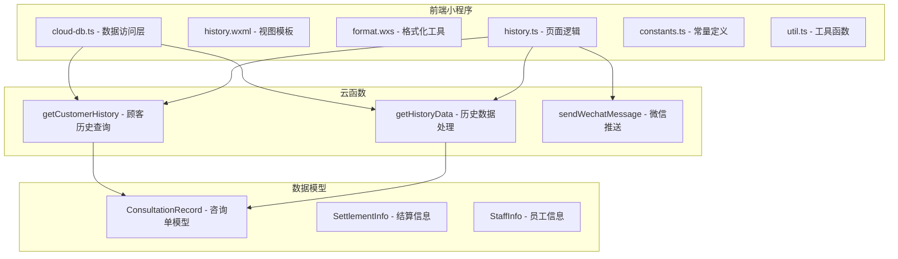
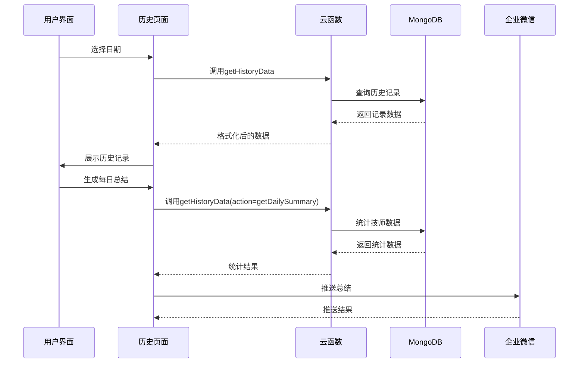
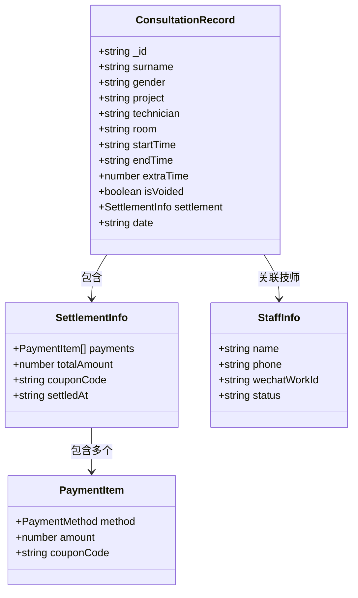
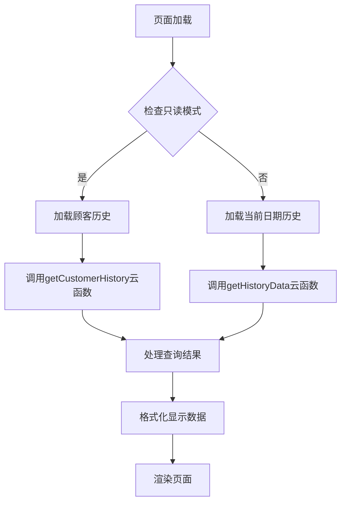
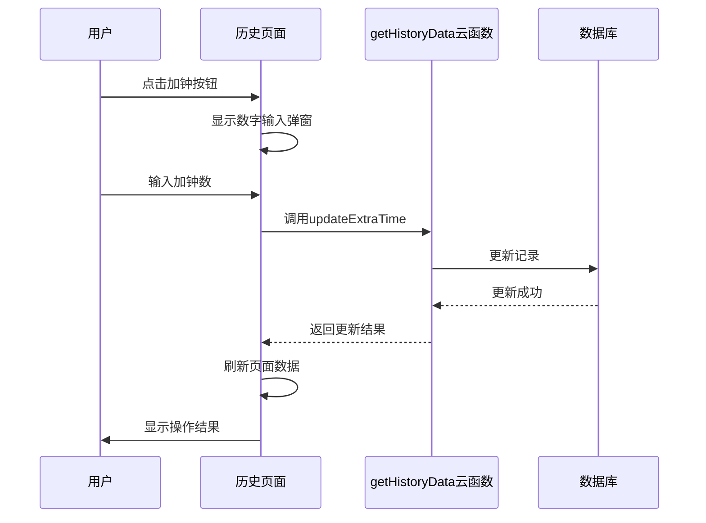
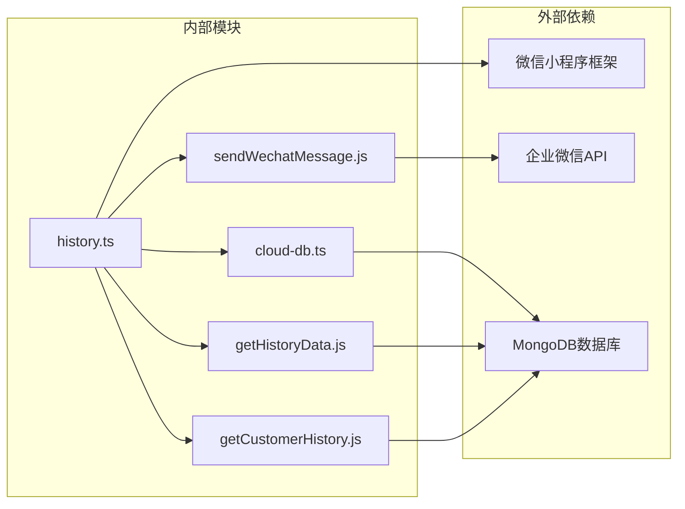
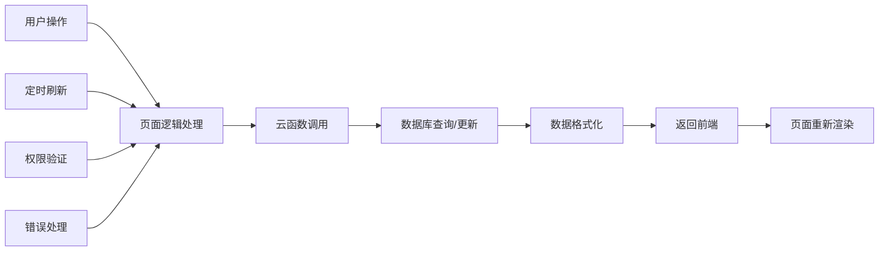

# 历史记录系统文档

<cite>
**本文档中引用的文件**
- [miniprogram/pages/history/history.ts](file://miniprogram/pages/history/history.ts)
- [miniprogram/pages/history/history.wxml](file://miniprogram/pages/history/history.wxml)
- [miniprogram/pages/history/history.json](file://miniprogram/pages/history/history.json)
- [miniprogram/pages/history/format.wxs](file://miniprogram/pages/history/format.wxs)
- [cloudfunctions/getHistoryData/index.js](file://cloudfunctions/getHistoryData/index.js)
- [cloudfunctions/getCustomerHistory/index.js](file://cloudfunctions/getCustomerHistory/index.js)
- [cloudfunctions/sendWechatMessage/index.js](file://cloudfunctions/sendWechatMessage/index.js)
- [miniprogram/utils/cloud-db.ts](file://miniprogram/utils/cloud-db.ts)
- [miniprogram/utils/constants.ts](file://miniprogram/utils/constants.ts)
- [miniprogram/utils/util.ts](file://miniprogram/utils/util.ts)
- [miniprogram/app.ts](file://miniprogram/app.ts)
- [typings/index.d.ts](file://typings/index.d.ts)
</cite>

## 目录
1. [简介](#简介)
2. [项目结构](#项目结构)
3. [核心组件](#核心组件)
4. [架构概览](#架构概览)
5. [详细组件分析](#详细组件分析)
6. [依赖关系分析](#依赖关系分析)
7. [性能考虑](#性能考虑)
8. [故障排除指南](#故障排除指南)
9. [结论](#结论)

## 简介

历史记录系统是咨询管理系统的核心功能模块，负责展示和管理历史咨询单记录。该系统提供了完整的CRUD操作、实时数据同步、权限控制和企业微信集成等功能。用户可以通过日期筛选查看特定日期的历史记录，支持按技师、项目等维度进行统计分析。

## 项目结构

历史记录系统采用前后端分离的架构设计，主要由以下组件构成：

**图表来源**
- [miniprogram/pages/history/history.ts](file://miniprogram/pages/history/history.ts#L1-L747)
- [cloudfunctions/getHistoryData/index.js](file://cloudfunctions/getHistoryData/index.js#L1-L411)

**章节来源**
- [miniprogram/pages/history/history.ts](file://miniprogram/pages/history/history.ts#L1-L747)
- [miniprogram/pages/history/history.wxml](file://miniprogram/pages/history/history.wxml#L1-L176)

## 核心组件

### 历史记录页面 (history.ts)

历史记录页面是整个系统的核心控制器，负责处理用户交互和数据展示。主要功能包括：

- **数据加载与缓存**：支持按日期加载历史记录，自动缓存用户操作状态
- **实时数据更新**：监听页面显示事件，确保数据实时性
- **权限控制**：基于用户角色控制操作按钮的显示和可用性
- **多语言支持**：支持中英文混合显示，提供友好的用户体验

### 云函数服务

#### getHistoryData 云函数
负责处理历史数据的各种操作：
- 加载单日历史记录
- 生成每日统计报告
- 计算技师工作统计
- 处理加钟和加班计算

#### getCustomerHistory 云函数
专门处理顾客历史查询：
- 支持手机号查询历史记录
- 整合咨询单和会员信息
- 提供详细的消费统计

#### sendWechatMessage 云函数
集成企业微信推送功能：
- 支持Markdown格式消息
- 自动处理推送状态
- 提供错误重试机制

**章节来源**
- [cloudfunctions/getHistoryData/index.js](file://cloudfunctions/getHistoryData/index.js#L88-L410)
- [cloudfunctions/getCustomerHistory/index.js](file://cloudfunctions/getCustomerHistory/index.js#L9-L99)
- [cloudfunctions/sendWechatMessage/index.js](file://cloudfunctions/sendWechatMessage/index.js#L10-L64)

## 架构概览

历史记录系统采用三层架构设计，确保了良好的可维护性和扩展性：

**图表来源**
- [miniprogram/pages/history/history.ts](file://miniprogram/pages/history/history.ts#L156-L193)
- [cloudfunctions/getHistoryData/index.js](file://cloudfunctions/getHistoryData/index.js#L252-L394)

系统架构特点：
- **响应式设计**：支持移动端和桌面端访问
- **实时同步**：页面显示时自动刷新数据
- **权限分级**：不同角色拥有不同的操作权限
- **数据安全**：所有数据操作都经过权限验证

## 详细组件分析

### 数据模型设计

系统采用强类型设计，确保数据的一致性和完整性：

**图表来源**
- [typings/index.d.ts](file://typings/index.d.ts#L37-L83)
- [typings/index.d.ts](file://typings/index.d.ts#L22-L35)
- [typings/index.d.ts](file://typings/index.d.ts#L89-L97)

### 核心业务流程

#### 历史记录加载流程

**图表来源**
- [miniprogram/pages/history/history.ts](file://miniprogram/pages/history/history.ts#L88-L100)
- [miniprogram/pages/history/history.ts](file://miniprogram/pages/history/history.ts#L124-L154)

#### 加钟操作流程

**图表来源**
- [miniprogram/pages/history/history.ts](file://miniprogram/pages/history/history.ts#L518-L656)
- [cloudfunctions/getHistoryData/index.js](file://cloudfunctions/getHistoryData/index.js#L658-L687)

### 权限控制系统

系统实现了细粒度的权限控制机制：

| 功能 | 权限键 | 角色要求 | 描述 |
|------|--------|----------|------|
| 查看历史 | canAccessHistory | 所有角色 | 访问历史记录页面 |
| 修改咨询单 | canEditConsultation | 管理员/收银员 | 编辑咨询单信息 |
| 作废咨询单 | canVoidConsultation | 管理员 | 标记咨询单作废 |
| 删除咨询单 | canDeleteConsultation | 管理员 | 物理删除记录 |
| 生成总结 | 无 | 所有角色 | 生成每日统计报告 |

**章节来源**
- [miniprogram/pages/history/history.ts](file://miniprogram/pages/history/history.ts#L89-L92)
- [typings/index.d.ts](file://typings/index.d.ts#L258-L285)

## 依赖关系分析

历史记录系统的主要依赖关系如下：

**图表来源**
- [miniprogram/utils/cloud-db.ts](file://miniprogram/utils/cloud-db.ts#L12-L47)
- [cloudfunctions/getHistoryData/index.js](file://cloudfunctions/getHistoryData/index.js#L1-L5)

### 数据流分析

系统采用双向数据流设计，确保数据的实时性和一致性：

**图表来源**
- [miniprogram/pages/history/history.ts](file://miniprogram/pages/history/history.ts#L103-L113)
- [miniprogram/utils/cloud-db.ts](file://miniprogram/utils/cloud-db.ts#L170-L188)

**章节来源**
- [miniprogram/utils/cloud-db.ts](file://miniprogram/utils/cloud-db.ts#L1-L321)
- [cloudfunctions/getHistoryData/index.js](file://cloudfunctions/getHistoryData/index.js#L1-L411)

## 性能考虑

### 数据优化策略

1. **分页加载**：历史记录采用分页加载机制，避免一次性加载大量数据
2. **缓存机制**：页面状态和用户操作结果进行本地缓存
3. **懒加载**：图片和复杂组件采用懒加载策略
4. **防抖处理**：频繁的用户操作进行防抖处理

### 并发控制

系统实现了完善的并发控制机制：
- **请求去重**：相同请求在执行期间会被去重
- **锁机制**：关键操作使用锁防止并发冲突
- **超时处理**：网络请求设置合理的超时时间
- **重试机制**：失败的操作自动重试

## 故障排除指南

### 常见问题及解决方案

#### 数据加载失败
**症状**：历史记录页面显示空白或加载失败
**可能原因**：
- 网络连接异常
- 云函数执行超时
- 数据库查询错误

**解决步骤**：
1. 检查网络连接状态
2. 刷新页面重试
3. 查看云函数日志
4. 验证数据库连接

#### 权限不足
**症状**：某些操作按钮不可用
**解决方法**：
1. 检查用户角色配置
2. 重新登录系统
3. 联系管理员调整权限

#### 数据同步问题
**症状**：页面显示的数据不是最新的
**解决方法**：
1. 下拉刷新页面
2. 检查页面生命周期
3. 验证自动刷新机制

**章节来源**
- [miniprogram/pages/history/history.ts](file://miniprogram/pages/history/history.ts#L245-L266)
- [miniprogram/utils/cloud-db.ts](file://miniprogram/utils/cloud-db.ts#L170-L188)

## 结论

历史记录系统是一个功能完整、架构清晰的咨询管理模块。系统采用了现代化的技术栈和设计模式，具备以下优势：

1. **用户体验优秀**：响应式设计，操作流畅
2. **功能完整**：涵盖历史记录的所有核心功能
3. **安全性高**：完善的权限控制和数据验证
4. **可扩展性强**：模块化设计便于功能扩展
5. **维护成本低**：清晰的代码结构和完善的文档

该系统为咨询业务提供了强有力的技术支撑，能够满足日常运营的各种需求，并为未来的功能扩展奠定了良好的基础。