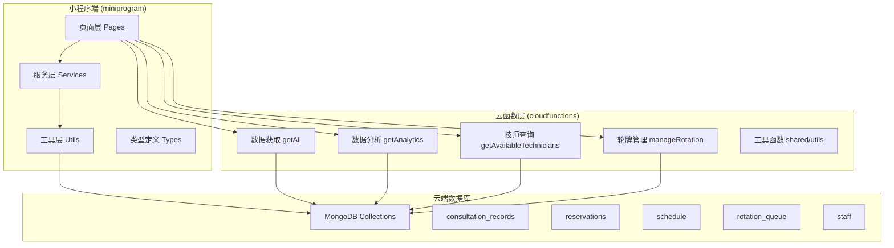
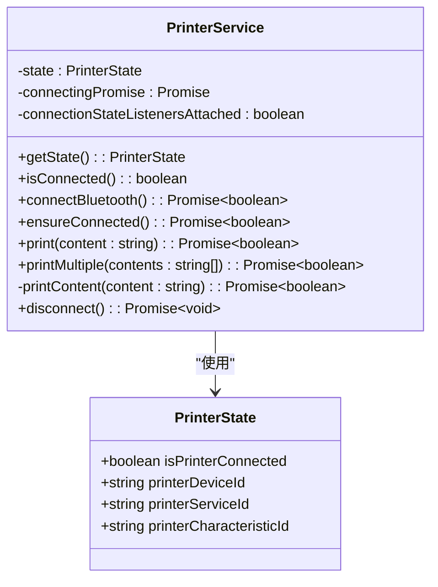
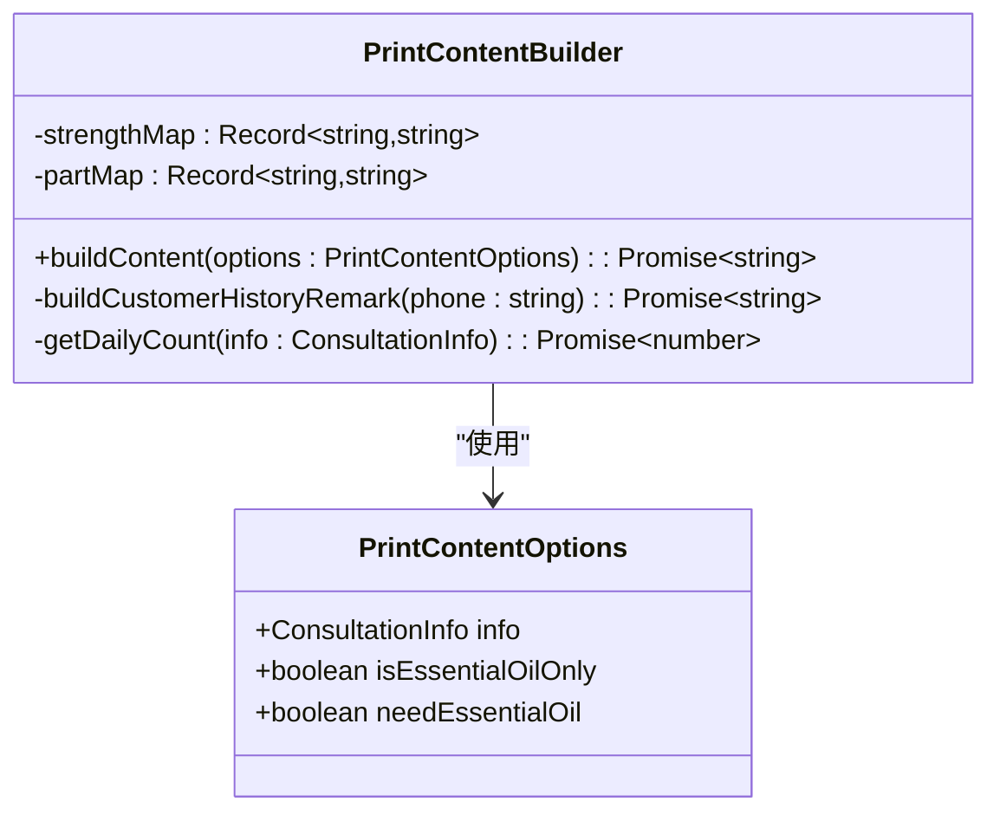
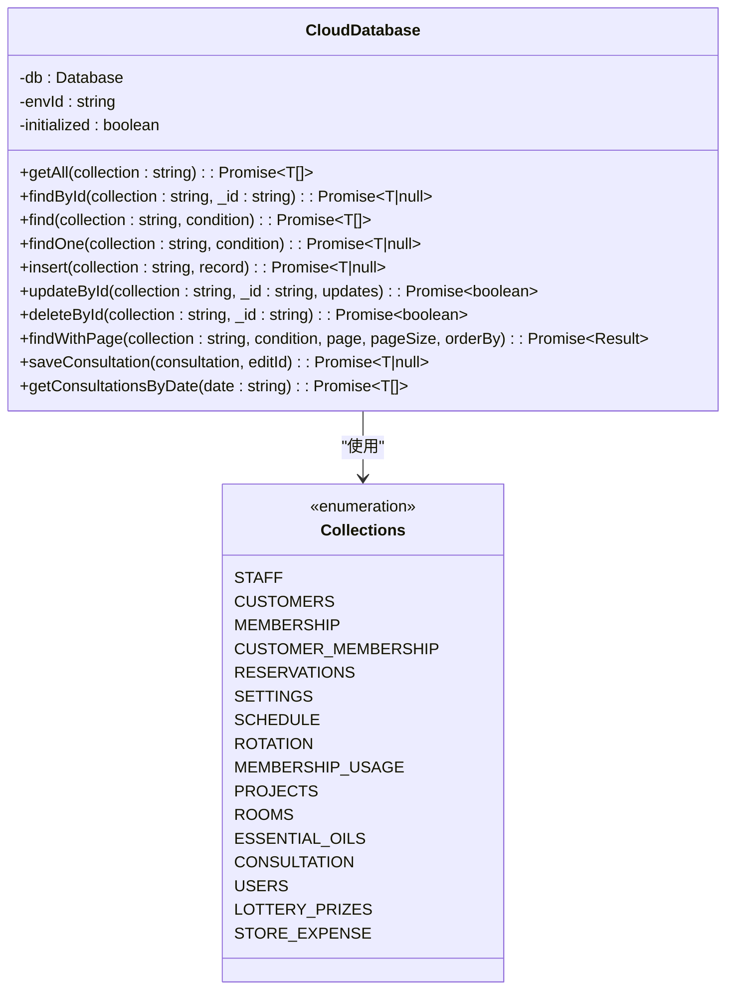
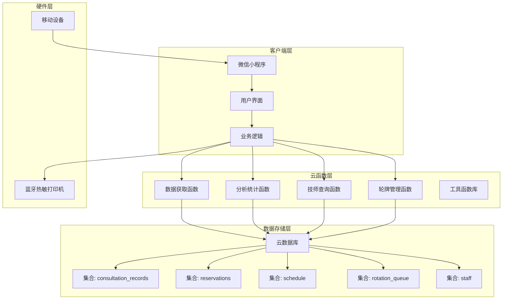
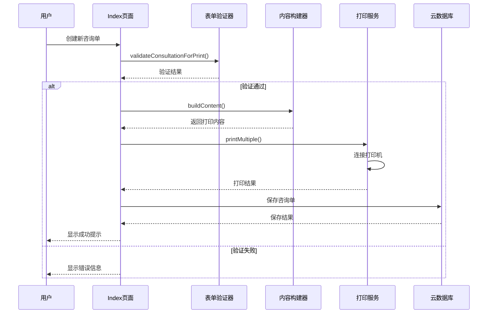
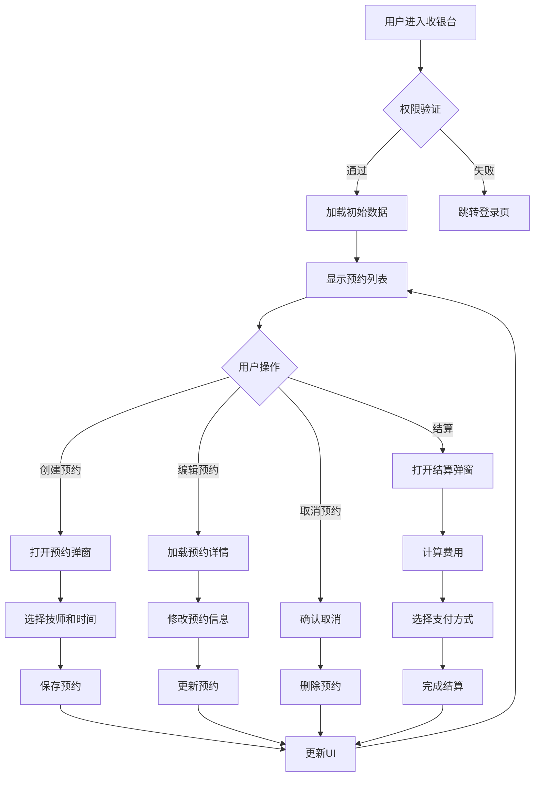
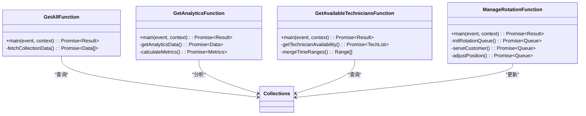
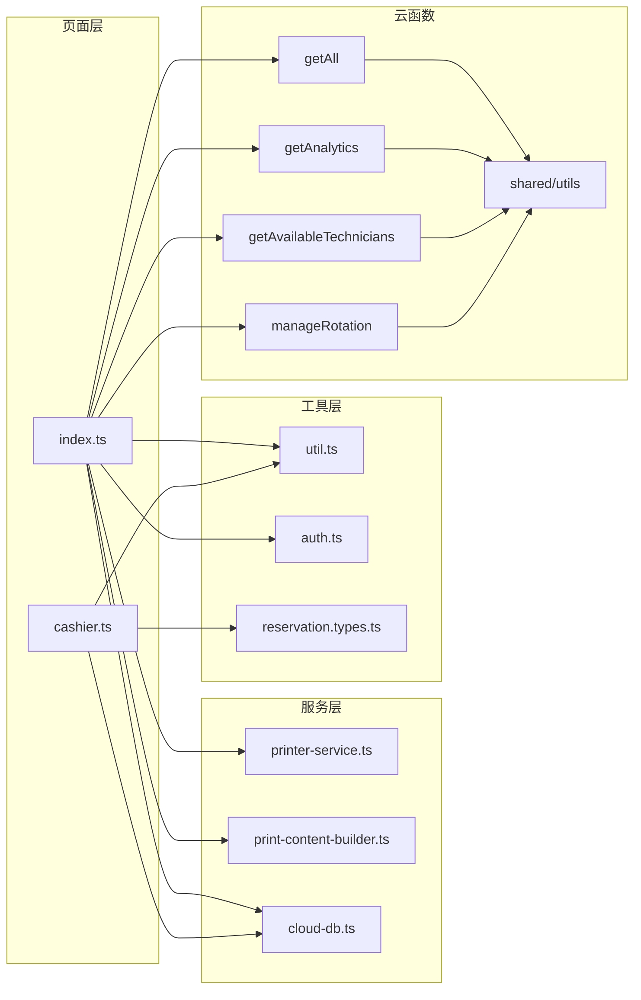

# 咨询单打印系统

<cite>
**本文档引用的文件**
- [package.json](file://package.json)
- [app.json](file://miniprogram/app.json)
- [index.ts](file://miniprogram/pages/index/index.ts)
- [printer-service.ts](file://miniprogram/services/printer-service.ts)
- [print-content-builder.ts](file://miniprogram/services/print-content-builder.ts)
- [cloud-db.ts](file://miniprogram/utils/cloud-db.ts)
- [cashier.ts](file://miniprogram/pages/cashier/cashier.ts)
- [index.js](file://cloudfunctions/getAll/index.js)
- [index.js](file://cloudfunctions/getAnalytics/index.js)
- [index.js](file://cloudfunctions/getAvailableTechnicians/index.js)
- [index.js](file://cloudfunctions/manageRotation/index.js)
- [utils.js](file://cloudfunctions/shared/utils.js)
- [reservation.types.ts](file://miniprogram/types/reservation.types.ts)
- [util.ts](file://miniprogram/utils/util.ts)
- [auth.ts](file://miniprogram/utils/auth.ts)
</cite>

## 目录
1. [项目概述](#项目概述)
2. [项目结构](#项目结构)
3. [核心组件](#核心组件)
4. [架构概览](#架构概览)
5. [详细组件分析](#详细组件分析)
6. [依赖关系分析](#依赖关系分析)
7. [性能考虑](#性能考虑)
8. [故障排除指南](#故障排除指南)
9. [结论](#结论)

## 项目概述

咨询单打印系统是一个基于微信小程序开发的专业SPA按摩店管理系统。该系统集成了蓝牙热敏打印机、云数据库、预约管理、轮牌系统和数据分析等功能，为SPA按摩店提供完整的数字化解决方案。

### 主要功能特性

- **智能打印系统**：支持蓝牙热敏打印机，自动生成咨询单据
- **预约管理**：完整的预约创建、编辑、取消和到店确认流程
- **轮牌系统**：智能化技师轮牌管理，支持优先级排序
- **数据分析**：实时业务数据分析和统计报表
- **权限管理**：基于角色的访问控制和权限验证
- **移动端优化**：响应式设计，支持横竖屏切换

## 项目结构

项目采用典型的微信小程序三层架构设计：

**图表来源**
- [app.json:1-37](file://miniprogram/app.json#L1-L37)
- [package.json:1-28](file://package.json#L1-L28)

**章节来源**
- [package.json:1-28](file://package.json#L1-L28)
- [miniprogram/app.json:1-37](file://miniprogram/app.json#L1-L37)

## 核心组件

### 打印服务组件

打印服务组件是整个系统的核心硬件接口，负责与蓝牙热敏打印机进行通信。

**图表来源**
- [printer-service.ts:10-330](file://miniprogram/services/printer-service.ts#L10-L330)

### 咨询单内容构建器

咨询单内容构建器负责生成符合打印格式的咨询单内容。

**图表来源**
- [print-content-builder.ts:22-149](file://miniprogram/services/print-content-builder.ts#L22-L149)

### 云数据库管理

云数据库管理器提供统一的数据访问接口，封装了所有数据库操作。

**图表来源**
- [cloud-db.ts:12-323](file://miniprogram/utils/cloud-db.ts#L12-L323)

**章节来源**
- [printer-service.ts:1-330](file://miniprogram/services/printer-service.ts#L1-L330)
- [print-content-builder.ts:1-149](file://miniprogram/services/print-content-builder.ts#L1-L149)
- [cloud-db.ts:1-323](file://miniprogram/utils/cloud-db.ts#L1-L323)

## 架构概览

系统采用前后端分离架构，通过云函数实现后端逻辑，小程序前端负责用户交互。

**图表来源**
- [index.ts:1-734](file://miniprogram/pages/index/index.ts#L1-L734)
- [cashier.ts:1-543](file://miniprogram/pages/cashier/cashier.ts#L1-L543)

## 详细组件分析

### 首页咨询单管理

首页是系统的核心功能页面，提供完整的咨询单创建、编辑和打印功能。

**图表来源**
- [index.ts:268-329](file://miniprogram/pages/index/index.ts#L268-L329)
- [print-content-builder.ts:43-98](file://miniprogram/services/print-content-builder.ts#L43-L98)
- [printer-service.ts:231-258](file://miniprogram/services/printer-service.ts#L231-L258)

### 收银台预约管理

收银台页面提供预约管理的完整功能，包括预约创建、编辑、取消和结算。

**图表来源**
- [cashier.ts:287-338](file://miniprogram/pages/cashier/cashier.ts#L287-L338)
- [reservation.types.ts:5-25](file://miniprogram/types/reservation.types.ts#L5-L25)

### 云函数数据处理

云函数层提供各种数据处理和业务逻辑功能。

**图表来源**
- [index.js:9-58](file://cloudfunctions/getAll/index.js#L9-L58)
- [index.js:52-67](file://cloudfunctions/getAnalytics/index.js#L52-L67)
- [index.js:18-164](file://cloudfunctions/getAvailableTechnicians/index.js#L18-L164)
- [index.js:11-38](file://cloudfunctions/manageRotation/index.js#L11-L38)

**章节来源**
- [index.ts:1-734](file://miniprogram/pages/index/index.ts#L1-L734)
- [cashier.ts:1-543](file://miniprogram/pages/cashier/cashier.ts#L1-L543)
- [index.js:1-59](file://cloudfunctions/getAll/index.js#L1-L59)
- [index.js:1-351](file://cloudfunctions/getAnalytics/index.js#L1-L351)
- [index.js:1-640](file://cloudfunctions/getAvailableTechnicians/index.js#L1-L640)
- [index.js:1-356](file://cloudfunctions/manageRotation/index.js#L1-L356)

## 依赖关系分析

系统各组件之间的依赖关系如下：

**图表来源**
- [index.ts:1-14](file://miniprogram/pages/index/index.ts#L1-L14)
- [cashier.ts:1-12](file://miniprogram/pages/cashier/cashier.ts#L1-L12)
- [printer-service.ts:1-3](file://miniprogram/services/printer-service.ts#L1-L3)
- [print-content-builder.ts:1-3](file://miniprogram/services/print-content-builder.ts#L1-L3)
- [cloud-db.ts:1-3](file://miniprogram/utils/cloud-db.ts#L1-L3)

**章节来源**
- [util.ts:1-165](file://miniprogram/utils/util.ts#L1-L165)
- [auth.ts:1-249](file://miniprogram/utils/auth.ts#L1-L249)
- [reservation.types.ts:1-109](file://miniprogram/types/reservation.types.ts#L1-L109)

## 性能考虑

### 数据查询优化

系统采用了多种数据查询优化策略：

1. **分页查询**：使用`findWithPage`方法实现分页加载
2. **批量操作**：使用`getAll`函数一次性获取集合所有数据
3. **并行查询**：在云函数中使用`Promise.all`并行获取多个集合数据

### 打印性能优化

1. **分块传输**：蓝牙打印采用50字节分块传输，避免超时
2. **连接复用**：维护打印机连接状态，避免重复连接
3. **错误恢复**：打印失败时自动断开并重新连接

### 内存管理

1. **对象池**：合理管理临时对象的创建和销毁
2. **异步处理**：使用Promise避免阻塞主线程
3. **资源清理**：及时清理蓝牙设备监听器

## 故障排除指南

### 打印机连接问题

**问题症状**：无法连接蓝牙打印机

**解决步骤**：
1. 检查蓝牙是否开启
2. 确认打印机处于配对模式
3. 重新启动小程序
4. 检查设备兼容性

**相关代码路径**：
- [printer-service.ts:50-112](file://miniprogram/services/printer-service.ts#L50-L112)

### 数据同步问题

**问题症状**：页面数据显示不正确

**解决步骤**：
1. 检查网络连接状态
2. 刷新页面数据
3. 清除本地缓存
4. 重新登录系统

**相关代码路径**：
- [cloud-db.ts:69-88](file://miniprogram/utils/cloud-db.ts#L69-L88)
- [auth.ts:82-130](file://miniprogram/utils/auth.ts#L82-L130)

### 权限验证问题

**问题症状**：访问受限页面被拒绝

**解决步骤**：
1. 检查用户角色权限
2. 验证token有效性
3. 重新登录系统
4. 联系管理员升级权限

**相关代码路径**：
- [auth.ts:228-249](file://miniprogram/utils/auth.ts#L228-L249)
- [index.ts:131-136](file://miniprogram/pages/index/index.ts#L131-L136)

**章节来源**
- [printer-service.ts:1-330](file://miniprogram/services/printer-service.ts#L1-L330)
- [cloud-db.ts:1-323](file://miniprogram/utils/cloud-db.ts#L1-L323)
- [auth.ts:1-249](file://miniprogram/utils/auth.ts#L1-L249)

## 结论

咨询单打印系统是一个功能完善、架构清晰的SPA按摩店管理解决方案。系统通过模块化的组件设计、完善的错误处理机制和优化的性能策略，为用户提供了一站式的数字化服务体验。

### 系统优势

1. **功能完整性**：涵盖从预约到结算的完整业务流程
2. **技术先进性**：采用最新的微信小程序技术和云开发服务
3. **用户体验**：简洁直观的操作界面和流畅的交互体验
4. **扩展性强**：模块化设计便于功能扩展和维护

### 技术特色

1. **智能打印**：集成蓝牙热敏打印机，支持多联单打印
2. **实时分析**：提供业务数据实时统计和分析
3. **权限控制**：基于角色的精细化权限管理
4. **数据安全**：采用云开发的安全认证机制

该系统为SPA按摩店提供了现代化的管理工具，有效提升了运营效率和服务质量。