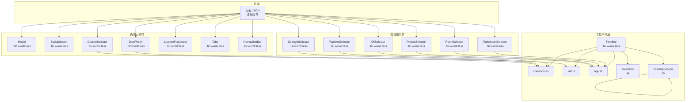
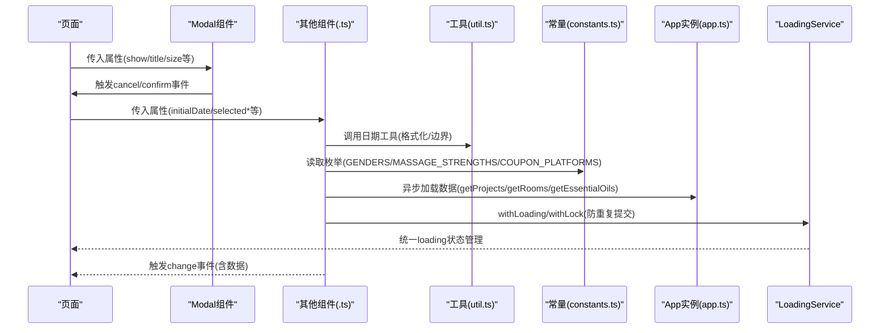
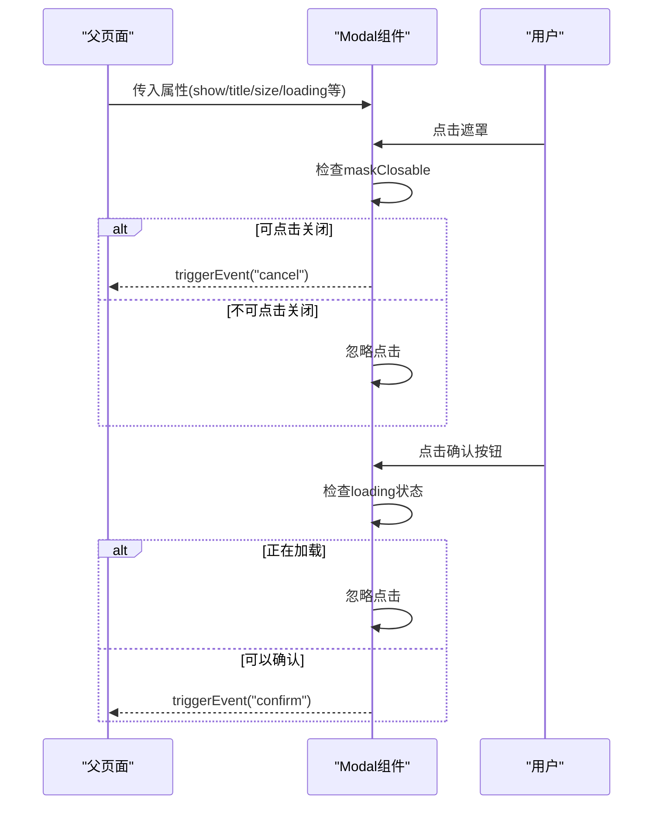
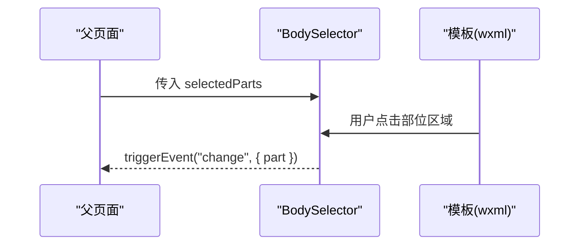
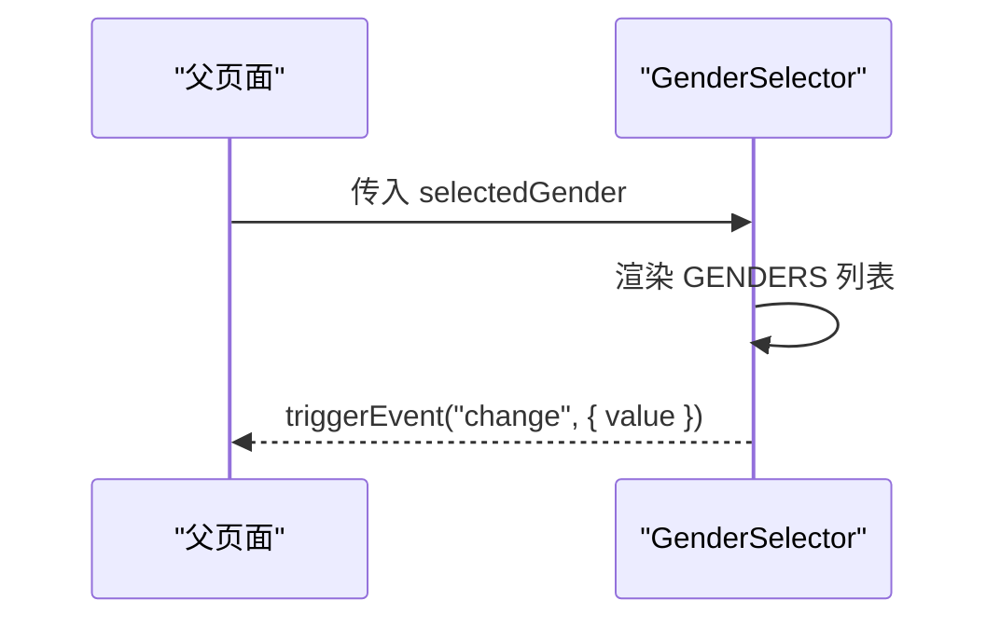
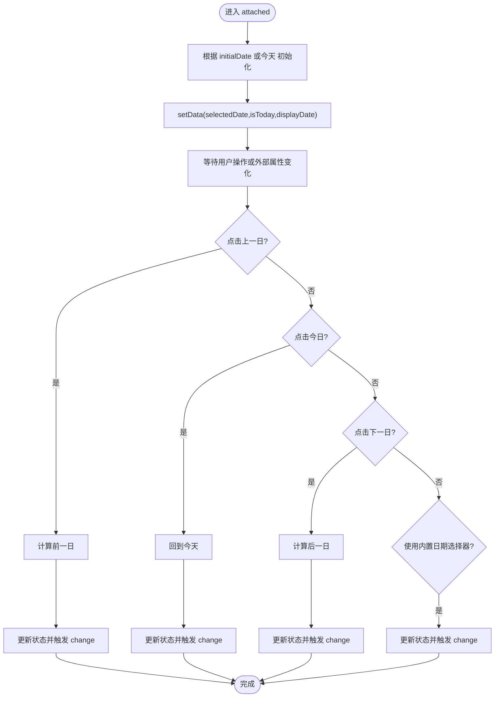
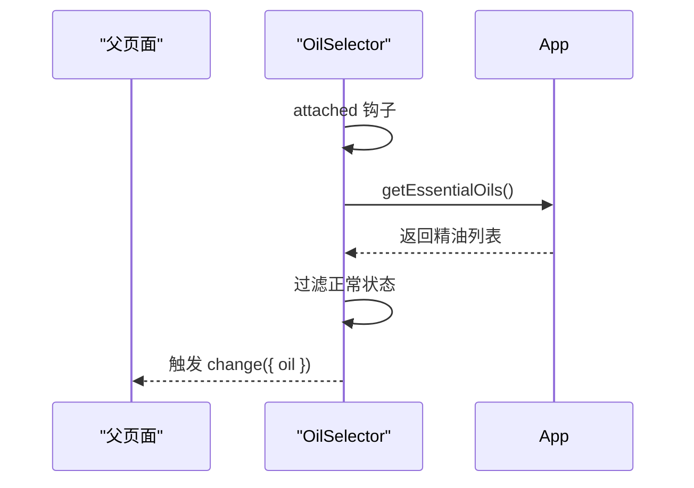
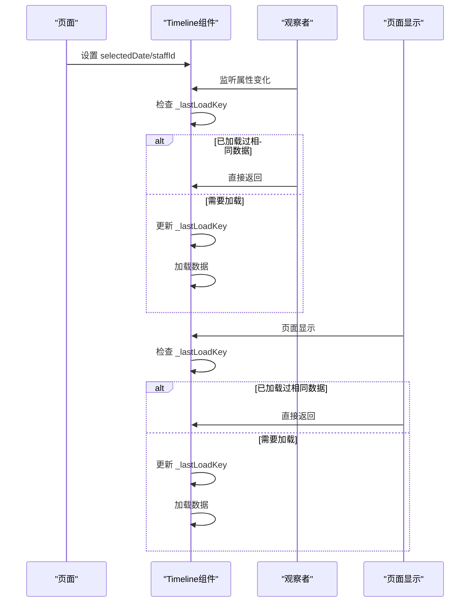
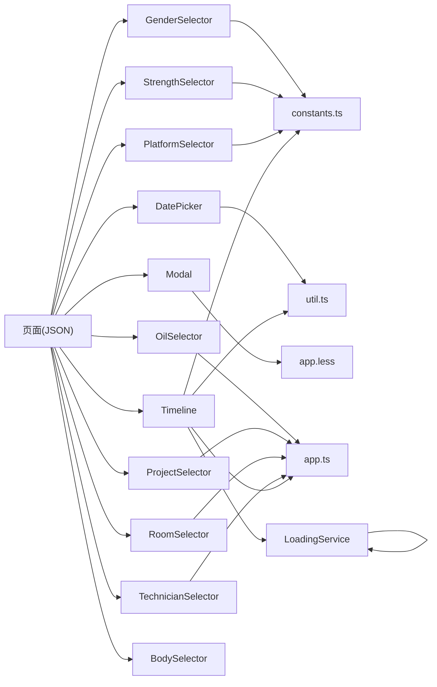

# UI组件系统

<cite>
**本文引用的文件**
- [miniprogram/components/body-selector/body-selector.ts](file://miniprogram/components/body-selector/body-selector.ts)
- [miniprogram/components/body-selector/body-selector.wxml](file://miniprogram/components/body-selector/body-selector.wxml)
- [miniprogram/components/body-selector/body-selector.less](file://miniprogram/components/body-selector/body-selector.less)
- [miniprogram/components/gender-selector/gender-selector.ts](file://miniprogram/components/gender-selector/gender-selector.ts)
- [miniprogram/components/gender-selector/gender-selector.wxml](file://miniprogram/components/gender-selector/gender-selector.wxml)
- [miniprogram/components/gender-selector/gender-selector.less](file://miniprogram/components/gender-selector/gender-selector.less)
- [miniprogram/components/date-picker/date-picker.ts](file://miniprogram/components/date-picker/date-picker.ts)
- [miniprogram/components/date-picker/date-picker.wxml](file://miniprogram/components/date-picker/date-picker.wxml)
- [miniprogram/components/modal/modal.ts](file://miniprogram/components/modal/modal.ts)
- [miniprogram/components/modal/modal.wxml](file://miniprogram/components/modal/modal.wxml)
- [miniprogram/components/modal/modal.less](file://miniprogram/components/modal/modal.less)
- [miniprogram/components/modal/modal.json](file://miniprogram/components/modal/modal.json)
- [miniprogram/utils/util.ts](file://miniprogram/utils/util.ts)
- [miniprogram/utils/constants.ts](file://miniprogram/utils/constants.ts)
- [miniprogram/app.ts](file://miniprogram/app.ts)
- [miniprogram/pages/index/index.json](file://miniprogram/pages/index/index.json)
- [miniprogram/components/oil-selector/oil-selector.ts](file://miniprogram/components/oil-selector/oil-selector.ts)
- [miniprogram/components/strength-selector/strength-selector.ts](file://miniprogram/components/strength-selector/strength-selector.ts)
- [miniprogram/components/project-selector/project-selector.ts](file://miniprogram/components/project-selector/project-selector.ts)
- [miniprogram/components/technician-selector/technician-selector.ts](file://miniprogram/components/technician-selector/technician-selector.ts)
- [miniprogram/components/room-selector/room-selector.ts](file://miniprogram/components/room-selector/room-selector.ts)
- [miniprogram/components/platform-selector/platform-selector.ts](file://miniprogram/components/platform-selector/platform-selector.ts)
- [miniprogram/components/tabs/tabs.ts](file://miniprogram/components/tabs/tabs.ts)
- [miniprogram/components/navigation-bar/navigation-bar.ts](file://miniprogram/components/navigation-bar/navigation-bar.ts)
- [miniprogram/components/license-plate-input/license-plate-input.ts](file://miniprogram/components/license-plate-input/license-plate-input.ts)
- [miniprogram/components/timeline/timeline.ts](file://miniprogram/components/timeline/timeline.ts)
- [miniprogram/components/timeline/timeline.wxml](file://miniprogram/components/timeline/timeline.wxml)
- [miniprogram/components/timeline/timeline.less](file://miniprogram/components/timeline/timeline.less)
- [miniprogram/components/timeline/timeline.json](file://miniprogram/components/timeline/timeline.json)
- [miniprogram/components/wx-charts/index.ts](file://miniprogram/components/wx-charts/index.ts)
- [miniprogram/utils/wx-charts.js](file://miniprogram/utils/wx-charts.js)
- [miniprogram/app.less](file://miniprogram/app.less)
- [miniprogram/pages/cashier/cashier.ts](file://miniprogram/pages/cashier/cashier.ts)
- [miniprogram/utils/loading-service.ts](file://miniprogram/utils/loading-service.ts)
- [miniprogram/pages/cashier/services/data-loader.service.ts](file://miniprogram/pages/cashier/services/data-loader.service.ts)
</cite>

## 更新摘要
**变更内容**
- 更新Timeline组件的重复加载预防机制：新增_lastLoadKey属性来跟踪加载状态，防止组件观察者和页面生命周期同时触发数据加载时的重复请求
- 增强Cashier页面的初始化冲突预防机制：新增_isFirstShow属性来防止首次加载时onLoad和onShow重复请求
- 更新LoadingService的防重复提交机制，提供更完善的并发控制
- 完善组件间通信与数据加载协调机制

## 目录
1. [简介](#简介)
2. [项目结构](#项目结构)
3. [核心组件](#核心组件)
4. [架构总览](#架构总览)
5. [详细组件分析](#详细组件分析)
6. [依赖关系分析](#依赖关系分析)
7. [性能考虑](#性能考虑)
8. [故障排查指南](#故障排查指南)
9. [结论](#结论)
10. [附录](#附录)

## 简介
本文件为该小程序UI组件系统的全面组件文档，重点覆盖可复用UI组件的功能、API与使用方式；深入解析BodySelector（身体部位选择器）、GenderSelector（性别选择器）、DatePicker（日期选择器）、Modal（模态框）等核心组件的实现细节；阐述属性配置、事件处理、样式定制、生命周期管理、数据绑定与状态同步机制；解释组件间通信与组合使用方法；并提供响应式设计、无障碍访问与跨浏览器兼容性建议；最后给出最佳实践、性能优化与扩展指导，以及完整使用示例与自定义组件开发指南。

## 项目结构
UI组件主要位于 miniprogram/components 下，每个组件由类型相同的四个文件组成：.json（配置）、.wxml（模板）、.less（样式）、.ts（逻辑）。页面通过在 JSON 中注册 usingComponents 使用组件。全局常量与工具函数位于 utils 目录，应用级数据加载与服务接口位于 app.ts。新增的Modal组件作为统一的模态框解决方案，提供标准化的对话框界面。



**图表来源**
- [miniprogram/pages/index/index.json:1-14](file://miniprogram/pages/index/index.json#L1-L14)
- [miniprogram/components/modal/modal.ts:1-72](file://miniprogram/components/modal/modal.ts#L1-L72)
- [miniprogram/components/body-selector/body-selector.ts:1-27](file://miniprogram/components/body-selector/body-selector.ts#L1-L27)
- [miniprogram/components/gender-selector/gender-selector.ts:1-22](file://miniprogram/components/gender-selector/gender-selector.ts#L1-L22)
- [miniprogram/components/date-picker/date-picker.ts:1-101](file://miniprogram/components/date-picker/date-picker.ts#L1-L101)
- [miniprogram/components/oil-selector/oil-selector.ts:1-37](file://miniprogram/components/oil-selector/oil-selector.ts#L1-L37)
- [miniprogram/components/strength-selector/strength-selector.ts:1-19](file://miniprogram/components/strength-selector/strength-selector.ts#L1-L19)
- [miniprogram/components/project-selector/project-selector.ts:1-38](file://miniprogram/components/project-selector/project-selector.ts#L1-L38)
- [miniprogram/components/technician-selector/technician-selector.ts:1-35](file://miniprogram/components/technician-selector/technician-selector.ts#L1-L35)
- [miniprogram/components/room-selector/room-selector.ts:1-44](file://miniprogram/components/room-selector/room-selector.ts#L1-L44)
- [miniprogram/components/platform-selector/platform-selector.ts:1-22](file://miniprogram/components/platform-selector/platform-selector.ts#L1-L22)
- [miniprogram/components/tabs/tabs.ts:1-20](file://miniprogram/components/tabs/tabs.ts#L1-L20)
- [miniprogram/components/navigation-bar/navigation-bar.ts:1-114](file://miniprogram/components/navigation-bar/navigation-bar.ts#L1-L114)
- [miniprogram/components/license-plate-input/license-plate-input.ts:1-226](file://miniprogram/components/license-plate-input/license-plate-input.ts#L1-L226)
- [miniprogram/components/timeline/timeline.ts:1-504](file://miniprogram/components/timeline/timeline.ts#L1-L504)
- [miniprogram/utils/constants.ts:1-49](file://miniprogram/utils/constants.ts#L1-L49)
- [miniprogram/utils/util.ts:1-150](file://miniprogram/utils/util.ts#L1-L150)
- [miniprogram/app.ts:1-191](file://miniprogram/app.ts#L1-L191)
- [miniprogram/utils/loading-service.ts:1-285](file://miniprogram/utils/loading-service.ts#L1-L285)

**章节来源**
- [miniprogram/pages/index/index.json:1-14](file://miniprogram/pages/index/index.json#L1-L14)

## 核心组件
本节概述各组件职责、关键属性与事件，便于快速理解与选型。

### 通用UI组件
- Modal（模态框）
  - 功能：提供统一的模态框界面，支持标题、关闭按钮、页脚按钮、加载状态和遮罩点击处理。
  - 关键属性：show（显示状态）、title（标题文本）、size（尺寸模式）、showClose（是否显示关闭按钮）、showFooter（是否显示页脚）、cancelText（取消按钮文本）、confirmText（确认按钮文本）、loading（加载状态）、loadingText（加载提示文本）、maskClosable（遮罩是否可点击关闭）。
  - 事件：cancel（取消事件）、confirm（确认事件）。
  - 模板与样式：通过wxml渲染模态框容器，less控制布局、尺寸和交互态。
  - 特点：支持插槽内容、响应式设计、主题化样式。

- BodySelector（身体部位选择器）
  - 功能：以人体图像为背景，点击不同部位触发 change 事件，携带被选中部位标识。
  - 关键属性：selectedParts（对象，键为部位标识，值为是否选中）。
  - 事件：change(part)。
  - 模板与样式：通过 wxml 渲染部位区域，less 控制选中态与定位。
  - 数据源：内部预置部位列表。

- GenderSelector（性别选择器）
  - 功能：展示性别选项，点击切换选中项，触发 change 事件。
  - 关键属性：selectedGender（当前选中性别标识）。
  - 事件：change(value)。
  - 数据源：从 constants.ts 导入性别枚举。

- DatePicker（日期选择器）
  - 功能：支持"上一日/今日/日期选择器/下一日"导航，触发 change 事件并返回日期字符串。
  - 关键属性：initialDate（初始日期）。
  - 生命周期：attached 时初始化 selectedDate/isToday/displayDate；observer 监听 initialDate 变化。
  - 事件：change({ date })。
  - 工具：使用 util.ts 的日期工具函数。

### 选择器组件
- OilSelector（精油选择器）
  - 功能：异步加载可用精油列表，点击触发 change(oil)。
  - 关键属性：selectedOil（当前选中精油标识）。
  - 生命周期：attached 时加载数据。
  - 数据源：通过 app.ts 提供的 getEssentialOils 接口获取。

- StrengthSelector（按摩强度选择器）
  - 功能：展示强度选项，点击触发 change({ strength })。
  - 关键属性：selectedStrength（当前选中强度标识）。
  - 数据源：constants.ts。

- ProjectSelector（项目选择器）
  - 功能：异步加载可用项目列表，点击触发 change({ project })。
  - 关键属性：selectedProject（当前选中项目名）。
  - 生命周期：attached 时加载数据。
  - 数据源：app.ts 的 getProjects。

- TechnicianSelector（技师选择器）
  - 功能：展示技师列表，支持多选与打卡徽章显示，触发 change 或 toggleClockIn。
  - 关键属性：selectedTechnician、selectedIds、technicianList、multi、showClockInBadge。
  - 事件：change(...)、toggleClockIn({ _id, isClockIn })。

- RoomSelector（房间选择器）
  - 功能：异步加载可用房间列表，点击触发 change({ room })。
  - 关键属性：selectedRoom、disabled。
  - 生命周期：attached 时加载数据。
  - 数据源：app.ts 的 getRooms。

- PlatformSelector（平台选择器）
  - 功能：展示平台选项，点击触发 change({ value })。
  - 关键属性：selectedPlatform。
  - 数据源：constants.ts。

### 其他组件
- Tabs（标签页）
  - 功能：切换活动标签，触发 change({ value })。
  - 关键属性：activeTab、tabs。

- NavigationBar（导航栏）
  - 功能：标题、返回、首页跳转、动画显示/隐藏、tabs 切换回调。
  - 关键属性：extClass、title、background、color、back、loading、homeButton、animated、show、delta、tabs、activeTab。
  - 事件：back、home、tabchange。
  - 生命周期：attached 获取胶囊按钮与系统信息，计算安全区与 iOS 差异。

- LicensePlateInput（车牌输入）
  - 功能：省份选择、字符输入、删除、确认、新能源车/无牌切换。
  - 关键属性：visible、value。
  - 事件：cancel、confirm({ value })、change({ isNewEnergyVehicle, isNoPlate })。
  - 观察者：监听 visible 与 value，动态初始化与同步。

- Timeline（时间轴）
  - 功能：展示员工工作时间安排，支持滚动查看和点击交互。
  - 关键属性：selectedDate、staffId、refreshTrigger、readonly。
  - 事件：blockclick（时间块点击事件）。
  - 数据源：云数据库和应用数据。
  - **更新**：新增_lastLoadKey属性，防止组件观察者和页面生命周期同时触发数据加载时的重复请求。

- wxCharts（图表组件）
  - 功能：集成微信小程序图表库，提供数据可视化能力。
  - 特点：基于原生微信图表API封装。

**章节来源**
- [miniprogram/components/modal/modal.ts:1-72](file://miniprogram/components/modal/modal.ts#L1-L72)
- [miniprogram/components/body-selector/body-selector.ts:1-27](file://miniprogram/components/body-selector/body-selector.ts#L1-L27)
- [miniprogram/components/gender-selector/gender-selector.ts:1-22](file://miniprogram/components/gender-selector/gender-selector.ts#L1-L22)
- [miniprogram/components/date-picker/date-picker.ts:1-101](file://miniprogram/components/date-picker/date-picker.ts#L1-L101)
- [miniprogram/components/oil-selector/oil-selector.ts:1-37](file://miniprogram/components/oil-selector/oil-selector.ts#L1-L37)
- [miniprogram/components/strength-selector/strength-selector.ts:1-19](file://miniprogram/components/strength-selector/strength-selector.ts#L1-L19)
- [miniprogram/components/project-selector/project-selector.ts:1-38](file://miniprogram/components/project-selector/project-selector.ts#L1-L38)
- [miniprogram/components/technician-selector/technician-selector.ts:1-35](file://miniprogram/components/technician-selector/technician-selector.ts#L1-L35)
- [miniprogram/components/room-selector/room-selector.ts:1-44](file://miniprogram/components/room-selector/room-selector.ts#L1-L44)
- [miniprogram/components/platform-selector/platform-selector.ts:1-22](file://miniprogram/components/platform-selector/platform-selector.ts#L1-L22)
- [miniprogram/components/tabs/tabs.ts:1-20](file://miniprogram/components/tabs/tabs.ts#L1-L20)
- [miniprogram/components/navigation-bar/navigation-bar.ts:1-114](file://miniprogram/components/navigation-bar/navigation-bar.ts#L1-L114)
- [miniprogram/components/license-plate-input/license-plate-input.ts:1-226](file://miniprogram/components/license-plate-input/license-plate-input.ts#L1-L226)
- [miniprogram/components/timeline/timeline.ts:1-504](file://miniprogram/components/timeline/timeline.ts#L1-L504)
- [miniprogram/utils/constants.ts:1-49](file://miniprogram/utils/constants.ts#L1-L49)
- [miniprogram/utils/util.ts:1-150](file://miniprogram/utils/util.ts#L1-L150)
- [miniprogram/app.ts:1-191](file://miniprogram/app.ts#L1-L191)

## 架构总览
组件采用微信小程序原生组件模型，页面通过 usingComponents 注册并使用组件。全局数据通过 App 实例统一加载与缓存，组件通过 getApp() 获取实例并调用其方法进行数据读取。日期选择器依赖工具函数进行日期格式化与边界判断。性别、强度、平台等枚举来自 constants.ts。新增的Modal组件提供统一的模态框解决方案，支持插槽内容和多种交互模式。**更新**：新增LoadingService提供统一的防重复提交和加载状态管理，Cashier页面采用初始化冲突预防机制防止重复请求。



**图表来源**
- [miniprogram/components/modal/modal.ts:1-72](file://miniprogram/components/modal/modal.ts#L1-L72)
- [miniprogram/components/date-picker/date-picker.ts:1-101](file://miniprogram/components/date-picker/date-picker.ts#L1-L101)
- [miniprogram/utils/util.ts:1-150](file://miniprogram/utils/util.ts#L1-L150)
- [miniprogram/utils/constants.ts:1-49](file://miniprogram/utils/constants.ts#L1-L49)
- [miniprogram/app.ts:1-191](file://miniprogram/app.ts#L1-L191)
- [miniprogram/utils/loading-service.ts:1-285](file://miniprogram/utils/loading-service.ts#L1-L285)

## 详细组件分析

### Modal 组件
**新增** 作为统一的模态框组件，提供标准化的对话框界面，支持多种尺寸模式和交互配置。

- 功能与行为
  - 提供统一的模态框界面，支持标题显示、关闭按钮、页脚按钮、加载状态和遮罩点击处理。
  - 支持三种尺寸模式：默认、large（大）、small（小）。
  - 通过插槽机制支持自定义内容。
  - 支持禁用遮罩点击关闭，防止误操作。
- 属性与事件
  - 属性：show（Boolean，默认false）、title（String，默认''）、size（String，默认''）、showClose（Boolean，默认true）、showFooter（Boolean，默认true）、cancelText（String，默认'取消'）、confirmText（String，默认'确定'）、loading（Boolean，默认false）、loadingText（String，默认'加载中...'）、maskClosable（Boolean，默认true）。
  - 事件：cancel（取消事件）、confirm（确认事件）。
- 模板与样式
  - 模板：使用wxml渲染遮罩层、容器、头部、主体和页脚，支持条件渲染和插槽。
  - 样式：通过less控制布局、尺寸、阴影、圆角和主题颜色，支持响应式设计。
- 事件处理
  - handleMaskTap：处理遮罩点击，根据maskClosable决定是否触发cancel事件。
  - handleClose：处理关闭按钮点击，触发cancel事件。
  - handleCancel：处理取消按钮点击，触发cancel事件。
  - handleConfirm：处理确认按钮点击，如果loading为true则阻止操作，否则触发confirm事件。
  - stopPropagation：阻止事件冒泡，防止点击内容时意外关闭模态框。



**图表来源**
- [miniprogram/components/modal/modal.ts:45-70](file://miniprogram/components/modal/modal.ts#L45-L70)

**章节来源**
- [miniprogram/components/modal/modal.ts:1-72](file://miniprogram/components/modal/modal.ts#L1-L72)
- [miniprogram/components/modal/modal.wxml:1-21](file://miniprogram/components/modal/modal.wxml#L1-L21)
- [miniprogram/components/modal/modal.less:1-113](file://miniprogram/components/modal/modal.less#L1-L113)
- [miniprogram/components/modal/modal.json:1-5](file://miniprogram/components/modal/modal.json#L1-L5)

### BodySelector 组件
- 功能与行为
  - 以人体图像为背景，通过多个绝对定位的可点击区域表示身体部位。
  - 点击部位触发 change 事件，携带被选中部位标识。
  - 通过 selectedParts 对象控制选中态样式。
- 属性与事件
  - 属性：selectedParts（Object）
  - 事件：change({ part })
- 模板与样式
  - 模板：遍历内部部位数组，绑定点击事件与数据。
  - 样式：通过 less 控制容器尺寸、定位、选中态与交互态。
- 生命周期
  - 无生命周期钩子，仅在模板中渲染与交互。
- 数据绑定与状态同步
  - 选中态通过父页面传递的 selectedParts 与模板类名绑定实现。
- 事件处理
  - onPartTap 读取 dataset 中的部位标识并触发 change。



**图表来源**
- [miniprogram/components/body-selector/body-selector.ts:1-27](file://miniprogram/components/body-selector/body-selector.ts#L1-L27)
- [miniprogram/components/body-selector/body-selector.wxml:1-15](file://miniprogram/components/body-selector/body-selector.wxml#L1-L15)
- [miniprogram/components/body-selector/body-selector.less:1-78](file://miniprogram/components/body-selector/body-selector.less#L1-L78)

**章节来源**
- [miniprogram/components/body-selector/body-selector.ts:1-27](file://miniprogram/components/body-selector/body-selector.ts#L1-L27)
- [miniprogram/components/body-selector/body-selector.wxml:1-15](file://miniprogram/components/body-selector/body-selector.wxml#L1-L15)
- [miniprogram/components/body-selector/body-selector.less:1-78](file://miniprogram/components/body-selector/body-selector.less#L1-L78)

### GenderSelector 组件
- 功能与行为
  - 展示性别选项列表，点击切换选中项。
  - 触发 change 事件，携带选中性别标识。
- 属性与事件
  - 属性：selectedGender（String）
  - 事件：change({ value })
- 数据源
  - 性别枚举来自 constants.ts。
- 事件处理
  - onSelect 读取 dataset 中的 id 并触发 change。



**图表来源**
- [miniprogram/components/gender-selector/gender-selector.ts:1-22](file://miniprogram/components/gender-selector/gender-selector.ts#L1-L22)
- [miniprogram/utils/constants.ts:7-10](file://miniprogram/utils/constants.ts#L7-L10)

**章节来源**
- [miniprogram/components/gender-selector/gender-selector.ts:1-22](file://miniprogram/components/gender-selector/gender-selector.ts#L1-L22)
- [miniprogram/utils/constants.ts:7-10](file://miniprogram/utils/constants.ts#L7-L10)

### DatePicker 组件
- 功能与行为
  - 提供"上一日/今日/日期选择器/下一日"导航。
  - 支持外部设置 initialDate，内部维护 selectedDate/isToday/displayDate。
  - change 事件返回日期字符串。
- 生命周期与观察者
  - attached：根据 initialDate 或当前日期初始化。
  - observers：监听 initialDate 变化并更新内部状态。
- 事件处理
  - onPreviousDay/onToday/onNextDay/onDateSelect 更新状态并触发 change。
- 工具依赖
  - getCurrentDate、getPreviousDate、getNextDate、formatDisplayDate。



**图表来源**
- [miniprogram/components/date-picker/date-picker.ts:23-98](file://miniprogram/components/date-picker/date-picker.ts#L23-L98)
- [miniprogram/utils/util.ts:119-149](file://miniprogram/utils/util.ts#L119-L149)

**章节来源**
- [miniprogram/components/date-picker/date-picker.ts:1-101](file://miniprogram/components/date-picker/date-picker.ts#L1-L101)
- [miniprogram/utils/util.ts:119-149](file://miniprogram/utils/util.ts#L119-L149)

### OilSelector 组件
- 功能与行为
  - 异步加载可用精油列表（状态为 normal 或未设置），点击触发 change(oil)。
- 生命周期与数据加载
  - attached 钩子中调用 app.getEssentialOils() 并过滤正常状态的精油。
- 事件处理
  - onOilTap 读取 dataset 中的 oil 并触发 change。



**图表来源**
- [miniprogram/components/oil-selector/oil-selector.ts:31-35](file://miniprogram/components/oil-selector/oil-selector.ts#L31-L35)
- [miniprogram/app.ts:82-87](file://miniprogram/app.ts#L82-L87)

**章节来源**
- [miniprogram/components/oil-selector/oil-selector.ts:1-37](file://miniprogram/components/oil-selector/oil-selector.ts#L1-L37)
- [miniprogram/app.ts:82-87](file://miniprogram/app.ts#L82-L87)

### StrengthSelector 组件
- 功能与行为
  - 展示按摩强度选项，点击触发 change({ strength })。
- 数据源
  - 强度枚举来自 constants.ts。
- 事件处理
  - onStrengthTap 读取 dataset 中的 strength 并触发 change。

**章节来源**
- [miniprogram/components/strength-selector/strength-selector.ts:1-19](file://miniprogram/components/strength-selector/strength-selector.ts#L1-L19)
- [miniprogram/utils/constants.ts:1-5](file://miniprogram/utils/constants.ts#L1-L5)

### ProjectSelector 组件
- 功能与行为
  - 异步加载可用项目列表（状态为 normal 或未设置），点击触发 change({ project })。
- 生命周期与数据加载
  - attached 钩子中调用 app.getProjects() 并过滤正常状态的项目名称。
- 事件处理
  - onProjectTap 读取 dataset 中的 project 并触发 change。

**章节来源**
- [miniprogram/components/project-selector/project-selector.ts:1-38](file://miniprogram/components/project-selector/project-selector.ts#L1-L38)
- [miniprogram/app.ts:68-73](file://miniprogram/app.ts#L68-L73)

### TechnicianSelector 组件
- 功能与行为
  - 展示技师列表，支持多选与打卡徽章显示，触发 change 或 toggleClockIn。
- 属性与事件
  - 属性：selectedTechnician、selectedIds、technicianList、multi、showClockInBadge。
  - 事件：change(...)、toggleClockIn({ _id, isClockIn })。
- 事件处理
  - onTechnicianTap 读取 dataset 中的 technician 与附加字段并触发 change。
  - toggleClockIn 读取 dataset 中的 id 与 isClockIn 并触发 toggleClockIn。

**章节来源**
- [miniprogram/components/technician-selector/technician-selector.ts:1-35](file://miniprogram/components/technician-selector/technician-selector.ts#L1-L35)

### RoomSelector 组件
- 功能与行为
  - 异步加载可用房间列表（状态为 normal 或未设置），点击触发 change({ room })。
- 属性与事件
  - 属性：selectedRoom、disabled。
  - 事件：change({ room })。
- 生命周期与数据加载
  - attached 钩子中调用 app.getRooms() 并过滤正常状态的房间名称。
- 事件处理
  - onRoomTap 在 disabled 为真时直接返回，否则触发 change。

**章节来源**
- [miniprogram/components/room-selector/room-selector.ts:1-44](file://miniprogram/components/room-selector/room-selector.ts#L1-L44)
- [miniprogram/app.ts:75-80](file://miniprogram/app.ts#L75-L80)

### PlatformSelector 组件
- 功能与行为
  - 展示平台选项，点击触发 change({ value })。
- 数据源
  - 平台枚举来自 constants.ts。
- 事件处理
  - onSelect 读取 dataset 中的 id 并触发 change。

**章节来源**
- [miniprogram/components/platform-selector/platform-selector.ts:1-22](file://miniprogram/components/platform-selector/platform-selector.ts#L1-L22)
- [miniprogram/utils/constants.ts:12-22](file://miniprogram/utils/constants.ts#L12-L22)

### Tabs 组件
- 功能与行为
  - 切换活动标签，触发 change({ value })。
- 属性与事件
  - 属性：activeTab、tabs。
  - 事件：change({ value })。
- 事件处理
  - onTabChange 读取 dataset 中的 tab 并触发 change。

**章节来源**
- [miniprogram/components/tabs/tabs.ts:1-20](file://miniprogram/components/tabs/tabs.ts#L1-L20)

### NavigationBar 组件
- 功能与行为
  - 标题、返回、首页跳转、动画显示/隐藏、tabs 切换回调。
- 属性与事件
  - 属性：extClass、title、background、color、back、loading、homeButton、animated、show、delta、tabs、activeTab。
  - 事件：back({ delta })、home()、tabchange({ key })。
- 生命周期
  - attached：获取胶囊按钮与系统信息，计算安全区与 iOS 差异。
- 事件处理
  - back：调用 navigateBack 并触发 back。
  - home：调用 reLaunch 并触发 home。
  - onTabChange：触发 tabchange。

**章节来源**
- [miniprogram/components/navigation-bar/navigation-bar.ts:1-114](file://miniprogram/components/navigation-bar/navigation-bar.ts#L1-L114)

### LicensePlateInput 组件
- 功能与行为
  - 省份选择、字符输入、删除、确认、新能源车/无牌切换。
- 属性与事件
  - 属性：visible、value。
  - 事件：cancel、confirm({ value })、change({ isNewEnergyVehicle, isNoPlate })。
- 观察者
  - 监听 visible：首次打开时初始化数据。
  - 监听 value：同步外部传入值并调整长度。
- 事件处理
  - initializePlateData/syncWithValue/adjustPlateLength 等内部方法负责状态管理与校验。
  - onMaskTap、selectProvince、selectCharacter、deletePlateChar、resetPlateInput、confirmPlateInput、toggleNewEnergy、toggleNoPlate。

**章节来源**
- [miniprogram/components/license-plate-input/license-plate-input.ts:1-226](file://miniprogram/components/license-plate-input/license-plate-input.ts#L1-L226)

### Timeline 组件
**更新** 新增重复加载预防机制，防止组件观察者和页面生命周期同时触发数据加载时的重复请求。

- 功能与行为
  - 展示员工工作时间安排，支持滚动查看和点击交互。
  - 计算可用时间段，高亮当前时间线。
  - **新增**：使用_lastLoadKey属性跟踪加载状态，防止重复请求。
- 属性与事件
  - 属性：selectedDate、staffId、refreshTrigger、readonly。
  - 事件：blockclick（时间块点击事件）。
- 数据加载与计算
  - 通过云数据库获取咨询记录、预约和排班信息。
  - 计算时间块位置和宽度，生成可用时间段。
- 生命周期与防重复机制
  - observers：监听 selectedDate 和 staffId 变化，使用 _lastLoadKey 防止重复触发。
  - pageLifetimes.show：页面显示时检查 _lastLoadKey，避免与观察者重复加载。
  - loadAllStaffTimelineData：更新 _lastLoadKey 防止重复请求。
- 事件处理
  - onBlockClick：处理时间块点击，触发blockclick事件。



**图表来源**
- [miniprogram/components/timeline/timeline.ts:88-106](file://miniprogram/components/timeline/timeline.ts#L88-L106)

**章节来源**
- [miniprogram/components/timeline/timeline.ts:1-504](file://miniprogram/components/timeline/timeline.ts#L1-L504)
- [miniprogram/components/timeline/timeline.wxml:1-64](file://miniprogram/components/timeline/timeline.wxml#L1-L64)
- [miniprogram/components/timeline/timeline.less:1-225](file://miniprogram/components/timeline/timeline.less#L1-L225)

### wxCharts 组件
- 功能与行为
  - 基于微信小程序原生图表API封装，提供数据可视化能力。
  - 支持多种图表类型和自定义配置。
- 特点
  - 集成微信原生图表库，性能优异。
  - 支持响应式布局和主题适配。

**章节来源**
- [miniprogram/utils/wx-charts.js:1-200](file://miniprogram/utils/wx-charts.js#L1-L200)

### LoadingService 组件
**新增** 提供统一的防重复提交和加载状态管理服务。

- 功能与行为
  - 提供防重复提交机制，通过锁标识防止同一操作重复执行。
  - 统一管理页面loading状态，支持成功和错误提示。
  - 支持批量异步操作和并行执行。
- 核心方法
  - withLoading：包装异步函数，自动处理loading状态和防重复提交。
  - withLock：带锁的操作执行器，不显示loading UI。
  - withLoadingBatch：批量执行异步操作，支持并行或串行。
  - isLocked/acquireLock/releaseLock：锁状态管理。
- 锁标识常量
  - 提供常用锁标识常量，如LOAD_CASHIER_DATA、LOAD_TIMELINE_DATA等。
- 使用场景
  - Cashier页面数据加载防重复。
  - Timeline组件数据加载防重复。
  - 各种异步操作的统一loading管理。

**章节来源**
- [miniprogram/utils/loading-service.ts:1-285](file://miniprogram/utils/loading-service.ts#L1-L285)

## 依赖关系分析
- 组件到工具与常量
  - GenderSelector、StrengthSelector、PlatformSelector 依赖 constants.ts。
  - DatePicker 依赖 util.ts 的日期工具。
  - Modal 组件依赖全局主题变量（app.less）。
- 组件到 App 实例
  - OilSelector、ProjectSelector、RoomSelector、TechnicianSelector 通过 getApp() 调用 app.ts 提供的数据加载方法。
  - Timeline 组件依赖 App 实例获取员工数据。
- 页面到组件
  - 页面 JSON 中通过 usingComponents 注册组件，实现按需使用与组合。
- 样式依赖
  - 所有组件共享 app.less 中的主题变量，确保视觉一致性。
- **更新**：Cashier页面依赖LoadingService进行数据加载防重复，Timeline组件依赖LoadingService进行数据加载防重复。



**图表来源**
- [miniprogram/components/gender-selector/gender-selector.ts:1-22](file://miniprogram/components/gender-selector/gender-selector.ts#L1-L22)
- [miniprogram/components/strength-selector/strength-selector.ts:1-19](file://miniprogram/components/strength-selector/strength-selector.ts#L1-L19)
- [miniprogram/components/platform-selector/platform-selector.ts:1-22](file://miniprogram/components/platform-selector/platform-selector.ts#L1-L22)
- [miniprogram/components/date-picker/date-picker.ts:1-101](file://miniprogram/components/date-picker/date-picker.ts#L1-L101)
- [miniprogram/components/modal/modal.less:1-1](file://miniprogram/components/modal/modal.less#L1-L1)
- [miniprogram/utils/constants.ts:1-49](file://miniprogram/utils/constants.ts#L1-L49)
- [miniprogram/utils/util.ts:1-150](file://miniprogram/utils/util.ts#L1-L150)
- [miniprogram/app.ts:1-191](file://miniprogram/app.ts#L1-L191)
- [miniprogram/app.less:1-115](file://miniprogram/app.less#L1-L115)
- [miniprogram/pages/index/index.json:1-14](file://miniprogram/pages/index/index.json#L1-L14)
- [miniprogram/utils/loading-service.ts:1-285](file://miniprogram/utils/loading-service.ts#L1-L285)

**章节来源**
- [miniprogram/utils/constants.ts:1-49](file://miniprogram/utils/constants.ts#L1-L49)
- [miniprogram/utils/util.ts:1-150](file://miniprogram/utils/util.ts#L1-L150)
- [miniprogram/app.ts:1-191](file://miniprogram/app.ts#L1-L191)
- [miniprogram/app.less:1-115](file://miniprogram/app.less#L1-L115)
- [miniprogram/pages/index/index.json:1-14](file://miniprogram/pages/index/index.json#L1-L14)
- [miniprogram/utils/loading-service.ts:1-285](file://miniprogram/utils/loading-service.ts#L1-L285)

## 性能考虑
- 数据加载策略
  - App 全局缓存与 Promise 去重，避免重复请求；组件 attached 时优先使用已加载数据。
  - Modal 组件采用条件渲染，只有在 show 为 true 时才渲染 DOM。
  - **更新**：Timeline组件新增_lastLoadKey属性，防止组件观察者和页面生命周期同时触发数据加载时的重复请求。
  - **更新**：Cashier页面新增_isFirstShow属性，防止首次加载时onLoad和onShow重复请求。
- 渲染优化
  - 使用 wx:for 与 wx:key 提升列表渲染性能；合理拆分模板，减少不必要的 setData。
  - Modal 组件使用 transform 进行居中，避免重新计算布局。
- 事件处理
  - 将复杂计算移出事件回调，必要时使用防抖/节流。
  - Modal 组件的事件处理函数经过优化，避免重复绑定。
- 样式与布局
  - 使用相对单位与弹性布局，减少重排；避免在事件中频繁修改复杂样式。
  - Modal 组件使用 CSS 变量，支持主题切换。
- 日期与时间
  - 复用工具函数，避免重复构造 Date 对象；对边界日期进行空值检查。
- 内存管理
  - Modal 组件在隐藏时不会销毁，但会移除事件绑定，避免内存泄漏。
- **更新**：LoadingService提供统一的防重复提交机制，通过锁标识防止同一操作重复执行，提升整体性能和用户体验。

## 故障排查指南
- 日期选择异常
  - 检查 initialDate 是否为空或格式错误；确认 observers 是否正确更新状态。
  - 参考路径：[miniprogram/components/date-picker/date-picker.ts:34-45](file://miniprogram/components/date-picker/date-picker.ts#L34-L45)
- 数据未加载或为空
  - 确认 App 全局数据是否已加载完成；组件 attached 钩子是否调用数据加载。
  - 参考路径：[miniprogram/app.ts:40-66](file://miniprogram/app.ts#L40-L66)、[miniprogram/components/oil-selector/oil-selector.ts:31-35](file://miniprogram/components/oil-selector/oil-selector.ts#L31-L35)
- 事件未触发
  - 检查模板中的 bindtap 与 dataset 是否正确传递；确认组件是否正确触发 triggerEvent。
  - 参考路径：[miniprogram/components/body-selector/body-selector.ts:22-25](file://miniprogram/components/body-selector/body-selector.ts#L22-L25)、[miniprogram/components/gender-selector/gender-selector.ts:16-19](file://miniprogram/components/gender-selector/gender-selector.ts#L16-L19)
- 样式不生效
  - 检查 less 文件是否正确引入；确认类名拼接与选中态条件。
  - 参考路径：[miniprogram/components/body-selector/body-selector.less:42-55](file://miniprogram/components/body-selector/body-selector.less#L42-L55)
- Modal 显示问题
  - 检查 show 属性是否正确设置；确认遮罩点击事件是否按预期工作。
  - 参考路径：[miniprogram/components/modal/modal.ts:45-70](file://miniprogram/components/modal/modal.ts#L45-L70)
- Modal 样式异常
  - 检查 size 属性是否正确；确认 CSS 变量是否正确继承。
  - 参考路径：[miniprogram/components/modal/modal.less:32-40](file://miniprogram/components/modal/modal.less#L32-L40)
- **更新**：Timeline重复加载问题
  - 检查 _lastLoadKey 属性是否正确更新；确认观察者和页面生命周期是否同时触发。
  - 参考路径：[miniprogram/components/timeline/timeline.ts:88-106](file://miniprogram/components/timeline/timeline.ts#L88-L106)
- **更新**：Cashier初始化冲突问题
  - 检查 _isFirstShow 属性是否正确设置；确认onLoad和onShow是否正确处理首次显示。
  - 参考路径：[miniprogram/pages/cashier/cashier.ts:126-165](file://miniprogram/pages/cashier/cashier.ts#L126-L165)

**章节来源**
- [miniprogram/components/date-picker/date-picker.ts:34-45](file://miniprogram/components/date-picker/date-picker.ts#L34-L45)
- [miniprogram/app.ts:40-66](file://miniprogram/app.ts#L40-L66)
- [miniprogram/components/oil-selector/oil-selector.ts:31-35](file://miniprogram/components/oil-selector/oil-selector.ts#L31-L35)
- [miniprogram/components/body-selector/body-selector.ts:22-25](file://miniprogram/components/body-selector/body-selector.ts#L22-L25)
- [miniprogram/components/gender-selector/gender-selector.ts:16-19](file://miniprogram/components/gender-selector/gender-selector.ts#L16-L19)
- [miniprogram/components/body-selector/body-selector.less:42-55](file://miniprogram/components/body-selector/body-selector.less#L42-L55)
- [miniprogram/components/modal/modal.ts:45-70](file://miniprogram/components/modal/modal.ts#L45-L70)
- [miniprogram/components/modal/modal.less:32-40](file://miniprogram/components/modal/modal.less#L32-L40)
- [miniprogram/components/timeline/timeline.ts:88-106](file://miniprogram/components/timeline/timeline.ts#L88-L106)
- [miniprogram/pages/cashier/cashier.ts:126-165](file://miniprogram/pages/cashier/cashier.ts#L126-L165)

## 结论
该UI组件系统以模块化、可复用为核心设计目标，通过统一的属性与事件约定、清晰的生命周期与数据流，实现了良好的可维护性与扩展性。新增的Modal组件提供了统一的模态框解决方案，支持多种交互模式和主题定制。**更新**：Timeline组件新增重复加载预防机制，通过_lastLoadKey属性有效防止组件观察者和页面生命周期同时触发数据加载时的重复请求；Cashier页面新增初始化冲突预防机制，通过_isFirstShow属性防止首次加载时onLoad和onShow重复请求。新增的LoadingService提供统一的防重复提交和加载状态管理，提升了整体性能和用户体验。结合全局数据加载与工具函数，组件在功能与性能之间取得平衡。建议在实际业务中遵循本文档的属性与事件规范，配合样式定制与无障碍设计，进一步提升用户体验。

## 附录

### 使用示例与最佳实践
- 在页面 JSON 中注册组件并传入初始属性
  - 示例路径：[miniprogram/pages/index/index.json:2-13](file://miniprogram/pages/index/index.json#L2-L13)
- 监听组件事件并更新页面数据
  - 日期选择：监听 change 并更新页面 selectedDate。
  - 性别选择：监听 change 并更新页面 selectedGender。
  - 身体部位：监听 change 并更新页面 selectedParts。
  - 精油/项目/房间：监听 change 并更新页面对应字段。
  - 模态框：监听 cancel/confirm 并执行相应操作。
  - **更新**：Timeline组件：监听 blockclick 并处理时间块点击事件。
- 样式定制
  - 通过组件的 extClass 或自定义类名覆盖默认样式；注意与主题变量的兼容。
  - Modal 组件支持 size 属性，可选择 large 或 small 模式。
- 无障碍与兼容
  - 为可点击元素提供明确语义；确保在不同设备与系统版本下的表现一致。
  - Modal 组件提供键盘导航支持和屏幕阅读器友好。
- 性能优化
  - 合理使用 observers 与生命周期；避免在事件中执行耗时操作；利用缓存与去重策略。
  - Modal 组件采用条件渲染，减少不必要的 DOM 创建。
  - **更新**：使用LoadingService进行防重复提交，提升数据加载性能。
  - **更新**：Timeline组件使用_lastLoadKey属性防止重复加载。
  - **更新**：Cashier页面使用_isFirstShow属性防止初始化冲突。

### 自定义组件开发指南
- 组件结构
  - 保持 .json/.wxml/.less/.ts 四文件齐备；属性声明清晰，事件命名统一。
  - 参考 Modal 组件的设计模式，提供统一的交互体验。
- 数据绑定
  - 使用 properties 接收父页面数据；使用 data 管理组件内部状态；通过 setData 更新视图。
- 生命周期
  - 在 attached 中进行异步数据加载；在 observers 中监听属性变化并更新状态。
  - **更新**：考虑防重复加载机制，在组件中添加类似_lastLoadKey的属性。
- 事件设计
  - 事件参数尽量简洁明确；遵循 change/confirm/cancel 等常见命名约定。
  - 提供 loading 状态支持，改善用户体验。
- 样式组织
  - 使用 less 变量与混合；为交互态与选中态提供明确样式；避免内联样式污染。
  - 统一使用全局主题变量，确保视觉一致性。
- 扩展建议
  - 将通用逻辑抽象为工具函数或 mixin；对复杂组件拆分为子组件；提供可配置的主题与尺寸变体。
  - 参考 Modal 组件的插槽机制，支持内容定制化。
  - **更新**：参考LoadingService的设计，提供统一的防重复提交和加载状态管理。

### Modal 组件使用示例
- 基础用法
  ```html
  <modal show="{{showModal}}" title="确认操作" bind:confirm="onConfirm" bind:cancel="onCancel">
    <view>您确定要执行此操作吗？</view>
  </modal>
  ```
- 加载状态
  ```html
  <modal show="{{showModal}}" title="提交中" loading="{{loading}}" loadingText="请稍候...">
    <view>正在处理您的请求...</view>
  </modal>
  ```
- 自定义尺寸
  ```html
  <modal show="{{showModal}}" title="大窗口" size="large">
    <view>这是大尺寸的模态框</view>
  </modal>
  ```

### Timeline 组件使用示例
**更新**：展示重复加载预防机制的使用
- 基础用法
  ```html
  <timeline 
    selectedDate="{{selectedDate}}"
    staffId="{{staffId}}"
    refreshTrigger="{{timelineRefreshTrigger}}"
    readonly="{{readonly}}"
    bind:blockclick="onBlockClick"
  />
  ```
- 防重复加载
  ```javascript
  // 在页面中使用
  this.setData({
    timelineRefreshTrigger: this.data.timelineRefreshTrigger + 1
  });
  ```
- 点击处理
  ```javascript
  onBlockClick(e) {
    const { id, reservation, settled, inprogress } = e.detail;
    // 处理时间块点击事件
  }
  ```

### LoadingService 使用示例
**新增**：展示防重复提交机制的使用
- 基础用法
  ```javascript
  import { loadingService, LockKeys } from '../../utils/loading-service';
  
  async loadData() {
    await loadingService.withLoading(this, async () => {
      // 执行异步数据加载
      const data = await api.getData();
      return data;
    }, {
      loadingText: '加载中...',
      lockKey: LockKeys.LOAD_CASHIER_DATA,
      errorText: '加载失败'
    });
  }
  ```
- 防重复提交
  ```javascript
  async saveData() {
    await loadingService.withLock(LockKeys.SAVE_RESERVATION, async () => {
      // 执行保存操作，不显示loading
      await api.saveData();
    });
  }
  ```

**章节来源**
- [miniprogram/components/modal/modal.ts:1-72](file://miniprogram/components/modal/modal.ts#L1-L72)
- [miniprogram/components/modal/modal.wxml:1-21](file://miniprogram/components/modal/modal.wxml#L1-L21)
- [miniprogram/components/modal/modal.less:1-113](file://miniprogram/components/modal/modal.less#L1-L113)
- [miniprogram/components/modal/modal.json:1-5](file://miniprogram/components/modal/modal.json#L1-L5)
- [miniprogram/components/timeline/timeline.ts:1-504](file://miniprogram/components/timeline/timeline.ts#L1-L504)
- [miniprogram/utils/loading-service.ts:1-285](file://miniprogram/utils/loading-service.ts#L1-L285)
- [miniprogram/pages/cashier/cashier.ts:1-543](file://miniprogram/pages/cashier/cashier.ts#L1-L543)