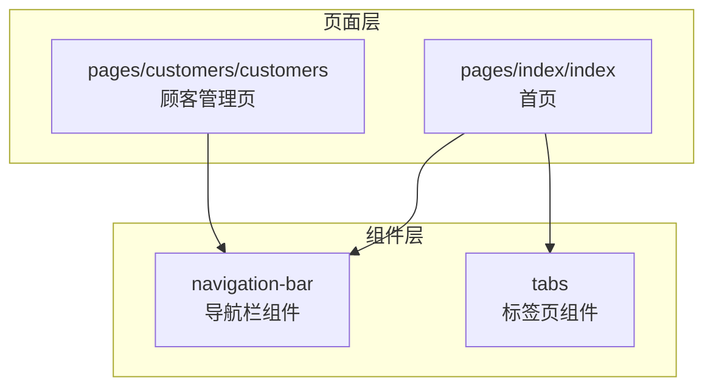
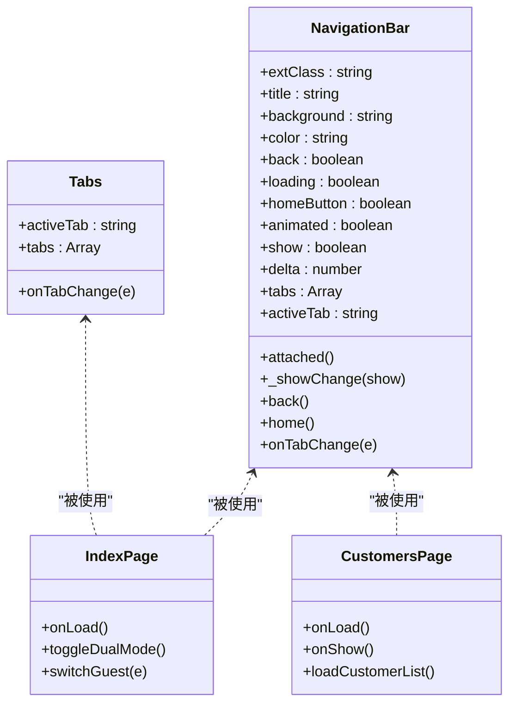
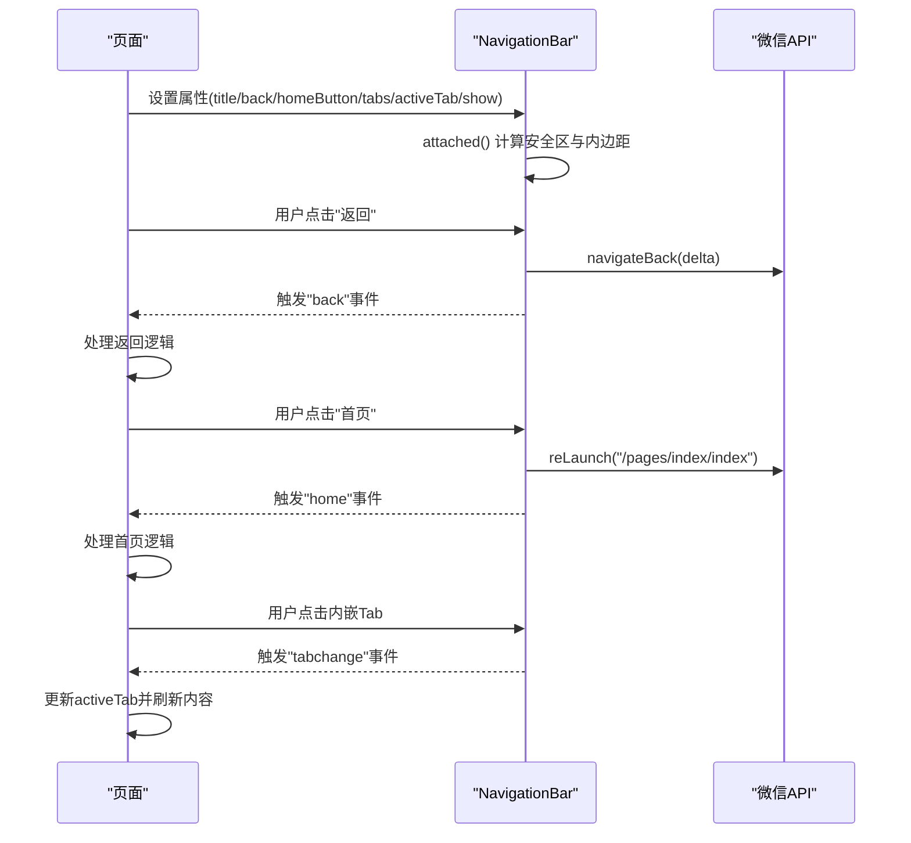
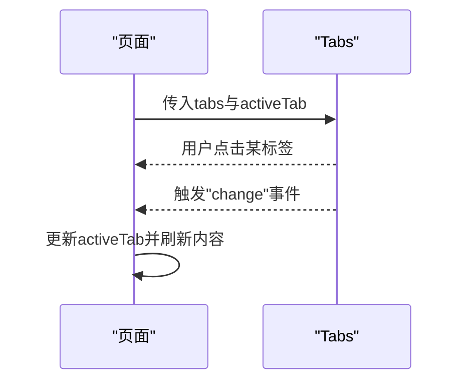
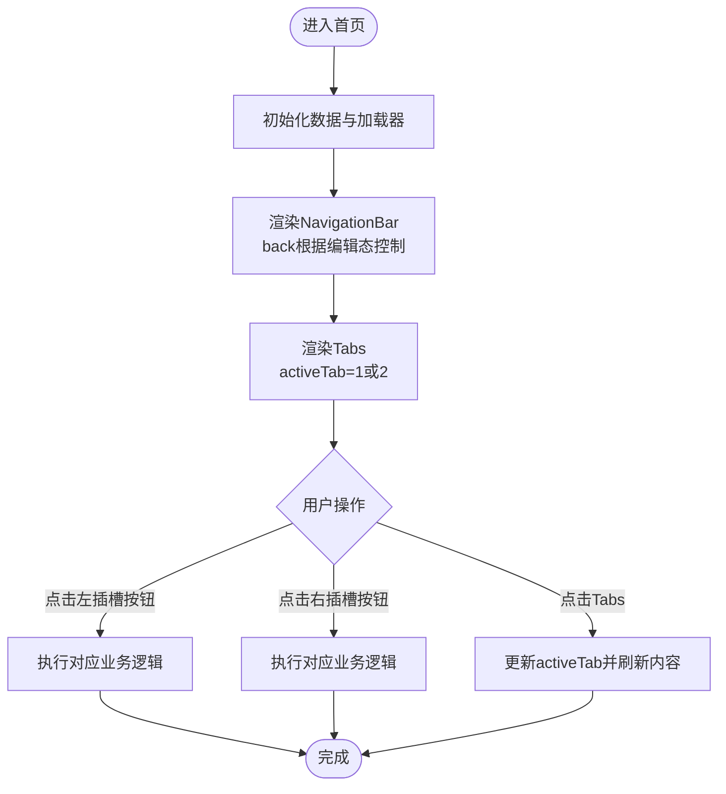
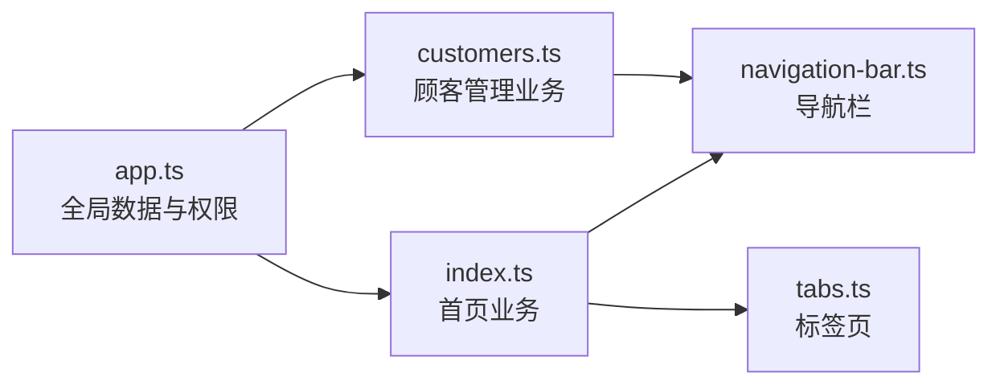

# 导航组件

<cite>
**本文引用的文件**
- [navigation-bar.ts](file://miniprogram/components/navigation-bar/navigation-bar.ts)
- [navigation-bar.json](file://miniprogram/components/navigation-bar/navigation-bar.json)
- [navigation-bar.wxml](file://miniprogram/components/navigation-bar/navigation-bar.wxml)
- [navigation-bar.less](file://miniprogram/components/navigation-bar/navigation-bar.less)
- [tabs.ts](file://miniprogram/components/tabs/tabs.ts)
- [tabs.json](file://miniprogram/components/tabs/tabs.json)
- [tabs.wxml](file://miniprogram/components/tabs/tabs.wxml)
- [tabs.less](file://miniprogram/components/tabs/tabs.less)
- [index.wxml](file://miniprogram/pages/index/index.wxml)
- [index.ts](file://miniprogram/pages/index/index.ts)
- [customers.wxml](file://miniprogram/pages/customers/customers.wxml)
- [customers.ts](file://miniprogram/pages/customers/customers.ts)
- [app.ts](file://miniprogram/app.ts)
</cite>

## 目录
1. [简介](#简介)
2. [项目结构](#项目结构)
3. [核心组件](#核心组件)
4. [架构概览](#架构概览)
5. [组件详解](#组件详解)
6. [依赖关系分析](#依赖关系分析)
7. [性能与体验](#性能与体验)
8. [故障排查指南](#故障排查指南)
9. [结论](#结论)
10. [附录](#附录)

## 简介
本文件为导航组件的全面使用文档，覆盖以下内容：
- NavigationBar 导航栏组件的设计理念、实现方式与使用场景
- Tabs 标签页组件的设计理念、实现方式与使用场景
- 导航栏的标题设置、按钮配置、样式定制与事件处理机制
- 标签页组件的页面切换逻辑、状态管理与用户体验优化
- 组件的完整配置项、API 接口与事件监听方法
- 在不同页面布局中的使用示例与最佳实践
- 组件的动画效果、过渡效果与交互反馈机制

## 项目结构
导航组件位于小程序工程的 components 目录下，分别提供导航栏与标签页两个可复用组件；页面通过 usingComponents 引入并在模板中使用。

图表来源
- [navigation-bar.ts](file://miniprogram/components/navigation-bar/navigation-bar.ts#L1-L114)
- [tabs.ts](file://miniprogram/components/tabs/tabs.ts#L1-L20)
- [index.wxml](file://miniprogram/pages/index/index.wxml#L1-L225)
- [customers.wxml](file://miniprogram/pages/customers/customers.wxml#L1-L288)

章节来源
- [navigation-bar.ts](file://miniprogram/components/navigation-bar/navigation-bar.ts#L1-L114)
- [tabs.ts](file://miniprogram/components/tabs/tabs.ts#L1-L20)
- [index.wxml](file://miniprogram/pages/index/index.wxml#L1-L225)
- [customers.wxml](file://miniprogram/pages/customers/customers.wxml#L1-L288)

## 核心组件
- NavigationBar 导航栏组件：提供统一的顶部导航区域，支持左侧返回/首页按钮、中间标题或内嵌 Tab 导航、右侧插槽扩展、动态显隐与过渡动画等能力。
- Tabs 标签页组件：提供横向标签切换能力，支持传入标签数据与当前激活值，并向外触发切换事件。

章节来源
- [navigation-bar.ts](file://miniprogram/components/navigation-bar/navigation-bar.ts#L5-L54)
- [tabs.ts](file://miniprogram/components/tabs/tabs.ts#L2-L11)

## 架构概览
导航组件采用“组件化 + 页面组合”的架构：
- 组件负责渲染与交互（属性、事件、生命周期）
- 页面负责业务状态与事件处理（绑定事件、更新数据）
- 样式通过 less 定义，支持主题变量与平台差异适配

图表来源
- [navigation-bar.ts](file://miniprogram/components/navigation-bar/navigation-bar.ts#L1-L114)
- [tabs.ts](file://miniprogram/components/tabs/tabs.ts#L1-L20)
- [index.ts](file://miniprogram/pages/index/index.ts#L75-L147)
- [customers.ts](file://miniprogram/pages/customers/customers.ts#L5-L44)

## 组件详解

### NavigationBar 导航栏组件
- 设计理念
  - 以“左右中三区”布局承载通用导航行为，支持插槽扩展与多标签滚动展示，兼顾移动端交互效率与视觉一致性。
  - 支持 iOS/Android 平台差异适配（状态栏高度、高度变量），以及显示/隐藏的过渡动画。
- 实现要点
  - 属性定义：标题、背景色、文字色、返回按钮、首页按钮、加载态、动画开关、显隐控制、返回步数、内嵌 Tabs 数据与当前激活项。
  - 生命周期：在 attached 中读取胶囊按钮尺寸与系统信息，计算内边距与安全区样式，确保胶囊菜单不遮挡。
  - 事件：返回、首页、Tab 切换事件，均通过 triggerEvent 向父组件广播。
  - 模板：根据 tabs 是否存在决定显示标题还是内嵌 Tabs；支持左右插槽与中心插槽。
  - 样式：通过 CSS 变量控制前景/背景/品牌色与高度；提供 Android 与 iOS 的高度差异；Tab 指示器与激活态高亮。
- 使用场景
  - 页面顶部统一导航，如“首页”、“顾客管理”等。
  - 内嵌横向标签页，如首页双人模式下的“顾客1/顾客2”切换。
- 配置项与 API
  - 属性
    - extClass: 自定义外层类名
    - title: 标题文本
    - background: 背景色
    - color: 文字色
    - back: 是否显示返回按钮
    - loading: 是否显示加载图标
    - homeButton: 是否显示首页按钮
    - animated: 显示/隐藏是否带过渡
    - show: 控制显隐
    - delta: 返回步数
    - tabs: 内嵌标签数组 [{key, label}]
    - activeTab: 当前激活标签 key
  - 事件
    - back(delta): 返回按钮点击
    - home(): 首页按钮点击
    - tabchange(key): 内嵌标签切换
- 事件处理与状态管理
  - 页面通过绑定事件接收组件回调，更新自身数据或执行页面跳转。
  - 对于内嵌 Tabs，页面需维护 activeTab 并在 tabchange 时更新。
- 动画与交互
  - show 变化时，若 animated 为真则使用透明度过渡，否则直接显隐。
  - Tab 项有悬停与颜色过渡，指示器居中高亮。

图表来源
- [navigation-bar.ts](file://miniprogram/components/navigation-bar/navigation-bar.ts#L62-L112)
- [navigation-bar.wxml](file://miniprogram/components/navigation-bar/navigation-bar.wxml#L1-L59)

章节来源
- [navigation-bar.ts](file://miniprogram/components/navigation-bar/navigation-bar.ts#L1-L114)
- [navigation-bar.json](file://miniprogram/components/navigation-bar/navigation-bar.json#L1-L5)
- [navigation-bar.wxml](file://miniprogram/components/navigation-bar/navigation-bar.wxml#L1-L59)
- [navigation-bar.less](file://miniprogram/components/navigation-bar/navigation-bar.less#L1-L177)

### Tabs 标签页组件
- 设计理念
  - 轻量级横向标签切换，强调简洁与可复用性，适合页面内子功能切换。
- 实现要点
  - 属性：activeTab、tabs 数组（含 value/label）。
  - 事件：change，携带 {value}。
  - 样式：居中文字、底部指示条、激活态颜色与过渡。
- 使用场景
  - 首页双人模式下的“顾客1/顾客2”标签切换。
- 配置项与 API
  - 属性
    - activeTab: 当前激活标签值
    - tabs: [{value, label}]
  - 事件
    - change({value}): 标签切换
- 事件处理与状态管理
  - 页面维护 activeTab，收到 change 后更新并刷新对应内容。

图表来源
- [tabs.ts](file://miniprogram/components/tabs/tabs.ts#L1-L20)
- [tabs.wxml](file://miniprogram/components/tabs/tabs.wxml#L1-L12)

章节来源
- [tabs.ts](file://miniprogram/components/tabs/tabs.ts#L1-L20)
- [tabs.json](file://miniprogram/components/tabs/tabs.json#L1-L5)
- [tabs.wxml](file://miniprogram/components/tabs/tabs.wxml#L1-L12)
- [tabs.less](file://miniprogram/components/tabs/tabs.less#L1-L37)

### 页面中的实际使用示例

#### 首页（index）
- 使用 NavigationBar
  - 设置标题为空，根据编辑态条件显示返回按钮
  - 左右插槽放置自定义按钮，响应点击事件
- 使用 Tabs
  - 通过 tabs 与 activeTab 实现“顾客1/顾客2”标签切换
  - 切换时更新页面数据并刷新表单内容

图表来源
- [index.wxml](file://miniprogram/pages/index/index.wxml#L1-L225)
- [index.ts](file://miniprogram/pages/index/index.ts#L75-L196)

章节来源
- [index.wxml](file://miniprogram/pages/index/index.wxml#L1-L225)
- [index.ts](file://miniprogram/pages/index/index.ts#L75-L196)

#### 顾客管理页（customers）
- 使用 NavigationBar
  - 设置标题为“顾客管理”，显示返回按钮
  - 右侧插槽放置“新增顾客”按钮
- 页面职责
  - 初始化技师列表
  - 分页加载顾客列表
  - 打开/关闭编辑与详情弹窗

章节来源
- [customers.wxml](file://miniprogram/pages/customers/customers.wxml#L1-L288)
- [customers.ts](file://miniprogram/pages/customers/customers.ts#L5-L99)

## 依赖关系分析
- 组件依赖
  - NavigationBar 依赖微信系统信息与胶囊菜单位置，用于安全区与内边距计算
  - Tabs 为纯展示与事件派发组件，无外部依赖
- 页面依赖
  - 首页通过 NavigationBar 与 Tabs 实现导航与标签切换
  - 顾客管理页通过 NavigationBar 实现统一导航
- 全局数据
  - App 提供全局数据加载与权限校验，页面在 onLoad/onShow 中调用

图表来源
- [app.ts](file://miniprogram/app.ts#L40-L66)
- [index.ts](file://miniprogram/pages/index/index.ts#L126-L147)
- [customers.ts](file://miniprogram/pages/customers/customers.ts#L38-L44)
- [navigation-bar.ts](file://miniprogram/components/navigation-bar/navigation-bar.ts#L62-L76)
- [tabs.ts](file://miniprogram/components/tabs/tabs.ts#L1-L20)

章节来源
- [app.ts](file://miniprogram/app.ts#L40-L66)
- [index.ts](file://miniprogram/pages/index/index.ts#L126-L147)
- [customers.ts](file://miniprogram/pages/customers/customers.ts#L38-L44)
- [navigation-bar.ts](file://miniprogram/components/navigation-bar/navigation-bar.ts#L62-L76)
- [tabs.ts](file://miniprogram/components/tabs/tabs.ts#L1-L20)

## 性能与体验
- 性能特性
  - NavigationBar 在 attached 中一次性计算样式，避免重复计算
  - Tabs 仅进行简单数据渲染与事件派发，复杂逻辑由页面承担
- 交互体验
  - 导航栏支持显隐过渡动画，提升页面切换的柔和感
  - Tab 项具备颜色与过渡反馈，增强点击感知
  - 支持内嵌滚动的横向标签，避免内容溢出
- 最佳实践
  - 将复杂状态与业务逻辑放在页面，组件保持轻量化
  - 使用 activeTab 与 tabs 保持双向一致，避免状态漂移
  - 在首页等高频页面，优先使用插槽扩展按钮，减少重复封装

## 故障排查指南
- 导航栏胶囊菜单遮挡
  - 现象：胶囊菜单与文字重叠
  - 原因：未正确读取胶囊按钮位置与窗口宽度
  - 处理：确认 attached 生命周期已执行，系统信息读取成功
- 返回按钮无效
  - 现象：点击返回无反应
  - 原因：delta 设置过大或页面栈不足
  - 处理：检查 delta 值与页面栈深度
- 内嵌 Tabs 不显示
  - 现象：tabs 传入但不渲染
  - 原因：tabs 为空数组或 activeTab 未匹配任何 key
  - 处理：确保 tabs 非空且 activeTab 与某项 key 对应
- 标签切换无响应
  - 现象：点击标签不更新
  - 原因：页面未监听 change 事件或未更新 activeTab
  - 处理：在页面监听 change 并更新 activeTab

章节来源
- [navigation-bar.ts](file://miniprogram/components/navigation-bar/navigation-bar.ts#L62-L112)
- [navigation-bar.wxml](file://miniprogram/components/navigation-bar/navigation-bar.wxml#L24-L51)
- [tabs.ts](file://miniprogram/components/tabs/tabs.ts#L13-L17)

## 结论
NavigationBar 与 Tabs 组件以清晰的职责划分与简洁的 API，支撑了页面顶部导航与内部标签切换的常见需求。通过在页面中维护状态与事件处理，既能保证组件的可复用性，又能灵活适配复杂的业务场景。建议在新页面中优先引入这两个组件，并遵循“组件轻量化、页面强状态”的设计原则。

## 附录

### NavigationBar 属性与事件清单
- 属性
  - extClass: 自定义外层类名
  - title: 标题文本
  - background: 背景色
  - color: 文字色
  - back: 是否显示返回按钮
  - loading: 是否显示加载图标
  - homeButton: 是否显示首页按钮
  - animated: 显示/隐藏是否带过渡
  - show: 控制显隐
  - delta: 返回步数
  - tabs: 内嵌标签数组 [{key, label}]
  - activeTab: 当前激活标签 key
- 事件
  - back(delta)
  - home()
  - tabchange(key)

章节来源
- [navigation-bar.ts](file://miniprogram/components/navigation-bar/navigation-bar.ts#L5-L54)
- [navigation-bar.ts](file://miniprogram/components/navigation-bar/navigation-bar.ts#L78-L112)

### Tabs 属性与事件清单
- 属性
  - activeTab: 当前激活标签值
  - tabs: [{value, label}]
- 事件
  - change({value})

章节来源
- [tabs.ts](file://miniprogram/components/tabs/tabs.ts#L2-L11)
- [tabs.ts](file://miniprogram/components/tabs/tabs.ts#L13-L17)