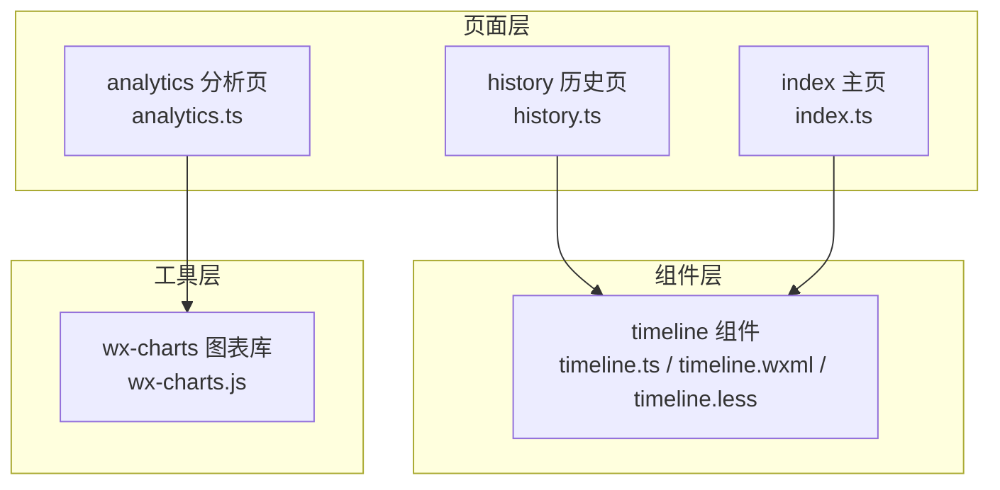
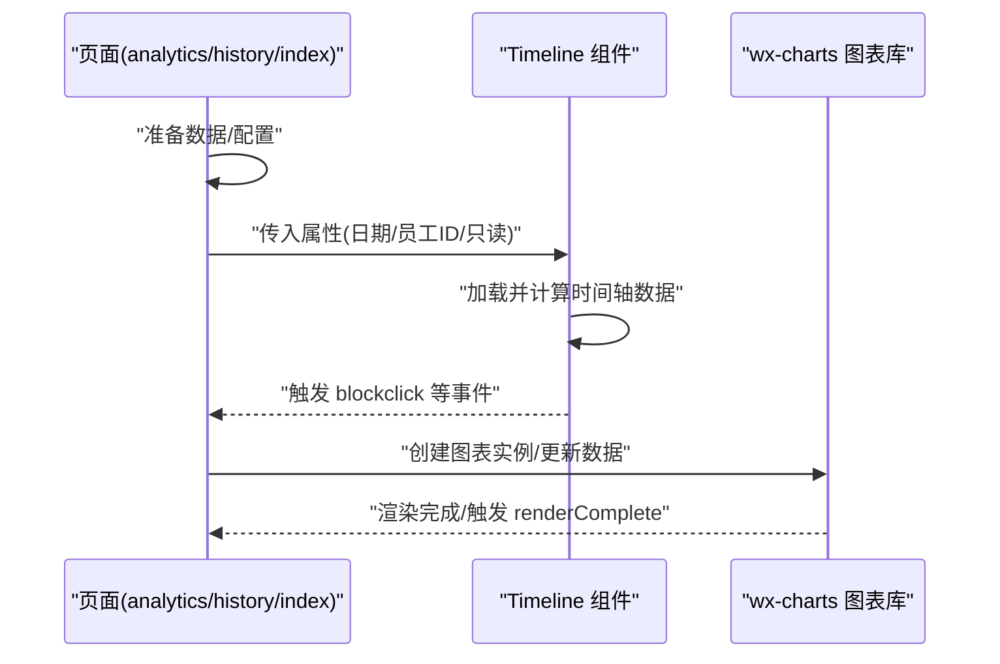
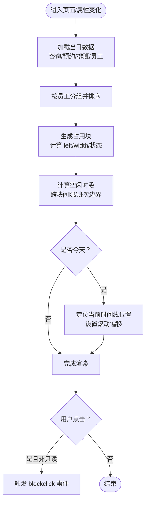
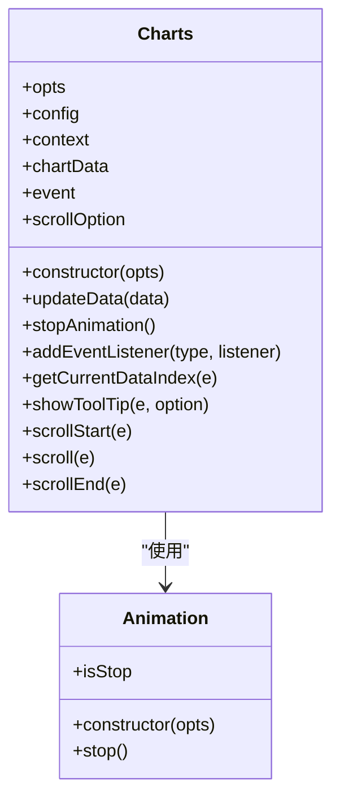
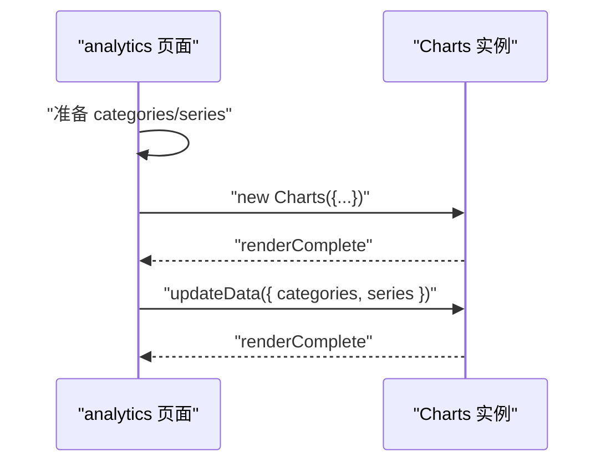
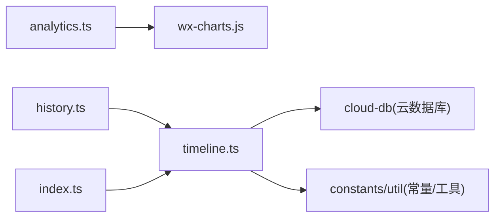

# 展示组件

<cite>
**本文引用的文件**
- [miniprogram/components/timeline/timeline.ts](file://miniprogram/components/timeline/timeline.ts)
- [miniprogram/components/timeline/timeline.wxml](file://miniprogram/components/timeline/timeline.wxml)
- [miniprogram/components/timeline/timeline.less](file://miniprogram/components/timeline/timeline.less)
- [miniprogram/utils/wx-charts.js](file://miniprogram/utils/wx-charts.js)
- [miniprogram/pages/analytics/analytics.ts](file://miniprogram/pages/analytics/analytics.ts)
- [miniprogram/pages/history/history.ts](file://miniprogram/pages/history/history.ts)
- [miniprogram/pages/index/index.ts](file://miniprogram/pages/index/index.ts)
</cite>

## 目录
1. [简介](#简介)
2. [项目结构](#项目结构)
3. [核心组件](#核心组件)
4. [架构总览](#架构总览)
5. [详细组件分析](#详细组件分析)
6. [依赖关系分析](#依赖关系分析)
7. [性能考虑](#性能考虑)
8. [故障排查指南](#故障排查指南)
9. [结论](#结论)
10. [附录](#附录)

## 简介
本文件面向“展示组件”的技术与使用说明，重点覆盖以下两个方面：
- Timeline 时间轴组件：用于展示员工在某日的排班与占用情况，支持空闲时段计算、当前时间线高亮、点击交互等。
- wx-charts 图表组件：基于 Canvas 的图表库，支持折线图、柱状图、饼图、雷达图等，提供数据绑定、配置项、滚动缩放、工具提示、动画与事件回调。

文档将从架构、数据模型、处理逻辑、API 参考、使用示例、性能与内存管理等方面进行系统化说明，并给出可视化流程图与时序图帮助理解。

## 项目结构
- 组件层：miniprogram/components 下包含可复用的 WXML/TS/LSS 组件，如 timeline。
- 工具层：miniprogram/utils 下包含通用工具，如 wx-charts.js。
- 页面层：miniprogram/pages 下包含业务页面，如 analytics、history、index，它们会使用上述组件或图表库。

**图表来源**
- [miniprogram/components/timeline/timeline.ts](file://miniprogram/components/timeline/timeline.ts#L1-L474)
- [miniprogram/utils/wx-charts.js](file://miniprogram/utils/wx-charts.js#L1-L2124)
- [miniprogram/pages/analytics/analytics.ts](file://miniprogram/pages/analytics/analytics.ts#L1-L408)
- [miniprogram/pages/history/history.ts](file://miniprogram/pages/history/history.ts#L1-L739)
- [miniprogram/pages/index/index.ts](file://miniprogram/pages/index/index.ts#L1-L735)

**章节来源**
- [miniprogram/components/timeline/timeline.ts](file://miniprogram/components/timeline/timeline.ts#L1-L474)
- [miniprogram/utils/wx-charts.js](file://miniprogram/utils/wx-charts.js#L1-L2124)
- [miniprogram/pages/analytics/analytics.ts](file://miniprogram/pages/analytics/analytics.ts#L1-L408)
- [miniprogram/pages/history/history.ts](file://miniprogram/pages/history/history.ts#L1-L739)
- [miniprogram/pages/index/index.ts](file://miniprogram/pages/index/index.ts#L1-L735)

## 核心组件
- Timeline 时间轴组件：负责按小时刻度展示员工占用块、空闲时段标记、当前时间线、点击事件触发等。
- wx-charts 图表库：封装了 Canvas 渲染、坐标计算、动画、滚动缩放、工具提示与事件监听，对外暴露统一的构造与更新接口。

**章节来源**
- [miniprogram/components/timeline/timeline.ts](file://miniprogram/components/timeline/timeline.ts#L41-L474)
- [miniprogram/utils/wx-charts.js](file://miniprogram/utils/wx-charts.js#L1955-L2124)

## 架构总览
整体由“页面 -> 组件/图表库”两层构成：
- 页面通过云函数或本地服务获取数据，再驱动组件或图表库渲染。
- 组件负责局部视图与交互；图表库负责复杂图形绘制与交互。

**图表来源**
- [miniprogram/pages/analytics/analytics.ts](file://miniprogram/pages/analytics/analytics.ts#L194-L408)
- [miniprogram/components/timeline/timeline.ts](file://miniprogram/components/timeline/timeline.ts#L88-L474)
- [miniprogram/utils/wx-charts.js](file://miniprogram/utils/wx-charts.js#L1788-L1924)

## 详细组件分析

### Timeline 时间轴组件

#### 组件职责与数据流
- 输入属性：selectedDate、staffId、refreshTrigger、readonly。
- 内部状态：时间刻度、员工时间轴数组、当前时间线位置、滚动偏移、加载状态。
- 数据来源：云数据库查询咨询记录、预约、排班与员工列表，按日聚合生成每个员工的占用块与空闲时段。
- 输出事件：blockclick（仅当非只读时）。

**图表来源**
- [miniprogram/components/timeline/timeline.ts](file://miniprogram/components/timeline/timeline.ts#L88-L211)
- [miniprogram/components/timeline/timeline.ts](file://miniprogram/components/timeline/timeline.ts#L213-L459)
- [miniprogram/components/timeline/timeline.ts](file://miniprogram/components/timeline/timeline.ts#L461-L471)

**章节来源**
- [miniprogram/components/timeline/timeline.ts](file://miniprogram/components/timeline/timeline.ts#L41-L474)
- [miniprogram/components/timeline/timeline.wxml](file://miniprogram/components/timeline/timeline.wxml#L1-L64)
- [miniprogram/components/timeline/timeline.less](file://miniprogram/components/timeline/timeline.less#L1-L225)

#### 数据模型与字段说明
- 时间轴数据结构
  - timeLabels: 小时刻度数组（字符串）
  - staffTimeline: 员工时间轴数组
    - name: 员工姓名
    - shift: 上午/下午
    - blocks: 占用块数组
      - startTime/endTime: 开始/结束时间(HH:mm)
      - left/width: 百分比定位与宽度
      - customerName/room/project/technician
      - isReservation/isSettled/isInProgress
      - genderRequirement(可选)
    - availableSlots: 空闲时段数组
      - left/width/displayText/durationMinutes
    - highlighted(可选)
  - showCurrentTimeLine/currentTimePosition/scrollLeft/loading

- 占用块字段含义
  - left/width：基于时间轴总长度换算的百分比，用于绝对定位。
  - isReservation：是否来自预约。
  - isSettled：非预约场景下若存在结算则标记。
  - isInProgress：当天且当前时间处于该时间段内。
  - genderRequirement：预约时的性别需求（可选）。

- 空闲时段计算规则
  - 考虑班次起止时间与已有占用块之间的间隔。
  - 当天场景下还需考虑当前时间与最近占用块的关系，避免显示过去时段。

**章节来源**
- [miniprogram/components/timeline/timeline.ts](file://miniprogram/components/timeline/timeline.ts#L7-L40)
- [miniprogram/components/timeline/timeline.ts](file://miniprogram/components/timeline/timeline.ts#L213-L459)

#### 样式与交互
- 样式要点
  - 时间轴容器宽度随刻度数量动态计算。
  - 员工列固定左侧，时间轨道相对滚动。
  - 当前时间线为红色竖线，带圆点装饰。
  - 占用块按类型区分背景色（普通/预约/已结算）。
  - 空闲时段以半透明文本标注分钟数。
- 交互行为
  - readonly 为 true 时禁用点击。
  - 点击占用块触发 blockclick 事件，携带 id、reservation、settled、inprogress 等上下文。

**章节来源**
- [miniprogram/components/timeline/timeline.wxml](file://miniprogram/components/timeline/timeline.wxml#L1-L64)
- [miniprogram/components/timeline/timeline.less](file://miniprogram/components/timeline/timeline.less#L1-L225)
- [miniprogram/components/timeline/timeline.ts](file://miniprogram/components/timeline/timeline.ts#L461-L471)

#### API 参考（Timeline）
- 属性(properties)
  - selectedDate: 字符串，筛选日期
  - staffId: 字符串，指定员工
  - refreshTrigger: 数字，观察器触发刷新
  - readonly: 布尔，是否禁用点击
- 方法(methods)
  - loadAllStaffTimelineData(highlightStaffId?): 异步加载并计算时间轴数据
  - calculateAvailableSlotsBetweenBlocks(blocks, shift): 计算空闲时段
  - onBlockClick(e): 点击占用块回调（只读时不触发）
- 事件(events)
  - blockclick: 点击占用块时触发，携带 id/reservation/settled/inprogress

**章节来源**
- [miniprogram/components/timeline/timeline.ts](file://miniprogram/components/timeline/timeline.ts#L42-L64)
- [miniprogram/components/timeline/timeline.ts](file://miniprogram/components/timeline/timeline.ts#L88-L474)

#### 使用示例
- 在页面中引入并传参
  - 在 WXML 中使用组件标签，绑定 selectedDate、staffId、readonly 等属性。
  - 监听 blockclick 事件，在事件处理器中执行跳转或弹窗等操作。
- 与页面联动
  - 页面 onLoad/onShow 中根据当前日期调用组件的刷新逻辑。
  - 通过 refreshTrigger 触发重新加载。

**章节来源**
- [miniprogram/pages/history/history.ts](file://miniprogram/pages/history/history.ts#L1-L739)
- [miniprogram/pages/index/index.ts](file://miniprogram/pages/index/index.ts#L1-L735)

### wx-charts 图表组件

#### 支持的图表类型与特性
- 类型：折线图(line)、柱状图(column)、饼图(pie)、环形图(ring)、雷达图(radar)
- 特性：坐标轴、图例、网格、标题、工具提示、动画、滚动缩放、数据标签、颜色与形状配置

**图表来源**
- [miniprogram/utils/wx-charts.js](file://miniprogram/utils/wx-charts.js#L1955-L2124)

**章节来源**
- [miniprogram/utils/wx-charts.js](file://miniprogram/utils/wx-charts.js#L12-L37)
- [miniprogram/utils/wx-charts.js](file://miniprogram/utils/wx-charts.js#L1788-L1924)

#### 数据绑定与配置选项
- 构造参数
  - canvasId: 画布标识
  - type: 图表类型
  - categories: X 轴分类
  - series: 数据系列数组（name、data、color、format）
  - width/height: 画布尺寸
  - yAxis/xAxis: 坐标轴配置（最小值、格式化、网格、字体颜色等）
  - extra: 额外配置（如 lineStyle、pie.offsetAngle、ring 宽度等）
  - legend: 是否显示图例
  - dataLabel: 是否显示数据标签
  - animation: 是否启用动画
  - enableScroll: 是否启用横向滚动
- 更新数据
  - updateData({ series, categories, title, subtitle, ... }): 逐项合并并重绘

**章节来源**
- [miniprogram/utils/wx-charts.js](file://miniprogram/utils/wx-charts.js#L1955-L2009)

#### 事件处理与交互
- 事件注册
  - addEventListener('renderComplete', handler): 渲染完成后触发
- 交互能力
  - getCurrentDataIndex(e): 获取触摸点对应的数据索引（饼图/雷达/折线/柱状）
  - showToolTip(e, option): 显示工具提示（折线/面积图节流）
  - scrollStart/scroll/scrollEnd: 横向滚动控制（节流）

**章节来源**
- [miniprogram/utils/wx-charts.js](file://miniprogram/utils/wx-charts.js#L1926-L2124)

#### 使用示例（页面集成）
- 在 analytics 页面中，根据后台返回的统计数据分别初始化不同类型的图表：
  - 折线图：日营业额趋势
  - 柱状图：项目消费金额/次数对比
  - 饼图：性别/车辆分布
- 通过 updateData 动态刷新图表数据，保持界面实时更新。

**图表来源**
- [miniprogram/pages/analytics/analytics.ts](file://miniprogram/pages/analytics/analytics.ts#L194-L408)
- [miniprogram/utils/wx-charts.js](file://miniprogram/utils/wx-charts.js#L1788-L1924)

**章节来源**
- [miniprogram/pages/analytics/analytics.ts](file://miniprogram/pages/analytics/analytics.ts#L194-L408)

## 依赖关系分析

**图表来源**
- [miniprogram/pages/analytics/analytics.ts](file://miniprogram/pages/analytics/analytics.ts#L1-L408)
- [miniprogram/utils/wx-charts.js](file://miniprogram/utils/wx-charts.js#L1-L2124)
- [miniprogram/pages/history/history.ts](file://miniprogram/pages/history/history.ts#L1-L739)
- [miniprogram/pages/index/index.ts](file://miniprogram/pages/index/index.ts#L1-L735)
- [miniprogram/components/timeline/timeline.ts](file://miniprogram/components/timeline/timeline.ts#L1-L5)

**章节来源**
- [miniprogram/components/timeline/timeline.ts](file://miniprogram/components/timeline/timeline.ts#L1-L5)
- [miniprogram/pages/analytics/analytics.ts](file://miniprogram/pages/analytics/analytics.ts#L1-L408)
- [miniprogram/pages/history/history.ts](file://miniprogram/pages/history/history.ts#L1-L739)
- [miniprogram/pages/index/index.ts](file://miniprogram/pages/index/index.ts#L1-L735)

## 性能考虑
- Timeline
  - 数据计算集中在组件内部，避免频繁重渲染：按日聚合、排序与定位一次完成。
  - 仅在 selectedDate 或 staffId 变化时触发加载，减少无效请求。
  - 空闲时段计算按班次边界与占用块顺序扫描，时间复杂度 O(n)。
  - 当天场景下滚动到当前时间位置，提升可视体验。
- wx-charts
  - Canvas 绘制在原生层，渲染效率高；通过 Animation 控制动画帧率与时序。
  - 工具提示与滚动交互采用节流策略，降低重绘频率。
  - 图表尺寸默认从系统窗口信息获取，避免布局抖动。
  - 图例、坐标轴、网格等元素按需绘制，减少无关绘制。

[本节为通用指导，无需特定文件引用]

## 故障排查指南
- Timeline
  - 现象：点击无响应
    - 排查：readonly 是否为 true；事件绑定是否正确；blockclick 是否被拦截。
  - 现象：当前时间线不显示
    - 排查：selectedDate 是否为今日；时间轴总宽度与当前位置计算是否正确；showCurrentTimeLine 切换逻辑。
  - 现象：空闲时段不准确
    - 排查：班次起止时间配置；占用块排序；当天场景下的当前时间判断。
- wx-charts
  - 现象：图表空白或白屏
    - 排查：canvasId 是否正确；width/height 是否有效；数据 series/categories 是否为空；try/catch 保护是否生效。
  - 现象：工具提示闪烁或不显示
    - 排查：showToolTip 节流阈值；当前数据索引获取；tooltip 文本拼装。
  - 现象：滚动卡顿
    - 排查：scroll 节流间隔；有效距离计算；重绘频率。

**章节来源**
- [miniprogram/components/timeline/timeline.ts](file://miniprogram/components/timeline/timeline.ts#L461-L471)
- [miniprogram/utils/wx-charts.js](file://miniprogram/utils/wx-charts.js#L1697-L1708)
- [miniprogram/utils/wx-charts.js](file://miniprogram/utils/wx-charts.js#L2046-L2080)
- [miniprogram/utils/wx-charts.js](file://miniprogram/utils/wx-charts.js#L2082-L2122)

## 结论
- Timeline 组件通过清晰的数据模型与高效的计算逻辑，实现了对员工占用与空闲时段的直观展示，并提供了只读与交互开关，满足不同业务场景。
- wx-charts 提供了完善的图表生态，涵盖多种图表类型与交互能力，配合页面层的数据准备与更新，能够快速构建可视化报表与仪表盘。

[本节为总结，无需特定文件引用]

## 附录

### Timeline API 参考（汇总）
- 属性
  - selectedDate: 字符串
  - staffId: 字符串
  - refreshTrigger: 数字
  - readonly: 布尔
- 方法
  - loadAllStaffTimelineData(highlightStaffId?)
  - calculateAvailableSlotsBetweenBlocks(blocks, shift)
  - onBlockClick(e)
- 事件
  - blockclick: { id, reservation, settled, inprogress }

**章节来源**
- [miniprogram/components/timeline/timeline.ts](file://miniprogram/components/timeline/timeline.ts#L42-L64)
- [miniprogram/components/timeline/timeline.ts](file://miniprogram/components/timeline/timeline.ts#L88-L474)

### wx-charts API 参考（汇总）
- 构造
  - new Charts(opts)
- 更新
  - updateData(data)
- 事件
  - addEventListener('renderComplete', handler)
- 交互
  - getCurrentDataIndex(e)
  - showToolTip(e, option)
  - scrollStart/scroll/scrollEnd
- 配置要点
  - canvasId/type/categories/series/width/height/yAxis/xAxis/extra/legend/dataLabel/animation/enableScroll

**章节来源**
- [miniprogram/utils/wx-charts.js](file://miniprogram/utils/wx-charts.js#L1955-L2009)
- [miniprogram/utils/wx-charts.js](file://miniprogram/utils/wx-charts.js#L1926-L2124)