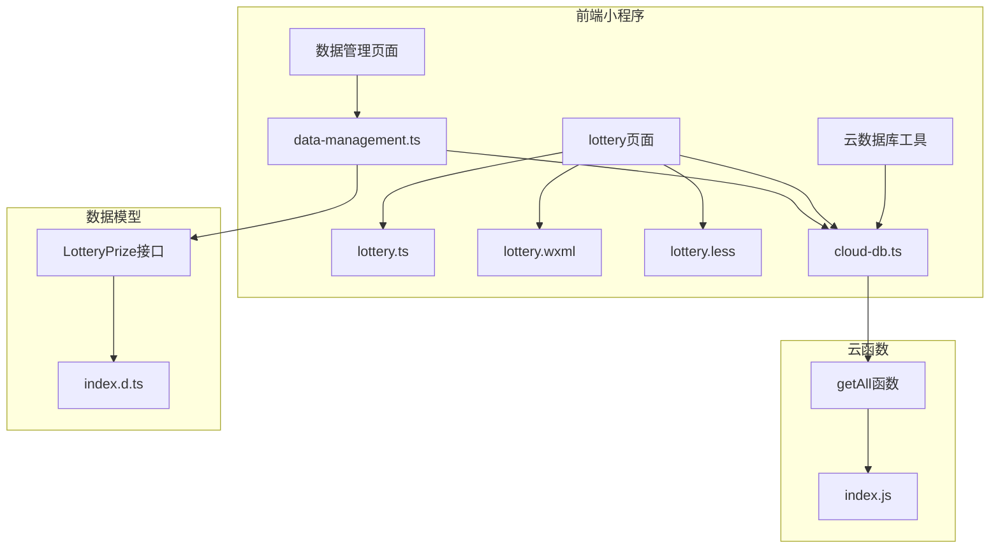
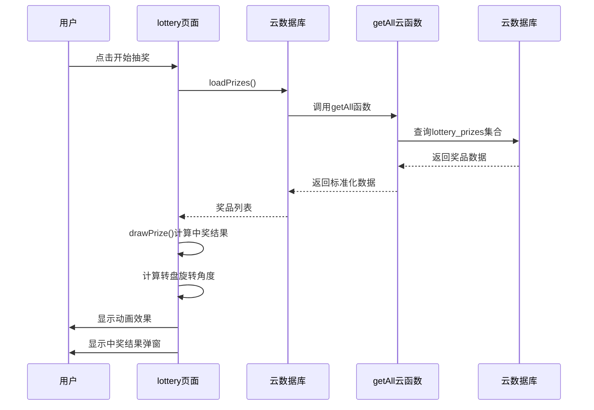
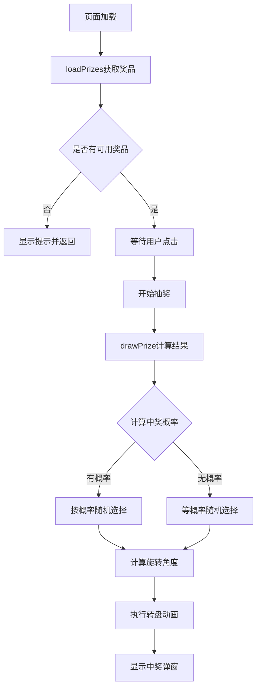
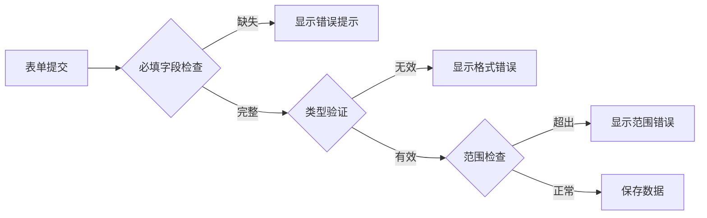
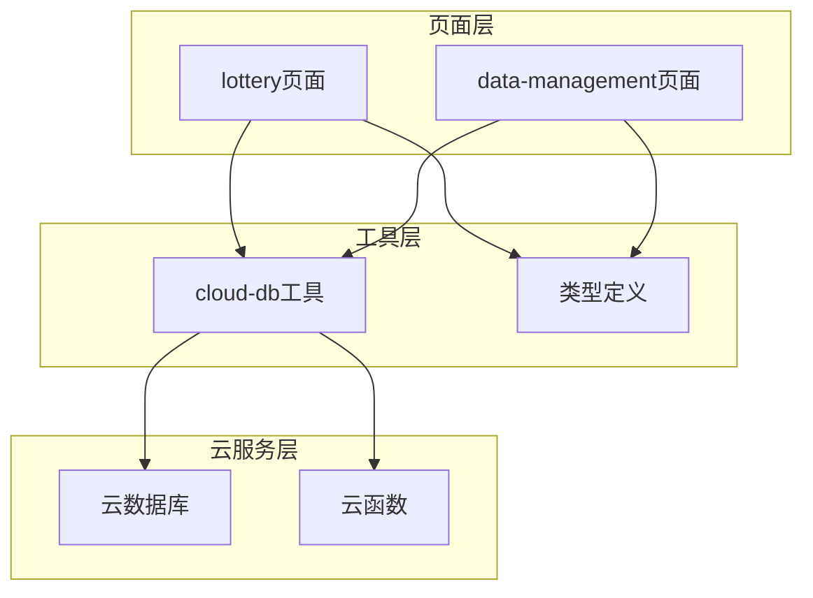

# 抽奖系统

<cite>
**本文档引用的文件**
- [lottery.ts](file://miniprogram/pages/lottery/lottery.ts)
- [lottery.json](file://miniprogram/pages/lottery/lottery.json)
- [lottery.wxml](file://miniprogram/pages/lottery/lottery.wxml)
- [lottery.less](file://miniprogram/pages/lottery/lottery.less)
- [cloud-db.ts](file://miniprogram/utils/cloud-db.ts)
- [index.js](file://cloudfunctions/getAll/index.js)
- [data-management.ts](file://miniprogram/pages/data-management/data-management.ts)
- [index.d.ts](file://typings/index.d.ts)
</cite>

## 目录
1. [简介](#简介)
2. [项目结构](#项目结构)
3. [核心组件](#核心组件)
4. [架构概览](#架构概览)
5. [详细组件分析](#详细组件分析)
6. [依赖关系分析](#依赖关系分析)
7. [性能考虑](#性能考虑)
8. [故障排除指南](#故障排除指南)
9. [结论](#结论)

## 简介

这是一个基于微信小程序平台开发的幸运大转盘抽奖系统。系统采用前后端分离架构，前端使用原生小程序框架，后端通过云开发提供数据存储和业务逻辑处理。用户可以通过转动转盘参与抽奖，系统支持多种奖品类型和概率设置。

## 项目结构

抽奖系统主要由以下模块组成：

**图表来源**
- [lottery.ts](file://miniprogram/pages/lottery/lottery.ts#L1-L114)
- [cloud-db.ts](file://miniprogram/utils/cloud-db.ts#L1-L323)
- [index.js](file://cloudfunctions/getAll/index.js#L1-L59)

**章节来源**
- [lottery.ts](file://miniprogram/pages/lottery/lottery.ts#L1-L114)
- [cloud-db.ts](file://miniprogram/utils/cloud-db.ts#L1-L323)

## 核心组件

### 奖品数据模型

系统定义了完整的奖品数据结构，支持多种奖品类型：

| 字段名 | 类型 | 描述 | 必填 |
|--------|------|------|------|
| name | string | 奖品名称 | 是 |
| type | 'product' \| 'discount' \| 'coupon' \| 'service' | 奖品类型 | 是 |
| value | number | 奖品价值 | 是 |
| probability | number | 中奖概率(%) | 是 |
| color | string | 奖品颜色 | 是 |
| description | string | 奖品描述 | 否 |
| status | ItemStatus | 奖品状态 | 是 |

### 云数据库抽象层

提供了统一的数据库访问接口，封装了所有CRUD操作：

- **getAll<T>()**: 获取集合所有数据
- **findById<T>()**: 根据ID查找记录
- **find<T>()**: 条件查询
- **insert<T>()**: 新增记录
- **updateById<T>()**: 更新记录
- **deleteById()**: 删除记录

**章节来源**
- [index.d.ts](file://typings/index.d.ts#L446-L456)
- [cloud-db.ts](file://miniprogram/utils/cloud-db.ts#L69-L203)

## 架构概览

系统采用三层架构设计：

**图表来源**
- [lottery.ts](file://miniprogram/pages/lottery/lottery.ts#L17-L105)
- [cloud-db.ts](file://miniprogram/utils/cloud-db.ts#L69-L88)
- [index.js](file://cloudfunctions/getAll/index.js#L9-L58)

## 详细组件分析

### 抽奖页面组件

#### 主要功能流程

**图表来源**
- [lottery.ts](file://miniprogram/pages/lottery/lottery.ts#L38-L105)

#### 转盘动画算法

系统实现了精确的转盘动画计算：

1. **基础旋转**: 5圈完整旋转（360° × 5 = 1800°）
2. **目标定位**: 计算目标奖品的中心角度
3. **角度补偿**: 减去扇形角度的一半和基础旋转
4. **动画执行**: 使用4秒缓动曲线完成旋转

**章节来源**
- [lottery.ts](file://miniprogram/pages/lottery/lottery.ts#L57-L66)

### 数据管理组件

#### 奖品配置功能

数据管理页面提供了完整的奖品生命周期管理：

- **新增奖品**: 支持设置奖品名称、类型、价值、概率、颜色等属性
- **编辑奖品**: 实时修改现有奖品配置
- **状态管理**: 启用/禁用奖品控制
- **批量操作**: 支持删除和状态切换

#### 表单验证规则

**图表来源**
- [data-management.ts](file://miniprogram/pages/data-management/data-management.ts#L180-L189)

**章节来源**
- [data-management.ts](file://miniprogram/pages/data-management/data-management.ts#L344-L432)

### 云函数组件

#### getAll云函数

实现了分页查询功能，支持大数据量场景：

- **批量查询**: 每次最多查询1000条记录
- **游标分页**: 使用_lastId实现无痛分页
- **错误处理**: 完善的异常捕获和错误返回
- **性能优化**: 并行查询计数和数据

**章节来源**
- [index.js](file://cloudfunctions/getAll/index.js#L25-L44)

## 依赖关系分析

**图表来源**
- [lottery.ts](file://miniprogram/pages/lottery/lottery.ts#L1)
- [cloud-db.ts](file://miniprogram/utils/cloud-db.ts#L1-L323)
- [index.d.ts](file://typings/index.d.ts#L446-L456)

### 组件耦合度分析

- **低耦合**: 页面与数据库工具通过接口隔离
- **高内聚**: 数据库工具封装了所有数据库操作
- **清晰边界**: 云函数专注于数据查询逻辑

**章节来源**
- [cloud-db.ts](file://miniprogram/utils/cloud-db.ts#L12-L47)

## 性能考虑

### 前端性能优化

1. **动画性能**: 使用CSS3 transform实现硬件加速
2. **内存管理**: 及时清理定时器和事件监听
3. **渲染优化**: 条件渲染减少DOM节点数量

### 后端性能优化

1. **分页查询**: 避免一次性查询大量数据
2. **缓存策略**: 利用微信云开发的自动缓存
3. **并发控制**: 合理限制同时进行的数据库操作

## 故障排除指南

### 常见问题及解决方案

| 问题类型 | 症状 | 解决方案 |
|----------|------|----------|
| 数据加载失败 | 页面空白或加载提示 | 检查云数据库权限和集合名称 |
| 抽奖无响应 | 点击按钮无反应 | 检查isSpinning状态和prizes数据 |
| 动画不流畅 | 转盘旋转卡顿 | 检查设备性能和CSS动画设置 |
| 奖品配置错误 | 表单验证失败 | 检查必填字段和数据格式 |

### 调试建议

1. **网络请求**: 使用开发者工具查看云函数调用日志
2. **数据验证**: 在控制台输出关键数据结构
3. **性能监控**: 关注页面渲染时间和内存使用

**章节来源**
- [lottery.ts](file://miniprogram/pages/lottery/lottery.ts#L33-L35)
- [cloud-db.ts](file://miniprogram/utils/cloud-db.ts#L85-L87)

## 结论

该抽奖系统采用了现代化的小程序开发模式，具有以下特点：

**优势**:
- 清晰的分层架构，职责分离明确
- 完善的数据模型设计，支持灵活的奖品配置
- 优秀的用户体验，流畅的动画效果
- 良好的扩展性，易于添加新功能

**改进建议**:
- 添加中奖记录统计功能
- 实现奖品库存管理
- 增加用户中奖历史查看
- 优化移动端适配体验

系统整体架构合理，代码结构清晰，为后续功能扩展奠定了良好的基础。