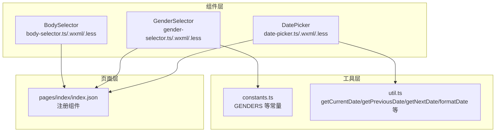
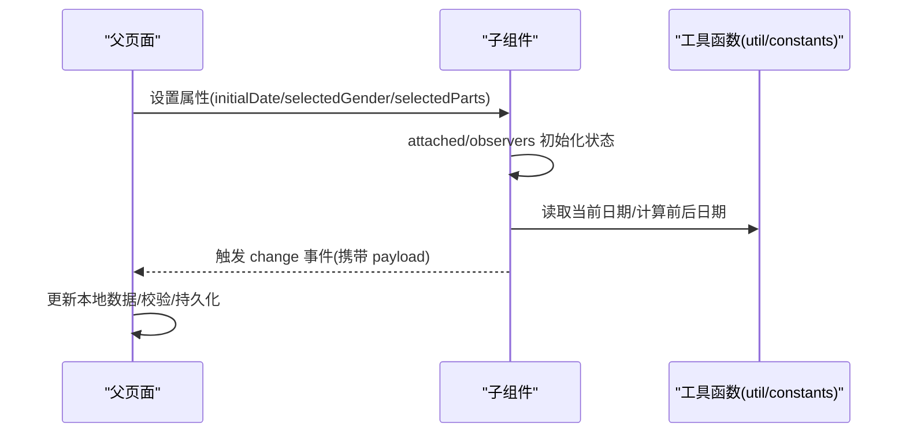
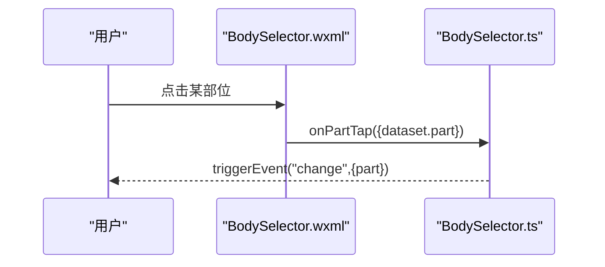
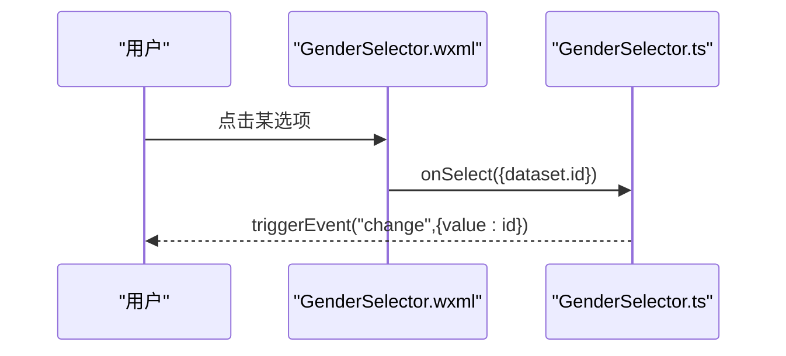
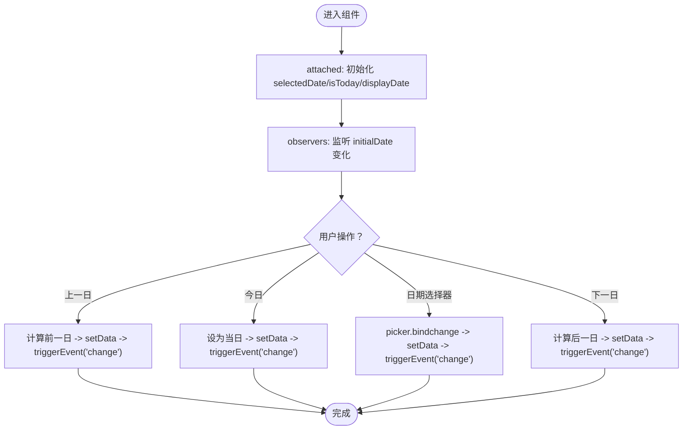
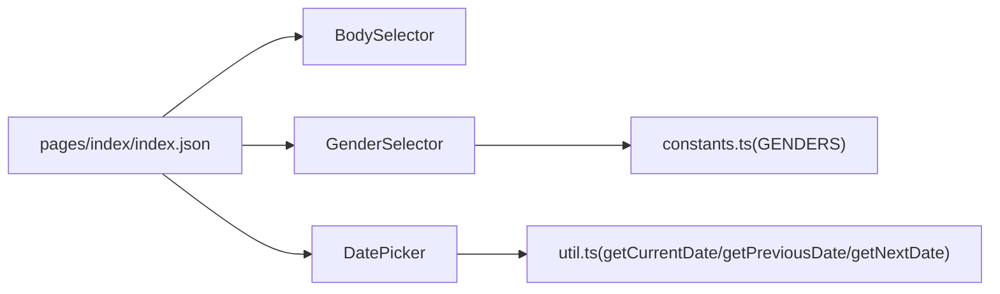

# 核心表单组件

<cite>
**本文引用的文件**
- [miniprogram/components/body-selector/body-selector.ts](file://miniprogram/components/body-selector/body-selector.ts)
- [miniprogram/components/body-selector/body-selector.json](file://miniprogram/components/body-selector/body-selector.json)
- [miniprogram/components/body-selector/body-selector.wxml](file://miniprogram/components/body-selector/body-selector.wxml)
- [miniprogram/components/body-selector/body-selector.less](file://miniprogram/components/body-selector/body-selector.less)
- [miniprogram/components/gender-selector/gender-selector.ts](file://miniprogram/components/gender-selector/gender-selector.ts)
- [miniprogram/components/gender-selector/gender-selector.json](file://miniprogram/components/gender-selector/gender-selector.json)
- [miniprogram/components/gender-selector/gender-selector.wxml](file://miniprogram/components/gender-selector/gender-selector.wxml)
- [miniprogram/components/gender-selector/gender-selector.less](file://miniprogram/components/gender-selector/gender-selector.less)
- [miniprogram/components/date-picker/date-picker.ts](file://miniprogram/components/date-picker/date-picker.ts)
- [miniprogram/components/date-picker/date-picker.json](file://miniprogram/components/date-picker/date-picker.json)
- [miniprogram/components/date-picker/date-picker.wxml](file://miniprogram/components/date-picker/date-picker.wxml)
- [miniprogram/components/date-picker/date-picker.less](file://miniprogram/components/date-picker/date-picker.less)
- [miniprogram/utils/constants.ts](file://miniprogram/utils/constants.ts)
- [miniprogram/utils/util.ts](file://miniprogram/utils/util.ts)
- [miniprogram/pages/index/index.json](file://miniprogram/pages/index/index.json)
</cite>

## 目录
1. [简介](#简介)
2. [项目结构](#项目结构)
3. [核心组件](#核心组件)
4. [架构总览](#架构总览)
5. [详细组件分析](#详细组件分析)
6. [依赖关系分析](#依赖关系分析)
7. [性能与可维护性](#性能与可维护性)
8. [故障排查指南](#故障排查指南)
9. [结论](#结论)
10. [附录：API 参考与最佳实践](#附录api-参考与最佳实践)

## 简介
本文件聚焦于三个核心表单组件：BodySelector（身体部位选择器）、GenderSelector（性别选择器）、DatePicker（日期选择器）。文档从架构、状态管理、数据流、生命周期钩子、事件回调、样式与主题适配、响应式布局、到使用示例与最佳实践进行系统化说明，帮助开发者快速集成与扩展。

## 项目结构
这些组件采用微信小程序原生自定义组件模式，每个组件由 TypeScript 脚本、JSON 配置、WXML 视图与 LESS 样式四部分组成，并通过公共工具模块提供常量与通用工具函数。

图表来源
- [miniprogram/components/body-selector/body-selector.ts](file://miniprogram/components/body-selector/body-selector.ts#L1-L27)
- [miniprogram/components/gender-selector/gender-selector.ts](file://miniprogram/components/gender-selector/gender-selector.ts#L1-L22)
- [miniprogram/components/date-picker/date-picker.ts](file://miniprogram/components/date-picker/date-picker.ts#L1-L101)
- [miniprogram/utils/constants.ts](file://miniprogram/utils/constants.ts#L7-L10)
- [miniprogram/utils/util.ts](file://miniprogram/utils/util.ts#L119-L149)
- [miniprogram/pages/index/index.json](file://miniprogram/pages/index/index.json#L2-L12)

章节来源
- [miniprogram/components/body-selector/body-selector.ts](file://miniprogram/components/body-selector/body-selector.ts#L1-L27)
- [miniprogram/components/gender-selector/gender-selector.ts](file://miniprogram/components/gender-selector/gender-selector.ts#L1-L22)
- [miniprogram/components/date-picker/date-picker.ts](file://miniprogram/components/date-picker/date-picker.ts#L1-L101)
- [miniprogram/utils/constants.ts](file://miniprogram/utils/constants.ts#L7-L10)
- [miniprogram/utils/util.ts](file://miniprogram/utils/util.ts#L119-L149)
- [miniprogram/pages/index/index.json](file://miniprogram/pages/index/index.json#L2-L12)

## 核心组件
- BodySelector：以人体图像为背景，点击不同部位触发 change 事件，父组件通过 selectedParts 绑定选中状态。
- GenderSelector：展示性别选项列表，点击后触发 change 事件，传递所选值。
- DatePicker：提供“上一日/今日/日期选择器/下一日”导航，内部维护 selectedDate/isToday/displayDate，变更时触发 change。

章节来源
- [miniprogram/components/body-selector/body-selector.ts](file://miniprogram/components/body-selector/body-selector.ts#L1-L27)
- [miniprogram/components/gender-selector/gender-selector.ts](file://miniprogram/components/gender-selector/gender-selector.ts#L1-L22)
- [miniprogram/components/date-picker/date-picker.ts](file://miniprogram/components/date-picker/date-picker.ts#L1-L101)

## 架构总览
三个组件均通过 triggerEvent('change', payload) 向父组件回传数据；数据源来自：
- 属性输入：selectedParts、selectedGender、initialDate
- 内部状态：selectedDate/isToday/displayDate、parts/genders
- 工具函数：日期格式化与计算

图表来源
- [miniprogram/components/date-picker/date-picker.ts](file://miniprogram/components/date-picker/date-picker.ts#L23-L45)
- [miniprogram/utils/util.ts](file://miniprogram/utils/util.ts#L119-L149)
- [miniprogram/utils/constants.ts](file://miniprogram/utils/constants.ts#L7-L10)

## 详细组件分析

### BodySelector（身体部位选择器）
- 组件职责
  - 渲染人体图像与可点击区域，根据 selectedParts 切换选中态
  - 点击部位触发 change 事件，向父组件传递被点击部位标识
- 关键属性
  - selectedParts: Object，默认空对象，用于标记各部位是否被选中
- 数据与事件
  - parts: 内置部位清单（头部、颈部、肩部、后背、手臂、腹部、腰部、大腿、小腿）
  - change 事件载荷：{ part: string }（部位标识）
- 交互流程

图表来源
- [miniprogram/components/body-selector/body-selector.wxml](file://miniprogram/components/body-selector/body-selector.wxml#L6-L14)
- [miniprogram/components/body-selector/body-selector.ts](file://miniprogram/components/body-selector/body-selector.ts#L21-L26)

- 样式与主题
  - 使用 app.less 中的主题变量（如 @bg-color、@border-color、@primary-color、@text-color）
  - 选中态通过 .selected 类切换背景色与文字颜色
  - 响应式容器高度固定，图片按比例缩放，保证在不同屏幕下的视觉一致性

章节来源
- [miniprogram/components/body-selector/body-selector.ts](file://miniprogram/components/body-selector/body-selector.ts#L1-L27)
- [miniprogram/components/body-selector/body-selector.wxml](file://miniprogram/components/body-selector/body-selector.wxml#L1-L16)
- [miniprogram/components/body-selector/body-selector.less](file://miniprogram/components/body-selector/body-selector.less#L3-L55)

### GenderSelector（性别选择器）
- 组件职责
  - 展示性别选项列表，点击后触发 change 事件
- 关键属性
  - selectedGender: String，默认空字符串，用于标记当前选中项
- 数据与事件
  - genders: 来自 constants.ts 的枚举数组（男性/女性）
  - change 事件载荷：{ value: string }（性别标识）
- 生命周期与状态
  - 仅依赖属性与内部数据，无 observers/lifetimes

图表来源
- [miniprogram/components/gender-selector/gender-selector.wxml](file://miniprogram/components/gender-selector/gender-selector.wxml#L2-L11)
- [miniprogram/components/gender-selector/gender-selector.ts](file://miniprogram/components/gender-selector/gender-selector.ts#L15-L20)
- [miniprogram/utils/constants.ts](file://miniprogram/utils/constants.ts#L7-L10)

章节来源
- [miniprogram/components/gender-selector/gender-selector.ts](file://miniprogram/components/gender-selector/gender-selector.ts#L1-L22)
- [miniprogram/components/gender-selector/gender-selector.wxml](file://miniprogram/components/gender-selector/gender-selector.wxml#L1-L12)
- [miniprogram/components/gender-selector/gender-selector.less](file://miniprogram/components/gender-selector/gender-selector.less#L3-L32)
- [miniprogram/utils/constants.ts](file://miniprogram/utils/constants.ts#L7-L10)

### DatePicker（日期选择器）
- 组件职责
  - 提供“上一日/今日/日期选择器/下一日”导航，维护 selectedDate/isToday/displayDate
  - change 事件返回标准化日期字符串
- 关键属性
  - initialDate: String，默认空字符串，作为初始日期
- 内部状态与生命周期
  - attached：若未提供 initialDate，则默认使用当前日期；设置 isToday 与 displayDate
  - observers：监听 initialDate 变化，同步更新 selectedDate/isToday/displayDate
- 方法与事件
  - formatDisplayDate：将日期格式化为 MM-DD 显示
  - onPreviousDay/onToday/onNextDay/onDateSelect：更新 selectedDate/isToday/displayDate 并触发 change
- 依赖工具
  - getCurrentDate/getPreviousDate/getNextDate：日期计算与边界控制

图表来源
- [miniprogram/components/date-picker/date-picker.ts](file://miniprogram/components/date-picker/date-picker.ts#L23-L98)
- [miniprogram/utils/util.ts](file://miniprogram/utils/util.ts#L119-L149)

章节来源
- [miniprogram/components/date-picker/date-picker.ts](file://miniprogram/components/date-picker/date-picker.ts#L1-L101)
- [miniprogram/components/date-picker/date-picker.wxml](file://miniprogram/components/date-picker/date-picker.wxml#L1-L17)
- [miniprogram/components/date-picker/date-picker.less](file://miniprogram/components/date-picker/date-picker.less#L4-L48)
- [miniprogram/utils/util.ts](file://miniprogram/utils/util.ts#L119-L149)

## 依赖关系分析
- 组件间无直接耦合，均通过属性与事件与父页面通信
- GenderSelector 依赖 constants.ts 的 GENDERS 常量
- DatePicker 依赖 util.ts 的日期工具函数
- 页面通过 index.json 注册并使用上述组件

图表来源
- [miniprogram/pages/index/index.json](file://miniprogram/pages/index/index.json#L2-L12)
- [miniprogram/utils/constants.ts](file://miniprogram/utils/constants.ts#L7-L10)
- [miniprogram/utils/util.ts](file://miniprogram/utils/util.ts#L119-L149)

章节来源
- [miniprogram/pages/index/index.json](file://miniprogram/pages/index/index.json#L2-L12)
- [miniprogram/utils/constants.ts](file://miniprogram/utils/constants.ts#L7-L10)
- [miniprogram/utils/util.ts](file://miniprogram/utils/util.ts#L119-L149)

## 性能与可维护性
- 性能特性
  - 事件驱动：组件通过事件向上游传递数据，避免跨层级复杂状态提升
  - 状态集中：DatePicker 在 attached/observers 中统一初始化与更新，减少重复计算
  - 样式复用：LESS 使用主题变量，便于全局主题切换与一致性维护
- 可维护性
  - 组件职责单一，接口清晰（属性 + change 事件）
  - 工具函数独立，便于测试与复用
  - WXML/TS/LESS 分离，结构清晰

[本节为通用指导，无需列出具体文件来源]

## 故障排查指南
- 日期组件无法更新
  - 检查父页面是否正确传入 initialDate；组件会通过 observers 同步更新
  - 确认传入日期格式符合 YYYY-MM-DD
- 性别选择不生效
  - 确认父页面 selectedGender 与 constants.ts 中 _id 对齐
  - 检查 change 事件处理是否更新了绑定值
- 身体部位点击无效
  - 确认父页面传入 selectedParts 且结构为 { [部位id]: boolean }
  - 检查 WXML 中 data-part 与 TS 中 dataset.part 是否一致

章节来源
- [miniprogram/components/date-picker/date-picker.ts](file://miniprogram/components/date-picker/date-picker.ts#L34-L45)
- [miniprogram/utils/constants.ts](file://miniprogram/utils/constants.ts#L7-L10)
- [miniprogram/components/body-selector/body-selector.wxml](file://miniprogram/components/body-selector/body-selector.wxml#L9-L11)
- [miniprogram/components/body-selector/body-selector.ts](file://miniprogram/components/body-selector/body-selector.ts#L22-L25)

## 结论
以上三个表单组件以简洁的属性与事件模型实现了高内聚、低耦合的设计，配合工具层函数与主题变量，既满足业务需求又具备良好的可扩展性与可维护性。建议在业务页面中通过统一的数据流与事件处理策略，进一步封装为更高层的复合控件或表单域。

[本节为总结性内容，无需列出具体文件来源]

## 附录：API 参考与最佳实践

### BodySelector API
- 属性
  - selectedParts: Object
    - 类型: Object
    - 默认值: {}
    - 说明: 以部位标识为键的对象，用于标记选中状态
- 事件
  - change
    - 回调参数: { part: string }
    - 说明: 用户点击部位时触发
- 最佳实践
  - 父页面以 { [部位id]: boolean } 形式维护选中集合
  - 如需多选，可在 change 中合并集合；如需单选，先清空再设置

章节来源
- [miniprogram/components/body-selector/body-selector.ts](file://miniprogram/components/body-selector/body-selector.ts#L2-L6)
- [miniprogram/components/body-selector/body-selector.ts](file://miniprogram/components/body-selector/body-selector.ts#L21-L26)
- [miniprogram/components/body-selector/body-selector.wxml](file://miniprogram/components/body-selector/body-selector.wxml#L9-L11)

### GenderSelector API
- 属性
  - selectedGender: String
    - 类型: String
    - 默认值: ""
    - 说明: 当前选中的性别标识
- 事件
  - change
    - 回调参数: { value: string }
    - 说明: 用户点击选项时触发
- 常量来源
  - GENDERS: 来自 constants.ts 的枚举数组
- 最佳实践
  - 父页面应确保 selectedGender 与 GENDERS._id 对齐
  - 若需要必填校验，建议在父页面对空值进行提示

章节来源
- [miniprogram/components/gender-selector/gender-selector.ts](file://miniprogram/components/gender-selector/gender-selector.ts#L4-L8)
- [miniprogram/components/gender-selector/gender-selector.ts](file://miniprogram/components/gender-selector/gender-selector.ts#L15-L20)
- [miniprogram/utils/constants.ts](file://miniprogram/utils/constants.ts#L7-L10)

### DatePicker API
- 属性
  - initialDate: String
    - 类型: String
    - 默认值: ""
    - 说明: 初始日期（YYYY-MM-DD），为空则使用当前日期
- 内部状态
  - selectedDate: String —— 当前选中日期
  - isToday: Boolean —— 是否为今日
  - displayDate: String —— 显示用 MM-DD
- 事件
  - change
    - 回调参数: { date: string }
    - 说明: 上一日/今日/日期选择器/下一日任一操作后触发
- 生命周期与观察者
  - attached: 初始化 selectedDate/isToday/displayDate
  - observers: 监听 initialDate 变化并同步更新
- 工具函数
  - getCurrentDate/getPreviousDate/getNextDate：日期计算与边界控制
- 最佳实践
  - 父页面传入合法日期字符串；如需限制范围，可在外部校验后再传入
  - change 事件返回的日期可用于查询/存储；显示文案使用 displayDate

章节来源
- [miniprogram/components/date-picker/date-picker.ts](file://miniprogram/components/date-picker/date-picker.ts#L10-L15)
- [miniprogram/components/date-picker/date-picker.ts](file://miniprogram/components/date-picker/date-picker.ts#L17-L21)
- [miniprogram/components/date-picker/date-picker.ts](file://miniprogram/components/date-picker/date-picker.ts#L23-L45)
- [miniprogram/components/date-picker/date-picker.ts](file://miniprogram/components/date-picker/date-picker.ts#L47-L98)
- [miniprogram/utils/util.ts](file://miniprogram/utils/util.ts#L119-L149)

### 使用示例与集成建议
- 在页面 JSON 中注册组件
  - 参考路径：miniprogram/pages/index/index.json
- 在页面 WXML 中使用
  - 参考 BodySelector/GenderSelector/DatePicker 的 WXML 结构
- 在页面 TS 中绑定数据与处理事件
  - 为组件提供属性（如 selectedParts/selectedGender/initialDate）
  - 处理 change 事件，更新页面数据并执行校验或提交逻辑
- 样式与主题
  - 组件 LESS 使用 app.less 主题变量，可通过调整 app.less 实现主题切换
  - 如需局部覆盖，可在页面样式中引入组件样式并进行差异化定制

章节来源
- [miniprogram/pages/index/index.json](file://miniprogram/pages/index/index.json#L2-L12)
- [miniprogram/components/body-selector/body-selector.wxml](file://miniprogram/components/body-selector/body-selector.wxml#L1-L16)
- [miniprogram/components/gender-selector/gender-selector.wxml](file://miniprogram/components/gender-selector/gender-selector.wxml#L1-L12)
- [miniprogram/components/date-picker/date-picker.wxml](file://miniprogram/components/date-picker/date-picker.wxml#L1-L17)