# 组件开发指南

<cite>
**本文引用的文件**
- [miniprogram/components/body-selector/body-selector.ts](file://miniprogram/components/body-selector/body-selector.ts)
- [miniprogram/components/date-picker/date-picker.ts](file://miniprogram/components/date-picker/date-picker.ts)
- [miniprogram/components/gender-selector/gender-selector.ts](file://miniprogram/components/gender-selector/gender-selector.ts)
- [miniprogram/components/license-plate-input/license-plate-input.ts](file://miniprogram/components/license-plate-input/license-plate-input.ts)
- [miniprogram/components/navigation-bar/navigation-bar.ts](file://miniprogram/components/navigation-bar/navigation-bar.ts)
- [miniprogram/components/project-selector/project-selector.ts](file://miniprogram/components/project-selector/project-selector.ts)
- [miniprogram/components/technician-selector/technician-selector.ts](file://miniprogram/components/technician-selector/technician-selector.ts)
- [miniprogram/components/tabs/tabs.ts](file://miniprogram/components/tabs/tabs.ts)
- [miniprogram/components/timeline/timeline.ts](file://miniprogram/components/timeline/timeline.ts)
- [miniprogram/utils/constants.ts](file://miniprogram/utils/constants.ts)
- [miniprogram/app.ts](file://miniprogram/app.ts)
- [miniprogram/utils/wx-charts.js](file://miniprogram/utils/wx-charts.js)
- [package.json](file://package.json)
- [tsconfig.json](file://tsconfig.json)
</cite>

## 目录
1. [简介](#简介)
2. [项目结构](#项目结构)
3. [核心组件](#核心组件)
4. [架构总览](#架构总览)
5. [详细组件分析](#详细组件分析)
6. [依赖关系分析](#依赖关系分析)
7. [性能考虑](#性能考虑)
8. [故障排查指南](#故障排查指南)
9. [结论](#结论)
10. [附录](#附录)

## 简介
本指南面向在微信小程序中进行组件化开发的工程师，围绕现有组件的实现模式，总结可复用的组件开发范式与最佳实践，覆盖组件结构设计、生命周期管理、数据绑定与事件处理、属性定义与校验、样式封装与主题定制、测试与调试、性能优化、发布与版本管理以及与页面的集成与打包优化等。

## 项目结构
项目采用按功能域分层的目录组织方式，组件集中在 miniprogram/components 下，页面逻辑位于 miniprogram/pages，通用工具与常量位于 utils，全局应用状态与服务位于 app.ts，类型声明位于 typings。TypeScript 配置与脚手架配置分别位于 tsconfig.json 与 package.json。

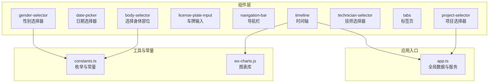

图示来源
- [miniprogram/components/body-selector/body-selector.ts](file://miniprogram/components/body-selector/body-selector.ts#L1-L27)
- [miniprogram/components/date-picker/date-picker.ts](file://miniprogram/components/date-picker/date-picker.ts#L1-L101)
- [miniprogram/components/gender-selector/gender-selector.ts](file://miniprogram/components/gender-selector/gender-selector.ts#L1-L22)
- [miniprogram/components/license-plate-input/license-plate-input.ts](file://miniprogram/components/license-plate-input/license-plate-input.ts#L1-L226)
- [miniprogram/components/navigation-bar/navigation-bar.ts](file://miniprogram/components/navigation-bar/navigation-bar.ts#L1-L114)
- [miniprogram/components/project-selector/project-selector.ts](file://miniprogram/components/project-selector/project-selector.ts#L1-L38)
- [miniprogram/components/technician-selector/technician-selector.ts](file://miniprogram/components/technician-selector/technician-selector.ts#L1-L35)
- [miniprogram/components/tabs/tabs.ts](file://miniprogram/components/tabs/tabs.ts#L1-L20)
- [miniprogram/components/timeline/timeline.ts](file://miniprogram/components/timeline/timeline.ts#L1-L474)
- [miniprogram/utils/constants.ts](file://miniprogram/utils/constants.ts#L1-L49)
- [miniprogram/app.ts](file://miniprogram/app.ts#L1-L191)
- [miniprogram/utils/wx-charts.js](file://miniprogram/utils/wx-charts.js#L1-L800)

章节来源
- [package.json](file://package.json#L1-L28)
- [tsconfig.json](file://tsconfig.json#L1-L31)

## 核心组件
本节从“属性定义与默认值”“生命周期与数据流”“事件处理与外部通信”“样式与主题”四个方面，总结现有组件的通用模式，作为新组件开发的参考模板。

- 属性定义与默认值
  - 使用 properties 定义输入属性，明确 type、value（默认值）与 observer（可选）。
  - 对于复杂对象或数组，建议提供空对象/空数组默认值，避免运行时异常。
  - 参考：[date-picker.ts](file://miniprogram/components/date-picker/date-picker.ts#L10-L15)，[license-plate-input.ts](file://miniprogram/components/license-plate-input/license-plate-input.ts#L2-L11)，[technician-selector.ts](file://miniprogram/components/technician-selector/technician-selector.ts#L2-L23)

- 生命周期与数据流
  - 使用 lifetimes 的 attached 初始化内部状态；必要时结合 observers 响应属性变化。
  - 数据更新统一通过 setData，避免直接修改 data 引发不可预期行为。
  - 参考：[date-picker.ts](file://miniprogram/components/date-picker/date-picker.ts#L23-L45)，[timeline.ts](file://miniprogram/components/timeline/timeline.ts#L75-L86)

- 事件处理与外部通信
  - 通过 triggerEvent 向父组件传递变更，事件命名语义化，参数结构清晰。
  - 参考：[body-selector.ts](file://miniprogram/components/body-selector/body-selector.ts#L22-L25)，[tabs.ts](file://miniprogram/components/tabs/tabs.ts#L14-L17)

- 样式与主题
  - 组件样式独立，必要时通过 extClass 暴露类名以支持页面级主题定制。
  - 参考：[navigation-bar.ts](file://miniprogram/components/navigation-bar/navigation-bar.ts#L6-L9)

章节来源
- [miniprogram/components/date-picker/date-picker.ts](file://miniprogram/components/date-picker/date-picker.ts#L10-L45)
- [miniprogram/components/license-plate-input/license-plate-input.ts](file://miniprogram/components/license-plate-input/license-plate-input.ts#L2-L11)
- [miniprogram/components/technician-selector/technician-selector.ts](file://miniprogram/components/technician-selector/technician-selector.ts#L2-L23)
- [miniprogram/components/body-selector/body-selector.ts](file://miniprogram/components/body-selector/body-selector.ts#L22-L25)
- [miniprogram/components/tabs/tabs.ts](file://miniprogram/components/tabs/tabs.ts#L14-L17)
- [miniprogram/components/navigation-bar/navigation-bar.ts](file://miniprogram/components/navigation-bar/navigation-bar.ts#L6-L9)
- [miniprogram/components/timeline/timeline.ts](file://miniprogram/components/timeline/timeline.ts#L75-L86)

## 架构总览
下图展示组件与页面、应用服务、云函数/数据库之间的交互关系，体现组件的职责边界与数据流向。

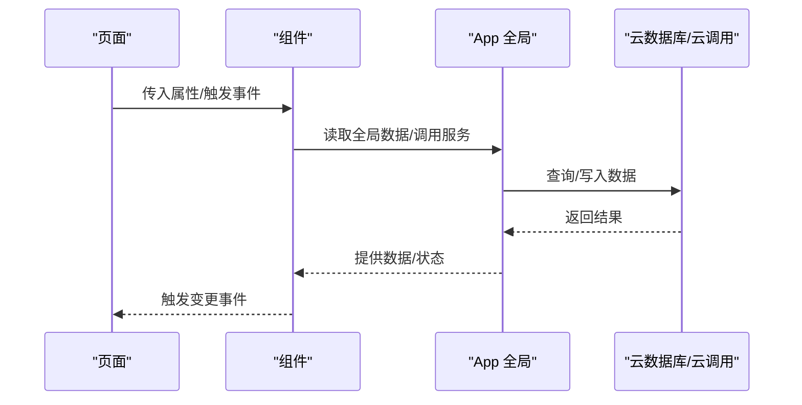

图示来源
- [miniprogram/components/project-selector/project-selector.ts](file://miniprogram/components/project-selector/project-selector.ts#L14-L24)
- [miniprogram/app.ts](file://miniprogram/app.ts#L68-L108)
- [miniprogram/components/timeline/timeline.ts](file://miniprogram/components/timeline/timeline.ts#L97-L103)

## 详细组件分析

### 车牌输入组件（license-plate-input）
- 设计要点
  - 通过 observers 监听 visible 与 value，动态初始化与同步输入状态。
  - 支持新能源车与无车牌场景，自动调整位数与光标位置。
  - 通过 confirm/cancel/change 事件向上抛出用户操作结果。
- 关键流程

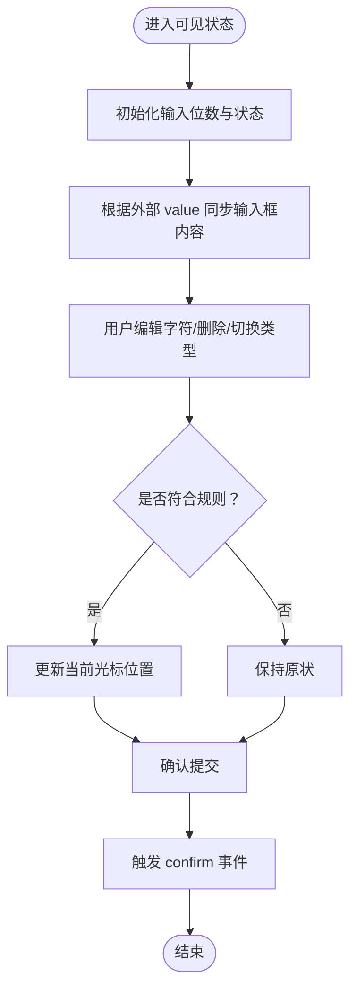

图示来源
- [miniprogram/components/license-plate-input/license-plate-input.ts](file://miniprogram/components/license-plate-input/license-plate-input.ts#L23-L35)
- [miniprogram/components/license-plate-input/license-plate-input.ts](file://miniprogram/components/license-plate-input/license-plate-input.ts#L37-L224)

章节来源
- [miniprogram/components/license-plate-input/license-plate-input.ts](file://miniprogram/components/license-plate-input/license-plate-input.ts#L1-L226)

### 时间轴组件（timeline）
- 设计要点
  - 通过 observers 监听日期与技师 ID，拉取当日排班、预约与咨询记录，计算时间块与可用空隙。
  - 计算今日实时线位置与滚动偏移，支持只读模式。
  - 错误通过自定义事件上抛，便于页面统一处理。
- 关键流程

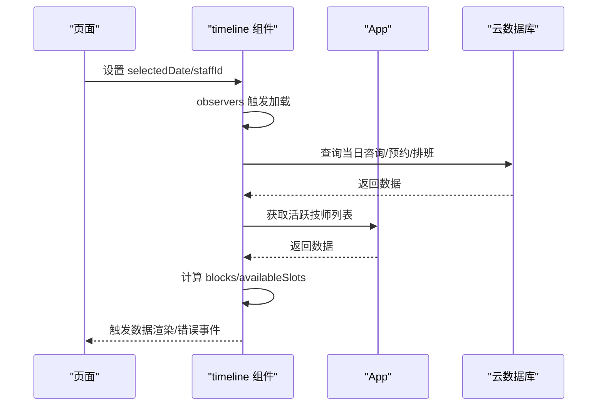

图示来源
- [miniprogram/components/timeline/timeline.ts](file://miniprogram/components/timeline/timeline.ts#L75-L81)
- [miniprogram/components/timeline/timeline.ts](file://miniprogram/components/timeline/timeline.ts#L89-L211)
- [miniprogram/app.ts](file://miniprogram/app.ts#L68-L108)

章节来源
- [miniprogram/components/timeline/timeline.ts](file://miniprogram/components/timeline/timeline.ts#L1-L474)
- [miniprogram/app.ts](file://miniprogram/app.ts#L1-L191)

### 导航栏组件（navigation-bar）
- 设计要点
  - 多插槽支持，允许页面注入左右区域。
  - 通过系统信息与胶囊按钮布局，动态计算安全区与内边距。
  - 支持显示/隐藏动画与 back/home 事件。
- 关键流程

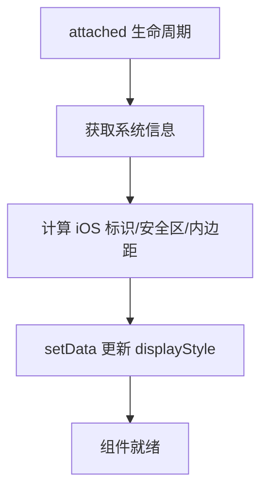

图示来源
- [miniprogram/components/navigation-bar/navigation-bar.ts](file://miniprogram/components/navigation-bar/navigation-bar.ts#L62-L76)
- [miniprogram/components/navigation-bar/navigation-bar.ts](file://miniprogram/components/navigation-bar/navigation-bar.ts#L79-L92)

章节来源
- [miniprogram/components/navigation-bar/navigation-bar.ts](file://miniprogram/components/navigation-bar/navigation-bar.ts#L1-L114)

### 性别选择器（gender-selector）
- 设计要点
  - 从 constants 中引入性别枚举，减少重复定义。
  - 通过 change 事件向外传递选中值。
- 关键流程

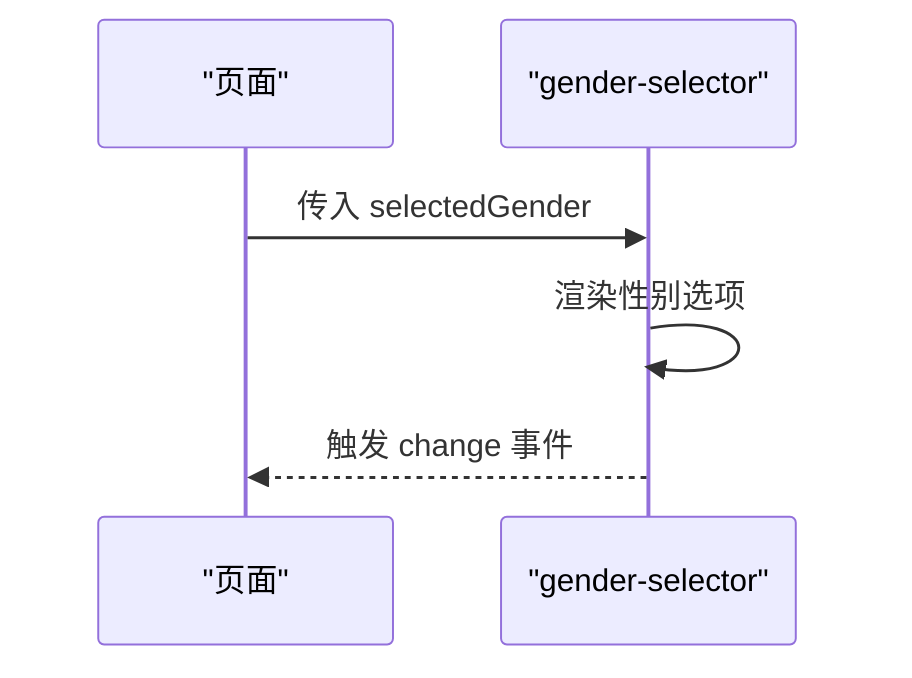

图示来源
- [miniprogram/components/gender-selector/gender-selector.ts](file://miniprogram/components/gender-selector/gender-selector.ts#L1-L22)
- [miniprogram/utils/constants.ts](file://miniprogram/utils/constants.ts#L7-L10)

章节来源
- [miniprogram/components/gender-selector/gender-selector.ts](file://miniprogram/components/gender-selector/gender-selector.ts#L1-L22)
- [miniprogram/utils/constants.ts](file://miniprogram/utils/constants.ts#L1-L49)

### 日期选择器（date-picker）
- 设计要点
  - 初始日期来自 initialDate 或当天；格式化显示日期。
  - 通过 change 事件返回选中日期。
- 关键流程

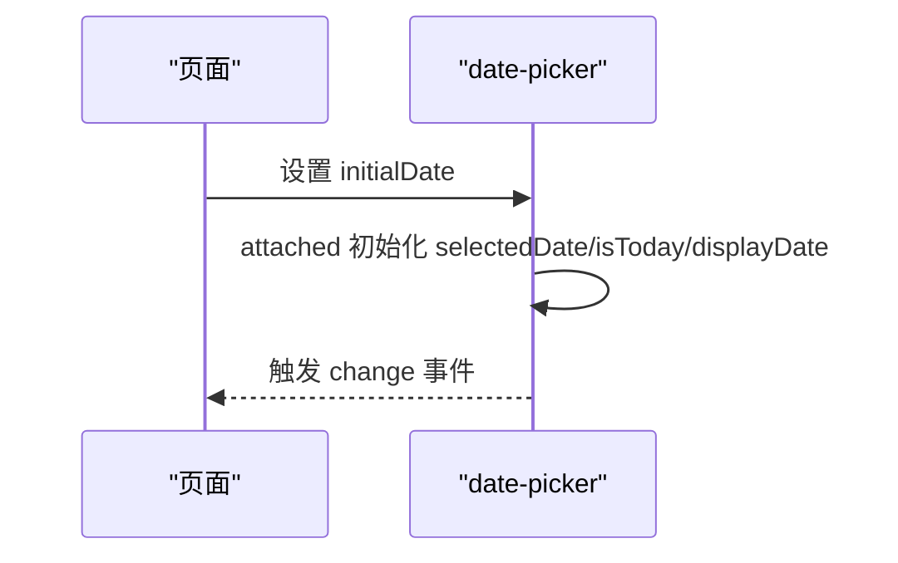

图示来源
- [miniprogram/components/date-picker/date-picker.ts](file://miniprogram/components/date-picker/date-picker.ts#L23-L32)
- [miniprogram/components/date-picker/date-picker.ts](file://miniprogram/components/date-picker/date-picker.ts#L47-L98)

章节来源
- [miniprogram/components/date-picker/date-picker.ts](file://miniprogram/components/date-picker/date-picker.ts#L1-L101)

### 项目选择器（project-selector）
- 设计要点
  - 在 attached 生命周期中异步加载项目列表，过滤正常状态项目，暴露 change 事件。
- 关键流程

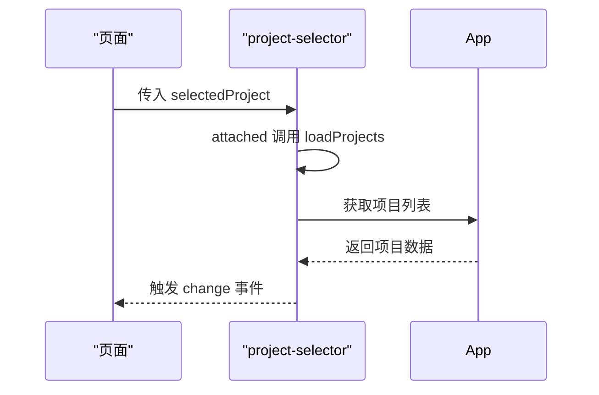

图示来源
- [miniprogram/components/project-selector/project-selector.ts](file://miniprogram/components/project-selector/project-selector.ts#L32-L36)
- [miniprogram/components/project-selector/project-selector.ts](file://miniprogram/components/project-selector/project-selector.ts#L14-L24)
- [miniprogram/app.ts](file://miniprogram/app.ts#L68-L73)

章节来源
- [miniprogram/components/project-selector/project-selector.ts](file://miniprogram/components/project-selector/project-selector.ts#L1-L38)
- [miniprogram/app.ts](file://miniprogram/app.ts#L1-L191)

### 技师选择器（technician-selector）
- 设计要点
  - 支持单选/多选、占位状态、打卡徽标等扩展能力，通过 change 与 toggleClockIn 事件对外通信。
- 关键流程

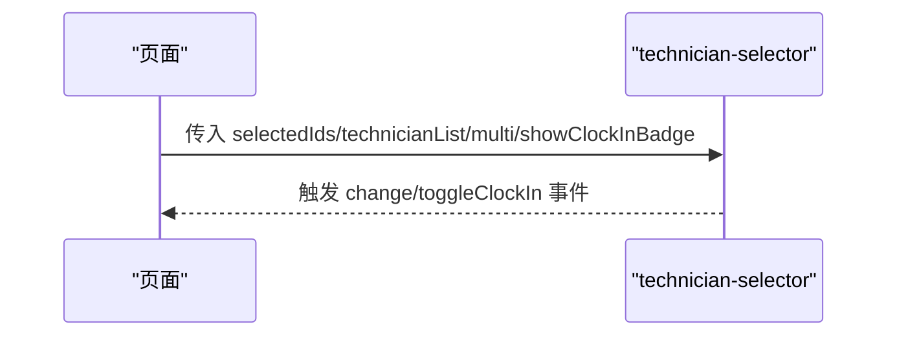

图示来源
- [miniprogram/components/technician-selector/technician-selector.ts](file://miniprogram/components/technician-selector/technician-selector.ts#L24-L34)

章节来源
- [miniprogram/components/technician-selector/technician-selector.ts](file://miniprogram/components/technician-selector/technician-selector.ts#L1-L35)

### 身体部位选择器（body-selector）
- 设计要点
  - 内置部位列表，点击触发 change 事件。
- 关键流程

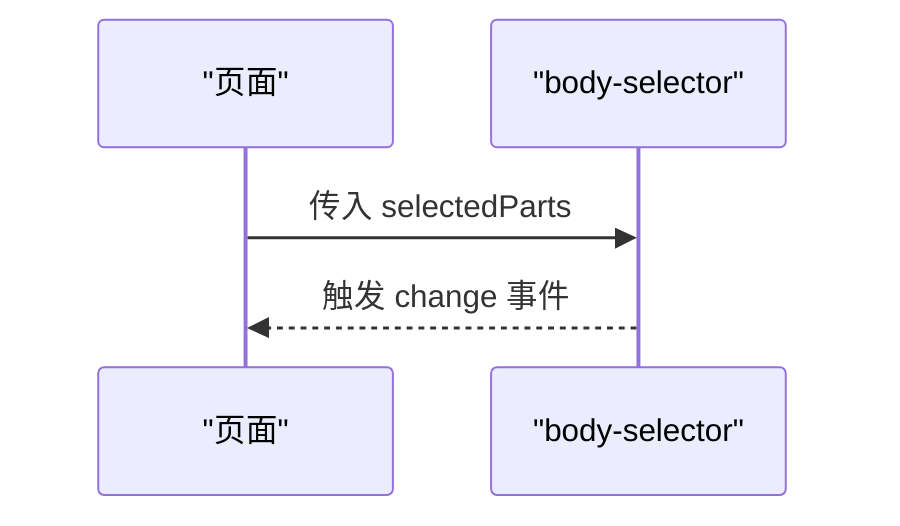

图示来源
- [miniprogram/components/body-selector/body-selector.ts](file://miniprogram/components/body-selector/body-selector.ts#L22-L25)

章节来源
- [miniprogram/components/body-selector/body-selector.ts](file://miniprogram/components/body-selector/body-selector.ts#L1-L27)

### 标签页（tabs）
- 设计要点
  - 接收 activeTab 与 tabs 列表，点击切换时触发 change 事件。
- 关键流程

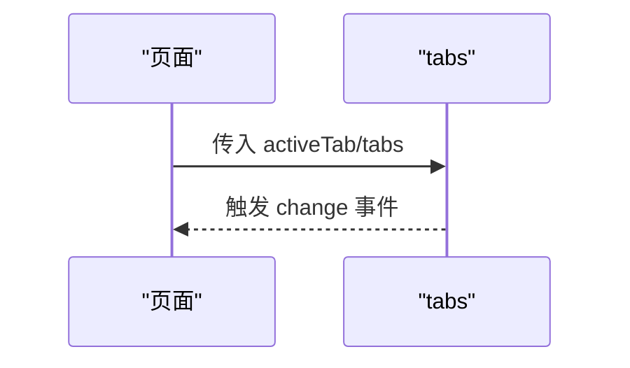

图示来源
- [miniprogram/components/tabs/tabs.ts](file://miniprogram/components/tabs/tabs.ts#L13-L18)

章节来源
- [miniprogram/components/tabs/tabs.ts](file://miniprogram/components/tabs/tabs.ts#L1-L20)

## 依赖关系分析
- 组件间依赖
  - 低耦合：多数组件仅依赖自身逻辑与常量/工具，不互相直接依赖。
  - 与全局应用的依赖：部分组件通过 App 获取全局数据（如项目列表、技师列表）。
- 外部依赖
  - 云数据库与云调用：用于查询/写入数据。
  - 图表库：wx-charts.js 提供图表绘制能力。
- 类型与工具
  - TypeScript 严格模式配置，确保类型安全。
  - ESLint/Prettier 脚本保证代码风格与质量。

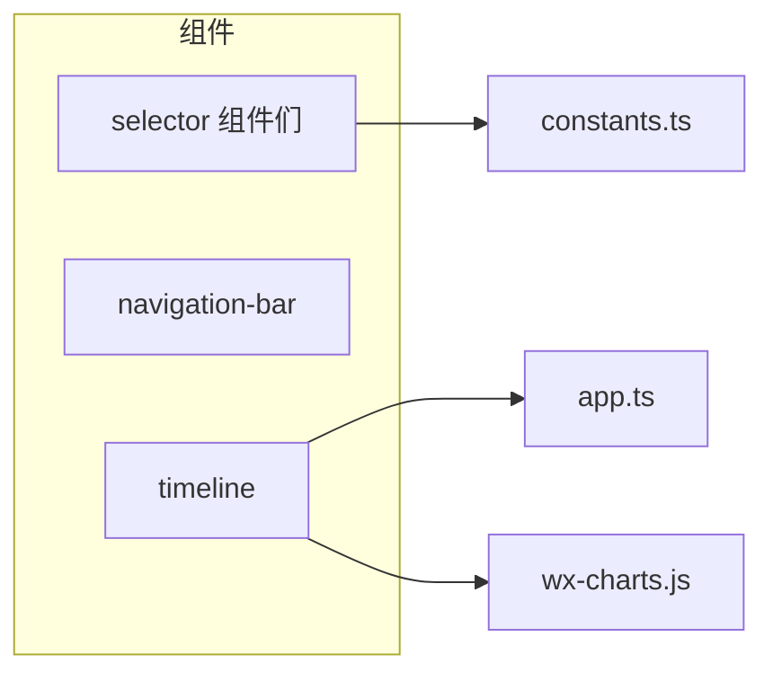

图示来源
- [miniprogram/components/project-selector/project-selector.ts](file://miniprogram/components/project-selector/project-selector.ts#L14-L24)
- [miniprogram/app.ts](file://miniprogram/app.ts#L68-L108)
- [miniprogram/utils/constants.ts](file://miniprogram/utils/constants.ts#L1-L49)
- [miniprogram/utils/wx-charts.js](file://miniprogram/utils/wx-charts.js#L1-L800)

章节来源
- [package.json](file://package.json#L1-L28)
- [tsconfig.json](file://tsconfig.json#L1-L31)

## 性能考虑
- 渲染与计算
  - 将复杂计算（如时间轴空隙计算）限制在组件内部，避免在模板中进行重型表达式计算。
  - 参考：[timeline.ts](file://miniprogram/components/timeline/timeline.ts#L213-L459)
- 数据加载
  - 使用 observers 与 pageLifetimes 控制加载时机，避免重复请求。
  - 参考：[timeline.ts](file://miniprogram/components/timeline/timeline.ts#L75-L86)
- 事件与状态
  - 合理拆分事件，避免一次性传递过多数据；必要时分批触发事件。
  - 参考：[technician-selector.ts](file://miniprogram/components/technician-selector/technician-selector.ts#L24-L34)
- 图表性能
  - 图表库内部已做大量优化，注意控制数据规模与刷新频率。
  - 参考：[wx-charts.js](file://miniprogram/utils/wx-charts.js#L1-L800)

## 故障排查指南
- 常见问题定位
  - 属性未生效：检查 properties 是否正确声明、默认值是否合理、是否被 observers 覆盖。
  - 事件未回调：确认 triggerEvent 的事件名与参数结构一致，父组件是否监听对应事件。
  - 数据不同步：确认 setData 调用与异步流程顺序，避免竞态。
- 日志与调试
  - 使用 console 输出关键节点数据，结合微信开发者工具断点调试。
- 错误事件
  - 组件内部异常可通过自定义事件上抛，便于页面统一提示。
  - 参考：[timeline.ts](file://miniprogram/components/timeline/timeline.ts#L206-L210)

章节来源
- [miniprogram/components/timeline/timeline.ts](file://miniprogram/components/timeline/timeline.ts#L206-L210)

## 结论
通过复用现有组件的属性定义、生命周期、事件与样式模式，可以快速构建高质量、可维护的小程序组件。建议在新组件开发中遵循“单一职责、显式属性、受控数据、清晰事件”的原则，并结合本指南的性能与调试建议，持续提升组件的稳定性与可扩展性。

## 附录

### 组件开发最佳实践清单
- 结构设计
  - 明确组件职责，避免过度耦合。
  - 使用 properties 显式声明输入，提供合理的默认值与 observer。
- 生命周期
  - 在 attached 中完成初始化；在 pageLifetimes.show 中处理页面可见性相关逻辑。
- 数据绑定与事件
  - 通过 setData 更新状态；使用 triggerEvent 向外传递变更。
- 样式与主题
  - 组件样式独立；必要时通过 extClass 暴露类名以便页面覆盖。
- 测试与调试
  - 编写单元测试与端到端用例；利用日志与断点定位问题。
- 性能优化
  - 控制渲染范围与计算复杂度；合理使用 observers 与 pageLifetimes。
- 发布与版本管理
  - 使用语义化版本号；记录破坏性变更；保持向后兼容或提供迁移指引。
- 集成与打包
  - 组件按需引入；避免重复依赖；利用脚手架提供的 lint/format 工具。