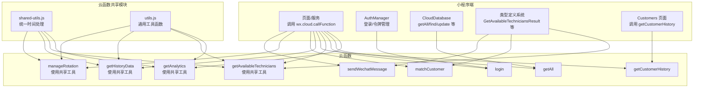
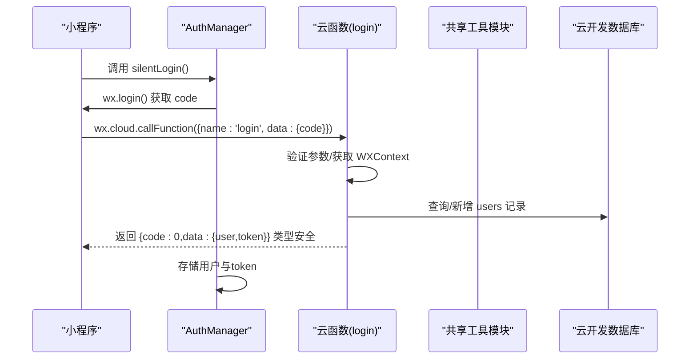
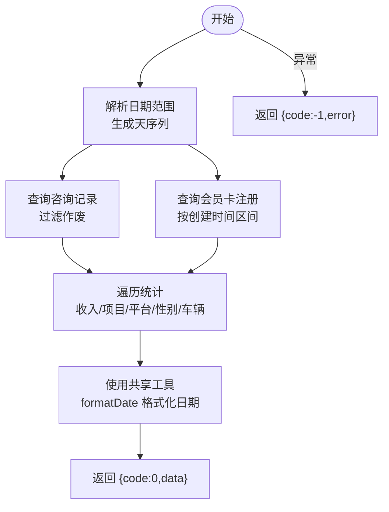
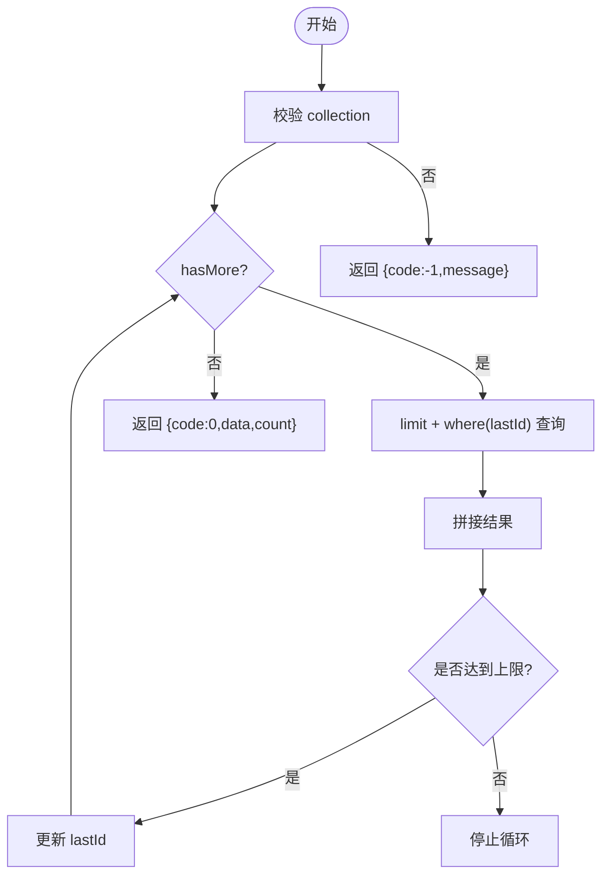
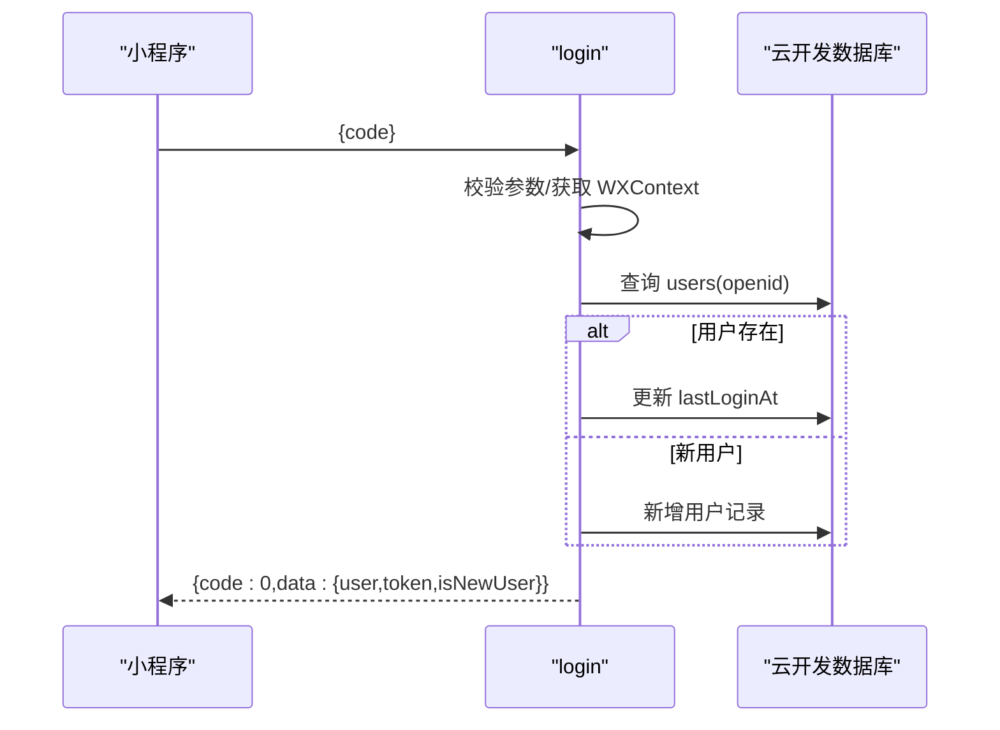
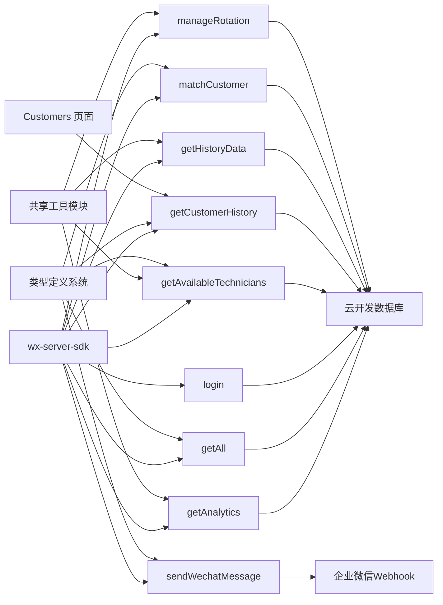

# 云函数详解

<cite>
**本文档引用的文件**
- [cloudfunctions/getAnalytics/index.js](file://cloudfunctions/getAnalytics/index.js)
- [cloudfunctions/getAnalytics/shared-utils.js](file://cloudfunctions/getAnalytics/shared-utils.js)
- [cloudfunctions/getAnalytics/package.json](file://cloudfunctions/getAnalytics/package.json)
- [cloudfunctions/getAll/index.js](file://cloudfunctions/getAll/index.js)
- [cloudfunctions/getAll/package.json](file://cloudfunctions/getAll/package.json)
- [cloudfunctions/login/index.js](file://cloudfunctions/login/index.js)
- [cloudfunctions/login/package.json](file://cloudfunctions/login/package.json)
- [cloudfunctions/getAvailableTechnicians/index.js](file://cloudfunctions/getAvailableTechnicians/index.js)
- [cloudfunctions/getAvailableTechnicians/shared-utils.js](file://cloudfunctions/getAvailableTechnicians/shared-utils.js)
- [cloudfunctions/getCustomerHistory/index.js](file://cloudfunctions/getCustomerHistory/index.js)
- [cloudfunctions/getCustomerHistory/package.json](file://cloudfunctions/getCustomerHistory/package.json)
- [cloudfunctions/getHistoryData/index.js](file://cloudfunctions/getHistoryData/index.js)
- [cloudfunctions/getHistoryData/shared-utils.js](file://cloudfunctions/getHistoryData/shared-utils.js)
- [cloudfunctions/getHistoryData/package.json](file://cloudfunctions/getHistoryData/package.json)
- [cloudfunctions/matchCustomer/index.js](file://cloudfunctions/matchCustomer/index.js)
- [cloudfunctions/manageRotation/index.js](file://cloudfunctions/manageRotation/index.js)
- [cloudfunctions/manageRotation/shared-utils.js](file://cloudfunctions/manageRotation/shared-utils.js)
- [cloudfunctions/manageRotation/package.json](file://cloudfunctions/manageRotation/package.json)
- [cloudfunctions/sendWechatMessage/index.js](file://cloudfunctions/sendWechatMessage/index.js)
- [cloudfunctions/shared/utils.js](file://cloudfunctions/shared/utils.js)
- [miniprogram/utils/auth.ts](file://miniprogram/utils/auth.ts)
- [miniprogram/utils/cloud-db.ts](file://miniprogram/utils/cloud-db.ts)
- [typings/cloud-function.d.ts](file://typings/cloud-function.d.ts)
- [miniprogram/pages/index/utils/reservation-utils.ts](file://miniprogram/pages/index/utils/reservation-utils.ts)
- [miniprogram/pages/customers/customers.ts](file://miniprogram/pages/customers/customers.ts)
</cite>

## 更新摘要
**所做更改**
- 新增共享工具模块章节，详细介绍统一时间处理和常量定义的重构
- 更新核心组件章节，增加共享工具模块的使用说明
- 更新详细组件分析，重点分析共享工具模块的实现和应用
- 增强架构总览，展示共享工具模块在云函数间的复用模式
- 更新依赖关系分析，体现共享工具模块的引入
- 增强性能考量，说明共享工具模块对代码复用和性能的影响
- 更新故障排查指南，增加共享工具模块相关的问题定位

## 目录
1. [简介](#简介)
2. [项目结构](#项目结构)
3. [核心组件](#核心组件)
4. [架构总览](#架构总览)
5. [共享工具模块](#共享工具模块)
6. [详细组件分析](#详细组件分析)
7. [云函数类型定义系统](#云函数类型定义系统)
8. [依赖关系分析](#依赖关系分析)
9. [性能考量](#性能考量)
10. [故障排查指南](#故障排查指南)
11. [结论](#结论)
12. [附录](#附录)

## 简介
本文件面向云函数模块，系统性梳理并解读以下核心云函数：数据分析函数 getAnalytics、全量数据获取函数 getAll、用户登录函数 login，以及与之密切相关的可用技师查询 getAvailableTechnicians、客户历史查询 getCustomerHistory、历史数据聚合 getHistoryData、客户匹配 matchCustomer、轮转管理 manageRotation、微信消息发送 sendWechatMessage。文档覆盖接口规范、参数校验、错误处理、返回值格式、数据库交互模式、并发控制、部署配置、环境变量、监控日志、安全与权限、性能优化策略，并提供调用示例、错误码说明与故障排查建议。

**重要更新**：本版本新增了共享工具模块（shared-utils.js），实现了代码复用和统一的时间处理逻辑。该模块在 getAnalytics、getAvailableTechnicians、getHistoryData、manageRotation 等多个云函数中被复用，消除了重复代码，提供了统一的常量定义和时间处理函数。

## 项目结构
云函数位于 cloudfunctions 目录下，每个函数独立为一个目录，包含入口文件 index.js 与包配置 package.json；小程序端通过 wx.cloud.callFunction 调用这些云函数，工具类封装了认证、存储与数据库访问。新增的共享工具模块提供统一的时间处理和常量定义，支持多云函数复用。



**图表来源**
- [cloudfunctions/getAnalytics/index.js:1-351](file://cloudfunctions/getAnalytics/index.js#L1-L351)
- [cloudfunctions/getAvailableTechnicians/index.js:1-632](file://cloudfunctions/getAvailableTechnicians/index.js#L1-L632)
- [cloudfunctions/getHistoryData/index.js:1-466](file://cloudfunctions/getHistoryData/index.js#L1-L466)
- [cloudfunctions/manageRotation/index.js:1-356](file://cloudfunctions/manageRotation/index.js#L1-L356)
- [cloudfunctions/getAnalytics/shared-utils.js:1-164](file://cloudfunctions/getAnalytics/shared-utils.js#L1-L164)
- [cloudfunctions/getAvailableTechnicians/shared-utils.js:1-164](file://cloudfunctions/getAvailableTechnicians/shared-utils.js#L1-L164)
- [cloudfunctions/getHistoryData/shared-utils.js:1-164](file://cloudfunctions/getHistoryData/shared-utils.js#L1-L164)
- [cloudfunctions/manageRotation/shared-utils.js:1-164](file://cloudfunctions/manageRotation/shared-utils.js#L1-L164)
- [cloudfunctions/shared/utils.js:1-164](file://cloudfunctions/shared/utils.js#L1-L164)

## 核心组件
- getAnalytics：按日期范围统计收入、订单、性别与车辆分布、项目与平台消费趋势、会员卡销售金额等，返回标准化指标数组与聚合对象。**已更新**：使用共享工具模块进行统一的时间格式化处理。
- getAll：突破小程序端查询限制，分页拉取集合全部数据，支持游标 lastId 与 MAX_LIMIT 控制。
- login：基于微信 code 获取 openid，维护用户表 users，生成简单 base64 token，支持刷新用户信息与绑定 staffId。
- getAvailableTechnicians：计算当前可排班技师列表，冲突检测、轮牌优先级、状态与空闲时长评估，提供强类型返回值。**已更新**：完全迁移到共享工具模块，使用统一的时间处理和常量定义。
- **getCustomerHistory**：**新增**：按手机号检索客户历史咨询、会员与使用记录，汇总访问次数与总金额，提供完整的客户消费历史视图。
- getHistoryData：按日期加载咨询记录、批量日期加载、客户历史聚合、当月技师统计与评分排行。**已更新**：使用共享工具模块进行统一的时间格式化处理。
- matchCustomer：基于姓名、性别、电话对客户库进行模糊匹配，返回最高分客户，提供强类型结果。
- manageRotation：初始化轮牌队列、获取下一位、服务完成推进、调整位置顺序。**已更新**：使用共享工具模块进行统一的时间处理和项目时长解析。
- sendWechatMessage：向企业微信群机器人 webhook 发送 markdown 消息，提供强类型返回值。

**章节来源**
- [cloudfunctions/getAnalytics/index.js:52-350](file://cloudfunctions/getAnalytics/index.js#L52-L350)
- [cloudfunctions/getAll/index.js:9-58](file://cloudfunctions/getAll/index.js#L9-L58)
- [cloudfunctions/login/index.js:11-179](file://cloudfunctions/login/index.js#L11-L179)
- [cloudfunctions/getAvailableTechnicians/index.js:18-156](file://cloudfunctions/getAvailableTechnicians/index.js#L18-L156)
- [cloudfunctions/getCustomerHistory/index.js:9-99](file://cloudfunctions/getCustomerHistory/index.js#L9-L99)
- [cloudfunctions/getHistoryData/index.js:96-465](file://cloudfunctions/getHistoryData/index.js#L96-L465)
- [cloudfunctions/matchCustomer/index.js:9-70](file://cloudfunctions/matchCustomer/index.js#L9-L70)
- [cloudfunctions/manageRotation/index.js:11-356](file://cloudfunctions/manageRotation/index.js#L11-L356)
- [cloudfunctions/sendWechatMessage/index.js:10-71](file://cloudfunctions/sendWechatMessage/index.js#L10-L71)

## 架构总览
云函数统一通过 wx-server-sdk 初始化环境，使用云开发数据库 cloud.database() 进行查询与写入。小程序端通过 wx.cloud.callFunction 调用，AuthManager 负责静默登录与令牌持久化，CloudDatabase 封装 getAll 等常用操作。**新增**：共享工具模块提供统一的时间处理和常量定义，支持多云函数复用，消除重复代码。



**图表来源**
- [miniprogram/utils/auth.ts:78-126](file://miniprogram/utils/auth.ts#L78-L126)
- [cloudfunctions/login/index.js:11-90](file://cloudfunctions/login/index.js#L11-L90)
- [miniprogram/utils/cloud-db.ts:71-88](file://miniprogram/utils/cloud-db.ts#L71-L88)

## 共享工具模块

### 模块概述
共享工具模块（shared-utils.js）是本次架构重构的核心组件，实现了代码复用和统一的时间处理逻辑。该模块在多个云函数中被复用，消除了重复代码，提供了统一的常量定义和时间处理函数。

### 常量定义
- SHIFT_START_TIME：班次开始时间常量，支持 morning（12:00）、evening（13:00）、overtime（00:00）
- SHIFT_END_TIME：班次结束时间常量，支持 morning（22:00）、evening（23:00）、overtime（23:59）

### 时间处理函数

#### getChinaTime()
获取北京时间（UTC+8）的当前时间信息，统一使用 getUTCHours/getUTCMinutes 读取手动偏移后的值，避免因服务器本地时区不同而导致二次叠加。

**返回值结构**：
- chinaTime: Date - 北京时间对象
- todayStr: string - 格式为 YYYY-MM-DD 的当前日期
- currentHour: number - 当前小时（24小时制）
- currentMinute: number - 当前分钟
- currentMins: number - 当前时间转换为分钟数

#### parseTimeToMinutes(timeStr)
时间字符串转换为分钟数（从00:00起算），支持 "HH:mm" 格式。

#### formatMinutesToTime(minutes)
分钟数转换为时间字符串，支持 "HH:mm" 格式。

#### formatDate(date)
格式化日期为 YYYY-MM-DD 字符串。

#### formatDateTime(date)
格式化日期时间为 YYYY-MM-DD HH:mm 字符串。

#### formatHour(date)
格式化小时为 HH:00 字符串。

### 项目时长处理
- parseProjectDuration(duration)：解析项目时长字符串，如 "90分钟"，返回分钟数，默认60分钟

### 时间区间合并
- mergeTimeRanges(appointments)：合并重叠的时间区间，返回合并后的时间区间数组

### 模块导入与使用
各云函数通过 `require('./shared-utils')` 导入共享模块，支持按需导入特定函数：

```javascript
const {
    SHIFT_START_TIME,
    SHIFT_END_TIME,
    parseTimeToMinutes,
    formatMinutesToTime,
    getChinaTime,
    mergeTimeRanges
} = require('./shared-utils')
```

**章节来源**
- [cloudfunctions/getAnalytics/shared-utils.js:1-164](file://cloudfunctions/getAnalytics/shared-utils.js#L1-L164)
- [cloudfunctions/getAvailableTechnicians/shared-utils.js:1-164](file://cloudfunctions/getAvailableTechnicians/shared-utils.js#L1-L164)
- [cloudfunctions/getHistoryData/shared-utils.js:1-164](file://cloudfunctions/getHistoryData/shared-utils.js#L1-L164)
- [cloudfunctions/manageRotation/shared-utils.js:1-164](file://cloudfunctions/manageRotation/shared-utils.js#L1-L164)
- [cloudfunctions/shared/utils.js:1-164](file://cloudfunctions/shared/utils.js#L1-L164)

## 详细组件分析

### getAnalytics 数据分析函数
- 功能概述
  - 输入日期范围，统计每日收入趋势、项目消费排行、平台消费排行、性别与车辆分布、平均客单价、总订单数与总营收、会员卡销售金额。
- 参数与校验
  - 必填：startDate、endDate（字符串，YYYY-MM-DD）。
- 处理流程
  - 计算日期序列 daysBetween。
  - 查询咨询记录（过滤作废）与会员卡注册（按创建时间区间）。
  - 遍历统计：累计收入、每日收入、项目与平台消费、性别与车辆计数。
  - **更新**：使用共享工具模块的 formatDate 函数进行日期格式化。
  - 标准化输出：将映射转换为数组并排序。
- 错误处理
  - try/catch 包裹主流程，返回 {code: -1, error: message}。
- 返回值
  - {code: 0, data: {...聚合指标}}



**图表来源**
- [cloudfunctions/getAnalytics/index.js:30-42](file://cloudfunctions/getAnalytics/index.js#L30-L42)
- [cloudfunctions/getAnalytics/shared-utils.js:77-82](file://cloudfunctions/getAnalytics/shared-utils.js#L77-L82)

**章节来源**
- [cloudfunctions/getAnalytics/index.js:1-351](file://cloudfunctions/getAnalytics/index.js#L1-L351)
- [cloudfunctions/getAnalytics/shared-utils.js:1-164](file://cloudfunctions/getAnalytics/shared-utils.js#L1-L164)
- [cloudfunctions/getAnalytics/package.json:1-10](file://cloudfunctions/getAnalytics/package.json#L1-L10)

### getAll 全量数据获取函数
- 功能概述
  - 分页拉取指定集合全部数据，突破小程序端 limit 限制。
- 参数与校验
  - 必填：collection（集合名）。
- 处理流程
  - 循环查询，每次最多 MAX_LIMIT 条，使用 lastId > 条件推进游标。
- 错误处理
  - try/catch，返回 {code: -1, message}。
- 返回值
  - {code: 0, message, data: array, count}



**图表来源**
- [cloudfunctions/getAll/index.js:9-58](file://cloudfunctions/getAll/index.js#L9-L58)

**章节来源**
- [cloudfunctions/getAll/index.js:1-59](file://cloudfunctions/getAll/index.js#L1-L59)
- [cloudfunctions/getAll/package.json:1-10](file://cloudfunctions/getAll/package.json#L1-L10)

### login 用户登录函数
- 功能概述
  - 基于微信 code 获取 openid，维护 users 表，生成 token；支持刷新用户信息与绑定 staffId。
- 参数与校验
  - 必填：code；可选 action 取值 refresh、updateStaffId、authorizePhone；updateStaffId 需要 staffId。
- 处理流程
  - 获取 WXContext(openid)，查询/新增用户，更新最后登录时间；生成 token（openId:timestamp:随机串 base64）。
  - 刷新：重新查询用户并生成新 token。
  - 更新 staffId：更新用户记录并生成新 token。
- 错误处理
  - try/catch，返回 {code: -1, message}。
- 返回值
  - {code: 0, message, data: {user, token, isNewUser?}}



**图表来源**
- [cloudfunctions/login/index.js:11-90](file://cloudfunctions/login/index.js#L11-L90)
- [miniprogram/utils/auth.ts:97-126](file://miniprogram/utils/auth.ts#L97-L126)

**章节来源**
- [cloudfunctions/login/index.js:1-180](file://cloudfunctions/login/index.js#L1-L180)
- [cloudfunctions/login/package.json:1-10](file://cloudfunctions/login/package.json#L1-L10)
- [miniprogram/utils/auth.ts:1-245](file://miniprogram/utils/auth.ts#L1-L245)

### getAvailableTechnicians 可用技师查询
- 功能概述
  - 计算某日可用技师，支持 mode=availability 时返回当日排班状态；否则返回冲突与轮牌优先级。**已更新**：完全迁移到共享工具模块。
- 参数与校验
  - 必填：date、currentTime、projectDuration；可选 mode。
- 处理流程
  - 查询预约、排班、咨询记录，过滤当前编辑项；计算 proposedEndTime = currentTime + duration + 10。
  - 冲突检测：时间段重叠则标记占用并给出原因。
  - 轮牌优先级：根据 rotation_queue 的 staffList 位置排序。
  - **更新**：使用共享工具模块的 SHIFT_START_TIME、SHIFT_END_TIME 常量和 mergeTimeRanges 函数。
- 错误处理
  - try/catch，返回 {code: -1, message}。
- 返回值
  - {code: 0, message, data: 技师数组（含 isOccupied/occupiedReason/position）}

**章节来源**
- [cloudfunctions/getAvailableTechnicians/index.js:1-632](file://cloudfunctions/getAvailableTechnicians/index.js#L1-L632)
- [cloudfunctions/getAvailableTechnicians/shared-utils.js:1-164](file://cloudfunctions/getAvailableTechnicians/shared-utils.js#L1-L164)

### getCustomerHistory 客户历史查询
- 功能概述
  - **新增功能**：按手机号查询客户历史咨询记录、客户资料、会员卡与使用记录，汇总访问次数与总金额。
- 参数与校验
  - 必填：phone（字符串）。
- 处理流程
  - 咨询记录查询：从 consultation_records 集合按手机号查询，按创建时间倒序取前 100 条。
  - 客户资料查询：从 customers 集合按手机号查询，返回第一条匹配记录。
  - 会员卡查询：从 customer_membership 集合按 customerPhone 查询，按创建时间倒序。
  - 会员使用记录查询：从 membership_usage 集合按 customerPhone 查询，按创建时间倒序取前 50 条。
  - 数据整理：将咨询记录映射为 visitRecords，计算 totalVisits 和 totalAmount（排除作废记录）。
- 错误处理
  - try/catch 包裹主流程，返回 {code: -1, message}。
- 返回值
  - {code: 0, message, data: {customer, visitRecords, customerMemberships, membershipUsageRecords, totalVisits, totalAmount}}

```mermaid
flowchart TD
Start(["开始"]) --> Validate["验证 phone 参数"]
Validate --> QueryConsultations["查询咨询记录<br/>按 createdAt desc 取前100条"]
Validate --> QueryCustomer["查询客户资料<br/>按 phone 精确匹配"]
Validate --> QueryMemberships["查询会员卡记录<br/>按 createdAt desc"]
Validate --> QueryUsage["查询会员使用记录<br/>按 createdAt desc 取前50条"]
QueryConsultations --> MapRecords["映射为 visitRecords"]
QueryCustomer --> Combine["组合所有数据"]
QueryMemberships --> Combine
QueryUsage --> Combine
MapRecords --> Calculate["计算 totalVisits & totalAmount"]
Calculate --> Return["返回 {code:0,data}"}
Validate --> |异常| ReturnErr["返回 {code:-1,message}"]
```

**图表来源**
- [cloudfunctions/getCustomerHistory/index.js:9-99](file://cloudfunctions/getCustomerHistory/index.js#L9-L99)

**章节来源**
- [cloudfunctions/getCustomerHistory/index.js:1-100](file://cloudfunctions/getCustomerHistory/index.js#L1-L100)
- [cloudfunctions/getCustomerHistory/package.json:1-10](file://cloudfunctions/getCustomerHistory/package.json#L1-L10)

### getHistoryData 历史数据聚合
- 功能概述
  - 支持按单日加载、批量日期加载、客户历史聚合、当月技师统计与评分排行。**已更新**：使用共享工具模块进行统一的时间格式化处理。
- 参数与校验
  - 必填：action；按 action 不同需要 targetDate、customerPhone、customerId 等。
- 处理流程
  - loadSingleDate：按日期查询并计算当日技师计数、进行中状态、起止时间推导。
  - loadAllDates：统计所有日期并选择默认日期。
  - loadCustomerHistory：按客户手机号聚合历史，计算每日计数与起止时间。
  - getDailySummary：统计技师项目数、签到数、加班与加时等，生成月度评分排行。
  - **更新**：使用共享工具模块的 formatDateTime 函数进行日期时间格式化。
- 错误处理
  - try/catch，返回 {code: -1, message, error?}。
- 返回值
  - {code: 0, data: 结构化历史数据或统计结果}

**章节来源**
- [cloudfunctions/getHistoryData/index.js:1-466](file://cloudfunctions/getHistoryData/index.js#L1-L466)
- [cloudfunctions/getHistoryData/shared-utils.js:89-96](file://cloudfunctions/getHistoryData/shared-utils.js#L89-L96)

### matchCustomer 客户匹配
- 功能概述
  - 在客户库中基于姓名、性别、电话进行模糊匹配，返回最高分客户。
- 参数与校验
  - 至少提供 surname 或 phone。
- 处理流程
  - 遍历客户库，按电话精确匹配、部分匹配、姓名包含、性别后缀匹配打分，阈值筛选。
- 错误处理
  - try/catch，返回 {code: -1, message}。
- 返回值
  - {code: 0, message, data, score}

**章节来源**
- [cloudfunctions/matchCustomer/index.js:1-71](file://cloudfunctions/matchCustomer/index.js#L1-L71)

### manageRotation 轮转管理
- 功能概述
  - 初始化轮牌队列、获取下一位、服务完成推进、调整位置顺序。**已更新**：使用共享工具模块进行统一的时间处理和项目时长解析。
- 参数与校验
  - 必填：action；按 action 需要 date、staffId、isClockIn、fromIndex、toIndex 等。
- 处理流程
  - init：根据排班生成在班员工列表，结合昨日轮牌与优先级排序，创建 rotation_queue。
  - getNext：若队列不存在则先初始化，返回当前索引员工。
  - serveCustomer：根据 isClockIn 更新 orderCount 与 lastServedTime，推进 currentIndex。
  - adjustPosition：交换队列中员工位置并重排 position。
  - **更新**：使用共享工具模块的 parseTimeToMinutes 函数进行时间解析。
- 错误处理
  - try/catch，返回 {code: -1, message}。
- 返回值
  - {code: 0, message, data: 队列或员工信息}

**章节来源**
- [cloudfunctions/manageRotation/index.js:1-356](file://cloudfunctions/manageRotation/index.js#L1-L356)
- [cloudfunctions/manageRotation/shared-utils.js:56-59](file://cloudfunctions/manageRotation/shared-utils.js#L56-L59)

### sendWechatMessage 微信消息发送
- 功能概述
  - 向企业微信群机器人 webhook 发送 markdown 消息。
- 参数与校验
  - 必填：content。
- 处理流程
  - 组装 markdown 请求体，发起 HTTP POST；打印 DEV 日志。
- 错误处理
  - try/catch，返回 {code: -1, message}。
- 返回值
  - {code: 0, message, data}

**章节来源**
- [cloudfunctions/sendWechatMessage/index.js:1-72](file://cloudfunctions/sendWechatMessage/index.js#L1-L72)

## 云函数类型定义系统

### 类型定义概述
新增的 typings/cloud-function.d.ts 文件建立了完整的云函数响应类型系统，提供强类型支持，确保云函数调用的安全性和可靠性。

### 核心类型接口

#### CloudFunctionResult<T>
云函数通用返回值类型，提供统一的响应结构：
- code: number - 状态码，0表示成功，非0表示失败
- message?: string - 成功或失败的消息描述
- data?: T - 泛型数据字段，包含具体的业务数据

#### CloudCallResult<T>
云函数调用原始返回类型，包装 CloudFunctionResult：
- result: CloudFunctionResult<T> | null - 实际的云函数结果
- errMsg?: string - 调用错误信息

### 特定功能类型

#### GetAvailableTechniciansResult
可用技师查询的强类型返回：
- 继承 CloudFunctionResult
- data 类型为 StaffAvailability[] 数组
- 提供完整的技师信息结构类型安全

#### GetCustomerHistoryResult
**新增**：客户历史查询的强类型返回：
- 继承 CloudFunctionResult
- data 类型为 CustomerHistoryData 接口
- 包含完整的客户历史数据结构类型安全

#### MatchCustomerResult
客户匹配的强类型返回：
- 继承 CloudFunctionResult
- data 类型为 CustomerRecord 单个客户记录
- 确保匹配结果的数据完整性

#### SendWechatMessageResult
微信消息发送的强类型返回：
- 继承 CloudFunctionResult<void>
- 无具体数据返回，仅表示操作成功与否

#### GetAllResult<T>
全量数据获取的强类型返回：
- 继承 CloudFunctionResult<T[]>
- data 类型为 T[] 泛型数组
- 支持任意集合类型的强类型数据

### 类型使用示例

小程序端在调用 getAvailableTechnicians 时，现在可以使用强类型：

```typescript
const checkRes = await wx.cloud.callFunction({
  name: 'getAvailableTechnicians',
  data: { /* 参数 */ }
});

let checkAvailable: StaffAvailability[] = [];
if (checkRes.result && typeof checkRes.result === 'object') {
  const result = checkRes.result as GetAvailableTechniciansResult;
  if (result.code === 0 && result.data) {
    checkAvailable = result.data;
  }
}
```

小程序端在调用 getCustomerHistory 时，现在可以使用强类型：

```typescript
const historyRes = await wx.cloud.callFunction({
  name: 'getCustomerHistory',
  data: {
    phone: customer.phone
  }
});

let customerHistory: CustomerHistoryData = {
  customer: null,
  visitRecords: [],
  customerMemberships: [],
  membershipUsageRecords: [],
  totalVisits: 0,
  totalAmount: 0
};

if (historyRes.result && typeof historyRes.result === 'object') {
  const result = historyRes.result as GetCustomerHistoryResult;
  if (result.code === 0 && result.data) {
    customerHistory = result.data;
  }
}
```

### 类型系统优势

1. **编译时类型检查**：在开发阶段就能发现类型错误
2. **智能代码补全**：IDE能够提供准确的代码补全建议
3. **文档化类型信息**：类型定义本身就是完整的API文档
4. **运行时安全保障**：通过类型断言确保数据结构正确性
5. **团队协作效率**：明确的类型契约减少沟通成本

**章节来源**
- [typings/cloud-function.d.ts:1-75](file://typings/cloud-function.d.ts#L1-L75)
- [miniprogram/pages/index/utils/reservation-utils.ts:100-173](file://miniprogram/pages/index/utils/reservation-utils.ts#L100-L173)

## 依赖关系分析
- 通用依赖
  - wx-server-sdk：初始化环境、获取 WXContext、数据库操作。
- 数据库集合
  - users、consultation_records、reservations、schedule、rotation_queue、staff、customers、customer_membership、membership_usage 等。
- 小程序端依赖
  - AuthManager：封装登录、刷新、更新 staffId、存储 token 与用户信息。
  - CloudDatabase：封装 getAll、find、saveConsultation 等常用操作。
  - Customers 页面：调用 getCustomerHistory 获取客户历史数据。
- 类型系统依赖
  - typings/cloud-function.d.ts：提供完整的类型定义支持。
- **共享工具模块依赖**：**新增**
  - cloudfunctions/shared-utils.js：提供统一的时间处理和常量定义
  - 支持 getAnalytics、getAvailableTechnicians、getHistoryData、manageRotation 等多个云函数复用



**图表来源**
- [cloudfunctions/getAnalytics/index.js:1-10](file://cloudfunctions/getAnalytics/index.js#L1-L10)
- [cloudfunctions/getAvailableTechnicians/index.js:1-16](file://cloudfunctions/getAvailableTechnicians/index.js#L1-L16)
- [cloudfunctions/getHistoryData/index.js:1-8](file://cloudfunctions/getHistoryData/index.js#L1-L8)
- [cloudfunctions/manageRotation/index.js:1-9](file://cloudfunctions/manageRotation/index.js#L1-L9)
- [cloudfunctions/getAnalytics/shared-utils.js:1-164](file://cloudfunctions/getAnalytics/shared-utils.js#L1-L164)
- [cloudfunctions/getAvailableTechnicians/shared-utils.js:1-164](file://cloudfunctions/getAvailableTechnicians/shared-utils.js#L1-L164)
- [cloudfunctions/getHistoryData/shared-utils.js:1-164](file://cloudfunctions/getHistoryData/shared-utils.js#L1-L164)
- [cloudfunctions/manageRotation/shared-utils.js:1-164](file://cloudfunctions/manageRotation/shared-utils.js#L1-L164)
- [typings/cloud-function.d.ts:1-75](file://typings/cloud-function.d.ts#L1-L75)
- [miniprogram/pages/customers/customers.ts:236-241](file://miniprogram/pages/customers/customers.ts#L236-L241)

**章节来源**
- [cloudfunctions/getAnalytics/package.json:6-8](file://cloudfunctions/getAnalytics/package.json#L6-L8)
- [cloudfunctions/getAvailableTechnicians/package.json:6-8](file://cloudfunctions/getAvailableTechnicians/package.json#L6-L8)
- [cloudfunctions/getHistoryData/package.json:6-8](file://cloudfunctions/getHistoryData/package.json#L6-L8)
- [cloudfunctions/manageRotation/package.json:6-8](file://cloudfunctions/manageRotation/package.json#L6-L8)
- [cloudfunctions/getAnalytics/shared-utils.js:1-164](file://cloudfunctions/getAnalytics/shared-utils.js#L1-L164)
- [cloudfunctions/getAvailableTechnicians/shared-utils.js:1-164](file://cloudfunctions/getAvailableTechnicians/shared-utils.js#L1-L164)
- [cloudfunctions/getHistoryData/shared-utils.js:1-164](file://cloudfunctions/getHistoryData/shared-utils.js#L1-L164)
- [cloudfunctions/manageRotation/shared-utils.js:1-164](file://cloudfunctions/manageRotation/shared-utils.js#L1-L164)
- [typings/cloud-function.d.ts:1-75](file://typings/cloud-function.d.ts#L1-L75)

## 性能考量
- 分页与游标
  - getAll 使用 MAX_LIMIT 与 lastId 游标，避免一次性拉取过多数据导致超时或内存压力。
- 查询优化
  - getAnalytics 对日期范围使用 _.in 与时间区间查询；getHistoryData 对日期字段使用正则或字段过滤。
- 并发与锁
  - manageRotation 中对队列的更新采用单文档写入，避免多实例同时修改导致竞争；如需更强一致性，可在关键路径引入文档级乐观锁或事务（云开发数据库不支持跨集合事务，需在应用层协调）。
- **共享工具模块性能优化**：**新增**
  - 通过模块化设计减少重复代码，提高维护效率
  - 统一的时间处理逻辑避免了各函数中的重复实现
  - 按需导入机制减少了不必要的模块加载开销
- 时间计算
  - getAvailableTechnicians 与 getHistoryData 使用分钟换算与本地时间偏移，减少复杂时间库依赖。**已更新**：使用共享工具模块的统一时间处理函数。
- 缓存与去重
  - 建议在高频查询场景增加 Redis 缓存（需自建），对静态数据与热点报表做缓存。
- 类型系统性能
  - TypeScript 类型检查在编译时完成，运行时无性能开销，但能显著提升开发效率和代码质量。
- **getCustomerHistory 性能优化**
  - **新增**：针对 getCustomerHistory 的查询已设置合理的限制（咨询记录取前100条，会员使用记录取前50条），避免大量数据查询影响性能。
  - **新增**：按 createdAt 字段建立索引可进一步提升查询性能。

## 故障排查指南
- 通用错误码
  - code: 0 表示成功；非 0 表示失败，message 提供错误描述。
- 常见问题定位
  - 参数缺失：检查必填字段（如 code、collection、startDate/endDate、phone、action 等）。
  - 数据库查询异常：确认集合名称正确、索引是否存在、查询条件是否合理。
  - 登录失败：确认 wx.login 是否成功、code 是否过期、WXContext 是否可获取。
  - 轮转异常：确认 schedule 与 rotation_queue 是否存在、staffId 是否在轮牌中。
  - Webhook 发送失败：检查 WEBHOOK_URL 有效性、网络连通性、请求体格式。
  - 类型错误：检查云函数调用处的类型断言是否正确，确保数据结构符合预期。
  - **getCustomerHistory 查询异常**：**新增**：检查 phone 参数格式是否正确，确认 customers、consultation_records、customer_membership、membership_usage 集合是否存在且有数据。
  - **共享工具模块异常**：**新增**：检查 shared-utils.js 文件是否存在且可正常导入，确认时间处理函数的参数格式正确。
- 日志与监控
  - 在云函数中添加必要的 console 输出（如 DEV 场景），结合腾讯云云函数日志面板查看。
  - 小程序端使用 AuthManager 的错误提示与重试机制。
  - 利用 TypeScript 的类型检查提前发现潜在问题。
  - **新增**：监控共享工具模块的导入和使用情况，确保各云函数正确引用统一的时间处理逻辑。

**章节来源**
- [cloudfunctions/getAnalytics/index.js:45-50](file://cloudfunctions/getAnalytics/index.js#L45-L50)
- [cloudfunctions/getAll/index.js:12-17](file://cloudfunctions/getAll/index.js#L12-L17)
- [cloudfunctions/login/index.js:22-27](file://cloudfunctions/login/index.js#L22-L27)
- [cloudfunctions/getAvailableTechnicians/index.js:16-21](file://cloudfunctions/getAvailableTechnicians/index.js#L16-L21)
- [cloudfunctions/getCustomerHistory/index.js:13-18](file://cloudfunctions/getCustomerHistory/index.js#L13-L18)
- [cloudfunctions/getHistoryData/index.js:93-98](file://cloudfunctions/getHistoryData/index.js#L93-L98)
- [cloudfunctions/matchCustomer/index.js:12-18](file://cloudfunctions/matchCustomer/index.js#L12-L18)
- [cloudfunctions/manageRotation/index.js:24-29](file://cloudfunctions/manageRotation/index.js#L24-L29)
- [cloudfunctions/sendWechatMessage/index.js:13-18](file://cloudfunctions/sendWechatMessage/index.js#L13-L18)

## 结论
本文档系统梳理了云函数模块的核心能力与实现细节，明确了各函数的输入输出、参数校验、错误处理与数据库交互模式。**重大更新**：新增的共享工具模块（shared-utils.js）实现了代码复用和统一的时间处理逻辑，显著提升了代码质量和维护效率。该模块在 getAnalytics、getAvailableTechnicians、getHistoryData、manageRotation 等多个云函数中被复用，消除了重复代码，提供了统一的常量定义和时间处理函数。

新增的类型定义系统显著提升了云函数调用的安全性和可靠性，为开发者提供了完整的类型安全保障。新增的 getCustomerHistory 客户历史查询功能为增强的客户管理提供了强大的数据支持，通过结构化的客户消费记录访问，帮助用户更好地了解客户行为和消费习惯。

建议在生产环境中完善权限控制、引入缓存与监控告警、对高并发场景进行限流与异步化改造，并持续优化查询索引与数据模型以提升整体性能与稳定性。对于 getCustomerHistory 等涉及多集合关联查询的函数，建议定期监控查询性能并根据实际使用情况进行索引优化。共享工具模块的引入为未来的功能扩展奠定了良好的基础，建议继续完善模块化设计，提升代码的可维护性和可扩展性。

## 附录

### 接口规范与调用示例（路径指引）
- getAnalytics
  - 请求：{ startDate, endDate }
  - 返回：{ code, data }
  - 示例路径：[cloudfunctions/getAnalytics/index.js:52-67](file://cloudfunctions/getAnalytics/index.js#L52-L67)
- getAll
  - 请求：{ collection }
  - 返回：GetAllResult<T> 类型
  - 示例路径：[cloudfunctions/getAll/index.js:9-58](file://cloudfunctions/getAll/index.js#L9-L58)
- login
  - 请求：{ code } 或 { action: 'refresh' } 或 { action: 'updateStaffId', staffId }
  - 返回：{ code, message, data: { user, token, isNewUser? } }
  - 示例路径：[cloudfunctions/login/index.js:11-90](file://cloudfunctions/login/index.js#L11-L90)
- getAvailableTechnicians
  - 请求：{ date, currentTime, projectDuration, currentReservationIds?, currentConsultationId?, mode? }
  - 返回：GetAvailableTechniciansResult 类型
  - 示例路径：[cloudfunctions/getAvailableTechnicians/index.js:18-156](file://cloudfunctions/getAvailableTechnicians/index.js#L18-L156)
- **getCustomerHistory**：**新增**
  - 请求：{ phone }
  - 返回：GetCustomerHistoryResult 类型
  - 示例路径：[cloudfunctions/getCustomerHistory/index.js:9-99](file://cloudfunctions/getCustomerHistory/index.js#L9-L99)
- getHistoryData
  - 请求：{ action, targetDate?, customerPhone?, customerId? }
  - 返回：{ code, data }
  - 示例路径：[cloudfunctions/getHistoryData/index.js:96-465](file://cloudfunctions/getHistoryData/index.js#L96-L465)
- matchCustomer
  - 请求：{ surname?, gender?, phone? }
  - 返回：MatchCustomerResult 类型
  - 示例路径：[cloudfunctions/matchCustomer/index.js:9-70](file://cloudfunctions/matchCustomer/index.js#L9-L70)
- manageRotation
  - 请求：{ action, date, staffId?, isClockIn?, fromIndex?, toIndex? }
  - 返回：{ code, message, data }
  - 示例路径：[cloudfunctions/manageRotation/index.js:11-356](file://cloudfunctions/manageRotation/index.js#L11-L356)
- sendWechatMessage
  - 请求：{ content }
  - 返回：SendWechatMessageResult 类型
  - 示例路径：[cloudfunctions/sendWechatMessage/index.js:10-71](file://cloudfunctions/sendWechatMessage/index.js#L10-L71)

### 数据库集合与字段要点
- users：openId、role、status、createdAt、updatedAt、lastLoginAt、staffId
- consultation_records：date、technician、startTime、endTime、isVoided、amount、project、couponPlatform、phone、gender、licensePlate、settlement
- reservations：date、startTime、endTime、status、technicianName
- schedule：date、staffId、shift
- rotation_queue：date、staffList、currentIndex
- customers：phone、name、gender、avatar
- customer_membership：customerPhone、cardName、paidAmount、salesStaff、createdAt
- membership_usage：customerPhone、usedAt、project

**章节来源**
- [miniprogram/utils/cloud-db.ts:303-321](file://miniprogram/utils/cloud-db.ts#L303-L321)

### 部署配置与环境变量
- 环境变量
  - env：通过 cloud.DYNAMIC_CURRENT_ENV 动态指向当前环境。
  - WEBHOOK_URL：企业微信机器人地址（sendWechatMessage）。
- 依赖安装
  - 所有云函数均依赖 wx-server-sdk，版本在各自 package.json 中声明。
- 类型系统配置
  - typings/cloud-function.d.ts 提供完整的类型定义
  - 小程序端通过 TypeScript 使用强类型支持
- 部署建议
  - 为不同环境（开发/测试/生产）配置独立 envId。
  - 为敏感配置（如 WEBHOOK_URL）使用云开发环境变量管理。
- **getCustomerHistory 部署注意事项**：**新增**
  - **新增**：确保 customers、consultation_records、customer_membership、membership_usage 四个集合存在且有数据。
  - **新增**：为 phone 字段建立索引可提升查询性能。
- **共享工具模块部署注意事项**：**新增**
  - **新增**：确保 shared-utils.js 文件存在于各云函数目录中，且可正常导入。
  - **新增**：验证共享模块的导出函数在各云函数中正确使用。

**章节来源**
- [cloudfunctions/getAnalytics/index.js:3-5](file://cloudfunctions/getAnalytics/index.js#L3-L5)
- [cloudfunctions/getAvailableTechnicians/index.js:11-13](file://cloudfunctions/getAvailableTechnicians/index.js#L11-L13)
- [cloudfunctions/getHistoryData/index.js:3-5](file://cloudfunctions/getHistoryData/index.js#L3-L5)
- [cloudfunctions/manageRotation/index.js:3-5](file://cloudfunctions/manageRotation/index.js#L3-L5)
- [cloudfunctions/getAnalytics/package.json:6-8](file://cloudfunctions/getAnalytics/package.json#L6-L8)
- [cloudfunctions/getAvailableTechnicians/package.json:6-8](file://cloudfunctions/getAvailableTechnicians/package.json#L6-L8)
- [cloudfunctions/getHistoryData/package.json:6-8](file://cloudfunctions/getHistoryData/package.json#L6-L8)
- [cloudfunctions/manageRotation/package.json:6-8](file://cloudfunctions/manageRotation/package.json#L6-L8)
- [cloudfunctions/getAnalytics/shared-utils.js:1-164](file://cloudfunctions/getAnalytics/shared-utils.js#L1-L164)
- [cloudfunctions/getAvailableTechnicians/shared-utils.js:1-164](file://cloudfunctions/getAvailableTechnicians/shared-utils.js#L1-L164)
- [cloudfunctions/getHistoryData/shared-utils.js:1-164](file://cloudfunctions/getHistoryData/shared-utils.js#L1-L164)
- [cloudfunctions/manageRotation/shared-utils.js:1-164](file://cloudfunctions/manageRotation/shared-utils.js#L1-L164)
- [typings/cloud-function.d.ts:1-75](file://typings/cloud-function.d.ts#L1-L75)

### 安全与权限
- 登录与鉴权
  - login 基于 WXContext.openId 维护用户，生成简单 token；建议在小程序端与服务端约定 token 校验规则。
- 权限控制
  - 建议在云函数中增加角色校验（如 admin/technician），并在调用侧限制敏感操作。
- 数据访问
  - 严格限定查询条件，避免全表扫描；为高频查询建立合适索引。
- 类型安全
  - 利用 TypeScript 类型系统防止运行时类型错误
  - 在云函数调用处使用类型断言确保数据结构正确
  - 通过强类型定义约束 API 接口规范
- **getCustomerHistory 安全考虑**：**新增**
  - **新增**：phone 参数必须经过验证，防止注入攻击。
  - **新增**：对查询结果进行脱敏处理，避免泄露敏感客户信息。
  - **新增**：建议在调用侧增加频率限制，防止恶意查询。
- **共享工具模块安全考虑**：**新增**
  - **新增**：确保共享模块的导入路径正确，防止模块注入攻击。
  - **新增**：验证共享模块导出函数的参数类型，防止类型混淆攻击。
  - **新增**：在共享模块中添加适当的输入验证和错误处理。

**章节来源**
- [cloudfunctions/login/index.js:33-71](file://cloudfunctions/login/index.js#L33-L71)
- [miniprogram/utils/auth.ts:63-76](file://miniprogram/utils/auth.ts#L63-L76)
- [typings/cloud-function.d.ts:1-75](file://typings/cloud-function.d.ts#L1-L75)
- [cloudfunctions/getCustomerHistory/index.js:13-18](file://cloudfunctions/getCustomerHistory/index.js#L13-L18)
- [cloudfunctions/getAnalytics/shared-utils.js:28-49](file://cloudfunctions/getAnalytics/shared-utils.js#L28-L49)
- [cloudfunctions/getAvailableTechnicians/shared-utils.js:28-49](file://cloudfunctions/getAvailableTechnicians/shared-utils.js#L28-L49)
- [cloudfunctions/getHistoryData/shared-utils.js:28-49](file://cloudfunctions/getHistoryData/shared-utils.js#L28-L49)
- [cloudfunctions/manageRotation/shared-utils.js:28-49](file://cloudfunctions/manageRotation/shared-utils.js#L28-L49)