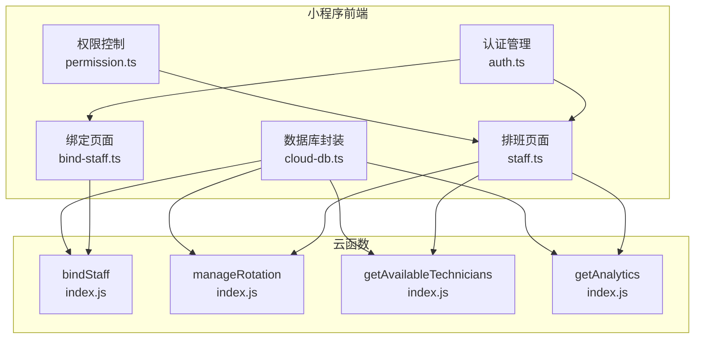
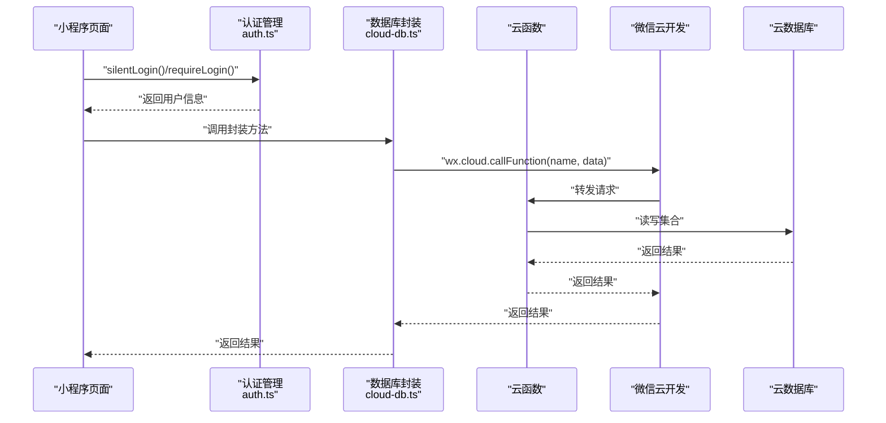
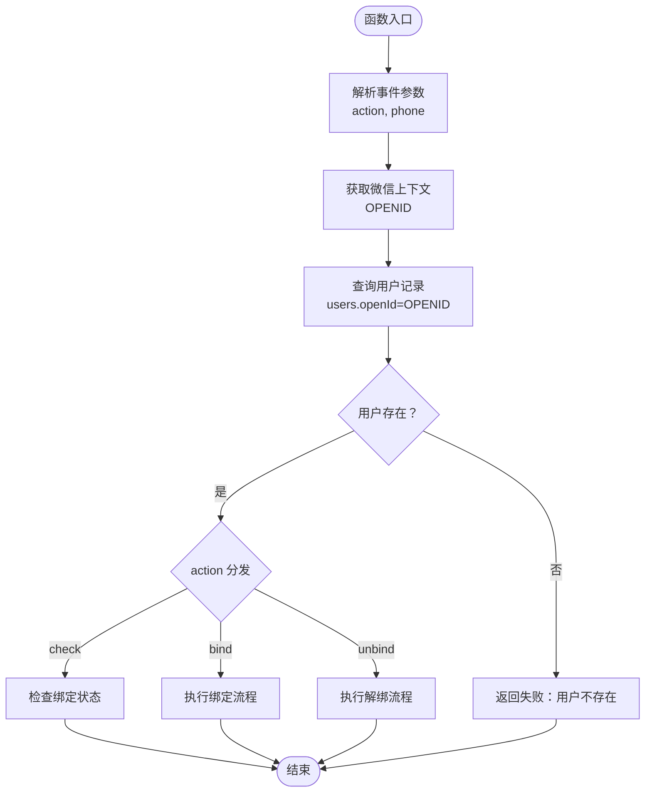
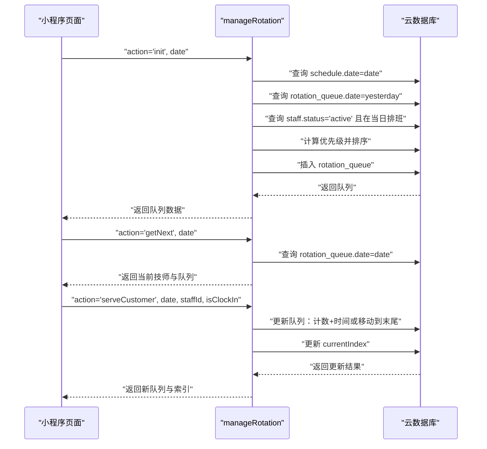
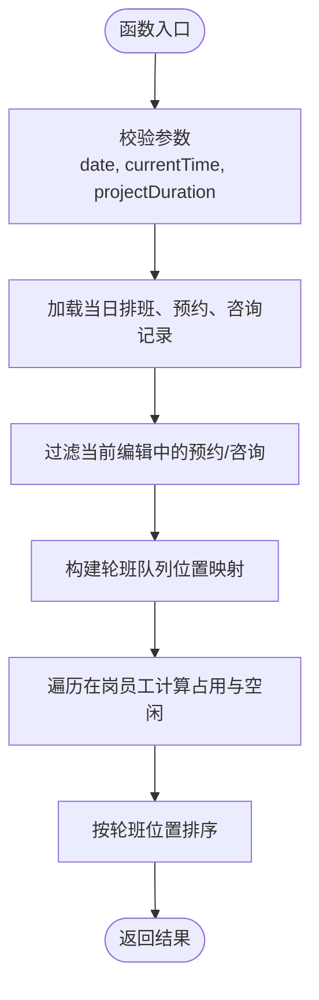
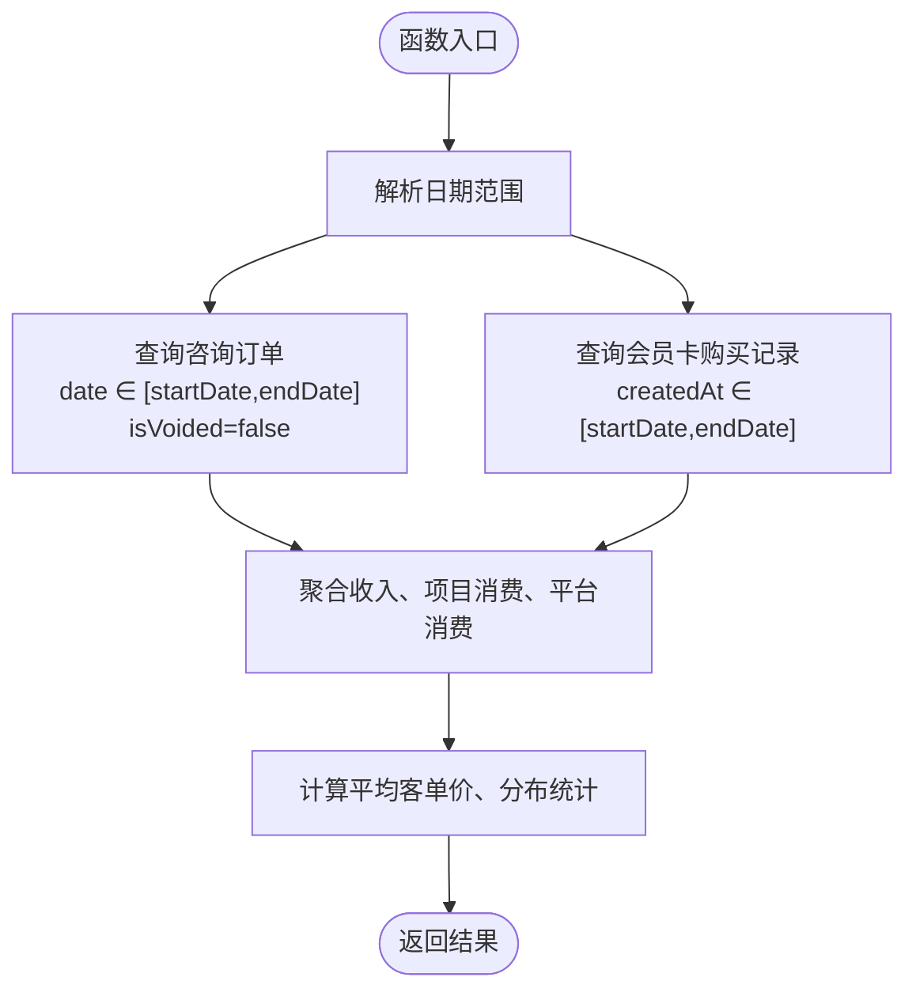
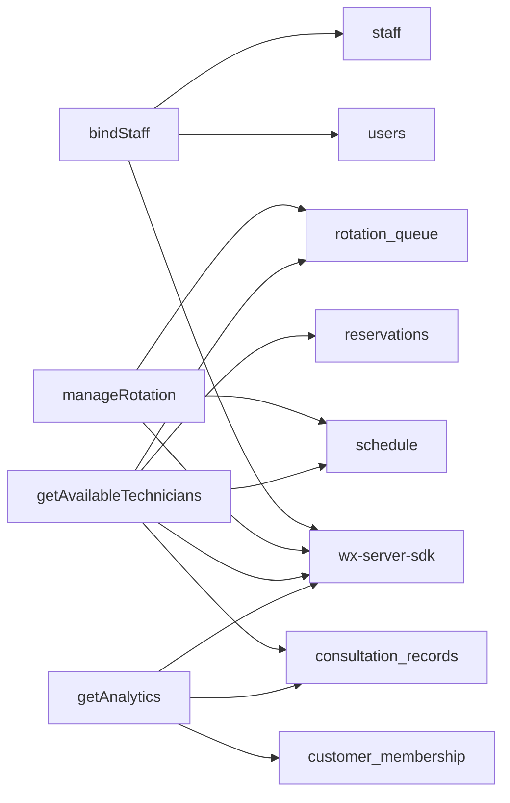
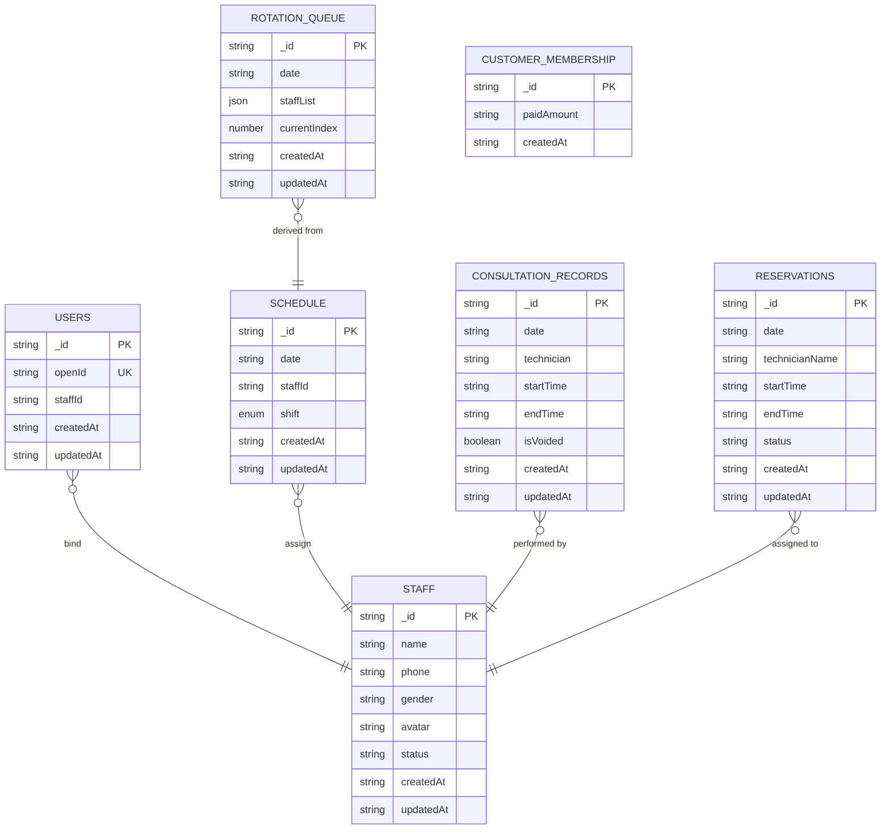

# 员工排班函数

<cite>
**本文档引用的文件**
- [bindStaff/index.js](file://cloudfunctions/bindStaff/index.js)
- [bindStaff/package.json](file://cloudfunctions/bindStaff/package.json)
- [manageRotation/index.js](file://cloudfunctions/manageRotation/index.js)
- [manageRotation/package.json](file://cloudfunctions/manageRotation/package.json)
- [getAvailableTechnicians/index.js](file://cloudfunctions/getAvailableTechnicians/index.js)
- [getAnalytics/index.js](file://cloudfunctions/getAnalytics/index.js)
- [cloud-db.ts](file://miniprogram/utils/cloud-db.ts)
- [auth.ts](file://miniprogram/utils/auth.ts)
- [permission.ts](file://miniprogram/utils/permission.ts)
- [bind-staff.ts](file://miniprogram/pages/bind-staff/bind-staff.ts)
- [staff.ts](file://miniprogram/pages/staff/staff.ts)
- [constants.ts](file://miniprogram/utils/constants.ts)
</cite>

## 目录
1. [简介](#简介)
2. [项目结构](#项目结构)
3. [核心组件](#核心组件)
4. [架构总览](#架构总览)
5. [详细组件分析](#详细组件分析)
6. [依赖分析](#依赖分析)
7. [性能考虑](#性能考虑)
8. [故障排除指南](#故障排除指南)
9. [结论](#结论)
10. [附录](#附录)

## 简介
本文件为员工排班管理云函数的详细API文档，重点覆盖以下内容：
- 员工绑定函数 bindStaff 的技师信息关联、权限验证与绑定关系建立机制
- 轮班管理函数 manageRotation 的排班计划生成、冲突检测、轮班周期计算与动态调整算法
- 排班数据的存储结构、查询优化策略与并发控制机制
- 员工排班的完整生命周期管理、批量操作支持与异常处理方案
- 排班规则配置、节假日处理、加班统计与报表生成的实现细节

## 项目结构
本项目采用云开发 + 微信小程序前端的分层架构，云函数位于 cloudfunctions 目录，前端逻辑位于 miniprogram 目录。与排班相关的关键模块包括：
- 云函数：bindStaff（员工绑定）、manageRotation（轮班管理）、getAvailableTechnicians（可用技师查询）、getAnalytics（报表分析）
- 前端工具：cloud-db.ts（统一数据库访问封装）、auth.ts（认证与会话管理）、permission.ts（权限控制）
- 页面：bind-staff.ts（绑定页面）、staff.ts（排班管理页面）

图表来源
- [bind-staff.ts](file://miniprogram/pages/bind-staff/bind-staff.ts#L1-L199)
- [staff.ts](file://miniprogram/pages/staff/staff.ts#L1-L460)
- [cloud-db.ts](file://miniprogram/utils/cloud-db.ts#L1-L321)
- [auth.ts](file://miniprogram/utils/auth.ts#L1-L245)
- [permission.ts](file://miniprogram/utils/permission.ts#L1-L194)
- [bindStaff/index.js](file://cloudfunctions/bindStaff/index.js#L1-L189)
- [manageRotation/index.js](file://cloudfunctions/manageRotation/index.js#L1-L327)
- [getAvailableTechnicians/index.js](file://cloudfunctions/getAvailableTechnicians/index.js#L1-L285)
- [getAnalytics/index.js](file://cloudfunctions/getAnalytics/index.js#L1-L172)

章节来源
- [bindStaff/index.js](file://cloudfunctions/bindStaff/index.js#L1-L189)
- [manageRotation/index.js](file://cloudfunctions/manageRotation/index.js#L1-L327)
- [getAvailableTechnicians/index.js](file://cloudfunctions/getAvailableTechnicians/index.js#L1-L285)
- [getAnalytics/index.js](file://cloudfunctions/getAnalytics/index.js#L1-L172)
- [cloud-db.ts](file://miniprogram/utils/cloud-db.ts#L1-L321)
- [auth.ts](file://miniprogram/utils/auth.ts#L1-L245)
- [permission.ts](file://miniprogram/utils/permission.ts#L1-L194)
- [bind-staff.ts](file://miniprogram/pages/bind-staff/bind-staff.ts#L1-L199)
- [staff.ts](file://miniprogram/pages/staff/staff.ts#L1-L460)
- [constants.ts](file://miniprogram/utils/constants.ts#L1-L49)

## 核心组件
- bindStaff 云函数：负责用户与员工（技师）的绑定/解绑检查，包含手机号校验、员工状态校验、绑定唯一性校验与更新用户记录
- manageRotation 云函数：负责轮班队列的初始化、获取下一个技师、服务完成后的队列调整与位置动态调整
- getAvailableTechnicians 云函数：基于排班、预约与轮班队列计算技师的可用性与空闲时间
- getAnalytics 云函数：按日期范围聚合咨询订单、会员卡等数据，输出收入趋势、项目消费、平台消费等指标
- 前端工具：cloud-db.ts 提供统一的 CRUD 封装；auth.ts 管理登录态与用户信息；permission.ts 控制页面与按钮级权限

章节来源
- [bindStaff/index.js](file://cloudfunctions/bindStaff/index.js#L10-L51)
- [manageRotation/index.js](file://cloudfunctions/manageRotation/index.js#L9-L36)
- [getAvailableTechnicians/index.js](file://cloudfunctions/getAvailableTechnicians/index.js#L9-L24)
- [getAnalytics/index.js](file://cloudfunctions/getAnalytics/index.js#L36-L51)
- [cloud-db.ts](file://miniprogram/utils/cloud-db.ts#L69-L188)
- [auth.ts](file://miniprogram/utils/auth.ts#L78-L126)
- [permission.ts](file://miniprogram/utils/permission.ts#L46-L147)

## 架构总览
下图展示了从小程序页面到云函数再到数据库的整体调用链路与数据流向。

图表来源
- [auth.ts](file://miniprogram/utils/auth.ts#L78-L126)
- [cloud-db.ts](file://miniprogram/utils/cloud-db.ts#L70-L88)
- [bindStaff/index.js](file://cloudfunctions/bindStaff/index.js#L10-L51)
- [manageRotation/index.js](file://cloudfunctions/manageRotation/index.js#L9-L36)

## 详细组件分析

### 组件A：员工绑定函数 bindStaff
bindStaff 云函数通过 action 参数区分不同操作：check（检查绑定状态）、bind（绑定）、unbind（解绑）。其核心流程如下：

图表来源
- [bindStaff/index.js](file://cloudfunctions/bindStaff/index.js#L10-L51)
- [bindStaff/index.js](file://cloudfunctions/bindStaff/index.js#L53-L96)
- [bindStaff/index.js](file://cloudfunctions/bindStaff/index.js#L98-L167)
- [bindStaff/index.js](file://cloudfunctions/bindStaff/index.js#L169-L188)

关键机制说明：
- 权限验证：通过 wx-server-sdk 获取 OPENID，并据此查询 users 集合
- 绑定关系建立：校验手机号格式、员工状态为 active、确保同一员工仅被一个用户绑定；成功后更新 users.stafId
- 解绑机制：移除 users.stafId 字段并更新时间戳
- 异常处理：统一捕获错误并返回标准化响应

章节来源
- [bindStaff/index.js](file://cloudfunctions/bindStaff/index.js#L10-L51)
- [bindStaff/index.js](file://cloudfunctions/bindStaff/index.js#L53-L96)
- [bindStaff/index.js](file://cloudfunctions/bindStaff/index.js#L98-L167)
- [bindStaff/index.js](file://cloudfunctions/bindStaff/index.js#L169-L188)
- [bind-staff.ts](file://miniprogram/pages/bind-staff/bind-staff.ts#L25-L54)
- [bind-staff.ts](file://miniprogram/pages/bind-staff/bind-staff.ts#L62-L126)
- [bind-staff.ts](file://miniprogram/pages/bind-staff/bind-staff.ts#L128-L186)

### 组件B：轮班管理函数 manageRotation
manageRotation 云函数支持以下操作：init（初始化轮班队列）、getNext（获取下一个技师）、serveCustomer（服务完成）、getQueue（获取队列）、adjustPosition（调整位置）。其核心流程如下：

图表来源
- [manageRotation/index.js](file://cloudfunctions/manageRotation/index.js#L9-L36)
- [manageRotation/index.js](file://cloudfunctions/manageRotation/index.js#L38-L146)
- [manageRotation/index.js](file://cloudfunctions/manageRotation/index.js#L148-L183)
- [manageRotation/index.js](file://cloudfunctions/manageRotation/index.js#L185-L246)

轮班周期计算与动态调整算法要点：
- 优先级计算：根据昨日是否在班、昨日轮班顺序对今日优先级进行加权
- 队列初始化：基于当日排班与员工状态构建初始队列，设置 currentIndex=0
- 服务完成：根据 isClockIn 决定计数+时间或移动到队列末尾，并更新后续成员 position
- 动态调整：支持手动调整队列顺序并同步更新 position

章节来源
- [manageRotation/index.js](file://cloudfunctions/manageRotation/index.js#L9-L36)
- [manageRotation/index.js](file://cloudfunctions/manageRotation/index.js#L38-L146)
- [manageRotation/index.js](file://cloudfunctions/manageRotation/index.js#L148-L183)
- [manageRotation/index.js](file://cloudfunctions/manageRotation/index.js#L185-L246)
- [manageRotation/index.js](file://cloudfunctions/manageRotation/index.js#L274-L315)

### 组件C：可用技师查询 getAvailableTechnicians
该函数用于计算指定日期内技师的可用性，结合排班、预约与轮班队列综合判断：

图表来源
- [getAvailableTechnicians/index.js](file://cloudfunctions/getAvailableTechnicians/index.js#L9-L24)
- [getAvailableTechnicians/index.js](file://cloudfunctions/getAvailableTechnicians/index.js#L26-L63)
- [getAvailableTechnicians/index.js](file://cloudfunctions/getAvailableTechnicians/index.js#L65-L111)
- [getAvailableTechnicians/index.js](file://cloudfunctions/getAvailableTechnicians/index.js#L131-L285)

章节来源
- [getAvailableTechnicians/index.js](file://cloudfunctions/getAvailableTechnicians/index.js#L9-L24)
- [getAvailableTechnicians/index.js](file://cloudfunctions/getAvailableTechnicians/index.js#L26-L63)
- [getAvailableTechnicians/index.js](file://cloudfunctions/getAvailableTechnicians/index.js#L65-L111)
- [getAvailableTechnicians/index.js](file://cloudfunctions/getAvailableTechnicians/index.js#L131-L285)

### 组件D：报表分析 getAnalytics
按日期范围聚合咨询订单与会员卡数据，输出收入趋势、项目消费、平台消费、性别分布、有车/无车分布与平均客单价等指标。

图表来源
- [getAnalytics/index.js](file://cloudfunctions/getAnalytics/index.js#L36-L51)
- [getAnalytics/index.js](file://cloudfunctions/getAnalytics/index.js#L53-L171)

章节来源
- [getAnalytics/index.js](file://cloudfunctions/getAnalytics/index.js#L36-L51)
- [getAnalytics/index.js](file://cloudfunctions/getAnalytics/index.js#L53-L171)

## 依赖分析
- 云函数依赖：wx-server-sdk（云函数运行时）
- 数据库集合：users、staff、schedule、rotation_queue、consultation_records、reservations、customer_membership
- 前端依赖：auth.ts、cloud-db.ts、permission.ts

图表来源
- [bindStaff/package.json](file://cloudfunctions/bindStaff/package.json#L6-L8)
- [manageRotation/package.json](file://cloudfunctions/manageRotation/package.json#L6-L8)
- [bindStaff/index.js](file://cloudfunctions/bindStaff/index.js#L7)
- [manageRotation/index.js](file://cloudfunctions/manageRotation/index.js#L6)
- [getAvailableTechnicians/index.js](file://cloudfunctions/getAvailableTechnicians/index.js#L6)
- [getAnalytics/index.js](file://cloudfunctions/getAnalytics/index.js#L1)

章节来源
- [bindStaff/package.json](file://cloudfunctions/bindStaff/package.json#L1-L10)
- [manageRotation/package.json](file://cloudfunctions/manageRotation/package.json#L1-L10)
- [bindStaff/index.js](file://cloudfunctions/bindStaff/index.js#L1-L10)
- [manageRotation/index.js](file://cloudfunctions/manageRotation/index.js#L1-L10)
- [getAvailableTechnicians/index.js](file://cloudfunctions/getAvailableTechnicians/index.js#L1-L10)
- [getAnalytics/index.js](file://cloudfunctions/getAnalytics/index.js#L1-L10)

## 性能考虑
- 查询优化
  - 使用 where + in 查询在岗员工与当日排班，减少全表扫描
  - 对 schedule、rotation_queue、consultation_records 等高频查询集合建立合适索引（建议在云开发控制台配置）
- 并发控制
  - 当前实现未显式使用事务或锁，若需要强一致场景可引入云开发事务或分布式锁
- 数据结构
  - rotation_queue 中维护 position 字段以避免每次重新计算排序成本
- 前端缓存
  - 建议在小程序端缓存用户信息与常用查询结果，减少重复调用

## 故障排除指南
- bindStaff 常见问题
  - 用户不存在：检查登录态与 OPENID 获取
  - 手机号格式错误：前端与后端均进行正则校验
  - 员工状态非 active：确保员工状态为 active
  - 已被其他用户绑定：同一员工仅允许一个用户绑定
- manageRotation 常见问题
  - 轮班不存在：先调用 init 初始化队列
  - 索引越界：调整位置时校验索引范围
  - 服务完成未更新：确认 isClockIn 与 staffId 正确传入
- getAvailableTechnicians 常见问题
  - 时间格式转换：确保传入的 currentTime 为 HH:mm 格式
  - 冲突检测：检查预约与咨询记录的时间区间重叠
- getAnalytics 常见问题
  - 日期范围：确保 startDate ≤ endDate
  - 聚合字段缺失：检查结算支付数组与平台字段

章节来源
- [bindStaff/index.js](file://cloudfunctions/bindStaff/index.js#L98-L167)
- [manageRotation/index.js](file://cloudfunctions/manageRotation/index.js#L185-L246)
- [manageRotation/index.js](file://cloudfunctions/manageRotation/index.js#L274-L315)
- [getAvailableTechnicians/index.js](file://cloudfunctions/getAvailableTechnicians/index.js#L126-L129)
- [getAnalytics/index.js](file://cloudfunctions/getAnalytics/index.js#L10-L20)

## 结论
本文档系统梳理了员工绑定与轮班管理云函数的实现机制与接口行为，明确了数据流、权限验证、冲突检测与动态调整算法，并提供了性能优化与故障排除建议。结合前端工具与权限体系，可支撑完整的员工排班生命周期管理与可视化展示。

## 附录

### API 定义与参数说明

- bindStaff
  - 入参
    - action: 'check' | 'bind' | 'unbind'
    - phone: string（绑定时必填）
  - 返回
    - code: number（0 成功，-1 失败）
    - message: string
    - data: object（根据 action 返回不同结构）

- manageRotation
  - 入参
    - action: 'init' | 'getNext' | 'serveCustomer' | 'getQueue' | 'adjustPosition'
    - date: string（YYYY-MM-DD）
    - staffId: string（serveCustomer 必填）
    - isClockIn: boolean（serveCustomer 必填）
    - fromIndex/toIndex: number（adjustPosition 必填）
  - 返回
    - code: number（0 成功，-1 失败）
    - message: string
    - data: object（根据 action 返回不同结构）

- getAvailableTechnicians
  - 入参
    - date: string（YYYY-MM-DD）
    - currentTime: string（HH:mm）
    - projectDuration: number（分钟）
    - currentReservationIds: string[]（可选）
    - currentConsultationId: string（可选）
    - mode: 'availability' | 'booking'（可选）
  - 返回
    - code: number（0 成功，-1 失败）
    - message: string
    - data: TechnicianAvailability[]

- getAnalytics
  - 入参
    - startDate: string（YYYY-MM-DD）
    - endDate: string（YYYY-MM-DD）
  - 返回
    - code: number（0 成功，-1 失败）
    - data: AnalyticsResult

### 数据模型与集合关系

图表来源
- [bindStaff/index.js](file://cloudfunctions/bindStaff/index.js#L16-L25)
- [manageRotation/index.js](file://cloudfunctions/manageRotation/index.js#L38-L46)
- [getAvailableTechnicians/index.js](file://cloudfunctions/getAvailableTechnicians/index.js#L34-L49)
- [getAnalytics/index.js](file://cloudfunctions/getAnalytics/index.js#L56-L71)

### 前端调用示例路径
- 绑定页面调用 bindStaff：[bind-staff.ts](file://miniprogram/pages/bind-staff/bind-staff.ts#L29-L54)，[bind-staff.ts](file://miniprogram/pages/bind-staff/bind-staff.ts#L84-L126)，[bind-staff.ts](file://miniprogram/pages/bind-staff/bind-staff.ts#L144-L186)
- 排班页面调用 manageRotation：[staff.ts](file://miniprogram/pages/staff/staff.ts#L37-L95)，[staff.ts](file://miniprogram/pages/staff/staff.ts#L118-L174)
- 可用技师查询：[staff.ts](file://miniprogram/pages/staff/staff.ts#L37-L95)，[getAvailableTechnicians/index.js](file://cloudfunctions/getAvailableTechnicians/index.js#L9-L24)