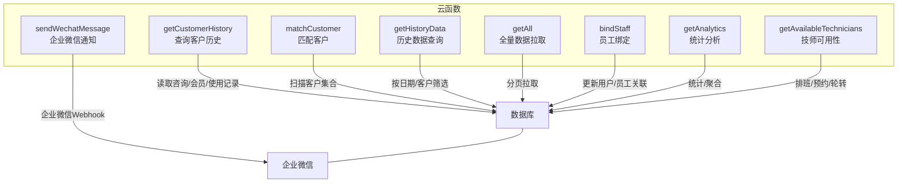
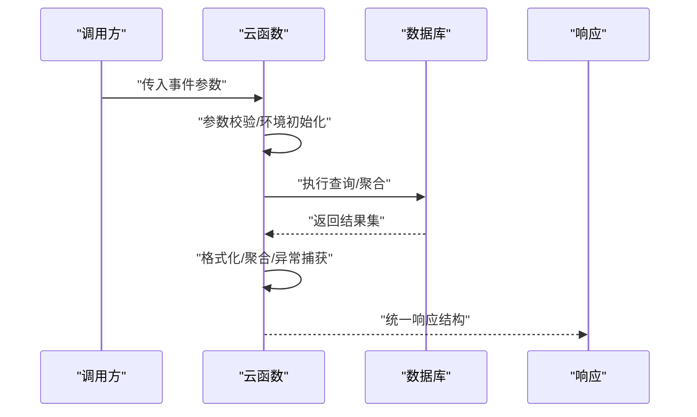
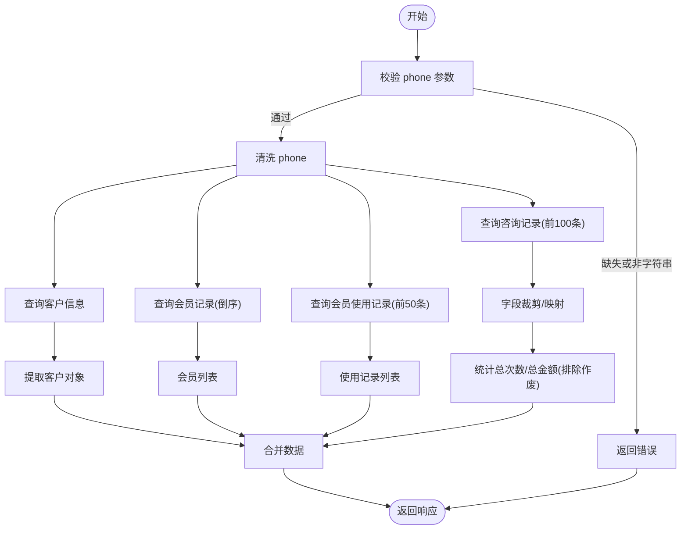
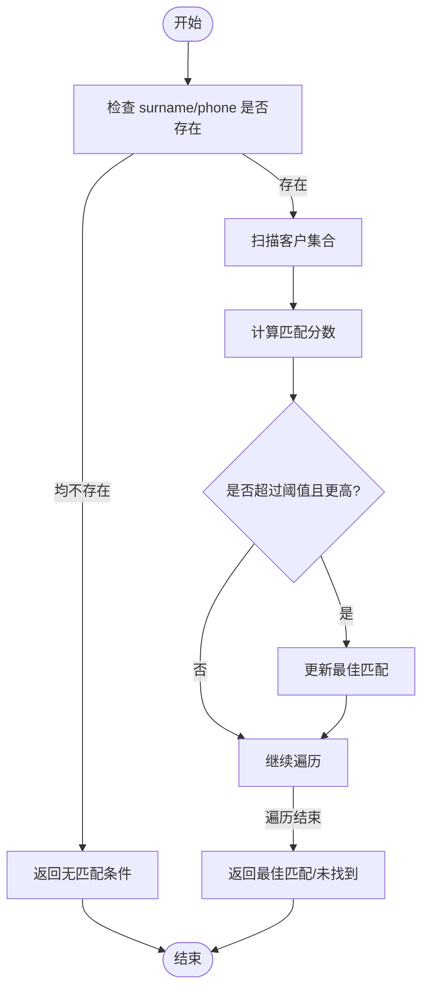
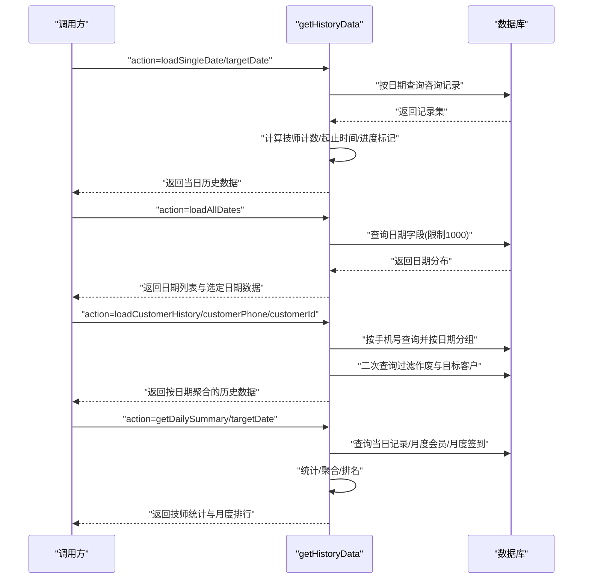
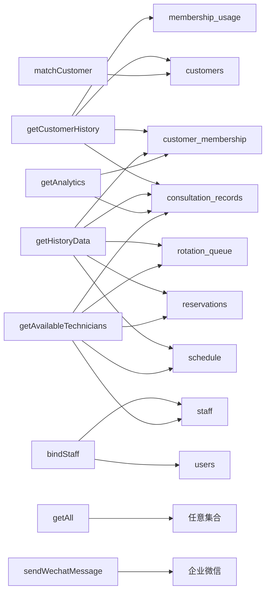

# 客户管理函数

<cite>
**本文引用的文件**
- [cloudfunctions/getCustomerHistory/index.js](file://cloudfunctions/getCustomerHistory/index.js)
- [cloudfunctions/matchCustomer/index.js](file://cloudfunctions/matchCustomer/index.js)
- [cloudfunctions/getHistoryData/index.js](file://cloudfunctions/getHistoryData/index.js)
- [cloudfunctions/getAll/index.js](file://cloudfunctions/getAll/index.js)
- [cloudfunctions/bindStaff/index.js](file://cloudfunctions/bindStaff/index.js)
- [cloudfunctions/getAnalytics/index.js](file://cloudfunctions/getAnalytics/index.js)
- [cloudfunctions/getAvailableTechnicians/index.js](file://cloudfunctions/getAvailableTechnicians/index.js)
- [cloudfunctions/sendWechatMessage/index.js](file://cloudfunctions/sendWechatMessage/index.js)
- [typings/cloud-function.d.ts](file://typings/cloud-function.d.ts)
- [typings/index.d.ts](file://typings/index.d.ts)
</cite>

## 更新摘要
**所做更改**
- 新增类型安全支持章节，介绍 GetAvailableTechniciansResult、MatchCustomerResult、GetAllResult<T> 等专用类型定义
- 更新 getCustomerHistory、matchCustomer、getHistoryData 等函数的类型安全性说明
- 增强数据模型与类型定义的对应关系
- 补充 TypeScript 类型定义对云函数返回值的约束

## 目录
1. [简介](#简介)
2. [项目结构](#项目结构)
3. [核心组件](#核心组件)
4. [架构总览](#架构总览)
5. [详细组件分析](#详细组件分析)
6. [类型安全支持](#类型安全支持)
7. [依赖分析](#依赖分析)
8. [性能考虑](#性能考虑)
9. [故障排查指南](#故障排查指南)
10. [结论](#结论)
11. [附录](#附录)

## 简介
本文件聚焦于客户管理相关的云函数，围绕以下目标展开：  
- 深入解释客户历史查询函数 getCustomerHistory 的数据检索逻辑、历史记录聚合与隐私保护机制  
- 详细说明客户匹配函数 matchCustomer 的模糊匹配算法、相似度计算与去重策略  
- 阐述历史数据查询函数 getHistoryData 的时间范围筛选、数据格式化与分页加载机制  
- 提供客户数据的 CRUD 能力、批量处理能力、数据完整性保证与性能优化策略  
- 包含完整的调用示例、数据模型说明与最佳实践指南  
- **新增** 强化类型安全支持，基于专用类型定义提升开发体验与代码质量

## 项目结构
本项目采用按功能划分的云函数目录结构，客户管理相关函数位于 cloudfunctions 目录下，分别承担"查询客户历史"、"匹配客户"、"查询历史数据"等职责，并辅以通用工具函数与辅助服务。



**图表来源**
- [cloudfunctions/getCustomerHistory/index.js](file://cloudfunctions/getCustomerHistory/index.js#L1-L100)
- [cloudfunctions/matchCustomer/index.js](file://cloudfunctions/matchCustomer/index.js#L1-L71)
- [cloudfunctions/getHistoryData/index.js](file://cloudfunctions/getHistoryData/index.js#L1-L411)
- [cloudfunctions/getAll/index.js](file://cloudfunctions/getAll/index.js#L1-L59)
- [cloudfunctions/bindStaff/index.js](file://cloudfunctions/bindStaff/index.js#L1-L189)
- [cloudfunctions/getAnalytics/index.js](file://cloudfunctions/getAnalytics/index.js#L1-L172)
- [cloudfunctions/getAvailableTechnicians/index.js](file://cloudfunctions/getAvailableTechnicians/index.js#L1-L285)
- [cloudfunctions/sendWechatMessage/index.js](file://cloudfunctions/sendWechatMessage/index.js#L1-L65)

**章节来源**
- [cloudfunctions/getCustomerHistory/index.js](file://cloudfunctions/getCustomerHistory/index.js#L1-L100)
- [cloudfunctions/matchCustomer/index.js](file://cloudfunctions/matchCustomer/index.js#L1-L71)
- [cloudfunctions/getHistoryData/index.js](file://cloudfunctions/getHistoryData/index.js#L1-L411)
- [cloudfunctions/getAll/index.js](file://cloudfunctions/getAll/index.js#L1-L59)
- [cloudfunctions/bindStaff/index.js](file://cloudfunctions/bindStaff/index.js#L1-L189)
- [cloudfunctions/getAnalytics/index.js](file://cloudfunctions/getAnalytics/index.js#L1-L172)
- [cloudfunctions/getAvailableTechnicians/index.js](file://cloudfunctions/getAvailableTechnicians/index.js#L1-L285)
- [cloudfunctions/sendWechatMessage/index.js](file://cloudfunctions/sendWechatMessage/index.js#L1-L65)

## 核心组件
- getCustomerHistory：按手机号检索客户历史，整合咨询记录、会员与使用记录，返回汇总统计与关键字段裁剪后的访客记录
- matchCustomer：在客户集合中进行模糊匹配，综合电话包含度、姓名包含度与性别后缀匹配，输出最高分客户
- getHistoryData：支持单日加载、全部日期汇总、客户历史聚合、当日进度标记与技师日计数等多场景查询
- getAll：突破小程序端查询上限，实现集合全量分页拉取
- bindStaff：基于 OPENID 绑定/解绑员工，校验状态与唯一性
- getAnalytics：按日期区间统计收入趋势、项目消费、平台消费、性别与车辆分布等
- getAvailableTechnicians：结合排班、预约、轮转与当前时间，计算技师可用性与空档
- sendWechatMessage：向企业微信群机器人发送 Markdown 消息

**章节来源**
- [cloudfunctions/getCustomerHistory/index.js](file://cloudfunctions/getCustomerHistory/index.js#L9-L99)
- [cloudfunctions/matchCustomer/index.js](file://cloudfunctions/matchCustomer/index.js#L9-L70)
- [cloudfunctions/getHistoryData/index.js](file://cloudfunctions/getHistoryData/index.js#L88-L410)
- [cloudfunctions/getAll/index.js](file://cloudfunctions/getAll/index.js#L9-L58)
- [cloudfunctions/bindStaff/index.js](file://cloudfunctions/bindStaff/index.js#L10-L51)
- [cloudfunctions/getAnalytics/index.js](file://cloudfunctions/getAnalytics/index.js#L36-L51)
- [cloudfunctions/getAvailableTechnicians/index.js](file://cloudfunctions/getAvailableTechnicians/index.js#L9-L124)
- [cloudfunctions/sendWechatMessage/index.js](file://cloudfunctions/sendWechatMessage/index.js#L10-L64)

## 架构总览
云函数通过微信云开发 SDK 连接数据库，遵循"单一职责"原则，每个函数聚焦特定业务场景。数据流以事件对象为入口，经参数校验、数据库查询与必要的聚合/格式化处理后返回统一结构的响应体。



**图表来源**
- [cloudfunctions/getCustomerHistory/index.js](file://cloudfunctions/getCustomerHistory/index.js#L9-L99)
- [cloudfunctions/matchCustomer/index.js](file://cloudfunctions/matchCustomer/index.js#L9-L70)
- [cloudfunctions/getHistoryData/index.js](file://cloudfunctions/getHistoryData/index.js#L88-L410)
- [cloudfunctions/getAll/index.js](file://cloudfunctions/getAll/index.js#L9-L58)

## 详细组件分析

### getCustomerHistory 数据检索、聚合与隐私保护
- 输入参数与校验
  - 必填：phone（字符串）
  - 清洗：去除前后空白字符
- 查询流程
  - 咨询记录：按手机号过滤，按创建时间倒序，限制前 100 条
  - 客户信息：按手机号精确查询，取第一条
  - 会员记录：按客户手机号倒序查询
  - 会员使用记录：按客户手机号倒序查询，限制前 50 条
- 数据聚合
  - 访客记录字段裁剪：仅保留关键字段，避免泄露敏感信息
  - 总次数与总金额：排除作废记录，累加有效金额
- 隐私保护
  - 返回体仅包含必要字段，未暴露完整客户明细
  - 金额与时间截断到日级别，避免过度暴露
  - 作废记录不计入统计，降低敏感数据暴露面



**图表来源**
- [cloudfunctions/getCustomerHistory/index.js](file://cloudfunctions/getCustomerHistory/index.js#L10-L99)

**章节来源**
- [cloudfunctions/getCustomerHistory/index.js](file://cloudfunctions/getCustomerHistory/index.js#L9-L99)

### matchCustomer 模糊匹配算法、相似度计算与去重策略
- 匹配条件
  - 至少提供 surname 或 phone 其一；否则直接返回"无匹配条件"
- 匹配评分规则
  - 电话包含度：若完全相等，+100；否则按匹配比例加权（最高 +80）
  - 姓名包含度：命中 +50
  - 性别后缀：根据性别与姓名末尾"先生/女士"匹配 +30
- 去重与阈值
  - 仅当最终得分 ≥ 30 且优于当前最佳分数时，更新最佳匹配
  - 未找到满足阈值的匹配时，返回"未找到匹配"
- 复杂度与优化
  - 时间复杂度 O(N)，N 为客户总数
  - 可通过索引 phone/name 字段进一步优化



**图表来源**
- [cloudfunctions/matchCustomer/index.js](file://cloudfunctions/matchCustomer/index.js#L9-L70)

**章节来源**
- [cloudfunctions/matchCustomer/index.js](file://cloudfunctions/matchCustomer/index.js#L9-L70)

### getHistoryData 时间范围筛选、数据格式化与分页加载
- 支持的操作
  - loadSingleDate：按目标日期加载当日记录
  - loadAllDates：统计所有日期并可选选定日期
  - loadCustomerHistory：按客户手机号聚合其历史记录
  - getDailySummary：按日期生成技师统计与月度排名
- 关键逻辑
  - 单日加载：按日期查询，排序并计算当日技师计数、进度标记与起止时间
  - 全日期汇总：统计所有日期出现次数，按降序排列
  - 客户历史：按创建日期分组，过滤作废记录，二次查询确保一致性
  - 日常统计：统计项目数量、签到次数、额外时间与加班时长，并生成月度销售与签到排行
- 数据格式化
  - 起止时间解析与推导：若缺失则基于创建时间与项目时长推算
  - 当日进度标记：结合当前时间与任务起止时间判断
  - 折叠标记：作废记录折叠显示
- 分页加载
  - getAll 函数通过游标分页（基于 _id 上界）突破默认限制，适用于全量导出与迁移



**图表来源**
- [cloudfunctions/getHistoryData/index.js](file://cloudfunctions/getHistoryData/index.js#L88-L410)
- [cloudfunctions/getAll/index.js](file://cloudfunctions/getAll/index.js#L9-L58)

**章节来源**
- [cloudfunctions/getHistoryData/index.js](file://cloudfunctions/getHistoryData/index.js#L88-L410)
- [cloudfunctions/getAll/index.js](file://cloudfunctions/getAll/index.js#L9-L58)

### CRUD 能力、批量处理与数据完整性
- CRUD 能力
  - 查询：上述三个函数覆盖读取场景（历史、匹配、全量）
  - 更新：bindStaff 通过用户表更新 staffId 实现绑定/解绑
  - 删除：未发现显式删除函数；可通过 isVoided 标记作废记录实现软删除
- 批量处理
  - getAll 通过游标分页拉取全量数据，适合批量导出与迁移
  - getHistoryData 在客户历史聚合中对同一天多次查询，确保一致性
- 数据完整性
  - 作废标记 isVoided：在统计与展示中被过滤，避免重复计算
  - 字段裁剪：getCustomerHistory 仅返回必要字段，减少冗余
  - 日期/时间推导：缺失时基于创建时间与项目时长推算，保证展示一致性

**章节来源**
- [cloudfunctions/getAll/index.js](file://cloudfunctions/getAll/index.js#L9-L58)
- [cloudfunctions/bindStaff/index.js](file://cloudfunctions/bindStaff/index.js#L98-L188)
- [cloudfunctions/getCustomerHistory/index.js](file://cloudfunctions/getCustomerHistory/index.js#L78-L92)
- [cloudfunctions/getHistoryData/index.js](file://cloudfunctions/getHistoryData/index.js#L150-L250)

### 调用示例与最佳实践
- getCustomerHistory
  - 请求参数：{ phone: "13800001111" }
  - 返回结构：{ code, message, data: { customer, visitRecords, customerMemberships, membershipUsageRecords, totalVisits, totalAmount } }
  - 最佳实践：确保 phone 去除空白；对返回的 visitRecords 做前端展示裁剪
- matchCustomer
  - 请求参数：{ surname: "张", gender: "male", phone: "138" }
  - 返回结构：{ code, message, data, score }
  - 最佳实践：优先提供 phone 与 surname；注意性别后缀匹配仅针对中文姓名
- getHistoryData
  - 请求参数：{ action: "loadSingleDate", targetDate: "2025-04-01" }
  - 返回结构：{ code, data: { selectedDate, historyData } }
  - 最佳实践：按日期格式 "YYYY-MM-DD" 传递；对返回的 records 做前端折叠与进度标记
- getAll
  - 请求参数：{ collection: "consultation_records" }
  - 返回结构：{ code, message, data, count }
  - 最佳实践：用于一次性导出或迁移；注意网络与超时设置
- bindStaff
  - 请求参数：{ action: "bind", phone: "13800001111" }
  - 返回结构：{ code, message, data }
  - 最佳实践：先 check 再 bind；确保手机号格式正确与员工状态为 active

**章节来源**
- [cloudfunctions/getCustomerHistory/index.js](file://cloudfunctions/getCustomerHistory/index.js#L9-L99)
- [cloudfunctions/matchCustomer/index.js](file://cloudfunctions/matchCustomer/index.js#L9-L70)
- [cloudfunctions/getHistoryData/index.js](file://cloudfunctions/getHistoryData/index.js#L88-L410)
- [cloudfunctions/getAll/index.js](file://cloudfunctions/getAll/index.js#L9-L58)
- [cloudfunctions/bindStaff/index.js](file://cloudfunctions/bindStaff/index.js#L10-L51)

## 类型安全支持

### 专用类型定义概述
项目引入了专门的类型定义来增强云函数的类型安全性，主要包括：

- **CloudFunctionResult<T>**：云函数通用返回值类型，提供统一的响应结构
- **GetAvailableTechniciansResult**：技师可用性查询专用返回类型
- **MatchCustomerResult**：客户匹配专用返回类型
- **GetAllResult<T>**：全量数据查询泛型返回类型
- **CustomerRecord**：客户记录数据结构类型

### 类型安全增强特性

#### 1. 统一响应结构
所有云函数现在都遵循统一的响应结构，通过 CloudFunctionResult<T> 接口确保：
- 固定的 code 字段（number 类型）
- 可选的 message 字段（string 类型）
- 泛型 data 字段，支持任意数据类型

#### 2. 专用返回类型
针对特定业务场景定义专用类型，提供更强的类型约束：

**GetAvailableTechniciansResult**
```typescript
type GetAvailableTechniciansResult = CloudFunctionResult<StaffAvailability[]>;
```
- 确保技师可用性查询返回数组类型的 StaffAvailability 对象
- 提供编译时类型检查，避免运行时类型错误

**MatchCustomerResult**
```typescript
type MatchCustomerResult = CloudFunctionResult<CustomerRecord>;
```
- 确保客户匹配返回 CustomerRecord 类型数据
- 自动包含匹配分数 score 字段
- 提供完整的客户信息类型约束

**GetAllResult<T>**
```typescript
type GetAllResult<T> = CloudFunctionResult<T[]>;
```
- 泛型支持任意数据类型的全量查询
- 确保返回数组格式的数据集合
- 保持类型安全的同时提供灵活性

#### 3. 数据模型类型约束
通过 typings 目录下的类型定义文件，为各种数据模型提供完整的类型约束：

**CustomerRecord 类型**
```typescript
interface CustomerRecord extends BaseRecord {
  phone: string;
  name: string;
  gender: 'male' | 'female' | '';
  responsibleTechnician: string;
  licensePlate: string;
  remarks: string;
}
```

**ConsultationRecord 类型**
```typescript
interface ConsultationRecord extends ConsultationInfo {
  isVoided: boolean;
  extraTime: number;
  overtime: number;
  startTime: string;
  endTime: string;
  settlement?: SettlementInfo;
  amount?: number;
  date: string;
}
```

**StaffAvailability 类型**
```typescript
interface StaffAvailability {
  _id: string;
  name: string;
  phone: string;
  isOccupied: boolean;
  occupiedReason?: string;
  isClockIn?: boolean;
  gender: 'male' | 'female';
}
```

### 类型安全带来的优势

#### 1. 编译时错误检测
- 开发阶段即可发现类型不匹配问题
- 避免运行时因数据类型错误导致的异常
- 提供更好的 IDE 支持和智能提示

#### 2. API 文档自动生成
- 类型定义自动成为 API 文档的一部分
- 保持文档与代码的一致性
- 减少文档维护成本

#### 3. 代码重构安全保障
- 类型约束防止意外的代码修改
- 支持安全的代码重构和迁移
- 降低回归测试的复杂度

#### 4. 开发体验提升
- 更好的 IntelliSense 支持
- 自动补全和类型验证
- 减少调试时间

**章节来源**
- [typings/cloud-function.d.ts](file://typings/cloud-function.d.ts#L1-L75)
- [typings/index.d.ts](file://typings/index.d.ts#L137-L184)

## 依赖分析
- 公共依赖
  - wx-server-sdk：云函数运行时与数据库访问
- 业务函数依赖
  - getCustomerHistory：consultation_records、customers、customer_membership、membership_usage
  - matchCustomer：customers
  - getHistoryData：consultation_records、customer_membership、schedule、reservations、rotation_queue
  - getAll：任意集合（通过 collection 参数）
  - bindStaff：users、staff
  - getAnalytics：consultation_records、customer_membership
  - getAvailableTechnicians：schedule、staff、consultation_records、reservations、rotation_queue
  - sendWechatMessage：企业微信 Webhook



**图表来源**
- [cloudfunctions/getCustomerHistory/index.js](file://cloudfunctions/getCustomerHistory/index.js#L22-L74)
- [cloudfunctions/matchCustomer/index.js](file://cloudfunctions/matchCustomer/index.js#L21-L22)
- [cloudfunctions/getHistoryData/index.js](file://cloudfunctions/getHistoryData/index.js#L34-L340)
- [cloudfunctions/getAll/index.js](file://cloudfunctions/getAll/index.js#L26-L32)
- [cloudfunctions/bindStaff/index.js](file://cloudfunctions/bindStaff/index.js#L16-L158)
- [cloudfunctions/getAnalytics/index.js](file://cloudfunctions/getAnalytics/index.js#L56-L71)
- [cloudfunctions/getAvailableTechnicians/index.js](file://cloudfunctions/getAvailableTechnicians/index.js#L26-L63)

**章节来源**
- [cloudfunctions/getCustomerHistory/index.js](file://cloudfunctions/getCustomerHistory/index.js#L22-L74)
- [cloudfunctions/matchCustomer/index.js](file://cloudfunctions/matchCustomer/index.js#L21-L22)
- [cloudfunctions/getHistoryData/index.js](file://cloudfunctions/getHistoryData/index.js#L34-L340)
- [cloudfunctions/getAll/index.js](file://cloudfunctions/getAll/index.js#L26-L32)
- [cloudfunctions/bindStaff/index.js](file://cloudfunctions/bindStaff/index.js#L16-L158)
- [cloudfunctions/getAnalytics/index.js](file://cloudfunctions/getAnalytics/index.js#L56-L71)
- [cloudfunctions/getAvailableTechnicians/index.js](file://cloudfunctions/getAvailableTechnicians/index.js#L26-L63)

## 性能考虑
- 查询优化
  - 为 phone、date、createdAt、isVoided 等常用过滤字段建立索引
  - 控制单次查询返回量：getCustomerHistory 对咨询与使用记录设置上限
  - 使用投影字段：getHistoryData 在部分查询中仅取必要字段
- 计算优化
  - matchCustomer 为 O(N) 扫描，建议在客户规模较大时增加 phone/name 索引
  - getHistoryData 在客户历史聚合中进行二次查询，确保一致性但增加查询次数，可在业务允许范围内接受
- 分页与导出
  - getAll 使用游标分页，避免一次性拉取过多数据导致超时
- 缓存与降级
  - 对高频查询结果可引入应用层缓存（如 Redis），设置合理 TTL
  - 在数据库压力过大时，可临时降级为只读或延迟刷新

## 故障排查指南
- 通用错误
  - 参数缺失：检查必填字段（如 phone、targetDate、customerPhone、customerId）
  - 类型错误：确保 phone 为字符串，日期为 "YYYY-MM-DD"
  - 数据库异常：查看返回的 message 与 error 字段，定位具体集合与查询条件
- 常见问题
  - getCustomerHistory 无结果：确认手机号是否正确、是否存在咨询记录
  - matchCustomer 得分过低：检查 surname/phone/性别后缀是否匹配
  - getHistoryData 日期为空：确认 date 字段是否正确写入或从 createdAt 截取
  - getAll 导出不完整：确认是否达到 1000 条限制，必要时分批导出
  - bindStaff 绑定失败：检查员工状态、是否已被其他用户绑定

**章节来源**
- [cloudfunctions/getCustomerHistory/index.js](file://cloudfunctions/getCustomerHistory/index.js#L13-L18)
- [cloudfunctions/matchCustomer/index.js](file://cloudfunctions/matchCustomer/index.js#L12-L18)
- [cloudfunctions/getHistoryData/index.js](file://cloudfunctions/getHistoryData/index.js#L92-L98)
- [cloudfunctions/getAll/index.js](file://cloudfunctions/getAll/index.js#L12-L17)
- [cloudfunctions/bindStaff/index.js](file://cloudfunctions/bindStaff/index.js#L99-L112)

## 结论
本文系统梳理了客户管理相关云函数的功能边界、数据流与实现要点，给出了匹配算法、历史聚合与分页加载的关键设计，并提供了性能优化与故障排查建议。**新增的类型安全支持**通过专用类型定义显著提升了代码质量和开发体验，包括统一的响应结构、专用的业务类型和完整的数据模型约束。建议在生产环境中配合索引、缓存与监控体系，持续保障查询性能与数据一致性。

## 附录
- 数据模型概要（基于查询使用的字段）
  - customers：phone、name、gender 等
  - consultation_records：phone、date、createdAt、startTime、endTime、project、technician、room、amount、isClockIn、isVoided、couponPlatform、couponCode、extraTime、overtime、settlement、licensePlate 等
  - customer_membership：customerPhone、cardName、salesStaff、paidAmount、createdAt 等
  - membership_usage：customerPhone、createdAt 等
  - staff/users/schedule/reservations/rotation_queue：bindStaff 与可用性查询涉及的字段
- 调用路径参考
  - getCustomerHistory：[cloudfunctions/getCustomerHistory/index.js](file://cloudfunctions/getCustomerHistory/index.js#L9-L99)
  - matchCustomer：[cloudfunctions/matchCustomer/index.js](file://cloudfunctions/matchCustomer/index.js#L9-L70)
  - getHistoryData：[cloudfunctions/getHistoryData/index.js](file://cloudfunctions/getHistoryData/index.js#L88-L410)
  - getAll：[cloudfunctions/getAll/index.js](file://cloudfunctions/getAll/index.js#L9-L58)
  - bindStaff：[cloudfunctions/bindStaff/index.js](file://cloudfunctions/bindStaff/index.js#L10-L51)
  - getAnalytics：[cloudfunctions/getAnalytics/index.js](file://cloudfunctions/getAnalytics/index.js#L36-L51)
  - getAvailableTechnicians：[cloudfunctions/getAvailableTechnicians/index.js](file://cloudfunctions/getAvailableTechnicians/index.js#L9-L124)
  - sendWechatMessage：[cloudfunctions/sendWechatMessage/index.js](file://cloudfunctions/sendWechatMessage/index.js#L10-L64)
- 类型定义参考
  - 专用类型定义：[typings/cloud-function.d.ts](file://typings/cloud-function.d.ts#L1-L75)
  - 数据模型定义：[typings/index.d.ts](file://typings/index.d.ts#L137-L184)