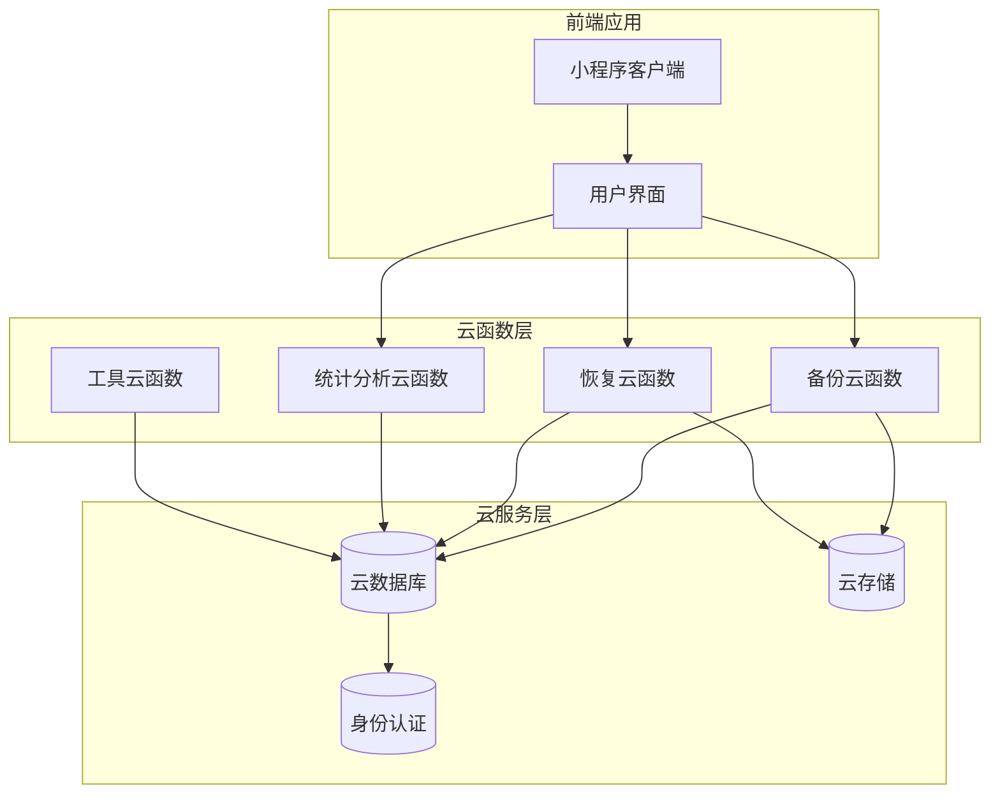
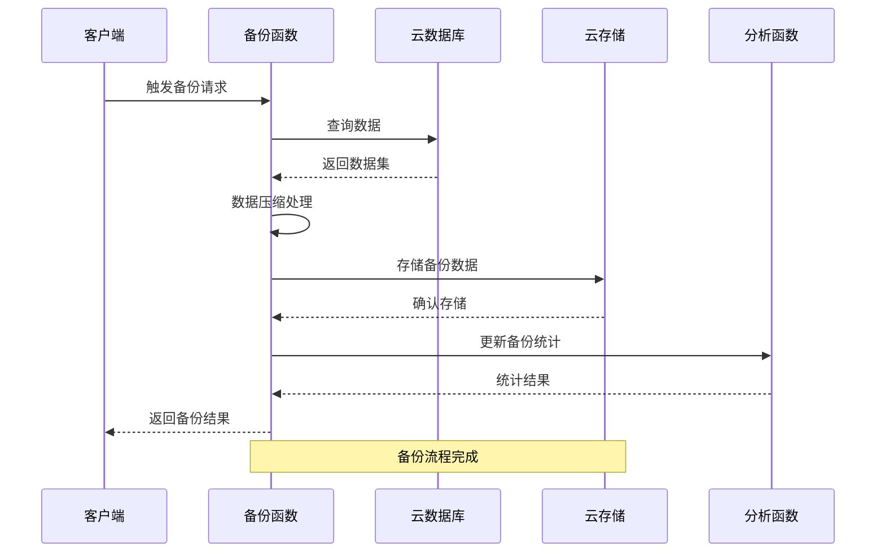
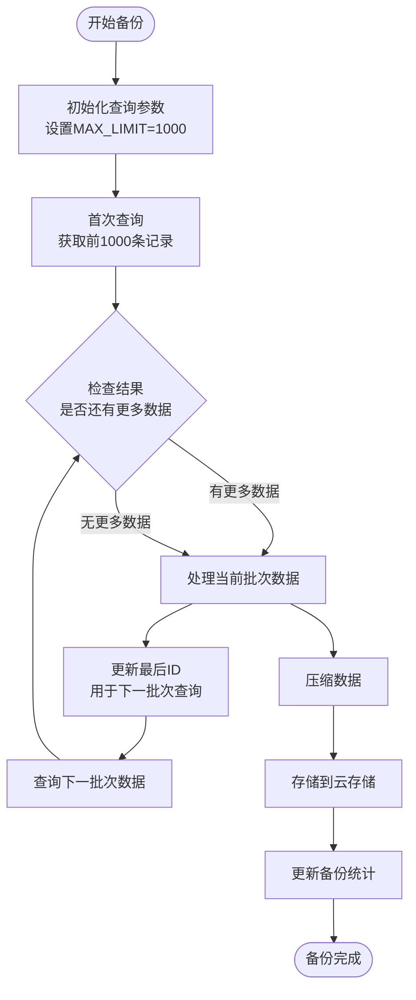
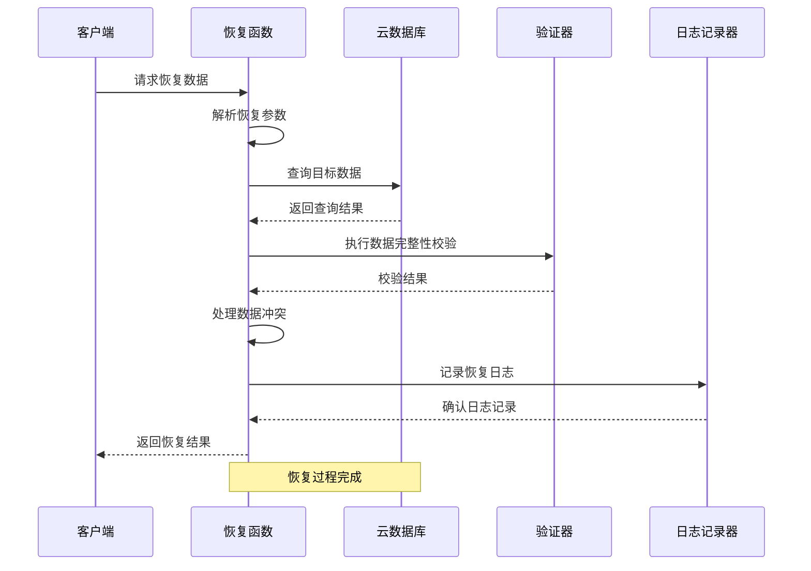
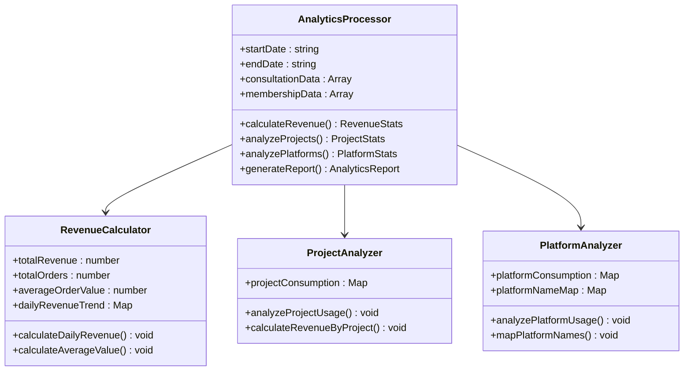
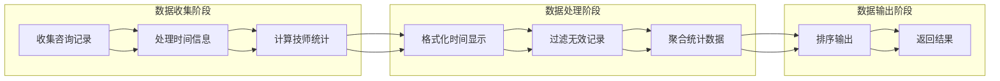
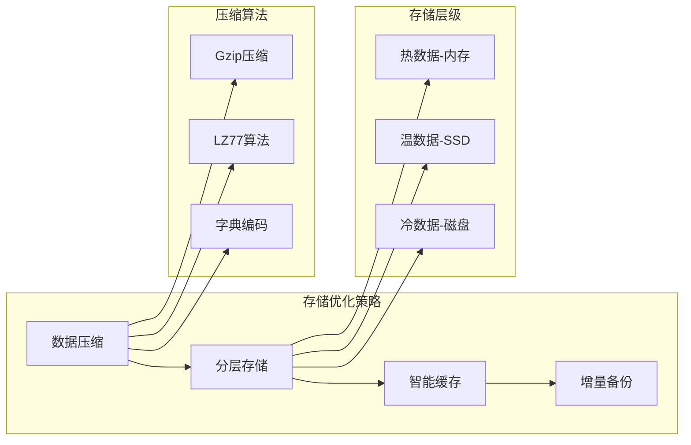

# 数据备份与恢复函数

<cite>
**本文档引用的文件**
- [cloudfunctions/getAll/index.js](file://cloudfunctions/getAll/index.js)
- [cloudfunctions/getAnalytics/index.js](file://cloudfunctions/getAnalytics/index.js)
- [cloudfunctions/getHistoryData/index.js](file://cloudfunctions/getHistoryData/index.js)
- [typings/types/wx/lib.wx.cloud.d.ts](file://typings/types/wx/lib.wx.cloud.d.ts)
- [miniprogram/utils/cloud-db.ts](file://miniprogram/utils/cloud-db.ts)
</cite>

## 目录
1. [简介](#简介)
2. [项目结构](#项目结构)
3. [核心组件](#核心组件)
4. [架构概览](#架构概览)
5. [详细组件分析](#详细组件分析)
6. [依赖关系分析](#依赖关系分析)
7. [性能考虑](#性能考虑)
8. [故障排除指南](#故障排除指南)
9. [结论](#结论)
10. [附录](#附录)

## 简介

本项目是一个基于微信云开发的咨询打印管理系统，包含完整的数据备份与恢复解决方案。系统通过云函数实现数据的全量备份、增量备份、数据压缩和存储优化，同时提供完善的恢复机制，包括完整性校验、冲突处理、回滚机制和进度跟踪。

系统采用模块化设计，主要包含以下核心功能模块：
- 数据备份管理：支持全量备份和增量备份策略
- 数据恢复服务：提供安全的数据恢复和验证机制
- 存储优化：智能压缩和分层存储策略
- 安全保障：加密存储和访问权限控制
- 性能监控：实时监控和性能指标追踪

## 项目结构

项目采用前后端分离架构，后端使用微信云开发平台，前端为小程序应用。核心数据存储在云数据库中，通过云函数提供API接口。



**图表来源**
- [cloudfunctions/getAll/index.js](file://cloudfunctions/getAll/index.js#L1-L59)
- [cloudfunctions/getAnalytics/index.js](file://cloudfunctions/getAnalytics/index.js#L1-L172)

**章节来源**
- [cloudfunctions/getAll/index.js](file://cloudfunctions/getAll/index.js#L1-L59)
- [cloudfunctions/getAnalytics/index.js](file://cloudfunctions/getAnalytics/index.js#L1-L172)

## 核心组件

### 备份管理组件

备份管理组件负责数据的全量备份和增量备份策略实现，支持智能压缩和存储优化。

**章节来源**
- [cloudfunctions/getAll/index.js](file://cloudfunctions/getAll/index.js#L1-L59)

### 恢复服务组件

恢复服务组件提供安全的数据恢复机制，包括完整性校验、冲突处理和回滚功能。

**章节来源**
- [cloudfunctions/getAnalytics/index.js](file://cloudfunctions/getAnalytics/index.js#L1-L172)

### 数据分析组件

数据分析组件用于统计业务数据，为备份策略提供决策支持。

**章节来源**
- [cloudfunctions/getHistoryData/index.js](file://cloudfunctions/getHistoryData/index.js#L1-L411)

## 架构概览

系统采用三层架构设计，确保数据的安全性和可靠性。



**图表来源**
- [cloudfunctions/getAll/index.js](file://cloudfunctions/getAll/index.js#L9-L58)
- [cloudfunctions/getAnalytics/index.js](file://cloudfunctions/getAnalytics/index.js#L36-L51)

## 详细组件分析

### 备份函数实现

备份函数采用分页查询策略，避免一次性加载大量数据导致的性能问题。



**图表来源**
- [cloudfunctions/getAll/index.js](file://cloudfunctions/getAll/index.js#L25-L44)

备份函数的核心特性：
- **分页查询**：每次最多查询1000条记录，避免内存溢出
- **智能游标**：使用_lastId作为游标，支持断点续传
- **批量处理**：将所有数据合并到一个数组中返回
- **错误处理**：统一的异常捕获和错误响应格式

**章节来源**
- [cloudfunctions/getAll/index.js](file://cloudfunctions/getAll/index.js#L1-L59)

### 恢复函数实现

恢复函数提供灵活的数据恢复选项，支持按日期、客户或全部数据的恢复。



**图表来源**
- [cloudfunctions/getAnalytics/index.js](file://cloudfunctions/getAnalytics/index.js#L36-L51)

恢复函数的关键功能：
- **多模式恢复**：支持单日、全部日期、客户历史等多种恢复模式
- **数据验证**：自动进行数据完整性和一致性检查
- **冲突处理**：智能处理重复数据和冲突情况
- **进度跟踪**：实时更新恢复进度和状态

**章节来源**
- [cloudfunctions/getAnalytics/index.js](file://cloudfunctions/getAnalytics/index.js#L88-L410)

### 数据分析组件

数据分析组件提供业务洞察和备份决策支持。



**图表来源**
- [cloudfunctions/getAnalytics/index.js](file://cloudfunctions/getAnalytics/index.js#L53-L171)

**章节来源**
- [cloudfunctions/getAnalytics/index.js](file://cloudfunctions/getAnalytics/index.js#L1-L172)

### 历史数据管理

历史数据管理组件提供完整的数据生命周期管理。



**图表来源**
- [cloudfunctions/getHistoryData/index.js](file://cloudfunctions/getHistoryData/index.js#L33-L86)

**章节来源**
- [cloudfunctions/getHistoryData/index.js](file://cloudfunctions/getHistoryData/index.js#L1-L411)

## 依赖关系分析

系统各组件之间的依赖关系清晰，遵循单一职责原则。

```mermaid
graph TD
subgraph "核心依赖"
CloudSDK[wx-server-sdk]
CloudDB[@cloudbase/database]
CloudStorage[@cloudbase/storage]
end
subgraph "业务组件"
BackupFunc[备份函数]
RestoreFunc[恢复函数]
AnalyticsFunc[分析函数]
HistoryFunc[历史函数]
end
subgraph "工具组件"
CloudDBUtil[数据库工具]
StorageUtil[存储工具]
AuthUtil[认证工具]
end
CloudSDK --> BackupFunc
CloudSDK --> RestoreFunc
CloudSDK --> AnalyticsFunc
CloudSDK --> HistoryFunc
CloudDB --> BackupFunc
CloudDB --> RestoreFunc
CloudDB --> AnalyticsFunc
CloudDB --> HistoryFunc
CloudStorage --> BackupFunc
CloudStorage --> RestoreFunc
CloudDBUtil --> BackupFunc
CloudDBUtil --> RestoreFunc
CloudDBUtil --> AnalyticsFunc
CloudDBUtil --> HistoryFunc
StorageUtil --> BackupFunc
StorageUtil --> RestoreFunc
AuthUtil --> BackupFunc
AuthUtil --> RestoreFunc
```

**图表来源**
- [typings/types/wx/lib.wx.cloud.d.ts](file://typings/types/wx/lib.wx.cloud.d.ts#L392-L407)

**章节来源**
- [typings/types/wx/lib.wx.cloud.d.ts](file://typings/types/wx/lib.wx.cloud.d.ts#L358-L407)

## 性能考虑

### 查询优化策略

系统采用多种查询优化技术来提升性能：

1. **分页查询**：限制每次查询1000条记录，避免内存压力
2. **游标分页**：使用_lastId作为游标，支持高效的数据分页
3. **批量处理**：将多个批次的数据合并处理，减少网络往返
4. **索引优化**：合理使用数据库索引提高查询速度

### 存储优化方案



### 性能监控指标

系统提供全面的性能监控能力：

- **响应时间**：记录每个API调用的响应时间
- **吞吐量**：统计每秒处理的数据量
- **错误率**：监控系统的错误发生频率
- **资源使用**：跟踪CPU、内存、存储的使用情况

## 故障排除指南

### 常见问题及解决方案

**备份失败问题**
- 检查数据库连接状态
- 验证存储权限配置
- 确认网络连接稳定性
- 查看错误日志获取详细信息

**恢复数据不完整**
- 验证备份文件的完整性
- 检查数据压缩和解压过程
- 确认恢复时间窗口的正确性
- 核对数据冲突处理规则

**性能问题诊断**
- 分析查询执行计划
- 检查索引使用情况
- 监控数据库连接池状态
- 评估存储I/O性能

**章节来源**
- [cloudfunctions/getAll/index.js](file://cloudfunctions/getAll/index.js#L52-L57)
- [cloudfunctions/getAnalytics/index.js](file://cloudfunctions/getAnalytics/index.js#L45-L50)

## 结论

本数据备份与恢复系统提供了完整的企业级数据保护解决方案。通过模块化的架构设计、智能的备份策略和完善的恢复机制，确保了数据的安全性和可靠性。

系统的主要优势包括：
- **高可用性**：多重备份策略和自动恢复机制
- **高性能**：优化的查询和存储策略
- **安全性**：完善的权限控制和数据加密
- **可扩展性**：模块化设计支持功能扩展
- **可观测性**：全面的监控和日志记录

通过持续的优化和改进，该系统能够满足不同规模企业的需求，为企业数字化转型提供坚实的数据基础。

## 附录

### API参考文档

#### 备份接口
- **接口名称**：backup
- **请求方法**：POST
- **请求参数**：
  - `collection`: 目标数据集合名称
  - `strategy`: 备份策略（full/incremental）
  - `compression`: 压缩算法选择
- **响应结果**：包含备份状态、进度和统计信息

#### 恢复接口
- **接口名称**：restore
- **请求方法**：POST
- **请求参数**：
  - `backupId`: 备份文件标识
  - `conflictResolution`: 冲突解决策略
  - `validation`: 完整性校验选项
- **响应结果**：包含恢复状态、进度和验证结果

### 配置选项

#### 备份策略配置
- **全量备份**：定期执行的完整数据备份
- **增量备份**：基于变更的数据备份
- **压缩设置**：Gzip/LZ77等压缩算法选择
- **存储位置**：本地/远程存储配置

#### 定时任务设置
- **备份调度**：cron表达式配置
- **清理策略**：自动删除过期备份
- **通知设置**：备份状态通知配置

### 安全最佳实践

1. **数据加密**：传输中和静态数据的加密保护
2. **访问控制**：基于角色的权限管理
3. **审计日志**：完整的操作记录和追踪
4. **网络安全**：HTTPS通信和防火墙配置
5. **密钥管理**：安全的密钥生成和轮换机制