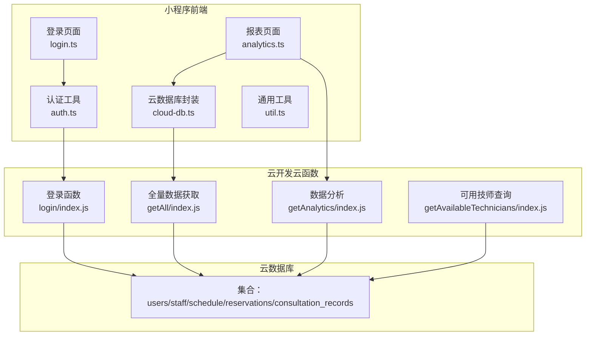
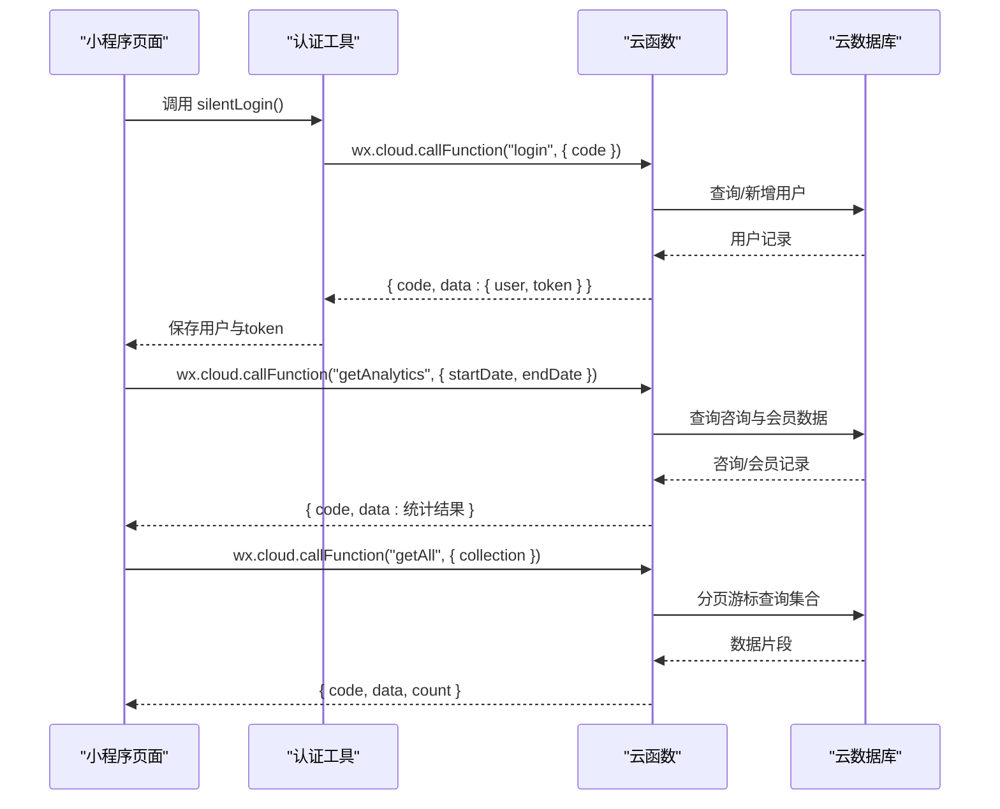
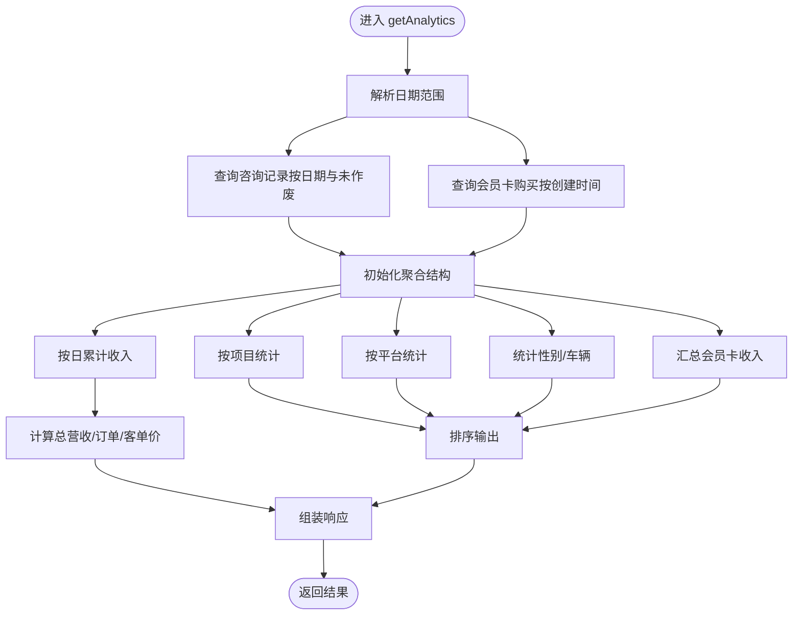
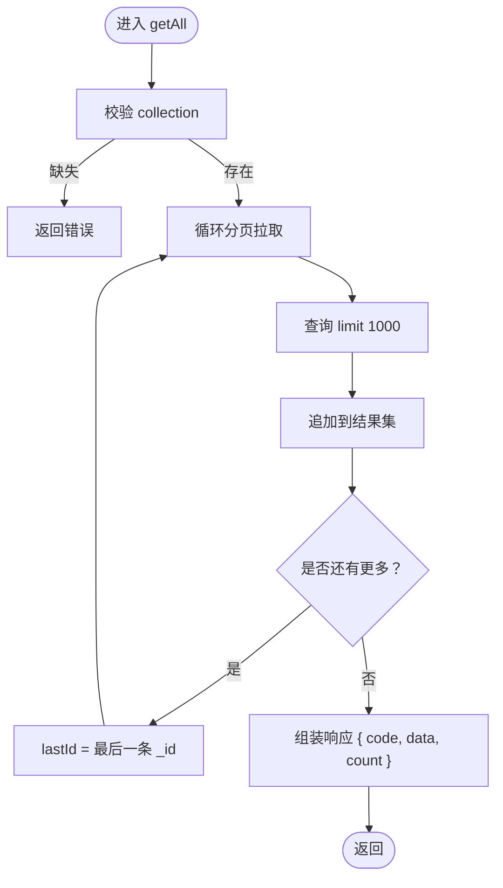
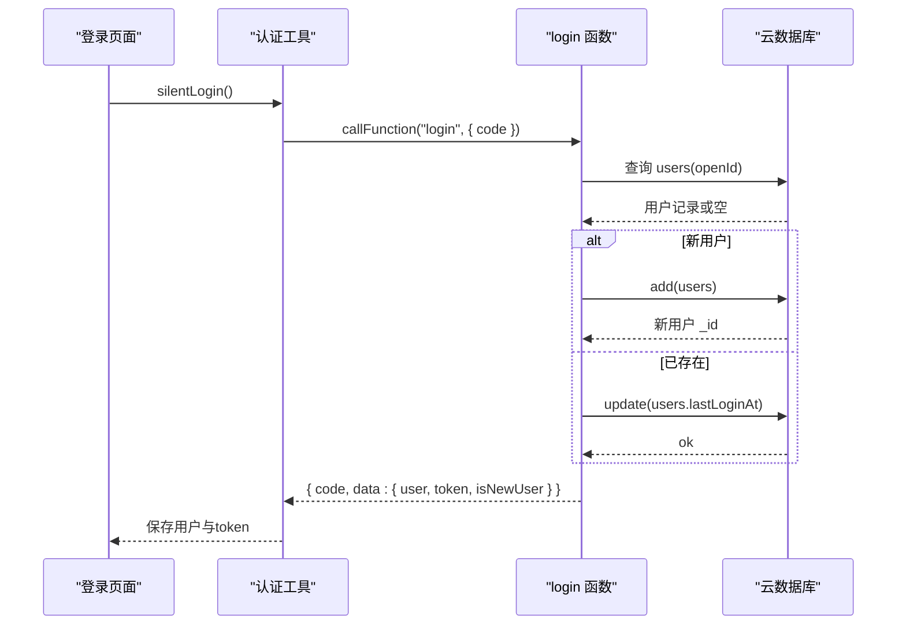
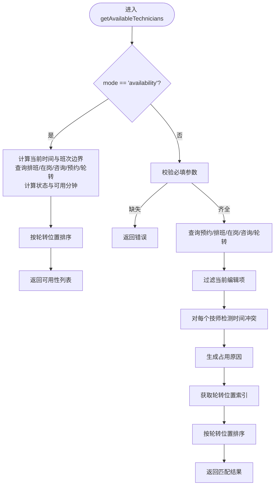
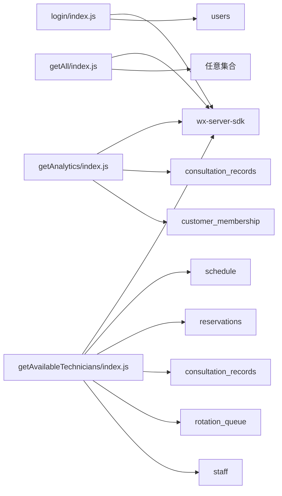

# 核心业务函数

<cite>
**本文引用的文件**
- [cloudfunctions/getAnalytics/index.js](file://cloudfunctions/getAnalytics/index.js)
- [cloudfunctions/getAll/index.js](file://cloudfunctions/getAll/index.js)
- [cloudfunctions/login/index.js](file://cloudfunctions/login/index.js)
- [cloudfunctions/getAvailableTechnicians/index.js](file://cloudfunctions/getAvailableTechnicians/index.js)
- [cloudfunctions/getAnalytics/package.json](file://cloudfunctions/getAnalytics/package.json)
- [cloudfunctions/getAll/package.json](file://cloudfunctions/getAll/package.json)
- [cloudfunctions/login/package.json](file://cloudfunctions/login/package.json)
- [cloudfunctions/getAvailableTechnicians/package.json](file://cloudfunctions/getAvailableTechnicians/package.json)
- [miniprogram/utils/cloud-db.ts](file://miniprogram/utils/cloud-db.ts)
- [miniprogram/utils/auth.ts](file://miniprogram/utils/auth.ts)
- [miniprogram/utils/util.ts](file://miniprogram/utils/util.ts)
- [miniprogram/pages/analytics/analytics.ts](file://miniprogram/pages/analytics/analytics.ts)
- [miniprogram/pages/login/login.ts](file://miniprogram/pages/login/login.ts)
</cite>

## 目录
1. [简介](#简介)
2. [项目结构](#项目结构)
3. [核心组件](#核心组件)
4. [架构总览](#架构总览)
5. [详细组件分析](#详细组件分析)
6. [依赖关系分析](#依赖关系分析)
7. [性能考虑](#性能考虑)
8. [故障排除指南](#故障排除指南)
9. [结论](#结论)
10. [附录](#附录)

## 简介
本文件面向咨询打印系统的核心业务函数，提供针对以下四个云函数的完整API文档与实现解析：
- 数据分析函数：getAnalytics
- 数据获取函数：getAll
- 用户登录函数：login
- 可用技师查询函数：getAvailableTechnicians

内容涵盖接口规范、参数校验、错误处理、统计与聚合算法、时间冲突检测与排班匹配、查询优化与分页策略、身份验证与会话管理等，并提供调用示例、响应格式说明与常见问题解决方案。

## 项目结构
该系统采用“小程序前端 + 云开发云函数”的架构。前端通过 wx.cloud.callFunction 调用后端云函数，云函数通过 wx-server-sdk 访问云数据库，完成数据查询、聚合与返回。

图表来源
- [miniprogram/pages/login/login.ts](file://miniprogram/pages/login/login.ts#L1-L166)
- [miniprogram/pages/analytics/analytics.ts](file://miniprogram/pages/analytics/analytics.ts#L1-L408)
- [miniprogram/utils/auth.ts](file://miniprogram/utils/auth.ts#L1-L245)
- [miniprogram/utils/cloud-db.ts](file://miniprogram/utils/cloud-db.ts#L1-L321)
- [miniprogram/utils/util.ts](file://miniprogram/utils/util.ts#L1-L150)
- [cloudfunctions/login/index.js](file://cloudfunctions/login/index.js#L1-L180)
- [cloudfunctions/getAll/index.js](file://cloudfunctions/getAll/index.js#L1-L59)
- [cloudfunctions/getAnalytics/index.js](file://cloudfunctions/getAnalytics/index.js#L1-L172)
- [cloudfunctions/getAvailableTechnicians/index.js](file://cloudfunctions/getAvailableTechnicians/index.js#L1-L285)

章节来源
- [miniprogram/pages/login/login.ts](file://miniprogram/pages/login/login.ts#L1-L166)
- [miniprogram/pages/analytics/analytics.ts](file://miniprogram/pages/analytics/analytics.ts#L1-L408)
- [miniprogram/utils/auth.ts](file://miniprogram/utils/auth.ts#L1-L245)
- [miniprogram/utils/cloud-db.ts](file://miniprogram/utils/cloud-db.ts#L1-L321)
- [miniprogram/utils/util.ts](file://miniprogram/utils/util.ts#L1-L150)
- [cloudfunctions/login/index.js](file://cloudfunctions/login/index.js#L1-L180)
- [cloudfunctions/getAll/index.js](file://cloudfunctions/getAll/index.js#L1-L59)
- [cloudfunctions/getAnalytics/index.js](file://cloudfunctions/getAnalytics/index.js#L1-L172)
- [cloudfunctions/getAvailableTechnicians/index.js](file://cloudfunctions/getAvailableTechnicians/index.js#L1-L285)

## 核心组件
- getAnalytics：按日期范围统计营业额、订单数、客单价、日趋势、项目消费排行、平台消费排行、性别与车辆分布、会员卡收入等。
- getAll：突破小程序端查询限制，以分页游标方式拉取集合全部数据。
- login：基于微信 code 获取 openid，创建或更新用户记录，生成 token 并支持刷新与更新 staffId。
- getAvailableTechnicians：根据当前时间、项目时长与现有预约/咨询，检测技师时间冲突并返回可用性状态与排序。

章节来源
- [cloudfunctions/getAnalytics/index.js](file://cloudfunctions/getAnalytics/index.js#L36-L51)
- [cloudfunctions/getAll/index.js](file://cloudfunctions/getAll/index.js#L9-L58)
- [cloudfunctions/login/index.js](file://cloudfunctions/login/index.js#L11-L90)
- [cloudfunctions/getAvailableTechnicians/index.js](file://cloudfunctions/getAvailableTechnicians/index.js#L9-L124)

## 架构总览
云函数与前端交互遵循统一的返回结构：{ code, message?, data? }。错误通过 code 字段与 message 描述，成功时返回 data 对象。

图表来源
- [miniprogram/utils/auth.ts](file://miniprogram/utils/auth.ts#L78-L126)
- [cloudfunctions/login/index.js](file://cloudfunctions/login/index.js#L11-L90)
- [cloudfunctions/getAnalytics/index.js](file://cloudfunctions/getAnalytics/index.js#L36-L51)
- [cloudfunctions/getAll/index.js](file://cloudfunctions/getAll/index.js#L9-L58)

## 详细组件分析

### getAnalytics 数据分析函数
- 功能概述
  - 输入：startDate（YYYY-MM-DD）、endDate（YYYY-MM-DD）
  - 输出：总营业额、总订单数、平均客单价、日营业额趋势、项目消费排行、平台消费排行、性别分布、车辆分布、会员卡收入
- 统计逻辑与聚合算法
  - 日趋势：遍历日期区间，初始化每日收入为0，再对每条咨询结算支付求和累加到对应日期。
  - 项目消费：按项目名聚合，统计消费次数与金额。
  - 平台消费：按平台聚合，映射平台英文到中文名称，统计次数与金额。
  - 性别与车辆：按字段计数。
  - 会员卡收入：统计会员卡购买金额总和。
  - 客单价：总营业额除以总订单数，四舍五入。
- 时间处理
  - 提供 parseDate、formatDate、getDaysBetween 辅助函数，确保日期字符串与 Date 对象互转正确。
- 错误处理
  - try/catch 包裹主流程，异常时返回 { code: -1, error: message }。
- 性能与复杂度
  - 查询两次集合，时间复杂度 O(N+M)，N/M 为两条集合的数据量。
  - 聚合阶段线性扫描，整体 O(N+M)。
- 接口规范
  - 请求体：{ startDate: string, endDate: string }
  - 成功响应：{ code: 0, data: 统计对象 }
  - 失败响应：{ code: -1, error: string }
- 参数校验
  - 必填：startDate、endDate；类型：字符串 YYYY-MM-DD。
- 响应字段说明
  - totalRevenue: number
  - totalOrders: number
  - averageOrderValue: number
  - dailyRevenueTrend: { date: string, revenue: number }[]
  - projectConsumption: { project: string, amount: number, count: number }[]
  - platformConsumption: { platform: string, amount: number, count: number }[]
  - genderDistribution: { male: number, female: number }
  - vehicleDistribution: { withVehicle: number, withoutVehicle: number }
  - membershipCardAmount: number
- 调用示例
  - 小程序侧调用：见 analytics.ts 中对 getAnalytics 的调用。
- 常见问题
  - 日期范围无效：确保 startDate ≤ endDate。
  - 数据为空：确认集合中存在对应日期范围内的记录。
  - 平台名称显示异常：平台映射表可扩展。

图表来源
- [cloudfunctions/getAnalytics/index.js](file://cloudfunctions/getAnalytics/index.js#L53-L171)

章节来源
- [cloudfunctions/getAnalytics/index.js](file://cloudfunctions/getAnalytics/index.js#L10-L34)
- [cloudfunctions/getAnalytics/index.js](file://cloudfunctions/getAnalytics/index.js#L36-L51)
- [cloudfunctions/getAnalytics/index.js](file://cloudfunctions/getAnalytics/index.js#L53-L171)
- [miniprogram/pages/analytics/analytics.ts](file://miniprogram/pages/analytics/analytics.ts#L47-L78)

### getAll 数据获取函数
- 功能概述
  - 输入：collection（集合名）
  - 输出：集合全部数据（突破小程序端 limit 限制），并返回总数。
- 查询优化策略
  - 使用游标分页：每次 limit 1000，按 _id 升序，下次查询 where _id > lastId。
  - 循环直到单次返回不足 1000 条，表示已取完。
- 错误处理
  - 缺少集合名：直接返回错误。
  - 其他异常：捕获并返回错误信息。
- 接口规范
  - 请求体：{ collection: string }
  - 成功响应：{ code: 0, message: "获取成功", data: any[], count: number }
  - 失败响应：{ code: -1, message: string }
- 参数校验
  - 必填：collection；类型：字符串。
- 响应字段说明
  - data: 所有记录数组
  - count: 总数量
- 调用示例
  - 小程序侧调用：cloud-db.ts 中 getAll 封装了对 getAll 的调用。
- 性能建议
  - 避免在大集合上频繁全量拉取；如需筛选，优先在云函数内进行 where 查询，减少传输。
  - 如需分页，建议使用小程序端 findWithPage（云数据库封装）。

图表来源
- [cloudfunctions/getAll/index.js](file://cloudfunctions/getAll/index.js#L9-L58)
- [miniprogram/utils/cloud-db.ts](file://miniprogram/utils/cloud-db.ts#L69-L88)

章节来源
- [cloudfunctions/getAll/index.js](file://cloudfunctions/getAll/index.js#L1-L59)
- [miniprogram/utils/cloud-db.ts](file://miniprogram/utils/cloud-db.ts#L69-L88)

### login 登录函数
- 功能概述
  - 支持三种动作：普通登录、刷新用户信息、更新 staffId。
  - 基于微信 code 获取 openid，创建或更新用户记录，生成 token。
- 身份验证流程
  - 普通登录：校验 code，获取 wxContext.OPENID，查询 users 集合，若不存在则新增默认技师角色用户，更新最近登录时间，生成 token 返回。
  - 刷新用户信息：根据 openid 查询用户并重新生成 token。
  - 更新 staffId：更新用户记录中的 staffId 并重新生成 token。
- 权限检查
  - 页面层对技师角色且未绑定 staffId 的用户进行引导绑定。
- 会话管理
  - 生成 token：基于 openid、时间戳与随机串 base64 编码。
  - 前端存储：auth.ts 使用本地存储保存用户与 token，并在页面间复用。
- 接口规范
  - 请求体：{ code: string, action: "login"|"refresh"|"updateStaffId", staffId?: string }
  - 成功响应：{ code: 0, message: string, data: { user, token, isNewUser? } }
  - 失败响应：{ code: -1, message: string }
- 参数校验
  - 普通登录必填：code；刷新/更新必填：openid（由云函数自动获取）。
- 响应字段说明
  - user: 用户对象（含 openId、role、status、staffId、createdAt、updatedAt、lastLoginAt）
  - token: 会话标识
  - isNewUser: 是否新用户
- 调用示例
  - 小程序侧调用：auth.ts 中 silentLogin、refreshUserInfo、updateStaffId 分别调用不同 action。
- 常见问题
  - code 过期：前端需重新 wx.login 后再调用。
  - 用户不存在：刷新场景下可能因 openid 未匹配导致。
  - token 生成：当前实现为 base64 编码，不包含签名，生产环境建议使用 JWT 并签名校验。

图表来源
- [cloudfunctions/login/index.js](file://cloudfunctions/login/index.js#L11-L90)
- [miniprogram/utils/auth.ts](file://miniprogram/utils/auth.ts#L78-L126)
- [miniprogram/pages/login/login.ts](file://miniprogram/pages/login/login.ts#L15-L49)

章节来源
- [cloudfunctions/login/index.js](file://cloudfunctions/login/index.js#L1-L180)
- [miniprogram/utils/auth.ts](file://miniprogram/utils/auth.ts#L1-L245)
- [miniprogram/pages/login/login.ts](file://miniprogram/pages/login/login.ts#L1-L166)

### getAvailableTechnicians 可用技师查询函数
- 功能概述
  - 输入：date、currentTime（HH:mm）、projectDuration（分钟）、currentReservationIds、currentConsultationId、mode
  - 输出：技师列表，包含占用状态、占用原因、位置排序等。
  - mode="availability" 时返回当前时间点的可用性状态。
- 时间冲突检测与排班匹配算法
  - 将输入时间转换为分钟数，计算“提议结束时间”（当前时间 + 项目时长 + 10 分钟准备时间）。
  - 查询当天 active 预约与未作废咨询，过滤掉当前编辑中的预约/咨询。
  - 对每个排班在岗且有效的技师，检查其姓名与冲突时间段是否存在重叠。
  - 冲突检测使用标准区间重叠判断：startA < endB 且 endA > startB。
  - 若冲突，构造占用原因（时间段、客户称谓、是否预约）。
  - 从轮转队列获取技师位置索引，用于稳定排序。
- 可用性检查（mode="availability"）
  - 计算当前 UTC+8 时间对应的分钟数。
  - 获取当日排班在岗人员，计算其最早可开始的空闲时间段与剩余可用分钟数。
  - 根据当前时间与班次起止时间，判定“待班/忙碌/可用/已下班”状态。
- 错误处理
  - 参数缺失：直接返回错误。
  - 异常：捕获并返回错误信息。
- 接口规范
  - 请求体：{ date: string, currentTime: string, projectDuration: number, currentReservationIds?: string[], currentConsultationId?: string, mode?: "availability"|"match" }
  - 成功响应：{ code: 0, message: string, data: Technician[] }
  - 失败响应：{ code: -1, message: string }
- 参数校验
  - 必填：date、currentTime、projectDuration；类型：字符串日期、时间 HH:mm、数字分钟。
- 响应字段说明
  - _id: 技师ID
  - name/gender/phone: 基本信息
  - isOccupied: 是否冲突
  - occupiedReason: 占用原因描述
  - position: 轮转队列位置索引
  - status/availableMinutes/latestAppointment: 可用性模式下的状态与指标
- 调用示例
  - 小程序侧调用：在页面中传入当前时间、项目时长与过滤条件。
- 性能建议
  - 当日预约/咨询数据量较大时，建议在数据库建立相关索引（date、status、startTime、endTime）。
  - 重复计算可缓存当日排班与轮转数据，避免多次查询。

图表来源
- [cloudfunctions/getAvailableTechnicians/index.js](file://cloudfunctions/getAvailableTechnicians/index.js#L9-L124)
- [cloudfunctions/getAvailableTechnicians/index.js](file://cloudfunctions/getAvailableTechnicians/index.js#L131-L285)

章节来源
- [cloudfunctions/getAvailableTechnicians/index.js](file://cloudfunctions/getAvailableTechnicians/index.js#L1-L285)
- [miniprogram/utils/util.ts](file://miniprogram/utils/util.ts#L1-L150)

## 依赖关系分析
- 云函数依赖
  - wx-server-sdk：初始化云环境、获取 WXContext、数据库操作。
  - 集合依赖：users、staff、schedule、reservations、consultation_records、rotation_queue、customer_membership 等。
- 前端依赖
  - wx.cloud.callFunction：调用云函数。
  - 存储：本地存储用户与 token。
- 依赖图

图表来源
- [cloudfunctions/login/index.js](file://cloudfunctions/login/index.js#L1-L10)
- [cloudfunctions/getAll/index.js](file://cloudfunctions/getAll/index.js#L1-L7)
- [cloudfunctions/getAnalytics/index.js](file://cloudfunctions/getAnalytics/index.js#L1-L8)
- [cloudfunctions/getAvailableTechnicians/index.js](file://cloudfunctions/getAvailableTechnicians/index.js#L1-L7)

章节来源
- [cloudfunctions/getAnalytics/package.json](file://cloudfunctions/getAnalytics/package.json#L1-L10)
- [cloudfunctions/getAll/package.json](file://cloudfunctions/getAll/package.json#L1-L10)
- [cloudfunctions/login/package.json](file://cloudfunctions/login/package.json#L1-L10)
- [cloudfunctions/getAvailableTechnicians/package.json](file://cloudfunctions/getAvailableTechnicians/package.json#L1-L10)

## 性能考虑
- getAnalytics
  - 建议在咨询记录与会员卡集合上建立复合索引（date、isVoided、createdAt），以加速范围查询与过滤。
  - 聚合阶段为线性扫描，避免在循环内做二次查询。
- getAll
  - 游标分页策略合理，建议控制单次 limit 不超过 1000，避免超时。
  - 对大集合全量导出时，建议结合 where 条件分批拉取。
- login
  - token 生成简单，建议升级为带签名的 JWT，便于服务端校验与过期控制。
- getAvailableTechnicians
  - 冲突检测为 O(N*M)（N 技师，M 冲突源），建议对预约/咨询集合建立索引（date、status、startTime、endTime）。
  - 可缓存当日排班与轮转数据，减少重复查询。

## 故障排除指南
- getAnalytics
  - 现象：返回空数据或统计为 0
  - 排查：确认日期范围是否正确、集合中是否存在对应记录、结算字段是否为空。
- getAll
  - 现象：拉取不到全部数据
  - 排查：确认集合存在且未被删除；检查游标是否正确推进。
- login
  - 现象：登录失败或 token 为空
  - 排查：确认 code 有效、openid 能匹配用户、网络正常。
- getAvailableTechnicians
  - 现象：冲突检测不准确
  - 排查：确认时间格式 HH:mm、项目时长单位分钟、过滤当前编辑项是否生效。

章节来源
- [cloudfunctions/getAnalytics/index.js](file://cloudfunctions/getAnalytics/index.js#L45-L50)
- [cloudfunctions/getAll/index.js](file://cloudfunctions/getAll/index.js#L52-L57)
- [cloudfunctions/login/index.js](file://cloudfunctions/login/index.js#L84-L89)
- [cloudfunctions/getAvailableTechnicians/index.js](file://cloudfunctions/getAvailableTechnicians/index.js#L118-L123)

## 结论
本文档对四个核心业务函数进行了全面的接口与实现解析，覆盖统计逻辑、查询优化、身份验证与会话管理、时间冲突检测与排班匹配等关键能力。建议在生产环境中进一步完善索引、引入 JWT、优化大集合查询与缓存策略，以提升稳定性与性能。

## 附录
- 调用示例路径
  - getAnalytics：miniprogram/pages/analytics/analytics.ts 中对 wx.cloud.callFunction("getAnalytics") 的调用。
  - getAll：miniprogram/utils/cloud-db.ts 中 getAll 方法对 wx.cloud.callFunction("getAll") 的封装。
  - login：miniprogram/utils/auth.ts 中 silentLogin/refreshUserInfo/updateStaffId 对 wx.cloud.callFunction("login") 的调用。
- 响应格式约定
  - 成功：{ code: 0, data: any }
  - 失败：{ code: -1, message: string }