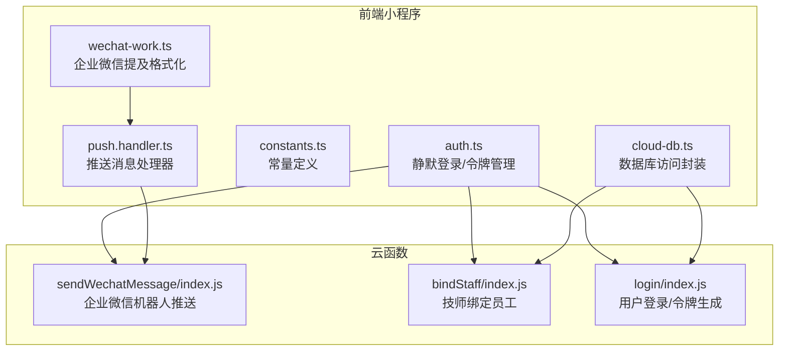
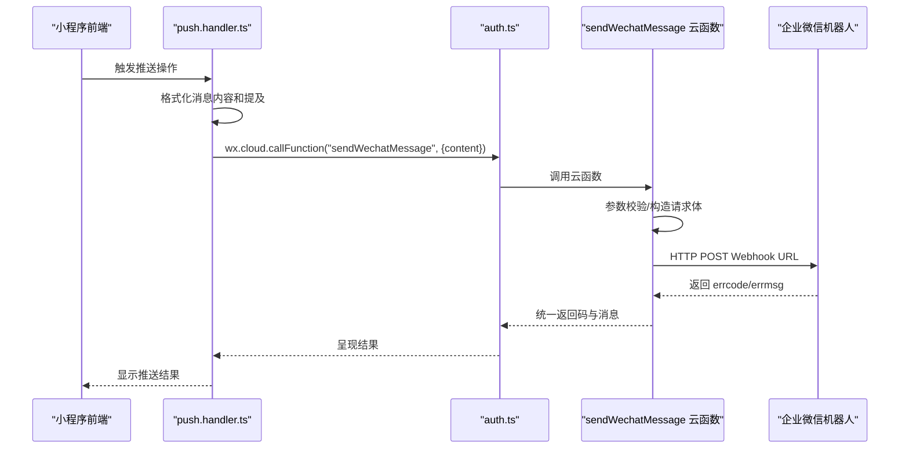
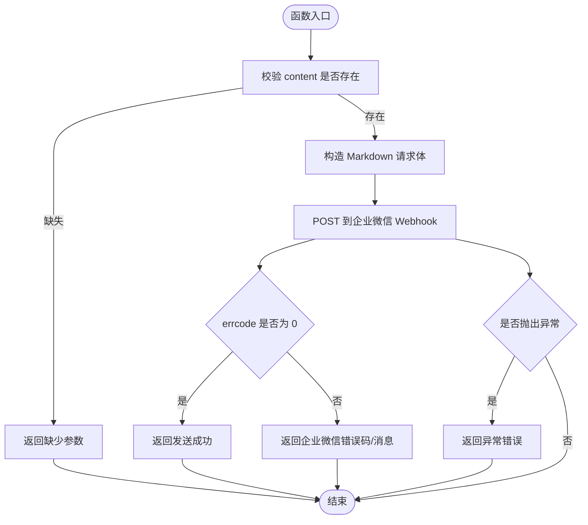
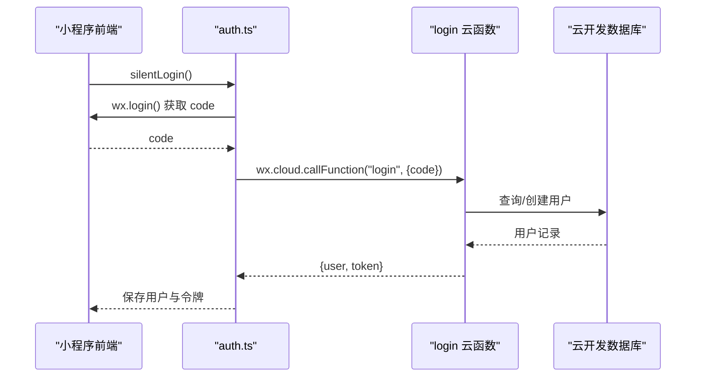
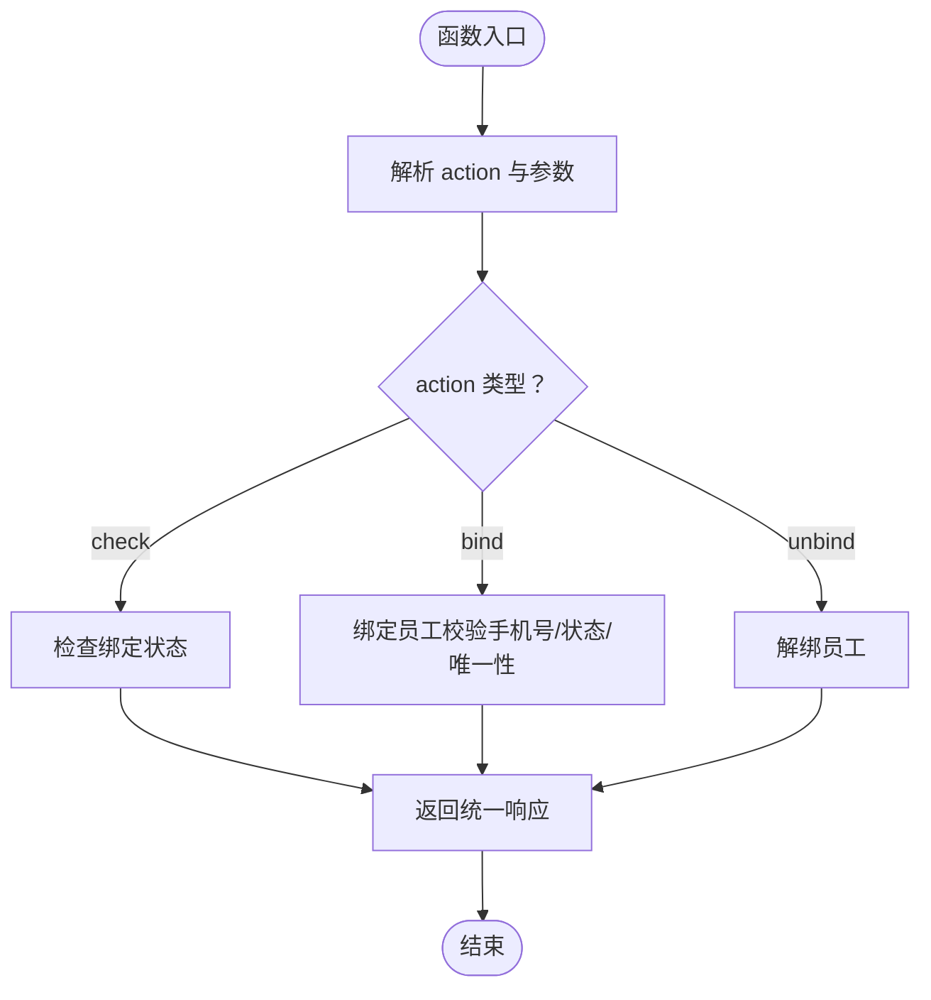
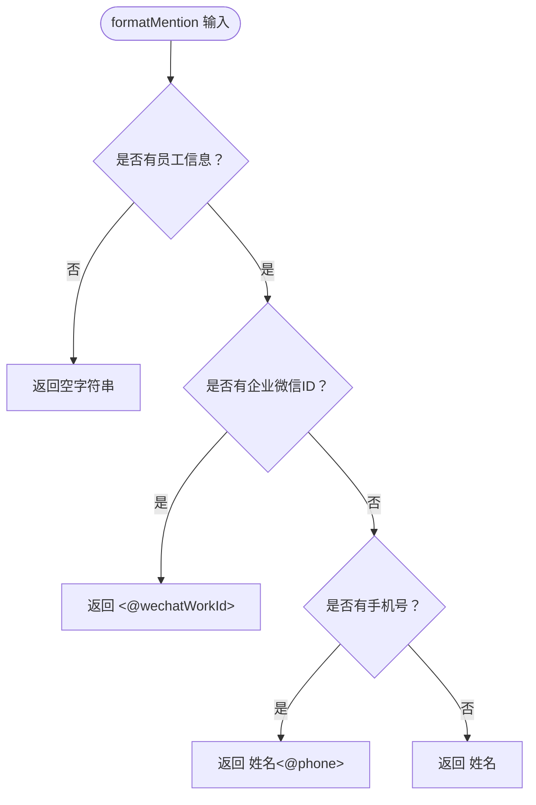
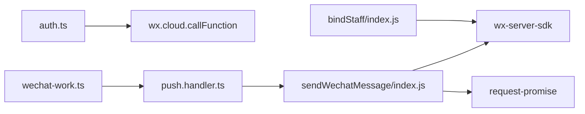

# 通信与通知函数

<cite>
**本文档引用的文件**
- [sendWechatMessage/index.js](file://cloudfunctions/sendWechatMessage/index.js)
- [sendWechatMessage/package.json](file://cloudfunctions/sendWechatMessage/package.json)
- [bindStaff/index.js](file://cloudfunctions/bindStaff/index.js)
- [bindStaff/package.json](file://cloudfunctions/bindStaff/package.json)
- [login/index.js](file://cloudfunctions/login/index.js)
- [auth.ts](file://miniprogram/utils/auth.ts)
- [constants.ts](file://miniprogram/utils/constants.ts)
- [cloud-db.ts](file://miniprogram/utils/cloud-db.ts)
- [wechat-work.ts](file://miniprogram/utils/wechat-work.ts)
- [push.handler.ts](file://miniprogram/pages/cashier/handlers/push.handler.ts)
- [cashier.types.ts](file://miniprogram/pages/cashier/cashier.types.ts)
</cite>

## 更新摘要
**变更内容**
- 增强企业微信机器人推送功能，支持丰富的消息格式和提及功能
- 新增企业微信提及格式化工具函数，支持多种提及方式
- 扩展消息模板设计，支持预约提醒、轮牌通知、到店通知等多种场景
- 发现并标记sendWechatMessage函数中的逻辑错误，需要立即修复

## 目录
1. [简介](#简介)
2. [项目结构](#项目结构)
3. [核心组件](#核心组件)
4. [架构总览](#架构总览)
5. [详细组件分析](#详细组件分析)
6. [企业微信提及功能](#企业微信提及功能)
7. [消息模板设计](#消息模板设计)
8. [依赖关系分析](#依赖关系分析)
9. [性能考虑](#性能考虑)
10. [故障排查指南](#故障排查指南)
11. [结论](#结论)

## 简介
本文件面向通信与通知相关的云函数，重点围绕企业微信机器人消息推送函数 sendWechatMessage 的接口设计、消息模板与动态内容生成、用户授权与鉴权、消息队列与重试策略、错误码与日志记录进行系统化说明。特别关注最新增强的企业微信提及功能，支持多种消息格式和智能提及机制。同时提供最佳实践、性能优化建议与故障排查清单，帮助开发者快速理解与稳定运行该通信能力。

## 项目结构
通信与通知相关的核心文件分布如下：
- 云函数层：sendWechatMessage（企业微信机器人消息推送）、bindStaff（技师绑定员工）、login（用户登录与令牌生成）
- 前端工具层：auth.ts（静默登录、令牌管理、调用云函数）、constants.ts（常量定义）、cloud-db.ts（数据库访问封装）
- 企业微信工具层：wechat-work.ts（提及格式化）、push.handler.ts（推送消息处理器）



**图表来源**
- [auth.ts](file://miniprogram/utils/auth.ts#L97-L126)
- [login/index.js](file://cloudfunctions/login/index.js#L11-L90)
- [bindStaff/index.js](file://cloudfunctions/bindStaff/index.js#L10-L51)
- [sendWechatMessage/index.js](file://cloudfunctions/sendWechatMessage/index.js#L10-L64)
- [wechat-work.ts](file://miniprogram/utils/wechat-work.ts#L1-L16)
- [push.handler.ts](file://miniprogram/pages/cashier/handlers/push.handler.ts#L1-L313)

**章节来源**
- [sendWechatMessage/index.js](file://cloudfunctions/sendWechatMessage/index.js#L1-L65)
- [bindStaff/index.js](file://cloudfunctions/bindStaff/index.js#L1-L189)
- [login/index.js](file://cloudfunctions/login/index.js#L1-L180)
- [auth.ts](file://miniprogram/utils/auth.ts#L1-L245)
- [constants.ts](file://miniprogram/utils/constants.ts#L1-L49)
- [cloud-db.ts](file://miniprogram/utils/cloud-db.ts#L271-L320)
- [wechat-work.ts](file://miniprogram/utils/wechat-work.ts#L1-L16)
- [push.handler.ts](file://miniprogram/pages/cashier/handlers/push.handler.ts#L1-L313)

## 核心组件
- sendWechatMessage：负责将 Markdown 格式的消息内容通过企业微信机器人 Webhook 推送至群聊。
- bindStaff：负责技师与员工信息的绑定/解绑校验与更新。
- login：负责用户登录态维护与令牌生成。
- auth.ts：封装前端登录流程、令牌存储与云函数调用。
- constants.ts/cloud-db.ts：提供常量与数据库访问能力，支撑业务逻辑。
- wechat-work.ts：提供企业微信提及格式化工具函数。
- push.handler.ts：封装各类推送消息的处理器，支持多种业务场景。

**章节来源**
- [sendWechatMessage/index.js](file://cloudfunctions/sendWechatMessage/index.js#L10-L64)
- [bindStaff/index.js](file://cloudfunctions/bindStaff/index.js#L10-L189)
- [login/index.js](file://cloudfunctions/login/index.js#L11-L90)
- [auth.ts](file://miniprogram/utils/auth.ts#L97-L126)
- [cloud-db.ts](file://miniprogram/utils/cloud-db.ts#L271-L320)
- [wechat-work.ts](file://miniprogram/utils/wechat-work.ts#L1-L16)
- [push.handler.ts](file://miniprogram/pages/cashier/handlers/push.handler.ts#L1-L313)

## 架构总览
下图展示从前端发起调用到云函数执行再到企业微信机器人的完整链路：



**图表来源**
- [push.handler.ts](file://miniprogram/pages/cashier/handlers/push.handler.ts#L48-L121)
- [auth.ts](file://miniprogram/utils/auth.ts#L101-L104)
- [sendWechatMessage/index.js](file://cloudfunctions/sendWechatMessage/index.js#L10-L64)

## 详细组件分析

### sendWechatMessage 企业微信机器人推送
**重要警告：发现代码逻辑错误**

- **功能概述**
  - 接收前端传入的 Markdown 内容，通过企业微信机器人 Webhook 推送消息。
  - 返回统一的结构化响应，包含 code、message、data 字段。
- **输入输出规范**
  - 入参：event.content（字符串，Markdown 内容）
  - 出参：统一响应对象（code: number, message: string, data?: any）
- **消息模板与动态内容**
  - 当前实现直接使用传入的 content 作为 Markdown 内容，未内置模板引擎或变量替换逻辑。
  - 建议：在调用侧拼装好包含占位符的 Markdown，或在云函数内扩展模板解析与变量替换。
- **失败重试策略**
  - 当前实现未实现自动重试；建议增加指数退避重试与最大重试次数控制。
- **错误码与日志**
  - 正常：code=0，message='发送成功'
  - 缺少参数：code=-1，message='缺少必要参数'
  - 企业微信返回错误：使用 errcode/errmsg 映射为响应码与消息
  - 异常捕获：code=-1，message='发送失败: ' + error.message
  - 日志：开发阶段保留 console 输出，生产环境建议接入云函数日志服务
- **企业微信集成要点**
  - 使用固定 Webhook URL（含 key），确保密钥安全与权限控制
  - 仅支持 Markdown 类型消息，注意内容格式与转义

**严重问题发现**：在第39-43行代码中，存在逻辑错误：
```javascript
return {
    code: 0,
    message: '发送成功',
    data: response  // 这里使用了未定义的 response 变量
}
const response = await request(options)  // 这行代码永远不会执行
```

**修复建议**：
1. 将 `const response = await request(options)` 移动到 `return` 语句之前
2. 修正返回的数据结构，不要返回未定义的变量
3. 确保正确的错误处理流程



**图表来源**
- [sendWechatMessage/index.js](file://cloudfunctions/sendWechatMessage/index.js#L10-L64)

**章节来源**
- [sendWechatMessage/index.js](file://cloudfunctions/sendWechatMessage/index.js#L1-L65)
- [sendWechatMessage/package.json](file://cloudfunctions/sendWechatMessage/package.json#L1-L12)

### 用户授权与鉴权（login 与 auth.ts）
- **登录流程**
  - 前端静默登录：auth.ts 调用云函数 login，传入 code，获取用户信息与令牌
  - 云函数 login：根据 openId 查询/创建用户，更新最近登录时间，生成令牌
- **令牌管理**
  - auth.ts 将用户信息与令牌保存到本地存储，后续调用云函数时可复用
- **权限与角色**
  - constants.ts 定义了角色与常量，可用于前端权限判断与界面控制



**图表来源**
- [auth.ts](file://miniprogram/utils/auth.ts#L97-L126)
- [login/index.js](file://cloudfunctions/login/index.js#L11-L90)

**章节来源**
- [auth.ts](file://miniprogram/utils/auth.ts#L1-L245)
- [login/index.js](file://cloudfunctions/login/index.js#L1-L180)
- [constants.ts](file://miniprogram/utils/constants.ts#L1-L49)

### 技师绑定员工（bindStaff）
- **功能概述**
  - 支持检查绑定状态、绑定员工、解绑员工三种操作
  - 校验手机号格式、员工状态、是否被其他用户绑定等
- **关键流程**
  - 根据 openId 获取用户信息，再根据 action 分派到对应处理函数
  - 绑定时检查手机号合法性、员工状态与唯一性，成功后更新用户记录
- **返回规范**
  - 统一返回 code/message/data 结构，便于前端一致处理



**图表来源**
- [bindStaff/index.js](file://cloudfunctions/bindStaff/index.js#L10-L51)

**章节来源**
- [bindStaff/index.js](file://cloudfunctions/bindStaff/index.js#L1-L189)
- [bindStaff/package.json](file://cloudfunctions/bindStaff/package.json#L1-L10)

## 企业微信提及功能

### formatMention 函数
企业微信提及功能通过 `formatMention` 函数实现，支持多种提及方式：

- **企业微信ID提及**：`<@userid>` - 最精确的提及方式
- **手机号提及**：`姓名<@phone>` - 通过手机号提及
- **纯姓名**：`姓名` - 仅显示姓名，不进行提及



**图表来源**
- [wechat-work.ts](file://miniprogram/utils/wechat-work.ts#L1-L16)

### 推送消息处理器
推送消息处理器支持多种业务场景：

- **预约创建/取消提醒**：包含顾客信息、时间、项目、技师等详细信息
- **轮牌通知**：显示当日轮牌安排和班次信息
- **到店通知**：通知技师顾客到店信息和准备工作
- **预约变更通知**：通知预约的任何变更详情

**章节来源**
- [wechat-work.ts](file://miniprogram/utils/wechat-work.ts#L1-L16)
- [push.handler.ts](file://miniprogram/pages/cashier/handlers/push.handler.ts#L1-L313)
- [cashier.types.ts](file://miniprogram/pages/cashier/cashier.types.ts#L1-L102)

## 消息模板设计

### 预约提醒模板
支持预约创建和取消两种场景：

**预约创建模板**：
```
【⏰ 新预约提醒】

顾客：张三先生
日期：2024-01-15
时间：**14:00 - 16:00**
项目：面部护理
类型：点钟
技师：**李四、王五**

<@userid1> <@userid2>
```

**预约取消模板**：
```
【🚫 预约**取消**提醒】

顾客：张三先生
日期：2024-01-15
时间：14:00 - 16:00
项目：面部护理
类型：点钟
技师：李四、王五

<@userid1> <@userid2>
```

### 轮牌通知模板
```
【📋 今日轮牌】

日期：2024-01-15

1. 张三 (早班)
2. 李四 (晚班)
3. 王五 (早班)

请各位同事确认今日轮牌顺序，有问题与店长沟通！
```

### 到店通知模板
```
【🏃 到店通知】

张三先生 已到店
项目：面部护理
请<@userid1> <@userid2>准备上钟，工服、口罩穿戴整齐，准备茶点（3份）
```

**章节来源**
- [push.handler.ts](file://miniprogram/pages/cashier/handlers/push.handler.ts#L70-L94)
- [push.handler.ts](file://miniprogram/pages/cashier/handlers/push.handler.ts#L160-L166)
- [push.handler.ts](file://miniprogram/pages/cashier/handlers/push.handler.ts#L229-L233)

## 依赖关系分析
- sendWechatMessage 依赖
  - wx-server-sdk：云函数运行环境初始化
  - request-promise：HTTP 请求封装
- bindStaff 依赖
  - wx-server-sdk：云开发数据库访问
- auth.ts 依赖
  - wx.cloud.callFunction：调用云函数
  - 本地存储：持久化用户与令牌
- wechat-work.ts 依赖
  - 无外部依赖，纯工具函数
- push.handler.ts 依赖
  - wechat-work.ts：提及格式化
  - permission：权限检查
  - 各种业务类型定义



**图表来源**
- [sendWechatMessage/package.json](file://cloudfunctions/sendWechatMessage/package.json#L6-L10)
- [bindStaff/package.json](file://cloudfunctions/bindStaff/package.json#L6-L8)
- [auth.ts](file://miniprogram/utils/auth.ts#L101-L104)
- [wechat-work.ts](file://miniprogram/utils/wechat-work.ts#L1-L16)
- [push.handler.ts](file://miniprogram/pages/cashier/handlers/push.handler.ts#L1-L313)

**章节来源**
- [sendWechatMessage/package.json](file://cloudfunctions/sendWechatMessage/package.json#L1-L12)
- [bindStaff/package.json](file://cloudfunctions/bindStaff/package.json#L1-L10)
- [auth.ts](file://miniprogram/utils/auth.ts#L101-L104)
- [wechat-work.ts](file://miniprogram/utils/wechat-work.ts#L1-L16)
- [push.handler.ts](file://miniprogram/pages/cashier/handlers/push.handler.ts#L1-L313)

## 性能考虑
- **并发与限流**
  - 企业微信 Webhook 对单 key 存在速率限制，建议在调用侧做节流与去重
  - 建议使用队列系统处理大量推送请求
- **超时与重试**
  - 设置合理的请求超时与指数退避重试，避免阻塞云函数执行
  - 对于提及功能，建议先发送普通消息，再尝试提及
- **日志与监控**
  - 生产环境启用云函数日志与指标监控，记录 errcode/耗时/成功率
  - 监控企业微信 API 调用频率和错误率
- **数据库访问**
  - bindStaff 中的查询与更新应尽量使用索引字段，减少全表扫描
  - 提及格式化时避免重复查询员工信息
- **内存优化**
  - 大批量推送时注意内存使用，避免创建过多临时对象

## 故障排查指南

### 企业微信提及相关问题
- **提及无效**
  - 检查企业微信ID是否正确配置
  - 确认员工已在企业微信中注册
  - 验证提及格式是否正确：`<@userid>` 或 `姓名<@phone>`
- **消息发送成功但无提及效果**
  - 确认企业微信机器人权限设置
  - 检查群成员是否在企业微信中
  - 验证消息格式是否符合企业微信要求

### sendWechatMessage 函数问题
- **函数永远返回成功**
  - 修复逻辑错误：将请求发送移到返回语句之前
  - 修正返回的数据结构，不要返回未定义变量
- **缺少必要参数**
  - 检查前端调用时是否正确传递 content 参数
- **企业微信返回错误**
  - 核对 Webhook key 与网络连通性
  - 检查消息格式是否符合企业微信要求

### 常见问题定位
- **缺少必要参数**：检查前端是否传递 content
- **企业微信返回错误**：核对 Webhook key 与网络连通性
- **异常捕获**：查看云函数日志中的错误堆栈
- **提及功能失效**：检查员工信息是否正确配置

### 建议排查步骤
1. 确认 Webhook URL 与 key 正确
2. 检查 Markdown 内容格式与长度限制
3. 查看云函数执行日志与耗时
4. 在调用侧增加幂等与去重逻辑
5. 验证企业微信提及格式和权限设置

**章节来源**
- [sendWechatMessage/index.js](file://cloudfunctions/sendWechatMessage/index.js#L13-L18)
- [sendWechatMessage/index.js](file://cloudfunctions/sendWechatMessage/index.js#L46-L57)
- [sendWechatMessage/index.js](file://cloudfunctions/sendWechatMessage/index.js#L58-L63)
- [wechat-work.ts](file://miniprogram/utils/wechat-work.ts#L1-L16)
- [push.handler.ts](file://miniprogram/pages/cashier/handlers/push.handler.ts#L1-L313)

## 结论
sendWechatMessage 提供了企业微信机器人消息推送能力，结合 bindStaff 与 login 实现了基础的用户授权与绑定管理。**最新版本增强了企业微信提及功能**，支持多种消息格式和智能提及机制。然而，**存在严重的代码逻辑错误需要立即修复**。

建议在调用侧完成消息模板与变量替换，在云函数侧增加重试与日志监控，并持续优化并发与限流策略以提升可靠性与性能。同时，确保企业微信提及功能的正确配置和权限设置，以充分发挥其在团队协作中的作用。

**重要提醒**：请立即修复 sendWechatMessage 函数中的逻辑错误，否则函数将无法正常发送消息。