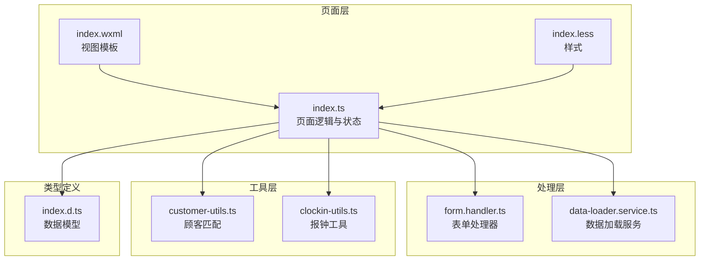
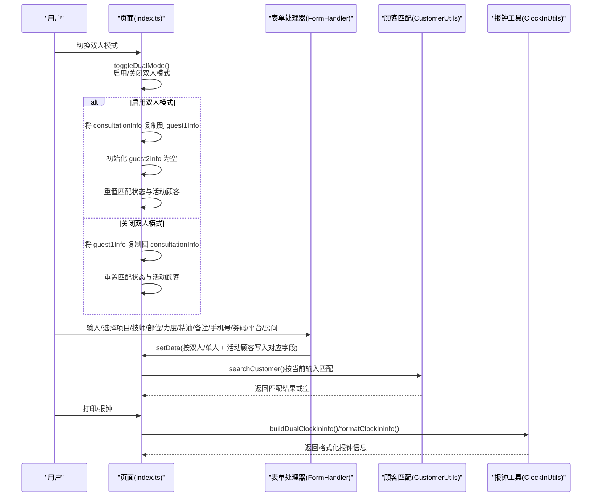
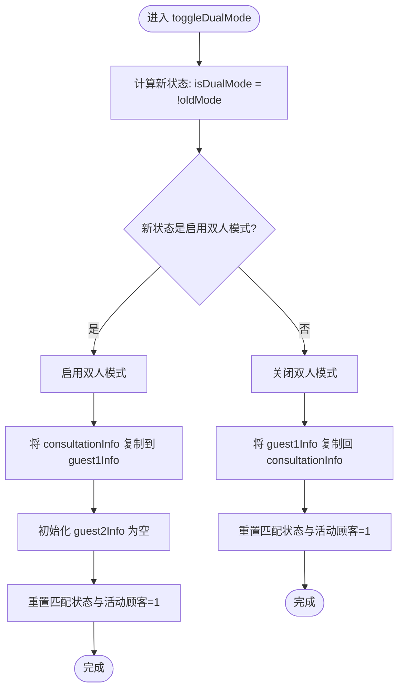
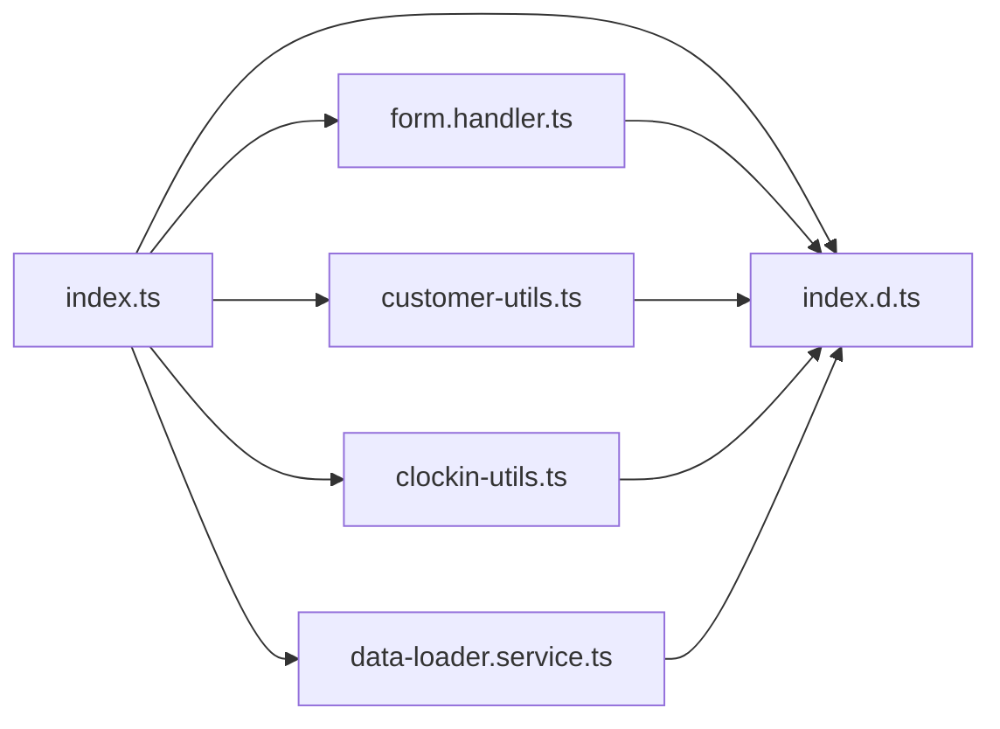

# 双人模式管理

<cite>
**本文引用的文件**
- [index.ts](file://miniprogram/pages/index/index.ts)
- [form.handler.ts](file://miniprogram/pages/index/handlers/form.handler.ts)
- [index.wxml](file://miniprogram/pages/index/index.wxml)
- [index.less](file://miniprogram/pages/index/index.less)
- [customer-utils.ts](file://miniprogram/pages/index/utils/customer-utils.ts)
- [clockin-utils.ts](file://miniprogram/pages/index/utils/clockin-utils.ts)
- [data-loader.service.ts](file://miniprogram/pages/index/services/data-loader.service.ts)
- [index.d.ts](file://typings/index.d.ts)
</cite>

## 目录
1. [简介](#简介)
2. [项目结构](#项目结构)
3. [核心组件](#核心组件)
4. [架构总览](#架构总览)
5. [详细组件分析](#详细组件分析)
6. [依赖关系分析](#依赖关系分析)
7. [性能考量](#性能考量)
8. [故障排查指南](#故障排查指南)
9. [结论](#结论)
10. [附录](#附录)

## 简介
本文件面向“双人模式管理”功能，系统性阐述其设计理念、实现架构与使用实践。重点覆盖：
- 模式切换机制：从单人到双人的数据迁移与状态重置
- 数据隔离策略：guest1Info、guest2Info 的独立存储与 consultationInfo 的共享处理
- 状态同步逻辑：表单联动、项目选择、报钟与打印输出
- toggleDualMode 方法的实现细节与边界条件
- 用户体验设计：界面布局、交互流程与视觉反馈
- 最佳实践与常见问题排查

## 项目结构
双人模式位于小程序主页面（index），采用“页面 + 处理器 + 工具类 + 服务”的分层组织：
- 页面逻辑：负责状态管理、事件处理与视图渲染
- 表单处理器：封装输入变更的分支逻辑（双人/单人）
- 工具类：顾客匹配、报钟计算等业务工具
- 服务类：数据加载、可用技师查询等

图表来源
- [index.ts](file://miniprogram/pages/index/index.ts#L75-L196)
- [form.handler.ts](file://miniprogram/pages/index/handlers/form.handler.ts#L1-L175)
- [index.wxml](file://miniprogram/pages/index/index.wxml#L22-L225)
- [index.less](file://miniprogram/pages/index/index.less#L1-L762)
- [customer-utils.ts](file://miniprogram/pages/index/utils/customer-utils.ts#L1-L121)
- [clockin-utils.ts](file://miniprogram/pages/index/utils/clockin-utils.ts#L1-L184)
- [data-loader.service.ts](file://miniprogram/pages/index/services/data-loader.service.ts#L1-L206)
- [index.d.ts](file://typings/index.d.ts#L37-L83)

章节来源
- [index.ts](file://miniprogram/pages/index/index.ts#L75-L196)
- [index.wxml](file://miniprogram/pages/index/index.wxml#L22-L225)
- [index.less](file://miniprogram/pages/index/index.less#L1-L762)

## 核心组件
- 页面状态与入口
  - 页面初始化与数据加载：加载技师列表、项目列表、编辑或预约数据
  - 双人模式开关：toggleDualMode
  - 表单事件代理：统一委托给 FormHandler
  - 业务流程：打印咨询单、报钟、保存、刷新
- 表单处理器
  - 将输入事件按“双人/单人 + 当前活跃顾客”路由到对应字段
  - 统一处理项目选择、技师选择、报钟、备注、手机号、券码、平台、房间、力度、精油、部位选择
- 工具类
  - 顾客匹配：基于当前输入（姓名/性别/手机号）调用云函数匹配
  - 报钟构建：生成双人报钟信息、计算加班时长、格式化报钟文本
- 服务类
  - 加载可用技师列表、加载项目、编辑数据、预约数据加载

章节来源
- [index.ts](file://miniprogram/pages/index/index.ts#L125-L147)
- [form.handler.ts](file://miniprogram/pages/index/handlers/form.handler.ts#L10-L175)
- [customer-utils.ts](file://miniprogram/pages/index/utils/customer-utils.ts#L1-L121)
- [clockin-utils.ts](file://miniprogram/pages/index/utils/clockin-utils.ts#L1-L184)
- [data-loader.service.ts](file://miniprogram/pages/index/services/data-loader.service.ts#L1-L206)

## 架构总览
双人模式围绕“页面状态 + 表单处理器 + 工具类 + 服务类”的协作展开。toggleDualMode 是模式切换的核心枢纽，贯穿数据迁移、状态重置与界面更新。

图表来源
- [index.ts](file://miniprogram/pages/index/index.ts#L149-L196)
- [form.handler.ts](file://miniprogram/pages/index/handlers/form.handler.ts#L10-L175)
- [customer-utils.ts](file://miniprogram/pages/index/utils/customer-utils.ts#L1-L121)
- [clockin-utils.ts](file://miniprogram/pages/index/utils/clockin-utils.ts#L111-L182)

## 详细组件分析

### toggleDualMode 方法实现详解
- 设计目标
  - 在单人与双人模式之间平滑切换
  - 保证数据一致性：启用时将当前咨询单信息迁移到 guest1Info，并初始化 guest2Info；关闭时将 guest1Info 回写到 consultationInfo
  - 重置匹配状态与活动顾客，避免跨模式残留状态
- 关键步骤
  - 判断新状态 isDualMode
  - 启用双人模式
    - 将 consultationInfo 的字段映射到 guest1Info（含姓名、性别、部位、力度、精油、备注、技师、报钟、券码、平台、项目）
    - 初始化 guest2Info 为默认值（空部位集合）
    - 重置匹配状态与活动顾客为 1
  - 关闭双人模式
    - 将 guest1Info 的字段回写到 consultationInfo
    - 重置匹配状态与活动顾客为 1
- 边界与注意事项
  - 保持 selectedParts 的深拷贝，避免引用污染
  - 保持枚举类型的类型安全（如 gender、massageStrength、couponPlatform）
  - 切换后立即更新 currentProjectIsEssentialOilOnly 与 currentProjectNeedEssentialOil，确保视图正确显示

图表来源
- [index.ts](file://miniprogram/pages/index/index.ts#L149-L196)

章节来源
- [index.ts](file://miniprogram/pages/index/index.ts#L149-L196)

### 数据结构设计与隔离策略
- 数据模型
  - ConsultationInfo：单人模式下的完整咨询单数据
  - GuestInfo：双人模式下每个顾客的独立数据
  - 两者均包含：姓名、性别、项目、技师、房间、力度、精油、部位、报钟、备注、手机号、券码、平台、日期、起止时间等
- 隔离策略
  - 双人模式下，guest1Info 与 guest2Info 独立存储，互不影响
  - consultationInfo 作为共享字段（如房间、手机号、券平台等），在双人模式下仅在特定字段上共享
  - 通过 activeGuest 控制当前编辑的是哪一位顾客
- 类型约束
  - gender、massageStrength、couponPlatform 等字段具有明确枚举值，确保类型安全
  - selectedParts 以键值映射表示部位选择，便于快速切换与渲染

章节来源
- [index.d.ts](file://typings/index.d.ts#L37-L83)
- [index.ts](file://miniprogram/pages/index/index.ts#L16-L48)

### 表单处理器与状态同步
- 分支逻辑
  - 所有输入事件（姓名、性别、项目、技师、报钟、备注、手机号、券码、平台、房间、力度、精油、部位）均通过 FormHandler 统一分发
  - 根据 isDualMode 与 activeGuest 决定写入 guest1Info 或 guest2Info 对应字段
- 状态同步
  - 项目选择时同步更新 currentProjectIsEssentialOilOnly 与 currentProjectNeedEssentialOil，驱动视图显示（精油选择/专属精油）
  - 部位选择时对当前顾客的 selectedParts 进行深拷贝与翻转
  - 报钟选择时对当前顾客的 isClockIn 进行翻转
- 交互反馈
  - 输入后自动触发 searchCustomer，提升匹配效率
  - 通过 setData 的路径更新，确保视图即时反映

章节来源
- [form.handler.ts](file://miniprogram/pages/index/handlers/form.handler.ts#L10-L175)

### 顾客匹配与应用
- 匹配规则
  - 双人模式：优先使用 activeGuest 的姓名/性别；若为空则回退到 consultationInfo 的姓名/性别
  - 单人模式：直接使用 consultationInfo 的姓名/性别
  - 无论哪种模式，均使用 consultationInfo 的手机号参与匹配
- 应用策略
  - 双人模式：将匹配结果应用到当前顾客字段；若存在责任技师则回写到该顾客；若存在手机号则回写到共享手机号；若存在车牌号则解析并填充 plateNumber
  - 单人模式：同上，但仅回写 consultationInfo
- 视觉反馈
  - 匹配结果展示在视图中，支持“应用/清除”操作

章节来源
- [customer-utils.ts](file://miniprogram/pages/index/utils/customer-utils.ts#L1-L121)
- [index.wxml](file://miniprogram/pages/index/index.wxml#L129-L150)

### 报钟与打印输出
- 报钟
  - 单人模式：直接保存 consultationInfo 并计算加班时长
  - 双人模式：通过 ClockInUtils.buildDualClockInInfo 生成两位顾客的报钟信息，统一开始时间，分别计算结束时间，异步保存并格式化报钟文本
- 打印
  - 单人模式：基于 consultationInfo 生成打印内容
  - 双人模式：分别基于 guest1Info 与 guest2Info 生成两份打印内容，再统一发送至打印机

章节来源
- [clockin-utils.ts](file://miniprogram/pages/index/utils/clockin-utils.ts#L111-L182)
- [index.ts](file://miniprogram/pages/index/index.ts#L262-L324)

### 界面布局与交互流程
- 双人模式开关
  - 顶部右上角显示“双人模式”开关，切换时触发 toggleDualMode
- 顾客标签页
  - 双人模式下显示“顾客1/顾客2”标签，点击切换 activeGuest
  - 标签内展示当前顾客姓名与技师信息，高亮当前活动标签
- 表单字段
  - 项目、部位、力度、精油、房间、技师、报钟、手机号、券码、平台、备注等
  - 双人模式下，房间与手机号标注“共享”，并在顾客2侧禁用或弱化
- 弹窗与模态
  - 时间选择器用于设置报钟开始时间
  - 报钟推送确认弹窗用于预览与推送报钟内容
- 视觉反馈
  - 选中状态高亮、禁用态弱化、共享字段提示等

章节来源
- [index.wxml](file://miniprogram/pages/index/index.wxml#L29-L179)
- [index.less](file://miniprogram/pages/index/index.less#L240-L338)

## 依赖关系分析
- 页面对处理器的依赖
  - 页面将大部分输入事件委托给 FormHandler，降低页面复杂度
- 页面对工具类的依赖
  - 顾客匹配依赖 CustomerUtils
  - 报钟与加班计算依赖 ClockInUtils
- 页面对服务类的依赖
  - 可用技师列表、项目列表、编辑/预约数据加载依赖 DataLoaderService
- 类型定义的约束
  - index.d.ts 中的接口与枚举为各模块提供类型保障

图表来源
- [index.ts](file://miniprogram/pages/index/index.ts#L1-L14)
- [form.handler.ts](file://miniprogram/pages/index/handlers/form.handler.ts#L1-L8)
- [customer-utils.ts](file://miniprogram/pages/index/utils/customer-utils.ts#L1-L8)
- [clockin-utils.ts](file://miniprogram/pages/index/utils/clockin-utils.ts#L1-L5)
- [data-loader.service.ts](file://miniprogram/pages/index/services/data-loader.service.ts#L1-L5)
- [index.d.ts](file://typings/index.d.ts#L37-L83)

章节来源
- [index.ts](file://miniprogram/pages/index/index.ts#L1-L14)
- [index.d.ts](file://typings/index.d.ts#L37-L83)

## 性能考量
- 渲染优化
  - 通过 isDualMode 与 activeGuest 控制视图分支，减少不必要的节点渲染
  - 部位选择采用 selectedParts 的布尔映射，避免频繁 DOM 操作
- 数据更新
  - setData 使用路径更新，避免整包替换导致的全量重渲染
  - 深拷贝 selectedParts，避免引用污染引发的异常渲染
- 异步操作
  - 报钟与打印采用异步处理，避免阻塞主线程
  - 云函数调用（匹配、可用技师、报钟推送）需考虑网络延迟与错误处理

[本节为通用建议，无需特定文件来源]

## 故障排查指南
- 切换双人模式后字段未更新
  - 检查 toggleDualMode 是否正确执行字段复制与重置
  - 确认 activeGuest 是否被重置为 1
- 双人模式下房间/手机号不可编辑
  - 确认视图中对顾客2的字段添加了“共享字段禁用”样式
  - 确认表单处理器对顾客2的字段设置了 disabled 或弱化
- 项目选择后精油显示异常
  - 检查 FormHandler 是否同步更新 currentProjectIsEssentialOilOnly 与 currentProjectNeedEssentialOil
  - 确认 ClockInUtils.buildDualClockInInfo 在报钟时也正确传递 isEssentialOilOnly
- 报钟时间不一致
  - 检查 ClockInUtils.buildDualClockInInfo 是否使用相同开始时间
  - 确认格式化报钟文本时是否正确计算结束时间
- 顾客匹配失败
  - 检查 searchCustomer 的输入参数（姓名/性别/手机号）
  - 确认云函数 matchCustomer 的返回结构与 code 字段

章节来源
- [index.ts](file://miniprogram/pages/index/index.ts#L149-L196)
- [form.handler.ts](file://miniprogram/pages/index/handlers/form.handler.ts#L33-L55)
- [clockin-utils.ts](file://miniprogram/pages/index/utils/clockin-utils.ts#L111-L182)
- [customer-utils.ts](file://miniprogram/pages/index/utils/customer-utils.ts#L1-L121)

## 结论
双人模式通过“页面状态 + 表单处理器 + 工具类 + 服务类”的协同，实现了高效、清晰且可维护的多顾客管理能力。toggleDualMode 作为核心枢纽，确保了数据迁移、状态重置与界面更新的一致性；FormHandler 将复杂的分支逻辑抽象为统一入口；工具类与服务类分别承担业务与数据加载职责，形成清晰的分层架构。遵循本文的最佳实践与排查建议，可进一步提升开发效率与用户体验。

[本节为总结，无需特定文件来源]

## 附录

### 使用场景示例与最佳实践
- 场景一：双人同时到店
  - 启用双人模式，将预约数据加载到 guest1Info 与 guest2Info
  - 分别为两位顾客选择项目、技师、部位、力度与精油
  - 打印两份咨询单，报钟时统一开始时间
  - 最佳实践：确保两位顾客的房间与手机号共享字段一致
- 场景二：单人到店，临时加人
  - 在单人模式下先录入一位顾客信息
  - 切换双人模式，将已录入信息迁移到 guest1Info
  - 为第二位顾客单独录入信息
  - 最佳实践：切换前后及时重置匹配状态，避免残留
- 场景三：报钟与加班统计
  - 双人模式下统一开始时间，分别计算结束时间
  - 保存两位顾客记录并计算加班时长
  - 最佳实践：使用 ClockInUtils.calculateOvertime 进行加班校验

[本节为概念性说明，无需特定文件来源]