# 咨询单管理系统

<cite>
**本文引用的文件**
- [miniprogram/pages/index/index.ts](file://miniprogram/pages/index/index.ts)
- [miniprogram/pages/index/index.wxml](file://miniprogram/pages/index/index.wxml)
- [miniprogram/pages/index/handlers/form.handler.ts](file://miniprogram/pages/index/handlers/form.handler.ts)
- [miniprogram/pages/index/handlers/modal.handler.ts](file://miniprogram/pages/index/handlers/modal.handler.ts)
- [miniprogram/pages/index/services/data-loader.service.ts](file://miniprogram/pages/index/services/data-loader.service.ts)
- [miniprogram/pages/cashier/cashier.ts](file://miniprogram/pages/cashier/cashier.ts)
- [miniprogram/pages/cashier/cashier.types.ts](file://miniprogram/pages/cashier/cashier.types.ts)
- [miniprogram/pages/cashier/services/data-loader.service.ts](file://miniprogram/pages/cashier/services/data-loader.service.ts)
- [miniprogram/pages/cashier/handlers/reservation.handler.ts](file://miniprogram/pages/cashier/handlers/reservation.handler.ts)
- [miniprogram/pages/cashier/handlers/settlement.handler.ts](file://miniprogram/pages/cashier/handlers/settlement.handler.ts)
- [miniprogram/pages/cashier/handlers/push.handler.ts](file://miniprogram/pages/cashier/handlers/push.handler.ts)
- [miniprogram/pages/cashier/utils/customer-match.ts](file://miniprogram/pages/cashier/utils/customer-match.ts)
- [miniprogram/pages/cashier/cashier.wxml](file://miniprogram/pages/cashier/cashier.wxml)
- [miniprogram/utils/validators.ts](file://miniprogram/utils/validators.ts)
- [miniprogram/utils/util.ts](file://miniprogram/utils/util.ts)
- [miniprogram/utils/auth.ts](file://miniprogram/utils/auth.ts)
- [miniprogram/utils/permission.ts](file://miniprogram/utils/permission.ts)
- [miniprogram/utils/cloud-db.ts](file://miniprogram/utils/cloud-db.ts)
- [miniprogram/services/print-content-builder.ts](file://miniprogram/services/print-content-builder.ts)
- [miniprogram/services/printer-service.ts](file://miniprogram/services/printer-service.ts)
- [miniprogram/pages/index/utils/clockin-utils.ts](file://miniprogram/pages/index/utils/clockin-utils.ts)
- [miniprogram/pages/index/utils/customer-utils.ts](file://miniprogram/pages/index/utils/customer-utils.ts)
- [miniprogram/pages/index/utils/reservation-utils.ts](file://miniprogram/pages/index/utils/reservation-utils.ts)
</cite>

## 更新摘要
**所做更改**
- 新增模块化架构设计章节，详细介绍收银台模块的重构
- 更新架构总览图，反映新的模块化组件结构
- 新增CashierDataLoaderService数据加载服务详细分析
- 新增ReservationHandler预约处理器详细分析
- 新增SettlementHandler结算处理器详细分析
- 新增PushHandler推送处理器详细分析
- 新增customer-match工具类分析
- 更新依赖关系图，展示模块间的交互关系
- 新增收银台业务流程和界面结构分析

## 目录
1. [简介](#简介)
2. [项目结构](#项目结构)
3. [核心组件](#核心组件)
4. [架构总览](#架构总览)
5. [详细组件分析](#详细组件分析)
6. [模块化架构设计](#模块化架构设计)
7. [依赖关系分析](#依赖关系分析)
8. [性能与并发特性](#性能与并发特性)
9. [故障排查指南](#故障排查指南)
10. [结论](#结论)
11. [附录：使用示例与最佳实践](#附录使用示例与最佳实践)

## 简介
本系统为微信小程序端的"咨询单管理系统"，现已采用模块化架构设计，围绕咨询单的创建、编辑、查看与打印展开，同时提供"双人模式"以支持同一时间点两位顾客的并行处理，并集成报钟（上钟）流程与企业微信推送。系统通过表单处理器(FormHandler)统一处理用户输入与状态变更，通过模态框处理器(ModalHandler)协调弹窗交互与确认流程，通过数据加载服务(DataLoaderService)拉取项目、技师等基础数据并处理编辑/预约导入场景。业务规则由验证器(Validators)集中定义，工具类(Utilities)提供时间计算、格式化与业务辅助方法。

**更新** 系统现已重构为模块化架构，收银台功能独立为cashier模块，提供更清晰的职责分离和更好的可维护性。

## 项目结构
- 页面入口：index.ts/wxml 负责整体UI、事件绑定与业务编排
- 收银台模块：cashier.ts 负责预约管理、结算处理、轮牌推送等功能
- 表单层：FormHandler 统一处理字段变更与联动
- 弹窗层：ModalHandler 统一处理时间选择、车牌输入、报钟确认等弹窗
- 数据层：DataLoaderService 负责加载项目、技师、编辑/预约导入
- 工具层：validators.ts、util.ts、各 utils 下工具类提供校验与业务计算
- 打印与打印内容构建：index.ts 中调用 PrintContentBuilder 与 PrinterService

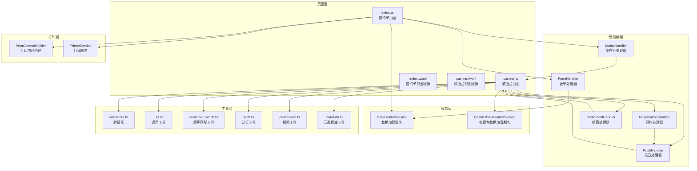

**图表来源**
- [miniprogram/pages/index/index.ts](file://miniprogram/pages/index/index.ts#L1-L735)
- [miniprogram/pages/index/index.wxml](file://miniprogram/pages/index/index.wxml#L1-L225)
- [miniprogram/pages/index/handlers/form.handler.ts](file://miniprogram/pages/index/handlers/form.handler.ts#L1-L175)
- [miniprogram/pages/index/handlers/modal.handler.ts](file://miniprogram/pages/index/handlers/modal.handler.ts#L1-L167)
- [miniprogram/pages/index/services/data-loader.service.ts](file://miniprogram/pages/index/services/data-loader.service.ts#L1-L206)
- [miniprogram/pages/cashier/cashier.ts](file://miniprogram/pages/cashier/cashier.ts#L1-L408)
- [miniprogram/pages/cashier/cashier.wxml](file://miniprogram/pages/cashier/cashier.wxml#L1-L326)
- [miniprogram/pages/cashier/handlers/reservation.handler.ts](file://miniprogram/pages/cashier/handlers/reservation.handler.ts#L1-L897)
- [miniprogram/pages/cashier/handlers/settlement.handler.ts](file://miniprogram/pages/cashier/handlers/settlement.handler.ts#L1-L293)
- [miniprogram/pages/cashier/handlers/push.handler.ts](file://miniprogram/pages/cashier/handlers/push.handler.ts#L1-L314)
- [miniprogram/pages/cashier/services/data-loader.service.ts](file://miniprogram/pages/cashier/services/data-loader.service.ts#L1-L241)
- [miniprogram/pages/cashier/utils/customer-match.ts](file://miniprogram/pages/cashier/utils/customer-match.ts#L1-L110)

**章节来源**
- [miniprogram/pages/index/index.ts](file://miniprogram/pages/index/index.ts#L75-L147)
- [miniprogram/pages/index/index.wxml](file://miniprogram/pages/index/index.wxml#L1-L225)
- [miniprogram/pages/cashier/cashier.ts](file://miniprogram/pages/cashier/cashier.ts#L1-L408)
- [miniprogram/pages/cashier/cashier.wxml](file://miniprogram/pages/cashier/cashier.wxml#L1-L326)

## 核心组件
- 表单处理器(FormHandler)：封装所有字段变更事件，负责双人模式下的字段路由、项目与精油联动、技师占用提示、以及变更后的自动搜索匹配。
- 模态框处理器(ModalHandler)：封装时间选择器、车牌输入、报钟确认弹窗的交互逻辑，负责报钟流程的确认与推送。
- 数据加载服务(DataLoaderService)：封装加载项目、技师列表、编辑数据、预约导入等数据流，统一错误处理与加载状态。
- 验证器(Validators)：集中定义咨询单创建/打印的必填项与业务规则，提供统一的错误提示。
- 工具类(Utilities)：提供时间解析、项目时长计算、加班单位计算、格式化等通用能力。
- 报钟工具(ClockInUtils)：计算加班单位、格式化报钟信息、双人报钟信息构建。
- 顾客匹配工具(CustomerUtils)：云端匹配顾客、构建应用更新集。
- 预约工具(ReservationUtils)：删除已到店预约、未来预约重新分配、保存/更新顾客信息。
- **新增** 收银台数据加载服务(CashierDataLoaderService)：专门负责收银台模块的数据加载，包括房间状态、轮牌队列、员工可用性等。
- **新增** 预约处理器(ReservationHandler)：处理预约创建、编辑、取消、到店等完整流程。
- **新增** 结算处理器(SettlementHandler)：处理咨询单结算、支付方式管理和会员卡扣减。
- **新增** 推送处理器(PushHandler)：处理企业微信推送、到店通知和预约变更通知。
- **新增** 顾客匹配工具(customer-match)：专门处理收银台场景下的顾客匹配功能。

**章节来源**
- [miniprogram/pages/index/handlers/form.handler.ts](file://miniprogram/pages/index/handlers/form.handler.ts#L1-L175)
- [miniprogram/pages/index/handlers/modal.handler.ts](file://miniprogram/pages/index/handlers/modal.handler.ts#L1-L167)
- [miniprogram/pages/index/services/data-loader.service.ts](file://miniprogram/pages/index/services/data-loader.service.ts#L1-L206)
- [miniprogram/pages/cashier/services/data-loader.service.ts](file://miniprogram/pages/cashier/services/data-loader.service.ts#L1-L241)
- [miniprogram/pages/cashier/handlers/reservation.handler.ts](file://miniprogram/pages/cashier/handlers/reservation.handler.ts#L1-L897)
- [miniprogram/pages/cashier/handlers/settlement.handler.ts](file://miniprogram/pages/cashier/handlers/settlement.handler.ts#L1-L293)
- [miniprogram/pages/cashier/handlers/push.handler.ts](file://miniprogram/pages/cashier/handlers/push.handler.ts#L1-L314)
- [miniprogram/pages/cashier/utils/customer-match.ts](file://miniprogram/pages/cashier/utils/customer-match.ts#L1-L110)

## 架构总览
系统采用"页面控制器 + 处理器 + 服务 + 工具"的分层架构，现已重构为模块化设计：
- 页面控制器(index.ts/cashier.ts)负责生命周期、事件编排、状态管理与跨模块协作
- 处理器(各模块专用处理器)负责具体交互逻辑与状态变更
- 服务(通用服务 + 模块专用服务)负责数据获取、缓存策略与异步处理
- 工具层提供可复用的业务计算与格式化能力

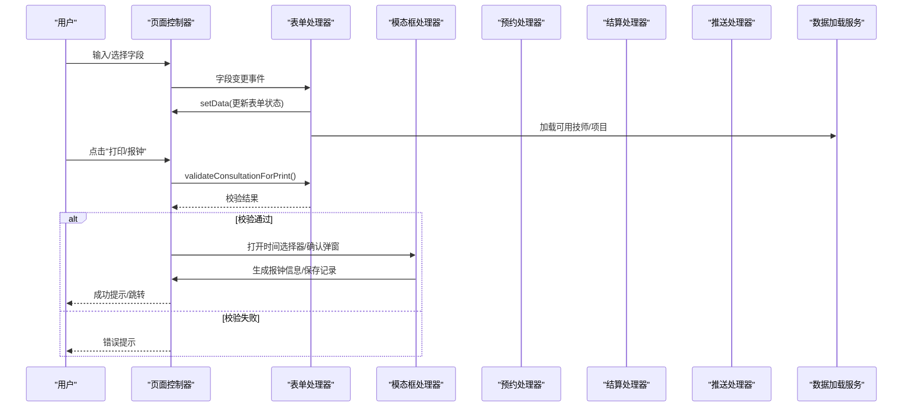

**图表来源**
- [miniprogram/pages/index/index.ts](file://miniprogram/pages/index/index.ts#L263-L324)
- [miniprogram/pages/index/handlers/form.handler.ts](file://miniprogram/pages/index/handlers/form.handler.ts#L10-L175)
- [miniprogram/pages/index/handlers/modal.handler.ts](file://miniprogram/pages/index/handlers/modal.handler.ts#L16-L167)
- [miniprogram/utils/validators.ts](file://miniprogram/utils/validators.ts#L51-L81)

## 详细组件分析

### 表单处理器(FormHandler)实现逻辑
- 字段路由：根据双人模式与当前活跃顾客，将输入写入对应字段（consultationInfo 或 guest1Info/guest2Info），并在变更后触发自动搜索匹配。
- 项目联动：选择项目后同步更新"专属精油仅用/需要精油"状态，并触发可用技师列表刷新。
- 技师占用提示：当技师被占用时给出提示并阻止提交。
- 精油选择：在非专属精油且需要精油的项目下强制选择精油。
- 加钟/房间/备注/券码/平台等字段均按双人模式进行条件性禁用或共享。

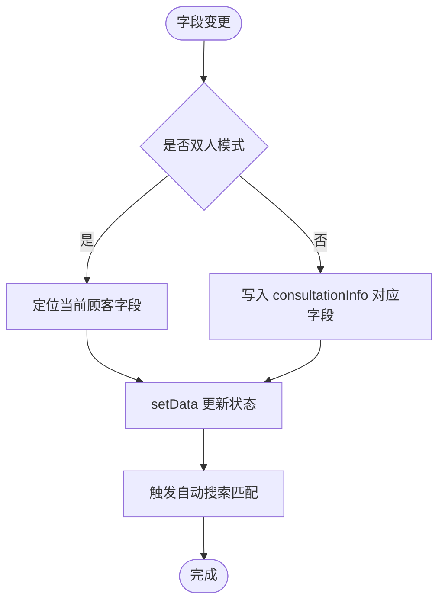

**图表来源**
- [miniprogram/pages/index/handlers/form.handler.ts](file://miniprogram/pages/index/handlers/form.handler.ts#L10-L175)

**章节来源**
- [miniprogram/pages/index/handlers/form.handler.ts](file://miniprogram/pages/index/handlers/form.handler.ts#L1-L175)

### 模态框处理机制(ModalHandler)
- 时间选择器：支持编辑/新建两种模式的时间选择，计算结束时间并生成报钟信息；双人模式下并行保存两位顾客记录。
- 报钟确认弹窗：展示格式化的报钟内容，支持企业微信推送，推送成功后自动清理状态并返回或重置表单。
- 车牌输入弹窗：支持普通与新能源车牌长度差异，拆分为字符数组渲染。

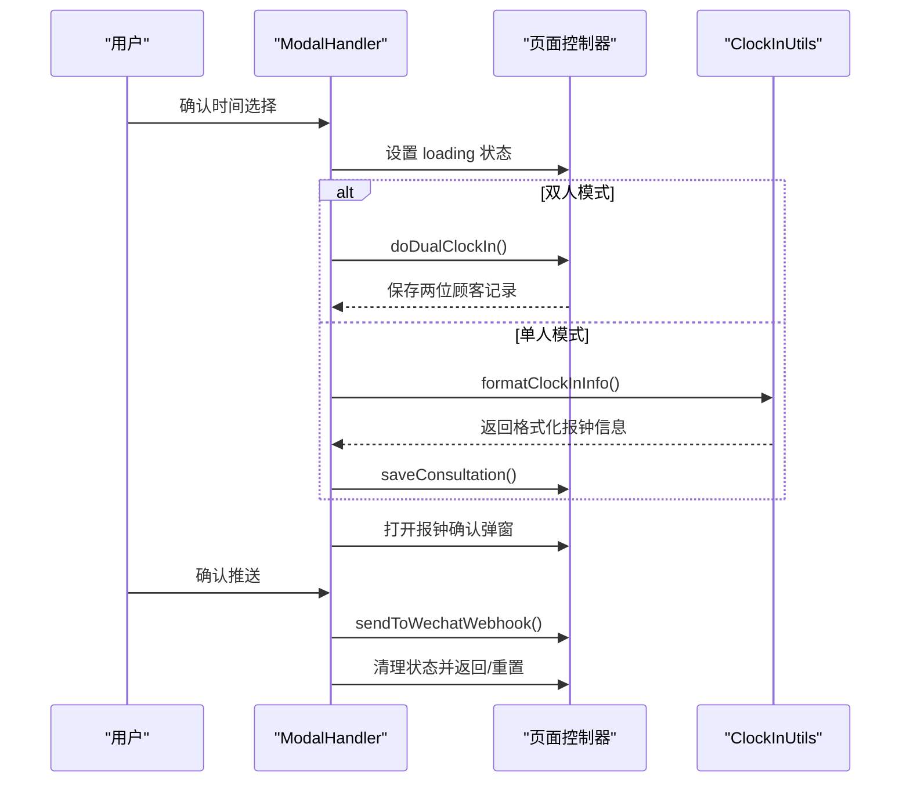

**图表来源**
- [miniprogram/pages/index/handlers/modal.handler.ts](file://miniprogram/pages/index/handlers/modal.handler.ts#L16-L167)
- [miniprogram/pages/index/utils/clockin-utils.ts](file://miniprogram/pages/index/utils/clockin-utils.ts#L49-L109)

**章节来源**
- [miniprogram/pages/index/handlers/modal.handler.ts](file://miniprogram/pages/index/handlers/modal.handler.ts#L1-L167)

### DataLoaderService 数据加载服务
- 加载技师列表：根据目标日期、当前时间、项目时长、当前预约ID列表与当前咨询单ID，调用云函数获取可用技师列表。
- 加载项目：从全局应用数据获取项目列表。
- 加载编辑数据：根据 editId 查询记录，兼容字段缺失情况，填充车牌号与板位数组。
- 加载预约数据：支持单个或多个预约ID，自动识别双人模式并填充两位顾客信息。

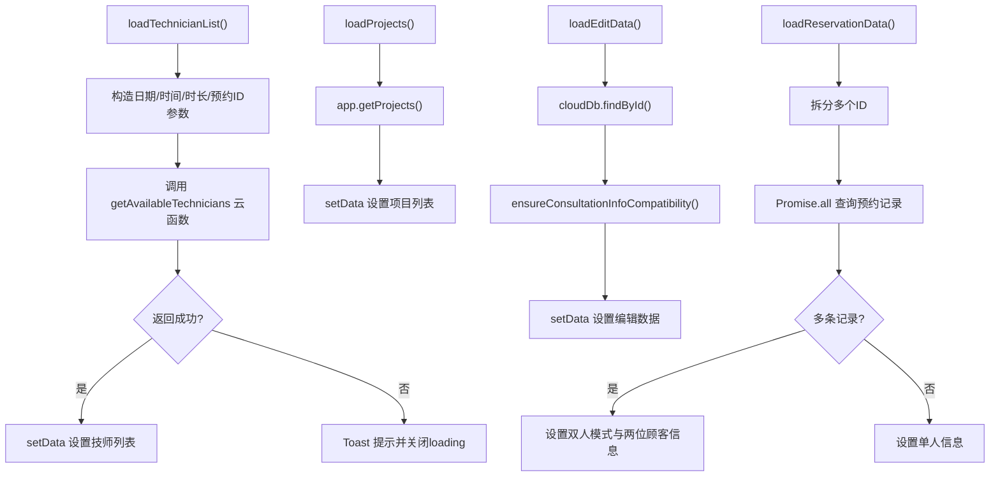

**图表来源**
- [miniprogram/pages/index/services/data-loader.service.ts](file://miniprogram/pages/index/services/data-loader.service.ts#L13-L206)

**章节来源**
- [miniprogram/pages/index/services/data-loader.service.ts](file://miniprogram/pages/index/services/data-loader.service.ts#L1-L206)

### 双人模式实现原理与用户体验
- 模式切换：启用时将当前咨询单信息复制到顾客1，清空顾客2并重置匹配状态；关闭时将顾客1信息回填至咨询单。
- 顾客标签页：左右两个标签页分别代表顾客1/2，点击切换时同步更新"专属精油仅用/需要精油"状态。
- 字段共享与禁用：在双人模式下，房间字段对顾客2为共享/禁用状态；手机号与车牌号在双人模式下对顾客2为共享/禁用状态，避免重复录入。
- 报钟：双人模式下并行保存两位顾客记录，统一生成报钟信息并推送。

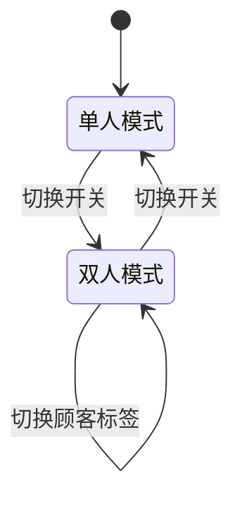

**图表来源**
- [miniprogram/pages/index/index.ts](file://miniprogram/pages/index/index.ts#L149-L196)
- [miniprogram/pages/index/index.wxml](file://miniprogram/pages/index/index.wxml#L34-L54)

**章节来源**
- [miniprogram/pages/index/index.ts](file://miniprogram/pages/index/index.ts#L149-L196)
- [miniprogram/pages/index/index.wxml](file://miniprogram/pages/index/index.wxml#L34-L54)

### 咨询单数据模型定义、字段约束与业务规则
- 咨询单信息(ConsultationInfo)：包含姓名、性别、项目、技师、房间、按摩强度、精油、加强部位、是否报钟、备注、电话、券码、券平台、日期、开始/结束时间等。
- 客户信息(GuestInfo)：与咨询单信息结构一致，但不包含结束时间等字段，用于双人模式下的独立存储。
- 业务规则：
  - 必填项：性别、项目、技师、房间
  - 精油规则：若项目为"需要精油"且非"专属精油仅用"，则必须选择精油
  - 双人模式：两位顾客的性别、项目、技师均需有效
  - 房间共享：双人模式下房间字段对顾客2为共享/禁用
  - 报钟：开始时间由用户选择，结束时间基于项目时长与准备时间计算

**章节来源**
- [miniprogram/utils/validators.ts](file://miniprogram/utils/validators.ts#L6-L72)
- [miniprogram/utils/util.ts](file://miniprogram/utils/util.ts#L96-L105)
- [miniprogram/pages/index/index.ts](file://miniprogram/pages/index/index.ts#L16-L48)

## 模块化架构设计

### CashierDataLoaderService 数据加载服务
CashierDataLoaderService是收银台模块专用的数据加载服务，负责收银台特有的数据获取和处理：

- **并行数据加载**：使用Promise.all并行获取房间状态、咨询单记录、排班表、员工列表和可用技师列表，显著提升加载性能
- **轮牌队列处理**：根据当前日期获取轮牌队列，结合员工排班、咨询单记录和预约记录计算每个技师的可用时间段
- **员工可用性计算**：通过计算技师的工作时长、预约占用和排班时间，生成详细的可用时间段列表
- **日期选择器数据**：构建日期导航所需的前后日期和今天标识

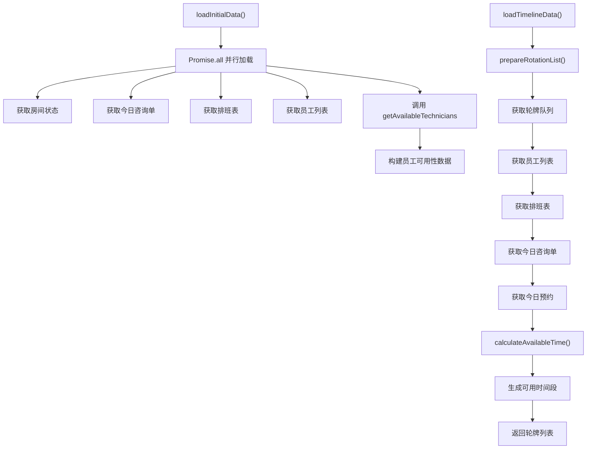

**图表来源**
- [miniprogram/pages/cashier/services/data-loader.service.ts](file://miniprogram/pages/cashier/services/data-loader.service.ts#L30-L241)

**章节来源**
- [miniprogram/pages/cashier/services/data-loader.service.ts](file://miniprogram/pages/cashier/services/data-loader.service.ts#L1-L241)

### ReservationHandler 预约处理器
ReservationHandler专门处理预约相关的完整业务流程：

- **预约创建**：支持指定技师和性别需求两种模式，自动生成结束时间并处理多技师预约
- **预约编辑**：支持编辑现有预约，包括技师变更、时间调整和性别需求修改
- **技师可用性检查**：实时检查指定时间段内技师的可用性，避免时间冲突
- **到店处理**：处理顾客到店流程，支持批量到店和单个到店
- **提前下钟**：允许在服务进行中提前结束服务
- **预约取消**：支持取消预约并发送企业微信通知

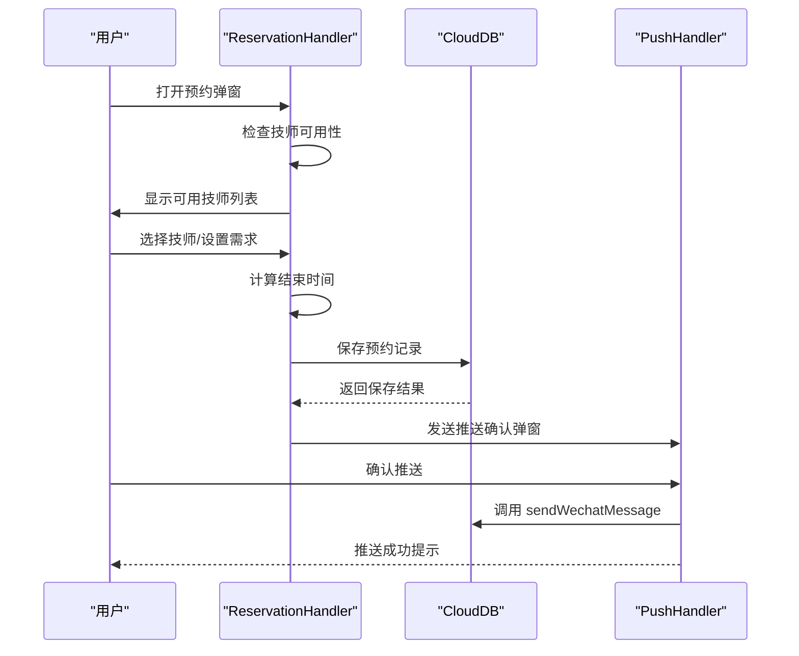

**图表来源**
- [miniprogram/pages/cashier/handlers/reservation.handler.ts](file://miniprogram/pages/cashier/handlers/reservation.handler.ts#L22-L897)
- [miniprogram/pages/cashier/handlers/push.handler.ts](file://miniprogram/pages/cashier/handlers/push.handler.ts#L47-L120)

**章节来源**
- [miniprogram/pages/cashier/handlers/reservation.handler.ts](file://miniprogram/pages/cashier/handlers/reservation.handler.ts#L1-L897)

### SettlementHandler 结算处理器
SettlementHandler负责处理咨询单的结算流程：

- **结算信息加载**：根据日期和记录ID加载咨询单详情，支持重新结算
- **支付方式管理**：支持多种支付方式（微信、支付宝、现金、美团等）和组合支付
- **会员卡扣减**：处理会员卡支付，自动检查余额并执行扣减
- **免单处理**：支持免单操作，自动清空其他支付方式
- **结算确认**：验证支付信息后执行结算操作

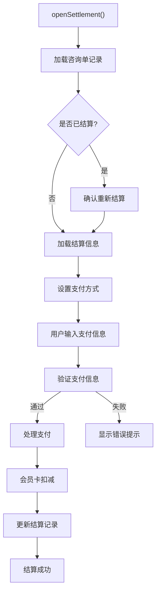

**图表来源**
- [miniprogram/pages/cashier/handlers/settlement.handler.ts](file://miniprogram/pages/cashier/handlers/settlement.handler.ts#L18-L293)

**章节来源**
- [miniprogram/pages/cashier/handlers/settlement.handler.ts](file://miniprogram/pages/cashier/handlers/settlement.handler.ts#L1-L293)

### PushHandler 推送处理器
PushHandler专门处理企业微信推送功能：

- **预约推送**：支持新预约和预约取消的推送，自动@相关技师
- **轮牌推送**：推送今日轮牌顺序到企业微信群聊
- **到店通知**：通知技师顾客已到店，包含茶点数量信息
- **变更通知**：推送预约变更详情，包括时间、项目、技师等变更
- **消息格式化**：根据不同场景生成标准的企业微信消息格式

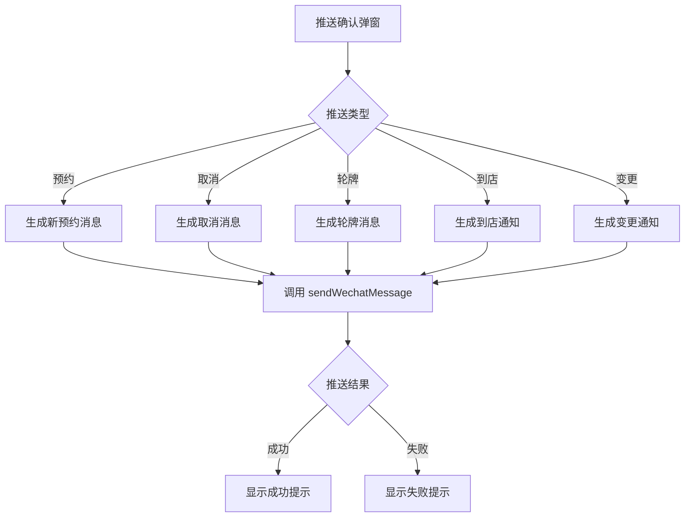

**图表来源**
- [miniprogram/pages/cashier/handlers/push.handler.ts](file://miniprogram/pages/cashier/handlers/push.handler.ts#L47-L314)

**章节来源**
- [miniprogram/pages/cashier/handlers/push.handler.ts](file://miniprogram/pages/cashier/handlers/push.handler.ts#L1-L314)

### customer-match 顾客匹配工具
customer-match工具类专门处理收银台场景下的顾客匹配：

- **智能匹配**：根据姓名、性别和手机号进行精确匹配
- **云端查询**：调用matchCustomer云函数获取匹配结果
- **信息应用**：支持将匹配到的顾客信息应用到预约表单
- **责任技师关联**：自动关联匹配顾客的责任技师并预选
- **错误处理**：优雅处理匹配失败的情况

**章节来源**
- [miniprogram/pages/cashier/utils/customer-match.ts](file://miniprogram/pages/cashier/utils/customer-match.ts#L1-L110)

## 依赖关系分析
模块化架构下的依赖关系更加清晰：

- **页面控制器依赖**：cashier.ts依赖四个专用处理器和一个数据加载服务；index.ts保持原有依赖关系
- **处理器间协作**：ReservationHandler依赖PushHandler进行推送；SettlementHandler依赖CloudDB进行数据持久化
- **服务层分离**：CashierDataLoaderService独立于通用DataLoaderService，专注于收银台特定需求
- **工具类复用**：auth.ts、permission.ts、cloud-db.ts等工具类在两个模块中均可使用

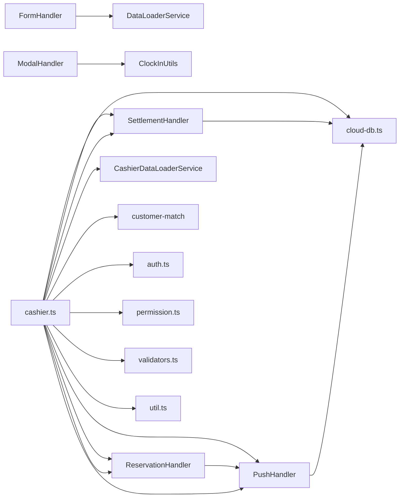

**图表来源**
- [miniprogram/pages/index/index.ts](file://miniprogram/pages/index/index.ts#L8-L13)
- [miniprogram/pages/index/handlers/form.handler.ts](file://miniprogram/pages/index/handlers/form.handler.ts#L1-L8)
- [miniprogram/pages/index/handlers/modal.handler.ts](file://miniprogram/pages/index/handlers/modal.handler.ts#L1-L3)
- [miniprogram/pages/cashier/cashier.ts](file://miniprogram/pages/cashier/cashier.ts#L7-L11)
- [miniprogram/pages/cashier/handlers/reservation.handler.ts](file://miniprogram/pages/cashier/handlers/reservation.handler.ts#L6-L8)

**章节来源**
- [miniprogram/pages/index/index.ts](file://miniprogram/pages/index/index.ts#L8-L13)
- [miniprogram/pages/index/handlers/form.handler.ts](file://miniprogram/pages/index/handlers/form.handler.ts#L1-L8)
- [miniprogram/pages/index/handlers/modal.handler.ts](file://miniprogram/pages/index/handlers/modal.handler.ts#L1-L3)
- [miniprogram/pages/cashier/cashier.ts](file://miniprogram/pages/cashier/cashier.ts#L7-L11)
- [miniprogram/pages/cashier/handlers/reservation.handler.ts](file://miniprogram/pages/cashier/handlers/reservation.handler.ts#L6-L8)

## 性能与并发特性
模块化架构提升了系统的性能和并发处理能力：

- **并行数据加载**：CashierDataLoaderService使用Promise.all并行获取多个数据源，显著提升收银台加载速度
- **并发操作处理**：ReservationHandler在预约创建时支持多技师并发创建，提高处理效率
- **云函数调用优化**：通过统一的wx.cloud.callFunction接口调用，避免前端复杂逻辑，降低客户端压力
- **加载状态管理**：使用LockKeys枚举管理不同模块的加载状态，避免重复请求与界面卡顿
- **权限控制**：通过hasButtonPermission和requirePagePermission确保只有授权用户才能访问相应功能

**章节来源**
- [miniprogram/pages/cashier/services/data-loader.service.ts](file://miniprogram/pages/cashier/services/data-loader.service.ts#L36-L50)
- [miniprogram/pages/cashier/handlers/reservation.handler.ts](file://miniprogram/pages/cashier/handlers/reservation.handler.ts#L693-L711)
- [miniprogram/pages/cashier/cashier.ts](file://miniprogram/pages/cashier/cashier.ts#L127-L130)

## 故障排查指南
模块化架构下的故障排查更加精准：

- **收银台数据加载失败**：检查CashierDataLoaderService的并行数据加载逻辑，确认各个API调用的成功状态
- **预约处理异常**：通过ReservationHandler的日志输出定位问题，检查技师可用性检查和预约保存流程
- **结算失败**：检查SettlementHandler的支付验证逻辑，确认会员卡余额和支付方式有效性
- **推送失败**：通过PushHandler的错误处理机制排查企业微信推送问题
- **权限相关问题**：检查hasButtonPermission和requirePagePermission的权限配置

**章节来源**
- [miniprogram/pages/cashier/services/data-loader.service.ts](file://miniprogram/pages/cashier/services/data-loader.service.ts#L80-L84)
- [miniprogram/pages/cashier/handlers/reservation.handler.ts](file://miniprogram/pages/cashier/handlers/reservation.handler.ts#L526-L533)
- [miniprogram/pages/cashier/handlers/settlement.handler.ts](file://miniprogram/pages/cashier/handlers/settlement.handler.ts#L286-L290)
- [miniprogram/pages/cashier/handlers/push.handler.ts](file://miniprogram/pages/cashier/handlers/push.handler.ts#L115-L120)
- [miniprogram/utils/permission.ts](file://miniprogram/utils/permission.ts#L1-L200)

## 结论
系统通过模块化架构重构，实现了咨询单管理系统的清晰职责分离和更好的可维护性。收银台模块独立出来，提供了专门的预约管理、结算处理和推送功能，与传统的咨询单页面形成互补。表单与弹窗处理器统一了交互逻辑，数据加载服务保证了数据一致性与性能，验证器与工具类确保了业务规则的可维护性与可扩展性。模块化设计使得系统更容易扩展新功能，也便于团队协作开发。

## 附录：使用示例与最佳实践

### 收银台模块使用示例
- **预约管理**
  - 打开预约弹窗后，系统自动检查技师可用性并显示可用技师列表
  - 支持指定技师和性别需求两种预约模式，系统自动计算结束时间
  - 预约成功后自动发送企业微信推送并@相关技师
- **结算处理**
  - 支持多种支付方式组合，系统自动计算实收总额
  - 会员卡支付时自动检查余额并执行扣减
  - 支持免单操作，系统自动清空其他支付方式
- **轮牌管理**
  - 支持调整轮牌顺序，系统自动更新全局数据
  - 可推送今日轮牌到企业微信群聊
  - 实时显示每个技师的可用时间段

### 最佳实践
- **模块化开发**：遵循模块化架构，每个功能模块保持独立性和可测试性
- **权限控制**：严格使用hasButtonPermission和requirePagePermission进行权限控制
- **错误处理**：在所有异步操作中使用try-catch和错误提示，确保用户体验
- **并发处理**：使用Promise.all进行并行数据加载，提升系统响应速度
- **状态管理**：通过loading和loadingText统一管理加载状态，避免界面卡顿
- **推送机制**：使用推送确认弹窗确保重要通知不会遗漏

**章节来源**
- [miniprogram/pages/cashier/cashier.ts](file://miniprogram/pages/cashier/cashier.ts#L223-L281)
- [miniprogram/pages/cashier/handlers/reservation.handler.ts](file://miniprogram/pages/cashier/handlers/reservation.handler.ts#L539-L606)
- [miniprogram/pages/cashier/handlers/settlement.handler.ts](file://miniprogram/pages/cashier/handlers/settlement.handler.ts#L192-L291)
- [miniprogram/pages/cashier/services/data-loader.service.ts](file://miniprogram/pages/cashier/services/data-loader.service.ts#L30-L85)
- [miniprogram/utils/permission.ts](file://miniprogram/utils/permission.ts#L1-L200)