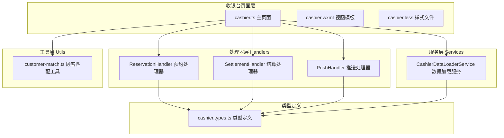
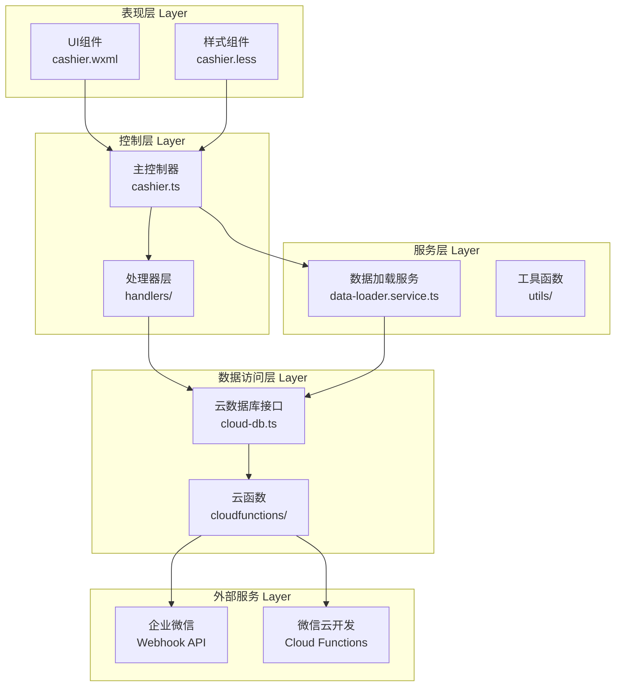
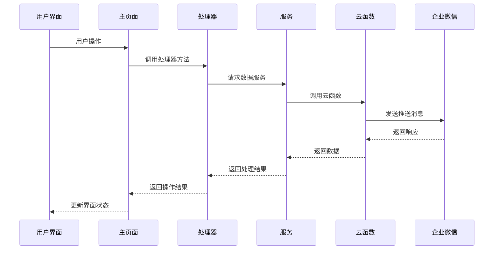
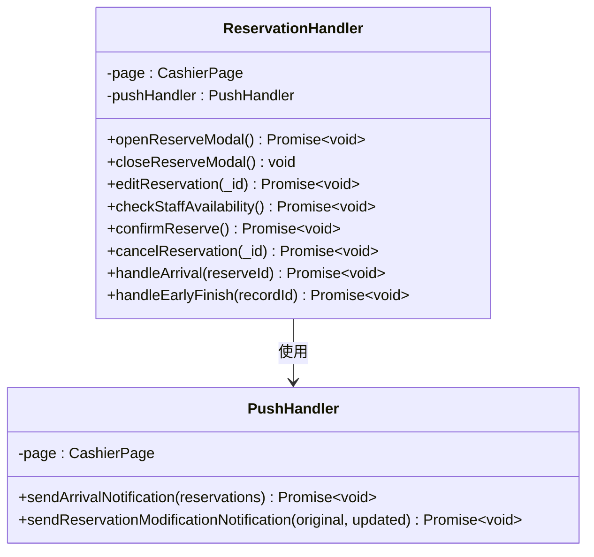
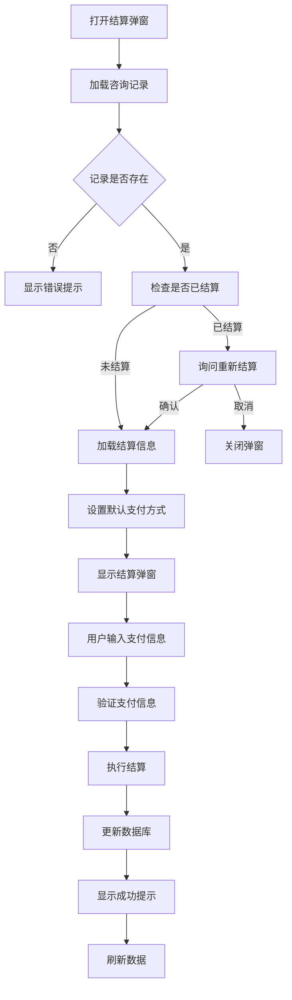
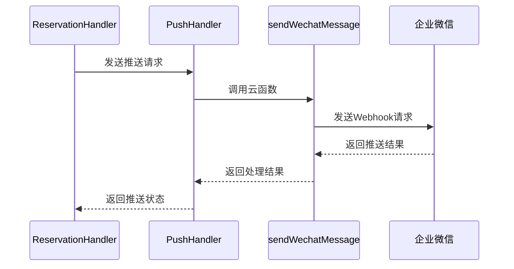
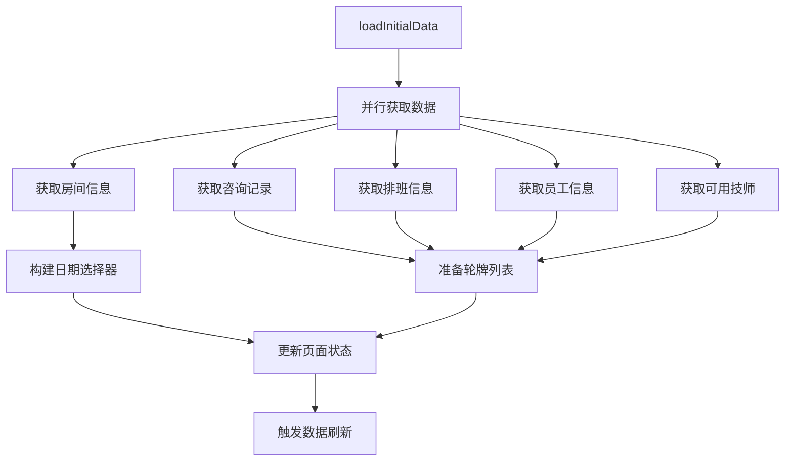
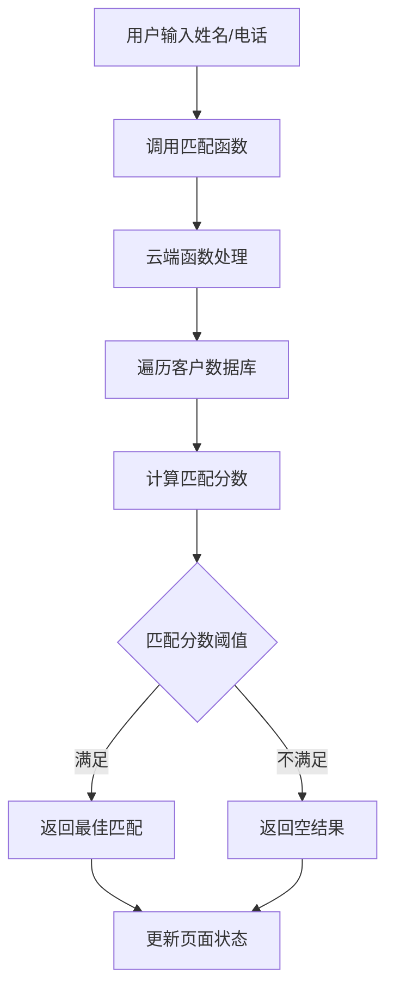
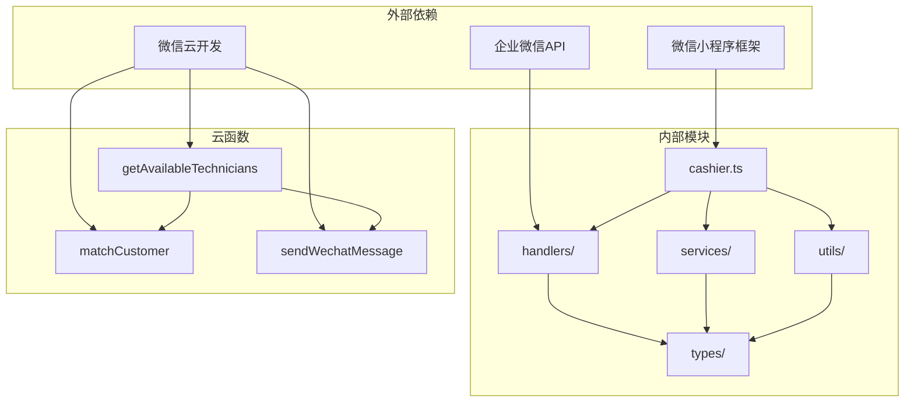

# 收银台模块化架构

<cite>
**本文档引用的文件**
- [miniprogram/pages/cashier/cashier.ts](file://miniprogram/pages/cashier/cashier.ts)
- [miniprogram/pages/cashier/cashier.wxml](file://miniprogram/pages/cashier/cashier.wxml)
- [miniprogram/pages/cashier/cashier.less](file://miniprogram/pages/cashier/cashier.less)
- [miniprogram/pages/cashier/cashier.types.ts](file://miniprogram/pages/cashier/cashier.types.ts)
- [miniprogram/pages/cashier/handlers/reservation.handler.ts](file://miniprogram/pages/cashier/handlers/reservation.handler.ts)
- [miniprogram/pages/cashier/handlers/settlement.handler.ts](file://miniprogram/pages/cashier/handlers/settlement.handler.ts)
- [miniprogram/pages/cashier/handlers/push.handler.ts](file://miniprogram/pages/cashier/handlers/push.handler.ts)
- [miniprogram/pages/cashier/services/data-loader.service.ts](file://miniprogram/pages/cashier/services/data-loader.service.ts)
- [miniprogram/pages/cashier/utils/customer-match.ts](file://miniprogram/pages/cashier/utils/customer-match.ts)
- [cloudfunctions/getAvailableTechnicians/index.js](file://cloudfunctions/getAvailableTechnicians/index.js)
- [cloudfunctions/matchCustomer/index.js](file://cloudfunctions/matchCustomer/index.js)
- [cloudfunctions/sendWechatMessage/index.js](file://cloudfunctions/sendWechatMessage/index.js)
- [miniprogram/utils/cloud-db.ts](file://miniprogram/utils/cloud-db.ts)
- [miniprogram/utils/util.ts](file://miniprogram/utils/util.ts)
- [miniprogram/app.less](file://miniprogram/app.less)
</cite>

## 更新摘要
**变更内容**
- 新增UI布局一致性增强章节，详细介绍white-space: nowrap; 属性的应用和效果
- 更新样式重构章节，补充UI布局优化的详细说明
- 扩展响应式布局优化内容，包含文本换行控制策略
- 新增按钮文本一致性改进说明
- **更新UI重构分析章节，反映大规模布局重设计、组件重组和样式优化**

## 目录
1. [简介](#简介)
2. [项目结构](#项目结构)
3. [核心组件](#核心组件)
4. [架构概览](#架构概览)
5. [UI重构分析](#ui重构分析)
6. [样式重构与界面设计](#样式重构与界面设计)
7. [UI布局一致性增强](#ui布局一致性增强)
8. [详细组件分析](#详细组件分析)
9. [依赖关系分析](#依赖关系分析)
10. [性能考虑](#性能考虑)
11. [故障排除指南](#故障排除指南)
12. [结论](#结论)

## 简介

收银台模块化架构是一个基于微信小程序开发的专业化服务管理系统，专为美容院、SPA等服务行业设计。该系统采用模块化架构设计，将复杂的业务逻辑分解为独立的功能模块，实现了高度的可维护性和扩展性。

系统主要功能包括：
- 预约管理：支持技师预约、性别需求、点钟模式等多种预约方式
- 结算管理：支持多种支付方式的组合结算
- 推送通知：自动向企业微信群发送预约和轮牌通知
- 员工排班：实时显示员工轮牌和可用时间段
- 客户匹配：智能匹配潜在客户信息

## 项目结构

收银台模块位于项目的 `miniprogram/pages/cashier` 目录下，采用清晰的分层架构：



**图表来源**
- [miniprogram/pages/cashier/cashier.ts](file://miniprogram/pages/cashier/cashier.ts#L1-L530)
- [miniprogram/pages/cashier/handlers/reservation.handler.ts](file://miniprogram/pages/cashier/handlers/reservation.handler.ts#L1-L1065)
- [miniprogram/pages/cashier/handlers/settlement.handler.ts](file://miniprogram/pages/cashier/handlers/settlement.handler.ts#L1-L293)
- [miniprogram/pages/cashier/handlers/push.handler.ts](file://miniprogram/pages/cashier/handlers/push.handler.ts#L1-L314)
- [miniprogram/pages/cashier/services/data-loader.service.ts](file://miniprogram/pages/cashier/services/data-loader.service.ts#L1-L194)

**章节来源**
- [miniprogram/pages/cashier/cashier.ts](file://miniprogram/pages/cashier/cashier.ts#L1-L530)
- [miniprogram/pages/cashier/cashier.types.ts](file://miniprogram/pages/cashier/cashier.types.ts#L1-L122)

## 核心组件

### 主页面组件

主页面 `cashier.ts` 作为整个收银台系统的入口点，负责协调各个子组件的工作。它采用了延迟初始化策略，确保只有在需要时才创建处理器实例。

主要职责包括：
- 页面生命周期管理
- 处理器实例初始化
- 用户交互事件处理
- 数据状态管理

### 处理器组件

系统实现了三个核心处理器，每个都封装了特定的业务逻辑：

1. **ReservationHandler（预约处理器）**：处理所有与预约相关的操作
2. **SettlementHandler（结算处理器）**：处理结账和支付流程
3. **PushHandler（推送处理器）**：处理企业微信推送通知

### 服务组件

**CashierDataLoaderService** 负责数据加载和缓存管理，通过并行请求优化数据加载性能。

### 工具组件

**customer-match.ts** 提供智能客户匹配功能，通过云端函数实现精确的客户信息匹配。

**章节来源**
- [miniprogram/pages/cashier/cashier.ts](file://miniprogram/pages/cashier/cashier.ts#L155-L160)
- [miniprogram/pages/cashier/handlers/reservation.handler.ts](file://miniprogram/pages/cashier/handlers/reservation.handler.ts#L15-L18)
- [miniprogram/pages/cashier/handlers/settlement.handler.ts](file://miniprogram/pages/cashier/handlers/settlement.handler.ts#L1-L13)
- [miniprogram/pages/cashier/handlers/push.handler.ts](file://miniprogram/pages/cashier/handlers/push.handler.ts#L1-L12)

## 架构概览

系统采用分层架构设计，实现了关注点分离和模块化管理：



**图表来源**
- [miniprogram/pages/cashier/cashier.ts](file://miniprogram/pages/cashier/cashier.ts#L1-L530)
- [miniprogram/utils/cloud-db.ts](file://miniprogram/utils/cloud-db.ts#L1-L321)
- [cloudfunctions/getAvailableTechnicians/index.js](file://cloudfunctions/getAvailableTechnicians/index.js#L1-L285)

### 数据流架构



**图表来源**
- [miniprogram/pages/cashier/handlers/push.handler.ts](file://miniprogram/pages/cashier/handlers/push.handler.ts#L47-L120)
- [cloudfunctions/sendWechatMessage/index.js](file://cloudfunctions/sendWechatMessage/index.js#L10-L64)

## UI重构分析

### 布局重设计

收银台界面经历了重大布局重构，从传统的垂直布局转变为现代化的网格布局系统：

#### 现代化网格系统

```css
/* 快速预约网格布局 */
.quick-reservation-grid {
    display: grid;
    grid-template-columns: repeat(2, 1fr);
    gap: 10px;
}

/* 房间状态网格布局 */
.room-grid {
    display: flex;
    flex-wrap: wrap;
    justify-content: space-between;
    gap: 8px;
}
```

#### 卡片式设计风格

```css
.section {
    background-color: @bg-color;
    border-radius: 12px;
    padding: 15px;
    margin-bottom: 15px;
    box-shadow: 0 2px 8px rgba(0, 0, 0, 0.05);
    box-sizing: border-box;
}
```

#### 响应式布局优化

系统采用了更加灵活的响应式布局设计：

- **横屏/竖屏切换**：支持动态屏幕方向切换
- **弹性网格系统**：房间状态采用flex布局的网格系统
- **自适应间距**：使用统一的间距标准（12px、15px、18px等）
- **文本换行控制**：通过 `white-space: nowrap;` 确保按钮文本不换行

### 组件重组

#### 模块化组件设计

```html
<!-- 员工排钟表 -->
<view class="section timeline-section">
    <view class="section-header">
        <view class="section-title">排钟进度</view>
        <date-picker initialDate="{{dateSelector.selectedDate}}" bind:change="onDatePickerChange" />
        <view class="reserve-btn" wx:if="{{canCreateReservation}}" bindtap="openReserveModal">
            +预约
        </view>
    </view>
    <timeline selectedDate="{{selectedDate}}" readonly="{{false}}" refreshTrigger="{{timelineRefreshTrigger}}"
        bind:blockclick="onBlockClick" />
</view>

<!-- 快速预约 -->
<view class="section quick-reservation-section">
    <view class="section-header">
        <view class="section-title">快速预约</view>
    </view>
    <view class="quick-reservation-grid">
        <!-- 四种快速预约类型 -->
        <view class="quick-reservation-slot {{quickReservationSlots.oneMale.length > 0 ? 'available' : 'unavailable'}}">
            <view class="slot-label">1位男技师</view>
            <view class="slot-time-list">
                <view class="slot-time-item" wx:for="{{quickReservationSlots.oneMale}}" wx:key="time"
                    bindtap="copyReservationSlot" data-type="oneMale" data-text="{{item.time}}">
                    <view class="slot-time-text">{{item.time}}</view>
                    <view class="slot-staff-names">{{item.staffNames}}</view>
                </view>
            </view>
        </view>
    </view>
</view>
```

#### 组件化选择器

```css
/* 组件化后的选择器项样式 */
.technician-item,
.project-item {
    align-items: flex-start !important;
    flex-direction: column;
}
```

### 样式优化

#### 现代化CSS类体系

```css
/* 项目信息展示区 */
.project-info-section {
    margin-bottom: 15px;
    padding: 12px;
    background-color: @bg-color-light;
    border-radius: 8px;
}

/* 表单布局增强 */
.form-item {
    display: flex;
    align-items: center;
    margin-bottom: 12px;
    padding-bottom: 12px;
    border-bottom: 1px solid @border-color-light;
}

/* 组合表单项 */
.combined-form-item {
    flex-wrap: wrap;
    gap: 20px;
}
```

#### 推送通知预览组件

```css
.push-preview {
    background-color: @bg-color-light;
    border: 1px solid @border-color-light;
    border-radius: 8px;
    padding: 16px;
    margin-bottom: 12px;
    position: relative;
}

.push-textarea {
    width: 100%;
    min-height: 200px;
    max-height: 400px;
    padding: 12px;
    font-size: 14px;
    line-height: 1.6;
    color: @text-color;
    background-color: @bg-color;
    border: 1px solid @border-color;
    border-radius: 4px;
    box-sizing: border-box;
    white-space: pre-wrap;
    word-break: break-all;
}

.push-tips {
    display: flex;
    align-items: center;
    gap: 6px;
    padding: 10px 12px;
    background-color: rgba(24, 144, 255, 0.08);
    border-radius: 4px;
}
```

#### 客户匹配界面改进

```css
.customer-match-result {
    background-color: rgba(255, 107, 0, 0.08);
    border: 1px solid rgba(255, 107, 0, 0.3);
    border-radius: 6px;
    padding: 12px 15px;
    margin-bottom: 12px;
}
```

**章节来源**
- [miniprogram/pages/cashier/cashier.wxml](file://miniprogram/pages/cashier/cashier.wxml#L46-L104)
- [miniprogram/pages/cashier/cashier.less](file://miniprogram/pages/cashier/cashier.less#L73-L179)
- [miniprogram/pages/cashier/cashier.less](file://miniprogram/pages/cashier/cashier.less#L382-L426)

## 样式重构与界面设计

### 现代化CSS类体系

收银台界面经历了重大样式重构，引入了更加现代化和组件化的CSS类体系：

#### 项目信息展示区（project-info-section）

```css
.project-info-section {
    margin-bottom: 15px;
    padding: 12px;
    background-color: @bg-color-light;
    border-radius: 8px;
}
```

该类专门用于展示项目相关信息，采用卡片式设计，提供清晰的信息层次结构。

#### 表单布局增强（form-item）

```css
.form-item {
    display: flex;
    align-items: center;
    margin-bottom: 12px;
    padding-bottom: 12px;
    border-bottom: 1px solid @border-color-light;
}
```

增强了表单元素的一致性和可读性，支持灵活的布局组合。

#### 组合表单项（combined-form-item）

```css
.combined-form-item {
    flex-wrap: wrap;
    gap: 20px;
}
```

支持在同一行内展示多个表单字段，提高空间利用率。

#### 推送通知预览组件

新增了专门的推送通知预览组件，提供实时的消息预览功能：

```css
.push-preview {
    background-color: @bg-color-light;
    border: 1px solid @border-color-light;
    border-radius: 8px;
    padding: 16px;
    margin-bottom: 12px;
    position: relative;
}

.push-textarea {
    width: 100%;
    min-height: 200px;
    max-height: 400px;
    padding: 12px;
    font-size: 14px;
    line-height: 1.6;
    color: @text-color;
    background-color: @bg-color;
    border: 1px solid @border-color;
    border-radius: 4px;
    box-sizing: border-box;
    white-space: pre-wrap;
    word-break: break-all;
}

.push-tips {
    display: flex;
    align-items: center;
    gap: 6px;
    padding: 10px 12px;
    background-color: rgba(24, 144, 255, 0.08);
    border-radius: 4px;
}
```

这些组件提供了直观的推送消息预览和操作提示，其中推送文本域使用 `white-space: pre-wrap;` 来保持文本格式。

### 客户匹配界面改进

客户匹配界面经过重新设计，提供了更好的用户体验：

```css
.customer-match-result {
    background-color: rgba(255, 107, 0, 0.08);
    border: 1px solid rgba(255, 107, 0, 0.3);
    border-radius: 6px;
    padding: 12px 15px;
    margin-bottom: 12px;
}
```

改进的匹配结果显示，包含应用和清除按钮，支持一键应用匹配结果。

### 响应式布局优化

系统采用了更加灵活的响应式布局设计：

- **横屏/竖屏切换**：支持动态屏幕方向切换
- **弹性网格系统**：房间状态采用flex布局的网格系统
- **自适应间距**：使用统一的间距标准（12px、15px、18px等）
- **文本换行控制**：通过 `white-space: nowrap;` 确保按钮文本不换行

**章节来源**
- [miniprogram/pages/cashier/cashier.less](file://miniprogram/pages/cashier/cashier.less#L288-L362)
- [miniprogram/pages/cashier/cashier.less](file://miniprogram/pages/cashier/cashier.less#L701-L755)
- [miniprogram/pages/cashier/cashier.wxml](file://miniprogram/pages/cashier/cashier.wxml#L108-L128)

## UI布局一致性增强

### white-space: nowrap; 属性应用策略

为了确保收银台界面的UI布局一致性，系统在多个关键位置应用了 `white-space: nowrap;` 属性，防止文本换行影响布局稳定性。

#### 按钮文本一致性

```css
.reserve-btn,
.push-rotation-btn {
    font-size: 14px;
    color: @primary-color;
    border: 1px solid @primary-color;
    padding: 4px 12px;
    border-radius: 4px;
    white-space: nowrap;
    margin-left: 8px;
}
```

这些按钮使用 `white-space: nowrap;` 确保按钮文本不会在窄屏设备上换行，保持按钮宽度的稳定性。

#### 时间槽位文本控制

```css
.slot-time-item {
    display: flex;
    align-items: center;
    justify-content: space-around;
    font-size: 11px;
    color: @text-color-secondary;
    padding: 6px 2px;
    background-color: rgba(255, 107, 0, 0.05);
    border-radius: 4px;
    transition: all 0.2s ease;
    white-space: nowrap;
    cursor: pointer;
}
```

时间槽位中的文本也应用了 `white-space: nowrap;`，确保时间格式和技师名称在同一行显示。

#### 房间状态文本控制

```css
.room-item {
    box-sizing: border-box;
    flex: 1 1 30%;
    display: flex;
    flex-direction: column;
    align-items: center;
    justify-content: center;
    padding: 12px 5px;
    border-radius: 10px;
    border: 1px solid @border-color-light;
    transition: all 0.3s ease;
    white-space: nowrap;
}
```

房间状态显示中的文本同样使用 `white-space: nowrap;`，确保房间名称和状态信息的完整显示。

#### 客户匹配结果文本控制

```css
.match-label {
    font-size: 13px;
    color: @text-color-secondary;
    font-weight: 500;
    white-space: nowrap;
}

.match-tech {
    font-size: 12px;
    color: @primary-color;
    font-weight: 500;
    white-space: nowrap;
}

.match-btn {
    padding: 4px 12px;
    border-radius: 4px;
    font-size: 13px;
    cursor: pointer;
    white-space: nowrap;
    transition: all 0.3s ease;
}
```

客户匹配结果中的标签、技师名称和按钮文本都应用了 `white-space: nowrap;`，确保匹配信息的完整性和一致性。

### 文本换行策略对比

系统采用了差异化的文本换行策略：

- **固定宽度文本**：使用 `white-space: nowrap;` 确保按钮、标签等固定宽度元素的文本不换行
- **长文本内容**：使用 `white-space: pre-wrap;` 和 `word-break: break-all;` 处理推送消息等长文本
- **标题和标签**：使用 `white-space: nowrap;` 保持标题的简洁性
- **内容区域**：使用 `white-space: normal;` 或默认行为处理正常段落文本

这种策略确保了不同类型的文本内容都能得到适当的显示效果，同时保持整体界面布局的稳定性。

**章节来源**
- [miniprogram/pages/cashier/cashier.less](file://miniprogram/pages/cashier/cashier.less#L53-L54)
- [miniprogram/pages/cashier/cashier.less](file://miniprogram/pages/cashier/cashier.less#L123-L124)
- [miniprogram/pages/cashier/cashier.less](file://miniprogram/pages/cashier/cashier.less#L200-L201)
- [miniprogram/pages/cashier/cashier.less](file://miniprogram/pages/cashier/cashier.less#L502-L503)
- [miniprogram/pages/cashier/cashier.less](file://miniprogram/pages/cashier/cashier.less#L520-L521)
- [miniprogram/pages/cashier/cashier.less](file://miniprogram/pages/cashier/cashier.less#L540-L541)
- [miniprogram/pages/cashier/cashier.less](file://miniprogram/pages/cashier/cashier.less#L818-L819)

## 详细组件分析

### 预约处理器（ReservationHandler）

预约处理器是系统中最复杂的组件之一，负责处理各种预约场景：



**图表来源**
- [miniprogram/pages/cashier/handlers/reservation.handler.ts](file://miniprogram/pages/cashier/handlers/reservation.handler.ts#L15-L18)
- [miniprogram/pages/cashier/handlers/push.handler.ts](file://miniprogram/pages/cashier/handlers/push.handler.ts#L1-L12)

#### 预约流程处理

系统支持两种主要的预约模式：

1. **点钟模式**：指定具体技师
2. **性别需求模式**：按性别要求分配技师

**章节来源**
- [miniprogram/pages/cashier/handlers/reservation.handler.ts](file://miniprogram/pages/cashier/handlers/reservation.handler.ts#L539-L606)

### 结算处理器（SettlementHandler）

结算处理器专门处理财务结算相关的所有操作：



**图表来源**
- [miniprogram/pages/cashier/handlers/settlement.handler.ts](file://miniprogram/pages/cashier/handlers/settlement.handler.ts#L18-L51)

#### 支付方式支持

系统支持多种支付方式的组合使用：
- 美团、大众点评、抖音等第三方平台
- 微信支付、支付宝
- 现金支付
- 免单、划卡支付

**章节来源**
- [miniprogram/pages/cashier/cashier.types.ts](file://miniprogram/pages/cashier/cashier.types.ts#L1-L7)
- [miniprogram/pages/cashier/handlers/settlement.handler.ts](file://miniprogram/pages/cashier/handlers/settlement.handler.ts#L111-L157)

### 推送处理器（PushHandler）

推送处理器负责与企业微信的集成，实现自动化通知功能：



**图表来源**
- [miniprogram/pages/cashier/handlers/push.handler.ts](file://miniprogram/pages/cashier/handlers/push.handler.ts#L95-L120)
- [cloudfunctions/sendWechatMessage/index.js](file://cloudfunctions/sendWechatMessage/index.js#L10-L64)

#### 推送类型

系统支持三种主要的推送类型：
1. **新预约提醒**：向相关技师发送新预约通知
2. **预约取消提醒**：通知技师预约取消信息
3. **今日轮牌**：向全体员工发送轮牌安排

**章节来源**
- [miniprogram/pages/cashier/handlers/push.handler.ts](file://miniprogram/pages/cashier/handlers/push.handler.ts#L144-L192)

### 数据加载服务（CashierDataLoaderService）

数据加载服务负责高效的数据获取和缓存管理：



**图表来源**
- [miniprogram/pages/cashier/services/data-loader.service.ts](file://miniprogram/pages/cashier/services/data-loader.service.ts#L28-L98)

#### 性能优化策略

1. **并行数据加载**：使用 `Promise.all()` 同时获取多个数据源
2. **数据缓存**：避免重复的数据请求
3. **增量更新**：只更新变化的数据部分

**章节来源**
- [miniprogram/pages/cashier/services/data-loader.service.ts](file://miniprogram/pages/cashier/services/data-loader.service.ts#L36-L50)

### 顾客匹配工具

顾客匹配工具提供智能的客户识别功能：



**图表来源**
- [miniprogram/pages/cashier/utils/customer-match.ts](file://miniprogram/pages/cashier/utils/customer-match.ts#L7-L55)

**章节来源**
- [miniprogram/pages/cashier/utils/customer-match.ts](file://miniprogram/pages/cashier/utils/customer-match.ts#L58-L110)

## 依赖关系分析

系统采用松耦合的设计原则，各组件之间的依赖关系清晰明确：



**图表来源**
- [miniprogram/pages/cashier/cashier.ts](file://miniprogram/pages/cashier/cashier.ts#L1-L12)
- [cloudfunctions/getAvailableTechnicians/index.js](file://cloudfunctions/getAvailableTechnicians/index.js#L1-L10)

### 模块间通信

系统通过以下方式实现模块间的通信：

1. **事件驱动**：用户操作触发相应的事件处理函数
2. **数据传递**：通过页面状态和参数在组件间传递数据
3. **回调机制**：异步操作完成后通过回调函数更新界面

**章节来源**
- [miniprogram/pages/cashier/cashier.ts](file://miniprogram/pages/cashier/cashier.ts#L495-L496)

## 性能考虑

### 数据加载优化

系统采用了多项性能优化策略：

1. **并行请求**：同时获取多个数据源，减少总等待时间
2. **智能缓存**：避免重复的数据请求
3. **增量更新**：只更新变化的数据部分

### 内存管理

1. **延迟初始化**：处理器实例按需创建
2. **及时清理**：操作完成后及时释放资源
3. **状态管理**：合理管理页面状态，避免内存泄漏

### 网络优化

1. **批量请求**：将相关的数据请求合并
2. **错误重试**：网络异常时自动重试
3. **超时控制**：设置合理的请求超时时间

## 故障排除指南

### 常见问题及解决方案

#### 预约冲突问题

**问题描述**：技师在同一时间段内有多个预约

**解决方法**：
1. 检查技师的可用性状态
2. 调整预约时间或技师
3. 使用性别需求模式自动分配

**章节来源**
- [miniprogram/pages/cashier/handlers/reservation.handler.ts](file://miniprogram/pages/cashier/handlers/reservation.handler.ts#L132-L197)

#### 结算失败问题

**问题描述**：会员卡余额不足导致结算失败

**解决方法**：
1. 检查会员卡剩余次数
2. 使用其他支付方式
3. 充值会员卡

**章节来源**
- [miniprogram/pages/cashier/handlers/settlement.handler.ts](file://miniprogram/pages/cashier/handlers/settlement.handler.ts#L242-L276)

#### 推送失败问题

**问题描述**：企业微信推送通知发送失败

**解决方法**：
1. 检查网络连接
2. 验证Webhook配置
3. 重试推送操作

**章节来源**
- [miniprogram/pages/cashier/handlers/push.handler.ts](file://miniprogram/pages/cashier/handlers/push.handler.ts#L115-L120)

### 调试技巧

1. **日志输出**：使用 `console.log` 输出调试信息
2. **状态检查**：定期检查页面状态和数据完整性
3. **错误捕获**：使用 try-catch 捕获异常并处理

## 结论

收银台模块化架构通过清晰的分层设计和模块化实现，成功地将复杂的业务逻辑分解为独立的功能模块。本次UI布局一致性增强进一步提升了用户体验，通过在关键位置应用 `white-space: nowrap;` 属性，确保了按钮文本、标签和状态信息的稳定显示，防止长文本换行影响布局。

### 主要优势

1. **模块化设计**：每个组件都有明确的职责和边界
2. **松耦合架构**：组件间依赖关系清晰，便于维护
3. **现代化界面**：采用组件化的CSS类体系，提供一致的视觉体验
4. **布局稳定性**：通过文本换行控制策略，确保UI布局的稳定性
5. **性能优化**：采用多种优化策略提升用户体验
6. **错误处理**：完善的错误处理机制确保系统稳定性

### 未来改进方向

1. **单元测试**：为关键组件添加单元测试
2. **监控告警**：添加系统监控和异常告警功能
3. **性能分析**：持续监控和优化系统性能
4. **功能扩展**：根据业务需求添加新的功能模块
5. **界面优化**：继续改进用户界面和交互体验
6. **响应式设计**：进一步优化不同屏幕尺寸下的显示效果

该架构为类似的服务管理系统提供了优秀的参考模板，其设计理念和实现方式值得在其他项目中借鉴和应用。