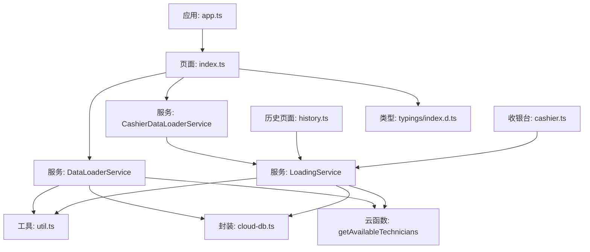
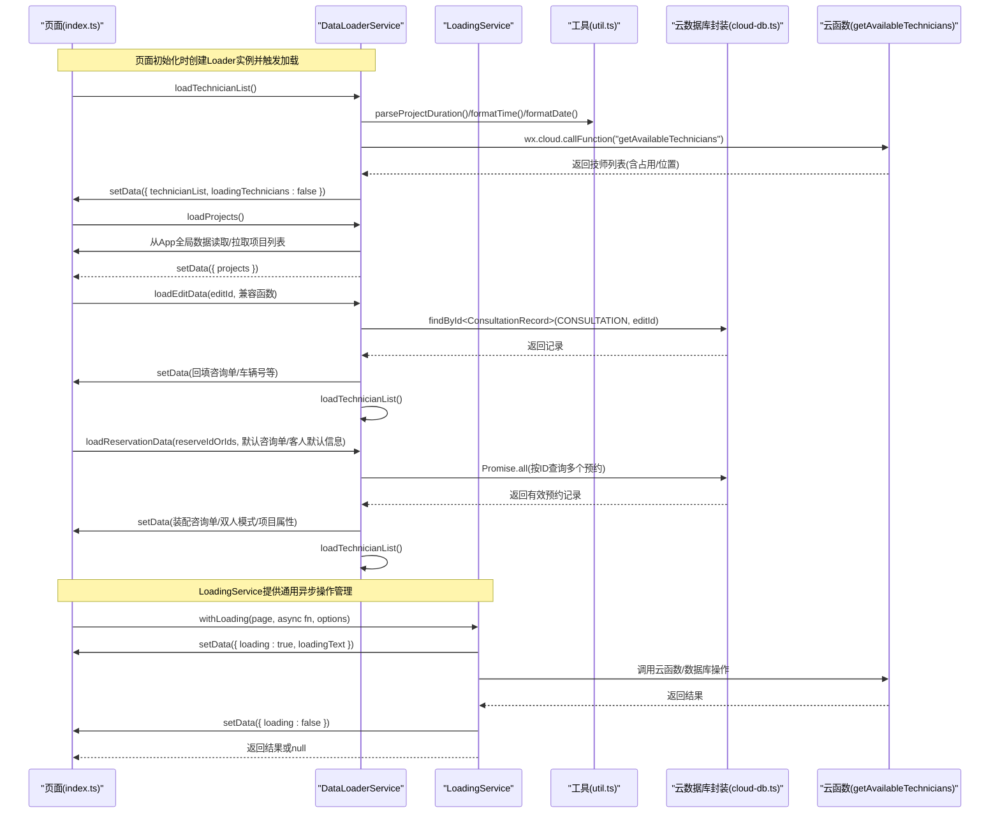
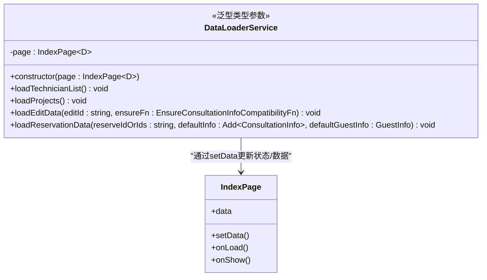
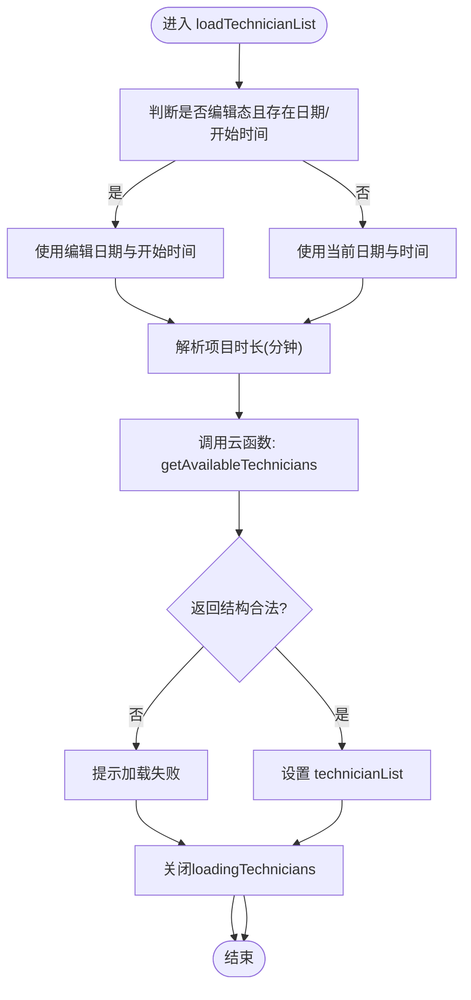
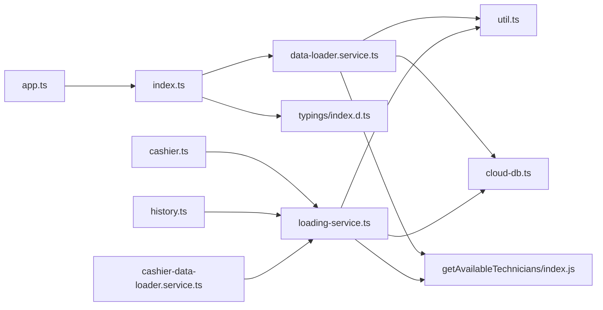

# 数据加载服务

<cite>
**本文档引用的文件**
- [data-loader.service.ts](file://miniprogram/pages/index/services/data-loader.service.ts)
- [loading-service.ts](file://miniprogram/utils/loading-service.ts)
- [index.ts](file://miniprogram/pages/index/index.ts)
- [cashier.ts](file://miniprogram/pages/cashier/cashier.ts)
- [cashier-data-loader.service.ts](file://miniprogram/pages/cashier/services/data-loader.service.ts)
- [history.ts](file://miniprogram/pages/history/history.ts)
- [cloud-db.ts](file://miniprogram/utils/cloud-db.ts)
- [util.ts](file://miniprogram/utils/util.ts)
- [index.d.ts](file://typings/index.d.ts)
- [app.ts](file://miniprogram/app.ts)
- [getAvailableTechnicians/index.js](file://cloudfunctions/getAvailableTechnicians/index.js)
</cite>

## 更新摘要
**变更内容**
- 新增通用异步操作管理服务：LoadingService类的引入
- 与现有DataLoaderService形成互补关系，提供更通用的异步操作管理能力
- 支持防重复提交、统一loading状态管理和批量异步操作执行
- 在多个页面中得到广泛应用，包括收银台、历史记录等模块

## 目录
1. [简介](#简介)
2. [项目结构](#项目结构)
3. [核心组件](#核心组件)
4. [架构总览](#架构总览)
5. [详细组件分析](#详细组件分析)
6. [依赖关系分析](#依赖关系分析)
7. [性能考虑](#性能考虑)
8. [故障排查指南](#故障排查指南)
9. [结论](#结论)
10. [附录](#附录)

## 简介
本文件面向"数据加载服务"模块，聚焦于 DataLoaderService 类的设计与实现，系统性阐述其数据获取策略、缓存机制、异步处理流程与错误处理策略，并对 loadTechnicianList、loadProjects、loadEditData、loadReservationData 等关键方法进行逐项解析。同时给出状态管理、API 文档与使用示例，帮助开发者正确使用与扩展该模块。

**更新** 本版本新增了通用异步操作管理服务LoadingService，与DataLoaderService形成互补关系，提供更强大的异步操作管理能力。

## 项目结构
数据加载服务位于页面级服务层，围绕"首页"页面进行数据装配与加载，主要涉及以下文件：
- 页面入口与状态管理：miniprogram/pages/index/index.ts
- 数据加载服务：miniprogram/pages/index/services/data-loader.service.ts
- 通用异步操作管理：miniprogram/utils/loading-service.ts
- 收银台数据加载服务：miniprogram/pages/cashier/services/data-loader.service.ts
- 历史记录页面：miniprogram/pages/history/history.ts
- 云数据库封装：miniprogram/utils/cloud-db.ts
- 工具函数：miniprogram/utils/util.ts
- 类型定义：typings/index.d.ts
- 应用全局数据加载：miniprogram/app.ts
- 后端云函数：cloudfunctions/getAvailableTechnicians/index.js



**图表来源**
- [index.ts](file://miniprogram/pages/index/index.ts#L126-L147)
- [data-loader.service.ts](file://miniprogram/pages/index/services/data-loader.service.ts#L1-L206)
- [loading-service.ts](file://miniprogram/utils/loading-service.ts#L1-L282)
- [cashier-data-loader.service.ts](file://miniprogram/pages/cashier/services/data-loader.service.ts#L1-L241)
- [history.ts](file://miniprogram/pages/history/history.ts#L120-L192)
- [cloud-db.ts](file://miniprogram/utils/cloud-db.ts#L69-L103)
- [util.ts](file://miniprogram/utils/util.ts#L14-L17)
- [getAvailableTechnicians/index.js](file://cloudfunctions/getAvailableTechnicians/index.js#L9-L124)

**章节来源**
- [index.ts](file://miniprogram/pages/index/index.ts#L126-L147)
- [data-loader.service.ts](file://miniprogram/pages/index/services/data-loader.service.ts#L1-L206)
- [loading-service.ts](file://miniprogram/utils/loading-service.ts#L1-L282)
- [cashier-data-loader.service.ts](file://miniprogram/pages/cashier/services/data-loader.service.ts#L1-L241)
- [history.ts](file://miniprogram/pages/history/history.ts#L120-L192)
- [cloud-db.ts](file://miniprogram/utils/cloud-db.ts#L1-L321)
- [util.ts](file://miniprogram/utils/util.ts#L1-L150)
- [index.d.ts](file://typings/index.d.ts#L1-L435)
- [app.ts](file://miniprogram/app.ts#L40-L66)

## 核心组件
DataLoaderService 是页面的数据加载中枢，负责：
- 获取可用技师列表（结合项目时长、当前预约/咨询占用情况）
- 加载全局项目列表
- 编辑场景下按记录ID回填表单并联动加载可用技师
- 预约场景下按一个或多个预约ID装配咨询单信息并联动加载可用技师
- 统一的状态管理与错误提示

**更新** 新增LoadingService通用异步操作管理服务，提供防重复提交、统一loading状态管理和批量异步操作执行能力。

关键特性
- 异步加载：所有加载方法均采用 async/await，避免阻塞 UI
- 状态控制：通过页面 data 的 loading、loadingText、loadingTechnicians 控制加载态与提示
- 参数兼容：针对编辑与预约两种场景，统一参数与数据结构
- 错误兜底：网络异常、数据格式错误、业务错误均有明确提示与降级处理
- 类型安全：使用泛型和严格类型定义确保编译时类型检查
- 防重复提交：LoadingService提供锁机制，防止同一操作重复执行
- 批量操作：支持并行和串行批量异步操作执行

**章节来源**
- [data-loader.service.ts](file://miniprogram/pages/index/services/data-loader.service.ts#L6-L125)
- [loading-service.ts](file://miniprogram/utils/loading-service.ts#L34-L243)
- [index.ts](file://miniprogram/pages/index/index.ts#L75-L147)

## 架构总览
DataLoaderService 与LoadingService、页面、工具、云数据库、云函数之间的交互如下：



**图表来源**
- [index.ts](file://miniprogram/pages/index/index.ts#L126-L147)
- [data-loader.service.ts](file://miniprogram/pages/index/services/data-loader.service.ts#L13-L205)
- [loading-service.ts](file://miniprogram/utils/loading-service.ts#L80-L141)
- [util.ts](file://miniprogram/utils/util.ts#L14-L17)
- [cloud-db.ts](file://miniprogram/utils/cloud-db.ts#L93-L103)
- [getAvailableTechnicians/index.js](file://cloudfunctions/getAvailableTechnicians/index.js#L9-L124)

## 详细组件分析

### DataLoaderService 类设计
职责边界
- 仅负责数据加载与装配，不直接操作业务逻辑（如保存、打印），避免耦合
- 通过页面 setData 进行状态与数据更新，保持 UI 与数据的解耦
- 对外暴露方法：loadTechnicianList、loadProjects、loadEditData、loadReservationData

设计要点
- 构造函数注入页面实例，便于统一状态管理
- 方法内部严格 try/catch，确保 UI 不被异常中断
- 对云函数返回结构进行强校验，避免"假成功"导致的 UI 异常
- 使用严格类型定义确保编译时类型检查



**图表来源**
- [data-loader.service.ts](file://miniprogram/pages/index/services/data-loader.service.ts#L6-L125)
- [index.ts](file://miniprogram/pages/index/index.ts#L75-L147)

**章节来源**
- [data-loader.service.ts](file://miniprogram/pages/index/services/data-loader.service.ts#L6-L125)
- [index.ts](file://miniprogram/pages/index/index.ts#L75-L147)

### LoadingService 类设计
**更新** 新增LoadingService通用异步操作管理服务，提供防重复提交、统一loading状态管理和批量异步操作执行能力。

职责边界
- 提供统一的异步操作包装器，自动处理loading状态
- 防重复提交机制，通过锁键防止同一操作重复执行
- 支持成功和失败的toast提示
- 提供批量异步操作执行能力

关键特性
- 防重复提交：通过Map存储锁状态，防止同一操作重复执行
- 统一loading管理：自动显示和隐藏loading状态
- 成功失败提示：可配置的成功和失败toast提示
- 批量操作：支持并行和串行批量异步操作执行
- 锁管理：提供锁的获取、释放和清理功能

```mermaid
classDiagram
class LoadingService {
<<通用异步操作管理>>
-private locks : Map~string, boolean~
-private lockCounter : number
+isLocked(lockKey : string) boolean
+acquireLock(lockKey : string) boolean
+releaseLock(lockKey : string) void
+generateLockKey() string
+withLoading~T~(page : PageWithLoading, fn : () => Promise~T~, options : LoadingOptions) Promise~T | null~
+withLock~T~(lockKey : string, fn : () => Promise~T~, onLocked? : () => void) Promise~T | null~
+withLoadingBatch~T~(page : PageWithLoading, tasks : () => Promise[]T~~, options : LoadingOptions & { parallel? : boolean }) Promise~T | null[]~
+clearAllLocks() void
}
class PageWithLoading {
+data : { loading : boolean, loadingText : string }
+setData(data : Partial~{ loading : boolean, loadingText : string }~) void
}
class LoadingOptions {
+loadingText? : string
+successText? : string
+errorText? : string
+showSuccessToast? : boolean
+showErrorToast? : boolean
+lockKey? : string
}
LoadingService --> PageWithLoading : "管理loading状态"
LoadingService --> LoadingOptions : "配置选项"
```

**图表来源**
- [loading-service.ts](file://miniprogram/utils/loading-service.ts#L34-L243)
- [loading-service.ts](file://miniprogram/utils/loading-service.ts#L6-L24)

**章节来源**
- [loading-service.ts](file://miniprogram/utils/loading-service.ts#L34-L243)

### 方法一：loadTechnicianList（可用技师列表）
功能概述
- 根据当前日期与时间、项目时长、当前预约ID列表、编辑中的咨询单ID，调用云函数获取可用技师列表
- 将结果写入页面数据，并关闭加载态

关键流程
- 日期与时间推导：若处于编辑态且存在咨询日期与开始时间，则以编辑信息为准；否则使用当前时间
- 项目时长解析：从项目名称中提取时长（分钟），默认 60 分钟
- 云函数参数：date、currentTime、projectDuration、currentReservationIds、currentConsultationId
- 结果处理：校验返回结构，成功则设置 technicianList，失败则提示并关闭加载态



**图表来源**
- [data-loader.service.ts](file://miniprogram/pages/index/services/data-loader.service.ts#L13-L65)
- [util.ts](file://miniprogram/utils/util.ts#L14-L17)
- [getAvailableTechnicians/index.js](file://cloudfunctions/getAvailableTechnicians/index.js#L9-L124)

**章节来源**
- [data-loader.service.ts](file://miniprogram/pages/index/services/data-loader.service.ts#L13-L65)
- [util.ts](file://miniprogram/utils/util.ts#L14-L17)
- [getAvailableTechnicians/index.js](file://cloudfunctions/getAvailableTechnicians/index.js#L9-L124)

### 方法二：loadProjects（项目列表）
功能概述
- 从应用全局数据中获取项目列表，若未加载则等待全局数据加载完成
- 将项目列表写入页面数据

注意
- 项目列表属于全局静态资源，建议在 App 层一次性加载并缓存，避免重复请求
- 若 App 未加载完成，loadProjects 会等待全局加载 Promise

**章节来源**
- [data-loader.service.ts](file://miniprogram/pages/index/services/data-loader.service.ts#L67-L74)
- [app.ts](file://miniprogram/app.ts#L40-L66)

### 方法三：loadEditData（编辑场景数据回填）
功能概述
- 根据 editId 查询咨询记录，回填至页面咨询单字段
- 根据所选项目设置"仅精油/需要精油"等项目属性
- 可选地拆分车牌号为固定长度数组，便于输入控件渲染
- 回填完成后联动加载可用技师列表

关键点
- 兼容函数 ensureConsultationInfoCompatibility：保证回填后的字段完整性
- 车牌号处理：区分新能源车与普通车，填充固定长度数组
- 未找到记录时提示"编辑记录不存在"
- 使用 `ConsultationRecord` 泛型类型确保数据结构一致性

**章节来源**
- [data-loader.service.ts](file://miniprogram/pages/index/services/data-loader.service.ts#L76-L126)
- [index.ts](file://miniprogram/pages/index/index.ts#L50-L71)

### 方法四：loadReservationData（预约场景数据装配）
功能概述
- 支持单个或多个预约ID，批量查询并装配咨询单
- 双人模式：当存在两个有效预约时，分别装配 guest1Info/guest2Info，并设置 isDualMode 与 activeGuest
- 项目属性：根据项目设置 currentProjectIsEssentialOilOnly 与 currentProjectNeedEssentialOil
- 回填完成后联动加载可用技师列表

关键点
- 多ID拆分与并行查询：Promise.all 并行获取多个预约
- 有效记录过滤：过滤 null，确保后续装配安全
- 双人模式装配：合理合并默认信息与预约信息
- 使用 `ReservationRecord` 泛型类型确保数据结构一致性

**章节来源**
- [data-loader.service.ts](file://miniprogram/pages/index/services/data-loader.service.ts#L128-L204)
- [index.ts](file://miniprogram/pages/index/index.ts#L149-L207)

### 数据获取策略与缓存机制
- 全局数据缓存：App 在启动时一次性拉取 projects、rooms、essentialOils、staffs，并标记 isDataLoaded，后续 loadProjects/loadRooms/getStaffs 等直接返回缓存
- 云数据库封装：CloudDatabase 提供 getAll/findById 等方法，内部对返回结构进行校验与降级
- 本地状态缓存：页面 data 中的 loading/loadingText/loadingTechnicians 作为 UI 缓存，避免重复请求与闪烁
- **更新** LoadingService提供统一的锁机制，防止重复操作执行

**章节来源**
- [app.ts](file://miniprogram/app.ts#L40-L66)
- [cloud-db.ts](file://miniprogram/utils/cloud-db.ts#L69-L103)
- [index.ts](file://miniprogram/pages/index/index.ts#L75-L115)
- [loading-service.ts](file://miniprogram/utils/loading-service.ts#L34-L72)

### 异步处理与并发优化
- 并行加载：loadReservationData 使用 Promise.all 并行查询多个预约
- 全局数据加载：App.loadGlobalData 返回 Promise，避免重复并发
- 云函数调用：getAvailableTechnicians 内部聚合多表查询，减少前端多次往返
- **更新** LoadingService支持批量异步操作执行，包括并行和串行两种模式

**章节来源**
- [data-loader.service.ts](file://miniprogram/pages/index/services/data-loader.service.ts#L137-L139)
- [app.ts](file://miniprogram/app.ts#L40-L66)
- [getAvailableTechnicians/index.js](file://cloudfunctions/getAvailableTechnicians/index.js#L26-L63)
- [loading-service.ts](file://miniprogram/utils/loading-service.ts#L171-L235)

### 错误处理机制
- 网络异常：wx.cloud.callFunction 或云数据库查询异常时，返回空或降级数据，UI 保持稳定
- 数据格式错误：对云函数返回结构进行严格校验（code/data/message），非法结构统一提示
- 业务逻辑错误：如编辑记录不存在、预约无效等，给出明确提示并终止流程
- UI 降级：无论何种错误，均关闭 loading/loadingTechnicians，避免 UI 卡死
- **更新** LoadingService提供统一的错误处理和toast提示机制

**章节来源**
- [data-loader.service.ts](file://miniprogram/pages/index/services/data-loader.service.ts#L44-L64)
- [cloud-db.ts](file://miniprogram/utils/cloud-db.ts#L76-L87)
- [index.ts](file://miniprogram/pages/index/index.ts#L113-L117)
- [loading-service.ts](file://miniprogram/utils/loading-service.ts#L117-L131)

### 数据去重与增量更新
- 去重策略：loadTechnicianList 在计算冲突时，排除当前编辑中的咨询单ID与当前预约ID列表，避免自冲突
- 增量更新：loadReservationData 仅在有效记录存在时更新页面数据，避免覆盖已有状态
- 项目属性：根据项目字段动态设置 currentProjectIsEssentialOilOnly/currentProjectNeedEssentialOil，确保 UI 与业务一致
- **更新** LoadingService提供防重复提交机制，通过锁键避免同一操作重复执行

**章节来源**
- [data-loader.service.ts](file://miniprogram/pages/index/services/data-loader.service.ts#L39-L41)
- [data-loader.service.ts](file://miniprogram/pages/index/services/data-loader.service.ts#L136-L140)
- [index.ts](file://miniprogram/pages/index/index.ts#L178-L196)
- [loading-service.ts](file://miniprogram/utils/loading-service.ts#L88-L92)

### 状态管理机制
- loading/loadingText：全局加载态与提示文案，适用于 loadEditData/loadReservationData
- loadingTechnicians：仅针对可用技师列表的加载态，避免与其他加载冲突
- 页面生命周期：onShow/onLoad 中触发 loadTechnicianList，确保进入页面即刷新可用技师
- **更新** LoadingService提供统一的loading状态管理，自动处理显示和隐藏

**章节来源**
- [index.ts](file://miniprogram/pages/index/index.ts#L75-L123)
- [data-loader.service.ts](file://miniprogram/pages/index/services/data-loader.service.ts#L29-L29)
- [loading-service.ts](file://miniprogram/utils/loading-service.ts#L99-L134)

## 依赖关系分析
- 页面依赖：index.ts 创建 DataLoaderService 实例，并在 onLoad/onShow 中触发加载
- 工具依赖：util.ts 提供时间/时长解析，影响可用技师计算
- 数据依赖：cloud-db.ts 提供统一的云数据库访问，封装 getAll/findById 等
- 云函数依赖：getAvailableTechnicians 聚合预约、排班、轮牌、咨询单等多源数据，输出可用技师列表
- **更新** LoadingService作为通用服务，被多个页面和服务广泛使用



**图表来源**
- [index.ts](file://miniprogram/pages/index/index.ts#L126-L147)
- [data-loader.service.ts](file://miniprogram/pages/index/services/data-loader.service.ts#L1-L206)
- [loading-service.ts](file://miniprogram/utils/loading-service.ts#L1-L282)
- [cashier.ts](file://miniprogram/pages/cashier/cashier.ts#L1-L200)
- [history.ts](file://miniprogram/pages/history/history.ts#L120-L192)
- [cashier-data-loader.service.ts](file://miniprogram/pages/cashier/services/data-loader.service.ts#L1-L241)
- [util.ts](file://miniprogram/utils/util.ts#L1-L150)
- [cloud-db.ts](file://miniprogram/utils/cloud-db.ts#L1-L321)
- [getAvailableTechnicians/index.js](file://cloudfunctions/getAvailableTechnicians/index.js#L1-L285)
- [app.ts](file://miniprogram/app.ts#L40-L66)
- [index.d.ts](file://typings/index.d.ts#L1-L435)

**章节来源**
- [index.ts](file://miniprogram/pages/index/index.ts#L126-L147)
- [data-loader.service.ts](file://miniprogram/pages/index/services/data-loader.service.ts#L1-L206)
- [loading-service.ts](file://miniprogram/utils/loading-service.ts#L1-L282)
- [cashier.ts](file://miniprogram/pages/cashier/cashier.ts#L1-L200)
- [history.ts](file://miniprogram/pages/history/history.ts#L120-L192)
- [cashier-data-loader.service.ts](file://miniprogram/pages/cashier/services/data-loader.service.ts#L1-L241)
- [cloud-db.ts](file://miniprogram/utils/cloud-db.ts#L1-L321)
- [util.ts](file://miniprogram/utils/util.ts#L1-L150)
- [getAvailableTechnicians/index.js](file://cloudfunctions/getAvailableTechnicians/index.js#L1-L285)
- [app.ts](file://miniprogram/app.ts#L40-L66)
- [index.d.ts](file://typings/index.d.ts#L1-L435)

## 性能考虑
- 并行查询：loadReservationData 使用 Promise.all 并行获取多个预约，缩短首屏等待
- 全局缓存：App 一次性拉取全局静态数据，避免重复请求
- 云函数聚合：getAvailableTechnicians 内部聚合多表查询，减少前端往返
- UI 稳定：统一的错误处理与状态关闭，避免 UI 卡顿与闪烁
- **更新** LoadingService提供防重复提交机制，避免重复操作造成的性能浪费
- **更新** 批量异步操作支持并行执行，提高整体响应速度

## 故障排查指南
常见问题与定位
- 加载失败：检查云函数返回结构是否包含 code/data/message；确认 wx.cloud.callFunction 调用是否抛错
- 无可用技师：确认项目时长解析是否正确；核对 currentReservationIds/currentConsultationId 是否排除了自身
- 编辑记录不存在：确认 editId 是否有效；确认 CONSULTATION 集合中是否存在该记录
- 预约装配异常：确认 reserveIdOrIds 格式；检查 Promise.all 的结果是否全部为有效记录
- 类型错误：检查泛型参数是否正确；确认数据结构是否符合接口定义
- **更新** LoadingService锁机制：检查lockKey是否正确；确认是否有重复操作正在执行
- **更新** 批量操作失败：检查tasks数组中的每个异步函数是否正确实现

**章节来源**
- [data-loader.service.ts](file://miniprogram/pages/index/services/data-loader.service.ts#L44-L64)
- [cloud-db.ts](file://miniprogram/utils/cloud-db.ts#L93-L103)
- [getAvailableTechnicians/index.js](file://cloudfunctions/getAvailableTechnicians/index.js#L16-L21)
- [loading-service.ts](file://miniprogram/utils/loading-service.ts#L88-L92)

## 结论
DataLoaderService 以清晰的职责划分与稳健的错误处理，实现了页面所需的核心数据加载能力。通过全局缓存、并行查询与云函数聚合，兼顾了性能与可维护性。**更新** 新增的LoadingService通用异步操作管理服务，进一步增强了系统的异步操作管理能力，提供了防重复提交、统一loading状态管理和批量异步操作执行等功能。建议在扩展新场景时，优先考虑使用LoadingService进行异步操作管理，遵循现有模式：统一状态管理、严格参数校验、明确错误提示与降级策略，并充分利用LoadingService的防重复提交和批量操作能力。

## 附录

### API 文档

#### DataLoaderService 类

- 构造函数
  - 参数
    - page: 页面实例（承载 setData 与数据状态）
  - 行为：保存页面实例，供后续 setData 使用
  - 类型：`constructor(page: IndexPage<D>)`

- loadTechnicianList()
  - 输入：无（内部读取页面 data 中的 editId、consultationInfo、currentReservationIds 等）
  - 行为：计算目标日期与时间、解析项目时长、调用云函数获取可用技师列表、更新页面数据
  - 输出：页面数据更新 technicianList，关闭 loadingTechnicians
  - 异常：网络/格式错误时提示并关闭 loadingTechnicians
  - 类型：`async loadTechnicianList(): Promise<void>`

- loadProjects()
  - 输入：无
  - 行为：从 App 全局数据获取项目列表，写入页面 data
  - 输出：页面数据更新 projects
  - 类型：`async loadProjects(): Promise<void>`

- loadEditData(editId: string, ensureConsultationInfoCompatibilityFn)
  - 输入：
    - editId: 咨询记录ID
    - ensureConsultationInfoCompatibilityFn: 兼容函数，保证回填字段完整性
  - 行为：查询咨询记录，回填咨询单、项目属性、车牌号拆分等，随后联动加载可用技师
  - 输出：页面数据更新多项字段，关闭 loading
  - 类型：`async loadEditData(editId: string, ensureConsultationInfoCompatibility: EnsureConsultationInfoCompatibilityFn): Promise<void>`

- loadReservationData(reserveIdOrIds: string, defaultConsultationInfo, defaultGuestInfo)
  - 输入：
    - reserveIdOrIds: 单个或逗号分隔的多个预约ID
    - defaultConsultationInfo/defaultGuestInfo: 默认咨询单/客人信息
  - 行为：并行查询多个预约，装配咨询单与双人模式信息，设置项目属性，随后联动加载可用技师
  - 输出：页面数据更新多项字段，关闭 loading
  - 类型：`async loadReservationData(reserveIdOrIds: string, DefaultConsultationInfo: Add<ConsultationInfo>, DefaultGuestInfo: GuestInfo): Promise<void>`

#### LoadingService 类

- 构造函数
  - 行为：初始化锁映射和锁计数器
  - 类型：`constructor()`

- isLocked(lockKey: string): boolean
  - 行为：检查指定锁是否已被占用
  - 类型：`isLocked(lockKey: string): boolean`

- acquireLock(lockKey: string): boolean
  - 行为：获取锁，如果已被占用则返回false
  - 类型：`acquireLock(lockKey: string): boolean`

- releaseLock(lockKey: string): void
  - 行为：释放指定锁
  - 类型：`releaseLock(lockKey: string): void`

- generateLockKey(): string
  - 行为：生成唯一的锁键
  - 类型：`generateLockKey(): string`

- withLoading<T>(page: PageWithLoading, fn: () => Promise<T>, options?: LoadingOptions): Promise<T | null>
  - 行为：包装异步函数，自动处理loading状态和防重复提交
  - 类型：`async withLoading<T>(page: PageWithLoading, fn: () => Promise<T>, options?: LoadingOptions): Promise<T | null>`

- withLock<T>(lockKey: string, fn: () => Promise<T>, onLocked?: () => void): Promise<T | null>
  - 行为：带锁的操作执行器（不显示loading UI）
  - 类型：`async withLock<T>(lockKey: string, fn: () => Promise<T>, onLocked?: () => void): Promise<T | null>`

- withLoadingBatch<T>(page: PageWithLoading, tasks: Array<() => Promise<T>>, options?: LoadingOptions & { parallel?: boolean }): Promise<Array<T | null>>
  - 行为：批量执行异步操作（带loading）
  - 类型：`async withLoadingBatch<T>(page: PageWithLoading, tasks: Array<() => Promise<T>>, options?: LoadingOptions & { parallel?: boolean }): Promise<Array<T | null>>`

- clearAllLocks(): void
  - 行为：清除所有锁（用于页面卸载时清理）
  - 类型：`clearAllLocks(): void`

#### LockKeys 常量

- LOAD_CASHIER_DATA: 'cashier:loadData'
- REFRESH_ROTATION: 'cashier:refreshRotation'
- ADJUST_ROTATION: 'cashier:adjustRotation'
- SAVE_RESERVATION: 'cashier:saveReservation'
- CANCEL_RESERVATION: 'cashier:cancelReservation'
- SETTLEMENT: 'cashier:settlement'
- PUSH_ROTATION: 'cashier:pushRotation'
- LOAD_HISTORY: 'history:loadData'
- VOID_CONSULTATION: 'history:void'
- DELETE_CONSULTATION: 'history:delete'
- EARLY_FINISH: 'history:earlyFinish'
- EXTRA_TIME: 'history:extraTime'
- GENERATE_SUMMARY: 'history:generateSummary'
- PUSH_SUMMARY: 'history:pushSummary'
- LOAD_INDEX_DATA: 'index:loadData'
- SAVE_CONSULTATION: 'index:save'
- CLOCK_IN: 'index:clockIn'
- SEARCH_CUSTOMER: 'index:searchCustomer'
- LOAD_ANALYTICS: 'analytics:loadData'
- SAVE_MEMBERSHIP: 'membership:save'
- TOGGLE_MEMBERSHIP_STATUS: 'membership:toggleStatus'
- DELETE_MEMBERSHIP: 'membership:delete'

**章节来源**
- [data-loader.service.ts](file://miniprogram/pages/index/services/data-loader.service.ts#L9-L125)
- [loading-service.ts](file://miniprogram/utils/loading-service.ts#L34-L282)
- [index.ts](file://miniprogram/pages/index/index.ts#L75-L147)

### 使用示例（步骤说明）

#### DataLoaderService 使用示例
- 初始化
  - 在页面 onLoad 中创建 DataLoaderService 实例，并调用 loadTechnicianList 与 loadProjects
  - 如存在 editId 或 reserveIds，再调用对应加载方法
- 编辑场景
  - 调用 loadEditData(editId, ensureConsultationInfoCompatibility)，随后自动刷新可用技师
- 预约场景
  - 调用 loadReservationData(ids, 默认咨询单, 默认客人信息)，随后自动刷新可用技师
- 状态控制
  - 通过页面 data.loading/loadingText/loadingTechnicians 控制加载态与提示

#### LoadingService 使用示例
- 基本异步操作包装
  ```typescript
  await loadingService.withLoading(this, async () => {
    // 执行异步操作
    const result = await someAsyncOperation();
    return result;
  }, {
    loadingText: '加载中...',
    lockKey: LockKeys.LOAD_CASHIER_DATA,
    errorText: '加载失败'
  });
  ```
- 批量异步操作执行
  ```typescript
  const results = await loadingService.withLoadingBatch(this, [
    () => loadUserData(),
    () => loadSettings(),
    () => loadPreferences()
  ], {
    loadingText: '加载中...',
    parallel: true
  });
  ```
- 防重复提交操作
  ```typescript
  await loadingService.withLock(LockKeys.SAVE_RESERVATION, async () => {
    // 保存预约的异步操作
    await saveReservation();
  }, () => {
    // 重复操作时的回调
    wx.showToast({
      title: '操作已在进行中...',
      icon: 'none'
    });
  });
  ```

**章节来源**
- [index.ts](file://miniprogram/pages/index/index.ts#L126-L147)
- [data-loader.service.ts](file://miniprogram/pages/index/services/data-loader.service.ts#L13-L205)
- [loading-service.ts](file://miniprogram/utils/loading-service.ts#L80-L235)
- [cashier.ts](file://miniprogram/pages/cashier/cashier.ts#L176-L192)
- [history.ts](file://miniprogram/pages/history/history.ts#L123-L192)