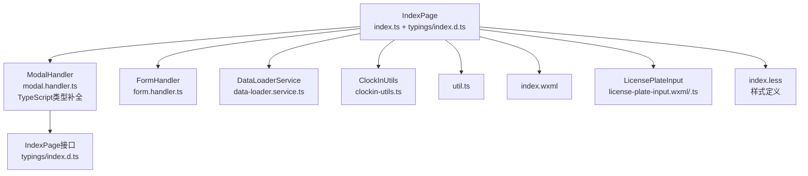
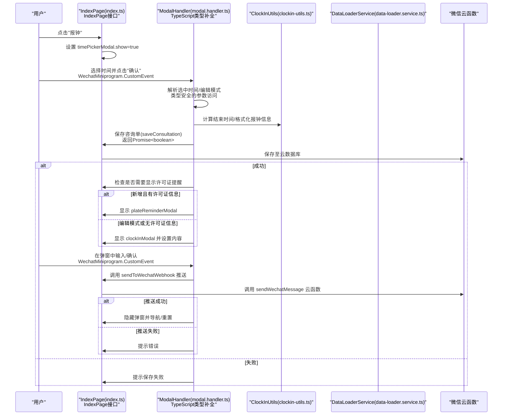
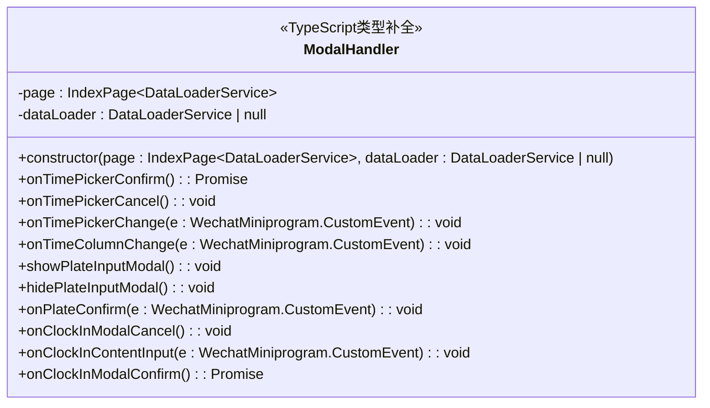
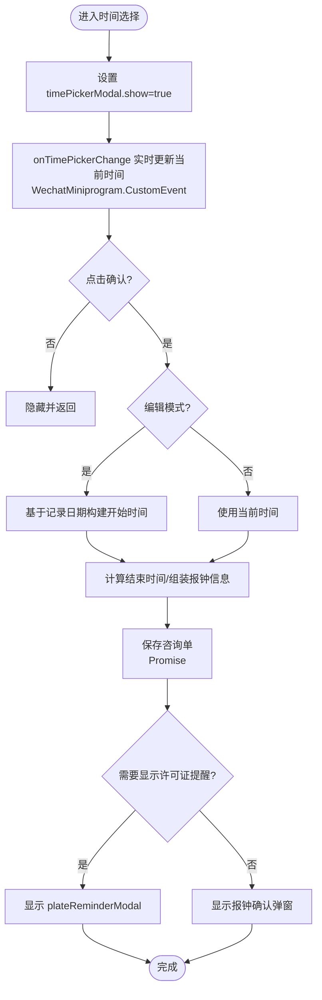
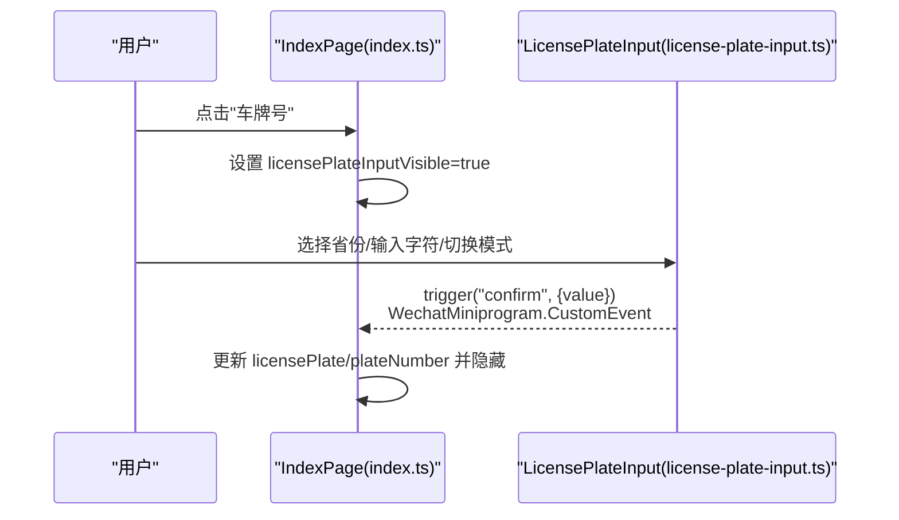
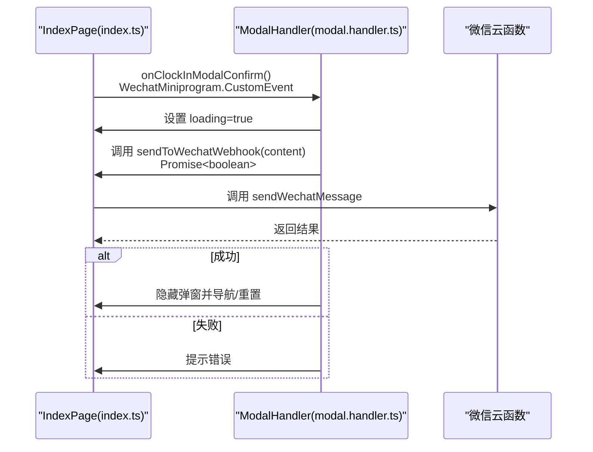
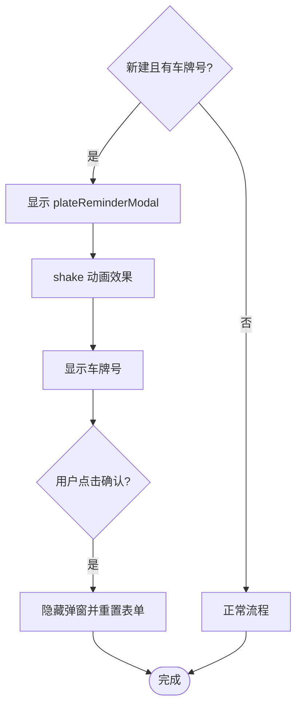
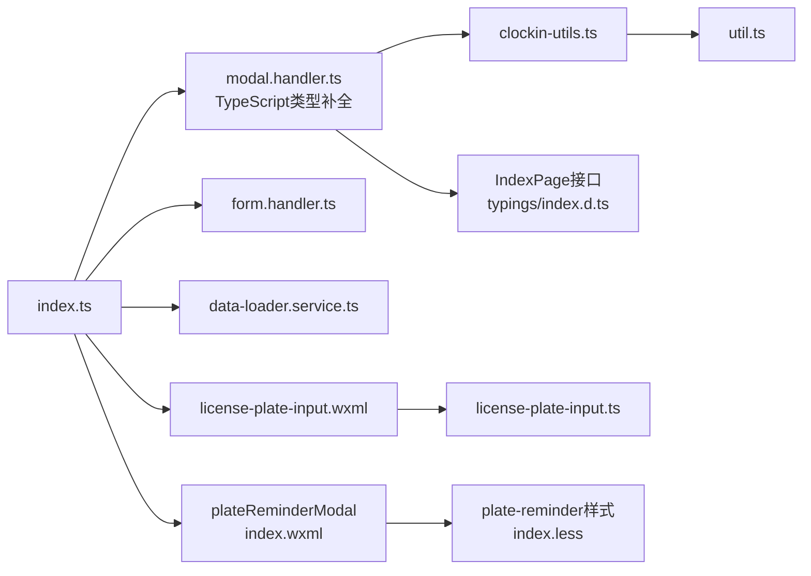

# 模态框处理器

<cite>
**本文引用的文件**
- [miniprogram/pages/index/handlers/modal.handler.ts](file://miniprogram/pages/index/handlers/modal.handler.ts)
- [miniprogram/pages/index/index.ts](file://miniprogram/pages/index/index.ts)
- [miniprogram/pages/index/index.wxml](file://miniprogram/pages/index/index.wxml)
- [miniprogram/components/license-plate-input/license-plate-input.wxml](file://miniprogram/components/license-plate-input/license-plate-input.wxml)
- [miniprogram/components/license-plate-input/license-plate-input.ts](file://miniprogram/components/license-plate-input/license-plate-input.ts)
- [miniprogram/pages/index/utils/clockin-utils.ts](file://miniprogram/pages/index/utils/clockin-utils.ts)
- [miniprogram/pages/index/services/data-loader.service.ts](file://miniprogram/pages/index/services/data-loader.service.ts)
- [miniprogram/pages/index/handlers/form.handler.ts](file://miniprogram/pages/index/handlers/form.handler.ts)
- [miniprogram/utils/util.ts](file://miniprogram/utils/util.ts)
- [typings/index.d.ts](file://typings/index.d.ts)
- [typings/types/wx/index.d.ts](file://typings/types/wx/index.d.ts)
- [miniprogram/pages/index/index.less](file://miniprogram/pages/index/index.less)
</cite>

## 更新摘要
**变更内容**
- 完成了ModalHandler类的全面TypeScript类型补全，增强了类型安全性
- 新增了IndexPage接口定义，提供完整的页面类型约束
- 所有事件处理方法添加了明确的WechatMiniprogram.CustomEvent类型注解
- 增强了setData调用的类型安全性和编译时检查
- **新增许可证提醒功能**：当创建新的有许可证信息的咨询时显示专用提醒模态框

## 目录
1. [简介](#简介)
2. [项目结构](#项目结构)
3. [核心组件](#核心组件)
4. [架构总览](#架构总览)
5. [详细组件分析](#详细组件分析)
6. [TypeScript类型系统](#typescript类型系统)
7. [依赖关系分析](#依赖关系分析)
8. [性能考量](#性能考量)
9. [故障排查指南](#故障排查指南)
10. [结论](#结论)
11. [附录](#附录)

## 简介
本技术文档围绕"模态框处理器"模块展开，系统性阐述 ModalHandler 类的设计架构与实现细节，覆盖模态框生命周期管理、状态控制与用户交互处理；深入解析时间选择器、车牌号输入框、报钟确认弹窗等典型模态框的实现机制；说明数据在模态框内的流转过程（接收、处理、传递与状态更新）以及与主页面的数据同步机制（父子组件通信与事件传递）；给出可扩展的自定义配置项与使用示例，帮助开发者快速理解并实现各类模态框功能。

**更新** 本版本完成了全面的TypeScript类型补全，显著提升了代码的类型安全性和开发体验。**新增功能**：增强了许可证提醒功能，当创建新的有许可证信息的咨询时显示专用提醒模态框，提升用户体验和合规性管理。

## 项目结构
该模块位于小程序页面 index 的子目录中，采用"页面 + 处理器 + 组件"的分层组织方式：
- 页面逻辑：index.ts 负责整体业务流程与状态管理，并实例化 ModalHandler、FormHandler、DataLoaderService 等。
- 模态框处理器：modal.handler.ts 封装所有模态框相关的交互与状态变更，现已具备完整的TypeScript类型支持。
- 视图模板：index.wxml 定义四个主要模态框（时间选择器、车牌号输入、报钟确认、**新增许可证提醒**），并通过双向绑定与处理器联动。
- 子组件：license-plate-input 作为车牌号输入的独立组件，通过属性与事件与父页面通信。
- 工具与服务：clockin-utils、data-loader.service、util.ts 提供格式化、计算与数据加载能力。
- 类型定义：typings/index.d.ts 提供完整的TypeScript类型声明，确保类型安全。



**图表来源**
- [miniprogram/pages/index/index.ts:75-147](file://miniprogram/pages/index/index.ts#L75-L147)
- [miniprogram/pages/index/handlers/modal.handler.ts:7-14](file://miniprogram/pages/index/handlers/modal.handler.ts#L7-L14)
- [typings/index.d.ts:357-383](file://typings/index.d.ts#L357-L383)

**章节来源**
- [miniprogram/pages/index/index.ts:75-147](file://miniprogram/pages/index/index.ts#L75-L147)
- [miniprogram/pages/index/index.wxml:186-225](file://miniprogram/pages/index/index.wxml#L186-L225)
- [typings/index.d.ts:357-383](file://typings/index.d.ts#L357-L383)

## 核心组件
- **ModalHandler**：集中处理所有模态框交互，包括时间选择器确认/取消/列变化、车牌号输入确认、报钟确认弹窗的取消/输入/确认等。现已具备完整的TypeScript类型支持，包括构造函数参数类型、事件处理方法类型注解和返回值类型推断。
- **LicensePlateInput 组件**：独立的车牌号输入模态框，负责输入校验、键盘布局切换、新能源车/无牌车模式切换与事件向上抛出。
- **IndexPage**：页面承载全局状态与业务逻辑，负责初始化各处理器与服务，协调模态框显示与数据同步。通过IndexPage接口提供完整的类型约束。
- **许可证提醒模态框**：**新增功能**，当创建新的有许可证信息的咨询时自动显示，提醒用户及时录入车牌号信息，提升合规性和用户体验。

**章节来源**
- [miniprogram/pages/index/handlers/modal.handler.ts:7-167](file://miniprogram/pages/index/handlers/modal.handler.ts#L7-L167)
- [miniprogram/components/license-plate-input/license-plate-input.ts:1-226](file://miniprogram/components/license-plate-input/license-plate-input.ts#L1-L226)
- [miniprogram/pages/index/index.ts:75-147](file://miniprogram/pages/index/index.ts#L75-L147)
- [typings/index.d.ts:357-383](file://typings/index.d.ts#L357-L383)

## 架构总览
ModalHandler 以"页面上下文"为核心，通过 setData 驱动视图状态变化；同时与工具类、服务类协作完成数据计算与持久化。报钟流程贯穿时间选择、数据组装、保存、推送与页面回退或重置。**更新** 现已具备完整的TypeScript类型支持，提供编译时类型检查和智能代码提示。**新增功能**：许可证提醒模态框在合适的时机自动显示，确保用户不会忘记录入重要的许可证信息。



**图表来源**
- [miniprogram/pages/index/index.ts:604-734](file://miniprogram/pages/index/index.ts#L604-L734)
- [miniprogram/pages/index/handlers/modal.handler.ts:16-68](file://miniprogram/pages/index/handlers/modal.handler.ts#L16-L68)
- [miniprogram/pages/index/utils/clockin-utils.ts:49-109](file://miniprogram/pages/index/utils/clockin-utils.ts#L49-L109)
- [miniprogram/pages/index/services/data-loader.service.ts:13-65](file://miniprogram/pages/index/services/data-loader.service.ts#L13-L65)
- [typings/index.d.ts:357-383](file://typings/index.d.ts#L357-L383)

## 详细组件分析

### ModalHandler 类设计与职责
- **职责边界清晰**：仅处理模态框交互与状态变更，不直接操作云存储或网络请求，避免耦合。
- **生命周期管理**：统一管理四个模态框的状态字段（timePickerModal、licensePlateInputVisible、clockInModal、**新增plateReminderModal**），并在交互中进行显隐切换。
- **数据流控制**：在时间选择完成后，根据是否编辑模式与项目时长计算结束时间，组装报钟信息并触发保存与推送。
- **类型安全保障**：构造函数参数类型明确，事件处理方法具有完整的TypeScript类型注解，确保编译时类型检查。

**更新** 构造函数现在接受 `IndexPage<DataLoaderService>` 类型的页面实例，确保类型安全的页面上下文访问。



**图表来源**
- [miniprogram/pages/index/handlers/modal.handler.ts:7-167](file://miniprogram/pages/index/handlers/modal.handler.ts#L7-L167)
- [typings/index.d.ts:357-383](file://typings/index.d.ts#L357-L383)

**章节来源**
- [miniprogram/pages/index/handlers/modal.handler.ts:7-167](file://miniprogram/pages/index/handlers/modal.handler.ts#L7-L167)

### 时间选择器模态框
- **触发时机**：点击"报钟"按钮后，页面设置 timePickerModal.show=true，并初始化当前时间。
- **用户交互**：多列选择器（时/分），支持列变化监听与实时预览当前时间。
- **确认流程**：解析选中时间，区分编辑模式与新建模式；计算结束时间；格式化报钟信息；保存并加载技师列表；**根据是否需要显示许可证提醒决定后续操作**。



**图表来源**
- [miniprogram/pages/index/index.ts:604-624](file://miniprogram/pages/index/index.ts#L604-L624)
- [miniprogram/pages/index/handlers/modal.handler.ts:16-68](file://miniprogram/pages/index/handlers/modal.handler.ts#L16-L68)
- [miniprogram/pages/index/utils/clockin-utils.ts:49-109](file://miniprogram/pages/index/utils/clockin-utils.ts#L49-L109)

**章节来源**
- [miniprogram/pages/index/index.ts:604-624](file://miniprogram/pages/index/index.ts#L604-L624)
- [miniprogram/pages/index/handlers/modal.handler.ts:16-89](file://miniprogram/pages/index/handlers/modal.handler.ts#L16-L89)

### 车牌号输入框模态框
- **触发时机**：点击"车牌号"输入区域，页面设置 licensePlateInputVisible=true。
- **组件行为**：license-plate-input 组件内部维护 plateNumber 数组与当前光标位置，支持省份首字选择、字符输入、删除、清空、新能源车/无牌车模式切换。
- **事件传递**：组件通过 cancel/confirm 事件向父页面回调，父页面更新 licensePlate 与 plateNumber，并关闭模态框。



**图表来源**
- [miniprogram/pages/index/index.wxml:206-207](file://miniprogram/pages/index/index.wxml#L206-L207)
- [miniprogram/components/license-plate-input/license-plate-input.wxml:1-46](file://miniprogram/components/license-plate-input/license-plate-input.wxml#L1-L46)
- [miniprogram/components/license-plate-input/license-plate-input.ts:110-168](file://miniprogram/components/license-plate-input/license-plate-input.ts#L110-L168)

**章节来源**
- [miniprogram/pages/index/index.wxml:206-207](file://miniprogram/pages/index/index.wxml#L206-L207)
- [miniprogram/components/license-plate-input/license-plate-input.ts:1-226](file://miniprogram/components/license-plate-input/license-plate-input.ts#L1-L226)

### 报钟确认弹窗
- **触发时机**：保存成功后，页面设置 clockInModal.show=true，并填充格式化的报钟内容。
- **用户交互**：支持编辑内容、字数统计、取消与确认推送。
- **推送流程**：调用 sendToWechatWebhook 云函数发送报钟消息；根据返回结果决定提示与后续导航/重置。



**图表来源**
- [miniprogram/pages/index/handlers/modal.handler.ts:131-165](file://miniprogram/pages/index/handlers/modal.handler.ts#L131-L165)
- [miniprogram/pages/index/index.ts:713-734](file://miniprogram/pages/index/index.ts#L713-L734)

**章节来源**
- [miniprogram/pages/index/handlers/modal.handler.ts:108-165](file://miniprogram/pages/index/handlers/modal.handler.ts#L108-L165)
- [miniprogram/pages/index/index.ts:701-734](file://miniprogram/pages/index/index.ts#L701-L734)

### **新增功能** 许可证提醒模态框
- **触发时机**：在时间选择器确认保存成功后，如果满足以下条件：**新增功能**，当创建新的有许可证信息的咨询时显示专用提醒模态框。
  - 新建模式（editId 不存在）
  - 存在有效的 licensePlate 且非空
- **用户交互**：显示警告图标、提醒文本和车牌号展示，用户点击"已录入"确认后关闭弹窗并重置表单。
- **设计特点**：包含动画效果（shake），强调重要性；显示车牌号便于核对；一键确认操作简化流程。



**图表来源**
- [miniprogram/pages/index/handlers/modal.handler.ts:58-69](file://miniprogram/pages/index/handlers/modal.handler.ts#L58-L69)
- [miniprogram/pages/index/index.wxml:193-200](file://miniprogram/pages/index/index.wxml#L193-L200)
- [miniprogram/pages/index/index.less:604-614](file://miniprogram/pages/index/index.less#L604-L614)

**章节来源**
- [miniprogram/pages/index/handlers/modal.handler.ts:58-69](file://miniprogram/pages/index/handlers/modal.handler.ts#L58-L69)
- [miniprogram/pages/index/index.wxml:193-200](file://miniprogram/pages/index/index.wxml#L193-L200)
- [miniprogram/pages/index/index.less:596-634](file://miniprogram/pages/index/index.less#L596-L634)

### 数据流转与状态更新
- **输入阶段**：FormHandler 负责表单项输入，实时更新 consultationInfo/guest1Info/guest2Info；ModalHandler 负责模态框状态与临时数据。
- **处理阶段**：ClockInUtils 计算结束时间、格式化报钟信息；DataLoaderService 加载可用技师列表；util.ts 提供通用时间/时长计算。
- **传递阶段**：通过 Page.setData 驱动视图更新；组件通过属性与事件与父页面通信。
- **更新阶段**：保存成功后，页面执行导航/重置；报钟推送成功后延迟隐藏弹窗并清理状态；**新增许可证提醒**：在合适时机显示提醒弹窗。

**章节来源**
- [miniprogram/pages/index/handlers/form.handler.ts:1-175](file://miniprogram/pages/index/handlers/form.handler.ts#L1-L175)
- [miniprogram/pages/index/utils/clockin-utils.ts:1-184](file://miniprogram/pages/index/utils/clockin-utils.ts#L1-L184)
- [miniprogram/pages/index/services/data-loader.service.ts:1-206](file://miniprogram/pages/index/services/data-loader.service.ts#L1-L206)
- [miniprogram/utils/util.ts:1-150](file://miniprogram/utils/util.ts#L1-L150)

### 自定义配置与扩展指南
- **显示/隐藏控制**
  - 时间选择器：通过 timePickerModal.show 控制显隐；支持设置默认当前时间与初始选中列。
  - 车牌号输入框：通过 licensePlateInputVisible 控制显隐；组件内部维护 plateNumber 与光标位置。
  - 报钟确认弹窗：通过 clockInModal.show 控制显隐；支持 loading 状态与内容编辑。
  - **许可证提醒弹窗**：**新增功能**，通过 plateReminderModal.show 控制显隐；支持显示车牌号信息。
- **动画与样式**
  - 页面内使用透明遮罩与固定定位的弹窗容器；组件内部通过 wx:if 条件渲染与样式类控制显示/隐藏。
  - 建议在样式文件中为弹窗容器添加过渡动画，提升用户体验。
  - **许可证提醒弹窗**：包含 shake 动画效果，强调重要性。
- **扩展点**
  - 新增模态框：在 index.ts 中新增状态字段与 WXML 模板，编写对应处理器方法并在页面中绑定事件。
  - 自定义报钟内容：在 ClockInUtils 中扩展格式化逻辑，或在页面中对 clockInModal.content 进行二次加工。
  - 自定义车牌规则：在 license-plate-input 组件中扩展字符集与长度限制，或增加更多模式（如港澳车、军车等）。
  - **许可证提醒逻辑**：可根据业务需求调整触发条件，如不同的许可证类型或特殊客户群体。

**章节来源**
- [miniprogram/pages/index/index.wxml:186-225](file://miniprogram/pages/index/index.wxml#L186-L225)
- [miniprogram/components/license-plate-input/license-plate-input.wxml:1-46](file://miniprogram/components/license-plate-input/license-plate-input.wxml#L1-L46)
- [miniprogram/pages/index/utils/clockin-utils.ts:49-109](file://miniprogram/pages/index/utils/clockin-utils.ts#L49-L109)
- [miniprogram/pages/index/index.less:596-634](file://miniprogram/pages/index/index.less#L596-L634)

## TypeScript类型系统

### IndexPage接口定义
IndexPage接口提供了完整的页面类型约束，确保ModalHandler能够安全地访问页面数据和方法：

```typescript
interface IndexPage<D> {
  data: {
    editId?: string;
    consultationInfo: Omit<ConsultationInfo, "_id" | "createdAt" | "updatedAt"> & { selectedParts: {} };
    currentReservationIds: string[];
    projects: Project[];
    isDualMode: boolean;
    activeGuest: number;
    guest1Info: GuestInfo;
    guest2Info: GuestInfo;
    timePickerModal: {
      currentTime: string;
    };
    licensePlate: string;
    clockInModal: {
      content: string;
    };
    [key: string]: any;
  };
  dataLoader: D | null;
  setData: (data: Record<string, any>) => void;
  searchCustomer: () => void;
  doDualClockIn: (startTimeDate?: Date, editId?: string) => Promise<void>;
  saveConsultation: (consultation: Add<ConsultationInfo>, editId?: string) => Promise<boolean>;
  sendToWechatWebhook: (content: string) => Promise<boolean>;
  resetForm: () => void;
}
```

### 事件类型安全
所有事件处理方法都具有明确的TypeScript类型注解：

- `onTimePickerChange(e: WechatMiniprogram.CustomEvent)` - 确保事件参数类型安全
- `onTimeColumnChange(e: WechatMiniprogram.CustomEvent)` - 提供编译时类型检查
- `onPlateConfirm(e: WechatMiniprogram.CustomEvent)` - 保证事件回调参数正确
- `onClockInContentInput(e: WechatMiniprogram.CustomEvent)` - 确保输入事件处理的类型安全

### 类型安全的setData调用
通过IndexPage接口，setData方法的键值对得到类型验证，防止运行时错误：

```typescript
this.page.setData({ 'timePickerModal.show': false });
this.page.setData({ 'clockInModal.show': true, 'clockInModal.content': clockInInfo });
```

**章节来源**
- [typings/index.d.ts:357-383](file://typings/index.d.ts#L357-L383)
- [miniprogram/pages/index/handlers/modal.handler.ts:74-106](file://miniprogram/pages/index/handlers/modal.handler.ts#L74-L106)

## 依赖关系分析
- **页面与处理器**
  - IndexPage 在 onLoad 中实例化 ModalHandler、FormHandler、DataLoaderService，并注入依赖。
  - ModalHandler 依赖 ClockInUtils 与 DataLoaderService，用于计算与数据加载。
- **组件与页面**
  - LicensePlateInput 通过属性 visible/value 与事件 confirm/cancel 与父页面通信。
- **工具与服务**
  - ClockInUtils 依赖 util.ts 的时间/时长计算与云数据库查询。
  - DataLoaderService 依赖云函数获取可用技师列表。
- **类型系统**
  - IndexPage接口提供完整的类型约束，确保类型安全的页面交互。



**图表来源**
- [miniprogram/pages/index/index.ts:125-147](file://miniprogram/pages/index/index.ts#L125-L147)
- [miniprogram/pages/index/handlers/modal.handler.ts:1-4](file://miniprogram/pages/index/handlers/modal.handler.ts#L1-L4)
- [typings/index.d.ts:357-383](file://typings/index.d.ts#L357-L383)

**章节来源**
- [miniprogram/pages/index/index.ts:125-147](file://miniprogram/pages/index/index.ts#L125-L147)
- [miniprogram/pages/index/handlers/modal.handler.ts:1-4](file://miniprogram/pages/index/handlers/modal.handler.ts#L1-L4)

## 性能考量
- **异步操作与加载状态**
  - 保存与推送均设置 loading 状态，避免重复提交与界面卡顿。
  - DataLoaderService 在加载可用技师时设置 loadingTechnicians，减少不必要的 UI 闪烁。
- **并发优化**
  - 双人模式报钟时，两个保存请求并发执行，缩短等待时间。
- **计算开销**
  - 时间计算与格式化集中在 ClockInUtils 与 util.ts，避免在页面中重复计算。
- **渲染优化**
  - 模态框使用 wx:if 条件渲染，减少常驻 DOM 占用。
- **类型检查优化**
  - 编译时类型检查在开发阶段发现潜在错误，减少运行时开销。
- **许可证提醒优化**：**新增功能**，通过条件判断避免不必要的弹窗显示，提升性能。

**章节来源**
- [miniprogram/pages/index/handlers/modal.handler.ts:33-67](file://miniprogram/pages/index/handlers/modal.handler.ts#L33-L67)
- [miniprogram/pages/index/services/data-loader.service.ts:13-65](file://miniprogram/pages/index/services/data-loader.service.ts#L13-L65)
- [miniprogram/pages/index/utils/clockin-utils.ts:111-182](file://miniprogram/pages/index/utils/clockin-utils.ts#L111-L182)

## 故障排查指南
- **保存失败**
  - 现象：保存咨询单返回 false 或异常。
  - 排查：检查保存逻辑与云数据库返回值；确认 editId 与日期/时间参数是否正确。
- **推送失败**
  - 现象：报钟确认弹窗提示失败。
  - 排查：检查 sendToWechatWebhook 返回值与云函数 sendWechatMessage 的执行结果。
- **车牌号输入异常**
  - 现象：输入字符错位或长度不符。
  - 排查：检查 license-plate-input 组件的 plateNumber 初始化与长度调整逻辑；确认 isNoPlate/isNewEnergyVehicle 切换是否正确。
- **双人模式报钟不同步**
  - 现象：两位顾客报钟信息不一致。
  - 排查：核对 buildDualClockInInfo 的字段映射与结束时间计算。
- **类型错误**
  - 现象：编译时报错，提示类型不匹配。
  - 排查：检查IndexPage接口的使用，确保setData的键值对符合类型定义；验证事件参数类型注解。
- **许可证提醒不显示**
  - 现象：创建新的有许可证信息的咨询时未显示提醒弹窗。
  - 排查：检查 editId、licensePlate 的状态判断逻辑；确认 plateReminderModal 的初始化状态。
- **许可证提醒样式问题**
  - 现象：shake 动画或样式显示异常。
  - 排查：检查 index.less 中的动画定义和样式类名；确认 WXML 中的样式绑定。

**章节来源**
- [miniprogram/pages/index/index.ts:387-481](file://miniprogram/pages/index/index.ts#L387-L481)
- [miniprogram/pages/index/handlers/modal.handler.ts:131-165](file://miniprogram/pages/index/handlers/modal.handler.ts#L131-L165)
- [miniprogram/components/license-plate-input/license-plate-input.ts:75-109](file://miniprogram/components/license-plate-input/license-plate-input.ts#L75-L109)
- [miniprogram/pages/index/utils/clockin-utils.ts:111-182](file://miniprogram/pages/index/utils/clockin-utils.ts#L111-L182)

## 结论
ModalHandler 通过清晰的职责划分与稳定的页面上下文，实现了时间选择器、车牌号输入框与报钟确认弹窗的完整生命周期管理。配合 FormHandler、DataLoaderService 与 ClockInUtils，形成从输入到保存再到推送的一体化流程。

**更新** 本次TypeScript类型补全显著提升了代码质量，提供了编译时类型检查、智能代码提示和更好的开发体验。IndexPage接口确保了页面交互的类型安全，所有事件处理方法都具备明确的类型注解，大幅减少了运行时错误的可能性。

**新增功能**：许可证提醒功能增强了系统的合规性和用户体验。通过智能的条件判断，在合适的时机提醒用户录入重要的许可证信息，避免遗漏。该功能与现有的报钟流程无缝集成，不影响原有功能的使用。

建议在保持现有解耦的前提下，按需扩展报钟内容格式与车牌规则，并在样式层面增强动画体验，以进一步提升可用性与可维护性。

## 附录
- **使用示例**
  - 显示时间选择器：在页面中设置 timePickerModal.show=true，并绑定 onTimePickerConfirm/onTimePickerCancel。
  - 显示车牌号输入框：设置 licensePlateInputVisible=true，并监听 confirm 事件更新 licensePlate。
  - 显示报钟确认弹窗：保存成功后设置 clockInModal.show=true 并填充内容，绑定 onClockInModalConfirm 进行推送。
  - **显示许可证提醒**：在时间选择器确认保存成功后，如果满足新建且有车牌号的条件，自动显示 plateReminderModal。
- **扩展建议**
  - 新增模态框：在 index.ts 中新增状态字段与 WXML 模板，编写对应处理器方法并在页面中绑定事件。
  - 自定义报钟内容：在 ClockInUtils 中扩展格式化逻辑，或在页面中对 clockInModal.content 进行二次加工。
  - 自定义车牌规则：在 license-plate-input 组件中扩展字符集与长度限制，或增加更多模式。
  - **许可证提醒扩展**：可根据业务需求调整触发条件，如不同的许可证类型或特殊客户群体。
- **类型安全最佳实践**
  - 使用IndexPage接口确保页面数据访问的安全性
  - 为所有事件处理方法添加明确的类型注解
  - 利用TypeScript的类型推断减少冗余类型声明
  - 通过编译时检查提前发现潜在问题
- **许可证提醒最佳实践**
  - 确保触发条件的准确性，避免误触发或漏触发
  - 提供清晰的视觉提示和操作引导
  - 考虑用户的操作习惯，提供便捷的一键确认功能
  - 在样式设计上突出重要性但不过度干扰用户体验