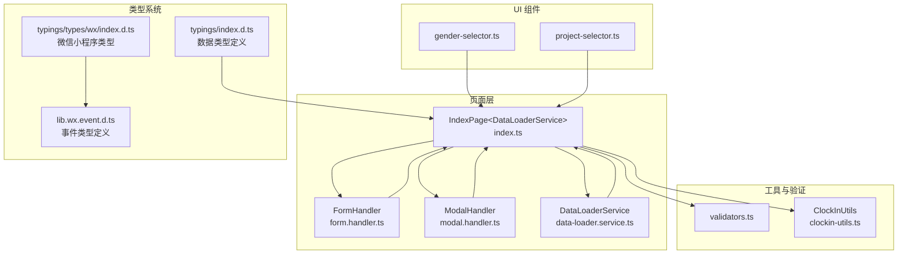
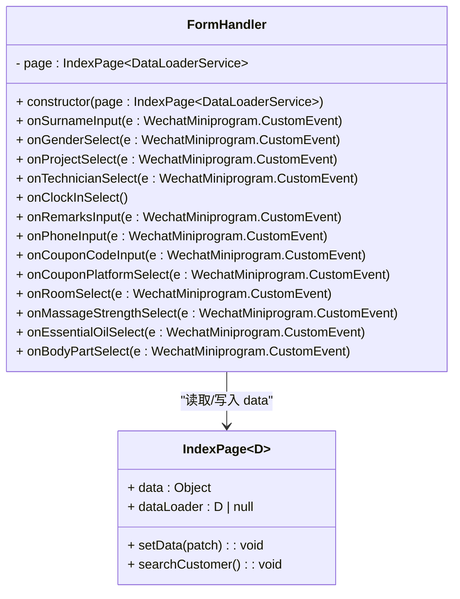
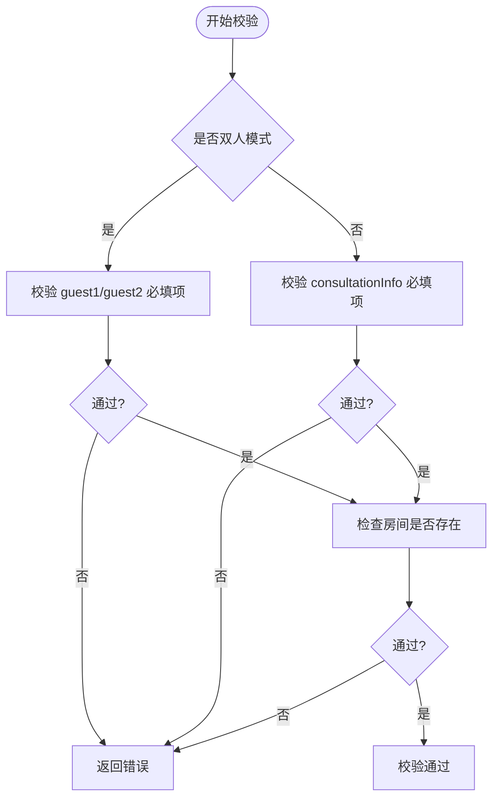
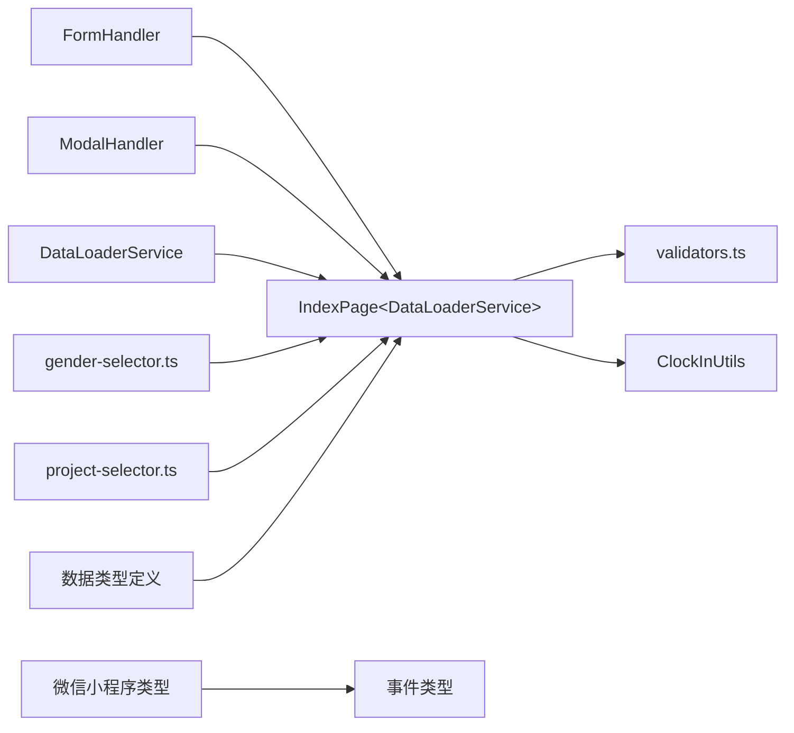

# 表单处理器

<cite>
**本文引用的文件**
- [miniprogram/pages/index/handlers/form.handler.ts](file://miniprogram/pages/index/handlers/form.handler.ts)
- [miniprogram/pages/index/index.ts](file://miniprogram/pages/index/index.ts)
- [miniprogram/pages/index/services/data-loader.service.ts](file://miniprogram/pages/index/services/data-loader.service.ts)
- [miniprogram/utils/validators.ts](file://miniprogram/utils/validators.ts)
- [miniprogram/pages/index/handlers/modal.handler.ts](file://miniprogram/pages/index/handlers/modal.handler.ts)
- [miniprogram/pages/index/utils/clockin-utils.ts](file://miniprogram/pages/index/utils/clockin-utils.ts)
- [miniprogram/components/gender-selector/gender-selector.ts](file://miniprogram/components/gender-selector/gender-selector.ts)
- [miniprogram/components/project-selector/project-selector.ts](file://miniprogram/components/project-selector/project-selector.ts)
- [miniprogram/utils/constants.ts](file://miniprogram/utils/constants.ts)
- [typings/index.d.ts](file://typings/index.d.ts)
- [typings/types/wx/index.d.ts](file://typings/types/wx/index.d.ts)
- [typings/types/wx/lib.wx.event.d.ts](file://typings/types/wx/lib.wx.event.d.ts)
</cite>

## 更新摘要
**所做更改**
- 完成FormHandler类的TypeScript类型补全，提升类型安全性
- 新增IndexPage泛型约束，确保类型安全的页面实例
- 完善事件参数类型定义，使用WechatMiniprogram.CustomEvent
- 增强数据类型约束，包括ConsultationInfo、GuestInfo等接口
- 优化类型推导，提升开发体验和IDE支持

## 目录
1. [简介](#简介)
2. [项目结构](#项目结构)
3. [核心组件](#核心组件)
4. [架构总览](#架构总览)
5. [详细组件分析](#详细组件分析)
6. [依赖关系分析](#依赖关系分析)
7. [性能与可维护性](#性能与可维护性)
8. [故障排查指南](#故障排查指南)
9. [结论](#结论)
10. [附录：最佳实践与扩展建议](#附录最佳实践与扩展建议)

## 简介
本技术文档围绕"表单处理器"模块展开，重点解析FormHandler类的实现架构与职责边界，涵盖以下方面：
- 表单字段处理：如onSurnameInput、onGenderSelect、onProjectSelect等方法的实现逻辑与数据流向
- 数据验证：必填项、格式与业务规则的验证策略及错误提示
- 状态管理：页面数据的双向绑定、实时联动与状态切换（如双人模式）
- 事件响应机制：从UI组件到页面再到服务层的事件链路
- 双人模式差异：字段同步、数据隔离与冲突处理
- **新增** TypeScript类型补全：完整的类型定义体系，提升开发安全性
- 完整的代码示例路径与最佳实践，帮助开发者快速理解并扩展功能

## 项目结构
表单处理器位于页面级目录，配合服务层与工具层协同工作：
- 页面入口负责初始化FormHandler、DataLoaderService、ModalHandler，并管理全局状态
- FormHandler负责接收UI事件并更新对应的数据键位
- DataLoaderService负责加载项目、技师列表与编辑/预约数据
- 验证器提供统一的校验规则与错误提示
- 工具类ClockInUtils提供报钟计算与格式化能力
- UI组件通过自定义事件向上触发，交由页面或处理器处理
- **新增** 类型系统：完整的TypeScript类型定义，确保编译时类型安全



**图表来源**
- [miniprogram/pages/index/index.ts](file://miniprogram/pages/index/index.ts#L75-L147)
- [miniprogram/pages/index/handlers/form.handler.ts](file://miniprogram/pages/index/handlers/form.handler.ts#L3-L175)
- [miniprogram/pages/index/services/data-loader.service.ts](file://miniprogram/pages/index/services/data-loader.service.ts#L6-L206)
- [miniprogram/pages/index/handlers/modal.handler.ts](file://miniprogram/pages/index/handlers/modal.handler.ts#L7-L167)
- [typings/index.d.ts](file://typings/index.d.ts#L357-L387)
- [typings/types/wx/lib.wx.event.d.ts](file://typings/types/wx/lib.wx.event.d.ts#L23-L426)

**章节来源**
- [miniprogram/pages/index/index.ts](file://miniprogram/pages/index/index.ts#L75-L147)

## 核心组件
- FormHandler：封装所有表单字段事件处理逻辑，负责根据双人模式与当前活跃客人，将用户输入写入对应的data键位，并触发必要的联动操作（如搜索客户、加载可用技师）
- **增强** 类型安全：FormHandler现在接受IndexPage<DataLoaderService>类型的页面实例，确保类型安全
- DataLoaderService：负责加载项目列表、技师列表以及编辑/预约数据；在编辑场景中兼容旧数据结构
- ModalHandler：负责时间选择器与报钟弹窗的交互逻辑，包括时间确认、格式化报钟信息、推送等
- 验证器：提供单人/双人模式的统一校验规则与错误提示
- ClockInUtils：提供加班时长计算、报钟信息格式化与双人报钟信息构建
- UI组件：gender-selector与project-selector通过自定义事件向上传递选择结果，页面再委派给FormHandler处理

**章节来源**
- [miniprogram/pages/index/handlers/form.handler.ts](file://miniprogram/pages/index/handlers/form.handler.ts#L3-L175)
- [miniprogram/pages/index/services/data-loader.service.ts](file://miniprogram/pages/index/services/data-loader.service.ts#L6-L206)
- [miniprogram/pages/index/handlers/modal.handler.ts](file://miniprogram/pages/index/handlers/modal.handler.ts#L7-L167)
- [typings/index.d.ts](file://typings/index.d.ts#L357-L387)

## 架构总览
表单处理采用"页面协调 + 处理器解耦"的设计：
- 页面负责状态与生命周期管理，初始化各处理器与服务
- FormHandler专注字段事件与数据写入，避免页面臃肿
- DataLoaderService专注数据加载与兼容性处理
- 验证器与工具类提供纯函数式的校验与计算能力
- UI组件仅负责展示与事件冒泡，保持最小职责
- **新增** 类型系统：完整的类型定义确保编译时类型安全，提升开发效率

```mermaid
sequenceDiagram
participant UI as "UI 组件"
participant Page as "IndexPage&lt;DataLoaderService&gt;"
participant FH as "FormHandler"
participant DL as "DataLoaderService"
participant V as "validators.ts"
UI->>Page : 触发字段事件(WechatMiniprogram.CustomEvent)
Page->>FH : 转发事件(e.detail)
FH->>Page : setData({目标键位 : 新值})
FH->>Page : 触发 searchCustomer()/loadTechnicianList()
Page->>DL : 加载可用技师/项目
Page->>V : 校验(打印/保存前)
V-->>Page : 返回校验结果
```

**图表来源**
- [miniprogram/pages/index/index.ts](file://miniprogram/pages/index/index.ts#L209-L260)
- [miniprogram/pages/index/handlers/form.handler.ts](file://miniprogram/pages/index/handlers/form.handler.ts#L10-L19)
- [miniprogram/pages/index/services/data-loader.service.ts](file://miniprogram/pages/index/services/data-loader.service.ts#L13-L65)
- [typings/types/wx/lib.wx.event.d.ts](file://typings/types/wx/lib.wx.event.d.ts#L23-L426)

## 详细组件分析

### FormHandler 类分析
FormHandler将页面的字段事件转换为对data的写入操作，并在必要时触发联动逻辑。其关键特性：
- 双人模式分支：根据isDualMode与activeGuest决定写入guest1Info或guest2Info，否则写入consultationInfo
- 项目选择联动：根据所选项目设置currentProjectIsEssentialOilOnly与currentProjectNeedEssentialOil，驱动UI与后续校验
- 技师选择保护：当技师被占用时弹出提示并阻止继续
- 实时搜索：姓氏与电话输入后触发searchCustomer，便于快速匹配历史客户
- **新增** 类型安全：所有事件参数使用WechatMiniprogram.CustomEvent类型，确保参数完整性



**图表来源**
- [miniprogram/pages/index/handlers/form.handler.ts](file://miniprogram/pages/index/handlers/form.handler.ts#L3-L175)
- [typings/index.d.ts](file://typings/index.d.ts#L357-L387)

**章节来源**
- [miniprogram/pages/index/handlers/form.handler.ts](file://miniprogram/pages/index/handlers/form.handler.ts#L10-L173)

#### 字段处理方法详解
- 姓氏输入onSurnameInput：在双人模式下根据activeGuest写入guest1Info.surname或guest2Info.surname；随后触发searchCustomer
- 性别选择onGenderSelect：同上，写入gender并触发searchCustomer
- 项目选择onProjectSelect：根据项目属性设置currentProjectIsEssentialOilOnly与currentProjectNeedEssentialOil，并加载可用技师
- 技师选择onTechnicianSelect：若技师被占用则提示；否则按双人模式写入对应技师
- 报钟开关onClockInSelect：切换isClockIn状态
- 备注输入onRemarksInput：写入对应备注
- 电话输入onPhoneInput：写入phone并触发searchCustomer
- 优惠券码onCouponCodeInput：写入对应优惠券码
- 优惠平台onCouponPlatformSelect：在双人模式下按当前客人切换平台，支持取消选择
- 房间选择onRoomSelect：写入room
- 按摩强度onMassageStrengthSelect：写入massageStrength
- 专用精油onEssentialOilSelect：写入essentialOil
- 身体部位onBodyPartSelect：在双人模式下按当前客人切换selectedParts中的某部位

**章节来源**
- [miniprogram/pages/index/handlers/form.handler.ts](file://miniprogram/pages/index/handlers/form.handler.ts#L10-L173)

#### 双人模式下的字段同步与隔离
- 字段同步：toggleDualMode在启用时将consultationInfo的部分字段复制到guest1Info，并清空guest2Info；关闭时将guest1Info复制回consultationInfo
- 数据隔离：activeGuest控制当前写入目标；selectedParts与其他字段均按客人独立存储
- 冲突解决：onTechnicianSelect对占用状态进行即时校验并提示，避免后续保存阶段出现冲突

**章节来源**
- [miniprogram/pages/index/index.ts](file://miniprogram/pages/index/index.ts#L149-L196)
- [miniprogram/pages/index/handlers/form.handler.ts](file://miniprogram/pages/index/handlers/form.handler.ts#L58-L70)

### 数据绑定与状态管理
- 双向数据绑定：页面通过setData写入data，WXML自动响应渲染；组件通过triggerEvent向上冒泡，页面/处理器接收后再次setData
- 实时联动：onProjectSelect与onSurnameInput/onPhoneInput后立即触发searchCustomer，onProjectSelect还会触发loadTechnicianList
- 状态一致性：双人模式切换时，确保consultationInfo与guest1Info/guest2Info的字段映射正确，避免遗漏或冗余
- **新增** 类型约束：IndexPage泛型确保dataLoader类型安全，防止类型不匹配

**章节来源**
- [miniprogram/pages/index/index.ts](file://miniprogram/pages/index/index.ts#L210-L260)
- [miniprogram/pages/index/services/data-loader.service.ts](file://miniprogram/pages/index/services/data-loader.service.ts#L13-L65)
- [typings/index.d.ts](file://typings/index.d.ts#L357-L387)

### 事件响应机制
- UI -> 页面：组件通过change事件传递值，页面方法转发给FormHandler
- 页面 -> 处理器：页面方法直接调用FormHandler的对应方法
- 处理器 -> 页面：通过setData写入data，触发视图更新
- 页面 -> 服务：必要时调用DataLoaderService或ModalHandler
- **新增** 类型安全：所有事件参数使用WechatMiniprogram.CustomEvent类型，确保参数结构完整

```mermaid
sequenceDiagram
participant C as "gender-selector"
participant P as "IndexPage&lt;DataLoaderService&gt;"
participant H as "FormHandler"
participant D as "DataLoaderService"
C->>P : triggerEvent("change", WechatMiniprogram.CustomEvent)
P->>H : onGenderSelect(e)
H->>P : setData({consultationInfo.gender : value})
H->>P : searchCustomer()
P->>D : loadTechnicianList()
```

**图表来源**
- [miniprogram/components/gender-selector/gender-selector.ts](file://miniprogram/components/gender-selector/gender-selector.ts#L15-L20)
- [miniprogram/pages/index/index.ts](file://miniprogram/pages/index/index.ts#L214-L216)
- [miniprogram/pages/index/handlers/form.handler.ts](file://miniprogram/pages/index/handlers/form.handler.ts#L21-L31)
- [typings/types/wx/lib.wx.event.d.ts](file://typings/types/wx/lib.wx.event.d.ts#L23-L426)

### 表单验证规则
- 单人模式：必须填写性别、项目、技师、房间；若项目为"专用精油仅用"且需要精油，则必须选择精油
- 双人模式：分别校验guest1Info与guest2Info的性别、项目、技师；同时要求房间存在
- 错误提示：统一通过showValidationError显示toast
- **新增** 类型支持：validateConsultationInfo和validateGuestInfo函数提供完整的类型检查



**图表来源**
- [miniprogram/utils/validators.ts](file://miniprogram/utils/validators.ts#L6-L72)

**章节来源**
- [miniprogram/utils/validators.ts](file://miniprogram/utils/validators.ts#L6-L72)

### 打印与保存流程
- 打印前校验：调用validateConsultationForPrint，通过后构建两个咨询单内容（双人模式）
- 保存流程：计算结束时间、加班时长，保存至云数据库；编辑模式下删除原预约并重新分配未来预约；必要时保存/更新顾客信息

```mermaid
sequenceDiagram
participant P as "IndexPage&lt;DataLoaderService&gt;"
participant V as "validators.ts"
participant PB as "PrintContentBuilder"
participant PS as "printerService"
P->>V : validateConsultationForPrint(...)
V-->>P : 校验结果
alt 通过
P->>PB : buildContent(consultationInfo)
PB-->>P : printContent[]
P->>PS : printMultiple(printContent[])
else 失败
P-->>P : 提示错误
end
```

**图表来源**
- [miniprogram/pages/index/index.ts](file://miniprogram/pages/index/index.ts#L262-L324)
- [miniprogram/utils/validators.ts](file://miniprogram/utils/validators.ts#L51-L72)

**章节来源**
- [miniprogram/pages/index/index.ts](file://miniprogram/pages/index/index.ts#L262-L324)

## 依赖关系分析
- FormHandler依赖IndexPage的data与setData能力，间接依赖DataLoaderService（通过页面调用）
- 页面依赖FormHandler、ModalHandler、DataLoaderService与验证器
- DataLoaderService依赖云数据库与应用全局数据
- ClockInUtils依赖应用与云数据库，提供报钟计算与格式化
- UI组件通过事件与页面通信，页面再委派给处理器
- **新增** 类型系统：完整的类型定义确保组件间的类型安全通信



**图表来源**
- [miniprogram/pages/index/handlers/form.handler.ts](file://miniprogram/pages/index/handlers/form.handler.ts#L3-L175)
- [miniprogram/pages/index/index.ts](file://miniprogram/pages/index/index.ts#L75-L147)
- [typings/index.d.ts](file://typings/index.d.ts#L357-L387)
- [typings/types/wx/lib.wx.event.d.ts](file://typings/types/wx/lib.wx.event.d.ts#L23-L426)

**章节来源**
- [miniprogram/pages/index/index.ts](file://miniprogram/pages/index/index.ts#L75-L147)

## 性能与可维护性
- 性能优化建议
  - 批量setData：在一次事件中合并多个字段更新，减少多次setData的开销
  - 防抖搜索：对onSurnameInput/onPhoneInput的searchCustomer增加防抖，避免频繁请求
  - 条件加载：仅在项目变更或首次进入时触发loadTechnicianList
- 可维护性建议
  - 将字段映射集中到常量或工具函数，避免分散的字符串拼接
  - 将校验规则抽象为可配置的规则集，便于扩展新字段
  - 将UI组件的事件命名规范化，统一使用change事件并携带明确的payload结构
- **新增** 类型安全建议
  - 利用TypeScript泛型确保组件间数据传递的类型安全
  - 使用接口定义确保数据结构的一致性
  - 通过类型推导减少重复的类型声明

## 故障排查指南
- 技师占用提示：onTechnicianSelect对occupied=true的情况直接提示，确认预约冲突后再选择
- 校验失败：validateConsultationForPrint返回错误时，统一通过showValidationError显示提示；检查必填项与项目属性
- 双人模式异常：toggleDualMode后检查guest1Info/guest2Info的字段是否正确复制；activeGuest切换后确认当前写入目标
- 报钟异常：ModalHandler在时间确认后计算结束时间并格式化报钟信息；若推送失败，检查网络与企业微信机器人配置
- **新增** 类型错误排查
  - 编译错误：检查IndexPage泛型参数是否正确
  - 事件类型错误：确认WechatMiniprogram.CustomEvent的detail结构是否匹配
  - 数据类型错误：验证ConsultationInfo、GuestInfo等接口定义是否一致

**章节来源**
- [miniprogram/pages/index/handlers/form.handler.ts](file://miniprogram/pages/index/handlers/form.handler.ts#L58-L62)
- [miniprogram/utils/validators.ts](file://miniprogram/utils/validators.ts#L74-L80)
- [miniprogram/pages/index/handlers/modal.handler.ts](file://miniprogram/pages/index/handlers/modal.handler.ts#L16-L68)

## 结论
FormHandler通过清晰的事件分发与数据写入策略，实现了表单字段的统一处理；结合DataLoaderService、验证器与工具类，形成了从UI到云端的完整闭环。双人模式在字段隔离与状态同步方面提供了良好的扩展性。**最新的TypeScript类型补全显著提升了代码的类型安全性，减少了运行时错误，提高了开发效率和代码质量。** 建议在后续迭代中进一步完善批量更新与防抖策略，提升用户体验与系统性能。

## 附录：最佳实践与扩展建议
- 字段处理最佳实践
  - 使用统一的字段映射常量，避免硬编码键位
  - 在FormHandler中增加字段变更后的副作用处理（如联动搜索、加载可用技师）
  - 对高频输入（如电话、姓名）增加防抖，降低请求压力
  - **新增** 利用TypeScript类型系统：使用接口定义确保数据结构一致性
- 双人模式扩展建议
  - 支持更多客人（如3人以上）时，将guestXInfo抽象为数组或Map结构
  - 增加冲突检测：在切换activeGuest或修改技师/房间时，提前检测冲突并提示
  - **新增** 泛型扩展：考虑使用更灵活的泛型参数支持动态客人数量
- 验证规则扩展
  - 将校验规则模块化，支持动态配置与多语言提示
  - 对业务规则（如"专用精油仅用"）进行集中管理，避免散落各处
  - **新增** 类型安全：利用TypeScript确保校验函数的参数和返回值类型
- UI组件规范
  - 统一事件命名与payload结构，便于处理器集中处理
  - 组件内部尽量无状态，通过properties与events与页面通信
  - **新增** 类型定义：为UI组件事件定义专门的接口，确保事件参数的类型安全
- **新增** 类型系统最佳实践
  - 使用泛型约束确保组件间的数据传递安全
  - 定义完整的接口层次，避免any类型滥用
  - 利用TypeScript的类型推导减少冗余的类型声明
  - 通过模块化的方式组织类型定义，提高代码的可维护性