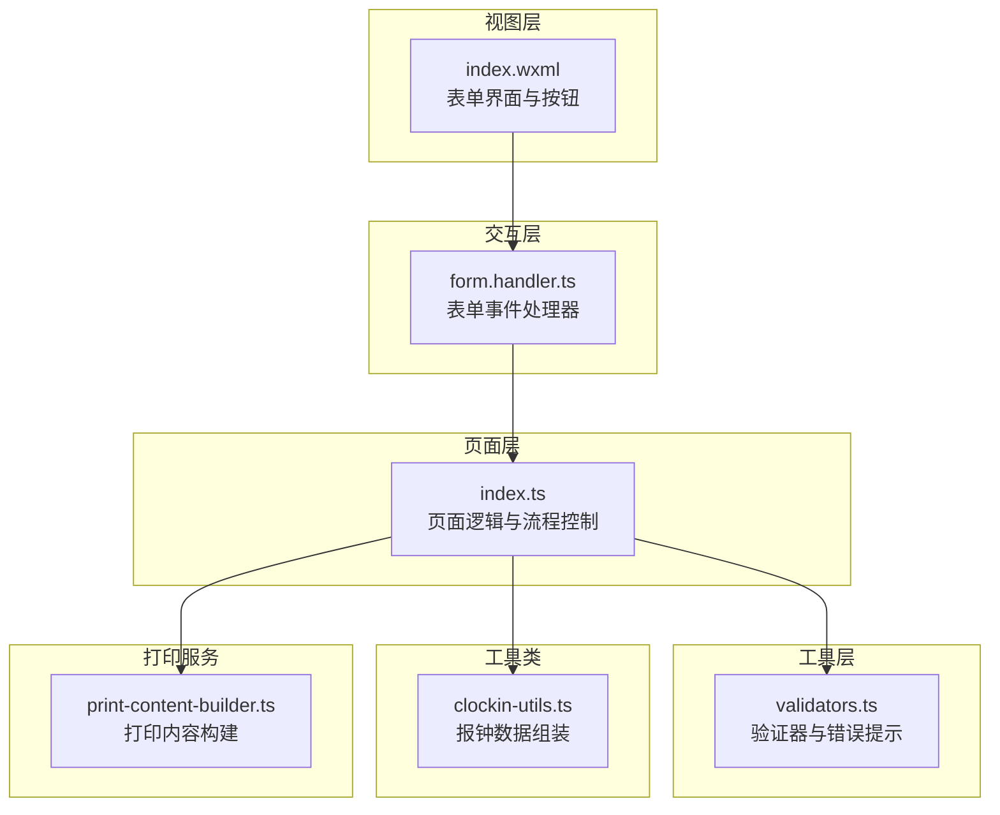
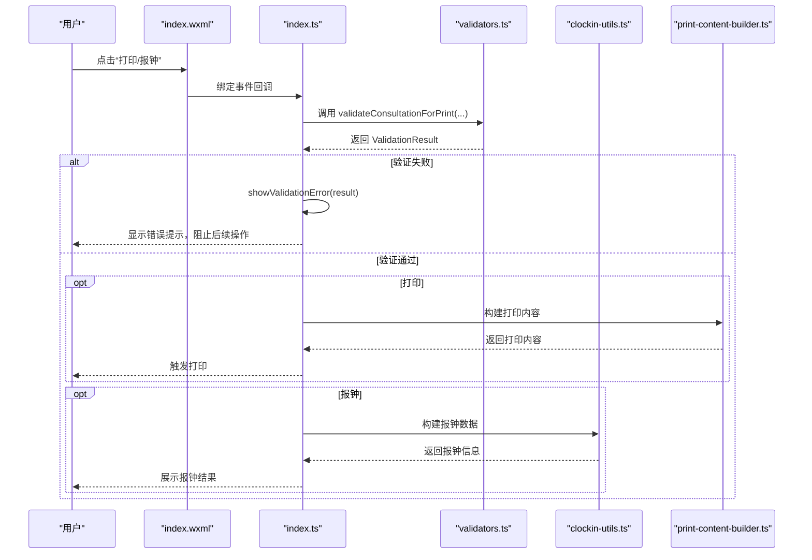
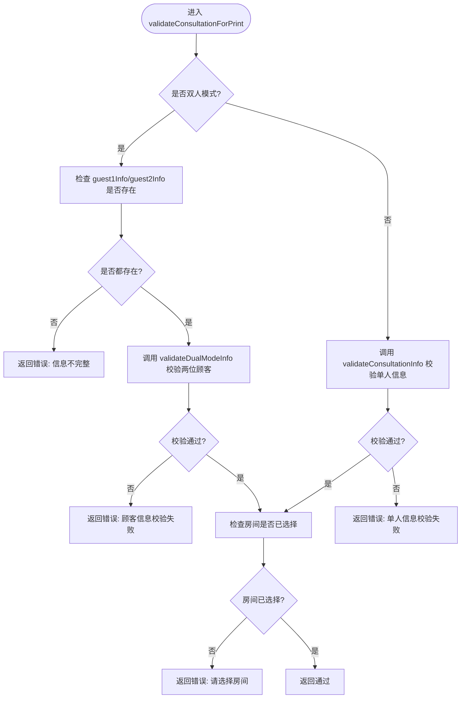
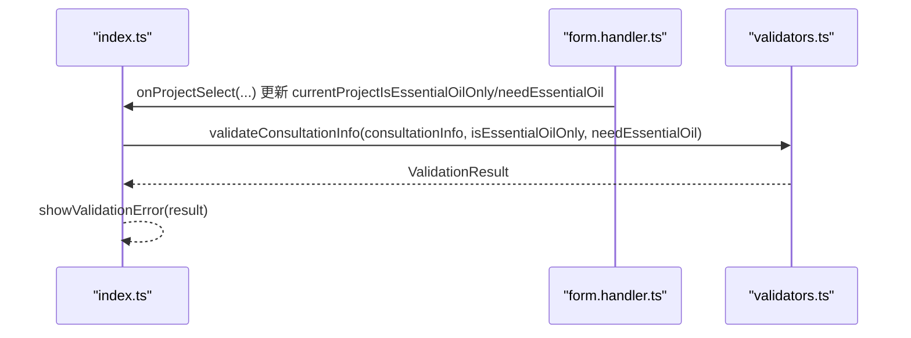
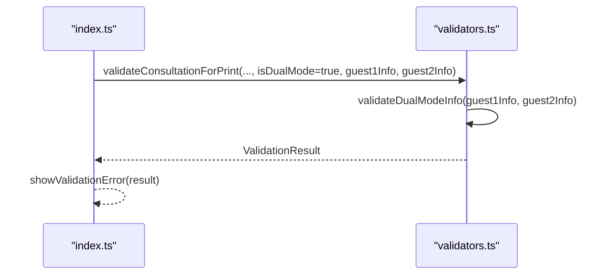
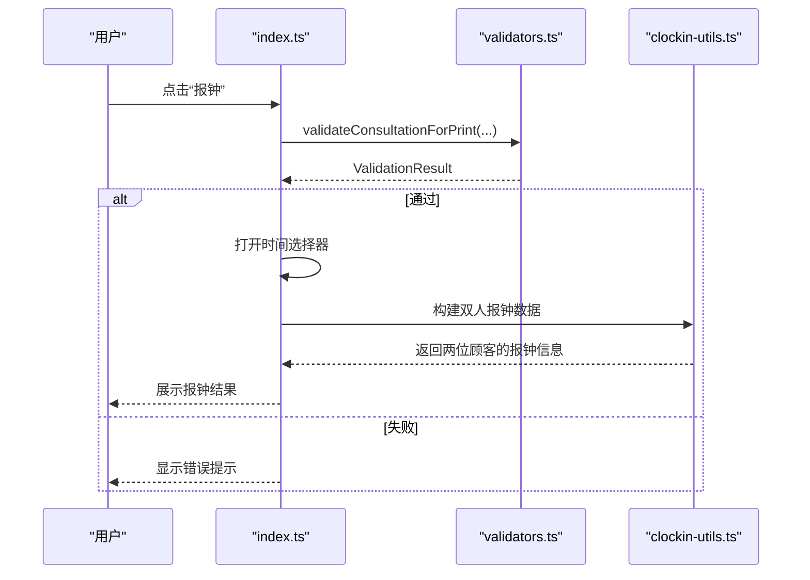
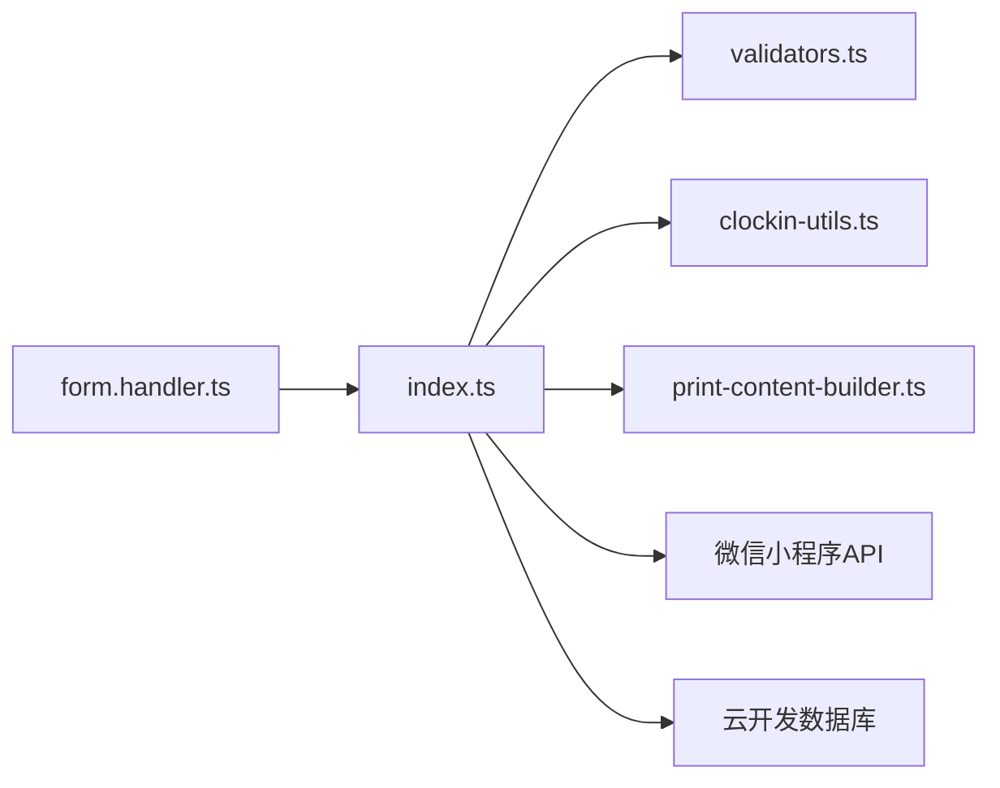

# 表单验证系统

<cite>
**本文引用的文件**
- [validators.ts](file://miniprogram/utils/validators.ts)
- [index.ts](file://miniprogram/pages/index/index.ts)
- [form.handler.ts](file://miniprogram/pages/index/handlers/form.handler.ts)
- [clockin-utils.ts](file://miniprogram/pages/index/utils/clockin-utils.ts)
- [index.wxml](file://miniprogram/pages/index/index.wxml)
- [print-content-builder.ts](file://miniprogram/services/print-content-builder.ts)
</cite>

## 目录
1. [简介](#简介)
2. [项目结构](#项目结构)
3. [核心组件](#核心组件)
4. [架构总览](#架构总览)
5. [详细组件分析](#详细组件分析)
6. [依赖关系分析](#依赖关系分析)
7. [性能考量](#性能考量)
8. [故障排查指南](#故障排查指南)
9. [结论](#结论)
10. [附录](#附录)

## 简介
本技术文档围绕“表单验证系统”展开，重点解析 validateConsultationForPrint 函数的验证逻辑与规则实现，覆盖必填字段检查、业务规则验证与数据一致性校验；详述单人模式、双人模式与报钟功能的验证场景；阐述验证结果的处理流程（错误信息收集、用户提示与阻止提交）；解释验证规则的动态性（按项目类型调整验证条件、按用户选择改变验证逻辑）；并提供扩展方法（自定义验证规则、验证消息定制、验证时机控制），辅以完整验证示例与调试指南，帮助开发者理解与维护该表单验证功能。

## 项目结构
本验证系统位于小程序前端工程中，采用分层设计：
- 工具层：validators.ts 提供通用验证器与错误提示工具
- 页面层：index.ts 聚合表单数据、调用验证器、触发打印或报钟流程
- 交互层：form.handler.ts 处理用户输入事件，更新表单数据
- 工具类：clockin-utils.ts 提供报钟相关的数据组装与格式化
- 视图层：index.wxml 定义表单界面与按钮绑定
- 打印服务：print-content-builder.ts 构建打印内容（与验证结果共同决定是否允许打印）

图表来源
- [index.wxml](file://miniprogram/pages/index/index.wxml#L164-L178)
- [form.handler.ts](file://miniprogram/pages/index/handlers/form.handler.ts#L1-L175)
- [index.ts](file://miniprogram/pages/index/index.ts#L1-L200)
- [validators.ts](file://miniprogram/utils/validators.ts#L1-L81)
- [clockin-utils.ts](file://miniprogram/pages/index/utils/clockin-utils.ts#L1-L184)
- [print-content-builder.ts](file://miniprogram/services/print-content-builder.ts#L1-L144)

章节来源
- [index.ts](file://miniprogram/pages/index/index.ts#L1-L200)
- [validators.ts](file://miniprogram/utils/validators.ts#L1-L81)
- [index.wxml](file://miniprogram/pages/index/index.wxml#L1-L200)

## 核心组件
- 验证器模块（validators.ts）
  - 提供 ValidationResult 接口与统一的错误提示工具
  - 提供 validateConsultationForPrint 主入口，支持单人/双人模式与房间必填校验
  - 提供 validateConsultationInfo、validateGuestInfo、validateDualModeInfo 等子验证器
- 页面控制器（index.ts）
  - 聚合表单数据（单人/双人模式、项目参数等）
  - 在打印与报钟前调用 validateConsultationForPrint
  - 统一错误提示与流程控制
- 表单事件处理器（form.handler.ts）
  - 响应用户输入，动态更新表单字段
  - 根据项目类型设置 isEssentialOilOnly 与 needEssentialOil 状态
- 报钟工具（clockin-utils.ts）
  - 构建双人报钟数据，计算开始/结束时间
- 视图（index.wxml）
  - 定义按钮绑定（打印、报钟），控制显示逻辑（如专属精油展示）

章节来源
- [validators.ts](file://miniprogram/utils/validators.ts#L1-L81)
- [index.ts](file://miniprogram/pages/index/index.ts#L605-L624)
- [form.handler.ts](file://miniprogram/pages/index/handlers/form.handler.ts#L33-L55)
- [clockin-utils.ts](file://miniprogram/pages/index/utils/clockin-utils.ts#L111-L182)
- [index.wxml](file://miniprogram/pages/index/index.wxml#L164-L178)

## 架构总览
validateConsultationForPrint 的调用链路如下：

图表来源
- [index.wxml](file://miniprogram/pages/index/index.wxml#L164-L178)
- [index.ts](file://miniprogram/pages/index/index.ts#L605-L624)
- [validators.ts](file://miniprogram/utils/validators.ts#L51-L72)
- [clockin-utils.ts](file://miniprogram/pages/index/utils/clockin-utils.ts#L111-L182)
- [print-content-builder.ts](file://miniprogram/services/print-content-builder.ts#L31-L80)

## 详细组件分析

### validateConsultationForPrint 验证逻辑与规则实现
- 输入参数
  - consultationInfo：基础咨询单信息
  - isEssentialOilOnly：当前项目是否为“专属精油项目”
  - needEssentialOil：当前项目是否需要精油
  - isDualMode：是否启用双人模式
  - guest1Info/guest2Info：双人模式下的两位顾客信息
- 核心规则
  - 双人模式：若开启且缺少任意一位顾客信息，则直接失败
  - 双人模式：分别对两位顾客执行 validateGuestInfo 校验
  - 单人模式：对 consultationInfo 执行 validateConsultationInfo 校验
  - 房间必填：无论单人/双人，均要求房间已选择
- 错误提示
  - 使用统一的 ValidationResult 结构，错误时返回 message
  - 通过 showValidationError 将错误以 toast 形式反馈给用户

图表来源
- [validators.ts](file://miniprogram/utils/validators.ts#L51-L72)

章节来源
- [validators.ts](file://miniprogram/utils/validators.ts#L51-L72)
- [validators.ts](file://miniprogram/utils/validators.ts#L39-L49)
- [validators.ts](file://miniprogram/utils/validators.ts#L26-L37)
- [validators.ts](file://miniprogram/utils/validators.ts#L6-L24)

### 必填字段检查与业务规则验证
- 必填字段
  - 性别、项目、技师、房间
- 业务规则
  - 精油选择规则：当 isEssentialOilOnly 为 false 且 needEssentialOil 为 true 时，必须选择精油
- 数据一致性校验
  - 双人模式下，两位顾客的字段相互独立，但房间字段共享，需确保房间一致

章节来源
- [validators.ts](file://miniprogram/utils/validators.ts#L6-L24)
- [validators.ts](file://miniprogram/utils/validators.ts#L26-L37)
- [validators.ts](file://miniprogram/utils/validators.ts#L39-L49)

### 验证场景处理机制

#### 单人模式验证
- 流程
  - 调用 validateConsultationInfo 对 consultationInfo 进行字段与业务规则校验
  - 最终校验房间是否已选择
- 关键点
  - isEssentialOilOnly 与 needEssentialOil 决定是否强制选择精油
  - 表单事件处理器在项目变更时同步更新这两个状态

图表来源
- [form.handler.ts](file://miniprogram/pages/index/handlers/form.handler.ts#L33-L55)
- [validators.ts](file://miniprogram/utils/validators.ts#L6-L24)
- [index.ts](file://miniprogram/pages/index/index.ts#L605-L611)

章节来源
- [form.handler.ts](file://miniprogram/pages/index/handlers/form.handler.ts#L33-L55)
- [validators.ts](file://miniprogram/utils/validators.ts#L6-L24)
- [index.ts](file://miniprogram/pages/index/index.ts#L605-L611)

#### 双人模式验证
- 流程
  - 若任一顾客信息缺失，立即失败
  - 分别对两位顾客执行 validateGuestInfo 校验
  - 最终校验房间是否已选择
- 关键点
  - 房间字段在双人模式下为共享字段，需保持一致
  - 两位顾客的“是否报钟”“券码/平台”等字段独立

图表来源
- [validators.ts](file://miniprogram/utils/validators.ts#L51-L72)
- [validators.ts](file://miniprogram/utils/validators.ts#L39-L49)

章节来源
- [validators.ts](file://miniprogram/utils/validators.ts#L51-L72)
- [validators.ts](file://miniprogram/utils/validators.ts#L39-L49)

#### 报钟功能验证
- 流程
  - 在点击“报钟”按钮时，先调用 validateConsultationForPrint 进行校验
  - 校验通过后打开时间选择器，允许用户选择上钟开始时间
  - 双人模式下，使用 clockin-utils 构建两位顾客的报钟数据并保存
- 关键点
  - 报钟前的验证与打印前的验证共用同一套规则
  - 双人报钟会同时保存两位顾客的记录并生成报钟内容

图表来源
- [index.ts](file://miniprogram/pages/index/index.ts#L605-L624)
- [validators.ts](file://miniprogram/utils/validators.ts#L51-L72)
- [clockin-utils.ts](file://miniprogram/pages/index/utils/clockin-utils.ts#L111-L182)

章节来源
- [index.ts](file://miniprogram/pages/index/index.ts#L605-L624)
- [clockin-utils.ts](file://miniprogram/pages/index/utils/clockin-utils.ts#L111-L182)

### 验证结果处理流程
- 错误信息收集
  - validateConsultationForPrint 返回 ValidationResult，包含 isValid 与 message
- 用户提示
  - showValidationError 统一处理：若无效则通过 toast 显示错误消息
- 阻止提交
  - 在打印与报钟前均进行校验，失败即终止后续流程

章节来源
- [validators.ts](file://miniprogram/utils/validators.ts#L74-L80)
- [index.ts](file://miniprogram/pages/index/index.ts#L605-L611)

### 验证规则的动态性
- 项目类型驱动
  - 项目选择事件会更新 currentProjectIsEssentialOilOnly 与 currentProjectNeedEssentialOil
  - validateConsultationInfo 依据这两个状态决定是否强制选择精油
- 用户选择影响
  - 用户在表单中选择项目、技师、房间、精油等，都会触发数据更新与后续校验
- 双人模式切换
  - 切换模式时，页面会复制/还原数据，确保验证规则在不同模式下正确生效

章节来源
- [form.handler.ts](file://miniprogram/pages/index/handlers/form.handler.ts#L33-L55)
- [index.ts](file://miniprogram/pages/index/index.ts#L149-L196)

### 验证系统的扩展方法
- 自定义验证规则
  - 新增验证器函数，遵循 ValidationResult 接口
  - 在 validateConsultationForPrint 中组合调用
- 验证消息定制
  - 在各验证器内部返回 message 字段，统一由 showValidationError 展示
- 验证时机控制
  - 可在表单事件处理器中按需触发校验（如 onProjectSelect 后立即校验）
  - 在打印/报钟按钮点击前集中校验，避免重复逻辑

章节来源
- [validators.ts](file://miniprogram/utils/validators.ts#L1-L81)
- [form.handler.ts](file://miniprogram/pages/index/handlers/form.handler.ts#L33-L55)
- [index.ts](file://miniprogram/pages/index/index.ts#L605-L611)

## 依赖关系分析
- 模块耦合
  - index.ts 依赖 validators.ts（验证）、clockin-utils.ts（报钟）、print-content-builder.ts（打印）
  - form.handler.ts 仅负责数据更新，不直接参与验证逻辑
- 外部依赖
  - 微信小程序 API（wx.showToast、wx.navigateTo 等）
  - 云开发数据库（cloudDb）用于查询与保存数据

图表来源
- [index.ts](file://miniprogram/pages/index/index.ts#L1-L200)
- [validators.ts](file://miniprogram/utils/validators.ts#L1-L81)
- [clockin-utils.ts](file://miniprogram/pages/index/utils/clockin-utils.ts#L1-L184)
- [print-content-builder.ts](file://miniprogram/services/print-content-builder.ts#L1-L144)

章节来源
- [index.ts](file://miniprogram/pages/index/index.ts#L1-L200)
- [validators.ts](file://miniprogram/utils/validators.ts#L1-L81)

## 性能考量
- 验证复杂度
  - validateConsultationForPrint 为 O(1) 级别，主要为字段存在性与业务规则判断
  - validateDualModeInfo 为 O(n) 级别，n 为顾客数量（此处 n=2）
- 渲染与交互
  - 表单事件处理器仅更新本地数据，避免频繁网络请求
  - 报钟与打印流程在验证通过后才发起异步操作，减少无效调用

## 故障排查指南
- 常见问题
  - “请选择房间”错误：确认房间选择器已正确赋值
  - “请选择精油”错误：检查项目是否为“专属精油项目”或“需要精油”，并确认 isEssentialOilOnly/needEssentialOil 状态
  - “双人模式信息不完整”：确保两位顾客信息均已填写
- 调试建议
  - 在 validateConsultationForPrint 处打断点，检查入参状态
  - 在 form.handler.ts 的项目选择事件中确认 currentProjectIsEssentialOilOnly/needEssentialOil 是否正确更新
  - 在 index.ts 的报钟/打印回调中确认 showValidationError 的返回值

章节来源
- [validators.ts](file://miniprogram/utils/validators.ts#L51-L72)
- [form.handler.ts](file://miniprogram/pages/index/handlers/form.handler.ts#L33-L55)
- [index.ts](file://miniprogram/pages/index/index.ts#L605-L611)

## 结论
validateConsultationForPrint 将“单人/双人模式”“项目类型”“房间必填”等多维规则整合为统一的验证入口，配合 showValidationError 实现一致的用户反馈。通过 form.handler.ts 的事件处理与 index.ts 的流程控制，系统实现了灵活的动态验证与可靠的业务闭环。扩展方面，新增验证器、定制消息与控制时机均具备清晰的接入点，便于后续演进。

## 附录
- 验证示例路径
  - 单人模式验证：[index.ts](file://miniprogram/pages/index/index.ts#L605-L611)
  - 双人模式验证：[validators.ts](file://miniprogram/utils/validators.ts#L51-L72)
  - 报钟验证与流程：[index.ts](file://miniprogram/pages/index/index.ts#L605-L624)
- 调试要点
  - 断点位置：validators.ts 的 validateConsultationForPrint、form.handler.ts 的 onProjectSelect、index.ts 的报钟/打印回调
  - 关注状态：currentProjectIsEssentialOilOnly、currentProjectNeedEssentialOil、isDualMode、guest1Info/guest2Info、consultationInfo.room