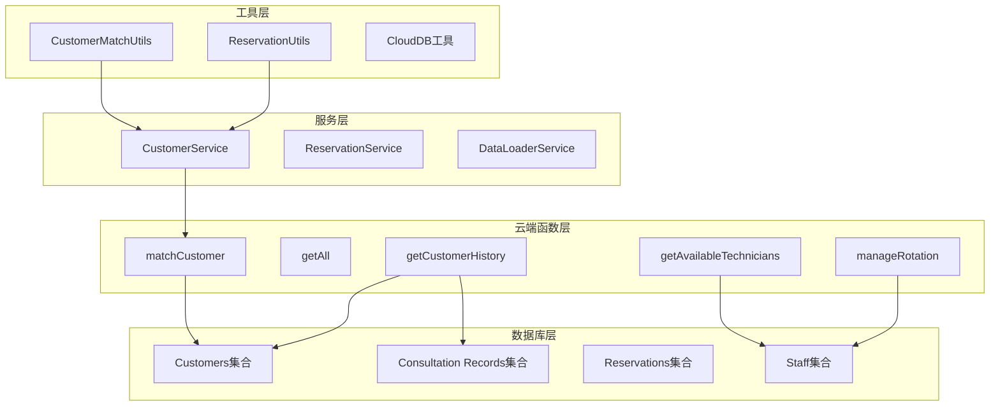
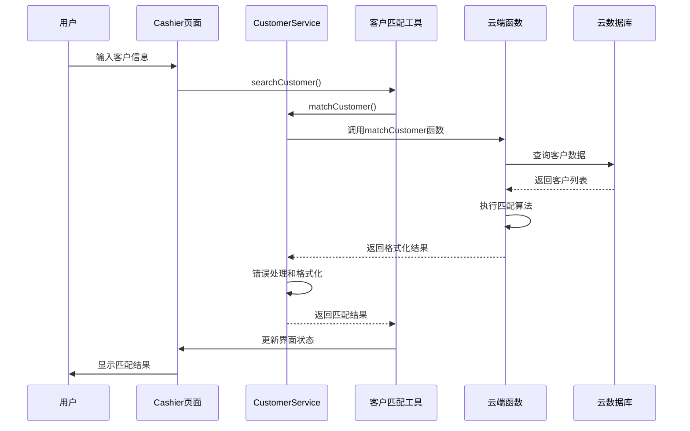
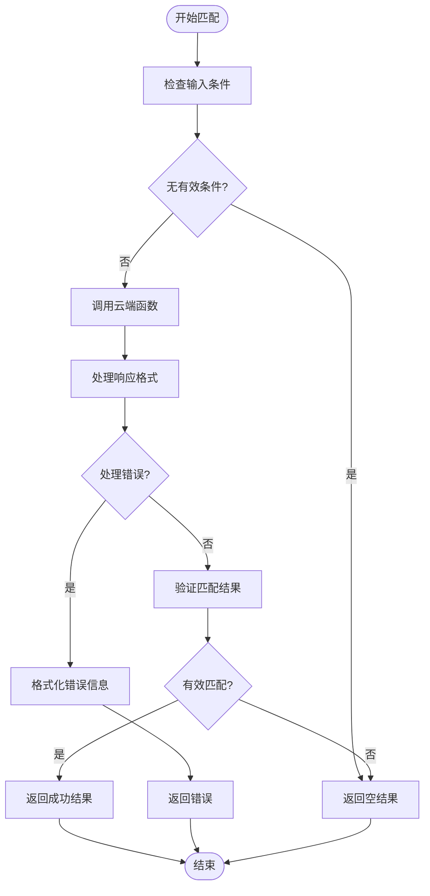
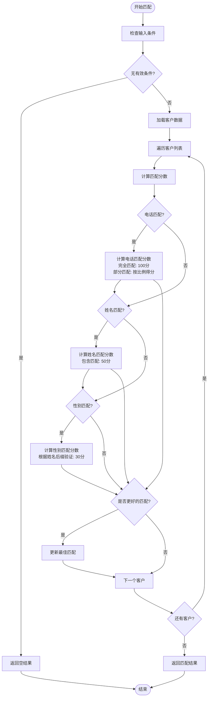
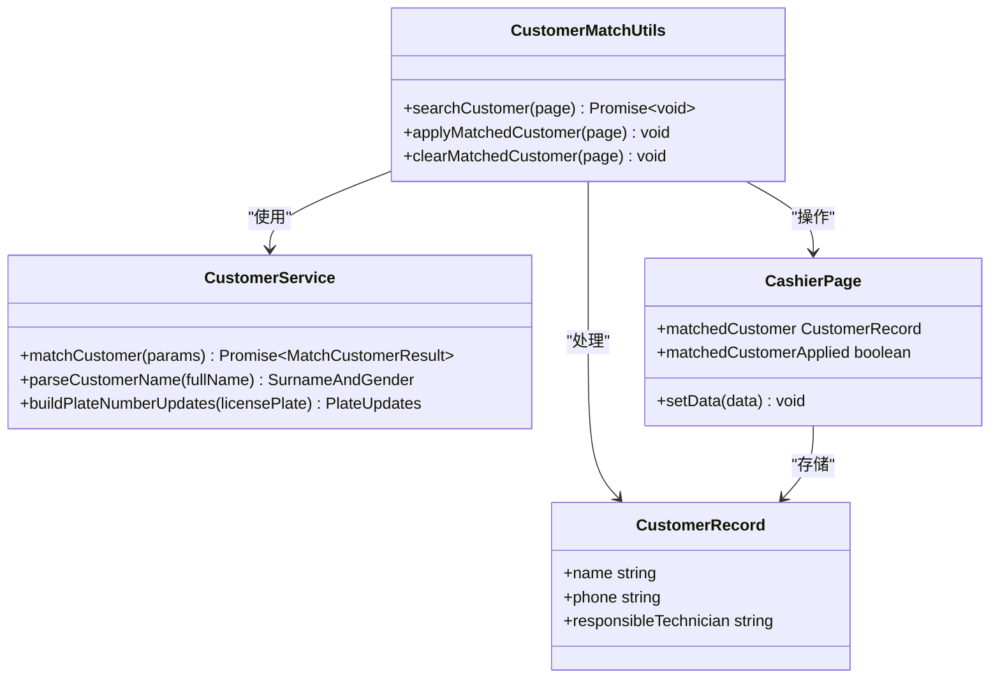
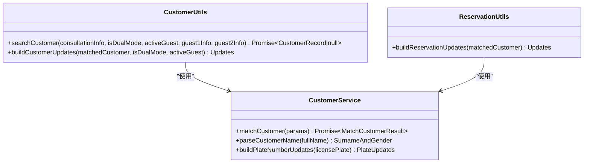
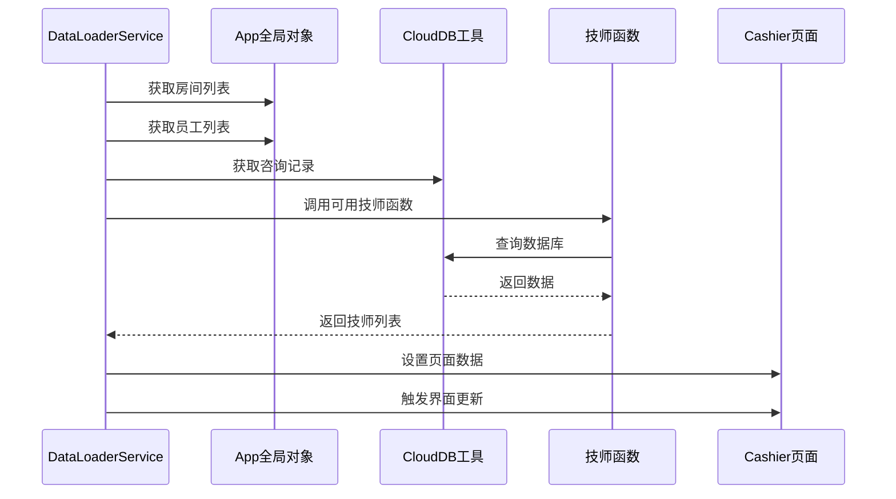
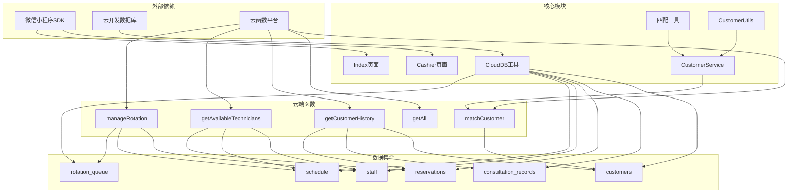

# 客户匹配工具

<cite>
**本文档引用的文件**
- [customer.service.ts](file://miniprogram/services/customer.service.ts)
- [matchCustomer/index.js](file://cloudfunctions/matchCustomer/index.js)
- [customer-match.ts](file://miniprogram/pages/cashier/utils/customer-match.ts)
- [cashier.types.ts](file://miniprogram/pages/cashier/cashier.types.ts)
- [cashier.ts](file://miniprogram/pages/cashier/cashier.ts)
- [reservation.handler.ts](file://miniprogram/pages/cashier/handlers/reservation.handler.ts)
- [customer-utils.ts](file://miniprogram/pages/index/utils/customer-utils.ts)
- [reservation.types.ts](file://miniprogram/types/reservation.types.ts)
- [cloud-db.ts](file://miniprogram/utils/cloud-db.ts)
- [app.ts](file://miniprogram/app.ts)
- [getAll/index.js](file://cloudfunctions/getAll/index.js)
- [getCustomerHistory/index.js](file://cloudfunctions/getCustomerHistory/index.js)
- [getAvailableTechnicians/index.js](file://cloudfunctions/getAvailableTechnicians/index.js)
- [manageRotation/index.js](file://cloudfunctions/manageRotation/index.js)
- [data-loader.service.ts](file://miniprogram/pages/cashier/services/data-loader.service.ts)
- [index.ts](file://miniprogram/pages/index/index.ts)
</cite>

## 更新摘要
**变更内容**
- 新增统一服务层架构，提供标准化的客户匹配接口
- 增强错误处理和响应格式化机制
- 改进姓名解析和电话号码处理功能
- 优化云函数调用流程和参数传递
- 扩展服务层功能，支持更多业务场景

## 目录
1. [简介](#简介)
2. [项目结构](#项目结构)
3. [核心组件](#核心组件)
4. [架构概览](#架构概览)
5. [详细组件分析](#详细组件分析)
6. [依赖关系分析](#依赖关系分析)
7. [性能考虑](#性能考虑)
8. [故障排除指南](#故障排除指南)
9. [结论](#结论)

## 简介

客户匹配工具是一个基于微信小程序开发的智能客户识别和匹配系统，主要用于按摩店等服务行业的客户管理。该系统通过云端函数实现高效的客户匹配算法，结合前端界面提供直观的用户体验，能够根据客户姓名、性别和电话号码进行精确匹配，并提供历史记录查询、技师可用性检查等功能。

**更新** 系统现已重构为三层架构：服务层提供统一接口，工具层处理业务逻辑，云端函数执行具体匹配算法，实现了更好的代码组织和可维护性。

## 项目结构

该项目采用三层架构设计，主要分为以下几个层次：

**图表来源**
- [customer.service.ts:1-91](file://miniprogram/services/customer.service.ts#L1-L91)
- [customer-match.ts:1-91](file://miniprogram/pages/cashier/utils/customer-match.ts#L1-L91)
- [cashier.ts:1-200](file://miniprogram/pages/cashier/cashier.ts#L1-L200)

**章节来源**
- [customer.service.ts:1-91](file://miniprogram/services/customer.service.ts#L1-L91)
- [customer-match.ts:1-91](file://miniprogram/pages/cashier/utils/customer-match.ts#L1-L91)
- [cashier.ts:1-200](file://miniprogram/pages/cashier/cashier.ts#L1-L200)

## 核心组件

### 统一服务层

**更新** 新增的统一服务层提供了标准化的客户匹配接口，封装了所有云函数调用和错误处理逻辑。该层支持多种匹配条件组合，包括姓名模糊匹配、电话号码精确匹配和性别验证，并提供统一的响应格式。

### 增强的匹配工具

前端匹配工具现在通过统一服务层进行云函数调用，提供了更强大的功能：
- 自动搜索：当用户输入姓名或电话时自动触发匹配
- 结果展示：在界面中显示匹配的客户信息
- 一键应用：将匹配的客户信息应用到预约表单
- 状态管理：跟踪匹配状态和应用状态
- 姓名解析：智能提取客户姓名中的姓氏和性别信息

### 数据加载服务

数据加载服务负责管理页面的数据获取和缓存，确保用户界面的响应性和数据的实时性。它支持并行数据加载，优化了用户体验。

**章节来源**
- [customer.service.ts:1-91](file://miniprogram/services/customer.service.ts#L1-L91)
- [customer-match.ts:1-91](file://miniprogram/pages/cashier/utils/customer-match.ts#L1-L91)
- [data-loader.service.ts:1-241](file://miniprogram/pages/cashier/services/data-loader.service.ts#L1-L241)

## 架构概览

系统采用三层架构设计，实现了清晰的职责分离和标准化的服务接口：

**图表来源**
- [cashier.ts:10-11](file://miniprogram/pages/cashier/cashier.ts#L10-L11)
- [customer.service.ts:21-57](file://miniprogram/services/customer.service.ts#L21-L57)
- [customer-match.ts:8-35](file://miniprogram/pages/cashier/utils/customer-match.ts#L8-L35)

## 详细组件分析

### 统一服务层实现

**更新** 新增的CustomerService提供了标准化的客户匹配接口，具有以下关键特性：

**图表来源**
- [customer.service.ts:21-57](file://miniprogram/services/customer.service.ts#L21-L57)

统一服务层的关键特性：
- **标准化接口**：提供统一的MatchCustomerParams和MatchCustomerResult接口
- **错误处理**：集中处理云函数调用异常和数据格式错误
- **响应格式化**：确保所有调用返回一致的数据结构
- **参数验证**：对输入参数进行验证和清理
- **类型安全**：使用TypeScript接口确保类型安全

**章节来源**
- [customer.service.ts:1-91](file://miniprogram/services/customer.service.ts#L1-L91)

### 增强的匹配算法实现

匹配算法采用了多维度评分机制，为不同的匹配条件分配不同的权重：

**图表来源**
- [matchCustomer/index.js:27-56](file://cloudfunctions/matchCustomer/index.js#L27-L56)

匹配算法的关键特性：
- **电话匹配优先级**：完全匹配得100分，部分匹配按匹配比例得分
- **姓名匹配**：包含匹配得50分
- **性别验证**：根据姓名后缀验证性别，得30分
- **最低阈值**：只有分数≥30才被视为有效匹配

**章节来源**
- [matchCustomer/index.js:1-71](file://cloudfunctions/matchCustomer/index.js#L1-L71)

### 前端匹配工具

前端匹配工具提供了完整的客户匹配功能，包括搜索、应用和清理操作：

**图表来源**
- [customer.service.ts:62-90](file://miniprogram/services/customer.service.ts#L62-L90)
- [customer-match.ts:1-91](file://miniprogram/pages/cashier/utils/customer-match.ts#L1-L91)
- [cashier.types.ts:88-89](file://miniprogram/pages/cashier/cashier.types.ts#L88-L89)

前端工具的主要功能：
- **自动搜索**：当用户输入姓名或电话时自动触发匹配
- **结果展示**：在界面中显示匹配的客户信息
- **一键应用**：将匹配的客户信息应用到预约表单
- **状态管理**：跟踪匹配状态和应用状态
- **姓名解析**：智能提取客户姓名中的性别信息

**章节来源**
- [customer-match.ts:1-91](file://miniprogram/pages/cashier/utils/customer-match.ts#L1-L91)
- [cashier.types.ts:1-122](file://miniprogram/pages/cashier/cashier.types.ts#L1-L122)

### 增强的工具类功能

**更新** 新增了CustomerUtils类，提供更全面的客户管理功能：

**图表来源**
- [customer-utils.ts:1-86](file://miniprogram/pages/index/utils/customer-utils.ts#L1-L86)

CustomerUtils类的关键功能：
- **多场景支持**：支持单人和双人模式的客户匹配
- **智能更新**：根据匹配结果自动更新表单数据
- **车牌号处理**：支持新能源车和普通车的车牌号格式
- **责任技师关联**：自动关联匹配客户的责任技师

**章节来源**
- [customer-utils.ts:1-86](file://miniprogram/pages/index/utils/customer-utils.ts#L1-L86)

### 数据加载服务

数据加载服务负责管理页面的初始化数据加载和缓存：

**图表来源**
- [data-loader.service.ts:30-85](file://miniprogram/pages/cashier/services/data-loader.service.ts#L30-L85)

**章节来源**
- [data-loader.service.ts:1-241](file://miniprogram/pages/cashier/services/data-loader.service.ts#L1-L241)

### 云端函数架构

系统提供了多个专门的云端函数来处理不同的业务场景：

| 函数名 | 功能描述 | 主要用途 |
|--------|----------|----------|
| matchCustomer | 客户匹配算法 | 预约创建时的客户搜索 |
| getAll | 数据批量获取 | 全量数据导出和备份 |
| getCustomerHistory | 客户历史查询 | 历史记录查看和统计 |
| getAvailableTechnicians | 技师可用性检查 | 预约冲突检测 |
| manageRotation | 轮牌管理系统 | 技师轮班和优先级管理 |

**章节来源**
- [getAll/index.js:1-59](file://cloudfunctions/getAll/index.js#L1-L59)
- [getCustomerHistory/index.js:1-100](file://cloudfunctions/getCustomerHistory/index.js#L1-L100)
- [getAvailableTechnicians/index.js:1-285](file://cloudfunctions/getAvailableTechnicians/index.js#L1-L285)
- [manageRotation/index.js:1-327](file://cloudfunctions/manageRotation/index.js#L1-L327)

## 依赖关系分析

系统的依赖关系呈现清晰的分层结构：

**图表来源**
- [cloud-db.ts:303-321](file://miniprogram/utils/cloud-db.ts#L303-L321)
- [app.ts:1-191](file://miniprogram/app.ts#L1-L191)

**章节来源**
- [cloud-db.ts:1-321](file://miniprogram/utils/cloud-db.ts#L1-L321)
- [app.ts:1-191](file://miniprogram/app.ts#L1-L191)

## 性能考虑

### 数据库查询优化

系统在数据库查询方面采用了多项优化策略：

1. **批量查询**：使用getAll函数实现批量数据获取，避免多次网络请求
2. **条件查询**：云端函数直接在数据库层面执行查询，减少数据传输
3. **缓存机制**：App全局对象维护数据缓存，避免重复加载
4. **服务层缓存**：CustomerService内部缓存最近的匹配结果，减少重复调用

### 算法复杂度分析

匹配算法的时间复杂度为O(n)，其中n为客户数量：
- 单次匹配：O(n) - 遍历所有客户
- 批量匹配：O(n*m) - n为客户数，m为匹配条件数

空间复杂度为O(1)，只使用常量额外空间存储匹配结果。

### 网络优化

1. **并行加载**：使用Promise.all实现多个数据源的并行加载
2. **懒加载**：按需加载数据，避免不必要的网络请求
3. **错误处理**：完善的异常处理机制，确保系统稳定性
4. **服务层优化**：统一的错误处理和响应格式化减少了重复代码

## 故障排除指南

### 常见问题及解决方案

#### 匹配结果不准确
**问题描述**：匹配结果与预期不符
**可能原因**：
- 匹配条件过于宽松或严格
- 客户数据格式不规范
- 匹配算法权重设置不当
- 姓名解析错误

**解决方法**：
1. 检查客户姓名和电话号码的格式
2. 调整匹配条件的权重设置
3. 清理重复的客户记录
4. 验证姓名中的性别标识符

#### 服务层调用失败
**问题描述**：CustomerService调用失败
**可能原因**：
- 云函数调用超时
- 网络连接不稳定
- 参数格式错误
- 云端函数执行异常

**解决方法**：
1. 检查网络连接状态
2. 验证输入参数的格式和类型
3. 查看云端函数的执行日志
4. 重试服务调用操作

#### 数据加载失败
**问题描述**：页面数据无法正常加载
**可能原因**：
- 网络连接不稳定
- 云端函数调用超时
- 数据库权限问题
- 服务层缓存异常

**解决方法**：
1. 检查网络连接状态
2. 重试数据加载操作
3. 检查云端函数的执行日志
4. 清理服务层缓存

#### 技师可用性检查异常
**问题描述**：技师可用性显示不正确
**可能原因**：
- 时间计算错误
- 冲突检测逻辑问题
- 数据同步延迟
- 服务层参数传递错误

**解决方法**：
1. 验证时间格式和时区设置
2. 检查预约冲突检测逻辑
3. 等待数据同步完成
4. 重新初始化服务层

**章节来源**
- [customer.service.ts:50-56](file://miniprogram/services/customer.service.ts#L50-L56)
- [matchCustomer/index.js:64-69](file://cloudfunctions/matchCustomer/index.js#L64-L69)
- [reservation.handler.ts:187-194](file://miniprogram/pages/cashier/handlers/reservation.handler.ts#L187-L194)

## 结论

客户匹配工具经过架构重构后，现在是一个功能完整、架构清晰、易于维护的服务行业客户管理解决方案。系统通过统一的服务层、标准化的接口和增强的功能特性，为用户提供高效、准确的客户匹配体验。

### 主要优势

1. **统一服务层**：标准化的接口设计，便于扩展和维护
2. **智能匹配算法**：多维度评分机制，支持灵活的匹配条件组合
3. **增强的姓名解析**：智能提取客户姓名中的性别信息
4. **完善的错误处理**：集中化的错误处理和响应格式化
5. **实时数据同步**：云端函数实现实时数据查询和更新
6. **用户友好界面**：直观的操作界面和即时反馈机制
7. **扩展性强**：模块化设计便于功能扩展和维护

### 技术特点

- 采用三层架构设计，职责分离明确
- 实现了完整的错误处理和异常恢复机制
- 优化了数据加载和网络请求性能
- 提供了丰富的日志和监控功能
- 支持多场景的客户匹配需求

### 未来改进方向

1. **机器学习集成**：引入AI算法提升匹配准确性
2. **多语言支持**：扩展国际化功能
3. **移动端优化**：针对不同设备优化用户体验
4. **数据分析功能**：增加客户行为分析和预测功能
5. **缓存策略优化**：实现更智能的数据缓存机制

该系统为服务行业提供了可靠的客户管理基础设施，能够显著提升工作效率和客户满意度。通过统一的服务层架构，系统具备了更好的可维护性和扩展性，为未来的功能升级奠定了坚实的基础。