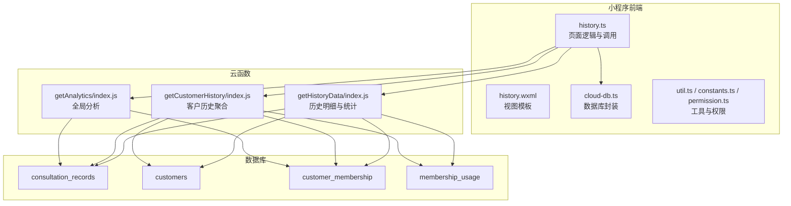
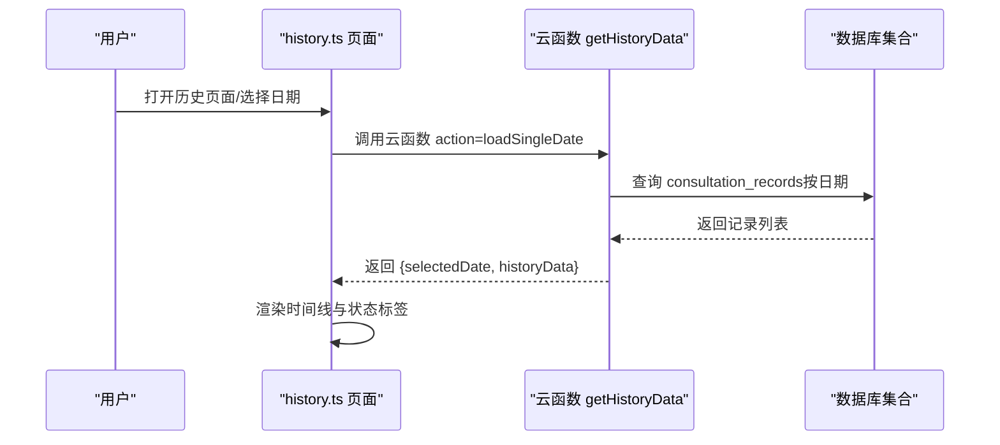
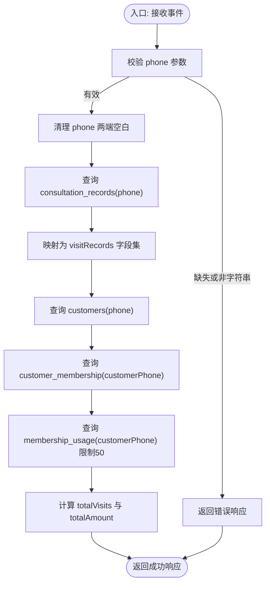
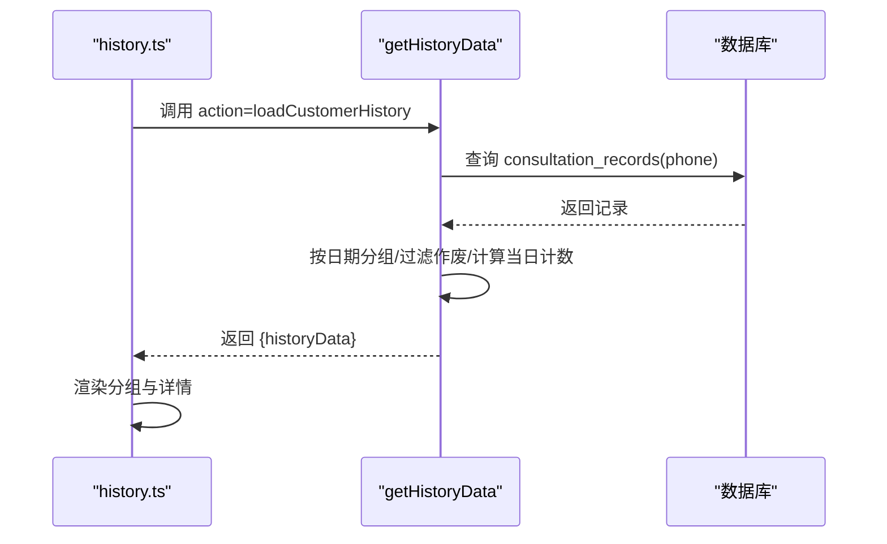
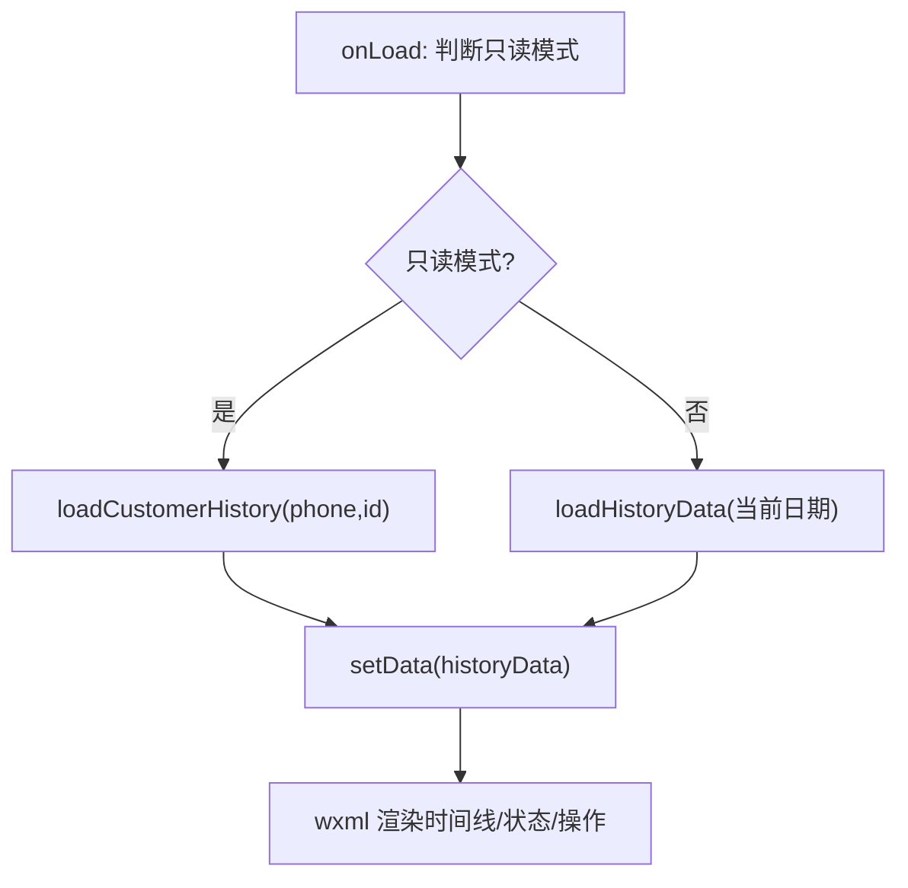
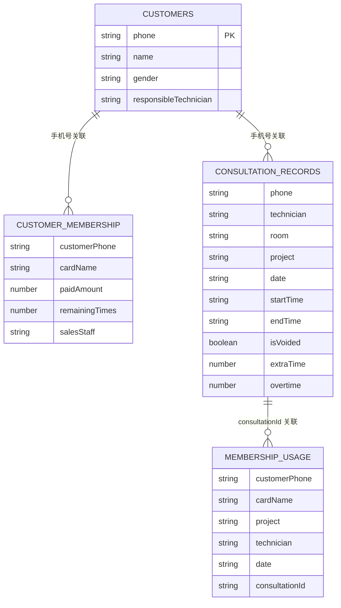
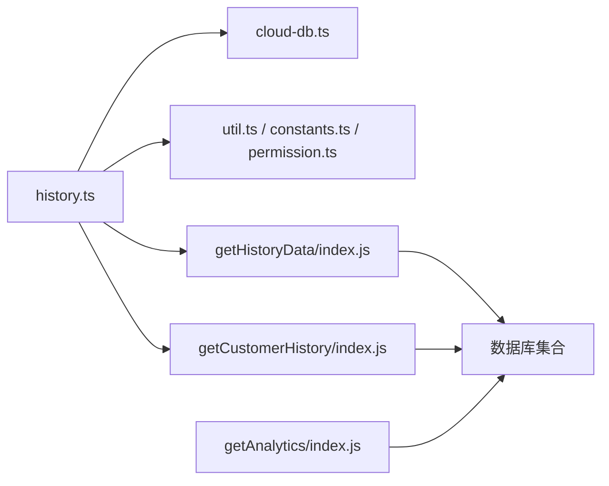

# 客户历史记录查询

<cite>
**本文引用的文件**
- [getCustomerHistory/index.js](file://cloudfunctions/getCustomerHistory/index.js)
- [getHistoryData/index.js](file://cloudfunctions/getHistoryData/index.js)
- [history.ts](file://miniprogram/pages/history/history.ts)
- [history.wxml](file://miniprogram/pages/history/history.wxml)
- [cloud-db.ts](file://miniprogram/utils/cloud-db.ts)
- [constants.ts](file://miniprogram/utils/constants.ts)
- [permission.ts](file://miniprogram/utils/permission.ts)
- [getAnalytics/index.js](file://cloudfunctions/getAnalytics/index.js)
- [util.ts](file://miniprogram/utils/util.ts)
- [format.wxs](file://miniprogram/pages/history/format.wxs)
- [index.d.ts](file://typings/index.d.ts)
- [app.json](file://miniprogram/app.json)
</cite>

## 目录
1. [简介](#简介)
2. [项目结构](#项目结构)
3. [核心组件](#核心组件)
4. [架构总览](#架构总览)
5. [详细组件分析](#详细组件分析)
6. [依赖分析](#依赖分析)
7. [性能考虑](#性能考虑)
8. [故障排查指南](#故障排查指南)
9. [结论](#结论)
10. [附录](#附录)

## 简介
本技术文档围绕“客户历史记录查询”功能展开，重点解析云函数 getCustomerHistory 的实现机制与前端交互流程，涵盖历史数据检索、时间范围过滤、分页查询优化、数据结构与关联关系、展示逻辑（时间线排序、状态标识、详情查看）、统计分析（消费频次、偏好分析）、数据隐私与权限控制，以及实际查询场景与 API 使用示例。

## 项目结构
该功能涉及小程序前端页面与云开发后端云函数协同工作：
- 小程序前端负责用户交互、调用云函数、渲染历史记录与统计结果。
- 云函数负责数据库查询、聚合统计与返回标准化数据结构。

图表来源
- [history.ts](file://miniprogram/pages/history/history.ts#L108-L186)
- [getHistoryData/index.js](file://cloudfunctions/getHistoryData/index.js#L88-L250)
- [getCustomerHistory/index.js](file://cloudfunctions/getCustomerHistory/index.js#L9-L99)

章节来源
- [history.ts](file://miniprogram/pages/history/history.ts#L75-L98)
- [getHistoryData/index.js](file://cloudfunctions/getHistoryData/index.js#L88-L250)
- [getCustomerHistory/index.js](file://cloudfunctions/getCustomerHistory/index.js#L9-L99)

## 核心组件
- getCustomerHistory 云函数：按手机号聚合客户历史，返回咨询记录、客户信息、会员卡与使用记录，并计算总次数与总金额。
- getHistoryData 云函数：支持按日期加载、按客户加载、生成每日统计与月度评分排行。
- 前端 history 页面：负责调用云函数、渲染历史记录、展示详情、处理加钟/提前下钟/作废/删除等操作。
- 数据库集合：consultation_records、customers、customer_membership、membership_usage。

章节来源
- [getCustomerHistory/index.js](file://cloudfunctions/getCustomerHistory/index.js#L9-L99)
- [getHistoryData/index.js](file://cloudfunctions/getHistoryData/index.js#L88-L250)
- [history.ts](file://miniprogram/pages/history/history.ts#L108-L186)

## 架构总览
整体流程：小程序页面通过 wx.cloud.callFunction 调用云函数，云函数读取数据库并返回结构化数据；前端根据返回数据渲染时间线、状态标签与操作按钮。

图表来源
- [history.ts](file://miniprogram/pages/history/history.ts#L146-L186)
- [getHistoryData/index.js](file://cloudfunctions/getHistoryData/index.js#L88-L113)

## 详细组件分析

### getCustomerHistory 云函数
职责与流程：
- 参数校验：要求传入字符串类型的 phone。
- 咨询记录检索：按 phone 查询 consultation_records，按创建时间倒序，限制返回条数。
- 客户信息与会员信息：查询 customers 与 customer_membership，按创建时间倒序。
- 会员使用记录：查询 membership_usage，按创建时间倒序，限制返回条数。
- 统计汇总：计算 visitRecords 总数与未作废记录的总金额。

图表来源
- [getCustomerHistory/index.js](file://cloudfunctions/getCustomerHistory/index.js#L9-L99)

章节来源
- [getCustomerHistory/index.js](file://cloudfunctions/getCustomerHistory/index.js#L9-L99)

### getHistoryData 云函数
职责与流程：
- 单日加载（loadSingleDate）：按 targetDate 查询 consultation_records，计算当日每个技师的当日计数、开始/结束时间、是否进行中等字段，按创建时间倒序。
- 全部日期加载（loadAllDates）：统计所有唯一日期并返回最近日期及对应记录。
- 客户历史加载（loadCustomerHistory）：按客户手机号查询咨询记录，按日期分组，过滤作废记录，计算当日计数并排序。
- 每日统计（getDailySummary）：统计技师项目分布、打卡次数、加钟/加班情况，并生成月度销售与出勤评分排行。

图表来源
- [getHistoryData/index.js](file://cloudfunctions/getHistoryData/index.js#L150-L250)
- [history.ts](file://miniprogram/pages/history/history.ts#L108-L143)

章节来源
- [getHistoryData/index.js](file://cloudfunctions/getHistoryData/index.js#L88-L250)

### 前端历史页面（history.ts/wxml）
- 页面加载：根据只读模式（readonly=true）决定是否以客户模式加载历史。
- 调用云函数：支持按日期加载与按客户加载两种方式。
- 展示逻辑：按日期分组，每条记录支持折叠/展开、查看详情、提前下钟、加钟、作废、删除等操作。
- 统计生成：支持生成每日总结并推送至企业微信。

图表来源
- [history.ts](file://miniprogram/pages/history/history.ts#L75-L98)
- [history.wxml](file://miniprogram/pages/history/history.wxml#L13-L102)

章节来源
- [history.ts](file://miniprogram/pages/history/history.ts#L75-L186)
- [history.wxml](file://miniprogram/pages/history/history.wxml#L13-L102)

### 数据模型与关联关系
- 咨询记录（consultation_records）：包含客户信息、技师、房间、项目、时间、优惠平台与券码、结算信息等。
- 客户（customers）：客户基础信息（手机号、姓名、性别、责任技师等）。
- 会员卡（customer_membership）：客户与会员卡的关联，含销售员工、原价、实付、剩余次数等。
- 会员使用（membership_usage）：会员卡使用记录，关联咨询单 ID。

图表来源
- [index.d.ts](file://typings/index.d.ts#L37-L83)
- [index.d.ts](file://typings/index.d.ts#L136-L183)

章节来源
- [index.d.ts](file://typings/index.d.ts#L37-L83)
- [index.d.ts](file://typings/index.d.ts#L136-L183)

### 展示逻辑与状态标识
- 时间线排序：按日期降序、记录按创建时间倒序排列。
- 状态标识：作废记录标记、进行中状态（基于当前时间与报钟/结束时间比较）、每日计数（同一技师当日完成数）。
- 详情查看：点击记录头/详情区域弹出模态框展示完整信息。
- 操作按钮：根据权限与记录状态显示修改、提前下钟、加钟、作废、删除等按钮。

章节来源
- [getHistoryData/index.js](file://cloudfunctions/getHistoryData/index.js#L33-L86)
- [history.ts](file://miniprogram/pages/history/history.ts#L188-L225)
- [history.wxml](file://miniprogram/pages/history/history.wxml#L24-L98)

### 统计分析功能
- 日常统计：按技师统计项目数量、打卡次数、加钟次数与总时长、加班时长。
- 月度评分：结合当月会员销售与出勤打卡生成综合评分并排行。
- 全局分析：getAnalytics 云函数支持按日期区间统计收入趋势、项目消费、平台消费、性别与车辆分布、会员卡销售金额等。

章节来源
- [getHistoryData/index.js](file://cloudfunctions/getHistoryData/index.js#L252-L394)
- [getAnalytics/index.js](file://cloudfunctions/getAnalytics/index.js#L53-L171)

### 数据隐私与访问权限
- 页面与按钮权限：通过角色权限表控制页面访问与按钮操作（如作废、删除、编辑等）。
- 用户认证：权限检查依赖当前登录用户信息，未登录或无权限将阻止访问或操作。
- 数据最小化：云函数仅返回必要的字段，避免泄露敏感信息。

章节来源
- [permission.ts](file://miniprogram/utils/permission.ts#L46-L161)
- [history.ts](file://miniprogram/pages/history/history.ts#L76-L78)

## 依赖分析
- 前端依赖：history.ts 依赖 cloud-db.ts 进行数据库操作封装；依赖 util.ts、constants.ts 提供格式化与枚举；依赖 permission.ts 控制权限。
- 云函数依赖：getCustomerHistory 与 getHistoryData 依赖 wx-server-sdk 与数据库命令；getAnalytics 依赖时间解析与聚合统计。
- 页面注册：app.json 中声明历史页面路径，确保路由可用。

图表来源
- [history.ts](file://miniprogram/pages/history/history.ts#L1-L7)
- [cloud-db.ts](file://miniprogram/utils/cloud-db.ts#L1-L321)
- [getHistoryData/index.js](file://cloudfunctions/getHistoryData/index.js#L1-L10)
- [getCustomerHistory/index.js](file://cloudfunctions/getCustomerHistory/index.js#L1-L7)
- [getAnalytics/index.js](file://cloudfunctions/getAnalytics/index.js#L1-L8)

章节来源
- [app.json](file://miniprogram/app.json#L2-L16)

## 性能考虑
- 查询优化
  - 咨询记录按 phone/date/createdAt 建立索引可显著提升按客户与按日期检索性能。
  - 分页查询：getHistoryData 对全量日期加载使用 limit 控制，避免一次性拉取过多数据。
- 计算优化
  - 前端对时间格式化与加钟/加班计算在本地完成，减少云函数重复计算。
  - getHistoryData 在单日加载时先按日期筛选再做计数，避免全表扫描。
- 缓存机制
  - 前端可对当前日期的历史数据进行内存缓存，切换日期时优先使用缓存，减少网络请求。
- 异步并发
  - 前端在生成每日总结时并发调用云函数与消息推送，缩短等待时间。

章节来源
- [getHistoryData/index.js](file://cloudfunctions/getHistoryData/index.js#L114-L148)
- [util.ts](file://miniprogram/utils/util.ts#L96-L105)

## 故障排查指南
- 云函数返回错误
  - 检查事件参数（如 phone、action、targetDate）是否正确传递。
  - 查看云函数日志定位异常堆栈。
- 前端调用失败
  - 确认 wx.cloud.callFunction 的 name 与 data 正确。
  - 检查返回结果的 code 字段与 message 提示。
- 权限不足
  - 确认当前用户角色具备相应页面与按钮权限。
- 数据不一致
  - 检查 isVoided 标记与作废后的状态更新是否生效。
  - 确认加钟/提前下钟更新后重新加载数据。

章节来源
- [history.ts](file://miniprogram/pages/history/history.ts#L110-L142)
- [getHistoryData/index.js](file://cloudfunctions/getHistoryData/index.js#L396-L410)

## 结论
该历史记录查询功能通过云函数与前端页面的协同，实现了按客户与按日期的历史检索、时间线展示、状态标识与操作能力，并提供了统计分析与权限控制。建议在生产环境中完善索引设计、引入前端缓存与更细粒度的权限校验，持续优化查询性能与用户体验。

## 附录

### API 使用示例
- 获取客户历史（按客户模式）
  - 请求：调用云函数 getHistoryData，action=loadCustomerHistory，传入 customerPhone 与 customerId。
  - 响应：返回按日期分组的历史数据与统计信息。
- 获取单日历史
  - 请求：调用云函数 getHistoryData，action=loadSingleDate，传入 targetDate。
  - 响应：返回指定日期的历史数据与日期导航信息。
- 获取每日统计
  - 请求：调用云函数 getHistoryData，action=getDailySummary，传入 targetDate。
  - 响应：返回技师统计与月度评分排行。
- 获取客户历史（聚合）
  - 请求：调用云函数 getCustomerHistory，传入 phone。
  - 响应：返回客户信息、咨询记录、会员卡与使用记录、总次数与总金额。

章节来源
- [history.ts](file://miniprogram/pages/history/history.ts#L108-L186)
- [getHistoryData/index.js](file://cloudfunctions/getHistoryData/index.js#L88-L250)
- [getCustomerHistory/index.js](file://cloudfunctions/getCustomerHistory/index.js#L9-L99)