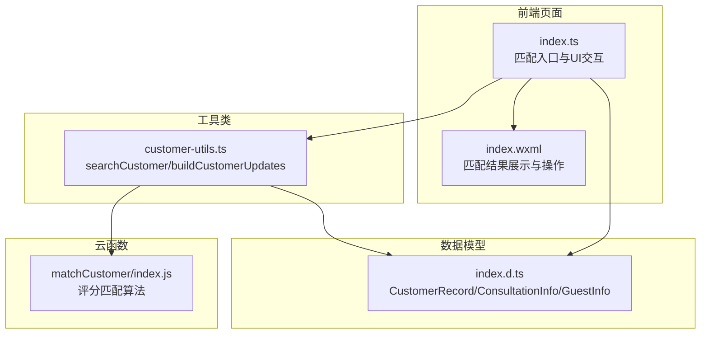
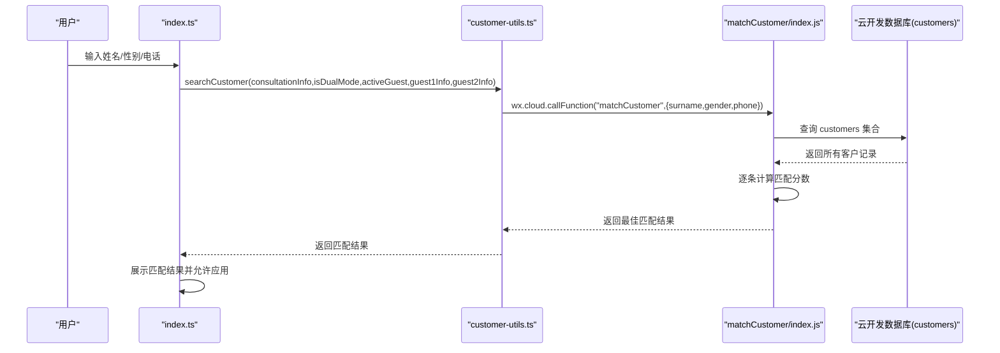
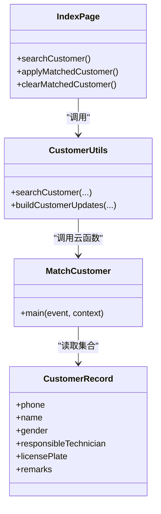

# 客户搜索与匹配

<cite>
**本文档引用的文件**
- [matchCustomer/index.js](file://cloudfunctions/matchCustomer/index.js)
- [customer-utils.ts](file://miniprogram/pages/index/utils/customer-utils.ts)
- [index.ts](file://miniprogram/pages/index/index.ts)
- [index.wxml](file://miniprogram/pages/index/index.wxml)
- [cloud-db.ts](file://miniprogram/utils/cloud-db.ts)
- [index.d.ts](file://typings/index.d.ts)
</cite>

## 目录
1. [简介](#简介)
2. [项目结构](#项目结构)
3. [核心组件](#核心组件)
4. [架构总览](#架构总览)
5. [详细组件分析](#详细组件分析)
6. [依赖关系分析](#依赖关系分析)
7. [性能考量](#性能考量)
8. [故障排查指南](#故障排查指南)
9. [结论](#结论)
10. [附录](#附录)

## 简介
本文件面向“客户搜索与匹配”功能，围绕以下目标展开：
- 深入解释 searchCustomer 方法的算法逻辑，覆盖姓名、性别、电话号码的组合匹配策略
- 详解 matchCustomer 云函数的实现原理，包括数据库查询优化、模糊匹配算法与结果排序机制
- 阐述双人模式下的匹配逻辑差异，明确 activeGuest 参数作用与 guest1Info/guest2Info 的处理方式
- 解释匹配优先级规则与去重策略
- 提供匹配成功率优化建议与性能调优方案
- 给出异常处理机制与错误日志记录建议
- 提供典型匹配场景与代码示例路径

## 项目结构
该功能涉及前端页面、工具类与云函数三层协作：
- 前端页面负责收集用户输入并触发匹配请求
- 工具类封装匹配调用与结果应用逻辑
- 云函数负责对客户集合进行评分匹配并返回最佳结果

图表来源
- [index.ts](file://miniprogram/pages/index/index.ts#L564-L602)
- [customer-utils.ts](file://miniprogram/pages/index/utils/customer-utils.ts#L1-L121)
- [matchCustomer/index.js](file://cloudfunctions/matchCustomer/index.js#L1-L71)
- [index.d.ts](file://typings/index.d.ts#L37-L71)

章节来源
- [index.ts](file://miniprogram/pages/index/index.ts#L564-L602)
- [customer-utils.ts](file://miniprogram/pages/index/utils/customer-utils.ts#L1-L121)
- [matchCustomer/index.js](file://cloudfunctions/matchCustomer/index.js#L1-L71)
- [index.d.ts](file://typings/index.d.ts#L37-L71)

## 核心组件
- 前端匹配入口：index.ts 中的 searchCustomer 方法，负责根据当前模式与输入触发匹配
- 匹配工具类：customer-utils.ts 封装了 searchCustomer 与 buildCustomerUpdates，统一处理双人模式与字段映射
- 云函数：matchCustomer/index.js 实现评分匹配算法，返回最佳匹配结果
- 数据模型：CustomerRecord、ConsultationInfo、GuestInfo 定义了匹配所需的数据结构

章节来源
- [index.ts](file://miniprogram/pages/index/index.ts#L564-L602)
- [customer-utils.ts](file://miniprogram/pages/index/utils/customer-utils.ts#L1-L121)
- [matchCustomer/index.js](file://cloudfunctions/matchCustomer/index.js#L1-L71)
- [index.d.ts](file://typings/index.d.ts#L37-L71)

## 架构总览
整体流程：用户在页面输入姓名/性别/电话，前端根据当前模式选择匹配源，调用云函数进行评分匹配，返回最佳结果并在UI上展示与应用。

图表来源
- [index.ts](file://miniprogram/pages/index/index.ts#L564-L602)
- [customer-utils.ts](file://miniprogram/pages/index/utils/customer-utils.ts#L1-L121)
- [matchCustomer/index.js](file://cloudfunctions/matchCustomer/index.js#L9-L70)

## 详细组件分析

### searchCustomer 方法与双人模式逻辑
- 双人模式下，activeGuest 决定当前匹配源来自 guest1Info 还是 guest2Info；否则使用 consultationInfo
- 若当前匹配源的 surname 与 phone 均为空，则直接返回空，避免无效请求
- 调用 wx.cloud.callFunction 触发 matchCustomer 云函数，传入当前姓名、性别与手机号
- 对返回结果进行校验：仅当 code 为 0 且 data 存在时视为成功

章节来源
- [index.ts](file://miniprogram/pages/index/index.ts#L564-L602)
- [customer-utils.ts](file://miniprogram/pages/index/utils/customer-utils.ts#L1-L121)

### matchCustomer 云函数实现原理
- 输入参数：surname、gender、phone
- 条件校验：若 surname 与 phone 均为空，直接返回“无匹配条件”
- 数据查询：从 customers 集合读取全部记录（注意：当前实现为全量扫描）
- 匹配评分规则：
  - 电话匹配：若客户电话包含输入电话，按长度比计算加权分数；完全相等则直接高分
  - 姓名匹配：若客户姓名包含输入姓名，固定加分
  - 性别匹配：若客户姓名以“先生/女士”结尾，且与输入性别一致，固定加分
- 选择策略：保留分数最高且不低于阈值的记录作为最佳匹配
- 返回结构：包含 code、message、data、score 等字段

章节来源
- [matchCustomer/index.js](file://cloudfunctions/matchCustomer/index.js#L9-L70)

### 匹配优先级规则与去重策略
- 优先级（从高到低）：
  1) 电话完全匹配（100 分）
  2) 电话部分匹配（按长度比加权，最多 80 分）
  3) 姓名包含匹配（50 分）
  4) 性别后缀匹配（30 分）
- 去重策略：当前实现为线性扫描，未做重复项过滤；若存在多条同名同号记录，将按评分选择其一
- 阈值：仅当最终评分达到阈值以上才返回匹配结果

章节来源
- [matchCustomer/index.js](file://cloudfunctions/matchCustomer/index.js#L27-L56)

### 双人模式下的匹配差异
- activeGuest 参数决定当前活跃顾客标签，影响匹配源字段来源
- guest1Info/guest2Info 独立存储各自的信息，双人模式下可分别匹配不同客户
- 应用匹配时，buildCustomerUpdates 会根据 isDualMode 与 activeGuest 将匹配结果写回到对应字段

章节来源
- [index.ts](file://miniprogram/pages/index/index.ts#L149-L207)
- [customer-utils.ts](file://miniprogram/pages/index/utils/customer-utils.ts#L51-L98)

### UI 展示与交互
- 匹配结果以卡片形式展示，包含姓名、手机号、责任技师与备注等
- 提供“应用”与“清除”操作，应用后将匹配信息写回表单字段

章节来源
- [index.wxml](file://miniprogram/pages/index/index.wxml#L129-L150)

## 依赖关系分析

图表来源
- [index.ts](file://miniprogram/pages/index/index.ts#L564-L602)
- [customer-utils.ts](file://miniprogram/pages/index/utils/customer-utils.ts#L1-L121)
- [matchCustomer/index.js](file://cloudfunctions/matchCustomer/index.js#L1-L71)
- [index.d.ts](file://typings/index.d.ts#L137-L144)

章节来源
- [index.ts](file://miniprogram/pages/index/index.ts#L564-L602)
- [customer-utils.ts](file://miniprogram/pages/index/utils/customer-utils.ts#L1-L121)
- [matchCustomer/index.js](file://cloudfunctions/matchCustomer/index.js#L1-L71)
- [index.d.ts](file://typings/index.d.ts#L137-L144)

## 性能考量
当前实现的性能瓶颈主要在于云函数侧对 customers 集合的全量扫描。针对此，建议如下优化方案：
- 数据库索引优化
  - 在 phone 字段建立索引，加速包含匹配与前缀匹配
  - 在 name 字段建立索引，提升姓名包含匹配效率
- 云函数查询优化
  - 使用 where 条件限制查询范围，如先按 phone 精确或模糊过滤，再按 name 过滤
  - 限制返回字段与数量，避免一次性返回过多数据
- 评分算法优化
  - 为每个候选记录设置最小匹配阈值，提前短路，减少后续评分计算
  - 引入缓存策略：对高频查询结果进行短期缓存
- 前端交互优化
  - 在用户输入过程中增加防抖，避免频繁触发匹配
  - 对空输入或无效输入直接短路，不发起云函数调用

[本节为通用性能建议，不直接分析具体文件，故无章节来源]

## 故障排查指南
- 常见问题
  - 无匹配条件：当 surname 与 phone 均为空时，直接返回“无匹配条件”，需确保至少提供一项
  - 云函数调用失败：检查云函数部署状态与权限配置
  - 返回结果为空：确认 customers 集合中是否存在匹配数据；检查评分阈值是否过高
- 日志与错误处理
  - 云函数内部捕获异常并返回标准化错误消息
  - 前端工具类对返回结果进行类型校验，若非对象或 code 非 0 则视为失败
  - 建议在前端增加 toast 提示与重试机制，提升用户体验

章节来源
- [matchCustomer/index.js](file://cloudfunctions/matchCustomer/index.js#L12-L18)
- [matchCustomer/index.js](file://cloudfunctions/matchCustomer/index.js#L64-L69)
- [customer-utils.ts](file://miniprogram/pages/index/utils/customer-utils.ts#L37-L48)

## 结论
该功能通过前端工具类与云函数协同，实现了基于姓名、性别、电话的组合匹配。当前实现简洁直观，但在大数据量场景下存在全量扫描的性能隐患。建议优先完善数据库索引与查询条件，其次优化评分阈值与缓存策略，最后在前端增加防抖与短路逻辑，以显著提升匹配成功率与响应速度。

[本节为总结性内容，不直接分析具体文件，故无章节来源]

## 附录

### 匹配场景示例
- 场景一：仅提供手机号
  - 输入：phone=138xxxx
  - 匹配：customers 中包含该号码的记录，按长度比评分，返回最佳匹配
- 场景二：提供姓名与性别
  - 输入：surname=张, gender=male
  - 匹配：customers 中姓名包含“张”的记录，若以“先生”结尾则加分，返回最佳匹配
- 场景三：双人模式
  - 输入：activeGuest=1，guest1Info.surname=李, guest1Info.phone=139xxxx
  - 匹配：仅对 guest1Info 的字段进行匹配，应用时写回 guest1Info

章节来源
- [index.ts](file://miniprogram/pages/index/index.ts#L149-L207)
- [customer-utils.ts](file://miniprogram/pages/index/utils/customer-utils.ts#L1-L121)
- [matchCustomer/index.js](file://cloudfunctions/matchCustomer/index.js#L27-L56)