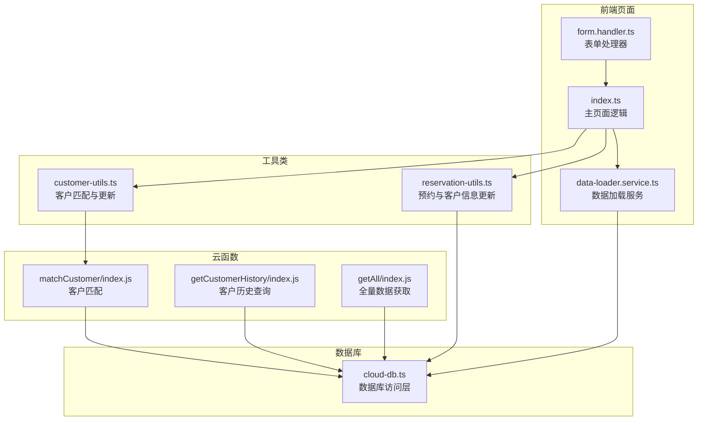
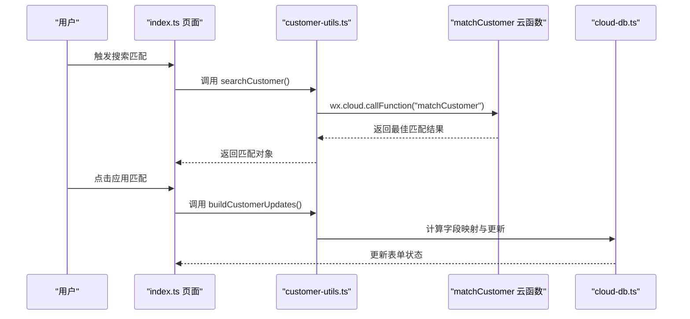
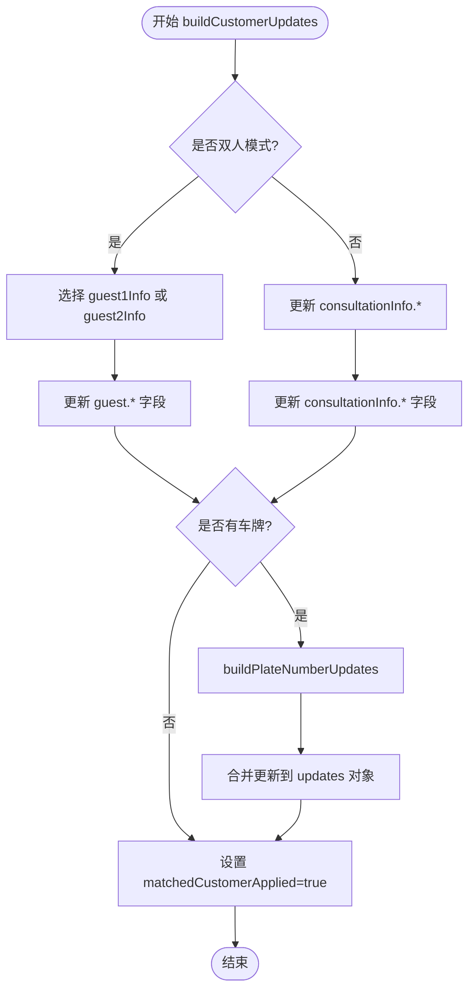
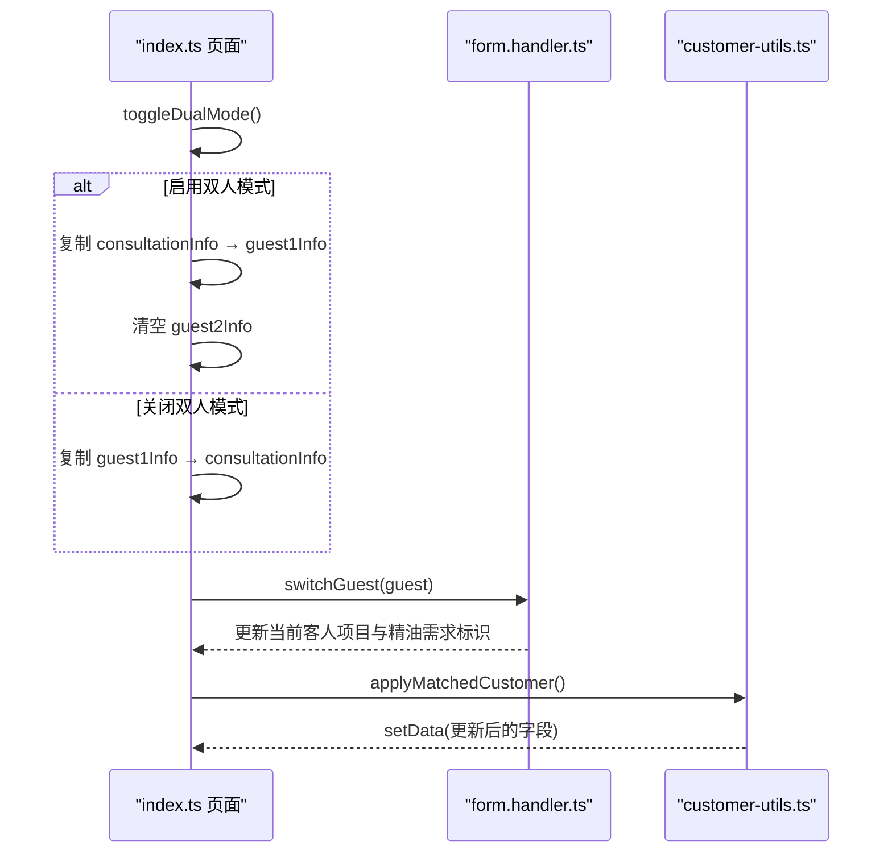
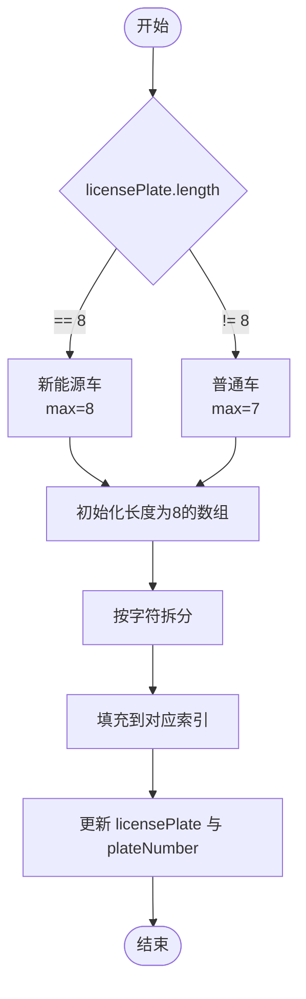
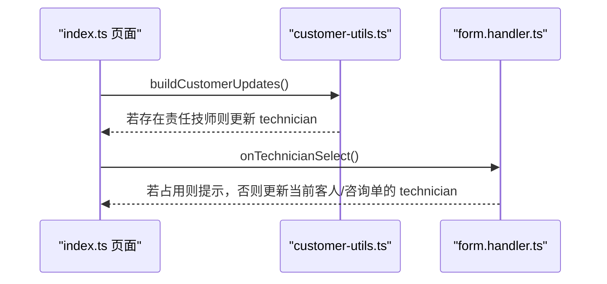
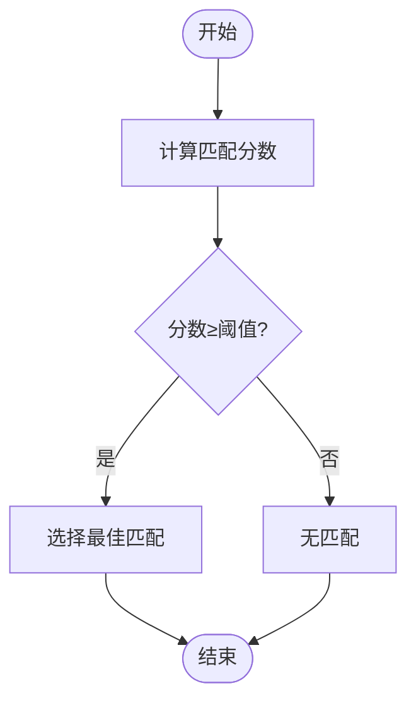
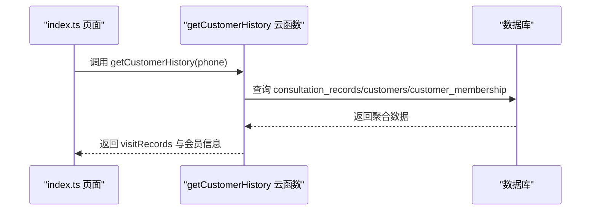
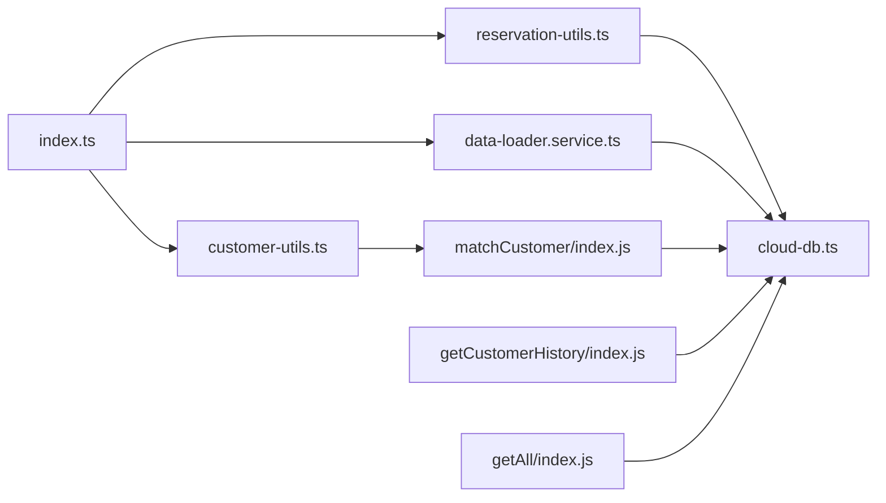

# 客户数据更新机制

<cite>
**本文档引用的文件**
- [index.ts](file://miniprogram/pages/index/index.ts)
- [customer-utils.ts](file://miniprogram/pages/index/utils/customer-utils.ts)
- [reservation-utils.ts](file://miniprogram/pages/index/utils/reservation-utils.ts)
- [data-loader.service.ts](file://miniprogram/pages/index/services/data-loader.service.ts)
- [cloud-db.ts](file://miniprogram/utils/cloud-db.ts)
- [matchCustomer/index.js](file://cloudfunctions/matchCustomer/index.js)
- [getCustomerHistory/index.js](file://cloudfunctions/getCustomerHistory/index.js)
- [getAll/index.js](file://cloudfunctions/getAll/index.js)
- [form.handler.ts](file://miniprogram/pages/index/handlers/form.handler.ts)
</cite>

## 目录
1. [简介](#简介)
2. [项目结构](#项目结构)
3. [核心组件](#核心组件)
4. [架构总览](#架构总览)
5. [详细组件分析](#详细组件分析)
6. [依赖关系分析](#依赖关系分析)
7. [性能考虑](#性能考虑)
8. [故障排查指南](#故障排查指南)
9. [结论](#结论)
10. [附录](#附录)

## 简介
本文件面向“客户数据更新机制”的实现与使用，重点围绕以下目标展开：
- 深入解释 buildCustomerUpdates 方法的工作原理，包括字段映射与更新策略
- 详细说明双人模式下的数据更新逻辑，包括 guest1Info 与 guest2Info 的区分处理
- 阐述车牌号数据的特殊处理机制，包括新能源车与普通车辆的差异化处理
- 解释责任技师字段的自动填充规则与手动修改选项
- 提供数据更新的事务性保证与回滚机制建议
- 包含数据一致性检查与冲突处理策略
- 解释更新操作的日志记录与审计功能
- 提供实际的更新场景与代码示例路径，包括成功案例与异常处理

## 项目结构
该功能涉及前端页面、工具类、服务层以及云函数协同工作：
- 前端页面负责用户交互与状态管理
- 工具类封装匹配与更新逻辑
- 服务层负责数据加载与一致性处理
- 云函数提供数据库查询与聚合能力

**图表来源**
- [index.ts](file://miniprogram/pages/index/index.ts#L1-L735)
- [customer-utils.ts](file://miniprogram/pages/index/utils/customer-utils.ts#L1-L121)
- [reservation-utils.ts](file://miniprogram/pages/index/utils/reservation-utils.ts#L1-L173)
- [data-loader.service.ts](file://miniprogram/pages/index/services/data-loader.service.ts#L1-L206)
- [cloud-db.ts](file://miniprogram/utils/cloud-db.ts#L1-L321)
- [matchCustomer/index.js](file://cloudfunctions/matchCustomer/index.js#L1-L71)
- [getCustomerHistory/index.js](file://cloudfunctions/getCustomerHistory/index.js#L1-L100)
- [getAll/index.js](file://cloudfunctions/getAll/index.js#L1-L59)

**章节来源**
- [index.ts](file://miniprogram/pages/index/index.ts#L1-L735)
- [customer-utils.ts](file://miniprogram/pages/index/utils/customer-utils.ts#L1-L121)
- [reservation-utils.ts](file://miniprogram/pages/index/utils/reservation-utils.ts#L1-L173)
- [data-loader.service.ts](file://miniprogram/pages/index/services/data-loader.service.ts#L1-L206)
- [cloud-db.ts](file://miniprogram/utils/cloud-db.ts#L1-L321)

## 核心组件
- 客户匹配与更新：通过云函数进行模糊匹配，生成字段映射并应用到表单状态
- 车牌号处理：根据长度判断新能源车与普通车，拆分为字符数组以便输入组件渲染
- 双人模式：guest1Info 与 guest2Info 独立维护，切换时保持当前客人信息隔离
- 数据库访问：统一的数据库访问层，支持插入、更新、分页查询等
- 事务性与一致性：前端采用串行更新策略，云函数内部分步执行，建议在关键路径引入原子性保障

**章节来源**
- [customer-utils.ts](file://miniprogram/pages/index/utils/customer-utils.ts#L51-L98)
- [reservation-utils.ts](file://miniprogram/pages/index/utils/reservation-utils.ts#L147-L171)
- [cloud-db.ts](file://miniprogram/utils/cloud-db.ts#L136-L188)

## 架构总览
客户数据更新流程从页面触发，经过工具类与服务层，最终落到数据库与云函数。

**图表来源**
- [index.ts](file://miniprogram/pages/index/index.ts#L564-L595)
- [customer-utils.ts](file://miniprogram/pages/index/utils/customer-utils.ts#L2-L49)
- [matchCustomer/index.js](file://cloudfunctions/matchCustomer/index.js#L9-L70)
- [cloud-db.ts](file://miniprogram/utils/cloud-db.ts#L108-L131)

## 详细组件分析

### 组件一：buildCustomerUpdates 字段映射与更新策略
- 双人模式区分：根据 activeGuest 决定更新 guest1Info 或 guest2Info；非双人模式则更新 consultationInfo
- 姓名与性别：去除“先生/女士”后缀，依据姓名后缀自动推断性别
- 责任技师：仅当匹配到的责任技师存在时才覆盖
- 手机号：若匹配到手机号则同步到咨询单的 phone 字段
- 车牌号：调用内部 buildPlateNumberUpdates，按长度区分新能源车与普通车，拆分为固定长度数组

**图表来源**
- [customer-utils.ts](file://miniprogram/pages/index/utils/customer-utils.ts#L51-L98)
- [customer-utils.ts](file://miniprogram/pages/index/utils/customer-utils.ts#L100-L119)

**章节来源**
- [customer-utils.ts](file://miniprogram/pages/index/utils/customer-utils.ts#L51-L98)
- [customer-utils.ts](file://miniprogram/pages/index/utils/customer-utils.ts#L100-L119)

### 组件二：双人模式下的数据更新逻辑
- 切换双人模式：启用时将当前咨询单信息复制到 guest1Info，并清空 guest2Info；关闭时将 guest1Info 复制回咨询单
- 客户切换：switchGuest 根据当前客人读取对应项目属性，动态更新精油需求标识
- 表单处理器：FormHandler 在双人模式下针对当前客人更新对应字段，避免跨客人污染

**图表来源**
- [index.ts](file://miniprogram/pages/index/index.ts#L149-L196)
- [index.ts](file://miniprogram/pages/index/index.ts#L198-L207)
- [form.handler.ts](file://miniprogram/pages/index/handlers/form.handler.ts#L10-L173)
- [customer-utils.ts](file://miniprogram/pages/index/utils/customer-utils.ts#L58-L97)

**章节来源**
- [index.ts](file://miniprogram/pages/index/index.ts#L149-L196)
- [index.ts](file://miniprogram/pages/index/index.ts#L198-L207)
- [form.handler.ts](file://miniprogram/pages/index/handlers/form.handler.ts#L10-L173)
- [customer-utils.ts](file://miniprogram/pages/index/utils/customer-utils.ts#L58-L97)

### 组件三：车牌号数据的特殊处理机制
- 新能源车识别：长度为 8 的车牌视为新能源车，普通车长度为 7
- 字符拆分：将车牌字符串拆分为固定长度数组，便于输入组件逐位渲染
- 输入组件：plateNumber 数组与 licensePlate 字段同时更新，确保前后端一致

**图表来源**
- [customer-utils.ts](file://miniprogram/pages/index/utils/customer-utils.ts#L100-L119)
- [data-loader.service.ts](file://miniprogram/pages/index/services/data-loader.service.ts#L95-L108)

**章节来源**
- [customer-utils.ts](file://miniprogram/pages/index/utils/customer-utils.ts#L100-L119)
- [data-loader.service.ts](file://miniprogram/pages/index/services/data-loader.service.ts#L95-L108)

### 组件四：责任技师字段的自动填充与手动修改
- 自动填充：当匹配到的责任技师存在时，自动填充到当前客人或咨询单的 technician 字段
- 手动修改：用户仍可手动选择其他技师，覆盖自动填充值
- 冲突处理：FormHandler 在选择时会检查占用状态并提示

**图表来源**
- [customer-utils.ts](file://miniprogram/pages/index/utils/customer-utils.ts#L65-L67)
- [form.handler.ts](file://miniprogram/pages/index/handlers/form.handler.ts#L57-L70)

**章节来源**
- [customer-utils.ts](file://miniprogram/pages/index/utils/customer-utils.ts#L65-L67)
- [form.handler.ts](file://miniprogram/pages/index/handlers/form.handler.ts#L57-L70)

### 组件五：数据更新的事务性保证与回滚机制
- 现状：前端采用串行更新（如保存咨询单与删除预约），云函数内部分步执行
- 建议：
  - 在关键路径引入数据库事务（如云函数内原子性更新多个集合）
  - 对外暴露幂等接口，避免重复提交导致的数据不一致
  - 引入补偿机制：对失败的操作记录日志并提供重试入口

**章节来源**
- [index.ts](file://miniprogram/pages/index/index.ts#L387-L481)
- [reservation-utils.ts](file://miniprogram/pages/index/utils/reservation-utils.ts#L14-L24)

### 组件六：数据一致性检查与冲突处理策略
- 客户匹配评分：matchCustomer 云函数基于手机号包含度、姓名包含度、性别后缀匹配计算分数，仅当达到阈值才返回匹配
- 冲突检测：FormHandler 在技师选择时检查占用状态并提示
- 预约重新分配：保存成功后调用 reassignFutureReservations，按轮牌与可用性重新分配未来预约

**图表来源**
- [matchCustomer/index.js](file://cloudfunctions/matchCustomer/index.js#L27-L56)

**章节来源**
- [matchCustomer/index.js](file://cloudfunctions/matchCustomer/index.js#L27-L56)
- [form.handler.ts](file://miniprogram/pages/index/handlers/form.handler.ts#L57-L70)
- [index.ts](file://miniprogram/pages/index/index.ts#L455-L468)

### 组件七：更新操作的日志记录与审计功能
- 审计字段：数据库访问层统一添加 createdAt/updatedAt 字段，便于审计
- 历史查询：getCustomerHistory 云函数聚合客户历史、会员与使用记录，支持按手机号查询
- 日志建议：在关键更新路径增加本地日志与错误上报，便于问题追踪

**图表来源**
- [getCustomerHistory/index.js](file://cloudfunctions/getCustomerHistory/index.js#L9-L99)
- [cloud-db.ts](file://miniprogram/utils/cloud-db.ts#L136-L188)

**章节来源**
- [getCustomerHistory/index.js](file://cloudfunctions/getCustomerHistory/index.js#L9-L99)
- [cloud-db.ts](file://miniprogram/utils/cloud-db.ts#L136-L188)

## 依赖关系分析
- 页面依赖工具类与服务层，工具类依赖云函数与数据库访问层
- 云函数依赖数据库命令与分页查询能力
- 服务层负责数据兼容性与双人模式状态转换

**图表来源**
- [index.ts](file://miniprogram/pages/index/index.ts#L1-L15)
- [customer-utils.ts](file://miniprogram/pages/index/utils/customer-utils.ts#L1-L10)
- [reservation-utils.ts](file://miniprogram/pages/index/utils/reservation-utils.ts#L1-L5)
- [data-loader.service.ts](file://miniprogram/pages/index/services/data-loader.service.ts#L1-L6)
- [cloud-db.ts](file://miniprogram/utils/cloud-db.ts#L1-L12)
- [matchCustomer/index.js](file://cloudfunctions/matchCustomer/index.js#L1-L4)
- [getCustomerHistory/index.js](file://cloudfunctions/getCustomerHistory/index.js#L1-L7)
- [getAll/index.js](file://cloudfunctions/getAll/index.js#L1-L7)

**章节来源**
- [index.ts](file://miniprogram/pages/index/index.ts#L1-L15)
- [customer-utils.ts](file://miniprogram/pages/index/utils/customer-utils.ts#L1-L10)
- [reservation-utils.ts](file://miniprogram/pages/index/utils/reservation-utils.ts#L1-L5)
- [data-loader.service.ts](file://miniprogram/pages/index/services/data-loader.service.ts#L1-L6)
- [cloud-db.ts](file://miniprogram/utils/cloud-db.ts#L1-L12)

## 性能考虑
- 匹配算法：matchCustomer 云函数遍历 customers 集合，建议在大数据量时建立索引或限制查询范围
- 分页查询：getAll 云函数采用分页拉取，避免一次性传输过多数据
- 并发控制：保存咨询单与删除预约采用串行，必要时可优化为并行但需保证一致性

[本节为通用指导，无需列出具体文件来源]

## 故障排查指南
- 匹配失败：检查云函数返回码与错误信息，确认输入参数（姓名/性别/手机号）是否有效
- 更新失败：查看数据库访问层返回值，确认文档是否存在与权限是否足够
- 预约重新分配异常：检查轮牌数据与技师可用性查询结果，确认时间与项目时长计算正确

**章节来源**
- [matchCustomer/index.js](file://cloudfunctions/matchCustomer/index.js#L64-L69)
- [cloud-db.ts](file://miniprogram/utils/cloud-db.ts#L170-L188)
- [reservation-utils.ts](file://miniprogram/pages/index/utils/reservation-utils.ts#L142-L144)

## 结论
该客户数据更新机制通过“页面-工具类-服务层-云函数-数据库”的分层设计，实现了灵活的客户匹配、双人模式支持、车牌号差异化处理与责任技师自动填充。建议在关键路径引入事务性保障与日志审计，以进一步提升数据一致性与可维护性。

[本节为总结性内容，无需列出具体文件来源]

## 附录

### 实际更新场景与代码示例路径
- 场景一：应用匹配到的客户信息（双人模式）
  - 示例路径：[applyMatchedCustomer](file://miniprogram/pages/index/index.ts#L582-L595)，[buildCustomerUpdates](file://miniprogram/pages/index/utils/customer-utils.ts#L51-L98)
- 场景二：保存咨询单并更新客户信息（含车牌号）
  - 示例路径：[saveConsultation](file://miniprogram/pages/index/index.ts#L387-L481)，[saveCustomerInfo](file://miniprogram/pages/index/index.ts#L483-L490)，[saveCustomerInfo 实现](file://miniprogram/pages/index/utils/reservation-utils.ts#L147-L171)
- 场景三：双人模式报钟与并发保存
  - 示例路径：[doDualClockIn](file://miniprogram/pages/index/index.ts#L638-L675)，[saveConsultation](file://miniprogram/pages/index/index.ts#L387-L481)
- 场景四：客户历史查询与审计
  - 示例路径：[getCustomerHistory](file://cloudfunctions/getCustomerHistory/index.js#L9-L99)，[审计字段](file://miniprogram/utils/cloud-db.ts#L136-L188)

**章节来源**
- [index.ts](file://miniprogram/pages/index/index.ts#L582-L595)
- [customer-utils.ts](file://miniprogram/pages/index/utils/customer-utils.ts#L51-L98)
- [index.ts](file://miniprogram/pages/index/index.ts#L387-L481)
- [reservation-utils.ts](file://miniprogram/pages/index/utils/reservation-utils.ts#L147-L171)
- [index.ts](file://miniprogram/pages/index/index.ts#L638-L675)
- [getCustomerHistory/index.js](file://cloudfunctions/getCustomerHistory/index.js#L9-L99)
- [cloud-db.ts](file://miniprogram/utils/cloud-db.ts#L136-L188)