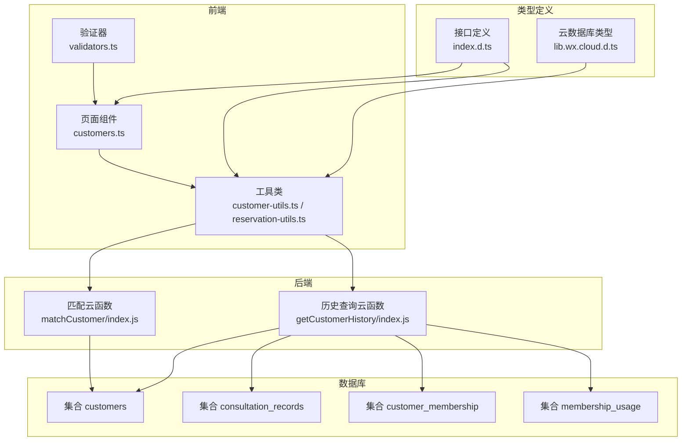
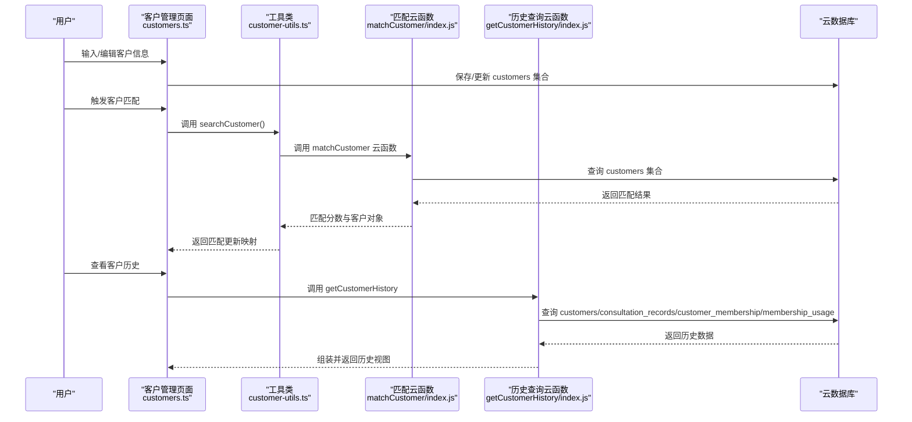
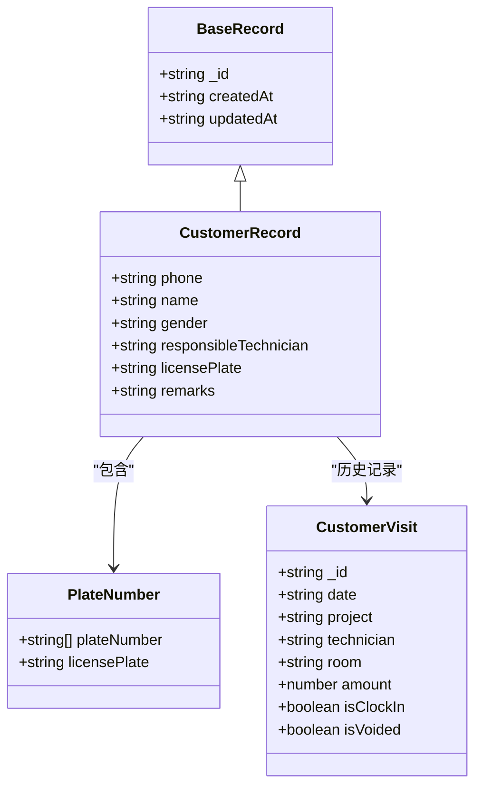
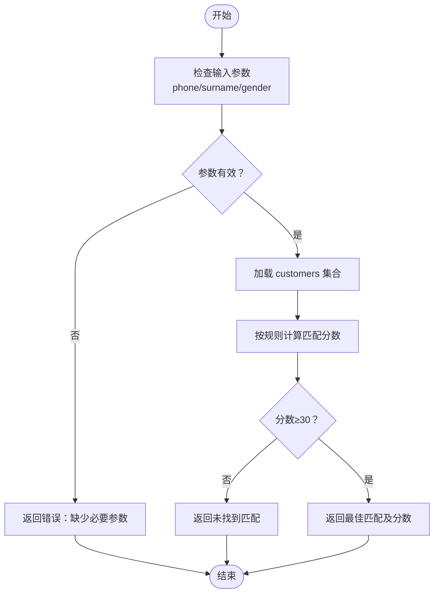
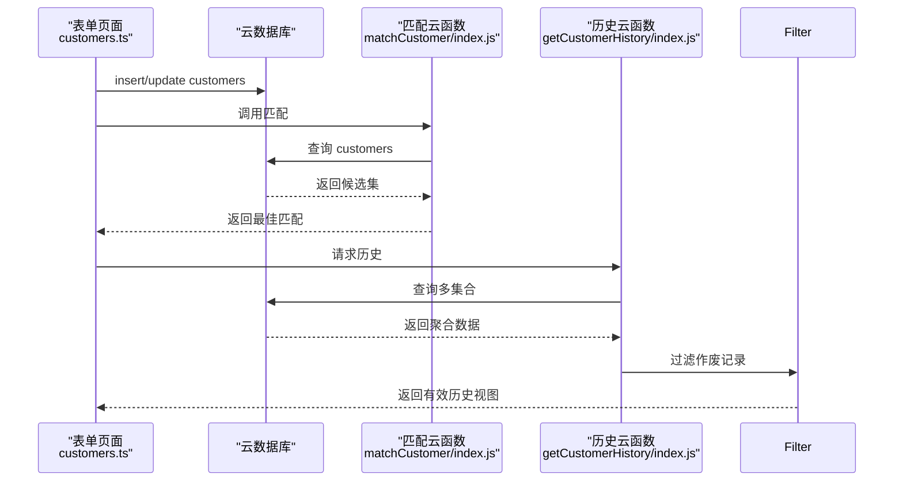
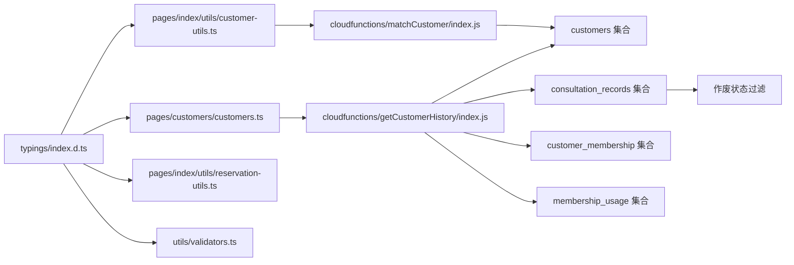

# 客户数据模型

<cite>
**本文档引用的文件**
- [typings/index.d.ts](file://typings/index.d.ts)
- [miniprogram/pages/index/utils/customer-utils.ts](file://miniprogram/pages/index/utils/customer-utils.ts)
- [miniprogram/pages/index/utils/reservation-utils.ts](file://miniprogram/pages/index/utils/reservation-utils.ts)
- [cloudfunctions/getCustomerHistory/index.js](file://cloudfunctions/getCustomerHistory/index.js)
- [cloudfunctions/matchCustomer/index.js](file://cloudfunctions/matchCustomer/index.js)
- [miniprogram/pages/customers/customers.ts](file://miniprogram/pages/customers/customers.ts)
- [miniprogram/utils/validators.ts](file://miniprogram/utils/validators.ts)
- [typings/types/wx/lib.wx.cloud.d.ts](file://typings/types/wx/lib.wx.cloud.d.ts)
</cite>

## 更新摘要
**变更内容**
- 更新 CustomerVisit 接口定义，新增 isVoided: boolean 属性
- 增强客户访问状态跟踪能力，支持预约作废和作废记录管理功能
- 更新历史查询逻辑，支持作废记录的过滤和统计

## 目录
1. [简介](#简介)
2. [项目结构](#项目结构)
3. [核心组件](#核心组件)
4. [架构概览](#架构概览)
5. [详细组件分析](#详细组件分析)
6. [依赖关系分析](#依赖关系分析)
7. [性能考虑](#性能考虑)
8. [故障排除指南](#故障排除指南)
9. [结论](#结论)
10. [附录](#附录)

## 简介
本文件为 ConsultationPrinter 小程序项目的客户数据模型技术文档，聚焦于 CustomerRecord 接口的结构定义与实现细节。文档从数据结构、存储设计、验证规则、索引策略、迁移方案到最佳实践进行全面阐述，帮助开发者在前后端协同开发中正确理解和使用客户数据模型。

**更新** 新增 CustomerVisit 接口的 isVoided 属性，增强了客户访问状态跟踪能力，支持预约作废和作废记录管理功能。

## 项目结构
该项目采用小程序前端 + 云开发后端的分层架构：
- 前端（miniprogram）：负责用户界面交互、表单输入、数据展示与调用云函数
- 类型定义（typings）：统一声明 TypeScript 接口与类型，确保前后端数据契约一致
- 云函数（cloudfunctions）：提供数据查询、匹配、统计等后端能力
- 数据存储：基于微信云开发数据库，集合包括 customers、consultation_records、customer_membership、membership_usage 等

**图表来源**
- [miniprogram/pages/customers/customers.ts](file://miniprogram/pages/customers/customers.ts#L154-L208)
- [miniprogram/pages/index/utils/customer-utils.ts](file://miniprogram/pages/index/utils/customer-utils.ts#L1-L121)
- [miniprogram/pages/index/utils/reservation-utils.ts](file://miniprogram/pages/index/utils/reservation-utils.ts#L147-L172)
- [cloudfunctions/getCustomerHistory/index.js](file://cloudfunctions/getCustomerHistory/index.js#L1-L100)
- [cloudfunctions/matchCustomer/index.js](file://cloudfunctions/matchCustomer/index.js#L1-L71)
- [typings/index.d.ts](file://typings/index.d.ts#L136-L144)
- [typings/types/wx/lib.wx.cloud.d.ts](file://typings/types/wx/lib.wx.cloud.d.ts#L524-L539)

**章节来源**
- [typings/index.d.ts](file://typings/index.d.ts#L1-L436)
- [miniprogram/pages/customers/customers.ts](file://miniprogram/pages/customers/customers.ts#L54-L99)

## 核心组件
本节聚焦 CustomerRecord 接口的字段定义、数据类型与约束条件，并结合实际使用场景说明其设计理念。

- 接口定义与继承
  - CustomerRecord 继承自 BaseRecord，具备标准的 _id、createdAt、updatedAt 字段
  - 字段清单与类型
    - phone: string（手机号）
    - name: string（姓名）
    - gender: 'male' | 'female' | ''（性别，空字符串表示未设置）
    - responsibleTechnician: string（责任技师 ID 或名称）
    - licensePlate: string（车牌号）
    - remarks: string（备注）

- 设计理念
  - 基础信息字段：phone、name、gender、responsibleTechnician、licensePlate、remarks 构成客户档案的核心视图，便于快速识别与服务关联
  - 扩展信息字段：通过 licensePlate 的拆分逻辑（plateNumber 数组）支持车牌号的字符级展示与处理，同时保留原始 licensePlate 以满足查询需求
  - 兼容性：gender 允许空字符串，避免强制必填导致的历史数据迁移问题；responsibleTechnician 支持空值，便于后续绑定或清理

**更新** 新增 CustomerVisit 接口，包含访问记录的完整信息，支持 isVoided 属性来标识作废状态。

**章节来源**
- [typings/index.d.ts](file://typings/index.d.ts#L136-L144)
- [typings/index.d.ts](file://typings/index.d.ts#L146-L156)
- [miniprogram/pages/index/utils/customer-utils.ts](file://miniprogram/pages/index/utils/customer-utils.ts#L100-L120)

## 架构概览
下图展示了客户数据在系统中的流转路径：从前端表单录入，到云函数匹配与历史查询，再到数据库持久化与展示。

**图表来源**
- [miniprogram/pages/customers/customers.ts](file://miniprogram/pages/customers/customers.ts#L154-L208)
- [miniprogram/pages/index/utils/customer-utils.ts](file://miniprogram/pages/index/utils/customer-utils.ts#L1-L49)
- [cloudfunctions/matchCustomer/index.js](file://cloudfunctions/matchCustomer/index.js#L9-L71)
- [cloudfunctions/getCustomerHistory/index.js](file://cloudfunctions/getCustomerHistory/index.js#L9-L99)

## 详细组件分析

### CustomerRecord 接口与数据结构
CustomerRecord 是客户实体的核心数据结构，字段设计兼顾易用性与可扩展性。以下为字段级别的说明与约束：

- phone
  - 类型：string
  - 约束：作为主要查询键，需保证唯一性；前端保存时会去除首尾空白
  - 用途：匹配客户、历史查询、会员关联
- name
  - 类型：string
  - 约束：由 surname + 称呼组成（如"先生/女士"），用于显示与识别
  - 用途：展示与匹配
- gender
  - 类型：'male' | 'female' | ''
  - 约束：空字符串表示未设置，便于兼容历史数据
  - 用途：匹配权重计算（与姓名后缀匹配）
- responsibleTechnician
  - 类型：string
  - 约束：可为空，表示尚未分配
  - 用途：服务关联与后续绑定
- licensePlate
  - 类型：string
  - 约束：支持普通与新能源车牌长度差异
  - 用途：展示与查询；内部转换为 plateNumber 数组以便逐字符处理
- remarks
  - 类型：string
  - 约束：可为空
  - 用途：补充说明

**图表来源**
- [typings/index.d.ts](file://typings/index.d.ts#L136-L156)
- [miniprogram/pages/index/utils/customer-utils.ts](file://miniprogram/pages/index/utils/customer-utils.ts#L100-L120)

**章节来源**
- [typings/index.d.ts](file://typings/index.d.ts#L136-L156)
- [miniprogram/pages/index/utils/customer-utils.ts](file://miniprogram/pages/index/utils/customer-utils.ts#L100-L120)

### CustomerVisit 接口与访问状态管理
CustomerVisit 接口代表客户的访问记录，新增的 isVoided 属性用于标识预约是否作废，增强了系统对客户访问状态的跟踪能力。

- 接口定义
  - _id: string（访问记录 ID）
  - date: string（访问日期）
  - project: string（服务项目）
  - technician: string（技师）
  - room: string（房间）
  - amount?: number（金额）
  - isClockIn: boolean（是否点钟）
  - isVoided: boolean（是否作废）

- 设计理念
  - 状态完整性：isVoided 属性提供明确的作废状态标识，便于区分有效和无效访问记录
  - 历史准确性：作废记录仍保留在历史中，但不参与统计计算，确保历史数据的完整性
  - 用户体验：前端可以过滤作废记录，只显示有效的访问历史

**更新** 新增 CustomerVisit 接口，支持访问状态跟踪和作废记录管理。

**章节来源**
- [typings/index.d.ts](file://typings/index.d.ts#L146-L156)
- [cloudfunctions/getCustomerHistory/index.js](file://cloudfunctions/getCustomerHistory/index.js#L32-L47)
- [miniprogram/pages/customers/customers.ts](file://miniprogram/pages/customers/customers.ts#L250-L263)

### 数据验证规则
系统在多个环节实施数据验证，确保数据质量与一致性：

- 前端表单保存
  - customers.ts 在保存客户信息时直接写入 phone、name、gender、responsibleTechnician、licensePlate、remarks 字段，不做额外格式校验
- 客户匹配
  - matchCustomer 云函数根据 phone/surname/gender 计算匹配分数，要求至少提供 surname 或 phone 之一
  - 匹配阈值：score ≥ 30 才视为有效匹配
- 历史查询
  - getCustomerHistory 对 phone 参数进行非空校验，清洗前后空格后执行查询
  - **更新** 历史查询中使用 isVoided 属性过滤作废记录，确保统计数据的准确性

**图表来源**
- [cloudfunctions/matchCustomer/index.js](file://cloudfunctions/matchCustomer/index.js#L12-L56)

**章节来源**
- [miniprogram/pages/customers/customers.ts](file://miniprogram/pages/customers/customers.ts#L154-L208)
- [cloudfunctions/matchCustomer/index.js](file://cloudfunctions/matchCustomer/index.js#L12-L56)
- [cloudfunctions/getCustomerHistory/index.js](file://cloudfunctions/getCustomerHistory/index.js#L13-L18)
- [cloudfunctions/getCustomerHistory/index.js](file://cloudfunctions/getCustomerHistory/index.js#L87-L90)

### 存储结构与数据流程
- 存储集合
  - customers：存放 CustomerRecord
  - consultation_records：存放 ConsultationRecord，用于历史查询与统计
  - customer_membership：客户与会员卡关联
  - membership_usage：会员卡使用记录
- 数据流程
  - 表单保存：customers.ts 直接插入或更新 customers 集合
  - 客户匹配：customer-utils 调用 matchCustomer 云函数，按分数返回最佳匹配
  - 历史查询：getCustomerHistory 聚合 customers、consultation_records、customer_membership、membership_usage 四个集合数据
  - **更新** 历史查询中使用 isVoided 属性过滤作废记录，确保统计数据的准确性

**图表来源**
- [miniprogram/pages/customers/customers.ts](file://miniprogram/pages/customers/customers.ts#L154-L208)
- [cloudfunctions/matchCustomer/index.js](file://cloudfunctions/matchCustomer/index.js#L20-L63)
- [cloudfunctions/getCustomerHistory/index.js](file://cloudfunctions/getCustomerHistory/index.js#L22-L91)

**章节来源**
- [miniprogram/pages/customers/customers.ts](file://miniprogram/pages/customers/customers.ts#L154-L208)
- [cloudfunctions/getCustomerHistory/index.js](file://cloudfunctions/getCustomerHistory/index.js#L49-L91)

### 索引设计建议
基于现有查询模式与集合结构，建议如下索引策略以提升查询性能：

- customers 集合
  - 复合索引：phone（主键）、name（辅助查询）、createdAt（排序）
  - 用途：快速按手机号检索、模糊搜索姓名、按创建时间排序
- consultation_records 集合
  - 复合索引：phone（主键）、createdAt（排序）、isVoided（状态过滤）
  - 用途：按手机号查询历史、按时间倒序展示、支持作废状态过滤
- customer_membership 集合
  - 复合索引：customerPhone（主键）、createdAt（排序）
  - 用途：按手机号查询会员关联、按时间倒序展示
- membership_usage 集合
  - 复合索引：customerPhone（主键）、createdAt（排序）
  - 用途：按手机号查询使用记录、限制返回条数（如 50 条）

**更新** 在 consultation_records 集合中新增 isVoided 字段的复合索引，支持作废状态的高效过滤。

上述索引设计遵循"查询最左前缀原则"，优先将高频查询字段置于复合索引前列，减少全表扫描。

**章节来源**
- [cloudfunctions/getCustomerHistory/index.js](file://cloudfunctions/getCustomerHistory/index.js#L49-L76)
- [typings/types/wx/lib.wx.cloud.d.ts](file://typings/types/wx/lib.wx.cloud.d.ts#L524-L539)

### 数据迁移方案与版本兼容
- 迁移目标
  - 将历史数据中的 gender 空值补齐为默认值（如 ''），保持与新接口一致
  - 将 licensePlate 拆分为 plateNumber 数组，同时保留原始 licensePlate 以兼容旧查询
  - **更新** 为现有 consultation_records 数据添加 isVoided 字段，默认值设为 false
- 迁移步骤
  1. 扫描 customers 集合，识别 gender 为空的记录
  2. 依据 name 后缀（先生/女士）推断 gender 并更新
  3. 生成 plateNumber 数组，长度依据车牌类型（普通/新能源）确定
  4. **更新** 批量更新 consultation_records 集合，为现有记录添加 isVoided 字段
  5. 执行批量更新，记录迁移进度与异常
- 版本兼容
  - 新增字段（如 plateNumber、isVoided）不影响旧客户端读取，旧客户端可忽略该字段
  - 云函数与页面逻辑均兼容空字符串 gender 和默认 false 的 isVoided 值，避免强制必填导致的迁移风险

**更新** 新增 isVoided 字段的迁移处理，确保历史数据的兼容性。

**章节来源**
- [miniprogram/pages/index/utils/customer-utils.ts](file://miniprogram/pages/index/utils/customer-utils.ts#L100-L120)
- [cloudfunctions/matchCustomer/index.js](file://cloudfunctions/matchCustomer/index.js#L43-L50)
- [cloudfunctions/getCustomerHistory/index.js](file://cloudfunctions/getCustomerHistory/index.js#L32-L47)

### 实际数据示例与最佳实践
- 示例数据结构
  - 客户记录：包含 phone、name、gender、responsibleTechnician、licensePlate、remarks
  - 车牌号拆分：licensePlate 为"粤B12345"，plateNumber 为长度为 7 的数组，逐字符填充
  - **更新** 访问记录：包含 _id、date、project、technician、room、amount、isClockIn、isVoided
- 最佳实践
  - 保存前清理 phone 前后空格，避免重复键
  - 匹配时优先使用完整 phone，其次使用 surname，最后使用 gender 辅助
  - 历史查询时对 phone 进行清洗并限制返回条数，避免超时
  - **更新** 前端展示时过滤 isVoided 为 true 的记录，只显示有效访问历史
  - **更新** 统计计算时跳过 isVoided 为 true 的记录，确保统计数据的准确性
  - 新增字段时保持向后兼容，避免破坏旧客户端

**更新** 新增访问记录的展示和统计最佳实践。

**章节来源**
- [miniprogram/pages/index/utils/customer-utils.ts](file://miniprogram/pages/index/utils/customer-utils.ts#L100-L120)
- [miniprogram/pages/index/utils/reservation-utils.ts](file://miniprogram/pages/index/utils/reservation-utils.ts#L147-L172)
- [cloudfunctions/getCustomerHistory/index.js](file://cloudfunctions/getCustomerHistory/index.js#L13-L18)
- [cloudfunctions/getCustomerHistory/index.js](file://cloudfunctions/getCustomerHistory/index.js#L87-L90)
- [miniprogram/pages/customers/customers.ts](file://miniprogram/pages/customers/customers.ts#L250-L263)

## 依赖关系分析
- 类型依赖
  - customers.ts、customer-utils.ts、reservation-utils.ts、validators.ts 均依赖 typings/index.d.ts 中的 CustomerRecord 接口
  - **更新** 历史查询功能依赖 CustomerVisit 接口定义
- 云函数依赖
  - matchCustomer 依赖 customers 集合进行匹配
  - getCustomerHistory 依赖 customers、consultation_records、customer_membership、membership_usage 多集合聚合
  - **更新** getCustomerHistory 依赖 consultation_records 集合中的 isVoided 字段进行状态过滤
- 数据库依赖
  - 查询接口来自 lib.wx.cloud.d.ts，支持 where、orderBy、limit、get 等操作

**图表来源**
- [typings/index.d.ts](file://typings/index.d.ts#L136-L156)
- [miniprogram/pages/customers/customers.ts](file://miniprogram/pages/customers/customers.ts#L154-L208)
- [miniprogram/pages/index/utils/customer-utils.ts](file://miniprogram/pages/index/utils/customer-utils.ts#L1-L49)
- [miniprogram/pages/index/utils/reservation-utils.ts](file://miniprogram/pages/index/utils/reservation-utils.ts#L147-L172)
- [cloudfunctions/getCustomerHistory/index.js](file://cloudfunctions/getCustomerHistory/index.js#L49-L91)
- [cloudfunctions/matchCustomer/index.js](file://cloudfunctions/matchCustomer/index.js#L20-L63)
- [typings/types/wx/lib.wx.cloud.d.ts](file://typings/types/wx/lib.wx.cloud.d.ts#L524-L539)

**更新** 新增 CustomerVisit 接口和作废状态过滤的依赖关系。

**章节来源**
- [typings/index.d.ts](file://typings/index.d.ts#L136-L156)
- [cloudfunctions/getCustomerHistory/index.js](file://cloudfunctions/getCustomerHistory/index.js#L49-L91)
- [cloudfunctions/matchCustomer/index.js](file://cloudfunctions/matchCustomer/index.js#L20-L63)

## 性能考虑
- 查询优化
  - 优先使用复合索引的最左前缀字段进行过滤，减少扫描范围
  - 对历史查询限制返回条数（如 50 条），避免大结果集影响性能
  - **更新** 在 consultation_records 集合中使用 isVoided 字段进行高效过滤
- 写入优化
  - 批量更新时尽量合并相同字段的修改，减少网络往返
- 匹配算法
  - matchCustomer 采用遍历 customers 集合并评分，建议在数据量较大时引入 phone 索引与分页查询

**更新** 新增作废状态过滤的性能考虑。

[本节为通用性能建议，无需特定文件引用]

## 故障排除指南
- 匹配不到客户
  - 检查是否提供了 surname 或 phone，且至少一个有效
  - 确认 phone 是否包含在 customers 中（大小写、空格、特殊字符）
- 历史查询为空
  - 确认 phone 清洗后与 customers 中的 phone 一致
  - 检查 consultation_records、customer_membership、membership_usage 是否存在对应数据
  - **更新** 检查 isVoided 字段是否正确过滤作废记录
- 保存失败
  - 检查 customers.ts 的错误提示与网络状态
  - 确认数据库权限与集合存在
- **更新** 访问记录显示异常
  - 检查 CustomerVisit 接口的 isVoided 字段是否正确传递
  - 确认前端过滤逻辑是否正确处理作废状态

**章节来源**
- [cloudfunctions/matchCustomer/index.js](file://cloudfunctions/matchCustomer/index.js#L12-L18)
- [cloudfunctions/getCustomerHistory/index.js](file://cloudfunctions/getCustomerHistory/index.js#L13-L18)
- [miniprogram/pages/customers/customers.ts](file://miniprogram/pages/customers/customers.ts#L193-L199)
- [cloudfunctions/getCustomerHistory/index.js](file://cloudfunctions/getCustomerHistory/index.js#L87-L90)

## 结论
CustomerRecord 作为客户数据模型的核心接口，通过简洁明确的字段设计与完善的前后端协作机制，支撑了客户匹配、历史查询与会员关联等关键业务场景。配合合理的索引策略与迁移方案，可在保证性能的同时平滑演进至新功能。

**更新** 新增的 CustomerVisit 接口和 isVoided 属性显著增强了系统对客户访问状态的跟踪能力，支持预约作废和作废记录管理功能，为业务决策提供了更准确的数据支持。建议在后续迭代中持续完善字段约束与校验逻辑，增强系统的健壮性与可维护性。

[本节为总结性内容，无需特定文件引用]

## 附录
- 相关接口与类型
  - BaseRecord：_id、createdAt、updatedAt
  - CustomerRecord：phone、name、gender、responsibleTechnician、licensePlate、remarks
  - **更新** CustomerVisit：_id、date、project、technician、room、amount、isClockIn、isVoided
- 常用查询字段
  - phone：主查询键
  - name：辅助查询键
  - createdAt：排序与分页键
  - **更新** isVoided：访问状态过滤键

**章节来源**
- [typings/index.d.ts](file://typings/index.d.ts#L1-L16)
- [typings/index.d.ts](file://typings/index.d.ts#L136-L156)