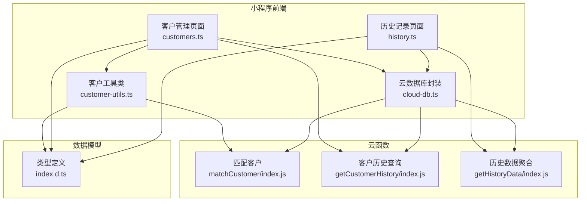
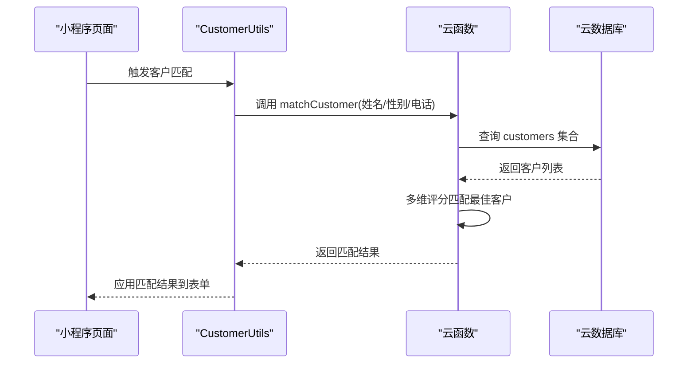
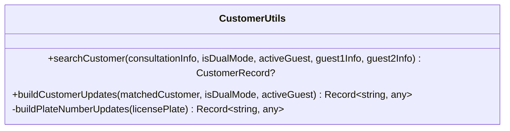
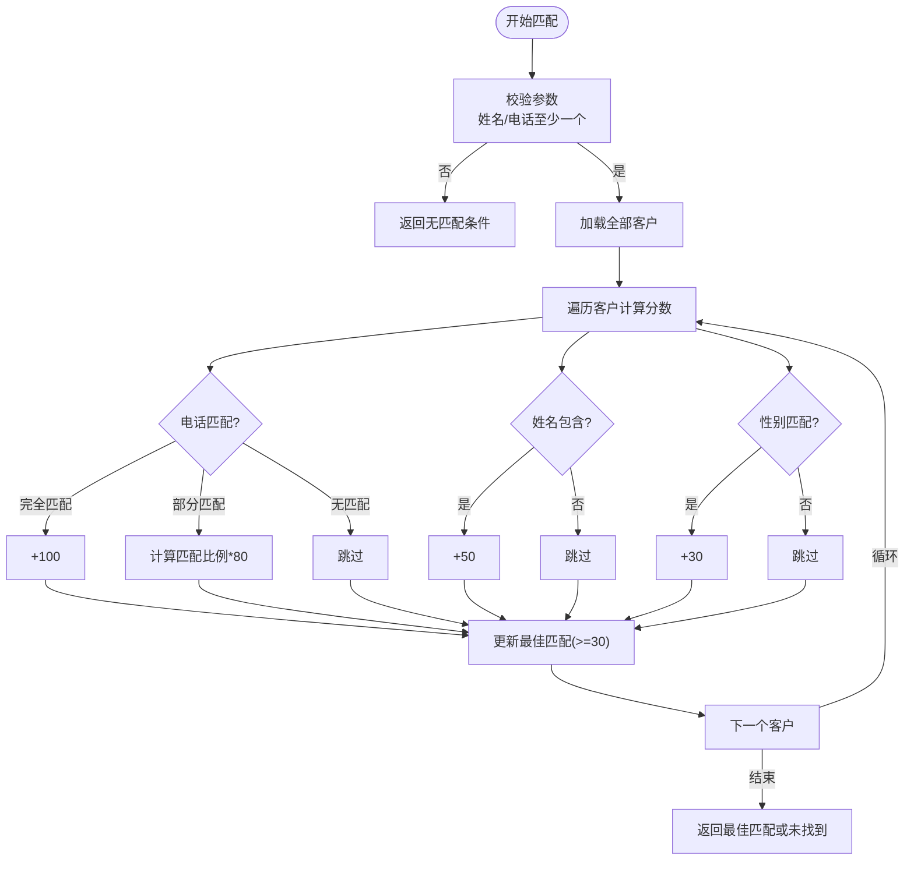
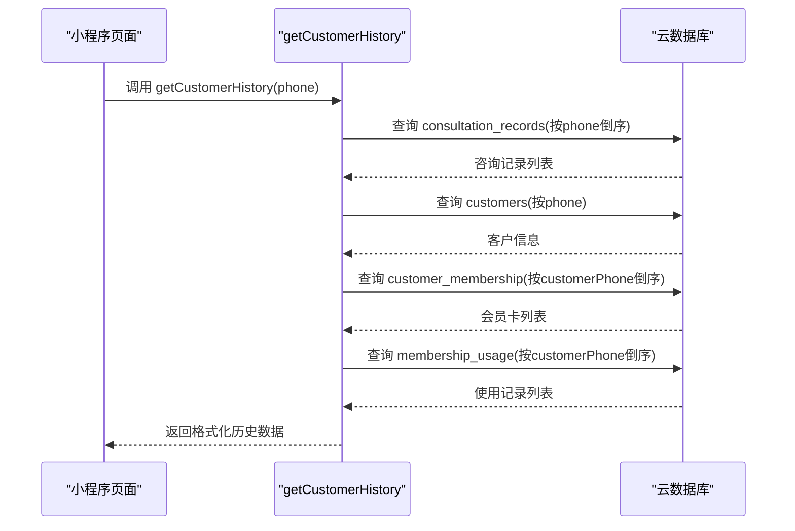
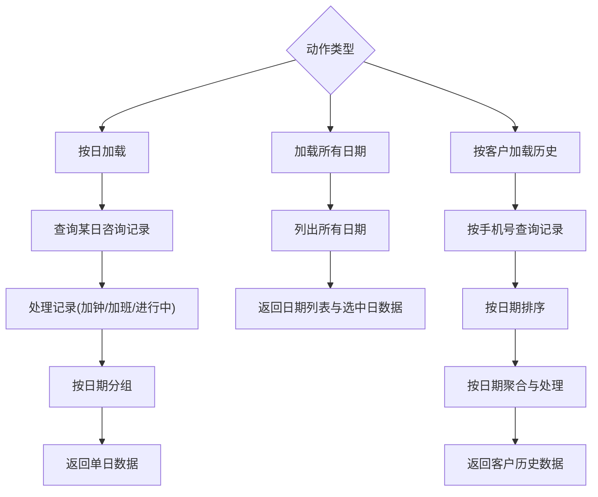
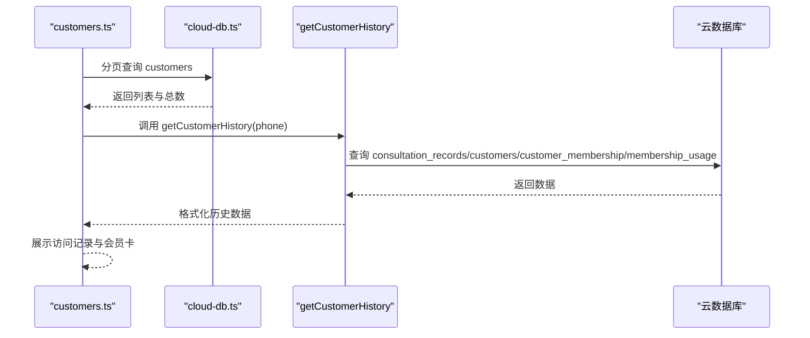
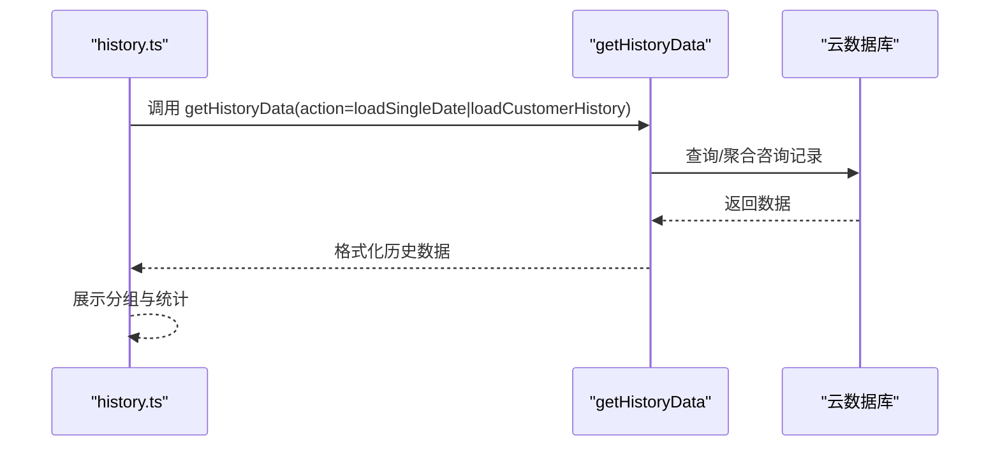
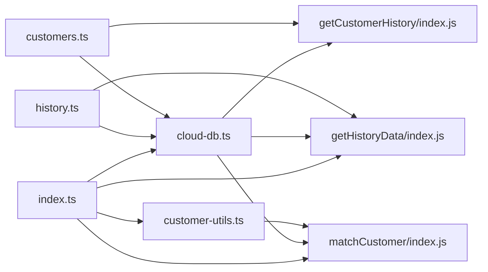

# 客户管理系统

<cite>
**本文档引用的文件**
- [matchCustomer/index.js](file://cloudfunctions/matchCustomer/index.js)
- [getCustomerHistory/index.js](file://cloudfunctions/getCustomerHistory/index.js)
- [getHistoryData/index.js](file://cloudfunctions/getHistoryData/index.js)
- [customer-utils.ts](file://miniprogram/pages/index/utils/customer-utils.ts)
- [customers.ts](file://miniprogram/pages/customers/customers.ts)
- [history.ts](file://miniprogram/pages/history/history.ts)
- [cloud-db.ts](file://miniprogram/utils/cloud-db.ts)
- [index.d.ts](file://typings/index.d.ts)
- [index.ts](file://miniprogram/pages/index/index.ts)
</cite>

## 目录
1. [简介](#简介)
2. [项目结构](#项目结构)
3. [核心组件](#核心组件)
4. [架构概览](#架构概览)
5. [详细组件分析](#详细组件分析)
6. [依赖关系分析](#依赖关系分析)
7. [性能考虑](#性能考虑)
8. [故障排查指南](#故障排查指南)
9. [结论](#结论)
10. [附录](#附录)

## 简介
本系统是一个基于微信小程序与云开发的客户管理系统，围绕“客户信息录入、存储、查询与匹配”构建。系统提供以下能力：
- 客户信息录入与编辑（姓名、性别、手机号、负责技师、车牌号、备注）
- 客户查询与分页检索（按姓名/手机号模糊匹配）
- 客户匹配算法（基于姓名、性别、电话号码的多维评分）
- 历史记录查询（咨询单、会员卡、会员卡使用记录）
- 历史数据聚合与统计（按日分组、技师统计、月度积分排行）

## 项目结构
系统采用前后端分离架构：
- 前端（小程序）：页面逻辑、表单处理、调用云函数、展示数据
- 云函数：数据查询、聚合统计、业务逻辑处理
- 类型定义：统一的数据模型与接口约束

图表来源
- [customers.ts](file://miniprogram/pages/customers/customers.ts#L1-L471)
- [history.ts](file://miniprogram/pages/history/history.ts#L1-L762)
- [customer-utils.ts](file://miniprogram/pages/index/utils/customer-utils.ts#L1-L121)
- [cloud-db.ts](file://miniprogram/utils/cloud-db.ts#L1-L321)
- [matchCustomer/index.js](file://cloudfunctions/matchCustomer/index.js#L1-L71)
- [getCustomerHistory/index.js](file://cloudfunctions/getCustomerHistory/index.js#L1-L100)
- [getHistoryData/index.js](file://cloudfunctions/getHistoryData/index.js#L1-L411)
- [index.d.ts](file://typings/index.d.ts#L1-L200)

章节来源
- [customers.ts](file://miniprogram/pages/customers/customers.ts#L1-L471)
- [history.ts](file://miniprogram/pages/history/history.ts#L1-L762)
- [customer-utils.ts](file://miniprogram/pages/index/utils/customer-utils.ts#L1-L121)
- [cloud-db.ts](file://miniprogram/utils/cloud-db.ts#L1-L321)
- [matchCustomer/index.js](file://cloudfunctions/matchCustomer/index.js#L1-L71)
- [getCustomerHistory/index.js](file://cloudfunctions/getCustomerHistory/index.js#L1-L100)
- [getHistoryData/index.js](file://cloudfunctions/getHistoryData/index.js#L1-L411)
- [index.d.ts](file://typings/index.d.ts#L1-L200)

## 核心组件
- 客户工具类（CustomerUtils）
  - 负责根据咨询单信息与双人模式，调用云函数进行客户匹配
  - 将匹配结果映射到表单字段，自动填充姓名、性别、技师、电话、车牌号等
- 客户管理页面（customers.ts）
  - 提供客户列表、新增/编辑、分页查询、历史查看、会员卡开卡等功能
- 历史记录页面（history.ts）
  - 展示按日分组的历史记录，支持作废、提前下钟、加钟/加班调整、每日统计
- 云数据库封装（cloud-db.ts）
  - 统一封装查询、插入、更新、删除、分页等操作，简化前端调用
- 云函数
  - matchCustomer：多维评分匹配客户
  - getCustomerHistory：整合客户历史、会员卡与使用记录
  - getHistoryData：按日聚合、统计与汇总

章节来源
- [customer-utils.ts](file://miniprogram/pages/index/utils/customer-utils.ts#L1-L121)
- [customers.ts](file://miniprogram/pages/customers/customers.ts#L1-L471)
- [history.ts](file://miniprogram/pages/history/history.ts#L1-L762)
- [cloud-db.ts](file://miniprogram/utils/cloud-db.ts#L1-L321)
- [matchCustomer/index.js](file://cloudfunctions/matchCustomer/index.js#L1-L71)
- [getCustomerHistory/index.js](file://cloudfunctions/getCustomerHistory/index.js#L1-L100)
- [getHistoryData/index.js](file://cloudfunctions/getHistoryData/index.js#L1-L411)

## 架构概览
系统采用“前端页面 + 云函数 + 云数据库”的三层架构：
- 前端页面通过 wx.cloud.callFunction 调用云函数
- 云函数通过 wx-server-sdk 访问云数据库
- 类型定义统一约束数据结构，保证前后端一致性

图表来源
- [customer-utils.ts](file://miniprogram/pages/index/utils/customer-utils.ts#L1-L121)
- [matchCustomer/index.js](file://cloudfunctions/matchCustomer/index.js#L1-L71)

章节来源
- [customer-utils.ts](file://miniprogram/pages/index/utils/customer-utils.ts#L1-L121)
- [matchCustomer/index.js](file://cloudfunctions/matchCustomer/index.js#L1-L71)

## 详细组件分析

### 客户工具类（CustomerUtils）
职责与流程
- 根据是否双人模式，提取当前活跃客人的姓名、性别、电话
- 调用云函数 matchCustomer 进行匹配
- 将匹配结果映射到表单字段（姓名去“先生/女士”、性别、电话、负责技师、车牌号）
- 自动构建更新键值对，减少手动赋值

图表来源
- [customer-utils.ts](file://miniprogram/pages/index/utils/customer-utils.ts#L1-L121)

章节来源
- [customer-utils.ts](file://miniprogram/pages/index/utils/customer-utils.ts#L1-L121)

### 客户匹配机制（matchCustomer 云函数）
匹配策略
- 条件校验：至少提供姓名或电话之一
- 遍历 customers 集合，计算每个候选客户的匹配分数
- 评分规则
  - 电话完全匹配：+100
  - 电话部分匹配：按匹配比例加权（最高+80）
  - 姓名包含匹配：+50
  - 性别匹配（依据姓名结尾“先生/女士”）：+30
- 仅当分数达到阈值（≥30）才返回最佳匹配

图表来源
- [matchCustomer/index.js](file://cloudfunctions/matchCustomer/index.js#L1-L71)

章节来源
- [matchCustomer/index.js](file://cloudfunctions/matchCustomer/index.js#L1-L71)

### 历史记录查询（getCustomerHistory 云函数）
功能概述
- 参数校验：必须提供 phone
- 查询咨询记录（按时间倒序，限制数量）
- 查询客户信息（按手机号精确匹配）
- 查询会员卡与使用记录（按手机号倒序）
- 返回格式化后的历史数据、访问次数与总消费额

图表来源
- [getCustomerHistory/index.js](file://cloudfunctions/getCustomerHistory/index.js#L1-L100)

章节来源
- [getCustomerHistory/index.js](file://cloudfunctions/getCustomerHistory/index.js#L1-L100)

### 历史数据聚合（getHistoryData 云函数）
功能概述
- 支持三种动作：按日加载、加载所有日期、按客户加载历史
- 对咨询记录进行时间解析、加钟/加班计算、进行中状态判断
- 按日期分组，计算技师当日单量，支持每日统计与月度积分排行

图表来源
- [getHistoryData/index.js](file://cloudfunctions/getHistoryData/index.js#L1-L411)

章节来源
- [getHistoryData/index.js](file://cloudfunctions/getHistoryData/index.js#L1-L411)

### 客户管理页面（customers.ts）
功能概述
- 客户列表：分页查询（按姓名/手机号模糊），支持搜索关键词
- 新增/编辑：校验必填项，插入或更新 customers 集合
- 历史查看：调用 getCustomerHistory 获取客户历史并展示
- 会员卡开卡：选择卡类型、填写金额与销售员工，写入 customer_membership 集合

图表来源
- [customers.ts](file://miniprogram/pages/customers/customers.ts#L1-L471)
- [cloud-db.ts](file://miniprogram/utils/cloud-db.ts#L1-L321)
- [getCustomerHistory/index.js](file://cloudfunctions/getCustomerHistory/index.js#L1-L100)

章节来源
- [customers.ts](file://miniprogram/pages/customers/customers.ts#L1-L471)
- [cloud-db.ts](file://miniprogram/utils/cloud-db.ts#L1-L321)

### 历史记录页面（history.ts）
功能概述
- 支持按日期加载、按客户只读模式加载
- 展示按日分组的咨询记录，支持作废、提前下钟、加钟/加班调整
- 生成每日统计与月度积分排行，支持推送企业微信消息

图表来源
- [history.ts](file://miniprogram/pages/history/history.ts#L1-L762)
- [getHistoryData/index.js](file://cloudfunctions/getHistoryData/index.js#L1-L411)

章节来源
- [history.ts](file://miniprogram/pages/history/history.ts#L1-L762)
- [getHistoryData/index.js](file://cloudfunctions/getHistoryData/index.js#L1-L411)

## 依赖关系分析
- 前端页面依赖云函数与云数据库封装
- 云函数依赖云数据库 SDK
- 类型定义贯穿前后端，确保数据结构一致

图表来源
- [customers.ts](file://miniprogram/pages/customers/customers.ts#L1-L471)
- [history.ts](file://miniprogram/pages/history/history.ts#L1-L762)
- [customer-utils.ts](file://miniprogram/pages/index/utils/customer-utils.ts#L1-L121)
- [cloud-db.ts](file://miniprogram/utils/cloud-db.ts#L1-L321)
- [matchCustomer/index.js](file://cloudfunctions/matchCustomer/index.js#L1-L71)
- [getCustomerHistory/index.js](file://cloudfunctions/getCustomerHistory/index.js#L1-L100)
- [getHistoryData/index.js](file://cloudfunctions/getHistoryData/index.js#L1-L411)
- [index.ts](file://miniprogram/pages/index/index.ts#L1-L200)

章节来源
- [customers.ts](file://miniprogram/pages/customers/customers.ts#L1-L471)
- [history.ts](file://miniprogram/pages/history/history.ts#L1-L762)
- [customer-utils.ts](file://miniprogram/pages/index/utils/customer-utils.ts#L1-L121)
- [cloud-db.ts](file://miniprogram/utils/cloud-db.ts#L1-L321)
- [matchCustomer/index.js](file://cloudfunctions/matchCustomer/index.js#L1-L71)
- [getCustomerHistory/index.js](file://cloudfunctions/getCustomerHistory/index.js#L1-L100)
- [getHistoryData/index.js](file://cloudfunctions/getHistoryData/index.js#L1-L411)
- [index.ts](file://miniprogram/pages/index/index.ts#L1-L200)

## 性能考虑
- 匹配算法
  - 当前实现对 customers 集合全量扫描，复杂度 O(N)；建议在 customers 集合建立 phone/name 索引，提升查询效率
- 历史查询
  - getCustomerHistory 对多个集合进行多次查询，建议合并查询或使用事务，减少往返次数
- 分页查询
  - customers.ts 使用分页查询，避免一次性加载大量数据；建议设置合理的 pageSize 并启用懒加载
- 云函数调用
  - 前端应避免频繁调用云函数，可增加本地缓存与防抖策略
- 数据格式化
  - 历史数据聚合在云函数侧完成，前端仅做展示，降低前端负担

[本节为通用性能建议，无需特定文件来源]

## 故障排查指南
- 匹配失败
  - 检查传入参数：姓名/电话至少提供其一
  - 确认 customers 集合存在匹配数据
  - 查看云函数返回的错误信息
- 历史查询异常
  - 确认 phone 参数合法且非空
  - 检查 consultation_records、customers、customer_membership、membership_usage 集合是否存在
- 页面加载失败
  - 检查网络状态与云函数可用性
  - 查看前端控制台错误日志
- 权限问题
  - 确认用户登录状态与页面权限
  - 检查删除/编辑权限

章节来源
- [matchCustomer/index.js](file://cloudfunctions/matchCustomer/index.js#L1-L71)
- [getCustomerHistory/index.js](file://cloudfunctions/getCustomerHistory/index.js#L1-L100)
- [customers.ts](file://miniprogram/pages/customers/customers.ts#L1-L471)
- [history.ts](file://miniprogram/pages/history/history.ts#L1-L762)

## 结论
本系统通过清晰的前后端分工与统一的类型定义，实现了客户信息的高效管理与历史数据的便捷查询。匹配算法具备多维评分能力，历史聚合支持多种统计维度。建议后续在索引设计、查询合并与缓存策略方面进一步优化，以提升整体性能与用户体验。

[本节为总结性内容，无需特定文件来源]

## 附录

### 数据模型定义
- 基础记录
  - _id: 字符串
  - createdAt: 字符串（ISO 时间）
  - updatedAt: 字符串（ISO 时间）
- 客户记录（CustomerRecord）
  - phone: 字符串
  - name: 字符串
  - gender: 'male' | 'female' | ''
  - responsibleTechnician: 字符串
  - licensePlate: 字符串
  - remarks: 字符串
- 咨询单记录（ConsultationRecord）
  - isVoided: 布尔
  - extraTime: 数字（单位：半小时）
  - overtime: 数字（单位：半小时）
  - startTime/endTime: 字符串（HH:MM）
  - settlement?: 结算信息
  - amount?: 数字
  - date: 字符串（YYYY-MM-DD）
- 会员卡与使用记录
  - CustomerMembership：客户与会员卡关联
  - MembershipUsageRecord：会员卡使用记录

章节来源
- [index.d.ts](file://typings/index.d.ts#L1-L200)

### 索引设计与查询优化建议
- 建议在 customers 集合上建立复合索引
  - phone: 单字段索引
  - name: 单字段索引
  - phone + name: 复合索引（支持多字段查询）
- 在 consultation_records 集合上建立索引
  - phone: 单字段索引（历史查询常用）
  - date: 单字段索引（按日聚合常用）
  - phone + date: 复合索引（历史查询与聚合常用）
- 在 customer_membership 集合上建立索引
  - customerPhone: 单字段索引（历史查询常用）
- 在 membership_usage 集合上建立索引
  - customerPhone: 单字段索引（历史查询常用）

[本节为通用优化建议，无需特定文件来源]

### 使用场景与最佳实践
- 客户录入
  - 建议优先使用手机号作为唯一标识，便于后续匹配与查询
  - 姓名可包含“先生/女士”，系统会自动识别性别
- 客户匹配
  - 双人模式下，建议先匹配主客信息，再同步至副客
  - 匹配分数阈值可根据业务需求调整
- 历史查询
  - 客户管理页面支持按关键词搜索，建议结合分页与本地缓存
  - 历史页面支持按日期筛选，适合运营统计与复盘
- 数据隐私保护
  - 仅在必要范围内展示与使用客户手机号
  - 历史记录中避免泄露敏感信息，如身份证号等
  - 建议对日志与错误信息脱敏处理

[本节为通用实践建议，无需特定文件来源]