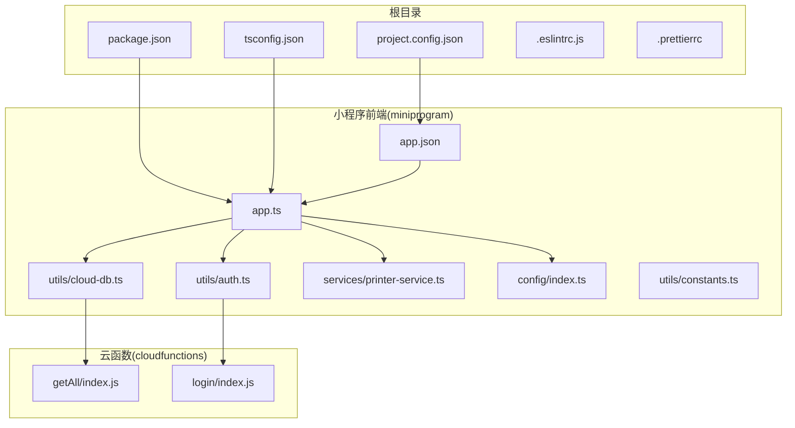
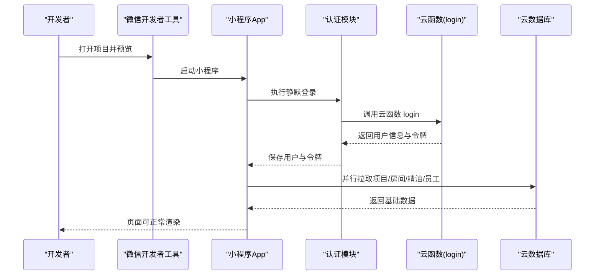
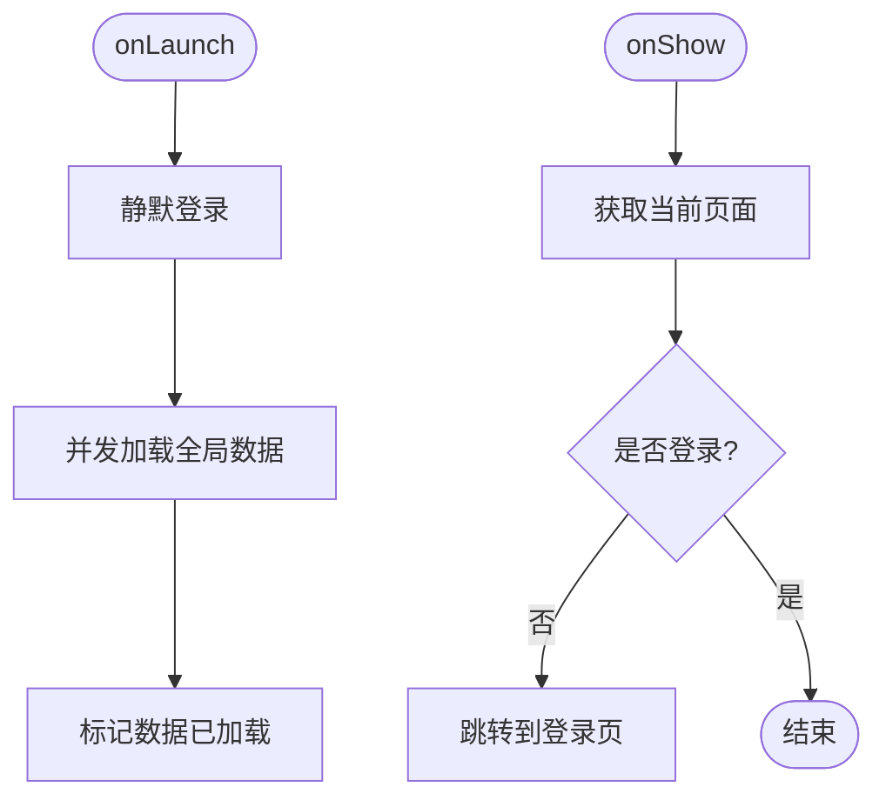
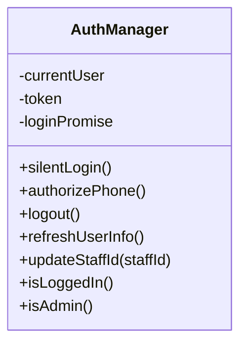
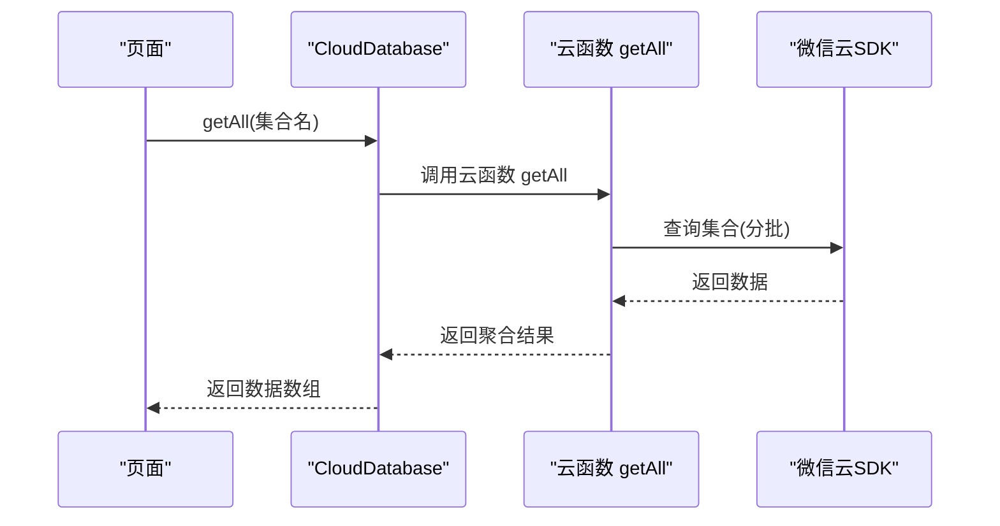
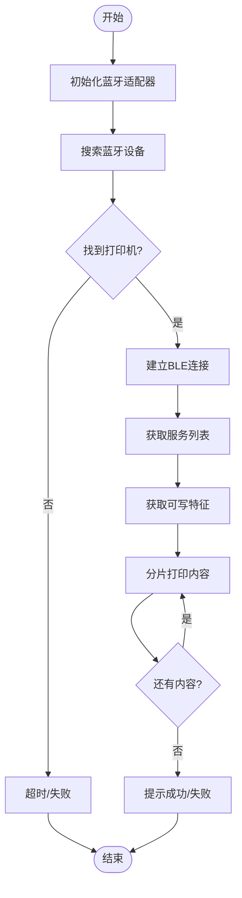
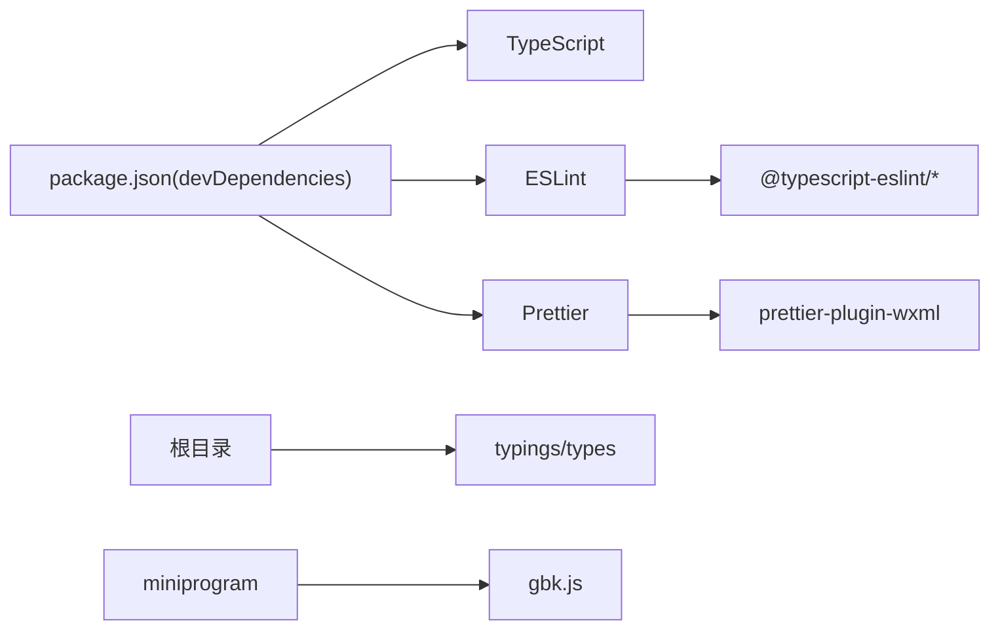

# 快速开始

<cite>
**本文引用的文件**
- [package.json](file://package.json)
- [tsconfig.json](file://tsconfig.json)
- [project.config.json](file://project.config.json)
- [miniprogram/app.json](file://miniprogram/app.json)
- [miniprogram/app.ts](file://miniprogram/app.ts)
- [miniprogram/utils/auth.ts](file://miniprogram/utils/auth.ts)
- [miniprogram/utils/cloud-db.ts](file://miniprogram/utils/cloud-db.ts)
- [miniprogram/services/printer-service.ts](file://miniprogram/services/printer-service.ts)
- [miniprogram/config/index.ts](file://miniprogram/config/index.ts)
- [miniprogram/utils/constants.ts](file://miniprogram/utils/constants.ts)
- [.eslintrc.js](file://.eslintrc.js)
- [.prettierrc](file://.prettierrc)
- [cloudfunctions/getAll/package.json](file://cloudfunctions/getAll/package.json)
- [cloudfunctions/getAll/index.js](file://cloudfunctions/getAll/index.js)
- [cloudfunctions/login/package.json](file://cloudfunctions/login/package.json)
</cite>

## 目录
1. [简介](#简介)
2. [项目结构](#项目结构)
3. [核心组件](#核心组件)
4. [架构总览](#架构总览)
5. [详细组件解析](#详细组件解析)
6. [依赖关系分析](#依赖关系分析)
7. [性能与最佳实践](#性能与最佳实践)
8. [故障排查指南](#故障排查指南)
9. [结论](#结论)
10. [附录：开发环境搭建与运行步骤](#附录开发环境搭建与运行步骤)

## 简介
本指南面向首次接触 ConsultationPrinter 小程序项目的开发者，目标是在最短时间内完成开发环境准备、项目克隆、依赖安装与本地运行，并理解关键配置文件的作用与参数含义。项目采用 TypeScript + Less 构建，结合微信小程序云开发能力，支持蓝牙打印机连接与打印功能。

## 项目结构
ConsultationPrinter 采用“根目录 + 小程序前端 + 云函数 + 云开发资源”的组织方式：
- 根目录包含项目级配置与脚手架配置
- miniprogram 目录为小程序前端源码，包含页面、组件、服务、工具与类型声明
- cloudfunctions 目录为云函数，提供后端逻辑（如登录、全量数据拉取）
- cloudbase 与 .qoder/.trae 等目录用于云开发相关资源与规则
- typings 提供全局类型声明

图表来源
- [package.json](file://package.json#L1-L28)
- [tsconfig.json](file://tsconfig.json#L1-L31)
- [project.config.json](file://project.config.json#L1-L54)
- [miniprogram/app.ts](file://miniprogram/app.ts#L1-L191)
- [miniprogram/app.json](file://miniprogram/app.json#L1-L35)
- [miniprogram/utils/auth.ts](file://miniprogram/utils/auth.ts#L1-L245)
- [miniprogram/utils/cloud-db.ts](file://miniprogram/utils/cloud-db.ts#L1-L321)
- [miniprogram/services/printer-service.ts](file://miniprogram/services/printer-service.ts#L1-L298)
- [miniprogram/config/index.ts](file://miniprogram/config/index.ts#L1-L18)
- [cloudfunctions/getAll/index.js](file://cloudfunctions/getAll/index.js#L1-L59)
- [cloudfunctions/login/package.json](file://cloudfunctions/login/package.json#L1-L10)

章节来源
- [package.json](file://package.json#L1-L28)
- [tsconfig.json](file://tsconfig.json#L1-L31)
- [project.config.json](file://project.config.json#L1-L54)
- [miniprogram/app.json](file://miniprogram/app.json#L1-L35)

## 核心组件
- 应用入口与全局状态：在应用启动时执行静默登录与全局数据加载，统一管理用户态与基础数据缓存。
- 认证与权限：封装静默登录、显式授权、登出与用户信息刷新流程，保障页面访问控制。
- 云数据库：统一封装 getAll/find/insert/update/delete 等常用操作，屏蔽云函数调用细节。
- 打印服务：封装蓝牙打印机连接、服务发现、特征值写入与内容分片打印，支持多单据连续打印。
- 配置中心：集中管理云环境 ID 等全局配置项。
- 常量定义：集中维护项目中使用的枚举与默认值，便于统一管理。

章节来源
- [miniprogram/app.ts](file://miniprogram/app.ts#L1-L191)
- [miniprogram/utils/auth.ts](file://miniprogram/utils/auth.ts#L1-L245)
- [miniprogram/utils/cloud-db.ts](file://miniprogram/utils/cloud-db.ts#L1-L321)
- [miniprogram/services/printer-service.ts](file://miniprogram/services/printer-service.ts#L1-L298)
- [miniprogram/config/index.ts](file://miniprogram/config/index.ts#L1-L18)
- [miniprogram/utils/constants.ts](file://miniprogram/utils/constants.ts#L1-L49)

## 架构总览
ConsultationPrinter 的整体运行链路如下：
- 开发者在本地使用微信开发者工具打开项目
- 小程序启动后通过云函数执行静默登录，获取用户信息与令牌
- 应用加载全局数据（项目、房间、精油、员工），并缓存于 globalData
- 页面通过云数据库读取数据；部分大数据量场景调用 getAll 云函数突破限制
- 打印功能通过蓝牙连接打印机，按分片写入字节流实现打印

图表来源
- [miniprogram/app.ts](file://miniprogram/app.ts#L13-L66)
- [miniprogram/utils/auth.ts](file://miniprogram/utils/auth.ts#L78-L126)
- [cloudfunctions/login/package.json](file://cloudfunctions/login/package.json#L1-L10)

## 详细组件解析

### 应用入口与生命周期
- onLaunch：初始化登录与全局数据加载
- onShow：校验登录态，非登录页跳转到登录页
- 全局数据加载：并发拉取多个集合数据，完成后标记加载完成

图表来源
- [miniprogram/app.ts](file://miniprogram/app.ts#L13-L38)
- [miniprogram/app.ts](file://miniprogram/app.ts#L40-L66)

章节来源
- [miniprogram/app.ts](file://miniprogram/app.ts#L1-L191)

### 认证与权限管理
- 单例模式：AuthManager 统一处理用户态存储与刷新
- 静默登录：调用云函数 login，返回用户与令牌并持久化
- 登出与刷新：提供登出与刷新用户信息接口
- 权限判断：基于角色判断管理员权限

图表来源
- [miniprogram/utils/auth.ts](file://miniprogram/utils/auth.ts#L4-L220)

章节来源
- [miniprogram/utils/auth.ts](file://miniprogram/utils/auth.ts#L1-L245)

### 云数据库封装
- 初始化：根据配置初始化云数据库，支持自定义环境 ID
- 常用操作：getAll/find/findWithPage/insert/update/delete/saveConsultation/getConsultationsByDate
- getAll 云函数：突破小程序端 limit 限制，分批拉取集合全部数据

图表来源
- [miniprogram/utils/cloud-db.ts](file://miniprogram/utils/cloud-db.ts#L69-L88)
- [cloudfunctions/getAll/index.js](file://cloudfunctions/getAll/index.js#L9-L58)

章节来源
- [miniprogram/utils/cloud-db.ts](file://miniprogram/utils/cloud-db.ts#L1-L321)
- [cloudfunctions/getAll/package.json](file://cloudfunctions/getAll/package.json#L1-L10)
- [cloudfunctions/getAll/index.js](file://cloudfunctions/getAll/index.js#L1-L59)

### 打印服务（蓝牙）
- 连接流程：初始化蓝牙适配器 → 搜索设备 → 连接 → 获取服务 → 获取特征值
- 内容打印：将文本编码为字节数组，按固定分片大小循环写入
- 多单据打印：逐个打印并延时，最后统一提示

图表来源
- [miniprogram/services/printer-service.ts](file://miniprogram/services/printer-service.ts#L31-L195)
- [miniprogram/services/printer-service.ts](file://miniprogram/services/printer-service.ts#L197-L269)

章节来源
- [miniprogram/services/printer-service.ts](file://miniprogram/services/printer-service.ts#L1-L298)

### 配置中心与常量
- AppConfig：集中管理云环境 ID，支持读取与动态设置
- 常量：项目中使用的强度、性别、平台、班次等枚举与默认值

章节来源
- [miniprogram/config/index.ts](file://miniprogram/config/index.ts#L1-L18)
- [miniprogram/utils/constants.ts](file://miniprogram/utils/constants.ts#L1-L49)

## 依赖关系分析
- 项目构建与质量工具：TypeScript、ESLint、Prettier
- 类型声明：miniprogram-api-typings、自定义 typings
- 运行时依赖：gbk.js（打印编码）

图表来源
- [package.json](file://package.json#L14-L27)
- [.eslintrc.js](file://.eslintrc.js#L1-L46)
- [.prettierrc](file://.prettierrc#L1-L30)

章节来源
- [package.json](file://package.json#L1-L28)
- [.eslintrc.js](file://.eslintrc.js#L1-L46)
- [.prettierrc](file://.prettierrc#L1-L30)

## 性能与最佳实践
- 并发加载：应用启动阶段对多个集合使用并发请求，减少首屏等待
- 分页查询：云数据库提供分页查询接口，避免一次性拉取大量数据
- 云函数分批：getAll 云函数按固定批次拉取，避免单次查询过大
- 打印分片：蓝牙打印按小块写入，降低失败概率并提升稳定性
- 类型严格：开启 TypeScript 严格模式，减少运行期错误

章节来源
- [miniprogram/app.ts](file://miniprogram/app.ts#L48-L53)
- [miniprogram/utils/cloud-db.ts](file://miniprogram/utils/cloud-db.ts#L209-L255)
- [cloudfunctions/getAll/index.js](file://cloudfunctions/getAll/index.js#L25-L44)
- [miniprogram/services/printer-service.ts](file://miniprogram/services/printer-service.ts#L235-L269)
- [tsconfig.json](file://tsconfig.json#L2-L23)

## 故障排查指南
- 微信开发者工具无法识别项目
  - 检查 project.config.json 中的 miniprogramRoot 与 appid 是否正确
  - 确认项目根目录包含 project.config.json
- 编译报错（TypeScript）
  - 确认 tsconfig.json 的 strict、noImplicitAny、strictNullChecks 等选项符合项目要求
  - 清理 node_modules 与重新安装依赖
- ESLint/Prettier 报错
  - 使用 npm scripts 执行格式化与修复：lint、lint:fix、format、format:check
  - 检查 .eslintrc.js 与 .prettierrc 的配置是否与项目一致
- 云函数部署失败
  - 确认 cloudfunctions/*/package.json 的依赖与版本
  - 检查 cloudbase 与 cloudfunctionRoot 配置
- 登录失败或无用户信息
  - 检查云函数 login 的返回格式与 code
  - 确认静默登录流程是否成功调用云函数 login
- 全量数据拉取异常
  - 检查 getAll 云函数是否传入合法集合名
  - 确认数据库权限与集合存在性
- 蓝牙打印失败
  - 确保设备名称包含“Printer/打印机”关键词
  - 检查设备是否支持写入特征，确认分片大小与延时设置

章节来源
- [project.config.json](file://project.config.json#L1-L54)
- [tsconfig.json](file://tsconfig.json#L1-L31)
- [.eslintrc.js](file://.eslintrc.js#L1-L46)
- [.prettierrc](file://.prettierrc#L1-L30)
- [cloudfunctions/getAll/package.json](file://cloudfunctions/getAll/package.json#L1-L10)
- [cloudfunctions/getAll/index.js](file://cloudfunctions/getAll/index.js#L1-L59)
- [miniprogram/utils/auth.ts](file://miniprogram/utils/auth.ts#L78-L126)
- [miniprogram/services/printer-service.ts](file://miniprogram/services/printer-service.ts#L31-L195)

## 结论
通过本指南，你可以在本地快速搭建 ConsultationPrinter 的开发与调试环境，理解项目的核心模块与运行机制，并掌握常见问题的排查方法。建议在本地先完成依赖安装与云函数部署，再进行小程序预览与调试，逐步熟悉认证、云数据库与打印服务的交互流程。

## 附录：开发环境搭建与运行步骤
- 环境要求
  - Node.js：建议使用 LTS 版本
  - 微信开发者工具：下载并安装最新稳定版
  - TypeScript：随项目配置自动生效
- 克隆与安装
  - 在本地克隆仓库后，在根目录执行依赖安装
  - 安装完成后，执行格式化与代码检查脚本以验证环境
- 本地运行
  - 使用微信开发者工具打开项目根目录
  - 在“工具”菜单选择“构建 npm”
  - 在“云开发”面板开通并配置云环境（若需要）
  - 在“云函数”面板上传并部署 cloudfunctions 下的云函数
  - 点击“预览/真机调试”，在模拟器中查看效果
- 关键配置说明
  - project.config.json：小程序根目录、编译插件、云函数与云开发目录、appid 等
  - tsconfig.json：TypeScript 编译选项，严格模式与类型根目录
  - package.json：脚本命令（lint/format）、开发依赖与运行依赖
  - .eslintrc.js 与 .prettierrc：代码风格与静态检查规则
- 常见问题与建议
  - 若出现类型错误，优先检查 tsconfig.json 的 include/exclude 与 typeRoots
  - 若 ESLint 报错，使用 lint:fix 或手动修复
  - 若云函数调用失败，检查云函数返回结构与集合权限
  - 若蓝牙打印失败，确认设备名称匹配与分片写入逻辑

章节来源
- [project.config.json](file://project.config.json#L1-L54)
- [tsconfig.json](file://tsconfig.json#L1-L31)
- [package.json](file://package.json#L5-L10)
- [.eslintrc.js](file://.eslintrc.js#L1-L46)
- [.prettierrc](file://.prettierrc#L1-L30)