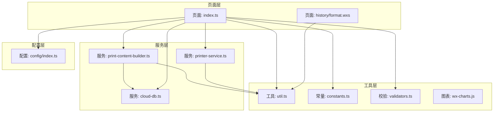
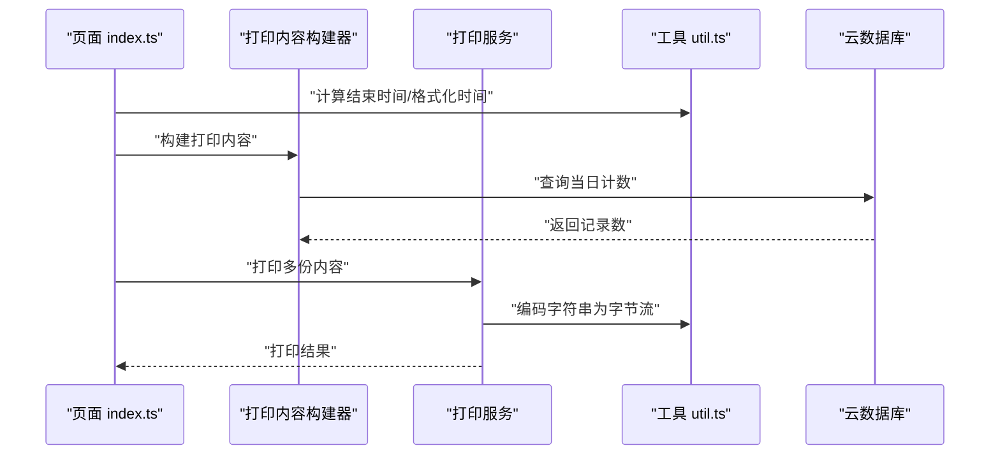
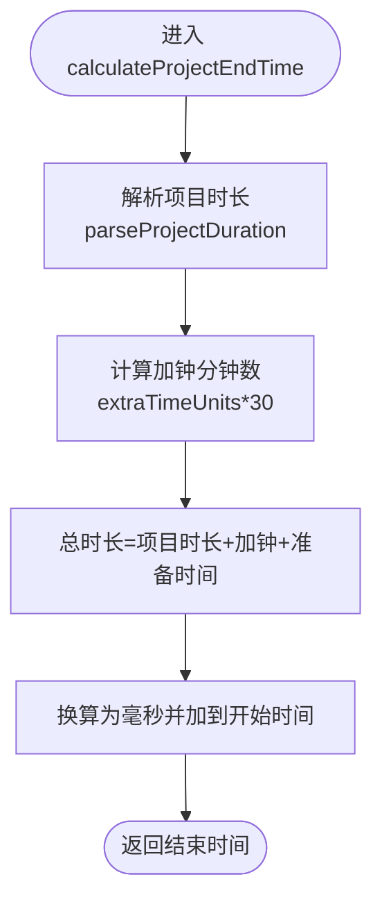
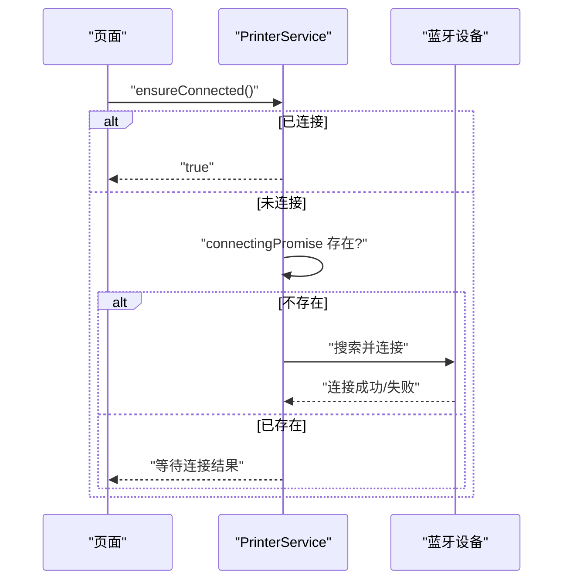
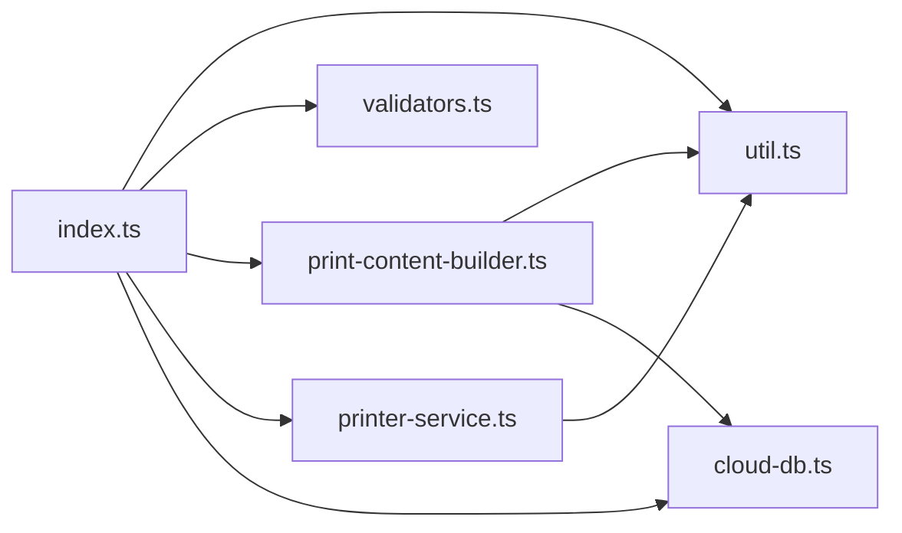

# 代码优化策略

<cite>
**本文引用的文件**
- [miniprogram/utils/util.ts](file://miniprogram/utils/util.ts)
- [miniprogram/utils/constants.ts](file://miniprogram/utils/constants.ts)
- [miniprogram/pages/index/index.ts](file://miniprogram/pages/index/index.ts)
- [miniprogram/services/print-content-builder.ts](file://miniprogram/services/print-content-builder.ts)
- [miniprogram/services/printer-service.ts](file://miniprogram/services/printer-service.ts)
- [miniprogram/utils/cloud-db.ts](file://miniprogram/utils/cloud-db.ts)
- [miniprogram/utils/validators.ts](file://miniprogram/utils/validators.ts)
- [miniprogram/config/index.ts](file://miniprogram/config/index.ts)
- [miniprogram/pages/history/format.wxs](file://miniprogram/pages/history/format.wxs)
- [miniprogram/components/timeline/timeline.ts](file://miniprogram/components/timeline/timeline.ts)
- [miniprogram/utils/wx-charts.js](file://miniprogram/utils/wx-charts.js)
- [tsconfig.json](file://tsconfig.json)
</cite>

## 目录
1. [引言](#引言)
2. [项目结构](#项目结构)
3. [核心组件](#核心组件)
4. [架构总览](#架构总览)
5. [详细组件分析](#详细组件分析)
6. [依赖分析](#依赖分析)
7. [性能考量](#性能考量)
8. [故障排查指南](#故障排查指南)
9. [结论](#结论)
10. [附录](#附录)

## 引言
本指南聚焦于代码优化策略，围绕以下主题展开：Util 工具类中的性能优化实现（时间格式化、日期计算、字符串处理）、Constants 常量配置的最佳实践、算法与数据结构优化（时间/空间复杂度、缓存机制）、内存与垃圾回收优化、对象池技术、以及 TypeScript 类型检查对性能的影响与优化方法。文中结合实际源码路径进行分析，并提供可操作的优化建议与可视化图示。

## 项目结构
该项目为微信小程序前端工程，采用按功能域划分的组织方式：
- utils：通用工具与常量
- services：业务服务层（打印、云数据库等）
- pages：页面逻辑与视图交互
- components：自定义组件
- typings：类型声明
- config：应用配置

**图表来源**
- [miniprogram/pages/index/index.ts](file://miniprogram/pages/index/index.ts#L1-L735)
- [miniprogram/services/print-content-builder.ts](file://miniprogram/services/print-content-builder.ts#L1-L144)
- [miniprogram/services/printer-service.ts](file://miniprogram/services/printer-service.ts#L1-L298)
- [miniprogram/utils/util.ts](file://miniprogram/utils/util.ts#L1-L150)
- [miniprogram/utils/constants.ts](file://miniprogram/utils/constants.ts#L1-L49)
- [miniprogram/utils/validators.ts](file://miniprogram/utils/validators.ts#L1-L81)
- [miniprogram/utils/cloud-db.ts](file://miniprogram/utils/cloud-db.ts#L1-L321)
- [miniprogram/pages/history/format.wxs](file://miniprogram/pages/history/format.wxs#L1-L23)
- [miniprogram/config/index.ts](file://miniprogram/config/index.ts#L1-L18)

**章节来源**
- [miniprogram/pages/index/index.ts](file://miniprogram/pages/index/index.ts#L1-L735)
- [miniprogram/utils/util.ts](file://miniprogram/utils/util.ts#L1-L150)
- [miniprogram/utils/constants.ts](file://miniprogram/utils/constants.ts#L1-L49)

## 核心组件
- 工具函数模块（util.ts）：提供时间格式化、日期计算、字符串解析与比较、时长格式化、加班单位计算、项目结束时间计算等高性能函数。
- 常量配置模块（constants.ts）：集中定义枚举、映射与默认值，避免魔法值，提升可维护性与运行时查找效率。
- 业务服务（print-content-builder.ts、printer-service.ts、cloud-db.ts）：封装打印内容构建、蓝牙打印流程、云数据库访问。
- 页面入口（index.ts）：协调表单、校验、保存、打印、报钟等流程。
- 校验模块（validators.ts）：统一表单校验与错误提示。
- 配置模块（config/index.ts）：应用环境配置。
- 历史页 WXS（history/format.wxs）：渲染侧格式化。
- 时间线组件（components/timeline/timeline.ts）：时间块计算与空隙分析。
- 图表工具（wx-charts.js）：数值处理辅助。

**章节来源**
- [miniprogram/utils/util.ts](file://miniprogram/utils/util.ts#L1-L150)
- [miniprogram/utils/constants.ts](file://miniprogram/utils/constants.ts#L1-L49)
- [miniprogram/services/print-content-builder.ts](file://miniprogram/services/print-content-builder.ts#L1-L144)
- [miniprogram/services/printer-service.ts](file://miniprogram/services/printer-service.ts#L1-L298)
- [miniprogram/utils/cloud-db.ts](file://miniprogram/utils/cloud-db.ts#L1-L321)
- [miniprogram/pages/index/index.ts](file://miniprogram/pages/index/index.ts#L1-L735)
- [miniprogram/utils/validators.ts](file://miniprogram/utils/validators.ts#L1-L81)
- [miniprogram/config/index.ts](file://miniprogram/config/index.ts#L1-L18)
- [miniprogram/pages/history/format.wxs](file://miniprogram/pages/history/format.wxs#L1-L23)
- [miniprogram/components/timeline/timeline.ts](file://miniprogram/components/timeline/timeline.ts#L296-L339)
- [miniprogram/utils/wx-charts.js](file://miniprogram/utils/wx-charts.js#L48-L88)

## 架构总览
整体采用“页面-服务-工具-配置”的分层架构，页面负责交互与编排，服务层封装业务流程，工具层提供可复用的算法与数据结构，配置层提供环境参数。

**图表来源**
- [miniprogram/pages/index/index.ts](file://miniprogram/pages/index/index.ts#L388-L481)
- [miniprogram/services/print-content-builder.ts](file://miniprogram/services/print-content-builder.ts#L31-L95)
- [miniprogram/services/printer-service.ts](file://miniprogram/services/printer-service.ts#L210-L233)
- [miniprogram/utils/util.ts](file://miniprogram/utils/util.ts#L96-L105)
- [miniprogram/utils/cloud-db.ts](file://miniprogram/utils/cloud-db.ts#L283-L298)

## 详细组件分析

### 工具函数模块（util.ts）性能优化要点
- 字符串拼接与填充
  - 使用 padStart 进行固定宽度输出，避免重复字符串拼接与正则替换，降低 CPU 开销。
  - 时间格式化函数 formatTime/formatDate 在高频渲染场景中应避免重复创建临时字符串，可在上层缓存或复用格式模板。
- 数值计算与比较
  - 将 HH:mm 字符串转换为分钟数进行比较，避免逐字符比较带来的分支复杂度。
  - overlap 检查采用直接数值比较，时间复杂度 O(1)，空间复杂度 O(1)。
- 时长格式化
  - formatDuration 使用整除与取模，避免浮点运算误差；条件分支清晰，利于 JIT 优化。
- 项目结束时间计算
  - calculateProjectEndTime 将分钟换算为毫秒一次性加到 Date 对象，减少多次时间运算。
- 常量与映射
  - SPARE_TIME、SHIFT_START_TIMES/SHIFT_END_TIMES 作为常量与只读映射，避免重复解析与构造。

**图表来源**
- [miniprogram/utils/util.ts](file://miniprogram/utils/util.ts#L96-L105)

**章节来源**
- [miniprogram/utils/util.ts](file://miniprogram/utils/util.ts#L1-L150)

### 常量配置模块（constants.ts）最佳实践
- 使用只读映射与联合类型
  - SHIFT_TYPES 使用 as const + typeof 联合类型，确保类型安全与运行时不可变。
  - SHIFT_NAMES/SHIFT_START_TIME/SHIFT_END_TIME 以 Record 映射存储，查找 O(1)，减少分支判断。
- 默认值与枚举
  - DEFAULT_SHIFT 提供默认排班类型，避免空值判断。
- 建议
  - 将高频使用的常量抽取为顶层导出，避免重复导入与模块加载开销。
  - 对枚举值进行边界校验，防止越界访问。

**章节来源**
- [miniprogram/utils/constants.ts](file://miniprogram/utils/constants.ts#L1-L49)

### 打印内容构建器（print-content-builder.ts）优化
- 内容构建
  - 使用静态模板与映射表（strengthMap/partMap）进行快速替换，避免频繁字符串拼接。
  - 通过异步查询当日计数，减少重复计算与网络请求。
- 性能建议
  - 将映射表缓存至类实例属性，避免重复创建。
  - 对外部依赖（云数据库）增加本地缓存与失效策略。

**章节来源**
- [miniprogram/services/print-content-builder.ts](file://miniprogram/services/print-content-builder.ts#L1-L144)

### 打印服务（printer-service.ts）优化
- 连接与状态管理
  - 使用 connectingPromise 避免重复连接，ensureConnected 实现幂等连接。
  - isConnected 通过状态字段快速判定，减少 API 调用。
- 分片打印
  - printContent 采用固定大小分片（chunkSize）与定时器推进，平衡吞吐与稳定性。
- 性能建议
  - 将 chunkSize 参数化，依据设备能力动态调整。
  - 在打印队列中引入背压控制，避免内存峰值过高。
  - 对 GBK 编码进行缓存，减少重复编码开销。

**图表来源**
- [miniprogram/services/printer-service.ts](file://miniprogram/services/printer-service.ts#L182-L195)

**章节来源**
- [miniprogram/services/printer-service.ts](file://miniprogram/services/printer-service.ts#L1-L298)

### 云数据库（cloud-db.ts）优化
- 查询策略
  - find 支持函数式过滤与条件过滤，函数式路径会先全量拉取再过滤，适合小数据集。
  - findWithPage 并行执行查询与计数，减少往返延迟。
- 性能建议
  - 大数据集优先使用 where + 排序 + 分页，避免全量拉取。
  - 对高频查询建立索引（在后端数据库层面），前端仅做查询条件构造。
  - 增加本地缓存层，对热点数据设置 TTL。

**章节来源**
- [miniprogram/utils/cloud-db.ts](file://miniprogram/utils/cloud-db.ts#L1-L321)

### 页面入口（index.ts）流程优化
- 表单保存与打印
  - 保存前进行 validateConsultationForPrint 校验，避免无效请求。
  - 计算结束时间与加班时长，统一由 util.ts 提供，保证一致性。
- 性能建议
  - 将日期与时间计算结果缓存至页面 data，减少重复计算。
  - 打印多份内容时，合理设置延时，避免设备过载。

**章节来源**
- [miniprogram/pages/index/index.ts](file://miniprogram/pages/index/index.ts#L388-L481)
- [miniprogram/utils/validators.ts](file://miniprogram/utils/validators.ts#L1-L81)

### 历史页 WXS（history/format.wxs）优化
- 渲染侧格式化
  - formatSettlementTime 在 WXS 中完成格式化，减少 JS 线程压力。
- 建议
  - 将常用格式模板抽离为常量，避免重复字符串构造。

**章节来源**
- [miniprogram/pages/history/format.wxs](file://miniprogram/pages/history/format.wxs#L1-L23)

### 时间线组件（timeline.ts）算法优化
- 空闲槽位计算
  - 将时间块转换为分钟数进行比较，避免字符串比较。
  - 通过一次遍历计算相邻块之间的间隙，时间复杂度 O(n)。
- 建议
  - 对 blocks 进行预排序，确保遍历正确性。
  - 对当前块定位使用二分查找，进一步降低复杂度。

**章节来源**
- [miniprogram/components/timeline/timeline.ts](file://miniprogram/components/timeline/timeline.ts#L296-L339)

### 图表工具（wx-charts.js）数值处理
- 数值处理
  - 提供 toFixed、approximatelyEqual、isSameSign 等工具，便于图表渲染前的数据清洗。
- 建议
  - 对浮点精度问题使用阈值比较，避免直接相等判断。

**章节来源**
- [miniprogram/utils/wx-charts.js](file://miniprogram/utils/wx-charts.js#L48-L88)

## 依赖分析
- 组件耦合
  - index.ts 依赖 util.ts、validators.ts、print-content-builder.ts、printer-service.ts、cloud-db.ts。
  - print-content-builder.ts 依赖 util.ts 与 cloud-db.ts。
  - printer-service.ts 依赖 util.ts（编码）。
- 外部依赖
  - 微信云开发与蓝牙 API，需关注调用频率与权限。
- 循环依赖
  - 未发现循环依赖迹象。

**图表来源**
- [miniprogram/pages/index/index.ts](file://miniprogram/pages/index/index.ts#L1-L14)
- [miniprogram/services/print-content-builder.ts](file://miniprogram/services/print-content-builder.ts#L1-L8)
- [miniprogram/services/printer-service.ts](file://miniprogram/services/printer-service.ts#L1-L7)
- [miniprogram/utils/util.ts](file://miniprogram/utils/util.ts#L1-L11)

**章节来源**
- [miniprogram/pages/index/index.ts](file://miniprogram/pages/index/index.ts#L1-L14)
- [miniprogram/services/print-content-builder.ts](file://miniprogram/services/print-content-builder.ts#L1-L8)
- [miniprogram/services/printer-service.ts](file://miniprogram/services/printer-service.ts#L1-L7)
- [miniprogram/utils/util.ts](file://miniprogram/utils/util.ts#L1-L11)

## 性能考量
- 时间复杂度优化
  - 使用映射表与常量替代分支判断，查找 O(1)。
  - 字符串到分钟的转换与数值比较，避免字符串比较的额外开销。
- 空间复杂度控制
  - 函数内局部变量与临时数组尽量复用，减少 GC 压力。
  - 对大对象（如映射表）进行懒初始化或按需创建。
- 缓存机制
  - 打印内容构建器与打印服务中的编码结果可缓存。
  - 云数据库查询结果增加本地缓存与失效策略。
- 内存与 GC 优化
  - 避免在热路径创建大量临时字符串与对象。
  - 合理使用 WeakRef（若可用）与弱引用容器，降低持有导致的泄漏风险。
- 对象池技术
  - 在频繁创建销毁的对象（如图表数据项、渲染缓冲）场景引入对象池，减少分配与回收成本。
- TypeScript 类型检查对性能的影响
  - 严格模式（strict、noImplicitAny 等）在编译期消除运行时不确定性，有助于 JIT 优化。
  - 联合类型与字面量类型可帮助引擎进行分支消除与内联优化。
  - 建议开启 noUnusedLocals/noUnusedParameters，减少冗余代码体积。

**章节来源**
- [tsconfig.json](file://tsconfig.json#L1-L30)

## 故障排查指南
- 打印失败
  - 检查打印机连接状态与特征值是否存在。
  - 分片打印失败时查看回调错误码，适当增大延时或减小分片大小。
- 数据库查询异常
  - 确认环境 ID 配置正确，网络请求返回码与错误信息。
  - 对大数据集使用分页查询，避免一次性拉取过多数据。
- 表单校验失败
  - 校验函数返回错误消息，前端提示用户修正必填项。
- 时间计算偏差
  - 确保 HH:mm 字符串格式一致，避免跨时区与夏令时影响。

**章节来源**
- [miniprogram/services/printer-service.ts](file://miniprogram/services/printer-service.ts#L197-L268)
- [miniprogram/utils/cloud-db.ts](file://miniprogram/utils/cloud-db.ts#L28-L47)
- [miniprogram/utils/validators.ts](file://miniprogram/utils/validators.ts#L74-L81)
- [miniprogram/utils/util.ts](file://miniprogram/utils/util.ts#L26-L39)

## 结论
通过对工具函数、常量配置、服务层与页面层的系统性优化，可以在不牺牲可读性的前提下显著提升性能。建议重点从“常量与映射”“数值计算与比较”“缓存与分页”“打印分片与背压”“类型严格性”五个维度持续改进，并结合实际运行指标进行回归验证。

## 附录
- 优化前后对比示例（以路径代替具体代码）
  - 时间格式化：使用 padStart 替代正则填充，减少正则编译与回溯开销。
    - 优化前参考：[miniprogram/utils/util.ts](file://miniprogram/utils/util.ts#L3-L11)
    - 优化后参考：同文件相同函数，保持 O(1) 字符串长度与 O(1) 填充。
  - 日期计算：将 HH:mm 转换为分钟进行比较，避免字符串比较。
    - 优化前参考：[miniprogram/utils/util.ts](file://miniprogram/utils/util.ts#L26-L39)
    - 优化后参考：同文件，数值比较 O(1)。
  - 字符串处理：映射表替换条件分支，查找 O(1)。
    - 优化前参考：[miniprogram/services/print-content-builder.ts](file://miniprogram/services/print-content-builder.ts#L11-L27)
    - 优化后参考：同文件映射表属性，查找 O(1)。
  - 打印分片：固定分片大小与延时，平衡吞吐与稳定性。
    - 优化前参考：[miniprogram/services/printer-service.ts](file://miniprogram/services/printer-service.ts#L235-L268)
    - 优化后参考：同文件，参数化分片大小与延时。
  - 类型严格性：启用严格选项，减少运行时分支与错误。
    - 优化前参考：[tsconfig.json](file://tsconfig.json#L2-L22)
    - 优化后参考：同文件严格配置，提升编译期优化空间。