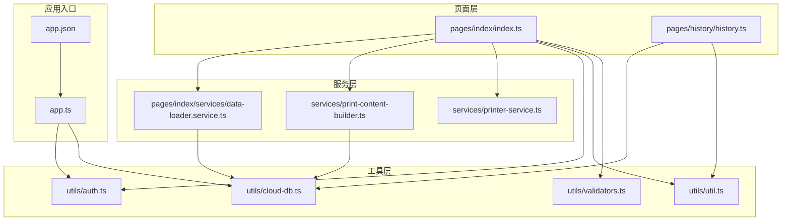
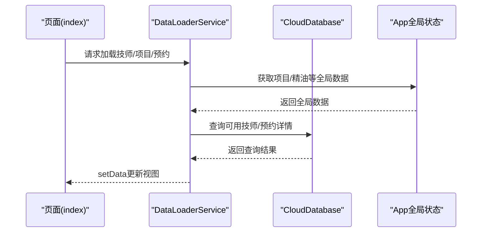
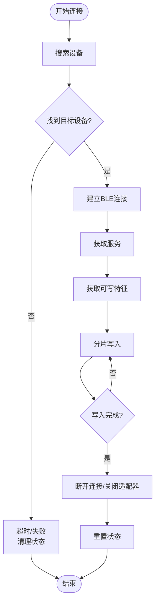
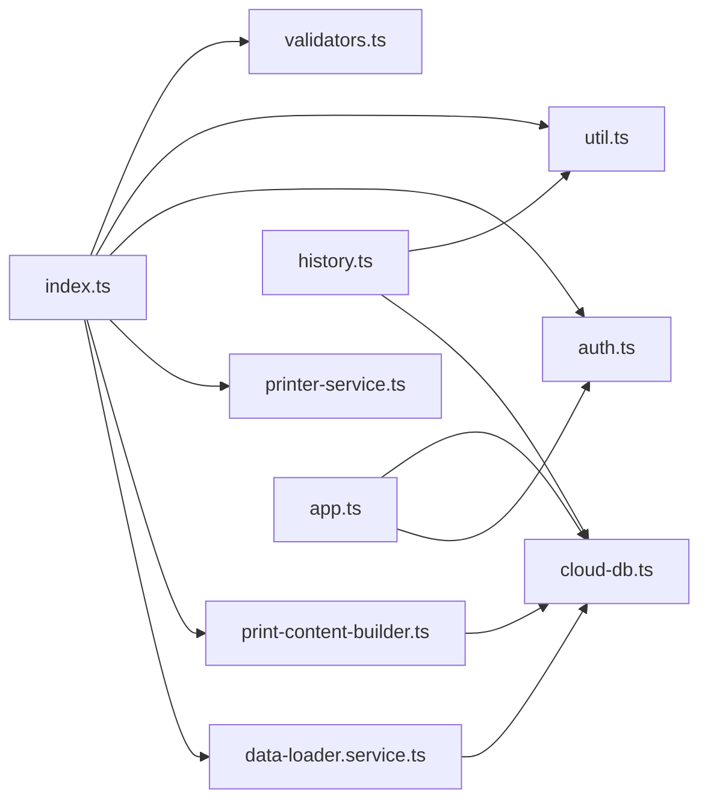

# 内存管理优化

<cite>
**本文引用的文件**
- [miniprogram/app.ts](file://miniprogram/app.ts)
- [miniprogram/app.json](file://miniprogram/app.json)
- [miniprogram/utils/cloud-db.ts](file://miniprogram/utils/cloud-db.ts)
- [miniprogram/services/printer-service.ts](file://miniprogram/services/printer-service.ts)
- [miniprogram/pages/index/index.ts](file://miniprogram/pages/index/index.ts)
- [miniprogram/pages/history/history.ts](file://miniprogram/pages/history/history.ts)
- [miniprogram/utils/auth.ts](file://miniprogram/utils/auth.ts)
- [miniprogram/utils/util.ts](file://miniprogram/utils/util.ts)
- [miniprogram/services/print-content-builder.ts](file://miniprogram/services/print-content-builder.ts)
- [miniprogram/pages/index/services/data-loader.service.ts](file://miniprogram/pages/index/services/data-loader.service.ts)
- [miniprogram/utils/validators.ts](file://miniprogram/utils/validators.ts)
- [typings/types/wx/index.d.ts](file://typings/types/wx/index.d.ts)
</cite>

## 目录
1. [引言](#引言)
2. [项目结构](#项目结构)
3. [核心组件](#核心组件)
4. [架构总览](#架构总览)
5. [详细组件分析](#详细组件分析)
6. [依赖关系分析](#依赖关系分析)
7. [性能考量与优化建议](#性能考量与优化建议)
8. [故障排查指南](#故障排查指南)
9. [结论](#结论)
10. [附录：内存使用监控与测试方法](#附录内存使用监控与测试方法)

## 引言
本指南面向小程序“ConsultationPrinter”项目，聚焦于内存管理优化，覆盖以下主题：
- 小程序内存限制与回收机制概述
- 对象生命周期管理与内存泄漏预防
- 大数组处理、图片与数据结构优化策略
- 内存使用监控工具与微信开发者工具的内存分析功能
- 页面栈管理、路由与页面销毁优化
- 异步操作、定时器与事件监听器的内存管理
- 内存性能测试、泄漏排查技术与最佳实践案例

## 项目结构
该项目采用典型的分层组织方式：页面层、服务层、工具层与云数据库封装层。页面通过服务层协调业务逻辑，服务层再通过工具层与云数据库交互；全局状态通过 App 生命周期进行加载与复用。

**图表来源**
- [miniprogram/pages/index/index.ts](file://miniprogram/pages/index/index.ts#L1-L735)
- [miniprogram/pages/history/history.ts](file://miniprogram/pages/history/history.ts#L1-L739)
- [miniprogram/pages/index/services/data-loader.service.ts](file://miniprogram/pages/index/services/data-loader.service.ts#L1-L206)
- [miniprogram/services/print-content-builder.ts](file://miniprogram/services/print-content-builder.ts#L1-L144)
- [miniprogram/services/printer-service.ts](file://miniprogram/services/printer-service.ts#L1-L298)
- [miniprogram/utils/cloud-db.ts](file://miniprogram/utils/cloud-db.ts#L1-L321)
- [miniprogram/utils/auth.ts](file://miniprogram/utils/auth.ts#L1-L245)
- [miniprogram/utils/util.ts](file://miniprogram/utils/util.ts#L1-L150)
- [miniprogram/utils/validators.ts](file://miniprogram/utils/validators.ts#L1-L81)
- [miniprogram/app.ts](file://miniprogram/app.ts#L1-L191)
- [miniprogram/app.json](file://miniprogram/app.json#L1-L35)

**章节来源**
- [miniprogram/app.ts](file://miniprogram/app.ts#L1-L191)
- [miniprogram/app.json](file://miniprogram/app.json#L1-L35)

## 核心组件
- 全局应用状态与数据加载：App 提供全局数据容器与一次性加载逻辑，避免重复拉取与重复持有大对象。
- 云数据库封装：统一查询、分页、保存等操作，减少重复网络请求与中间结果缓存。
- 页面数据加载服务：按需加载技师列表、项目列表与预约数据，避免一次性加载过多数据。
- 打印服务：蓝牙连接、特征读写、分片发送，注意连接状态与资源释放。
- 认证与权限：静默登录、存储令牌与用户信息，避免重复登录与无效对象保留。
- 工具函数：时间计算、格式化、验证器，减少临时字符串与对象的创建。

**章节来源**
- [miniprogram/app.ts](file://miniprogram/app.ts#L40-L108)
- [miniprogram/utils/cloud-db.ts](file://miniprogram/utils/cloud-db.ts#L69-L298)
- [miniprogram/pages/index/services/data-loader.service.ts](file://miniprogram/pages/index/services/data-loader.service.ts#L13-L74)
- [miniprogram/services/printer-service.ts](file://miniprogram/services/printer-service.ts#L31-L195)
- [miniprogram/utils/auth.ts](file://miniprogram/utils/auth.ts#L78-L165)
- [miniprogram/utils/util.ts](file://miniprogram/utils/util.ts#L1-L150)
- [miniprogram/utils/validators.ts](file://miniprogram/utils/validators.ts#L1-L81)

## 架构总览
从内存管理视角，系统的关键路径如下：
- 页面进入时按需加载数据，避免常驻大数组与复杂对象
- 云数据库封装统一处理网络请求与结果缓存，减少重复对象
- 打印服务在连接成功后进行分片写入，完成后及时断开蓝牙与释放状态
- 认证模块使用单例与本地存储，避免重复实例与持久化对象泄漏
- 工具函数尽量复用映射表与格式化字符串，减少临时对象

**图表来源**
- [miniprogram/pages/index/index.ts](file://miniprogram/pages/index/index.ts#L126-L147)
- [miniprogram/pages/index/services/data-loader.service.ts](file://miniprogram/pages/index/services/data-loader.service.ts#L13-L74)
- [miniprogram/utils/cloud-db.ts](file://miniprogram/utils/cloud-db.ts#L69-L131)
- [miniprogram/app.ts](file://miniprogram/app.ts#L68-L108)

## 详细组件分析

### 全局应用与内存复用
- 全局数据加载采用一次性 Promise 防抖，避免并发重复拉取
- 全局数据字段在首次加载后置为只读或受控更新，减少重复赋值与中间对象
- 登录流程采用单例与静默登录，避免重复实例与持久化对象泄漏

优化要点
- 在 App 中对全局数据的访问统一通过异步 getter，确保只在未加载时触发一次
- 对全局数组（项目、房间、精油、员工）在不需要时及时清空或置空，避免常驻占用

**章节来源**
- [miniprogram/app.ts](file://miniprogram/app.ts#L40-L108)
- [miniprogram/utils/auth.ts](file://miniprogram/utils/auth.ts#L78-L95)

### 云数据库封装与内存控制
- 统一的数据库封装类，集中处理初始化、查询、分页与保存
- 分页查询使用 Promise 并行统计与数据获取，避免一次性加载全部数据
- 保存与查询结果尽量返回扁平化对象，减少深层嵌套导致的 GC 压力

优化要点
- 对超大数据集优先使用分页查询，避免一次性构造巨大数组
- 对查询条件使用索引友好字段，减少全表扫描带来的中间结果膨胀
- 在 finally 中清理临时状态，防止 Promise 未完成导致的状态残留

**章节来源**
- [miniprogram/utils/cloud-db.ts](file://miniprogram/utils/cloud-db.ts#L69-L298)

### 页面数据加载服务与内存
- 按需加载：仅在页面显示或需要时才发起网络请求
- 数据合并：将多个来源的数据合并到 setData，避免多次 setData 造成中间对象堆积
- 预约数据加载支持多条合并，注意在 setData 前先过滤有效数据

优化要点
- 在页面隐藏或离开时，及时清理加载状态与临时数组
- 对预约 ID 列表与当前编辑记录 ID 进行去重与长度控制，避免无限增长

**章节来源**
- [miniprogram/pages/index/services/data-loader.service.ts](file://miniprogram/pages/index/services/data-loader.service.ts#L13-L74)
- [miniprogram/pages/index/services/data-loader.service.ts](file://miniprogram/pages/index/services/data-loader.service.ts#L128-L204)

### 打印服务与蓝牙资源管理
- 连接流程：搜索设备、建立连接、获取服务与特征，成功后关闭搜索与监听
- 分片写入：将大文本编码为字节流，按固定大小分片写入，避免一次性构造超大缓冲区
- 断开流程：关闭连接、停止搜索、关闭适配器，并重置内部状态

优化要点
- 在连接超时或失败时，务必移除监听器与清理状态，防止悬挂回调
- 分片大小与写入间隔需平衡吞吐与内存峰值，避免连续写入导致内存抖动
- 打印完成后立即提示并释放状态，避免长时间持有设备句柄

**图表来源**
- [miniprogram/services/printer-service.ts](file://miniprogram/services/printer-service.ts#L31-L195)
- [miniprogram/services/printer-service.ts](file://miniprogram/services/printer-service.ts#L235-L269)
- [miniprogram/services/printer-service.ts](file://miniprogram/services/printer-service.ts#L271-L294)

**章节来源**
- [miniprogram/services/printer-service.ts](file://miniprogram/services/printer-service.ts#L31-L195)
- [miniprogram/services/printer-service.ts](file://miniprogram/services/printer-service.ts#L235-L269)
- [miniprogram/services/printer-service.ts](file://miniprogram/services/printer-service.ts#L271-L294)

### 页面生命周期与内存回收
- 页面 onShow/onHide：在显示时加载必要数据，在隐藏时清理状态与定时器
- 页面跳转：使用 navigateTo/reLaunch 等合理路由，避免页面栈过深导致内存压力
- 历史页面：按日分组展示，避免一次性渲染大量记录

优化要点
- 在页面卸载时主动清理事件监听、定时器与异步任务
- 对历史页面的分组与展开状态使用局部 data，避免全局常驻

**章节来源**
- [miniprogram/pages/history/history.ts](file://miniprogram/pages/history/history.ts#L89-L98)
- [miniprogram/pages/history/history.ts](file://miniprogram/pages/history/history.ts#L146-L186)

### 认证与权限管理
- 单例认证管理器，避免重复实例
- 静默登录与登录 Promise 防抖，避免重复网络请求
- 登出时清理本地存储并重启应用

优化要点
- 登录 Promise 完成后及时置空，避免长期持有
- 用户信息更新时仅更新必要字段，避免大对象深拷贝

**章节来源**
- [miniprogram/utils/auth.ts](file://miniprogram/utils/auth.ts#L78-L165)

### 工具函数与数据结构优化
- 时间与日期工具：尽量复用格式化字符串，避免频繁拼接
- 验证器：统一返回结构，减少分支中的临时对象
- 映射表：将枚举与映射表定义为常量，减少重复创建

优化要点
- 对高频调用的映射表与格式化函数进行缓存
- 避免在循环中创建临时数组与对象

**章节来源**
- [miniprogram/utils/util.ts](file://miniprogram/utils/util.ts#L1-L150)
- [miniprogram/utils/validators.ts](file://miniprogram/utils/validators.ts#L1-L81)

## 依赖关系分析
- 页面依赖服务层，服务层依赖工具层与云数据库封装
- App 为全局状态中心，被页面与服务层间接依赖
- 认证模块被页面与服务层共享，避免重复登录

**图表来源**
- [miniprogram/pages/index/index.ts](file://miniprogram/pages/index/index.ts#L1-L15)
- [miniprogram/pages/index/services/data-loader.service.ts](file://miniprogram/pages/index/services/data-loader.service.ts#L1-L11)
- [miniprogram/services/print-content-builder.ts](file://miniprogram/services/print-content-builder.ts#L1-L2)
- [miniprogram/services/printer-service.ts](file://miniprogram/services/printer-service.ts#L1-L1)
- [miniprogram/pages/history/history.ts](file://miniprogram/pages/history/history.ts#L1-L4)
- [miniprogram/utils/cloud-db.ts](file://miniprogram/utils/cloud-db.ts#L1-L2)
- [miniprogram/utils/auth.ts](file://miniprogram/utils/auth.ts#L1-L4)
- [miniprogram/utils/util.ts](file://miniprogram/utils/util.ts#L1-L2)
- [miniprogram/utils/validators.ts](file://miniprogram/utils/validators.ts#L1-L2)
- [miniprogram/app.ts](file://miniprogram/app.ts#L1-L4)

**章节来源**
- [miniprogram/pages/index/index.ts](file://miniprogram/pages/index/index.ts#L1-L15)
- [miniprogram/pages/index/services/data-loader.service.ts](file://miniprogram/pages/index/services/data-loader.service.ts#L1-L11)
- [miniprogram/services/print-content-builder.ts](file://miniprogram/services/print-content-builder.ts#L1-L2)
- [miniprogram/services/printer-service.ts](file://miniprogram/services/printer-service.ts#L1-L1)
- [miniprogram/pages/history/history.ts](file://miniprogram/pages/history/history.ts#L1-L4)
- [miniprogram/utils/cloud-db.ts](file://miniprogram/utils/cloud-db.ts#L1-L2)
- [miniprogram/utils/auth.ts](file://miniprogram/utils/auth.ts#L1-L4)
- [miniprogram/utils/util.ts](file://miniprogram/utils/util.ts#L1-L2)
- [miniprogram/utils/validators.ts](file://miniprogram/utils/validators.ts#L1-L2)
- [miniprogram/app.ts](file://miniprogram/app.ts#L1-L4)

## 性能考量与优化建议
- 大数组处理
  - 优先分页查询与懒加载，避免一次性渲染/处理全部数据
  - 对历史页面按日分组展示，使用折叠与延迟渲染
- 图片内存优化
  - 避免在列表中直接渲染大图，使用缩略图或占位图
  - 及时释放不再使用的图片资源（如预览后销毁）
- 数据结构优化
  - 使用扁平化对象与映射表，减少嵌套层级
  - 对高频字段使用常量映射，避免重复字符串创建
- 异步与定时器
  - 在页面 onHide/onUnload 中清理所有定时器与异步任务
  - 对 Promise 链路在 finally 中清理状态，防止悬挂
- 事件监听器
  - 在页面卸载时移除所有事件监听器，避免回调持有页面上下文
- 页面栈与路由
  - 合理使用 navigateTo/reLaunch，避免页面栈过深
  - 对不需要返回的页面使用 redirectTo 或 reLaunch

[本节为通用指导，无需特定文件引用]

## 故障排查指南
- 内存泄漏排查
  - 使用微信开发者工具的“性能面板”观察堆内存曲线，定位异常增长点
  - 关注页面 onUnload 生命周期是否被触发，确认事件监听器与定时器是否清理
- 打印服务问题
  - 检查连接状态与特征是否正确获取，失败时是否移除了监听器
  - 分片写入是否完整，失败时是否断开连接并重置状态
- 云数据库查询
  - 检查分页参数与条件，避免全表扫描
  - 确认 finally 中清理了临时状态
- 认证与权限
  - 登录 Promise 是否在 finally 中置空
  - 登出后是否清理了本地存储并重启应用

**章节来源**
- [miniprogram/services/printer-service.ts](file://miniprogram/services/printer-service.ts#L271-L294)
- [miniprogram/utils/cloud-db.ts](file://miniprogram/utils/cloud-db.ts#L242-L254)
- [miniprogram/utils/auth.ts](file://miniprogram/utils/auth.ts#L78-L95)

## 结论
通过统一的全局状态管理、按需加载与分页查询、严格的资源释放与事件清理，以及合理的页面栈与路由策略，可以在保证用户体验的同时显著降低内存占用与泄漏风险。建议在后续迭代中持续使用开发者工具的内存分析功能进行回归验证，并将上述优化策略纳入代码规范。

[本节为总结性内容，无需特定文件引用]

## 附录：内存使用监控与测试方法
- 微信开发者工具
  - 性能面板：观察堆内存曲线、GC 次数与耗时
  - 内存快照：对比操作前后对象数量与体积
  - 网络面板：检查请求频率与数据大小
- 定时器与事件
  - 使用定时器与事件监听器时，务必在页面卸载时清理
  - 参考基础 API 类型声明，确保清理函数调用正确
- 页面栈与路由
  - 控制页面栈深度，避免过多页面常驻
  - 对不需要返回的场景使用合适的导航 API

**章节来源**
- [typings/types/wx/index.d.ts](file://typings/types/wx/index.d.ts#L128-L163)