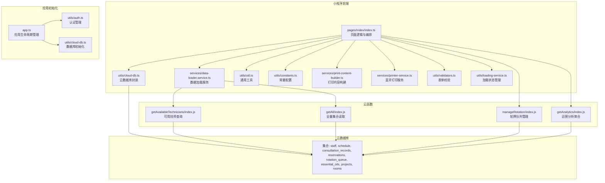
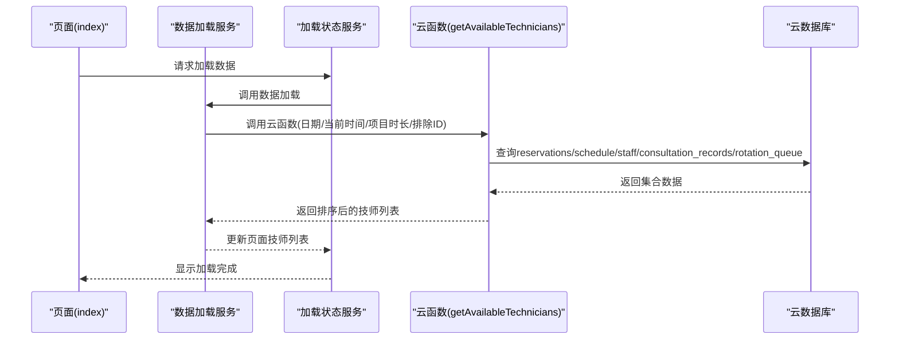
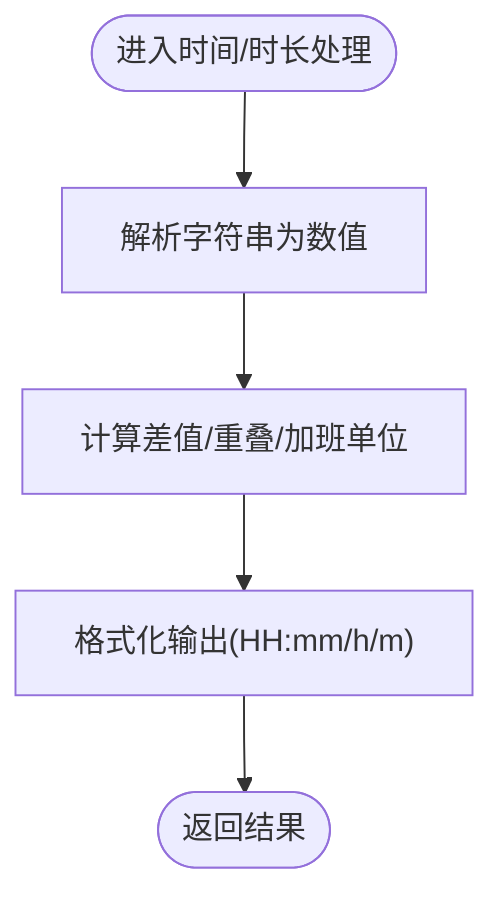
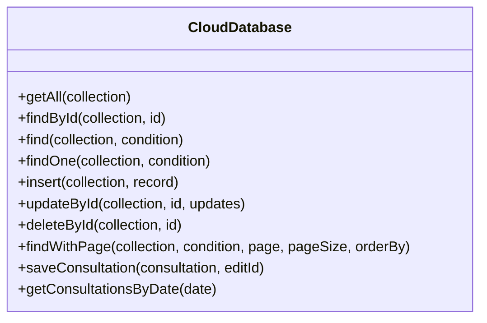
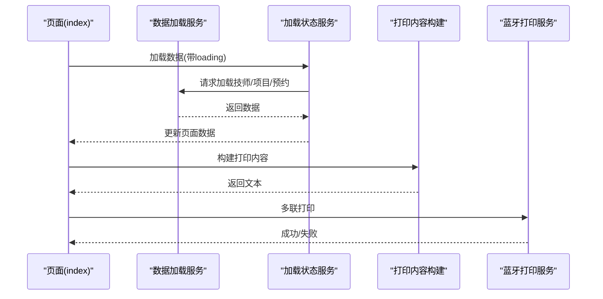
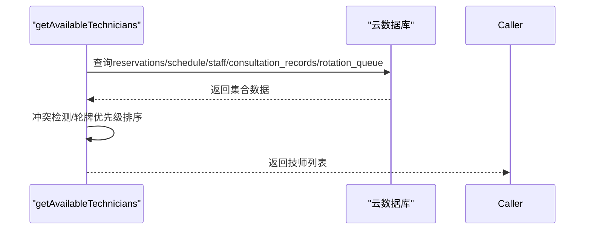
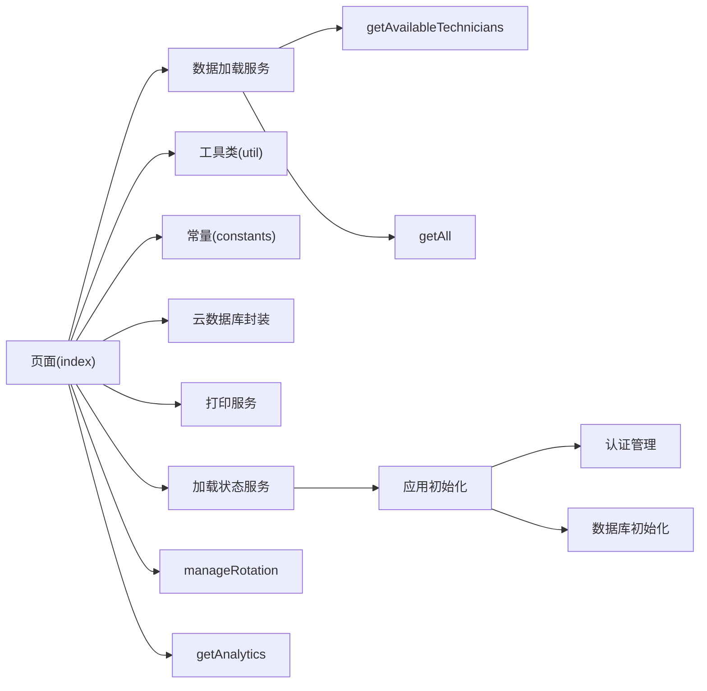
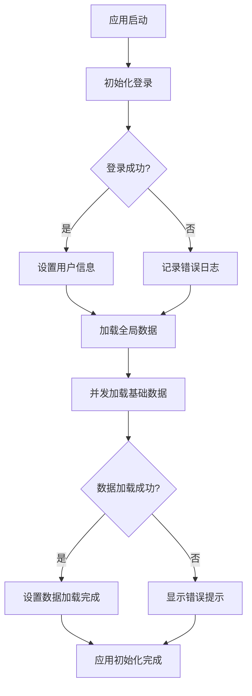

# 性能优化

<cite>
**本文档引用的文件**
- [miniprogram/utils/util.ts](file://miniprogram/utils/util.ts)
- [miniprogram/utils/constants.ts](file://miniprogram/utils/constants.ts)
- [miniprogram/app.ts](file://miniprogram/app.ts)
- [miniprogram/utils/cloud-db.ts](file://miniprogram/utils/cloud-db.ts)
- [miniprogram/pages/index/index.ts](file://miniprogram/pages/index/index.ts)
- [miniprogram/pages/index/services/data-loader.service.ts](file://miniprogram/pages/index/services/data-loader.service.ts)
- [miniprogram/pages/index/utils/clockin-utils.ts](file://miniprogram/pages/index/utils/clockin-utils.ts)
- [miniprogram/services/print-content-builder.ts](file://miniprogram/services/print-content-builder.ts)
- [miniprogram/services/printer-service.ts](file://miniprogram/services/printer-service.ts)
- [miniprogram/utils/validators.ts](file://miniprogram/utils/validators.ts)
- [miniprogram/utils/loading-service.ts](file://miniprogram/utils/loading-service.ts)
- [cloudfunctions/getAll/index.js](file://cloudfunctions/getAll/index.js)
- [cloudfunctions/getAvailableTechnicians/index.js](file://cloudfunctions/getAvailableTechnicians/index.js)
- [cloudfunctions/manageRotation/index.js](file://cloudfunctions/manageRotation/index.js)
- [cloudfunctions/getAnalytics/index.js](file://cloudfunctions/getAnalytics/index.js)
</cite>

## 更新摘要
**所做更改**
- 新增代码质量与可维护性章节，重点说明空catch块清理的影响
- 更新应用初始化流程分析，强调错误处理改进
- 增强异常处理最佳实践指导
- 完善性能监控与调试建议

## 目录
1. [简介](#简介)
2. [项目结构](#项目结构)
3. [核心组件](#核心组件)
4. [架构总览](#架构总览)
5. [详细组件分析](#详细组件分析)
6. [依赖关系分析](#依赖关系分析)
7. [性能考量与优化策略](#性能考量与优化策略)
8. [代码质量与可维护性](#代码质量与可维护性)
9. [故障排查指南](#故障排查指南)
10. [结论](#结论)
11. [附录：性能测试与基准参考](#附录性能测试与基准参考)

## 简介
本指南面向"咨询打印"小程序与云函数的整体性能优化，覆盖前端渲染与交互、网络请求、数据处理、数据库查询、云函数计算与索引、蓝牙打印链路、以及常量与工具类的性能影响与最佳实践。文档通过逐层剖析关键模块与调用路径，给出可落地的优化建议、可视化流程图与排障清单，并提供可复用的测试与监控思路。

**更新** 本次更新重点关注应用初始化过程中的空catch块清理，这一改进显著提升了代码质量和可维护性，为后续性能优化奠定了更坚实的基础。

## 项目结构
项目采用"小程序前端 + 微信云开发 + 云函数"的分层架构：
- 小程序前端负责用户交互、页面渲染、数据加载与业务编排
- 云数据库提供集合读取、条件查询、分页与计数
- 云函数封装复杂查询、聚合与跨集合事务性操作
- 蓝牙打印服务负责外设连接与内容下发

**图表来源**
- [miniprogram/pages/index/index.ts](file://miniprogram/pages/index/index.ts#L1-L735)
- [miniprogram/pages/index/services/data-loader.service.ts](file://miniprogram/pages/index/services/data-loader.service.ts#L1-L206)
- [miniprogram/utils/cloud-db.ts](file://miniprogram/utils/cloud-db.ts#L1-L321)
- [miniprogram/app.ts](file://miniprogram/app.ts#L1-L190)
- [cloudfunctions/getAvailableTechnicians/index.js](file://cloudfunctions/getAvailableTechnicians/index.js#L1-L285)
- [cloudfunctions/getAll/index.js](file://cloudfunctions/getAll/index.js#L1-L59)
- [cloudfunctions/manageRotation/index.js](file://cloudfunctions/manageRotation/index.js#L1-L327)
- [cloudfunctions/getAnalytics/index.js](file://cloudfunctions/getAnalytics/index.js#L1-L172)

**章节来源**
- [miniprogram/pages/index/index.ts](file://miniprogram/pages/index/index.ts#L1-L735)
- [miniprogram/utils/cloud-db.ts](file://miniprogram/utils/cloud-db.ts#L1-L321)
- [miniprogram/app.ts](file://miniprogram/app.ts#L1-L190)

## 核心组件
- 工具与常量
  - 时间/时长解析与格式化、加班单位计算、日期边界处理等
  - 预定义枚举与映射（强度、性别、平台、班次等），减少运行时拼装成本
- 云数据库封装
  - 统一初始化、条件查询、分页与计数、插入/更新/删除、按日期查询等
- 页面与服务编排
  - 表单校验、数据加载、轮牌调用、打印内容构建与蓝牙打印
- 云函数
  - 可用技师查询、全量集合读取、轮牌队列、运营分析聚合
- 加载状态管理
  - 统一的loading状态管理、防重复提交、错误处理与提示

**章节来源**
- [miniprogram/utils/util.ts](file://miniprogram/utils/util.ts#L1-L150)
- [miniprogram/utils/constants.ts](file://miniprogram/utils/constants.ts#L1-L49)
- [miniprogram/utils/cloud-db.ts](file://miniprogram/utils/cloud-db.ts#L1-L321)
- [miniprogram/pages/index/index.ts](file://miniprogram/pages/index/index.ts#L1-L735)
- [miniprogram/utils/loading-service.ts](file://miniprogram/utils/loading-service.ts#L1-L285)
- [cloudfunctions/getAvailableTechnicians/index.js](file://cloudfunctions/getAvailableTechnicians/index.js#L1-L285)
- [cloudfunctions/getAll/index.js](file://cloudfunctions/getAll/index.js#L1-L59)
- [cloudfunctions/manageRotation/index.js](file://cloudfunctions/manageRotation/index.js#L1-L327)
- [cloudfunctions/getAnalytics/index.js](file://cloudfunctions/getAnalytics/index.js#L1-L172)

## 架构总览
整体调用链从页面发起，经由数据加载服务与云数据库封装，调用云函数进行复杂查询或更新，最终落库或返回结果；打印链路由内容构建与蓝牙打印服务完成。

**图表来源**
- [miniprogram/pages/index/services/data-loader.service.ts](file://miniprogram/pages/index/services/data-loader.service.ts#L1-L206)
- [miniprogram/utils/loading-service.ts](file://miniprogram/utils/loading-service.ts#L1-L285)
- [cloudfunctions/getAvailableTechnicians/index.js](file://cloudfunctions/getAvailableTechnicians/index.js#L1-L285)
- [miniprogram/utils/cloud-db.ts](file://miniprogram/utils/cloud-db.ts#L1-L321)

## 详细组件分析

### 组件A：工具类与常量（性能优化要点）
- 时间/时长处理
  - 使用预编译正则与数值运算，避免重复字符串拆分与转换
  - 通过常量统一班次起止时间，减少分支判断开销
- 常量配置
  - 将枚举与映射集中于常量文件，避免在渲染路径重复构造对象
  - 使用只读结构与字面量，降低GC压力
- 优化建议
  - 对频繁使用的映射建立缓存（如强度/部位映射）
  - 在渲染前将常量映射扁平化，减少运行时查找

**图表来源**
- [miniprogram/utils/util.ts](file://miniprogram/utils/util.ts#L1-L150)
- [miniprogram/utils/constants.ts](file://miniprogram/utils/constants.ts#L1-L49)

**章节来源**
- [miniprogram/utils/util.ts](file://miniprogram/utils/util.ts#L1-L150)
- [miniprogram/utils/constants.ts](file://miniprogram/utils/constants.ts#L1-L49)

### 组件B：云数据库封装（查询与分页）
- 并发加载全局数据：使用 Promise.all 并发拉取多个集合，缩短首屏等待
- 条件查询与分页：对函数式条件与对象条件分别处理，避免全量扫描
- 分页与计数：同时发起数据与计数查询，减少二次请求
- 日期查询：使用正则表达式匹配日期前缀，注意索引与性能
- 错误处理：统一的错误捕获与降级策略，确保应用稳定性

**图表来源**
- [miniprogram/utils/cloud-db.ts](file://miniprogram/utils/cloud-db.ts#L1-L321)

**章节来源**
- [miniprogram/utils/cloud-db.ts](file://miniprogram/utils/cloud-db.ts#L1-L321)

### 组件C：页面与服务编排（渲染与交互）
- 页面生命周期与权限控制：登录态检查、权限校验、全局数据加载
- 表单校验：集中校验逻辑，避免重复渲染
- 数据加载：按需加载项目/技师/预约数据，减少首屏压力
- 打印链路：内容构建与蓝牙打印分离，支持多联打印与节流
- 加载状态管理：统一的loading状态管理，提升用户体验

**图表来源**
- [miniprogram/pages/index/index.ts](file://miniprogram/pages/index/index.ts#L1-L735)
- [miniprogram/pages/index/services/data-loader.service.ts](file://miniprogram/pages/index/services/data-loader.service.ts#L1-L206)
- [miniprogram/utils/loading-service.ts](file://miniprogram/utils/loading-service.ts#L1-L285)
- [miniprogram/services/print-content-builder.ts](file://miniprogram/services/print-content-builder.ts#L1-L144)
- [miniprogram/services/printer-service.ts](file://miniprogram/services/printer-service.ts#L1-L298)

**章节来源**
- [miniprogram/pages/index/index.ts](file://miniprogram/pages/index/index.ts#L1-L735)
- [miniprogram/pages/index/services/data-loader.service.ts](file://miniprogram/pages/index/services/data-loader.service.ts#L1-L206)
- [miniprogram/utils/loading-service.ts](file://miniprogram/utils/loading-service.ts#L1-L285)
- [miniprogram/services/print-content-builder.ts](file://miniprogram/services/print-content-builder.ts#L1-L144)
- [miniprogram/services/printer-service.ts](file://miniprogram/services/printer-service.ts#L1-L298)

### 组件D：云函数（查询与聚合）
- 可用技师查询：多集合联查、冲突检测、轮牌优先级排序
- 全量集合读取：分页游标读取，避免一次性拉取超大数据集
- 轮牌队列：初始化、取号、服务完成、位置调整
- 运营分析：按日聚合收入、订单、项目与平台分布

**图表来源**
- [cloudfunctions/getAvailableTechnicians/index.js](file://cloudfunctions/getAvailableTechnicians/index.js#L1-L285)
- [cloudfunctions/getAll/index.js](file://cloudfunctions/getAll/index.js#L1-L59)
- [cloudfunctions/manageRotation/index.js](file://cloudfunctions/manageRotation/index.js#L1-L327)
- [cloudfunctions/getAnalytics/index.js](file://cloudfunctions/getAnalytics/index.js#L1-L172)

**章节来源**
- [cloudfunctions/getAvailableTechnicians/index.js](file://cloudfunctions/getAvailableTechnicians/index.js#L1-L285)
- [cloudfunctions/getAll/index.js](file://cloudfunctions/getAll/index.js#L1-L59)
- [cloudfunctions/manageRotation/index.js](file://cloudfunctions/manageRotation/index.js#L1-L327)
- [cloudfunctions/getAnalytics/index.js](file://cloudfunctions/getAnalytics/index.js#L1-L172)

## 依赖关系分析
- 前端依赖
  - 页面依赖数据加载服务、云数据库封装、工具类与常量
  - 打印链路依赖内容构建与蓝牙打印服务
  - 加载状态服务提供统一的用户体验管理
- 云函数依赖
  - 多集合联查与聚合，需合理设计索引与查询条件
- 耦合与内聚
  - 云数据库封装提供统一接口，降低页面与具体集合耦合
  - 云函数职责单一，便于扩展与测试
  - 加载状态服务实现横切关注点的统一处理

**图表来源**
- [miniprogram/pages/index/index.ts](file://miniprogram/pages/index/index.ts#L1-L735)
- [miniprogram/pages/index/services/data-loader.service.ts](file://miniprogram/pages/index/services/data-loader.service.ts#L1-L206)
- [miniprogram/utils/cloud-db.ts](file://miniprogram/utils/cloud-db.ts#L1-L321)
- [miniprogram/utils/loading-service.ts](file://miniprogram/utils/loading-service.ts#L1-L285)
- [miniprogram/app.ts](file://miniprogram/app.ts#L1-L190)
- [cloudfunctions/getAvailableTechnicians/index.js](file://cloudfunctions/getAvailableTechnicians/index.js#L1-L285)
- [cloudfunctions/getAll/index.js](file://cloudfunctions/getAll/index.js#L1-L59)
- [cloudfunctions/manageRotation/index.js](file://cloudfunctions/manageRotation/index.js#L1-L327)
- [cloudfunctions/getAnalytics/index.js](file://cloudfunctions/getAnalytics/index.js#L1-L172)

**章节来源**
- [miniprogram/pages/index/index.ts](file://miniprogram/pages/index/index.ts#L1-L735)
- [miniprogram/utils/cloud-db.ts](file://miniprogram/utils/cloud-db.ts#L1-L321)
- [miniprogram/utils/loading-service.ts](file://miniprogram/utils/loading-service.ts#L1-L285)
- [miniprogram/app.ts](file://miniprogram/app.ts#L1-L190)

## 性能考量与优化策略

### 代码优化策略
- 减少重复计算
  - 将常量映射与枚举置于模块顶层，避免在渲染循环中重复构造
  - 对高频字符串拼接使用数组 join 或模板字面量，减少中间对象
- 控制作用域与闭包
  - 避免在事件回调中创建大对象，尽量复用或延迟创建
- 渲染路径优化
  - 使用 setData 的批量化更新，合并多次调用
  - 对长列表使用虚拟滚动或分页加载，避免一次性渲染过多节点

### 内存管理
- 及时释放监听与定时器
  - 页面卸载时清理蓝牙扫描、设备发现等监听
- 避免内存泄漏
  - 不在组件实例上存储大数组或循环引用的对象
  - 使用弱引用或及时断开外部订阅

### 网络请求优化
- 并发与串行
  - 使用 Promise.all 并发拉取全局基础数据，缩短首屏时间
  - 对强依赖顺序的请求采用串行，避免竞态
- 云函数调用
  - 合理传递参数，避免在云函数内做全量扫描
  - 对高频查询增加索引与过滤条件

### 小程序渲染优化
- 按需渲染
  - 将非关键区域延迟渲染，首屏只渲染必要元素
- 组件拆分
  - 将复杂区域拆分为子组件，利用局部更新
- 图片与资源
  - 使用合适的尺寸与格式，避免大图占用内存
- 滚动性能
  - 长列表使用 scroll-view 或分页，减少节点数量

### 懒加载与缓存
- 数据懒加载
  - 仅在进入页面或触发交互时加载相关数据
- 本地缓存
  - 对不敏感的基础数据设置短期缓存，减少云端往返
- 云函数缓存
  - 对稳定报表数据进行周期性缓存，降低实时聚合压力

### 数据库查询优化
- 索引设计
  - 为常用查询字段建立复合索引（如 date + status、date + technician）
  - 对正则前缀匹配的日期字段，确保索引命中
- 查询限制
  - 使用 limit/offset 或游标分页，避免一次性返回大量数据
  - 对聚合查询使用 where 条件缩小范围
- 批量操作
  - 合并多次更新为批量更新，减少往返次数
  - 使用事务或原子操作保证一致性

### 云函数与计算优化
- 复杂计算下沉
  - 将排序、去重、聚合等操作放在云函数中执行，减少前端负担
- 异步并发
  - 对相互独立的查询使用并发，缩短总耗时
- 错误与降级
  - 对不可用集合返回兜底数据，保证用户体验

### 打印链路优化
- 蓝牙连接
  - 连接状态缓存，避免重复搜索与连接
  - 设备发现超时控制，防止长时间阻塞
- 内容下发
  - 分块发送，设置合理的间隔，避免缓冲区溢出
  - 对大文本进行分段打印，显示进度反馈

### 性能监控与测试
- 指标采集
  - 首屏渲染时长、接口响应时间、蓝牙连接耗时、打印耗时
- 测试方法
  - 使用开发者工具性能面板观测主线程占用
  - 云函数压测不同数据规模下的耗时与错误率
- 瓶颈分析
  - 通过日志与埋点定位慢查询与阻塞点，针对性优化

### 用户体验优化
- 加载反馈
  - 显示明确的加载文案与进度条
- 容错与重试
  - 网络异常时提供重试按钮与提示
- 响应速度
  - 通过预取与缓存提升交互响应速度

## 代码质量与可维护性

### 空catch块清理的重要性
应用初始化过程中的空catch块清理是本次更新的核心改进。这种做法虽然看似微小，但对代码质量和可维护性具有深远影响：

- **错误可见性增强**：空catch块会吞噬所有异常，导致问题难以被发现和诊断
- **调试困难**：当异步操作失败时，没有错误信息输出，增加了问题定位的难度
- **系统稳定性**：隐藏的错误可能导致应用处于不一致状态，影响用户体验
- **维护成本**：缺乏错误日志使得后续维护和问题修复变得困难

### 改进后的异常处理模式
清理空catch块后，项目采用了更加规范的异常处理模式：

**图表来源**
- [miniprogram/app.ts](file://miniprogram/app.ts#L18-L65)

### 最佳实践建议
- **完整的错误处理**：每个try-catch块都应该有相应的错误处理逻辑
- **有意义的日志记录**：错误信息应该包含足够的上下文信息
- **优雅的降级策略**：在网络异常或服务不可用时提供友好的用户体验
- **监控与告警**：建立完善的错误监控体系，及时发现和处理问题

### 性能影响分析
空catch块清理对性能的具体影响：

1. **运行时性能**：移除空catch块不会产生额外的性能开销
2. **开发效率**：更好的错误处理提高了问题定位和修复效率
3. **系统稳定性**：及时发现和处理异常减少了系统崩溃的风险
4. **用户体验**：通过适当的错误提示和降级策略提升了用户满意度

**章节来源**
- [miniprogram/app.ts](file://miniprogram/app.ts#L18-L65)
- [miniprogram/utils/cloud-db.ts](file://miniprogram/utils/cloud-db.ts#L27-L47)
- [miniprogram/utils/loading-service.ts](file://miniprogram/utils/loading-service.ts#L204-L210)

## 故障排查指南
- 登录与权限
  - 检查静默登录与权限校验流程，确保页面跳转正确
  - 关注空catch块清理后的错误日志输出
- 数据加载
  - 观察并发加载是否成功，检查集合名称与权限
  - 利用改进的错误处理机制定位加载失败原因
- 云函数错误
  - 查看返回码与错误信息，定位查询条件与集合是否存在
  - 通过日志记录分析异常发生的具体位置
- 打印失败
  - 检查蓝牙连接状态、设备服务与特征是否可用
  - 分块发送失败时查看写入回调与设备状态
- 加载状态管理
  - 确认loading状态的正确显示与隐藏
  - 检查防重复提交机制的工作状态

**章节来源**
- [miniprogram/app.ts](file://miniprogram/app.ts#L1-L190)
- [miniprogram/utils/cloud-db.ts](file://miniprogram/utils/cloud-db.ts#L1-L321)
- [miniprogram/utils/loading-service.ts](file://miniprogram/utils/loading-service.ts#L1-L285)
- [cloudfunctions/getAvailableTechnicians/index.js](file://cloudfunctions/getAvailableTechnicians/index.js#L1-L285)
- [miniprogram/services/printer-service.ts](file://miniprogram/services/printer-service.ts#L1-L298)

## 结论
通过工具类与常量的集中化、云数据库封装的标准化、页面与服务的解耦、云函数的职责单一化，以及打印链路的分层设计，项目在渲染、网络与计算方面具备良好的可扩展性。结合索引优化、并发查询、懒加载与缓存策略，可进一步显著提升首屏与交互性能。

**更新** 本次空catch块清理的改进显著提升了代码质量和可维护性，为项目的长期稳定发展奠定了坚实基础。配合现有的性能优化策略，项目能够更好地应对各种性能挑战，为用户提供更加流畅和可靠的使用体验。

## 附录：性能测试与基准参考
- 首屏渲染
  - 目标：首屏关键元素在 2 秒内可见
  - 方法：开发者工具"性能"面板测量关键帧
- 接口响应
  - 目标：95 分位响应时间 < 1.5 秒
  - 方法：云函数日志与监控指标统计
- 打印耗时
  - 目标：单联打印 < 3 秒，多联打印 < 5 秒
  - 方法：记录连接、内容构建、分块发送各阶段耗时
- 数据规模压测
  - 场景：1 万条咨询记录、1 千条预约、1 百条轮牌队列
  - 指标：查询耗时、内存峰值、CPU 占用
- 索引与查询
  - 建议：为 date、status、technician 等字段建立复合索引，验证 EXPLAIN 结果
- 代码质量评估
  - 目标：零空catch块，完整的错误处理覆盖率达到 100%
  - 方法：代码审查与静态分析工具检查