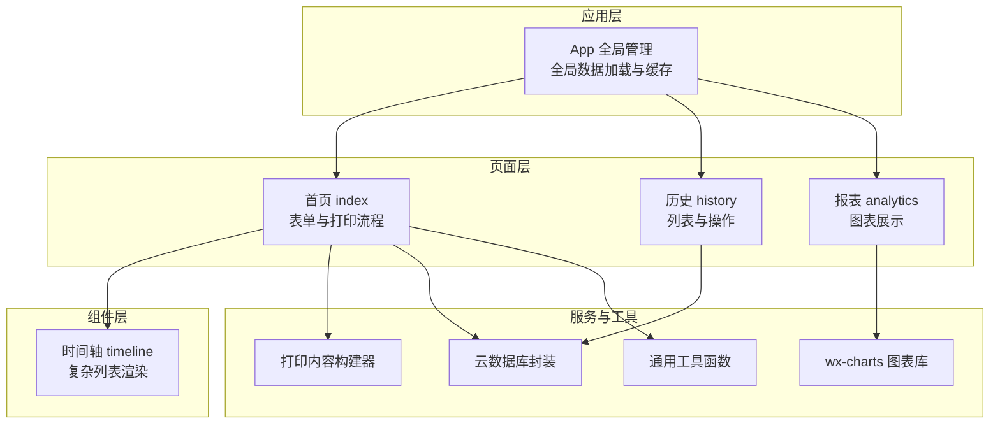
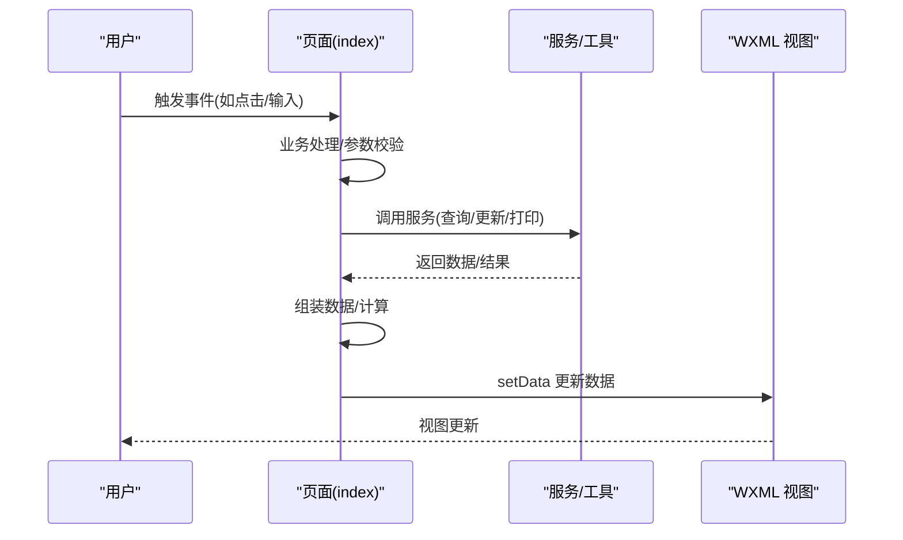
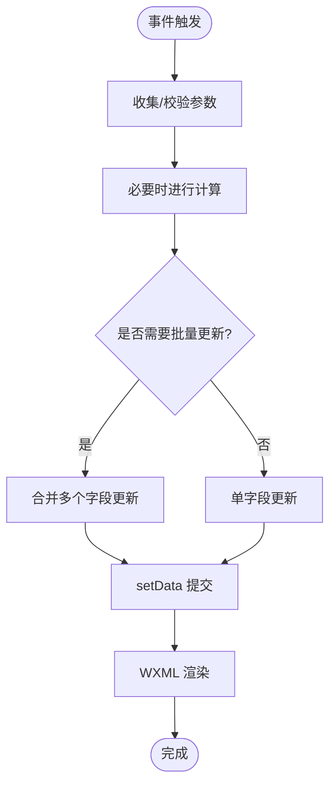
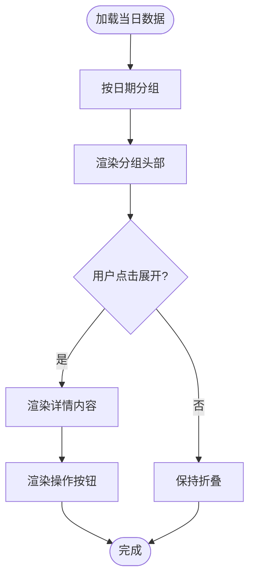
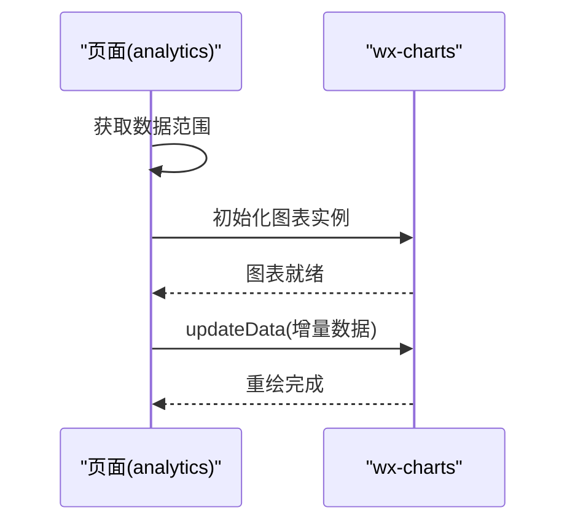
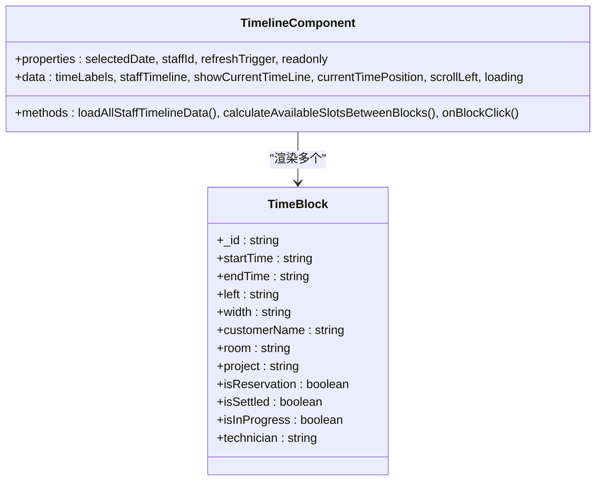
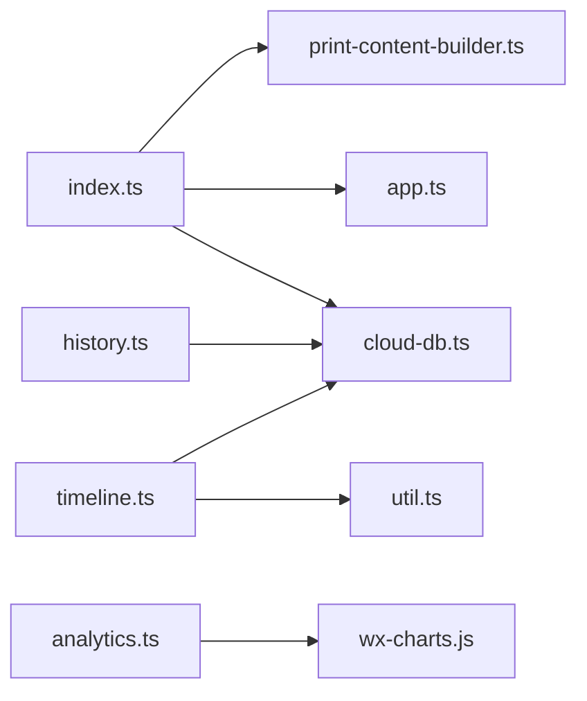

# 渲染性能优化

<cite>
**本文档引用的文件**
- [app.json](file://miniprogram/app.json)
- [app.ts](file://miniprogram/app.ts)
- [index.ts](file://miniprogram/pages/index/index.ts)
- [index.wxml](file://miniprogram/pages/index/index.wxml)
- [history.ts](file://miniprogram/pages/history/history.ts)
- [history.wxml](file://miniprogram/pages/history/history.wxml)
- [analytics.ts](file://miniprogram/pages/analytics/analytics.ts)
- [analytics.wxml](file://miniprogram/pages/analytics/analytics.wxml)
- [timeline.ts](file://miniprogram/components/timeline/timeline.ts)
- [timeline.wxml](file://miniprogram/components/timeline/timeline.wxml)
- [print-content-builder.ts](file://miniprogram/services/print-content-builder.ts)
- [cloud-db.ts](file://miniprogram/utils/cloud-db.ts)
- [util.ts](file://miniprogram/utils/util.ts)
- [wx-charts.js](file://miniprogram/utils/wx-charts.js)
- [app.less](file://miniprogram/app.less)
</cite>

## 目录
1. [简介](#简介)
2. [项目结构](#项目结构)
3. [核心组件](#核心组件)
4. [架构概览](#架构概览)
5. [详细组件分析](#详细组件分析)
6. [依赖关系分析](#依赖关系分析)
7. [性能考虑](#性能考虑)
8. [故障排查指南](#故障排查指南)
9. [结论](#结论)
10. [附录](#附录)

## 简介
本指南面向小程序渲染性能优化，结合项目实际代码，系统阐述页面渲染优化策略、WXML模板优化技术、CSS样式优化、组件生命周期与懒加载、Canvas渲染优化、图片渲染优化、第三方组件性能优化、性能监控与瓶颈分析，以及可量化的测试方法与优化案例。

## 项目结构
项目采用典型的多页面 + 组件化架构，页面通过 setData 驱动渲染，组件通过属性与事件进行交互，图表使用第三方 Canvas 图表库，全局数据通过 App 管理并在页面初始化时加载。

**图表来源**
- [app.json](file://miniprogram/app.json#L1-L35)
- [index.ts](file://miniprogram/pages/index/index.ts#L1-L735)
- [history.ts](file://miniprogram/pages/history/history.ts#L1-L739)
- [analytics.ts](file://miniprogram/pages/analytics/analytics.ts#L1-L408)
- [timeline.ts](file://miniprogram/components/timeline/timeline.ts#L1-L474)
- [print-content-builder.ts](file://miniprogram/services/print-content-builder.ts#L1-L144)
- [cloud-db.ts](file://miniprogram/utils/cloud-db.ts#L1-L321)
- [wx-charts.js](file://miniprogram/utils/wx-charts.js#L1-L800)

**章节来源**
- [app.json](file://miniprogram/app.json#L1-L35)
- [app.ts](file://miniprogram/app.ts#L1-L191)

## 核心组件
- 页面渲染驱动：所有页面通过 Page 实例的 data 与 setData 控制视图更新，事件处理函数集中于页面逻辑文件。
- 组件化复用：时间轴组件通过 properties 接收外部数据，内部维护状态并触发自定义事件。
- 数据访问：统一通过云数据库封装类进行 CRUD，避免页面直接操作数据库。
- 图表渲染：使用第三方 wx-charts 在 Canvas 上绘制，支持多类型图表与动态更新。
- 全局状态：App 中管理全局数据与加载状态，减少重复请求。

**章节来源**
- [index.ts](file://miniprogram/pages/index/index.ts#L75-L147)
- [timeline.ts](file://miniprogram/components/timeline/timeline.ts#L41-L86)
- [cloud-db.ts](file://miniprogram/utils/cloud-db.ts#L12-L321)
- [analytics.ts](file://miniprogram/pages/analytics/analytics.ts#L18-L78)

## 架构概览
渲染路径从用户交互触发事件，到页面逻辑处理，再到 setData 更新数据，最终由 WXML 模板渲染。图表类组件通过 Canvas 进行离屏绘制，组件与页面之间通过属性与事件解耦。

**图表来源**
- [index.ts](file://miniprogram/pages/index/index.ts#L263-L324)
- [cloud-db.ts](file://miniprogram/utils/cloud-db.ts#L260-L278)

## 详细组件分析

### 首页 index 渲染优化
- setData 调用优化
  - 将大对象拆分为细粒度字段更新，避免一次性更新整个对象导致不必要的重渲染。
  - 对批量更新场景使用 setData 的回调或分批更新，降低主线程阻塞。
  - 合并连续的 setData 调用，减少渲染次数。
- 数据绑定优化
  - 使用短路求值与三元表达式控制条件渲染，避免在渲染阶段进行复杂计算。
  - 列表渲染时使用稳定的 key，减少节点重建。
- 组件更新机制
  - 表单组件通过事件回调逐项更新对应字段，避免全量替换。
  - 双人模式下通过 activeGuest 切换不同数据源，减少冗余字段渲染。

**图表来源**
- [index.ts](file://miniprogram/pages/index/index.ts#L150-L196)
- [index.ts](file://miniprogram/pages/index/index.ts#L388-L481)

**章节来源**
- [index.ts](file://miniprogram/pages/index/index.ts#L150-L196)
- [index.ts](file://miniprogram/pages/index/index.ts#L388-L481)
- [index.wxml](file://miniprogram/pages/index/index.wxml#L1-L225)

### 历史 history 列表渲染优化
- 条件渲染与折叠
  - 使用 collapsed 字段控制详情区展开/折叠，减少初始渲染节点数量。
  - 仅在用户主动点击时渲染详情内容，避免一次性渲染大量 DOM。
- 列表渲染优化
  - 使用 wx:for 渲染日分组与条目，确保每个条目有稳定 key。
  - 对只读场景禁用不必要的交互元素，降低事件绑定数量。
- 懒加载与分页
  - 建议对历史记录增加分页加载，避免一次性拉取过多数据。

**图表来源**
- [history.ts](file://miniprogram/pages/history/history.ts#L146-L186)
- [history.wxml](file://miniprogram/pages/history/history.wxml#L13-L102)

**章节来源**
- [history.ts](file://miniprogram/pages/history/history.ts#L146-L186)
- [history.wxml](file://miniprogram/pages/history/history.wxml#L13-L102)

### 报表 analytics 图表渲染优化
- 图表初始化时机
  - 数据加载完成后延迟初始化图表，避免阻塞首屏渲染。
  - 使用 setTimeout 或 requestAnimationFrame 分散初始化压力。
- 图表更新策略
  - 采用 updateData 而非重新实例化，减少内存与重绘成本。
  - 对数据量较大的图表，先做数据采样或聚合，再传入图表库。
- Canvas 性能
  - 控制画布尺寸与分辨率，避免过大画布导致内存占用过高。
  - 合理设置线条宽度与阴影等高开销属性。

**图表来源**
- [analytics.ts](file://miniprogram/pages/analytics/analytics.ts#L47-L78)
- [analytics.ts](file://miniprogram/pages/analytics/analytics.ts#L194-L204)
- [wx-charts.js](file://miniprogram/utils/wx-charts.js#L329-L384)

**章节来源**
- [analytics.ts](file://miniprogram/pages/analytics/analytics.ts#L47-L78)
- [analytics.ts](file://miniprogram/pages/analytics/analytics.ts#L194-L204)
- [wx-charts.js](file://miniprogram/utils/wx-charts.js#L329-L384)

### 时间轴 timeline 组件渲染优化
- 复杂列表渲染
  - 使用 scroll-view 横向滚动，避免纵向滚动导致的重排。
  - 通过计算 left/width 百分比定位，减少频繁测量与布局。
- 可见性优化
  - 对空闲时段使用占位标签，而非真实 DOM，降低节点数量。
  - 高亮当前员工时，仅更新该行样式，避免整表重绘。
- 事件处理
  - 通过 bindtap 透传数据，避免在渲染阶段构造复杂事件对象。

**图表来源**
- [timeline.ts](file://miniprogram/components/timeline/timeline.ts#L41-L86)
- [timeline.ts](file://miniprogram/components/timeline/timeline.ts#L16-L40)

**章节来源**
- [timeline.ts](file://miniprogram/components/timeline/timeline.ts#L88-L211)
- [timeline.wxml](file://miniprogram/components/timeline/timeline.wxml#L1-L64)

### 打印内容构建与渲染
- 内容生成
  - 将格式化逻辑集中在服务类中，避免在页面渲染阶段执行。
  - 对重复计算的结果进行缓存，减少重复格式化。
- 渲染策略
  - 打印内容为纯文本，无需复杂 DOM，直接传递给打印机即可。

**章节来源**
- [print-content-builder.ts](file://miniprogram/services/print-content-builder.ts#L31-L80)

## 依赖关系分析
- 页面依赖 App 全局状态与云数据库封装，历史页依赖图表库，时间轴组件依赖云数据库与工具函数。
- 事件流从页面到组件再到服务，数据流从服务回到页面，形成清晰的单向数据流。

**图表来源**
- [index.ts](file://miniprogram/pages/index/index.ts#L1-L15)
- [history.ts](file://miniprogram/pages/history/history.ts#L1-L6)
- [analytics.ts](file://miniprogram/pages/analytics/analytics.ts#L1-L6)
- [timeline.ts](file://miniprogram/components/timeline/timeline.ts#L1-L5)

**章节来源**
- [index.ts](file://miniprogram/pages/index/index.ts#L1-L15)
- [history.ts](file://miniprogram/pages/history/history.ts#L1-L6)
- [analytics.ts](file://miniprogram/pages/analytics/analytics.ts#L1-L6)
- [timeline.ts](file://miniprogram/components/timeline/timeline.ts#L1-L5)

## 性能考虑
- 渲染策略
  - 使用条件渲染与懒渲染，减少初始渲染节点数量。
  - 对长列表使用虚拟滚动思想：只渲染可视区域内的节点，并动态调整容器高度。
- 数据流优化
  - 避免在渲染阶段进行复杂计算，将计算前置到数据获取或事件处理阶段。
  - 使用局部状态与分片更新，降低 setData 的数据体量。
- 图表与 Canvas
  - 控制图表数据规模，必要时进行聚合或降采样。
  - 合理设置画布尺寸与分辨率，避免过度绘制。
- 图片渲染
  - 使用合适的图片尺寸与格式，避免过大的图片资源。
  - 对首屏关键图片优先加载，非关键图片采用懒加载。
- 组件生命周期
  - 在组件 pageLifetimes.show 中按需刷新数据，避免每次进入都全量拉取。
  - 使用 observers 监听关键属性变化，仅在必要时更新。

[本节为通用指导，无需列出具体文件来源]

## 故障排查指南
- 渲染卡顿
  - 检查是否存在大量 setData 调用，尝试合并更新。
  - 查看是否有复杂计算在渲染阶段执行，将其移出渲染流程。
- 图表不更新
  - 确认 updateData 调用时机与数据结构正确。
  - 检查画布尺寸与容器尺寸是否一致。
- 列表错位或闪烁
  - 确保 wx:for 的 key 稳定且唯一。
  - 检查滚动容器的 scroll-left 设置是否合理。
- 图片加载问题
  - 检查图片路径与尺寸，避免超大图片。
  - 对首屏图片使用内联或预加载策略。

**章节来源**
- [index.ts](file://miniprogram/pages/index/index.ts#L121-L147)
- [analytics.ts](file://miniprogram/pages/analytics/analytics.ts#L194-L204)
- [timeline.ts](file://miniprogram/components/timeline/timeline.ts#L75-L86)

## 结论
通过合理的渲染策略、数据流设计与组件化架构，项目在复杂页面与图表渲染场景下仍能保持良好的用户体验。建议持续关注以下方向：进一步优化长列表渲染、引入更精细的数据缓存与去重、增强性能监控与埋点，以及在图表与图片层面实施更严格的资源治理。

[本节为总结，无需列出具体文件来源]

## 附录

### 渲染性能测试方法
- 首屏时间
  - 使用开发者工具性能面板记录页面 onLoad 到首屏渲染完成的时间。
- 渲染帧率
  - 使用帧率监控工具观察页面滚动与交互时的 FPS。
- 内存占用
  - 通过性能面板观察页面切换与数据更新时的内存峰值。
- 图表渲染
  - 对不同数据规模下的图表初始化与更新耗时进行对比测试。

[本节为通用指导，无需列出具体文件来源]

### 优化案例
- 历史页详情折叠
  - 通过 collapsed 字段控制详情渲染，显著减少初始节点数量，提升首屏渲染速度。
- 图表分步初始化
  - 数据加载完成后延迟初始化图表，避免阻塞首屏；后续更新使用 updateData，减少实例化开销。
- 时间轴百分比定位
  - 使用百分比 left/width 定位块元素，避免频繁计算与布局抖动。

**章节来源**
- [history.wxml](file://miniprogram/pages/history/history.wxml#L38-L98)
- [analytics.ts](file://miniprogram/pages/analytics/analytics.ts#L67-L69)
- [timeline.ts](file://miniprogram/components/timeline/timeline.ts#L164-L166)