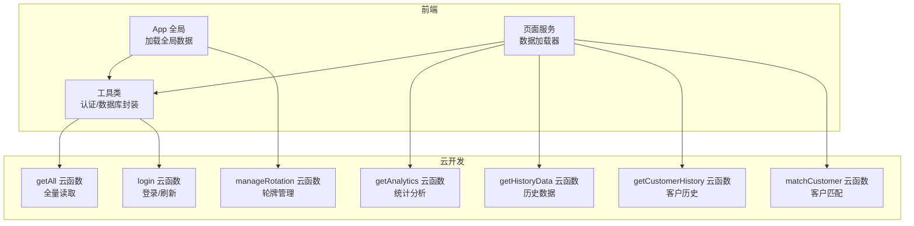
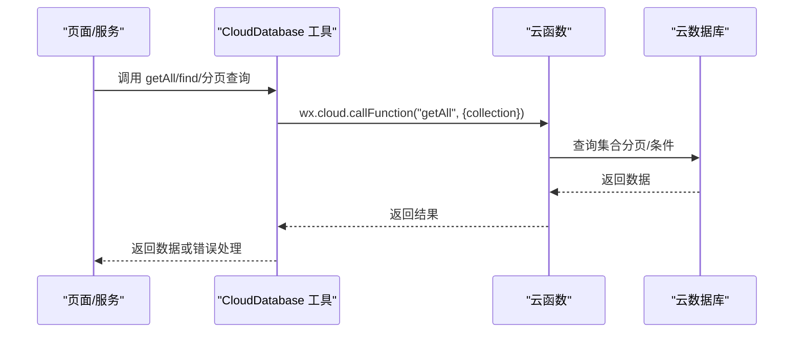
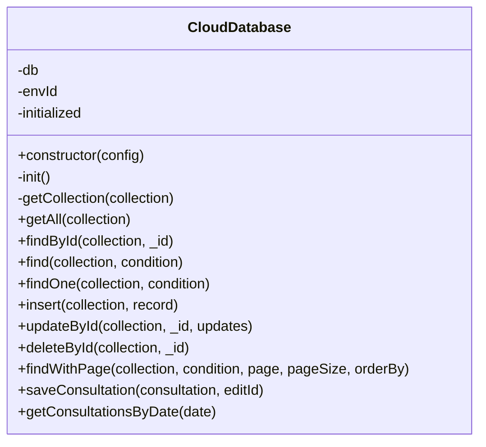
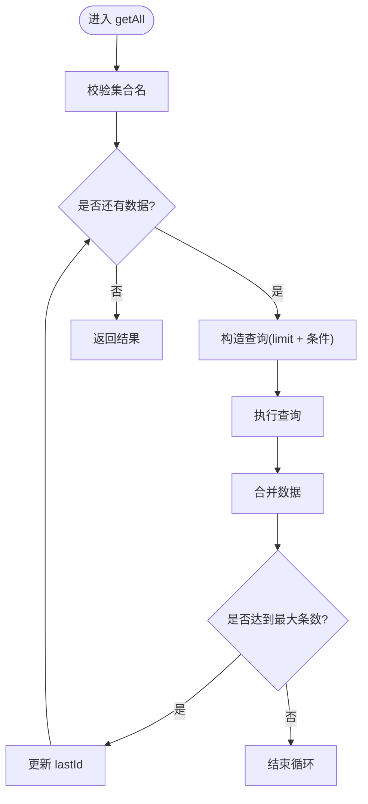
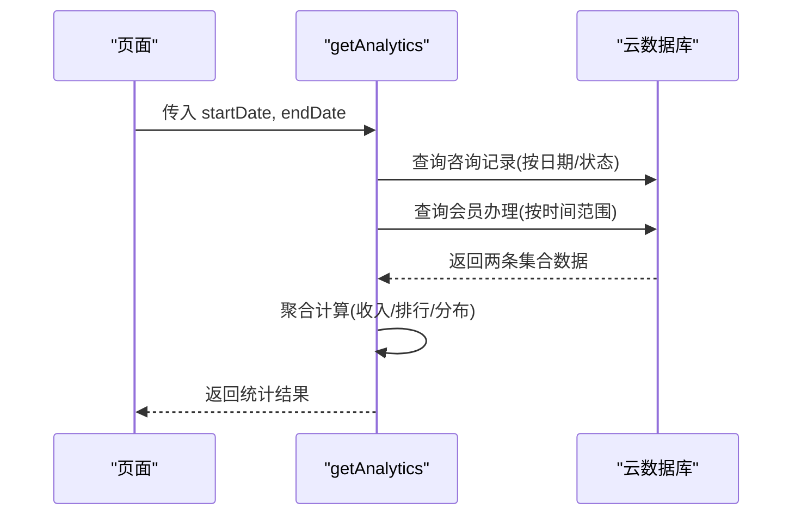
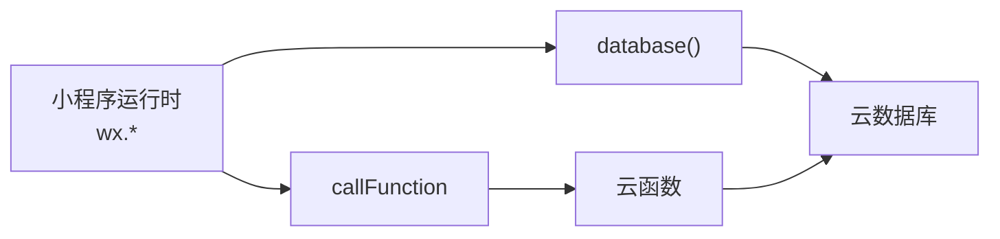

# 网络请求优化

<cite>
**本文引用的文件**
- [cloudfunctions/getAll/index.js](file://cloudfunctions/getAll/index.js)
- [cloudfunctions/getAnalytics/index.js](file://cloudfunctions/getAnalytics/index.js)
- [cloudfunctions/getCustomerHistory/index.js](file://cloudfunctions/getCustomerHistory/index.js)
- [cloudfunctions/getHistoryData/index.js](file://cloudfunctions/getHistoryData/index.js)
- [cloudfunctions/login/index.js](file://cloudfunctions/login/index.js)
- [cloudfunctions/matchCustomer/index.js](file://cloudfunctions/matchCustomer/index.js)
- [cloudfunctions/manageRotation/index.js](file://cloudfunctions/manageRotation/index.js)
- [miniprogram/utils/cloud-db.ts](file://miniprogram/utils/cloud-db.ts)
- [miniprogram/app.ts](file://miniprogram/app.ts)
- [miniprogram/pages/index/services/data-loader.service.ts](file://miniprogram/pages/index/services/data-loader.service.ts)
- [miniprogram/utils/auth.ts](file://miniprogram/utils/auth.ts)
- [miniprogram/config/index.ts](file://miniprogram/config/index.ts)
- [package.json](file://package.json)
</cite>

## 目录
1. [简介](#简介)
2. [项目结构](#项目结构)
3. [核心组件](#核心组件)
4. [架构总览](#架构总览)
5. [详细组件分析](#详细组件分析)
6. [依赖关系分析](#依赖关系分析)
7. [性能考量与优化建议](#性能考量与优化建议)
8. [故障排查指南](#故障排查指南)
9. [结论](#结论)
10. [附录：网络性能测试与基准方法](#附录网络性能测试与基准方法)

## 简介
本指南围绕“网络请求优化”主题，结合代码库中的云开发（CloudBase）数据库操作、云函数调用、前端网络请求与缓存策略，系统性地提出可落地的优化方案。内容涵盖：
- 数据库查询优化、索引设计与批量读取策略
- 云函数调用优化（请求合并、超时控制、重试机制）
- HTTP 请求优化（压缩、连接复用、缓存）
- 离线数据处理、数据同步与断网重连
- CDN 与静态资源优化、图片压缩
- 性能监控与测试方法

## 项目结构
该项目采用小程序前端 + 微信云开发后端的分层架构：
- 前端（miniprogram）：页面、服务、工具类、全局配置
- 后端（cloudfunctions）：云函数，封装数据库读写与业务逻辑
- 配置（miniprogram/config/index.ts）：云环境 ID 等配置项

图表来源
- [miniprogram/app.ts](file://miniprogram/app.ts#L40-L66)
- [miniprogram/pages/index/services/data-loader.service.ts](file://miniprogram/pages/index/services/data-loader.service.ts#L13-L65)
- [miniprogram/utils/cloud-db.ts](file://miniprogram/utils/cloud-db.ts#L69-L88)
- [cloudfunctions/getAll/index.js](file://cloudfunctions/getAll/index.js#L9-L58)
- [cloudfunctions/login/index.js](file://cloudfunctions/login/index.js#L11-L89)
- [cloudfunctions/getAnalytics/index.js](file://cloudfunctions/getAnalytics/index.js#L36-L51)
- [cloudfunctions/getHistoryData/index.js](file://cloudfunctions/getHistoryData/index.js#L88-L410)
- [cloudfunctions/getCustomerHistory/index.js](file://cloudfunctions/getCustomerHistory/index.js#L9-L99)
- [cloudfunctions/matchCustomer/index.js](file://cloudfunctions/matchCustomer/index.js#L9-L70)
- [cloudfunctions/manageRotation/index.js](file://cloudfunctions/manageRotation/index.js#L9-L35)

章节来源
- [miniprogram/app.ts](file://miniprogram/app.ts#L40-L66)
- [miniprogram/config/index.ts](file://miniprogram/config/index.ts#L5-L15)

## 核心组件
- 前端数据库封装（CloudDatabase 类）：统一封装云数据库的查询、分页、插入、更新、删除等操作，并通过 getAll 实现全量读取。
- 页面数据加载服务（DataLoaderService）：负责按需调用云函数，聚合多个数据源，减少重复请求。
- 登录与认证（AuthManager）：封装静默登录、刷新、登出流程，避免频繁重复登录。
- 云函数：提供查询、统计、历史、匹配、轮牌等业务能力。

章节来源
- [miniprogram/utils/cloud-db.ts](file://miniprogram/utils/cloud-db.ts#L12-L299)
- [miniprogram/pages/index/services/data-loader.service.ts](file://miniprogram/pages/index/services/data-loader.service.ts#L6-L206)
- [miniprogram/utils/auth.ts](file://miniprogram/utils/auth.ts#L78-L126)

## 架构总览
前端通过 wx.cloud.callFunction 调用云函数；数据库访问通过 wx.cloud.database 或云函数内的 cloud.database 完成。整体调用链路如下：

图表来源
- [miniprogram/utils/cloud-db.ts](file://miniprogram/utils/cloud-db.ts#L69-L88)
- [cloudfunctions/getAll/index.js](file://cloudfunctions/getAll/index.js#L9-L58)

## 详细组件分析

### 组件一：CloudDatabase 类（数据库封装）
职责与特性：
- 初始化云数据库、环境 ID 可配置
- 提供 getAll、find、findById、insert、updateById、deleteById、分页查询等方法
- getAll 使用云函数“getAll”进行全量读取，避免前端直接大查询导致的性能问题
- 分页查询支持 Promise.all 并行获取数据与总数，提升吞吐

优化要点：
- 对于大集合，优先使用云函数分页或条件过滤，避免一次性拉取全部
- 在前端对查询结果做本地缓存，结合版本号或时间戳做失效策略
- 对高频查询建立合适的索引（见后续数据库优化章节）

图表来源
- [miniprogram/utils/cloud-db.ts](file://miniprogram/utils/cloud-db.ts#L12-L299)

章节来源
- [miniprogram/utils/cloud-db.ts](file://miniprogram/utils/cloud-db.ts#L12-L299)

### 组件二：getAll 云函数（全量读取）
功能概述：
- 支持分页游标式读取集合，避免单次返回过大
- 通过 limit 与条件过滤组合，逐步推进 lastId，直至取完

优化建议：
- 为集合建立复合索引（如按日期、状态、创建时间），以减少扫描
- 前端侧对返回数据做本地缓存，结合“最后修改时间”字段做增量更新
- 若集合规模极大，建议改为“按日期分区”或“分桶存储”，前端按需加载

图表来源
- [cloudfunctions/getAll/index.js](file://cloudfunctions/getAll/index.js#L9-L58)

章节来源
- [cloudfunctions/getAll/index.js](file://cloudfunctions/getAll/index.js#L9-L58)

### 组件三：getAnalytics 云函数（统计分析）
功能概述：
- 计算日收入趋势、项目消费排行、平台消费排行、性别与车辆分布、会员卡销售等
- 多集合联查与聚合计算

优化建议：
- 将日期字段与状态字段建立复合索引，减少全表扫描
- 对日期范围查询使用范围索引，避免字符串匹配
- 将聚合结果缓存到云存储或内存缓存，设置合理过期时间

图表来源
- [cloudfunctions/getAnalytics/index.js](file://cloudfunctions/getAnalytics/index.js#L36-L171)

章节来源
- [cloudfunctions/getAnalytics/index.js](file://cloudfunctions/getAnalytics/index.js#L36-L171)

### 组件四：getHistoryData 云函数（历史数据）
功能概述：
- 支持按日期加载、按客户筛选、生成日汇总与月度评分
- 多次查询与多次聚合，逻辑较复杂

优化建议：
- 对“consultation_records”按 date、phone、isVoided 建立复合索引
- 对“customer_membership”按 createdAt 建立索引
- 将常用日期/客户的聚合结果做缓存，降低重复计算成本

章节来源
- [cloudfunctions/getHistoryData/index.js](file://cloudfunctions/getHistoryData/index.js#L88-L410)

### 组件五：getCustomerHistory 云函数（客户历史）
功能概述：
- 根据手机号查询咨询记录、客户资料、会员与使用记录
- 多集合联查，返回聚合后的客户历史

优化建议：
- 为 customers、customer_membership、membership_usage 建立 phone/客户标识索引
- 对返回字段做裁剪（只取必要字段），减少传输体积

章节来源
- [cloudfunctions/getCustomerHistory/index.js](file://cloudfunctions/getCustomerHistory/index.js#L9-L99)

### 组件六：login 云函数（登录/刷新）
功能概述：
- 获取用户 openId，创建或更新用户记录，生成 token
- 支持刷新用户信息与更新 staffId

优化建议：
- 对 users 表按 openId 建唯一索引
- 登录流程尽量幂等，避免重复创建用户

章节来源
- [cloudfunctions/login/index.js](file://cloudfunctions/login/index.js#L11-L179)

### 组件七：manageRotation 云函数（轮牌管理）
功能概述：
- 初始化轮牌队列、获取下一位技师、服务完成移动位置、调整顺序
- 多集合关联查询与更新

优化建议：
- 对 schedule、rotation_queue、staff 等集合建立合适索引
- 队列更新采用原子操作，减少并发冲突

章节来源
- [cloudfunctions/manageRotation/index.js](file://cloudfunctions/manageRotation/index.js#L9-L327)

### 组件八：matchCustomer 云函数（客户匹配）
功能概述：
- 基于姓名、性别、电话进行模糊匹配，返回最佳匹配

优化建议：
- 对 customers 的 phone/name 建立索引，或使用前缀索引
- 匹配算法可在云函数内优化，减少全表扫描

章节来源
- [cloudfunctions/matchCustomer/index.js](file://cloudfunctions/matchCustomer/index.js#L9-L70)

### 组件九：App 全局数据加载与轮牌调用
功能概述：
- 启动时并行加载项目、房间、精油、员工等全局数据
- 轮牌相关接口通过 wx.cloud.callFunction 调用云函数

优化建议：
- 将全局数据缓存到本地 storage，结合版本号做灰度更新
- 轮牌接口调用可合并请求，减少云函数调用次数

章节来源
- [miniprogram/app.ts](file://miniprogram/app.ts#L40-L66)
- [miniprogram/app.ts](file://miniprogram/app.ts#L110-L189)

### 组件十：DataLoaderService（页面数据加载）
功能概述：
- 加载可用技师列表、项目、编辑数据、预约数据
- 使用 Promise.all 并行请求，提升首屏速度

优化建议：
- 对高频接口增加本地缓存与失效策略
- 将“可用技师”计算逻辑下沉到云函数，前端仅做展示

章节来源
- [miniprogram/pages/index/services/data-loader.service.ts](file://miniprogram/pages/index/services/data-loader.service.ts#L13-L65)
- [miniprogram/pages/index/services/data-loader.service.ts](file://miniprogram/pages/index/services/data-loader.service.ts#L128-L204)

### 组件十一：AuthManager（认证）
功能概述：
- 静默登录、刷新用户信息、更新 staffId、登出
- 使用 storage 缓存用户与 token

优化建议：
- 登录流程加入重试与降级策略
- token 过期时自动刷新，避免频繁弹窗

章节来源
- [miniprogram/utils/auth.ts](file://miniprogram/utils/auth.ts#L78-L126)
- [miniprogram/utils/auth.ts](file://miniprogram/utils/auth.ts#L167-L193)
- [miniprogram/utils/auth.ts](file://miniprogram/utils/auth.ts#L195-L219)

## 依赖关系分析
- 前端依赖：
  - wx.cloud.callFunction：调用云函数
  - wx.cloud.database：前端直连数据库（小规模查询）
  - 本地 storage：持久化用户与 token
- 云函数依赖：
  - cloud.database：数据库读写
  - 云函数间可互相调用（示例：轮牌管理调用其他云函数）

图表来源
- [miniprogram/utils/cloud-db.ts](file://miniprogram/utils/cloud-db.ts#L41-L44)
- [cloudfunctions/getAll/index.js](file://cloudfunctions/getAll/index.js#L1-L7)

章节来源
- [miniprogram/utils/cloud-db.ts](file://miniprogram/utils/cloud-db.ts#L17-L47)
- [cloudfunctions/getAll/index.js](file://cloudfunctions/getAll/index.js#L1-L7)

## 性能考量与优化建议

### 1. 数据库查询优化
- 索引设计
  - 咨询记录：按 date、phone、isVoided 建复合索引
  - 用户：按 openId 建唯一索引
  - 会员：按 createdAt 建索引
  - 轮牌：按 date、staffId 建索引
- 查询策略
  - 使用 where + orderBy + limit 组合，避免全表扫描
  - 对大集合使用分页游标（已有 getAll 的思路），避免一次性拉取
  - 字段裁剪：仅返回必要字段，减少网络与解析开销

章节来源
- [cloudfunctions/getAll/index.js](file://cloudfunctions/getAll/index.js#L25-L44)
- [cloudfunctions/getAnalytics/index.js](file://cloudfunctions/getAnalytics/index.js#L56-L71)
- [cloudfunctions/getHistoryData/index.js](file://cloudfunctions/getHistoryData/index.js#L33-L86)
- [cloudfunctions/getCustomerHistory/index.js](file://cloudfunctions/getCustomerHistory/index.js#L22-L74)
- [cloudfunctions/login/index.js](file://cloudfunctions/login/index.js#L33-L71)

### 2. 云函数调用优化
- 请求合并
  - DataLoaderService 已使用 Promise.all 并行请求，建议进一步合并同类请求
- 超时与重试
  - 为 wx.cloud.callFunction 设置合理的超时时间
  - 对网络异常与 5xx 错误进行指数退避重试
- 结果缓存
  - 对静态或低频变更的数据做缓存，设置 TTL
- 并发控制
  - 对高并发场景限制同时调用数量，避免冷启动抖动

章节来源
- [miniprogram/pages/index/services/data-loader.service.ts](file://miniprogram/pages/index/services/data-loader.service.ts#L137-L139)
- [miniprogram/utils/auth.ts](file://miniprogram/utils/auth.ts#L97-L126)

### 3. HTTP 请求优化
- 压缩
  - 云函数返回数据尽量为精简 JSON，避免冗余字段
- 连接复用
  - 使用微信内置网络栈，避免自建长连接
- 缓存策略
  - 对静态资源使用 HTTP 缓存头
  - 对动态接口使用 ETag/Last-Modified

章节来源
- [cloudfunctions/getAll/index.js](file://cloudfunctions/getAll/index.js#L46-L51)
- [cloudfunctions/getAnalytics/index.js](file://cloudfunctions/getAnalytics/index.js#L160-L170)

### 4. 离线数据处理、数据同步与断网重连
- 离线策略
  - 将常用全局数据写入 storage，启动时先读本地再异步刷新
- 同步策略
  - 增量同步：基于 updatedAt 时间戳或版本号
- 断网重连
  - 记录待发送的操作队列，网络恢复后逐条重放
  - 对幂等接口（如更新）可安全重试

章节来源
- [miniprogram/app.ts](file://miniprogram/app.ts#L40-L66)
- [miniprogram/utils/auth.ts](file://miniprogram/utils/auth.ts#L21-L49)

### 5. CDN、静态资源与图片优化
- 静态资源
  - 将图片、字体、样式放入 CDN，开启 Gzip/Brotli 压缩
- 图片压缩
  - 使用 WebP/JPEG XL，按需裁剪尺寸与质量
  - 懒加载与占位图，减少首屏阻塞

章节来源
- [package.json](file://package.json#L14-L27)

### 6. 网络监控与性能分析
- 前端埋点
  - 记录云函数耗时、错误率、重试次数
- 云函数指标
  - 使用云开发控制台查看冷启动、执行时延、峰值并发
- 建议工具
  - 微信开发者工具 Network 面板
  - 云函数日志与 Tracing

章节来源
- [miniprogram/utils/cloud-db.ts](file://miniprogram/utils/cloud-db.ts#L27-L47)
- [cloudfunctions/getAll/index.js](file://cloudfunctions/getAll/index.js#L52-L57)

## 故障排查指南
- 常见错误与处理
  - 云函数返回格式错误：检查返回对象结构与 code 字段
  - 数据库查询失败：确认索引是否存在、查询条件是否命中索引
  - 登录失败：检查 wx.login 是否成功、云函数返回的 token 是否有效
- 日志与追踪
  - 前端捕获 wx.cloud.callFunction 的错误并上报
  - 云函数中对异常进行结构化记录，包含上下文与参数

章节来源
- [miniprogram/utils/cloud-db.ts](file://miniprogram/utils/cloud-db.ts#L85-L87)
- [miniprogram/utils/auth.ts](file://miniprogram/utils/auth.ts#L106-L114)
- [cloudfunctions/getAll/index.js](file://cloudfunctions/getAll/index.js#L52-L57)

## 结论
本项目在网络请求方面已具备良好的基础：前端通过 CloudDatabase 封装统一调用，云函数承担复杂查询与聚合逻辑。为进一步提升性能与稳定性，建议从“索引设计、查询优化、缓存策略、请求合并与重试、离线与断网处理、CDN 与图片优化、监控与测试”七个维度持续改进。

## 附录：网络性能测试与基准方法
- 测试目标
  - 云函数平均耗时、P95/P99 耗时
  - 前端首屏加载时间、关键路径请求数
  - 数据库查询延迟、命中率
- 测试方法
  - 压测工具：JMeter/Locust（模拟多用户并发调用云函数）
  - 前端性能：Chrome DevTools Performance/Network 面板
  - 数据库：云数据库控制台慢查询日志
- 基准指标（示例）
  - getAll 单集合查询：P95 < 2s，返回条数 > 1000
  - getAnalytics：P95 < 5s（含多集合联查）
  - 前端首屏：关键请求 < 3 次，TTFB < 1s

章节来源
- [cloudfunctions/getAll/index.js](file://cloudfunctions/getAll/index.js#L6-L7)
- [cloudfunctions/getAnalytics/index.js](file://cloudfunctions/getAnalytics/index.js#L36-L51)
- [miniprogram/pages/index/services/data-loader.service.ts](file://miniprogram/pages/index/services/data-loader.service.ts#L13-L65)