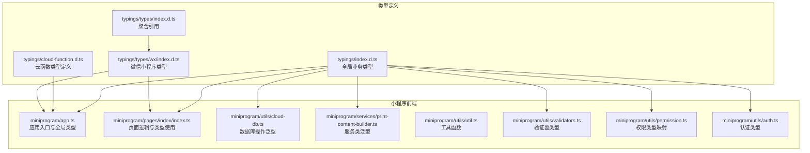
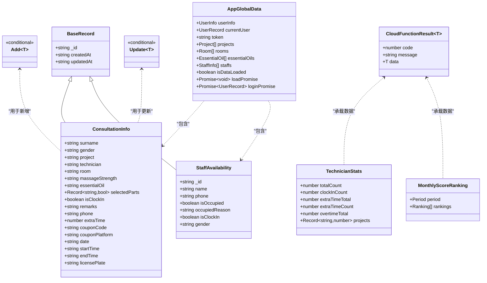
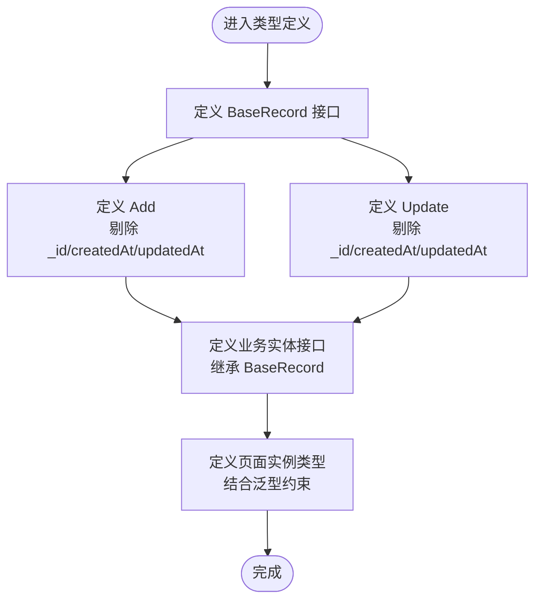
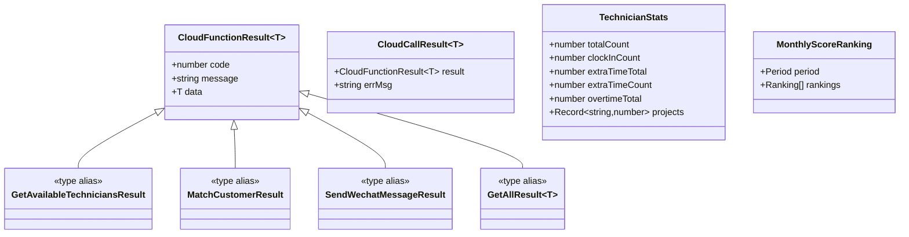
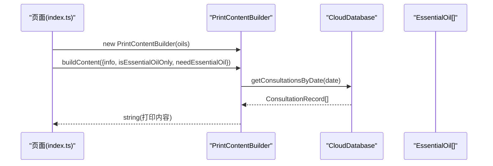
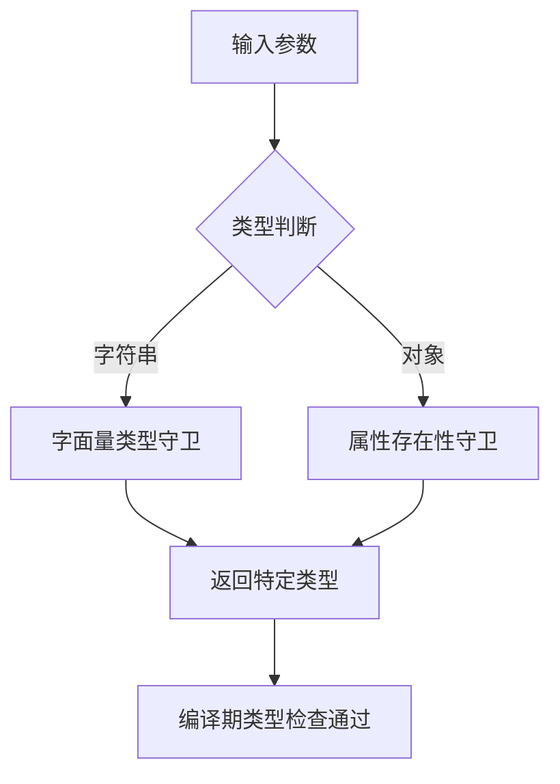
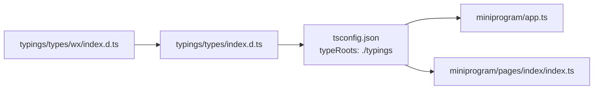
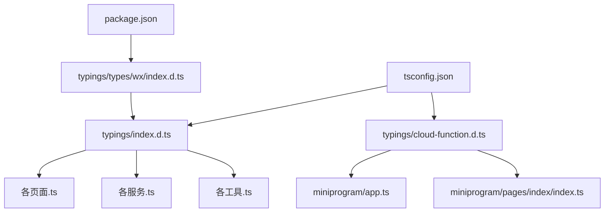

# TypeScript类型扩展

<cite>
**本文档引用的文件**
- [typings/index.d.ts](file://typings/index.d.ts)
- [typings/cloud-function.d.ts](file://typings/cloud-function.d.ts)
- [typings/types/index.d.ts](file://typings/types/index.d.ts)
- [typings/types/wx/index.d.ts](file://typings/types/wx/index.d.ts)
- [tsconfig.json](file://tsconfig.json)
- [package.json](file://package.json)
- [miniprogram/app.ts](file://miniprogram/app.ts)
- [miniprogram/pages/index/index.ts](file://miniprogram/pages/index/index.ts)
- [miniprogram/utils/cloud-db.ts](file://miniprogram/utils/cloud-db.ts)
- [miniprogram/services/print-content-builder.ts](file://miniprogram/services/print-content-builder.ts)
- [miniprogram/utils/util.ts](file://miniprogram/utils/util.ts)
- [miniprogram/utils/validators.ts](file://miniprogram/utils/validators.ts)
- [miniprogram/utils/permission.ts](file://miniprogram/utils/permission.ts)
- [miniprogram/utils/auth.ts](file://miniprogram/utils/auth.ts)
</cite>

## 更新摘要
**所做更改**
- 新增云函数类型定义文件 typings/cloud-function.d.ts，包含70+行的完整类型定义
- 增强了云函数调用的类型安全性，提供完整的返回值类型支持
- 扩展了类型系统对云函数返回值的统一处理机制
- 完善了技师统计、月度评分排名等专业业务类型的类型定义

## 目录
1. [简介](#简介)
2. [项目结构](#项目结构)
3. [核心组件](#核心组件)
4. [架构总览](#架构总览)
5. [详细组件分析](#详细组件分析)
6. [依赖关系分析](#依赖关系分析)
7. [性能考量](#性能考量)
8. [故障排查指南](#故障排查指南)
9. [结论](#结论)
10. [附录](#附录)

## 简介
本指南面向希望在现有代码库基础上进行TypeScript类型扩展的开发者，系统讲解类型系统的架构设计与类型定义原则，涵盖接口声明、泛型使用、模块声明、类型推断、类型守卫与条件类型等高级用法，并提供第三方库类型定义集成与类型兼容性处理策略。文档同时给出从简单数据模型到复杂业务逻辑类型的完整扩展案例，帮助你在保持类型安全的同时提升编译时检查与IDE智能提示体验。

**更新** 本次更新重点增强了云函数类型的完整定义，提供了从通用返回值类型到具体业务场景的全面类型支持。

## 项目结构
该项目采用"类型定义集中管理 + 小程序页面/服务/工具分层"的组织方式：
- 类型定义集中在 typings 目录，包含全局类型、云函数类型与微信小程序类型声明
- 云函数类型定义文件 typings/cloud-function.d.ts 提供完整的云函数返回值类型支持
- 小程序前端代码按页面、服务、工具分层组织，大量使用泛型与条件类型确保类型安全
- tsconfig.json 指定 typeRoots 为 ./typings，使自定义类型可被自动发现
- package.json 引入 miniprogram-api-typings 提供微信小程序API类型

**图表来源**
- [typings/index.d.ts](file://typings/index.d.ts#L1-L436)
- [typings/cloud-function.d.ts](file://typings/cloud-function.d.ts#L1-L75)
- [typings/types/index.d.ts](file://typings/types/index.d.ts#L1-L2)
- [typings/types/wx/index.d.ts](file://typings/types/wx/index.d.ts#L1-L164)
- [miniprogram/app.ts](file://miniprogram/app.ts#L1-L191)
- [miniprogram/pages/index/index.ts](file://miniprogram/pages/index/index.ts#L1-L735)
- [miniprogram/utils/cloud-db.ts](file://miniprogram/utils/cloud-db.ts#L1-L321)
- [miniprogram/services/print-content-builder.ts](file://miniprogram/services/print-content-builder.ts#L1-L144)
- [miniprogram/utils/util.ts](file://miniprogram/utils/util.ts#L1-L150)
- [miniprogram/utils/validators.ts](file://miniprogram/utils/validators.ts#L1-L81)
- [miniprogram/utils/permission.ts](file://miniprogram/utils/permission.ts#L1-L194)
- [miniprogram/utils/auth.ts](file://miniprogram/utils/auth.ts#L1-L245)

**章节来源**
- [tsconfig.json](file://tsconfig.json#L1-L31)
- [package.json](file://package.json#L1-L28)

## 核心组件
- 全局业务类型：在 typings/index.d.ts 中集中定义，包含基础记录接口、通用Add/Update类型、业务实体（咨询单、技师、排班、预约、会员卡、项目、房间、精油等），以及应用全局数据结构与页面实例类型。
- 云函数类型：在 typings/cloud-function.d.ts 中完整定义，提供云函数通用返回值类型、调用结果类型、具体业务场景的返回值类型，以及数据兼容性处理函数类型。
- 微信小程序类型：在 typings/types/wx/index.d.ts 中声明，覆盖App/Page/Component/Cloud等常用API类型，并通过 typings/types/index.d.ts 聚合引用。
- 泛型与条件类型：广泛使用泛型约束（如 T extends BaseRecord）与条件类型（如 Add<T>、Update<T>）实现类型安全的数据转换与操作。
- 条件类型与映射：通过条件类型对可选字段进行剔除或保留，确保新增/更新操作的类型一致性。

**章节来源**
- [typings/index.d.ts](file://typings/index.d.ts#L1-L436)
- [typings/cloud-function.d.ts](file://typings/cloud-function.d.ts#L1-L75)
- [typings/types/index.d.ts](file://typings/types/index.d.ts#L1-L2)
- [typings/types/wx/index.d.ts](file://typings/types/wx/index.d.ts#L1-L164)

## 架构总览
类型系统围绕"统一基类 + 条件类型 + 泛型约束 + 云函数类型支持"展开：
- BaseRecord 作为所有业务实体的基类，统一_id、createdAt、updatedAt字段
- Add<T> 与 Update<T> 通过条件类型剔除时间戳字段，确保新增/更新时的类型安全
- CloudFunctionResult<T> 作为云函数返回值的统一类型，支持泛型数据承载
- 页面与服务通过泛型约束数据库操作与业务流程，避免运行时错误

**图表来源**
- [typings/index.d.ts](file://typings/index.d.ts#L1-L436)
- [typings/cloud-function.d.ts](file://typings/cloud-function.d.ts#L1-L75)

## 详细组件分析

### 组件A：全局业务类型与条件类型
- BaseRecord：统一业务实体标识与时间戳
- Add<T> 与 Update<T>：基于条件类型剔除时间戳字段，确保新增/更新时的字段一致性
- 业务实体：ConsultationInfo、StaffInfo、ScheduleRecord、ReservationRecord、MembershipCard、Project、Room、EssentialOil、UserRecord、AppGlobalData 等
- 页面实例类型：IndexPage、CashierPage 等，结合泛型约束确保setData与事件回调的类型安全

**图表来源**
- [typings/index.d.ts](file://typings/index.d.ts#L1-L436)

**章节来源**
- [typings/index.d.ts](file://typings/index.d.ts#L1-L436)

### 组件B：云函数类型系统
- CloudFunctionResult<T>：云函数通用返回值类型，包含code、message、data字段
- CloudCallResult<T>：云函数调用原始返回类型，支持result和errMsg
- 具体业务类型：GetAvailableTechniciansResult、MatchCustomerResult、SendWechatMessageResult、GetAllResult<T>
- 专业统计类型：TechnicianStats、MonthlyScoreRanking，提供完整的业务数据结构定义
- 数据兼容性：EnsureConsultationInfoCompatibilityFn 函数类型，确保数据迁移时的类型安全

**图表来源**
- [typings/cloud-function.d.ts](file://typings/cloud-function.d.ts#L1-L75)

**章节来源**
- [typings/cloud-function.d.ts](file://typings/cloud-function.d.ts#L1-L75)

### 组件C：页面与服务中的泛型使用
- 页面类型约束：App<IAppOption<AppGlobalData>> 与 Page({...}) 的泛型约束，确保全局数据与页面数据的类型一致
- 数据库操作泛型：CloudDatabase<T extends BaseRecord> 与 getAll<T>()、insert<T>()、updateById<T>() 等，确保集合操作的类型安全
- 服务类泛型：PrintContentBuilder 的构造函数接收 EssentialOil[]，并在 buildContent 中使用泛型选项

**图表来源**
- [miniprogram/pages/index/index.ts](file://miniprogram/pages/index/index.ts#L1-L735)
- [miniprogram/services/print-content-builder.ts](file://miniprogram/services/print-content-builder.ts#L1-L144)
- [miniprogram/utils/cloud-db.ts](file://miniprogram/utils/cloud-db.ts#L1-L321)

**章节来源**
- [miniprogram/pages/index/index.ts](file://miniprogram/pages/index/index.ts#L1-L735)
- [miniprogram/services/print-content-builder.ts](file://miniprogram/services/print-content-builder.ts#L1-L144)
- [miniprogram/utils/cloud-db.ts](file://miniprogram/utils/cloud-db.ts#L1-L321)

### 组件D：类型推断与类型守卫
- 类型推断：在 App 全局数据与页面数据中，利用类型推断确保全局数据结构与页面数据结构的一致性
- 类型守卫：在工具函数中使用类型守卫（如 typeof、字面量类型）确保分支逻辑的类型安全
- 条件类型：在 Add<T>/Update<T> 中使用条件类型确保字段剔除的准确性

**图表来源**
- [miniprogram/utils/util.ts](file://miniprogram/utils/util.ts#L1-L150)
- [typings/index.d.ts](file://typings/index.d.ts#L1-L436)

**章节来源**
- [miniprogram/utils/util.ts](file://miniprogram/utils/util.ts#L1-L150)
- [typings/index.d.ts](file://typings/index.d.ts#L1-L436)

### 组件E：第三方库类型定义集成
- 微信小程序API类型：通过 typings/types/wx/index.d.ts 声明，覆盖 App、Page、Cloud 等常用API
- 类型聚合：typings/types/index.d.ts 通过 /// <reference> 引用 wx 类型声明
- 项目配置：tsconfig.json 的 typeRoots 指向 ./typings，使自定义类型与第三方类型共同生效

**图表来源**
- [typings/types/index.d.ts](file://typings/types/index.d.ts#L1-L2)
- [typings/types/wx/index.d.ts](file://typings/types/wx/index.d.ts#L1-L164)
- [tsconfig.json](file://tsconfig.json#L1-L31)

**章节来源**
- [typings/types/index.d.ts](file://typings/types/index.d.ts#L1-L2)
- [typings/types/wx/index.d.ts](file://typings/types/wx/index.d.ts#L1-L164)
- [tsconfig.json](file://tsconfig.json#L1-L31)

### 组件F：类型兼容性处理
- 泛型约束：在数据库操作中使用 T extends BaseRecord，确保集合数据满足统一结构
- 类型映射：在权限模块中使用映射类型将页面/按钮权限映射到 UserPermissions 字段
- 类型安全的云函数调用：在 App 与页面中对 wx.cloud.callFunction 的返回值进行类型断言与校验
- 数据兼容性：ensureConsultationInfoCompatibility 函数确保旧数据格式向新格式的平滑迁移

**章节来源**
- [miniprogram/utils/cloud-db.ts](file://miniprogram/utils/cloud-db.ts#L1-L321)
- [miniprogram/utils/permission.ts](file://miniprogram/utils/permission.ts#L1-L194)
- [miniprogram/app.ts](file://miniprogram/app.ts#L1-L191)
- [miniprogram/pages/index/index.ts](file://miniprogram/pages/index/index.ts#L1-L735)
- [typings/index.d.ts](file://typings/index.d.ts#L50-L71)

## 依赖关系分析
- 类型定义依赖：typings/index.d.ts 是核心，被各页面、服务、工具模块广泛依赖
- 云函数类型依赖：typings/cloud-function.d.ts 为云函数调用提供完整的类型支持，被 app.ts 和 index.ts 广泛使用
- 第三方类型依赖：typings/types/wx/index.d.ts 提供微信小程序API类型，通过 typings/types/index.d.ts 聚合
- 配置依赖：tsconfig.json 的 typeRoots 决定类型解析路径，package.json 的 devDependencies 提供类型定义与ESLint规则

**图表来源**
- [typings/index.d.ts](file://typings/index.d.ts#L1-L436)
- [typings/cloud-function.d.ts](file://typings/cloud-function.d.ts#L1-L75)
- [typings/types/index.d.ts](file://typings/types/index.d.ts#L1-L2)
- [typings/types/wx/index.d.ts](file://typings/types/wx/index.d.ts#L1-L164)
- [tsconfig.json](file://tsconfig.json#L1-L31)
- [package.json](file://package.json#L1-L28)

**章节来源**
- [typings/index.d.ts](file://typings/index.d.ts#L1-L436)
- [typings/cloud-function.d.ts](file://typings/cloud-function.d.ts#L1-L75)
- [typings/types/index.d.ts](file://typings/types/index.d.ts#L1-L2)
- [typings/types/wx/index.d.ts](file://typings/types/wx/index.d.ts#L1-L164)
- [tsconfig.json](file://tsconfig.json#L1-L31)
- [package.json](file://package.json#L1-L28)

## 性能考量
- 类型检查性能：严格模式与 noImplicitAny 等配置提升了类型安全性，但可能增加编译时间；建议在CI中启用增量编译与并行构建
- 泛型与条件类型：合理使用泛型与条件类型可减少重复代码，但过度嵌套可能影响编译性能；应保持类型定义简洁清晰
- 第三方类型：miniprogram-api-typings 提供了完整的API类型，有助于减少手写类型的工作量
- 云函数类型缓存：完整的云函数类型定义减少了运行时类型检查开销，提升了云函数调用的性能

## 故障排查指南
- 类型不匹配：当出现 Add<T>/Update<T> 相关错误时，检查实体是否正确继承 BaseRecord，以及是否遗漏了时间戳字段
- 泛型约束问题：若数据库操作返回类型不正确，检查 T 是否正确约束为 BaseRecord 子类型
- 第三方类型缺失：若微信API类型报错，确认 typings/types/wx/index.d.ts 已正确声明，并在 tsconfig.json 中配置 typeRoots
- 云函数类型错误：若云函数调用返回值类型不正确，检查 typings/cloud-function.d.ts 中对应的类型定义是否完整
- 权限类型映射：若权限判断异常，检查权限映射表与 UserPermissions 字段是否一致

**章节来源**
- [typings/index.d.ts](file://typings/index.d.ts#L1-L436)
- [typings/cloud-function.d.ts](file://typings/cloud-function.d.ts#L1-L75)
- [typings/types/wx/index.d.ts](file://typings/types/wx/index.d.ts#L1-L164)
- [miniprogram/utils/cloud-db.ts](file://miniprogram/utils/cloud-db.ts#L1-L321)
- [miniprogram/utils/permission.ts](file://miniprogram/utils/permission.ts#L1-L194)

## 结论
本项目通过"统一基类 + 条件类型 + 泛型约束 + 云函数类型支持"的类型系统设计，实现了从数据模型到业务流程再到云端服务的全链路类型安全。新增的完整云函数类型定义进一步强化了云端交互的类型安全性，显著提升了开发体验和代码质量。遵循本文档的类型扩展原则与最佳实践，可在不牺牲开发效率的前提下显著提升代码质量与可维护性。

## 附录

### 附录A：类型扩展最佳实践清单
- 使用 BaseRecord 作为所有业务实体的基类，统一标识与时间戳字段
- 新增/更新操作优先使用 Add<T>/Update<T>，避免手动剔除时间戳字段
- 在泛型约束中明确 T extends BaseRecord，确保集合操作的类型安全
- 为云函数调用提供完整的返回值类型定义，确保云端交互的类型安全
- 对第三方API类型进行聚合引用，确保类型解析路径正确
- 在工具函数中使用类型守卫与字面量类型，增强分支逻辑的类型安全性
- 通过 tsconfig.json 的严格模式配置，提升编译时检查强度

### 附录B：常见类型扩展场景示例路径
- 新增业务实体：参考 [typings/index.d.ts](file://typings/index.d.ts#L1-L436) 中 ConsultationInfo/StaffInfo 的定义方式
- 云函数类型定义：参考 [typings/cloud-function.d.ts](file://typings/cloud-function.d.ts#L1-L75) 中 CloudFunctionResult 的实现
- 泛型约束数据库操作：参考 [miniprogram/utils/cloud-db.ts](file://miniprogram/utils/cloud-db.ts#L1-L321) 中 CloudDatabase<T extends BaseRecord> 的实现
- 页面类型约束：参考 [miniprogram/pages/index/index.ts](file://miniprogram/pages/index/index.ts#L1-L735) 中 Page({...}) 的泛型使用
- 第三方类型集成：参考 [typings/types/index.d.ts](file://typings/types/index.d.ts#L1-L2) 与 [typings/types/wx/index.d.ts](file://typings/types/wx/index.d.ts#L1-L164)
- 数据兼容性处理：参考 [typings/index.d.ts](file://typings/index.d.ts#L50-L71) 中 ensureConsultationInfoCompatibility 的类型定义