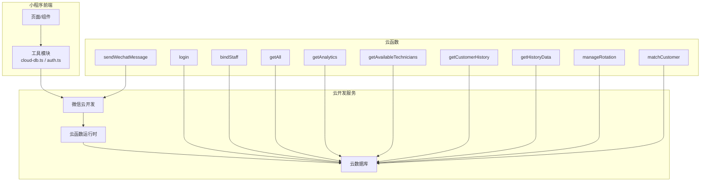
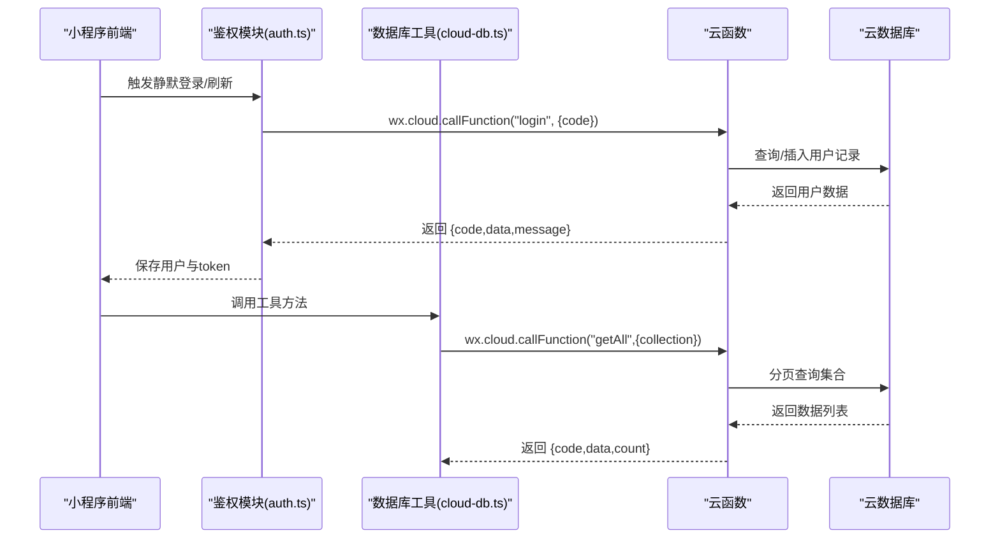
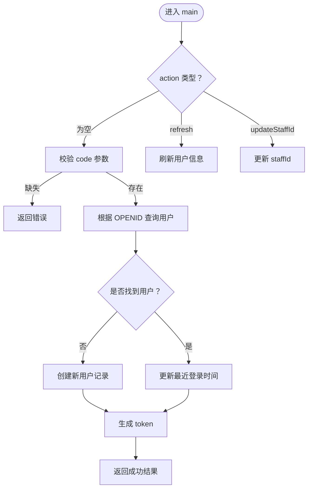
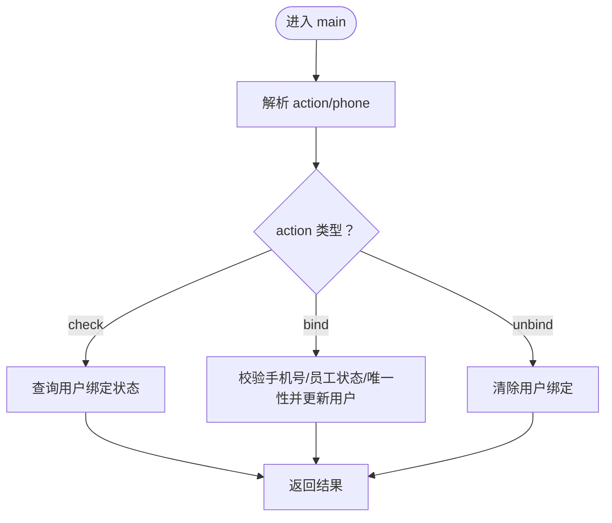
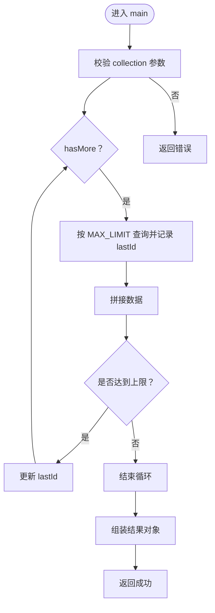
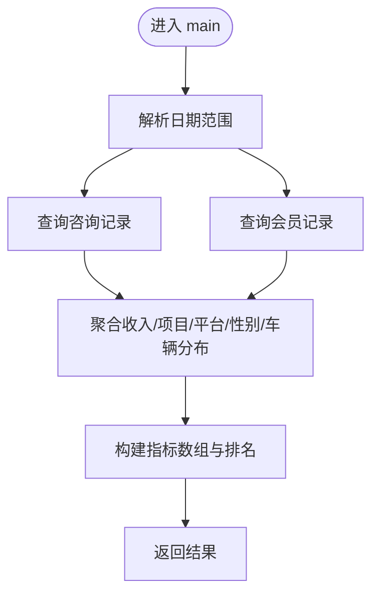
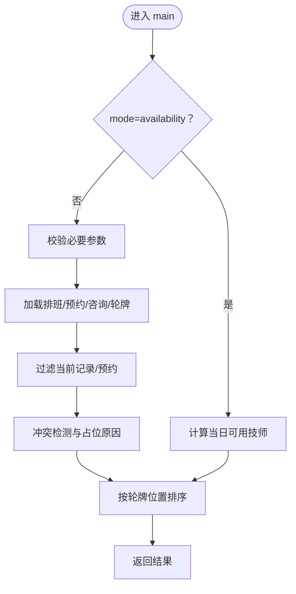
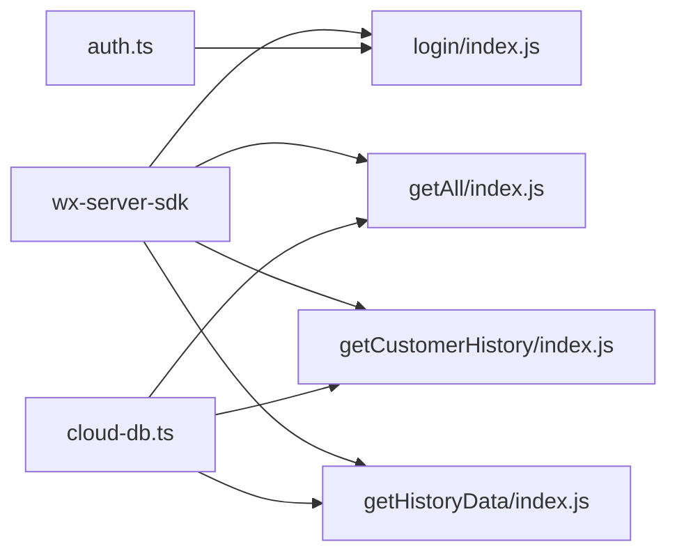

# 云函数扩展开发

<cite>
**本文引用的文件**
- [bindStaff/index.js](file://cloudfunctions/bindStaff/index.js)
- [bindStaff/package.json](file://cloudfunctions/bindStaff/package.json)
- [getAll/index.js](file://cloudfunctions/getAll/index.js)
- [getAnalytics/index.js](file://cloudfunctions/getAnalytics/index.js)
- [getAvailableTechnicians/index.js](file://cloudfunctions/getAvailableTechnicians/index.js)
- [getCustomerHistory/index.js](file://cloudfunctions/getCustomerHistory/index.js)
- [getHistoryData/index.js](file://cloudfunctions/getHistoryData/index.js)
- [login/index.js](file://cloudfunctions/login/index.js)
- [manageRotation/index.js](file://cloudfunctions/manageRotation/index.js)
- [matchCustomer/index.js](file://cloudfunctions/matchCustomer/index.js)
- [sendWechatMessage/index.js](file://cloudfunctions/sendWechatMessage/index.js)
- [cloud-db.ts](file://miniprogram/utils/cloud-db.ts)
- [auth.ts](file://miniprogram/utils/auth.ts)
- [package.json](file://package.json)
</cite>

## 目录
1. [简介](#简介)
2. [项目结构](#项目结构)
3. [核心组件](#核心组件)
4. [架构总览](#架构总览)
5. [详细组件分析](#详细组件分析)
6. [依赖分析](#依赖分析)
7. [性能考虑](#性能考虑)
8. [故障排查指南](#故障排查指南)
9. [结论](#结论)
10. [附录](#附录)

## 简介
本指南面向云函数扩展开发者，系统讲解基于微信云开发的云函数架构与执行环境、触发机制、数据处理与数据库操作、第三方API调用、错误处理与日志记录、性能监控策略，以及云函数间依赖关系、参数传递与结果返回机制。同时提供开发模板、测试方法与部署流程，并给出新增报表、数据导入导出、消息推送等扩展案例的完整实现思路。

## 项目结构
- 云函数目录：cloudfunctions 下按功能划分，每个子目录包含独立的云函数入口与依赖声明。
- 小程序前端：miniprogram 提供调用云函数的工具类与鉴权封装，统一通过 wx.cloud.callFunction 调用后端云函数。
- 根级依赖：package.json 统一管理前端工程化工具链与依赖。

图表来源
- [cloud-db.ts](file://miniprogram/utils/cloud-db.ts#L69-L88)
- [auth.ts](file://miniprogram/utils/auth.ts#L101-L125)
- [login/index.js](file://cloudfunctions/login/index.js#L11-L90)
- [bindStaff/index.js](file://cloudfunctions/bindStaff/index.js#L10-L51)
- [getAll/index.js](file://cloudfunctions/getAll/index.js#L9-L58)
- [getAnalytics/index.js](file://cloudfunctions/getAnalytics/index.js#L36-L51)
- [getAvailableTechnicians/index.js](file://cloudfunctions/getAvailableTechnicians/index.js#L9-L124)
- [getCustomerHistory/index.js](file://cloudfunctions/getCustomerHistory/index.js#L9-L99)
- [getHistoryData/index.js](file://cloudfunctions/getHistoryData/index.js#L88-L410)
- [manageRotation/index.js](file://cloudfunctions/manageRotation/index.js#L9-L36)
- [matchCustomer/index.js](file://cloudfunctions/matchCustomer/index.js#L9-L70)
- [sendWechatMessage/index.js](file://cloudfunctions/sendWechatMessage/index.js#L10-L64)

章节来源
- [cloud-db.ts](file://miniprogram/utils/cloud-db.ts#L1-L321)
- [auth.ts](file://miniprogram/utils/auth.ts#L1-L245)
- [package.json](file://package.json#L1-L28)

## 核心组件
- 云函数运行时与SDK：使用 wx-server-sdk 初始化环境，支持数据库、云存储与云调用能力。
- 数据访问层：通过 wx.cloud.database() 访问云数据库，采用分页、聚合与正则查询等策略。
- 前端调用层：封装 callFunction 与数据库工具类，统一封装错误与返回码。
- 鉴权与会话：基于 OPENID 的用户会话管理与令牌生成，支持静默登录与刷新。

章节来源
- [login/index.js](file://cloudfunctions/login/index.js#L1-L90)
- [cloud-db.ts](file://miniprogram/utils/cloud-db.ts#L69-L88)
- [auth.ts](file://miniprogram/utils/auth.ts#L78-L126)

## 架构总览
云函数作为后端无服务器执行单元，接收小程序前端通过 wx.cloud.callFunction 发起的请求，解析事件参数，读写云数据库或调用第三方接口，最终返回标准化的结果对象（含 code/message/data/error）。

图表来源
- [auth.ts](file://miniprogram/utils/auth.ts#L78-L126)
- [cloud-db.ts](file://miniprogram/utils/cloud-db.ts#L69-L88)
- [login/index.js](file://cloudfunctions/login/index.js#L11-L90)
- [getAll/index.js](file://cloudfunctions/getAll/index.js#L9-L58)

## 详细组件分析

### 登录与会话管理（login）
- 功能要点
  - 支持 code 获取用户OPENID，首次登录自动创建用户记录，更新最近登录时间。
  - 提供刷新用户信息与更新 staffId 的辅助动作。
  - 生成轻量令牌用于后续鉴权。
- 错误处理
  - 参数缺失、数据库异常均返回标准化错误码与消息。
- 性能建议
  - 对用户表建立 OPENID 唯一索引；对频繁查询字段建立复合索引。

图表来源
- [login/index.js](file://cloudfunctions/login/index.js#L11-L90)

章节来源
- [login/index.js](file://cloudfunctions/login/index.js#L1-L180)

### 员工绑定（bindStaff）
- 功能要点
  - 支持检查绑定状态、绑定手机号到员工、解绑。
  - 绑定时进行手机号格式校验、员工状态校验、唯一性校验。
- 错误处理
  - 参数校验失败、数据库查询异常、业务规则不满足均返回明确错误。

图表来源
- [bindStaff/index.js](file://cloudfunctions/bindStaff/index.js#L10-L51)

章节来源
- [bindStaff/index.js](file://cloudfunctions/bindStaff/index.js#L1-L189)
- [bindStaff/package.json](file://cloudfunctions/bindStaff/package.json#L1-L10)

### 全量数据拉取（getAll）
- 功能要点
  - 支持分页遍历集合，避免一次性读取超大数据集。
  - 返回总数与数据数组，便于前端展示。
- 性能建议
  - 对大集合设置 limit 并基于游标 lastId 迭代；对高频查询字段建索引。

图表来源
- [getAll/index.js](file://cloudfunctions/getAll/index.js#L9-L58)

章节来源
- [getAll/index.js](file://cloudfunctions/getAll/index.js#L1-L59)

### 报表分析（getAnalytics）
- 功能要点
  - 按日期范围统计咨询、会员、收入趋势与分布。
  - 将平台标识映射为中文名称，输出结构化指标。
- 复杂度与优化
  - 时间复杂度 O(N+M)，N/M 为相关集合记录数；建议对 date/createdAt 建立复合索引。

图表来源
- [getAnalytics/index.js](file://cloudfunctions/getAnalytics/index.js#L36-L51)
- [getAnalytics/index.js](file://cloudfunctions/getAnalytics/index.js#L53-L171)

章节来源
- [getAnalytics/index.js](file://cloudfunctions/getAnalytics/index.js#L1-L172)

### 可用技师查询（getAvailableTechnicians）
- 功能要点
  - 结合排班、预约、咨询记录与轮牌队列，计算技师可用性与空闲时间。
  - 支持“实时可用性”与“可选技师列表”两种模式。
- 复杂度与优化
  - 时间复杂度 O(S+C+R)，S/C/R 为排班/咨询/预约集合规模；建议对 date/status/startTime/endTime 建索引。

图表来源
- [getAvailableTechnicians/index.js](file://cloudfunctions/getAvailableTechnicians/index.js#L9-L124)
- [getAvailableTechnicians/index.js](file://cloudfunctions/getAvailableTechnicians/index.js#L131-L285)

章节来源
- [getAvailableTechnicians/index.js](file://cloudfunctions/getAvailableTechnicians/index.js#L1-L285)

### 客户历史查询（getCustomerHistory）
- 功能要点
  - 根据手机号查询客户历史咨询、会员与使用记录，汇总访问次数与消费金额。
- 性能建议
  - 对 phone 字段建立索引；限制返回条数以控制成本。

章节来源
- [getCustomerHistory/index.js](file://cloudfunctions/getCustomerHistory/index.js#L1-L100)

### 历史数据聚合（getHistoryData）
- 功能要点
  - 支持单日加载、全日期加载、客户历史加载与日统计聚合。
  - 计算技师每日计数、进行中状态、额外时间与加班统计。
- 复杂度与优化
  - 多次查询与排序，建议对 date/phone/createdAt 建索引；对月度统计使用正则前缀匹配。

章节来源
- [getHistoryData/index.js](file://cloudfunctions/getHistoryData/index.js#L1-L411)

### 轮牌管理（manageRotation）
- 功能要点
  - 初始化轮牌队列、获取下一位、服务完成推进、调整位置、获取队列。
  - 基于昨日轮牌与今日排班优先级动态排序。
- 复杂度与优化
  - 队列维护与更新为 O(n)；建议对 date 建索引并缓存队列。

章节来源
- [manageRotation/index.js](file://cloudfunctions/manageRotation/index.js#L1-L327)

### 客户匹配（matchCustomer）
- 功能要点
  - 基于姓名、性别、手机号进行模糊评分匹配，返回最佳匹配。
- 性能建议
  - 对 customers 全量扫描，建议在数据量大时引入索引或预处理。

章节来源
- [matchCustomer/index.js](file://cloudfunctions/matchCustomer/index.js#L1-L71)

### 微信群机器人消息推送（sendWechatMessage）
- 功能要点
  - 通过企业微信群机器人 Webhook 推送 Markdown 消息。
- 注意事项
  - 当前代码存在逻辑顺序问题（发送后再读取 response），应先发送再处理响应。

章节来源
- [sendWechatMessage/index.js](file://cloudfunctions/sendWechatMessage/index.js#L1-L65)

## 依赖分析
- 前端依赖
  - wx-server-sdk：云函数 SDK，提供数据库、云存储与云调用能力。
  - 工具类：cloud-db.ts 提供 getAll/find/save 等通用数据库操作；auth.ts 提供登录与鉴权。
- 云函数依赖
  - 各云函数通过 wx.cloud.database() 访问数据库；部分函数调用微信云 API 或第三方 HTTP 接口。

图表来源
- [auth.ts](file://miniprogram/utils/auth.ts#L101-L125)
- [cloud-db.ts](file://miniprogram/utils/cloud-db.ts#L69-L88)
- [login/index.js](file://cloudfunctions/login/index.js#L1-L90)
- [getAll/index.js](file://cloudfunctions/getAll/index.js#L1-L59)
- [getCustomerHistory/index.js](file://cloudfunctions/getCustomerHistory/index.js#L1-L100)
- [getHistoryData/index.js](file://cloudfunctions/getHistoryData/index.js#L1-L411)

章节来源
- [auth.ts](file://miniprogram/utils/auth.ts#L1-L245)
- [cloud-db.ts](file://miniprogram/utils/cloud-db.ts#L1-L321)
- [login/index.js](file://cloudfunctions/login/index.js#L1-L180)
- [getAll/index.js](file://cloudfunctions/getAll/index.js#L1-L59)
- [getCustomerHistory/index.js](file://cloudfunctions/getCustomerHistory/index.js#L1-L100)
- [getHistoryData/index.js](file://cloudfunctions/getHistoryData/index.js#L1-L411)

## 性能考虑
- 查询优化
  - 对高频查询字段（如 date、phone、openId、status）建立索引。
  - 使用 limit 与游标分页，避免一次性读取大量数据。
- 计算优化
  - 在云函数内进行聚合与排序，减少前端二次处理。
  - 对日期范围查询使用正则前缀匹配，提升索引命中率。
- 缓存与幂等
  - 对静态配置与只读数据进行缓存；确保写操作幂等与事务一致性。
- 超时与重试
  - 控制单次云函数执行时间，对长任务拆分为多步或异步回调。

## 故障排查指南
- 常见错误与定位
  - 参数缺失：检查前端调用是否传入必需字段。
  - 数据库查询异常：确认集合名、索引是否存在，查询条件是否合理。
  - 第三方接口失败：检查网络连通性与凭据有效性。
- 日志与追踪
  - 前端：使用 wx.cloud.logger 输出调试信息。
  - 云函数：使用 console.log 输出关键路径与错误堆栈。
- 错误返回规范
  - 统一返回 { code, message, data, error }，便于前端统一处理。

章节来源
- [login/index.js](file://cloudfunctions/login/index.js#L84-L89)
- [bindStaff/index.js](file://cloudfunctions/bindStaff/index.js#L45-L50)
- [sendWechatMessage/index.js](file://cloudfunctions/sendWechatMessage/index.js#L58-L63)

## 结论
本项目采用“小程序前端 + 云函数 + 云数据库”的经典架构，通过统一的工具类与鉴权模块实现稳定的前后端交互。遵循本文的开发模板、错误处理与性能优化建议，可快速扩展新的业务场景，如报表、数据导入导出与消息推送等。

## 附录

### 开发模板（云函数）
- 目录结构
  - 新增目录：cloudfunctions/<functionName>
  - 文件：index.js、package.json
- 示例步骤
  - 初始化云函数：cloud.init({ env: cloud.DYNAMIC_CURRENT_ENV })
  - 解析事件参数：const { key } = event
  - 执行业务逻辑：数据库读写/第三方调用
  - 统一返回：return { code, message, data }

章节来源
- [login/index.js](file://cloudfunctions/login/index.js#L1-L90)
- [bindStaff/package.json](file://cloudfunctions/bindStaff/package.json#L1-L10)

### 测试方法
- 单元测试
  - 使用小程序开发者工具的云函数本地调试能力，模拟事件参数与数据库返回。
- 集成测试
  - 在真实环境中调用 wx.cloud.callFunction，验证鉴权、数据库与第三方接口链路。
- 回归测试
  - 对关键查询与聚合逻辑编写基准数据集，定期回归。

### 部署流程
- 本地开发
  - 在云开发控制台上传云函数代码与依赖。
- 环境配置
  - 设置环境变量与数据库权限，确保云函数可访问所需集合。
- 版本管理
  - 通过云开发控制台发布版本，灰度发布与回滚策略。

### 扩展案例

#### 新增报表功能（示例：月度销售排行）
- 设计思路
  - 云函数：按月统计各技师销售额与服务次数，输出排行榜。
  - 前端：调用云函数并渲染图表。
- 关键点
  - 使用正则匹配月份，聚合支付明细，排序输出。
  - 对 date/technician 建索引，提升查询效率。

章节来源
- [getHistoryData/index.js](file://cloudfunctions/getHistoryData/index.js#L252-L394)

#### 数据导入导出（示例：批量导入咨询记录）
- 设计思路
  - 云函数：接收 CSV/Excel 数据，逐条校验并批量写入数据库。
  - 前端：上传文件后调用云函数，显示进度与结果。
- 关键点
  - 分批写入与事务控制，失败回滚；校验必填字段与格式。
  - 对 phone/date 等字段建立索引，加速导入后的查询。

章节来源
- [getAll/index.js](file://cloudfunctions/getAll/index.js#L9-L58)

#### 消息推送（示例：订单状态变更通知）
- 设计思路
  - 云函数：监听订单状态变化，调用企业微信/钉钉/飞书 Webhook 推送消息。
  - 前端：在订单页展示推送结果。
- 关键点
  - 先发送后处理响应，避免逻辑顺序错误；对 webhook 凭据进行安全存储与轮换。

章节来源
- [sendWechatMessage/index.js](file://cloudfunctions/sendWechatMessage/index.js#L10-L64)