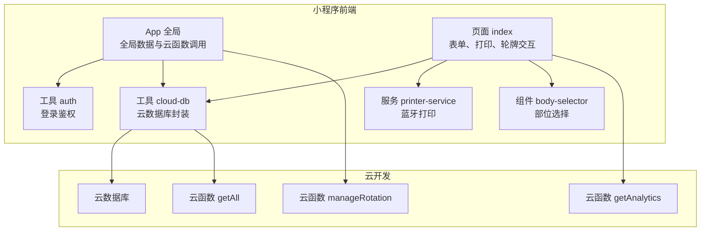
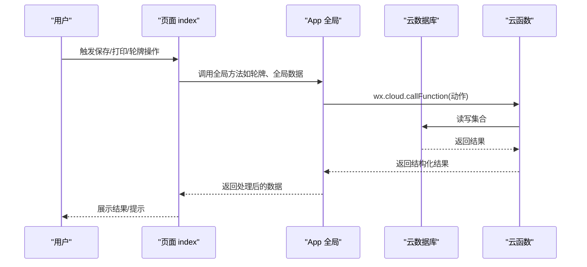
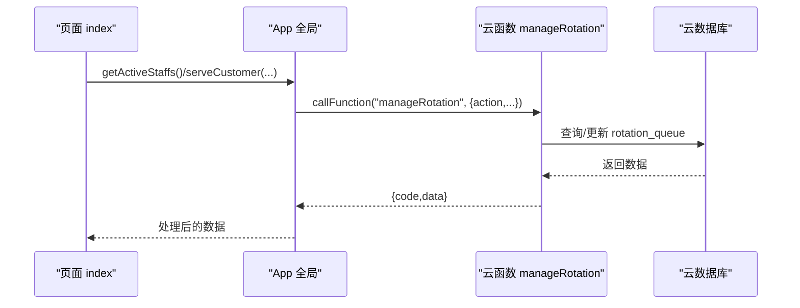
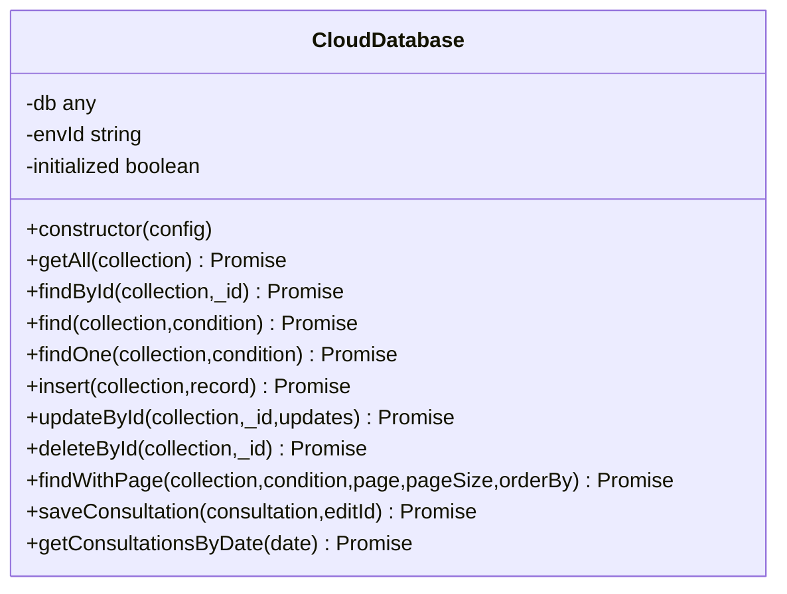
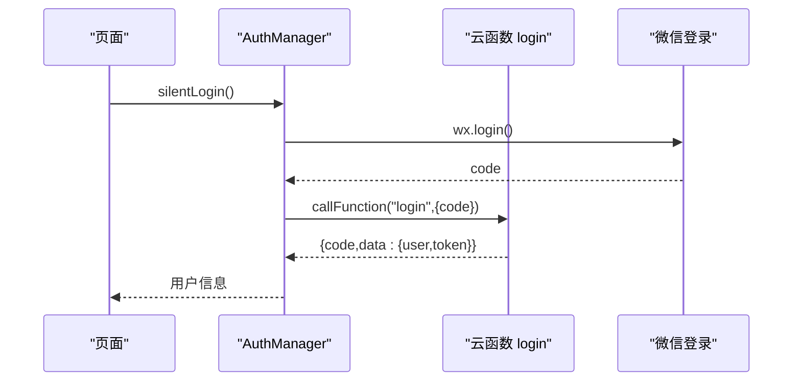
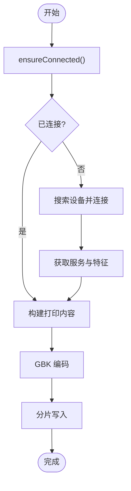
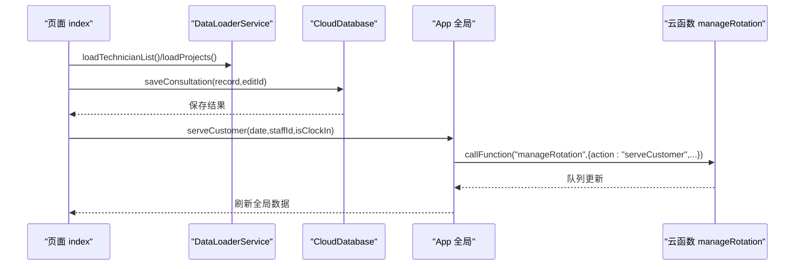
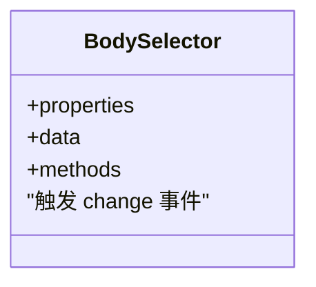
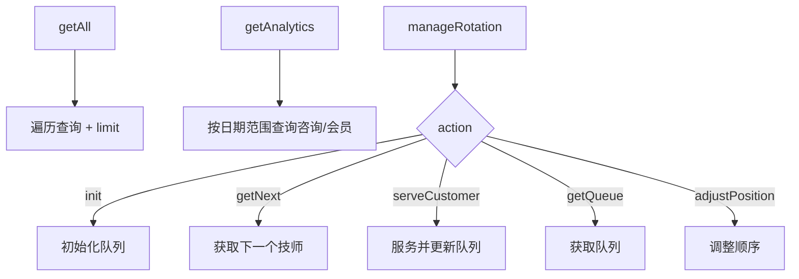
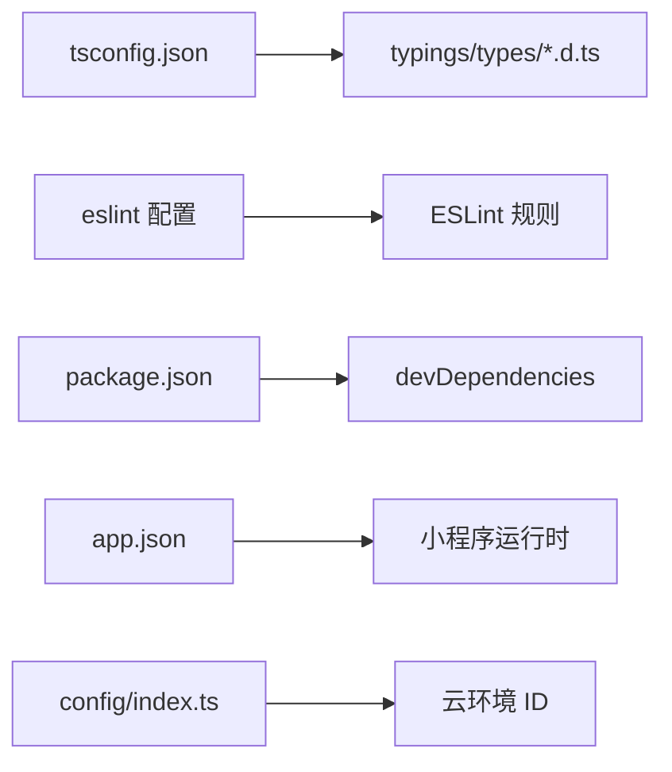

# 扩展开发指南

<cite>
**本文档引用的文件**
- [package.json](file://package.json)
- [tsconfig.json](file://tsconfig.json)
- [app.ts](file://miniprogram/app.ts)
- [app.json](file://miniprogram/app.json)
- [cloud-db.ts](file://miniprogram/utils/cloud-db.ts)
- [auth.ts](file://miniprogram/utils/auth.ts)
- [printer-service.ts](file://miniprogram/services/printer-service.ts)
- [index.ts](file://miniprogram/config/index.ts)
- [index.ts](file://miniprogram/components/body-selector/body-selector.ts)
- [index.ts](file://miniprogram/pages/index/index.ts)
- [index.js](file://cloudfunctions/getAll/index.js)
- [index.js](file://cloudfunctions/getAnalytics/index.js)
- [index.js](file://cloudfunctions/manageRotation/index.js)
- [.eslintrc.js](file://.eslintrc.js)
- [index.d.ts](file://typings/types/index.d.ts)
- [index.d.ts](file://typings/types/wx/index.d.ts)
</cite>

## 目录
1. [简介](#简介)
2. [项目结构](#项目结构)
3. [核心组件](#核心组件)
4. [架构总览](#架构总览)
5. [详细组件分析](#详细组件分析)
6. [依赖关系分析](#依赖关系分析)
7. [性能考量](#性能考量)
8. [故障排查指南](#故障排查指南)
9. [结论](#结论)
10. [附录](#附录)

## 简介
本指南面向希望在现有小程序与云开发基础上进行扩展开发的工程师，覆盖以下主题：
- 新功能开发方法论与插件系统设计
- 第三方集成方案（云数据库、云函数、蓝牙打印）
- 自定义组件开发流程（设计、API、集成测试）
- 云函数扩展开发模式（业务逻辑、API、数据模型）
- TypeScript 类型定义扩展与类型安全
- 代码规范、架构原则与最佳实践
- 模块化设计、依赖管理与版本兼容性
- 测试策略、文档与发布流程
- 实际扩展案例、开发模板与参考实现

## 项目结构
该项目采用“小程序前端 + 云开发 + 云函数”的分层架构：
- 小程序前端：页面、组件、服务、工具与类型定义
- 云开发：云数据库与云函数统一通过 wx.cloud 调用
- 类型系统：基于 tsconfig 的严格类型检查与自定义 d.ts

图表来源
- [app.ts](file://miniprogram/app.ts#L1-L191)
- [index.ts](file://miniprogram/pages/index/index.ts#L1-L735)
- [body-selector.ts](file://miniprogram/components/body-selector/body-selector.ts#L1-L27)
- [printer-service.ts](file://miniprogram/services/printer-service.ts#L1-L298)
- [cloud-db.ts](file://miniprogram/utils/cloud-db.ts#L1-L321)
- [auth.ts](file://miniprogram/utils/auth.ts#L1-L245)
- [index.js](file://cloudfunctions/getAll/index.js#L1-L59)
- [index.js](file://cloudfunctions/manageRotation/index.js#L1-L327)
- [index.js](file://cloudfunctions/getAnalytics/index.js#L1-L172)

章节来源
- [app.json](file://miniprogram/app.json#L1-L35)
- [package.json](file://package.json#L1-L28)
- [tsconfig.json](file://tsconfig.json#L1-L31)

## 核心组件
- App 全局：负责登录态、全局数据加载与云函数调用入口
- 云数据库封装：统一 CRUD、分页、条件查询与咨询单保存
- 登录鉴权：静默登录、令牌存储、权限校验
- 蓝牙打印服务：蓝牙设备发现、连接、特征读写与多单据打印
- 页面 index：表单处理、打印构建、轮牌交互、预约重分配
- 组件 body-selector：部位选择事件触发
- 云函数 getAll/manageRotation/getAnalytics：通用数据拉取、轮牌调度、统计分析

章节来源
- [app.ts](file://miniprogram/app.ts#L1-L191)
- [cloud-db.ts](file://miniprogram/utils/cloud-db.ts#L1-L321)
- [auth.ts](file://miniprogram/utils/auth.ts#L1-L245)
- [printer-service.ts](file://miniprogram/services/printer-service.ts#L1-L298)
- [index.ts](file://miniprogram/pages/index/index.ts#L1-L735)
- [body-selector.ts](file://miniprogram/components/body-selector/body-selector.ts#L1-L27)
- [index.js](file://cloudfunctions/getAll/index.js#L1-L59)
- [index.js](file://cloudfunctions/manageRotation/index.js#L1-L327)
- [index.js](file://cloudfunctions/getAnalytics/index.js#L1-L172)

## 架构总览
整体采用“前端页面 + 云函数 + 云数据库”的三层架构。前端通过 wx.cloud 调用云函数，云函数对云数据库进行读写；App 全局负责登录态与全局数据缓存。

图表来源
- [app.ts](file://miniprogram/app.ts#L110-L189)
- [index.ts](file://miniprogram/pages/index/index.ts#L437-L453)
- [index.js](file://cloudfunctions/manageRotation/index.js#L9-L36)

## 详细组件分析

### App 全局与云函数调用
- 登录初始化：静默登录、令牌持久化
- 全局数据加载：并发拉取项目、房间、精油、员工等集合
- 轮牌相关：获取队列、获取下一个技师、服务客户、调整位置
- 云函数调用：统一通过 wx.cloud.callFunction，返回结构化结果

图表来源
- [app.ts](file://miniprogram/app.ts#L89-L189)
- [index.js](file://cloudfunctions/manageRotation/index.js#L148-L182)

章节来源
- [app.ts](file://miniprogram/app.ts#L18-L189)

### 云数据库封装（CloudDatabase）
- 统一初始化：按需初始化 wx.cloud.database
- 通用查询：getAll/find/findWithPage、条件查询、分页
- 写操作：insert/updateById/deleteById、保存咨询单
- 日期查询：按日期前缀正则匹配
- 集合常量：集中管理集合名

图表来源
- [cloud-db.ts](file://miniprogram/utils/cloud-db.ts#L12-L299)

章节来源
- [cloud-db.ts](file://miniprogram/utils/cloud-db.ts#L1-L321)

### 登录鉴权（AuthManager）
- 单例模式：全局唯一实例
- 静默登录：wx.login + 云函数 login
- 用户信息：本地存储 currentUser/token
- 权限控制：角色判断、管理员判定
- 电话授权与信息刷新：通过云函数扩展

图表来源
- [auth.ts](file://miniprogram/utils/auth.ts#L78-L126)

章节来源
- [auth.ts](file://miniprogram/utils/auth.ts#L1-L245)

### 蓝牙打印服务（PrinterService）
- 蓝牙适配：openBluetoothAdapter -> discovery -> connect
- 设备服务与特征：获取服务与可写特征
- 连接状态：ensureConnected 去重连接
- 打印流程：分片写入、GBK 编码、延时分隔
- 断开清理：关闭连接与适配器

图表来源
- [printer-service.ts](file://miniprogram/services/printer-service.ts#L182-L268)

章节来源
- [printer-service.ts](file://miniprogram/services/printer-service.ts#L1-L298)

### 页面 index（表单、打印、轮牌）
- 表单处理器：FormHandler、ModalHandler、DataLoaderService
- 打印内容构建：PrintContentBuilder（结合精油配置）
- 保存逻辑：计算结束时间、加班时长、更新轮牌、删除预约、重新分配未来预约
- 企业微信 webhook：调用云函数发送消息

图表来源
- [index.ts](file://miniprogram/pages/index/index.ts#L437-L453)
- [cloud-db.ts](file://miniprogram/utils/cloud-db.ts#L259-L278)
- [app.ts](file://miniprogram/app.ts#L149-L168)

章节来源
- [index.ts](file://miniprogram/pages/index/index.ts#L1-L735)

### 组件 body-selector（自定义组件）
- 属性：selectedParts
- 数据：部位列表
- 事件：change（触发父组件）

图表来源
- [body-selector.ts](file://miniprogram/components/body-selector/body-selector.ts#L1-L27)

章节来源
- [body-selector.ts](file://miniprogram/components/body-selector/body-selector.ts#L1-L27)

### 云函数扩展（getAll/getAnalytics/manageRotation）
- getAll：分页拉取集合全量数据
- getAnalytics：按日期范围聚合统计
- manageRotation：轮牌初始化、查询、服务、调整顺序

图表来源
- [index.js](file://cloudfunctions/getAll/index.js#L9-L58)
- [index.js](file://cloudfunctions/getAnalytics/index.js#L36-L51)
- [index.js](file://cloudfunctions/manageRotation/index.js#L9-L36)

章节来源
- [index.js](file://cloudfunctions/getAll/index.js#L1-L59)
- [index.js](file://cloudfunctions/getAnalytics/index.js#L1-L172)
- [index.js](file://cloudfunctions/manageRotation/index.js#L1-L327)

## 依赖关系分析
- 类型系统：tsconfig 启用严格模式，typings 提供微信类型声明
- 工具链：ESLint + Prettier，TS 解析器与插件
- 运行时：小程序基础库 v2 + glass-easel 组件框架
- 云环境：动态环境变量，配置在 App 中

图表来源
- [tsconfig.json](file://tsconfig.json#L1-L31)
- [index.d.ts](file://typings/types/index.d.ts#L1-L2)
- [index.d.ts](file://typings/types/wx/index.d.ts#L1-L164)
- [.eslintrc.js](file://.eslintrc.js#L1-L46)
- [package.json](file://package.json#L1-L28)
- [app.json](file://miniprogram/app.json#L1-L35)
- [index.ts](file://miniprogram/config/index.ts#L1-L18)

章节来源
- [tsconfig.json](file://tsconfig.json#L1-L31)
- [index.d.ts](file://typings/types/index.d.ts#L1-L2)
- [index.d.ts](file://typings/types/wx/index.d.ts#L1-L164)
- [.eslintrc.js](file://.eslintrc.js#L1-L46)
- [package.json](file://package.json#L1-L28)
- [app.json](file://miniprogram/app.json#L1-L35)
- [index.ts](file://miniprogram/config/index.ts#L1-L18)

## 性能考量
- 并发加载：App 全局使用 Promise.all 并发拉取多个集合
- 分页查询：云数据库封装支持分页与总数统计
- 云函数批处理：getAll 使用 limit 循环拉取全量数据
- 蓝牙打印：分片写入避免超长数据导致失败
- 类型约束：严格类型减少运行时错误与调试成本

章节来源
- [app.ts](file://miniprogram/app.ts#L47-L63)
- [cloud-db.ts](file://miniprogram/utils/cloud-db.ts#L209-L255)
- [index.js](file://cloudfunctions/getAll/index.js#L25-L44)
- [printer-service.ts](file://miniprogram/services/printer-service.ts#L235-L268)

## 故障排查指南
- 登录失败：检查云函数 login 返回结构与错误信息
- 云函数调用异常：确认 wx.cloud.callFunction 返回值结构与 code 字段
- 蓝牙连接失败：检查 openBluetoothAdapter 成功回调与设备名称匹配
- 云数据库查询为空：确认集合名常量与权限配置
- 类型错误：启用 tsconfig 严格模式，修复 any/未声明字段

章节来源
- [auth.ts](file://miniprogram/utils/auth.ts#L101-L126)
- [app.ts](file://miniprogram/app.ts#L110-L128)
- [printer-service.ts](file://miniprogram/services/printer-service.ts#L37-L89)
- [cloud-db.ts](file://miniprogram/utils/cloud-db.ts#L69-L88)

## 结论
本指南提供了从架构、组件到云函数与类型的完整扩展开发路径。遵循模块化、类型安全与测试驱动的原则，可在现有基础上稳定地添加新功能与第三方集成。

## 附录

### 开发方法论与最佳实践
- 模块化设计：将页面、组件、服务、工具拆分为独立模块，降低耦合
- 类型安全：充分利用 tsconfig 严格模式与自定义 d.ts，避免 any
- 错误处理：统一封装云函数返回结构，前端做健壮性判断
- 依赖管理：通过 package.json 管理依赖，使用 ESLint/Prettier 保持一致性
- 版本兼容：关注小程序基础库与组件框架版本范围

章节来源
- [tsconfig.json](file://tsconfig.json#L1-L31)
- [.eslintrc.js](file://.eslintrc.js#L1-L46)
- [package.json](file://package.json#L1-L28)
- [app.json](file://miniprogram/app.json#L25-L32)

### 自定义组件开发流程
- 设计：明确属性、数据与事件
- 实现：在组件文件中定义 properties/data/methods
- 集成：在页面中引入并绑定事件
- 测试：在页面中模拟交互，验证事件与渲染

章节来源
- [body-selector.ts](file://miniprogram/components/body-selector/body-selector.ts#L1-L27)
- [index.ts](file://miniprogram/pages/index/index.ts#L218-L260)

### 云函数扩展开发模式
- 新增业务逻辑：在云函数中新增分支或子函数，保持返回结构一致
- API 接口扩展：在前端通过 wx.cloud.callFunction 调用，确保参数与返回值约定清晰
- 数据模型扩展：在云数据库中新增集合或字段，同步更新前端类型与查询封装

章节来源
- [index.js](file://cloudfunctions/manageRotation/index.js#L9-L36)
- [index.js](file://cloudfunctions/getAnalytics/index.js#L36-L51)
- [cloud-db.ts](file://miniprogram/utils/cloud-db.ts#L303-L321)

### TypeScript 类型定义扩展
- 类型根目录：在 tsconfig 中配置 typeRoots 指向 typings
- 微信类型：typings/types/wx 下提供小程序 API 类型
- 自定义类型：在 typings/types 下新增 d.ts 文件，补充业务类型

章节来源
- [tsconfig.json](file://tsconfig.json#L20-L22)
- [index.d.ts](file://typings/types/index.d.ts#L1-L2)
- [index.d.ts](file://typings/types/wx/index.d.ts#L1-L164)

### 测试策略
- 单元测试：针对工具函数与纯逻辑（如时间计算、查询条件）
- 集成测试：页面与服务联调（表单保存、打印、轮牌）
- 端到端测试：使用小程序开发者工具模拟真实流程
- 云函数测试：构造 event 参数，断言返回结构与数据库变更

章节来源
- [util.ts](file://miniprogram/utils/util.ts#L1-L150)
- [index.ts](file://miniprogram/pages/index/index.ts#L263-L324)
- [index.js](file://cloudfunctions/getAll/index.js#L9-L58)

### 文档编写与发布流程
- 文档：在 docs 目录维护扩展指南与 API 说明
- 发布：遵循版本语义化，更新 package.json 与 changelog，打包构建产物

章节来源
- [package.json](file://package.json#L1-L28)

### 实际扩展案例
- 案例1：新增“会员卡”集合与查询封装
  - 在云数据库新增集合常量
  - 在工具中新增查询/保存方法
  - 在页面中调用并展示
- 案例2：扩展轮牌算法（优先级规则）
  - 在云函数 manageRotation 中修改优先级计算逻辑
  - 前端调用并验证队列变化

章节来源
- [cloud-db.ts](file://miniprogram/utils/cloud-db.ts#L303-L321)
- [index.js](file://cloudfunctions/manageRotation/index.js#L85-L120)