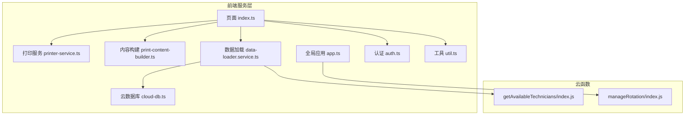
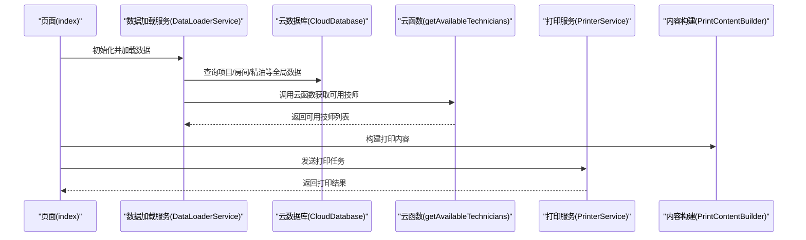
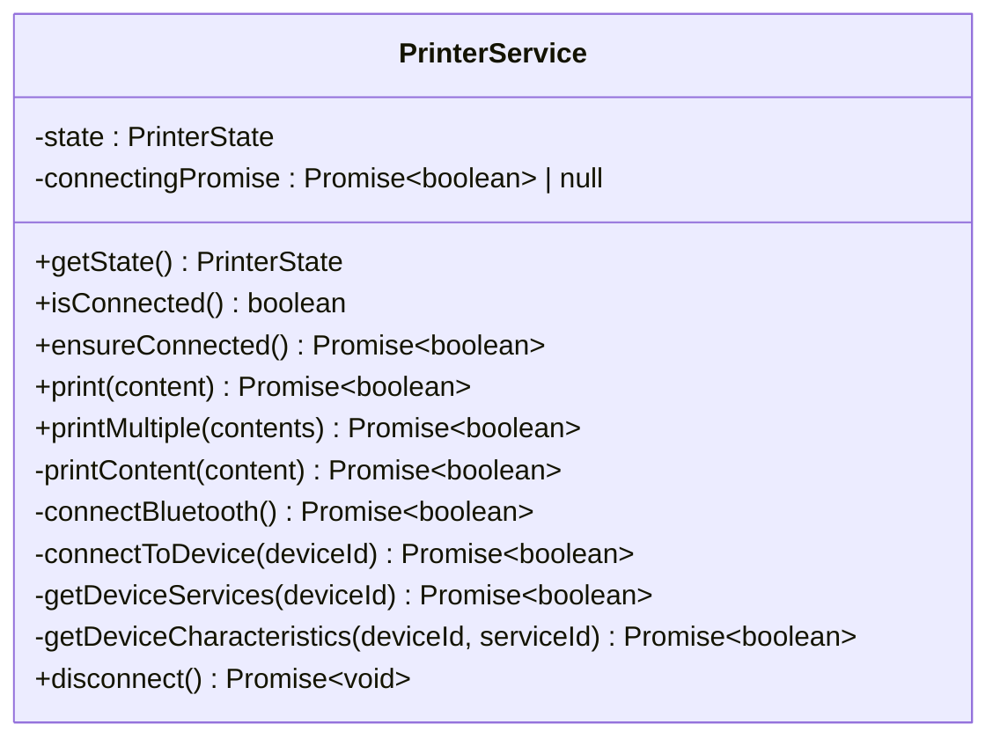
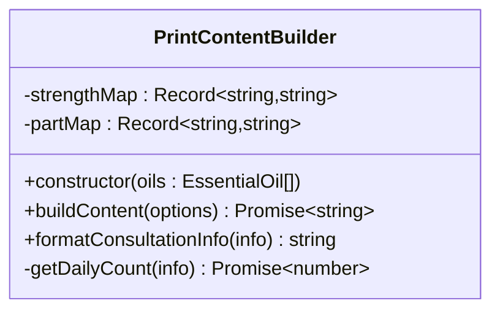
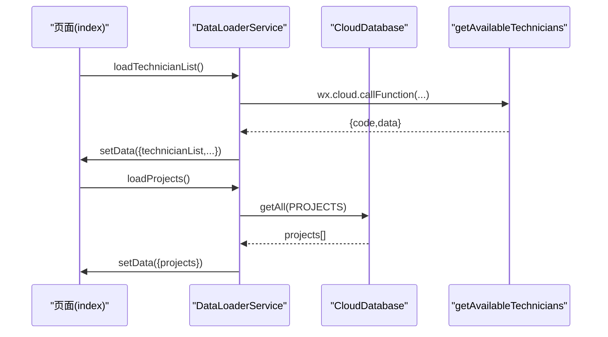
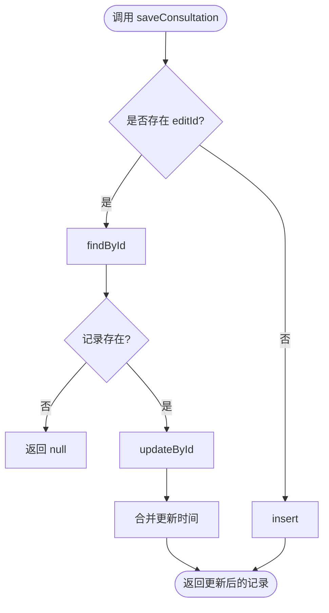
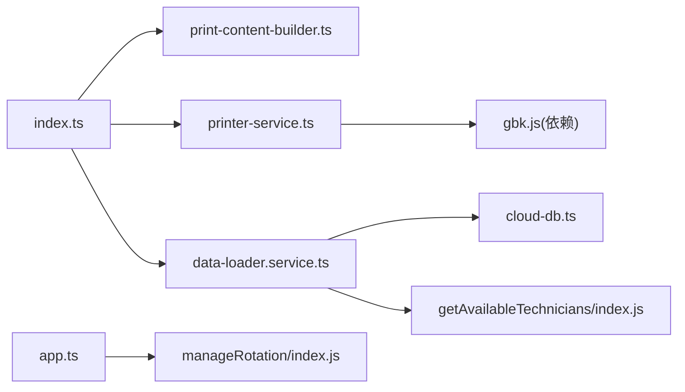

# 服务层扩展开发

<cite>
**本文档引用的文件**
- [miniprogram/services/print-content-builder.ts](file://miniprogram/services/print-content-builder.ts)
- [miniprogram/services/printer-service.ts](file://miniprogram/services/printer-service.ts)
- [miniprogram/pages/index/services/data-loader.service.ts](file://miniprogram/pages/index/services/data-loader.service.ts)
- [miniprogram/utils/cloud-db.ts](file://miniprogram/utils/cloud-db.ts)
- [miniprogram/app.ts](file://miniprogram/app.ts)
- [miniprogram/utils/auth.ts](file://miniprogram/utils/auth.ts)
- [miniprogram/utils/util.ts](file://miniprogram/utils/util.ts)
- [miniprogram/pages/index/index.ts](file://miniprogram/pages/index/index.ts)
- [cloudfunctions/getAvailableTechnicians/index.js](file://cloudfunctions/getAvailableTechnicians/index.js)
- [cloudfunctions/manageRotation/index.js](file://cloudfunctions/manageRotation/index.js)
- [package.json](file://package.json)
</cite>

## 目录
1. [简介](#简介)
2. [项目结构](#项目结构)
3. [核心组件](#核心组件)
4. [架构总览](#架构总览)
5. [详细组件分析](#详细组件分析)
6. [依赖关系分析](#依赖关系分析)
7. [性能考虑](#性能考虑)
8. [故障排查指南](#故障排查指南)
9. [结论](#结论)
10. [附录](#附录)

## 简介
本指南面向服务层扩展开发，围绕打印服务、数据加载服务与云数据库服务展开，系统阐述以下主题：
- 设计模式应用：单例模式、工厂模式、策略模式在服务层的落地
- 新服务开发流程：接口设计、依赖注入、错误处理
- 服务间协作：数据流转、状态管理
- 测试方法：Mock 数据与集成测试策略
- 性能优化：缓存、并发控制、异步处理
- 实战案例：从工具类到复杂业务服务的完整实现路径

## 项目结构
项目采用按功能域划分的目录组织，服务层主要位于 miniprogram/services 与 miniprogram/utils，并通过云函数扩展后端能力。

**图表来源**
- [miniprogram/pages/index/index.ts](file://miniprogram/pages/index/index.ts#L1-L735)
- [miniprogram/services/printer-service.ts](file://miniprogram/services/printer-service.ts#L1-L298)
- [miniprogram/services/print-content-builder.ts](file://miniprogram/services/print-content-builder.ts#L1-L144)
- [miniprogram/pages/index/services/data-loader.service.ts](file://miniprogram/pages/index/services/data-loader.service.ts#L1-L206)
- [miniprogram/utils/cloud-db.ts](file://miniprogram/utils/cloud-db.ts#L1-L321)
- [miniprogram/app.ts](file://miniprogram/app.ts#L1-L191)
- [miniprogram/utils/auth.ts](file://miniprogram/utils/auth.ts#L1-L245)
- [miniprogram/utils/util.ts](file://miniprogram/utils/util.ts#L1-L150)
- [cloudfunctions/getAvailableTechnicians/index.js](file://cloudfunctions/getAvailableTechnicians/index.js#L1-L285)
- [cloudfunctions/manageRotation/index.js](file://cloudfunctions/manageRotation/index.js#L1-L327)

**章节来源**
- [miniprogram/pages/index/index.ts](file://miniprogram/pages/index/index.ts#L1-L735)
- [package.json](file://package.json#L1-L28)

## 核心组件
- 打印服务：负责蓝牙打印机连接、状态管理与打印任务调度
- 内容构建服务：将咨询单信息转换为可打印文本
- 数据加载服务：封装页面数据加载逻辑，协调云函数与本地状态
- 云数据库服务：统一数据库访问入口，提供 CRUD 与查询能力
- 全局应用服务：提供全局数据缓存与云函数调用
- 认证服务：单例模式管理用户登录态与令牌
- 工具服务：通用时间、计算、格式化工具

**章节来源**
- [miniprogram/services/printer-service.ts](file://miniprogram/services/printer-service.ts#L1-L298)
- [miniprogram/services/print-content-builder.ts](file://miniprogram/services/print-content-builder.ts#L1-L144)
- [miniprogram/pages/index/services/data-loader.service.ts](file://miniprogram/pages/index/services/data-loader.service.ts#L1-L206)
- [miniprogram/utils/cloud-db.ts](file://miniprogram/utils/cloud-db.ts#L1-L321)
- [miniprogram/app.ts](file://miniprogram/app.ts#L1-L191)
- [miniprogram/utils/auth.ts](file://miniprogram/utils/auth.ts#L1-L245)
- [miniprogram/utils/util.ts](file://miniprogram/utils/util.ts#L1-L150)

## 架构总览
服务层遵循“页面-服务-工具-云函数”的分层架构，页面通过服务编排业务流程，服务通过工具与云函数完成数据与外部资源交互。

**图表来源**
- [miniprogram/pages/index/index.ts](file://miniprogram/pages/index/index.ts#L125-L147)
- [miniprogram/pages/index/services/data-loader.service.ts](file://miniprogram/pages/index/services/data-loader.service.ts#L13-L65)
- [miniprogram/utils/cloud-db.ts](file://miniprogram/utils/cloud-db.ts#L69-L88)
- [cloudfunctions/getAvailableTechnicians/index.js](file://cloudfunctions/getAvailableTechnicians/index.js#L9-L124)
- [miniprogram/services/print-content-builder.ts](file://miniprogram/services/print-content-builder.ts#L31-L80)
- [miniprogram/services/printer-service.ts](file://miniprogram/services/printer-service.ts#L197-L233)

## 详细组件分析

### 打印服务（PrinterService）
- 单例模式：导出单例实例，避免重复连接与状态混乱
- 状态管理：内部维护连接状态与设备/服务/特征标识
- 连接流程：蓝牙适配器初始化 → 搜索设备 → 连接 → 获取服务与特征
- 打印流程：分片发送字节流，支持多联打印与延时控制
- 错误处理：统一提示与失败返回，断开时清理状态

**图表来源**
- [miniprogram/services/printer-service.ts](file://miniprogram/services/printer-service.ts#L10-L295)

**章节来源**
- [miniprogram/services/printer-service.ts](file://miniprogram/services/printer-service.ts#L1-L298)

### 内容构建服务（PrintContentBuilder）
- 工厂模式：接收精油数组构造实例，按项目配置决定是否输出精油字段
- 策略模式：通过 isEssentialOilOnly/needEssentialOil 参数控制输出策略
- 数据映射：将强度、部位等枚举值映射为中文
- 异常降级：查询当日次数异常时返回默认值

**图表来源**
- [miniprogram/services/print-content-builder.ts](file://miniprogram/services/print-content-builder.ts#L10-L142)

**章节来源**
- [miniprogram/services/print-content-builder.ts](file://miniprogram/services/print-content-builder.ts#L1-L144)

### 数据加载服务（DataLoaderService）
- 依赖注入：构造函数注入页面实例，解耦 UI 与数据逻辑
- 并发加载：全局数据与业务数据并行拉取
- 云函数调用：封装 getAvailableTechnicians 调用，处理响应格式与错误
- 状态管理：通过页面 setData 统一更新视图状态

**图表来源**
- [miniprogram/pages/index/services/data-loader.service.ts](file://miniprogram/pages/index/services/data-loader.service.ts#L13-L74)
- [miniprogram/utils/cloud-db.ts](file://miniprogram/utils/cloud-db.ts#L69-L88)
- [cloudfunctions/getAvailableTechnicians/index.js](file://cloudfunctions/getAvailableTechnicians/index.js#L9-L124)

**章节来源**
- [miniprogram/pages/index/services/data-loader.service.ts](file://miniprogram/pages/index/services/data-loader.service.ts#L1-L206)

### 云数据库服务（CloudDatabase）
- 统一入口：封装 getAll/find/saveConsultation 等常用操作
- 错误兜底：所有异常捕获并返回空结果，保证前端健壮性
- 分页查询：findWithPage 支持条件过滤、排序与分页
- 保存逻辑：saveConsultation 支持新建与更新

**图表来源**
- [miniprogram/utils/cloud-db.ts](file://miniprogram/utils/cloud-db.ts#L260-L278)

**章节来源**
- [miniprogram/utils/cloud-db.ts](file://miniprogram/utils/cloud-db.ts#L1-L321)

### 全局应用服务（App）
- 单例模式：全局 App 实例提供统一数据源与云函数调用
- 并发加载：Promise.all 并行加载项目、房间、精油、员工等全局数据
- 旋转队列：封装 manageRotation 云函数的多种操作

**章节来源**
- [miniprogram/app.ts](file://miniprogram/app.ts#L40-L191)

### 认证服务（AuthManager）
- 单例模式：getInstance 确保唯一实例
- 登录态管理：静默登录、存储令牌、刷新用户信息
- 并发控制：loginPromise 避免重复登录

**章节来源**
- [miniprogram/utils/auth.ts](file://miniprogram/utils/auth.ts#L1-L245)

### 工具服务（util）
- 时间与计算：格式化、解析、时长计算、重叠判断
- 班次与加班：基于班次时段计算加班单位

**章节来源**
- [miniprogram/utils/util.ts](file://miniprogram/utils/util.ts#L1-L150)

## 依赖关系分析
- 页面依赖服务：index.ts 依赖打印、内容构建、数据加载服务
- 服务依赖工具：数据加载依赖云数据库与工具函数；打印依赖编码库
- 云函数依赖：数据加载调用 getAvailableTechnicians；全局应用调用 manageRotation

**图表来源**
- [miniprogram/pages/index/index.ts](file://miniprogram/pages/index/index.ts#L1-L14)
- [miniprogram/services/print-content-builder.ts](file://miniprogram/services/print-content-builder.ts#L1-L2)
- [miniprogram/services/printer-service.ts](file://miniprogram/services/printer-service.ts#L1)
- [miniprogram/pages/index/services/data-loader.service.ts](file://miniprogram/pages/index/services/data-loader.service.ts#L1-L4)
- [miniprogram/utils/cloud-db.ts](file://miniprogram/utils/cloud-db.ts#L1-L3)
- [miniprogram/app.ts](file://miniprogram/app.ts#L1-L2)
- [cloudfunctions/getAvailableTechnicians/index.js](file://cloudfunctions/getAvailableTechnicians/index.js#L1-L4)
- [cloudfunctions/manageRotation/index.js](file://cloudfunctions/manageRotation/index.js#L1-L4)
- [package.json](file://package.json#L25-L27)

**章节来源**
- [package.json](file://package.json#L25-L27)

## 性能考虑
- 并发优化
  - 页面全局数据加载使用 Promise.all 并行拉取，减少首屏等待
  - 数据加载服务中对多个请求进行并行处理
- 缓存策略
  - 全局应用服务缓存项目、房间、精油、员工等静态数据，避免重复请求
  - 打印服务内部状态缓存连接信息，ensureConnected 避免重复连接
- 异步处理
  - 打印服务采用分片发送与延时，确保设备端稳定接收
  - 云函数内部使用聚合查询与索引字段，降低查询成本
- 错误降级
  - 云数据库与数据加载服务均对异常进行捕获并返回空结果，保障 UI 不崩溃

**章节来源**
- [miniprogram/app.ts](file://miniprogram/app.ts#L48-L63)
- [miniprogram/pages/index/services/data-loader.service.ts](file://miniprogram/pages/index/services/data-loader.service.ts#L13-L65)
- [miniprogram/services/printer-service.ts](file://miniprogram/services/printer-service.ts#L182-L195)
- [miniprogram/utils/cloud-db.ts](file://miniprogram/utils/cloud-db.ts#L69-L88)

## 故障排查指南
- 打印机连接失败
  - 检查蓝牙权限与适配器初始化是否成功
  - 确认设备名称包含 Printer/打印机 关键词
  - 查看服务与特征查找日志，确认写入特征存在
- 打印内容异常
  - 确认编码库 gbk.js 是否正确安装
  - 检查分片大小与延时设置，避免设备缓冲区溢出
- 数据加载失败
  - 校验云函数返回格式，确保包含 code 与 data 字段
  - 检查网络与云函数权限配置
- 用户登录态问题
  - 使用静默登录，检查 token 存储与过期处理
  - 必要时触发刷新用户信息

**章节来源**
- [miniprogram/services/printer-service.ts](file://miniprogram/services/printer-service.ts#L31-L91)
- [miniprogram/services/printer-service.ts](file://miniprogram/services/printer-service.ts#L235-L269)
- [miniprogram/pages/index/services/data-loader.service.ts](file://miniprogram/pages/index/services/data-loader.service.ts#L33-L64)
- [miniprogram/utils/auth.ts](file://miniprogram/utils/auth.ts#L78-L126)

## 结论
服务层通过清晰的职责划分与设计模式应用，实现了高内聚、低耦合的架构。建议在扩展新服务时：
- 明确单一职责，优先使用单例或依赖注入管理状态
- 将业务策略抽象为可配置项，便于后续扩展
- 在服务边界处做好错误处理与降级策略
- 利用并发与缓存提升性能，关注用户体验

## 附录

### 设计模式应用清单
- 单例模式
  - 打印服务导出单例实例
  - 认证服务通过 getInstance 确保唯一实例
- 工厂模式
  - 内容构建服务以构造函数注入依赖，按配置生成不同输出
- 策略模式
  - 内容构建服务通过参数控制是否输出精油字段

**章节来源**
- [miniprogram/services/printer-service.ts](file://miniprogram/services/printer-service.ts#L297-L298)
- [miniprogram/utils/auth.ts](file://miniprogram/utils/auth.ts#L14-L19)
- [miniprogram/services/print-content-builder.ts](file://miniprogram/services/print-content-builder.ts#L29-L30)

### 新服务开发流程（模板）
- 接口设计
  - 定义输入/输出契约，明确异常与边界条件
- 依赖注入
  - 通过构造函数注入所需依赖，避免全局状态
- 错误处理
  - 在服务边界捕获异常，返回可识别的错误码或默认值
- 数据流转
  - 明确数据来源（本地/云数据库/云函数），统一通过服务层暴露
- 状态管理
  - 对于需要持久化的状态，集中管理并在服务层提供统一访问接口

### 测试方法与策略
- 单元测试
  - Mock 工具函数与云函数返回值，验证服务逻辑分支
- 集成测试
  - 使用真实云环境调用云函数，验证端到端流程
- 性能测试
  - 并发场景下评估服务吞吐量与响应时间

### 实战案例
- 简单工具类服务
  - 示例：时间计算与格式化工具，直接导出纯函数或静态方法
- 复杂业务服务
  - 示例：订单状态机服务，封装状态转换、事件发布与持久化
  - 关键点：状态机定义、事件驱动、幂等性保证、错误回滚