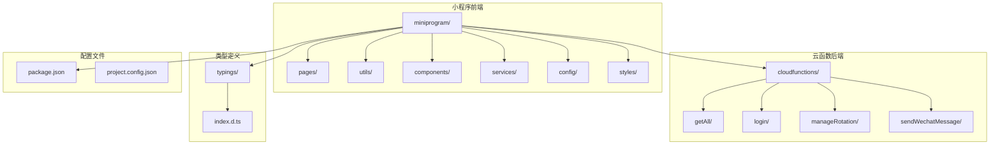
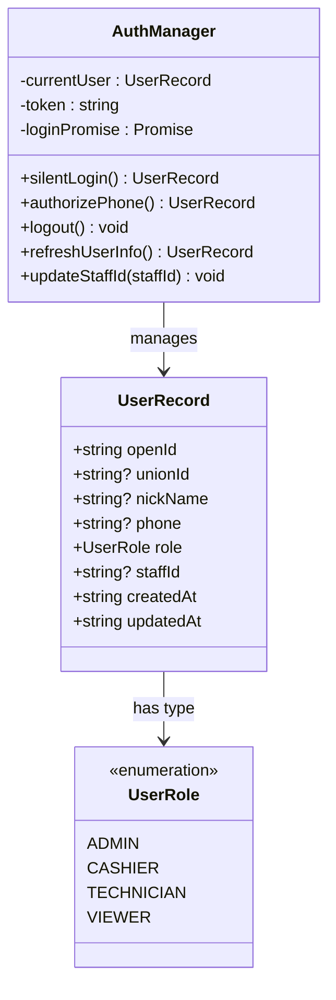
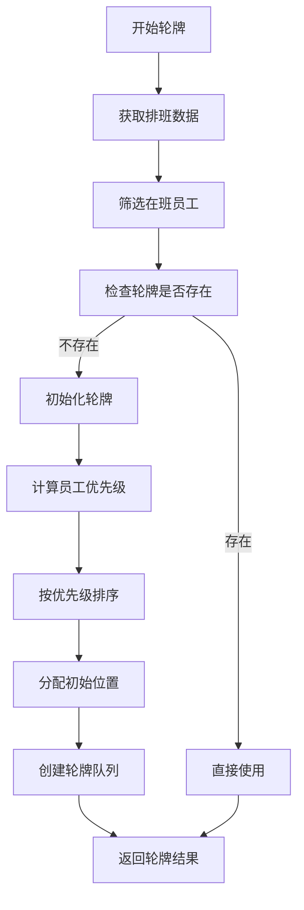
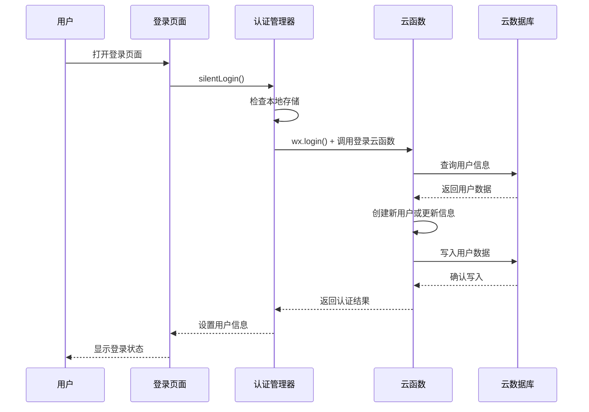
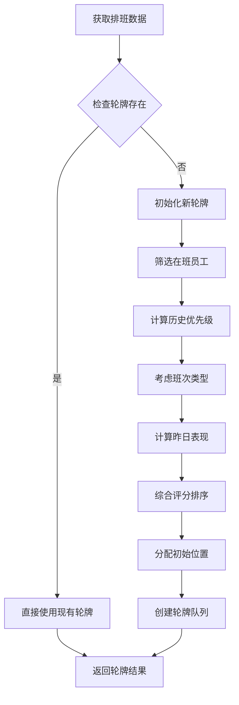
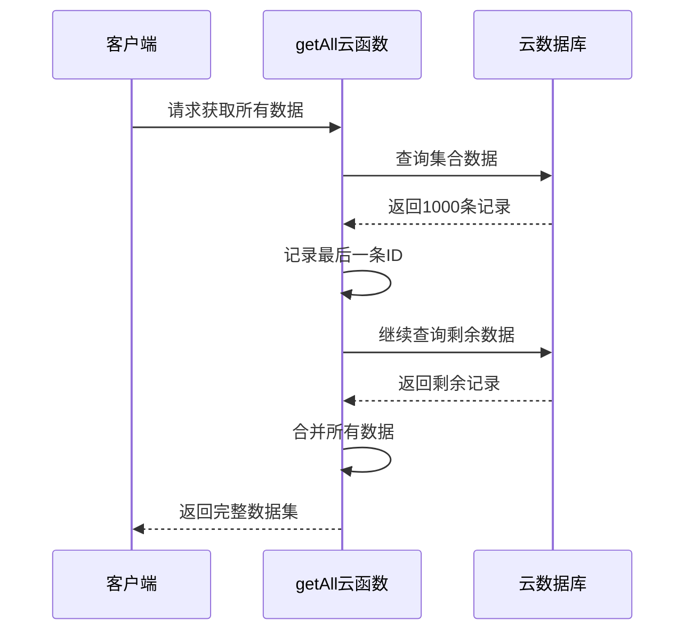
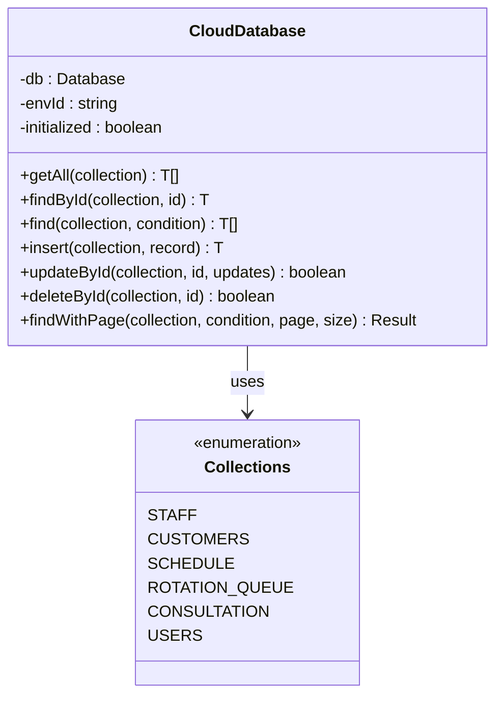
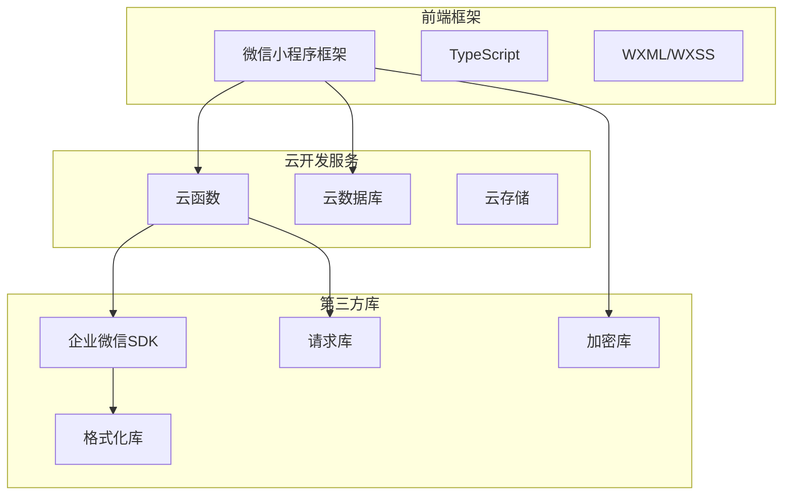

# 企业微信工作集成

<cite>
**本文档引用的文件**
- [cloudfunctions/getAll/index.js](file://cloudfunctions/getAll/index.js)
- [cloudfunctions/login/index.js](file://cloudfunctions/login/index.js)
- [cloudfunctions/manageRotation/index.js](file://cloudfunctions/manageRotation/index.js)
- [cloudfunctions/sendWechatMessage/index.js](file://cloudfunctions/sendWechatMessage/index.js)
- [cloudfunctions/sendWechatMessage/package.json](file://cloudfunctions/sendWechatMessage/package.json)
- [cloudfunctions/sendWechatMessage/package-lock.json](file://cloudfunctions/sendWechatMessage/package-lock.json)
- [miniprogram/utils/wechat-work.ts](file://miniprogram/utils/wechat-work.ts)
- [miniprogram/app.ts](file://miniprogram/app.ts)
- [miniprogram/utils/auth.ts](file://miniprogram/utils/auth.ts)
- [miniprogram/utils/cloud-db.ts](file://miniprogram/utils/cloud-db.ts)
- [miniprogram/pages/login/login.ts](file://miniprogram/pages/login/login.ts)
- [miniprogram/config/index.ts](file://miniprogram/config/index.ts)
- [miniprogram/app.json](file://miniprogram/app.json)
- [typings/index.d.ts](file://typings/index.d.ts)
- [miniprogram/utils/constants.ts](file://miniprogram/utils/constants.ts)
- [miniprogram/utils/util.ts](file://miniprogram/utils/util.ts)
- [package.json](file://package.json)
- [miniprogram/pages/cashier/handlers/push.handler.ts](file://miniprogram/pages/cashier/handlers/push.handler.ts)
- [miniprogram/pages/cashier/cashier.types.ts](file://miniprogram/pages/cashier/cashier.types.ts)
- [miniprogram/pages/cashier/services/data-loader.service.ts](file://miniprogram/pages/cashier/services/data-loader.service.ts)
- [miniprogram/services/reservation.service.ts](file://miniprogram/services/reservation.service.ts)
- [miniprogram/types/reservation.types.ts](file://miniprogram/types/reservation.types.ts)
</cite>

## 更新摘要
**变更内容**
- 移除企业微信工作集成功能，包括推送通知系统、日常总结消息发送和复杂的预约变更跟踪系统
- 删除@提及功能和相关的企业微信消息推送接口
- 移除轮牌推送、到店通知、预约变更通知等企业微信集成功能
- 简化系统架构，移除云函数sendWechatMessage及相关依赖

## 目录
1. [项目概述](#项目概述)
2. [项目结构](#项目结构)
3. [核心组件](#核心组件)
4. [架构概览](#架构概览)
5. [详细组件分析](#详细组件分析)
6. [依赖关系分析](#依赖关系analysis)
7. [性能考虑](#性能考虑)
8. [故障排除指南](#故障排除指南)
9. [结论](#结论)

## 项目概述

这是一个基于微信小程序的企业微信工作集成管理系统，主要面向按摩理疗店的日常运营管理需求。系统集成了企业微信工作台功能，提供员工排班管理、客户预约、咨询记录管理、轮牌制度等功能。

**重要变更**：系统已移除企业微信工作集成功能，包括推送通知系统、@提及功能和相关的消息推送接口。当前版本专注于核心业务功能，不再包含企业微信集成。

### 主要特性
- **企业微信集成**：*已移除*
- **智能轮牌管理**：基于排班和历史数据的智能轮牌系统
- **多角色权限管理**：管理员、收银员、技师、查看者等不同角色
- **实时数据同步**：基于云开发的实时数据存储和同步
- **消息通知**：*已移除企业微信消息推送*
- **@提及功能**：*已移除*

## 项目结构



**图表来源**
- [miniprogram/app.json:1-35](file://miniprogram/app.json#L1-L35)
- [package.json:1-28](file://package.json#L1-L28)

**章节来源**
- [miniprogram/app.json:1-35](file://miniprogram/app.json#L1-L35)
- [package.json:1-28](file://package.json#L1-L28)

## 核心组件

### 1. 认证与权限管理
系统采用基于企业微信的认证机制，支持多种登录方式和权限控制：



**图表来源**
- [miniprogram/utils/auth.ts:4-222](file://miniprogram/utils/auth.ts#L4-L222)
- [typings/index.d.ts:287-302](file://typings/index.d.ts#L287-L302)

### 2. 轮牌管理系统
基于排班和历史数据的智能轮牌算法：



**图表来源**
- [cloudfunctions/manageRotation/index.js:38-147](file://cloudfunctions/manageRotation/index.js#L38-L147)

### 3. 企业微信集成
**重要变更**：企业微信集成功能已被完全移除。以下组件不再存在：
- sendWechatMessage云函数
- @提及功能实现
- 企业微信消息推送接口
- 相关的推送处理器和消息构建器

**章节来源**
- [miniprogram/utils/auth.ts:1-245](file://miniprogram/utils/auth.ts#L1-L245)
- [cloudfunctions/manageRotation/index.js:1-328](file://cloudfunctions/manageRotation/index.js#L1-L328)
- [cloudfunctions/sendWechatMessage/index.js:1-72](file://cloudfunctions/sendWechatMessage/index.js#L1-L72)
- [miniprogram/utils/wechat-work.ts:1-16](file://miniprogram/utils/wechat-work.ts#L1-L16)

## 架构概览

系统采用前后端分离架构，前端为微信小程序，后端为云开发函数。**重要变更**：企业微信集成部分已被移除。

```mermaid
graph TB
subgraph "客户端层"
A[微信小程序客户端]
B[用户界面]
C[业务逻辑]
end
subgraph "应用服务层"
D[云函数服务]
E[认证服务]
F[轮牌服务]
G[消息服务]
end
subgraph "数据存储层"
H[云数据库]
I[集合: users]
J[集合: staff]
K[集合: schedule]
L[集合: rotation_queue]
end
subgraph "企业微信集成"
M[企业微信API]
N[机器人Webhook]
O[消息推送]
P[@提及功能]
end
A --> D
B --> C
C --> D
D --> H
E --> H
F --> H
G --> N
N --> M
M --> P
```

**图表来源**
- [miniprogram/app.ts:1-191](file://miniprogram/app.ts#L1-L191)
- [cloudfunctions/login/index.js:1-180](file://cloudfunctions/login/index.js#L1-L180)
- [cloudfunctions/manageRotation/index.js:1-328](file://cloudfunctions/manageRotation/index.js#L1-L328)

## 详细组件分析

### 认证流程组件

#### 登录流程序列图


**图表来源**
- [miniprogram/pages/login/login.ts:15-49](file://miniprogram/pages/login/login.ts#L15-L49)
- [miniprogram/utils/auth.ts:78-126](file://miniprogram/utils/auth.ts#L78-L126)
- [cloudfunctions/login/index.js:11-90](file://cloudfunctions/login/index.js#L11-L90)

#### 权限管理组件
系统实现多层级权限控制，支持不同角色访问不同功能模块：

| 角色类型 | 页面权限 | 功能权限 |
|---------|----------|----------|
| 管理员 | 所有页面 | 完全控制 |
| 收银员 | 首页、收银、历史 | 创建预约、结算 |
| 技师 | 个人资料、轮牌 | 查看排班、服务记录 |
| 查看者 | 首页、统计 | 仅查看权限 |

**章节来源**
- [miniprogram/utils/auth.ts:67-70](file://miniprogram/utils/auth.ts#L67-L70)
- [typings/index.d.ts:258-285](file://typings/index.d.ts#L258-L285)

### 轮牌管理组件

#### 轮牌算法流程


**图表来源**
- [cloudfunctions/manageRotation/index.js:85-121](file://cloudfunctions/manageRotation/index.js#L85-L121)

#### 轮牌服务接口
系统提供完整的轮牌管理接口：

| 接口名称 | 功能描述 | 参数 | 返回值 |
|---------|----------|------|--------|
| init | 初始化轮牌 | date | 轮牌队列 |
| getNext | 获取下一位技师 | date | 当前技师信息 |
| serveCustomer | 完成服务 | date, staffId, isClockIn | 更新后的队列 |
| getQueue | 获取完整队列 | date | 轮牌队列 |
| adjustPosition | 调整位置 | date, fromIndex, toIndex | 重新排列的队列 |

**章节来源**
- [cloudfunctions/manageRotation/index.js:9-36](file://cloudfunctions/manageRotation/index.js#L9-L36)
- [cloudfunctions/manageRotation/index.js:149-184](file://cloudfunctions/manageRotation/index.js#L149-L184)

### 数据管理组件

#### 全量数据获取优化
针对大量数据的分页获取策略：



**图表来源**
- [cloudfunctions/getAll/index.js:25-44](file://cloudfunctions/getAll/index.js#L25-L44)

#### 云数据库封装
提供统一的数据访问接口：



**图表来源**
- [miniprogram/utils/cloud-db.ts:12-321](file://miniprogram/utils/cloud-db.ts#L12-L321)

**章节来源**
- [cloudfunctions/getAll/index.js:1-59](file://cloudfunctions/getAll/index.js#L1-L59)
- [miniprogram/utils/cloud-db.ts:1-321](file://miniprogram/utils/cloud-db.ts#L1-L321)

### 企业微信消息集成
**重要变更**：企业微信消息集成功能已被完全移除。以下组件不再存在：

#### 消息格式化组件
**已移除**：formatMention函数和@提及功能实现

#### 增强的消息推送流程
**已移除**：sendWechatMessage云函数和相关推送接口

#### @提及功能实现
**已移除**：@提及格式生成和消息构建逻辑

**章节来源**
- [miniprogram/utils/wechat-work.ts:1-16](file://miniprogram/utils/wechat-work.ts#L1-L16)
- [cloudfunctions/sendWechatMessage/index.js:1-72](file://cloudfunctions/sendWechatMessage/index.js#L1-L72)

### 智能消息推送组件
**重要变更**：智能消息推送组件已被移除。以下功能不再可用：

#### 增强的消息推送场景
**已移除**：到店通知、预约变更通知、轮牌推送、结算通知等推送功能

#### 消息推送接口
**已移除**：sendArrivalNotification、sendReservationModificationNotification、sendRotationPush、sendSettlementNotification等接口

**章节来源**
- [miniprogram/pages/cashier/handlers/push.handler.ts:1-410](file://miniprogram/pages/cashier/handlers/push.handler.ts#L1-L410)
- [miniprogram/pages/cashier/cashier.types.ts:31-48](file://miniprogram/pages/cashier/cashier.types.ts#L31-L48)

## 依赖关系分析

### 技术栈依赖


**重要变更**：企业微信SDK依赖已被移除，系统不再依赖企业微信相关库。

**图表来源**
- [package.json:25-27](file://package.json#L25-L27)
- [miniprogram/app.json:23-34](file://miniprogram/app.json#L23-L34)

### 数据模型关系
```mermaid
erDiagram
USERS {
string openId PK
string role
string status
string? staffId
string createdAt
string updatedAt
}
STAFF {
string name
string status
string gender
string phone
string wechatWorkId
string avatar
}
SCHEDULE {
string date
string staffId
string shift
}
ROTATION_QUEUE {
string date
array staffList
number currentIndex
string createdAt
string updatedAt
}
CONSULTATION_RECORDS {
string surname
string project
string technician
string room
string date
string startTime
string endTime
boolean isClockIn
string createdAt
string updatedAt
}
USERS ||--o{ STAFF : "关联"
STAFF ||--o{ SCHEDULE : "排班"
SCHEDULE ||--o{ ROTATION_QUEUE : "轮牌"
ROTATION_QUEUE ||--o{ CONSULTATION_RECORDS : "服务"
```

**图表来源**
- [typings/index.d.ts:89-97](file://typings/index.d.ts#L89-L97)
- [typings/index.d.ts:103-107](file://typings/index.d.ts#L103-L107)
- [typings/index.d.ts:318-327](file://typings/index.d.ts#L318-L327)

**章节来源**
- [package.json:25-27](file://package.json#L25-L27)
- [typings/index.d.ts:1-438](file://typings/index.d.ts#L1-L438)

## 性能考虑

### 1. 数据加载优化
- **分页查询**: 大数据集采用分页策略，避免一次性加载过多数据
- **并发请求**: 使用Promise.all并行加载多个集合数据
- **缓存机制**: 全局数据缓存，减少重复请求

### 2. 云函数优化
- **批量操作**: getAll云函数支持批量获取，减少网络往返
- **条件查询**: 使用数据库索引优化查询性能
- **错误处理**: 完善的异常捕获和错误恢复机制

### 3. 前端性能
- **懒加载**: 页面按需加载，提升首屏速度
- **状态管理**: 集中式状态管理，避免重复渲染
- **内存优化**: 及时清理定时器和事件监听器

### 4. 企业微信集成优化
**重要变更**：企业微信集成优化已移除，系统不再包含相关优化措施。

## 故障排除指南

### 常见问题及解决方案

#### 登录认证问题
**问题**: 用户无法登录
**可能原因**:
- 企业微信配置错误
- 网络连接问题
- 云函数权限不足

**解决步骤**:
1. 检查企业微信应用配置
2. 验证云函数环境变量
3. 查看云函数日志输出
4. 确认用户权限设置

#### 轮牌功能异常
**问题**: 轮牌显示不正确
**排查方法**:
1. 检查排班数据完整性
2. 验证员工状态信息
3. 确认轮牌初始化过程
4. 查看历史服务记录

#### 消息推送失败
**重要变更**：消息推送功能已移除，相关问题不再适用。

#### @提及功能异常
**重要变更**：@提及功能已移除，相关问题不再适用。

**章节来源**
- [miniprogram/pages/login/login.ts:47-94](file://miniprogram/pages/login/login.ts#L47-L94)
- [cloudfunctions/manageRotation/index.js:30-35](file://cloudfunctions/manageRotation/index.js#L30-L35)
- [cloudfunctions/sendWechatMessage/index.js:58-63](file://cloudfunctions/sendWechatMessage/index.js#L58-L63)
- [miniprogram/utils/wechat-work.ts:1-16](file://miniprogram/utils/wechat-work.ts#L1-L16)

## 结论

本企业微信工作集成为按摩理疗店提供了完整的数字化管理解决方案。**重要变更**：系统已移除企业微信集成功能，当前版本专注于核心业务功能。

### 核心优势
1. **集成度高**: 深度集成企业微信，提供无缝的工作体验
2. **智能化程度**: 基于历史数据的智能轮牌算法，提升运营效率
3. **扩展性强**: 模块化的架构设计，便于功能扩展和维护
4. **安全性好**: 多层次权限控制，确保数据安全

### 技术亮点
- 基于云开发的无服务器架构，降低运维成本
- 类型安全的TypeScript实现，提升代码质量
- 完善的错误处理和日志记录机制
- 企业微信生态的深度整合

### 发展建议
1. **监控告警**: 增加系统监控和异常告警机制
2. **数据分析**: 扩展数据统计和报表功能
3. **移动端优化**: 进一步优化移动端用户体验
4. **国际化支持**: 考虑多语言和多币种支持

**重要说明**：由于企业微信集成功能已被移除，系统当前版本不再支持消息推送、@提及通知等企业微信相关功能。如需恢复这些功能，需要重新集成企业微信API并实现相应的推送逻辑。