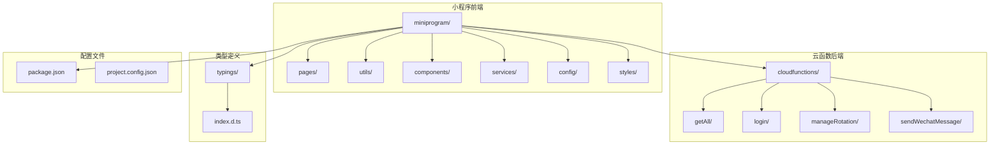
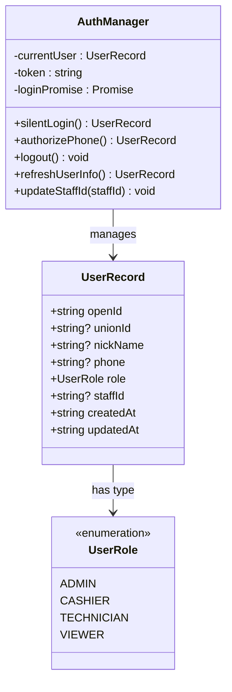
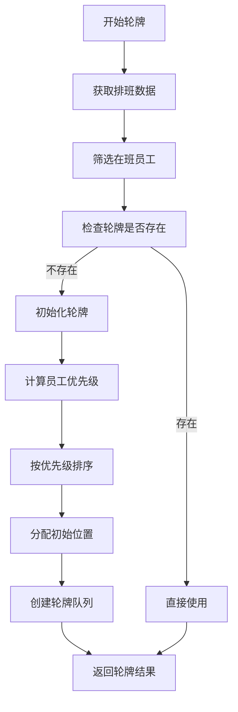
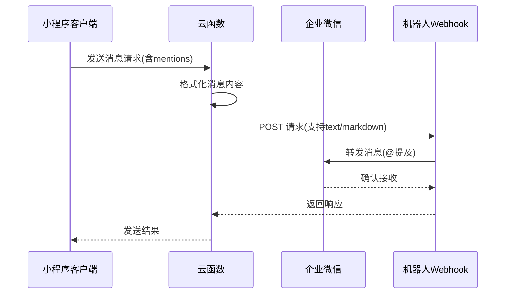
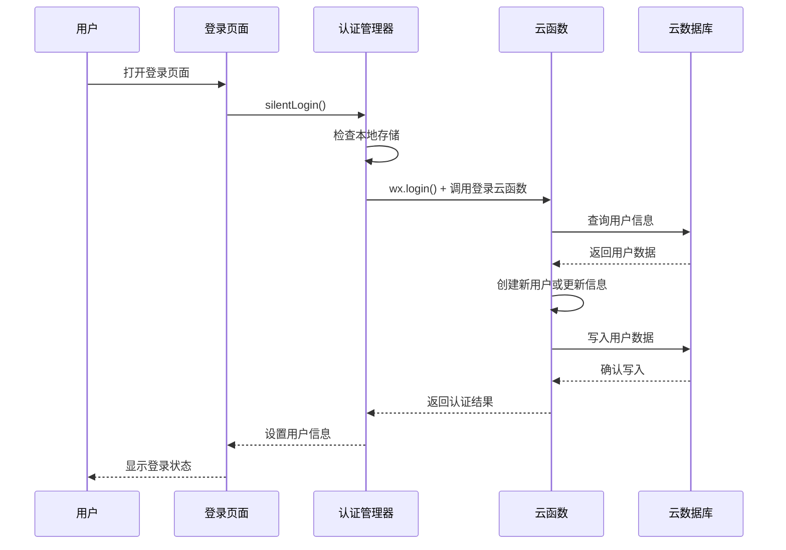
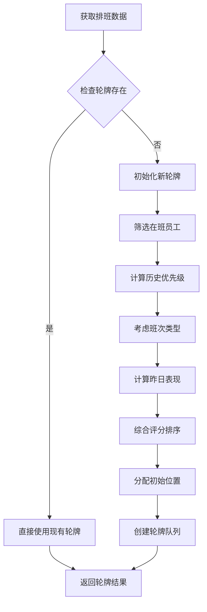
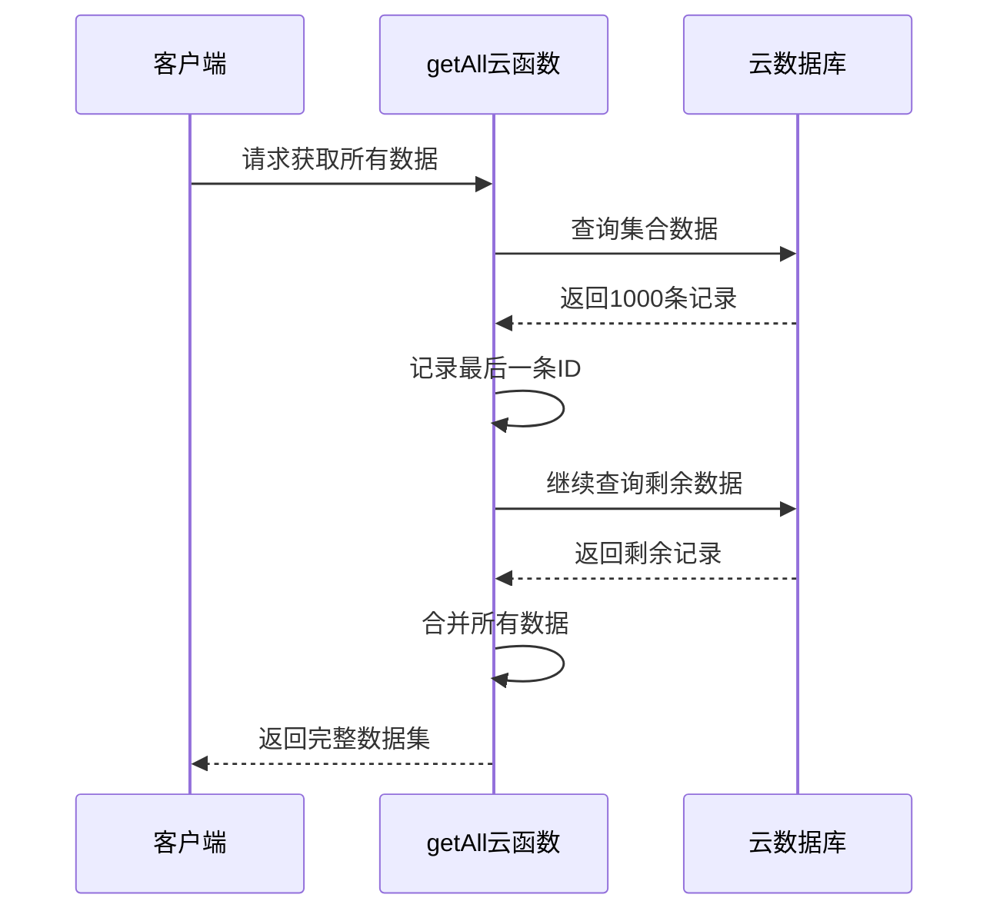
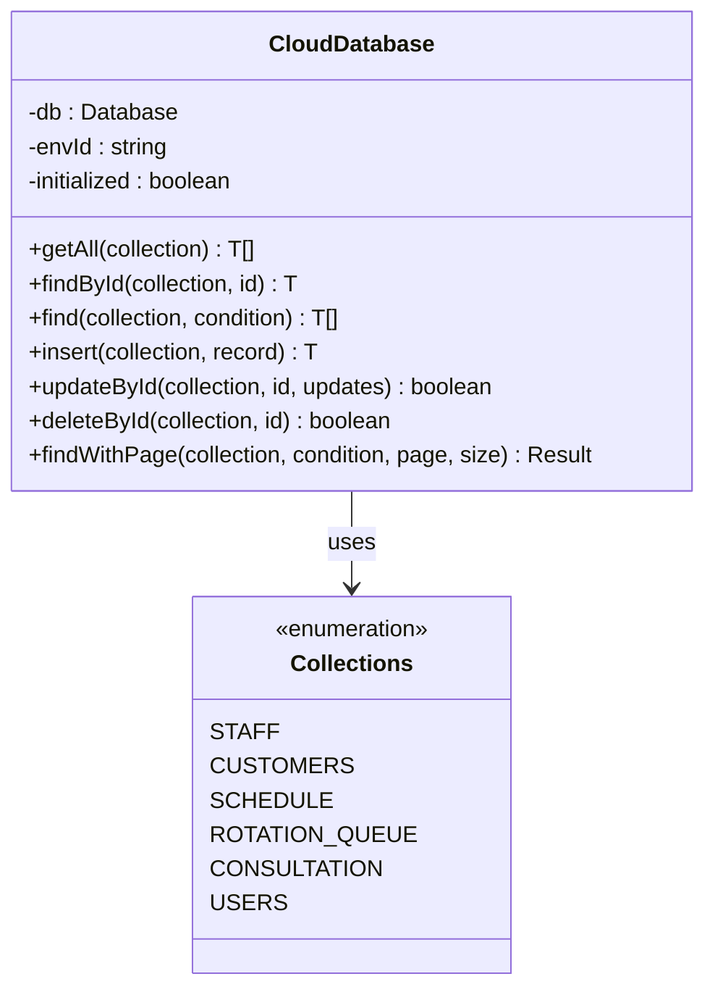
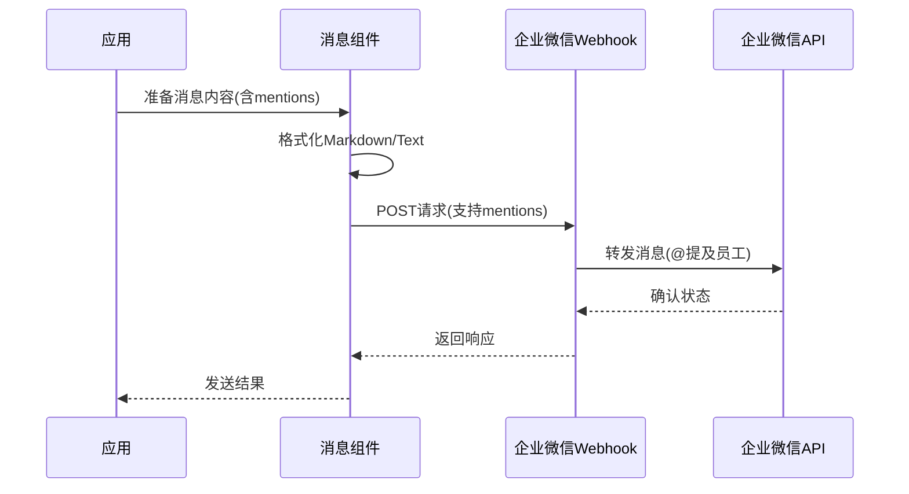
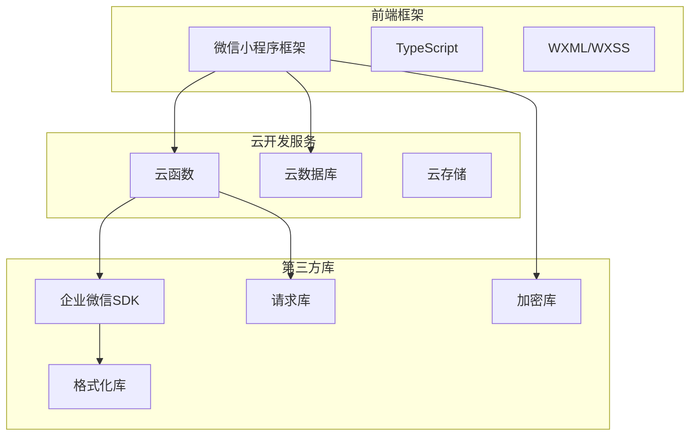

# 企业微信工作集成

<cite>
**本文档引用的文件**
- [cloudfunctions/getAll/index.js](file://cloudfunctions/getAll/index.js)
- [cloudfunctions/login/index.js](file://cloudfunctions/login/index.js)
- [cloudfunctions/manageRotation/index.js](file://cloudfunctions/manageRotation/index.js)
- [cloudfunctions/sendWechatMessage/index.js](file://cloudfunctions/sendWechatMessage/index.js)
- [cloudfunctions/sendWechatMessage/package.json](file://cloudfunctions/sendWechatMessage/package.json)
- [cloudfunctions/sendWechatMessage/package-lock.json](file://cloudfunctions/sendWechatMessage/package-lock.json)
- [miniprogram/utils/wechat-work.ts](file://miniprogram/utils/wechat-work.ts)
- [miniprogram/app.ts](file://miniprogram/app.ts)
- [miniprogram/utils/auth.ts](file://miniprogram/utils/auth.ts)
- [miniprogram/utils/cloud-db.ts](file://miniprogram/utils/cloud-db.ts)
- [miniprogram/pages/login/login.ts](file://miniprogram/pages/login/login.ts)
- [miniprogram/config/index.ts](file://miniprogram/config/index.ts)
- [miniprogram/app.json](file://miniprogram/app.json)
- [typings/index.d.ts](file://typings/index.d.ts)
- [miniprogram/utils/constants.ts](file://miniprogram/utils/constants.ts)
- [miniprogram/utils/util.ts](file://miniprogram/utils/util.ts)
- [package.json](file://package.json)
- [miniprogram/pages/cashier/handlers/push.handler.ts](file://miniprogram/pages/cashier/handlers/push.handler.ts)
- [miniprogram/pages/cashier/cashier.types.ts](file://miniprogram/pages/cashier/cashier.types.ts)
- [miniprogram/pages/cashier/services/data-loader.service.ts](file://miniprogram/pages/cashier/services/data-loader.service.ts)
</cite>

## 更新摘要
**变更内容**
- 增强企业微信消息系统，支持文本通知和@提及功能
- 新增mentions参数支持，实现员工直接通知
- 改进formatMention函数，支持多种@提及格式
- 扩展消息推送场景，支持预约变更、到店通知等重要事件

## 目录
1. [项目概述](#项目概述)
2. [项目结构](#项目结构)
3. [核心组件](#核心组件)
4. [架构概览](#架构概览)
5. [详细组件分析](#详细组件分析)
6. [依赖关系分析](#依赖关系分析)
7. [性能考虑](#性能考虑)
8. [故障排除指南](#故障排除指南)
9. [结论](#结论)

## 项目概述

这是一个基于微信小程序的企业微信工作集成管理系统，主要面向按摩理疗店的日常运营管理需求。系统集成了企业微信工作台功能，提供员工排班管理、客户预约、咨询记录管理、轮牌制度等功能。

### 主要特性
- **企业微信集成**: 支持企业微信身份认证和消息推送
- **智能轮牌管理**: 基于排班和历史数据的智能轮牌系统
- **多角色权限管理**: 管理员、收银员、技师、查看者等不同角色
- **实时数据同步**: 基于云开发的实时数据存储和同步
- **消息通知**: 通过企业微信机器人进行工作提醒和通知
- **@提及功能**: 支持员工直接@通知，提升重要事件的传达效率

## 项目结构



**图表来源**
- [miniprogram/app.json](file://miniprogram/app.json#L1-L35)
- [package.json](file://package.json#L1-L28)

**章节来源**
- [miniprogram/app.json](file://miniprogram/app.json#L1-L35)
- [package.json](file://package.json#L1-L28)

## 核心组件

### 1. 认证与权限管理
系统采用基于企业微信的认证机制，支持多种登录方式和权限控制：



**图表来源**
- [miniprogram/utils/auth.ts](file://miniprogram/utils/auth.ts#L4-L222)
- [typings/index.d.ts](file://typings/index.d.ts#L287-L302)

### 2. 轮牌管理系统
基于排班和历史数据的智能轮牌算法：



**图表来源**
- [cloudfunctions/manageRotation/index.js](file://cloudfunctions/manageRotation/index.js#L38-L147)

### 3. 企业微信集成
支持企业微信消息推送和员工识别，现已增强@提及功能：



**图表来源**
- [cloudfunctions/sendWechatMessage/index.js](file://cloudfunctions/sendWechatMessage/index.js#L10-L64)
- [miniprogram/utils/wechat-work.ts](file://miniprogram/utils/wechat-work.ts#L1-L16)

**章节来源**
- [miniprogram/utils/auth.ts](file://miniprogram/utils/auth.ts#L1-L245)
- [cloudfunctions/manageRotation/index.js](file://cloudfunctions/manageRotation/index.js#L1-L328)
- [cloudfunctions/sendWechatMessage/index.js](file://cloudfunctions/sendWechatMessage/index.js#L1-L72)
- [miniprogram/utils/wechat-work.ts](file://miniprogram/utils/wechat-work.ts#L1-L16)

## 架构概览

系统采用前后端分离架构，前端为微信小程序，后端为云开发函数：

```mermaid
graph TB
subgraph "客户端层"
A[微信小程序客户端]
B[用户界面]
C[业务逻辑]
end
subgraph "应用服务层"
D[云函数服务]
E[认证服务]
F[轮牌服务]
G[消息服务]
end
subgraph "数据存储层"
H[云数据库]
I[集合: users]
J[集合: staff]
K[集合: schedule]
L[集合: rotation_queue]
end
subgraph "企业微信集成"
M[企业微信API]
N[机器人Webhook]
O[消息推送]
P[@提及功能]
end
A --> D
B --> C
C --> D
D --> H
E --> H
F --> H
G --> N
N --> M
M --> P
```

**图表来源**
- [miniprogram/app.ts](file://miniprogram/app.ts#L1-L191)
- [cloudfunctions/login/index.js](file://cloudfunctions/login/index.js#L1-L180)
- [cloudfunctions/manageRotation/index.js](file://cloudfunctions/manageRotation/index.js#L1-L328)

## 详细组件分析

### 认证流程组件

#### 登录流程序列图


**图表来源**
- [miniprogram/pages/login/login.ts](file://miniprogram/pages/login/login.ts#L15-L49)
- [miniprogram/utils/auth.ts](file://miniprogram/utils/auth.ts#L78-L126)
- [cloudfunctions/login/index.js](file://cloudfunctions/login/index.js#L11-L90)

#### 权限管理组件
系统实现多层级权限控制，支持不同角色访问不同功能模块：

| 角色类型 | 页面权限 | 功能权限 |
|---------|----------|----------|
| 管理员 | 所有页面 | 完全控制 |
| 收银员 | 首页、收银、历史 | 创建预约、结算 |
| 技师 | 个人资料、轮牌 | 查看排班、服务记录 |
| 查看者 | 首页、统计 | 仅查看权限 |

**章节来源**
- [miniprogram/utils/auth.ts](file://miniprogram/utils/auth.ts#L67-L70)
- [typings/index.d.ts](file://typings/index.d.ts#L258-L285)

### 轮牌管理组件

#### 轮牌算法流程


**图表来源**
- [cloudfunctions/manageRotation/index.js](file://cloudfunctions/manageRotation/index.js#L85-L121)

#### 轮牌服务接口
系统提供完整的轮牌管理接口：

| 接口名称 | 功能描述 | 参数 | 返回值 |
|---------|----------|------|--------|
| init | 初始化轮牌 | date | 轮牌队列 |
| getNext | 获取下一位技师 | date | 当前技师信息 |
| serveCustomer | 完成服务 | date, staffId, isClockIn | 更新后的队列 |
| getQueue | 获取完整队列 | date | 轮牌队列 |
| adjustPosition | 调整位置 | date, fromIndex, toIndex | 重新排列的队列 |

**章节来源**
- [cloudfunctions/manageRotation/index.js](file://cloudfunctions/manageRotation/index.js#L9-L36)
- [cloudfunctions/manageRotation/index.js](file://cloudfunctions/manageRotation/index.js#L149-L184)

### 数据管理组件

#### 全量数据获取优化
针对大量数据的分页获取策略：



**图表来源**
- [cloudfunctions/getAll/index.js](file://cloudfunctions/getAll/index.js#L25-L44)

#### 云数据库封装
提供统一的数据访问接口：



**图表来源**
- [miniprogram/utils/cloud-db.ts](file://miniprogram/utils/cloud-db.ts#L12-L321)

**章节来源**
- [cloudfunctions/getAll/index.js](file://cloudfunctions/getAll/index.js#L1-L59)
- [miniprogram/utils/cloud-db.ts](file://miniprogram/utils/cloud-db.ts#L1-L321)

### 企业微信消息集成

#### 消息格式化组件
支持多种消息格式的自动识别和格式化，现已增强@提及功能：

```mermaid
flowchart TD
A[输入员工信息] --> B{检查微信ID}
B --> |有| C[使用微信ID格式]
B --> |无| D{检查电话号码}
D --> |有| E[使用姓名+电话格式]
D --> |无| F[仅使用姓名]
C --> G[返回@提及字符串]
E --> G
F --> G
```

**图表来源**
- [miniprogram/utils/wechat-work.ts](file://miniprogram/utils/wechat-work.ts#L1-L16)

#### 增强的消息推送流程


**图表来源**
- [cloudfunctions/sendWechatMessage/index.js](file://cloudfunctions/sendWechatMessage/index.js#L21-L44)

#### @提及功能实现
系统支持多种@提及格式，确保重要事件能及时通知到相关人员：

| @提及格式 | 使用场景 | 生成规则 |
|-----------|----------|----------|
| `<@userid>` | 企业微信ID | 优先使用企业微信ID |
| `{name}<@{phone}>` | 电话号码 | 无企业微信ID时使用 |
| `{name}` | 仅姓名 | 最后备用方案 |

**章节来源**
- [miniprogram/utils/wechat-work.ts](file://miniprogram/utils/wechat-work.ts#L1-L16)
- [cloudfunctions/sendWechatMessage/index.js](file://cloudfunctions/sendWechatMessage/index.js#L1-L72)

### 智能消息推送组件

#### 增强的消息推送场景
系统现已支持多种重要事件的智能推送：

```mermaid
flowchart TD
A[重要事件触发] --> B{事件类型}
B --> |预约变更| C[生成变更通知]
B --> |到店通知| D[生成到店提醒]
B --> |轮牌推送| E[生成轮牌信息]
B --> |结算通知| F[生成结算详情]
C --> G[提取相关员工@提及]
D --> G
E --> G
F --> G
G --> H[发送企业微信消息]
H --> I[通知发送结果]
```

**图表来源**
- [miniprogram/pages/cashier/handlers/push.handler.ts](file://miniprogram/pages/cashier/handlers/push.handler.ts#L171-L284)

#### 消息推送接口
系统提供完整的消息推送接口，支持不同类型的重要事件：

| 接口名称 | 功能描述 | 参数 | @提及支持 |
|---------|----------|------|----------|
| sendArrivalNotification | 到店通知 | reservations: ReservationRecord[] | ✅ 技师@提及 |
| sendReservationModificationNotification | 预约变更通知 | original, updated | ✅ 技师@提及 |
| sendRotationPush | 轮牌推送 | rotationList, selectedDate | ❌ 无@提及 |
| sendSettlementNotification | 结算通知 | record: ConsultationRecord | ✅ 特殊@提及 |

**章节来源**
- [miniprogram/pages/cashier/handlers/push.handler.ts](file://miniprogram/pages/cashier/handlers/push.handler.ts#L1-L355)
- [miniprogram/pages/cashier/cashier.types.ts](file://miniprogram/pages/cashier/cashier.types.ts#L31-L48)

## 依赖关系分析

### 技术栈依赖


**图表来源**
- [package.json](file://package.json#L25-L27)
- [miniprogram/app.json](file://miniprogram/app.json#L23-L34)

### 数据模型关系
```mermaid
erDiagram
USERS {
string openId PK
string role
string status
string? staffId
string createdAt
string updatedAt
}
STAFF {
string name
string status
string gender
string phone
string wechatWorkId
string avatar
}
SCHEDULE {
string date
string staffId
string shift
}
ROTATION_QUEUE {
string date
array staffList
number currentIndex
string createdAt
string updatedAt
}
CONSULTATION_RECORDS {
string surname
string project
string technician
string room
string date
string startTime
string endTime
boolean isClockIn
string createdAt
string updatedAt
}
USERS ||--o{ STAFF : "关联"
STAFF ||--o{ SCHEDULE : "排班"
SCHEDULE ||--o{ ROTATION_QUEUE : "轮牌"
ROTATION_QUEUE ||--o{ CONSULTATION_RECORDS : "服务"
```

**图表来源**
- [typings/index.d.ts](file://typings/index.d.ts#L89-L97)
- [typings/index.d.ts](file://typings/index.d.ts#L103-L107)
- [typings/index.d.ts](file://typings/index.d.ts#L318-L327)

**章节来源**
- [package.json](file://package.json#L25-L27)
- [typings/index.d.ts](file://typings/index.d.ts#L1-L438)

## 性能考虑

### 1. 数据加载优化
- **分页查询**: 大数据集采用分页策略，避免一次性加载过多数据
- **并发请求**: 使用Promise.all并行加载多个集合数据
- **缓存机制**: 全局数据缓存，减少重复请求

### 2. 云函数优化
- **批量操作**: getAll云函数支持批量获取，减少网络往返
- **条件查询**: 使用数据库索引优化查询性能
- **错误处理**: 完善的异常捕获和错误恢复机制
- **消息格式优化**: 支持text和markdown两种格式，适应不同场景需求

### 3. 前端性能
- **懒加载**: 页面按需加载，提升首屏速度
- **状态管理**: 集中式状态管理，避免重复渲染
- **内存优化**: 及时清理定时器和事件监听器
- **@提及缓存**: 员工@提及信息缓存，减少重复格式化

### 4. 企业微信集成优化
- **异步推送**: 消息推送采用异步方式，不影响主流程
- **静默失败**: 推送失败不影响业务流程，提供友好提示
- **权限控制**: 严格的推送权限控制，防止误推送

## 故障排除指南

### 常见问题及解决方案

#### 登录认证问题
**问题**: 用户无法登录
**可能原因**:
- 企业微信配置错误
- 网络连接问题
- 云函数权限不足

**解决步骤**:
1. 检查企业微信应用配置
2. 验证云函数环境变量
3. 查看云函数日志输出
4. 确认用户权限设置

#### 轮牌功能异常
**问题**: 轮牌显示不正确
**排查方法**:
1. 检查排班数据完整性
2. 验证员工状态信息
3. 确认轮牌初始化过程
4. 查看历史服务记录

#### 消息推送失败
**问题**: 企业微信消息发送失败
**诊断步骤**:
1. 验证Webhook URL配置
2. 检查消息格式是否正确
3. 确认企业微信机器人权限
4. 查看网络连接状态
5. **新增**: 检查@提及格式是否正确

#### @提及功能异常
**问题**: 员工@提及无效
**排查方法**:
1. 检查员工企业微信ID是否正确
2. 验证电话号码格式
3. 确认@提及格式生成逻辑
4. 测试不同@提及格式

**章节来源**
- [miniprogram/pages/login/login.ts](file://miniprogram/pages/login/login.ts#L47-L94)
- [cloudfunctions/manageRotation/index.js](file://cloudfunctions/manageRotation/index.js#L30-L35)
- [cloudfunctions/sendWechatMessage/index.js](file://cloudfunctions/sendWechatMessage/index.js#L58-L63)
- [miniprogram/utils/wechat-work.ts](file://miniprogram/utils/wechat-work.ts#L1-L16)

## 结论

本企业微信工作集成为按摩理疗店提供了完整的数字化管理解决方案。系统通过以下关键特性实现了高效的业务管理：

### 核心优势
1. **集成度高**: 深度集成企业微信，提供无缝的工作体验
2. **智能化程度**: 基于历史数据的智能轮牌算法，提升运营效率
3. **扩展性强**: 模块化的架构设计，便于功能扩展和维护
4. **安全性好**: 多层次权限控制，确保数据安全
5. **通知效率**: 增强的@提及功能，确保重要事件能及时传达给相关人员

### 技术亮点
- 基于云开发的无服务器架构，降低运维成本
- 类型安全的TypeScript实现，提升代码质量
- 完善的错误处理和日志记录机制
- 企业微信生态的深度整合
- **新增**: 支持文本通知和@提及功能，提升消息传达效率

### 发展建议
1. **监控告警**: 增加系统监控和异常告警机制
2. **数据分析**: 扩展数据统计和报表功能
3. **移动端优化**: 进一步优化移动端用户体验
4. **国际化支持**: 考虑多语言和多币种支持
5. **@提及优化**: 进一步优化@提及算法，支持更多通知场景

该系统为企业数字化转型提供了良好的技术基础，能够有效提升企业的管理效率和服务质量。新增的@提及功能特别适用于重要事件的通知场景，如预约取消、修改、到店通知等，确保相关信息能及时准确地传达给相关人员。