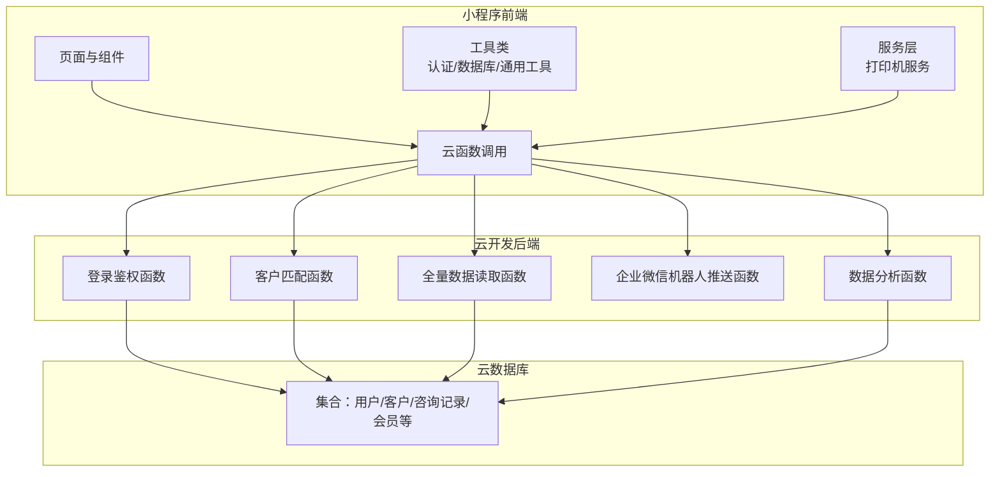
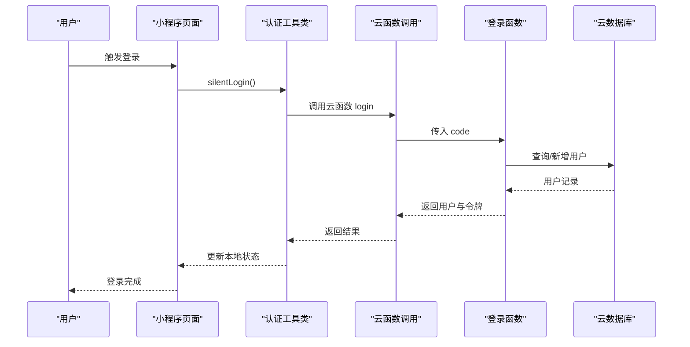
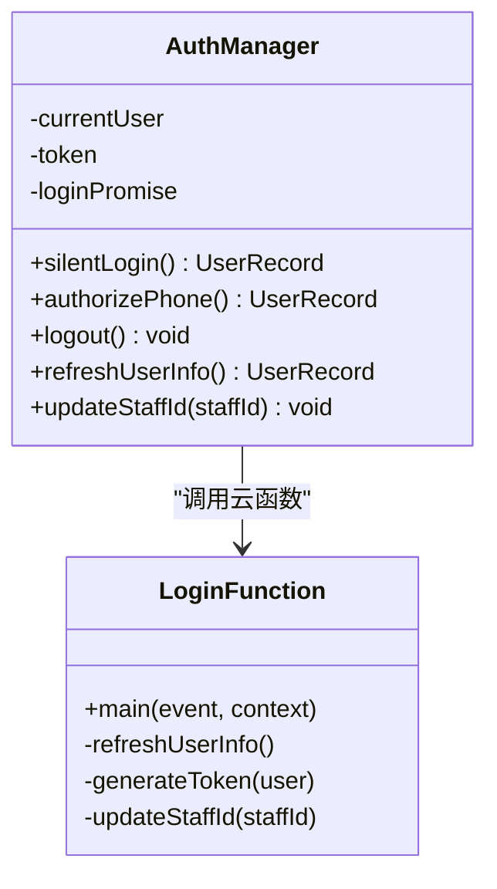
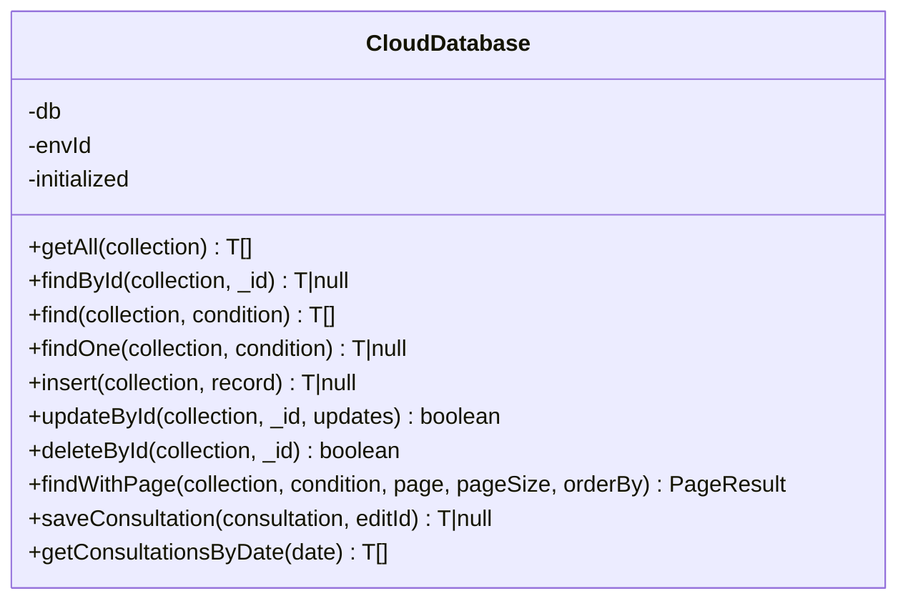
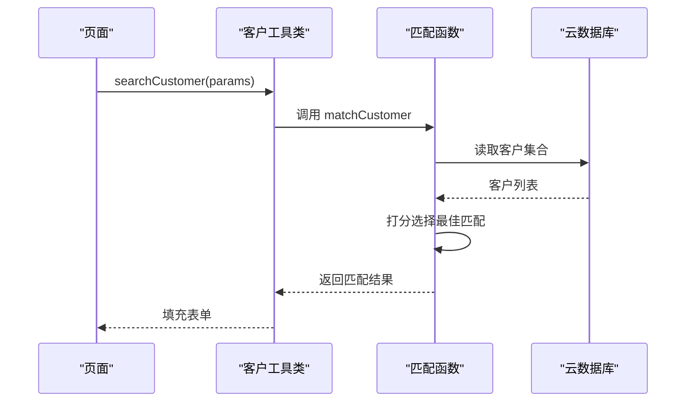
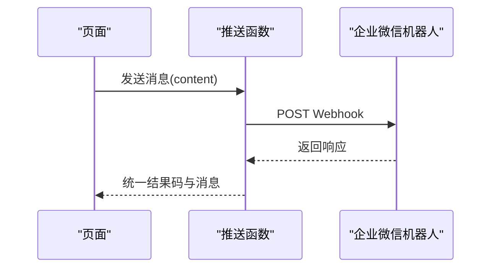
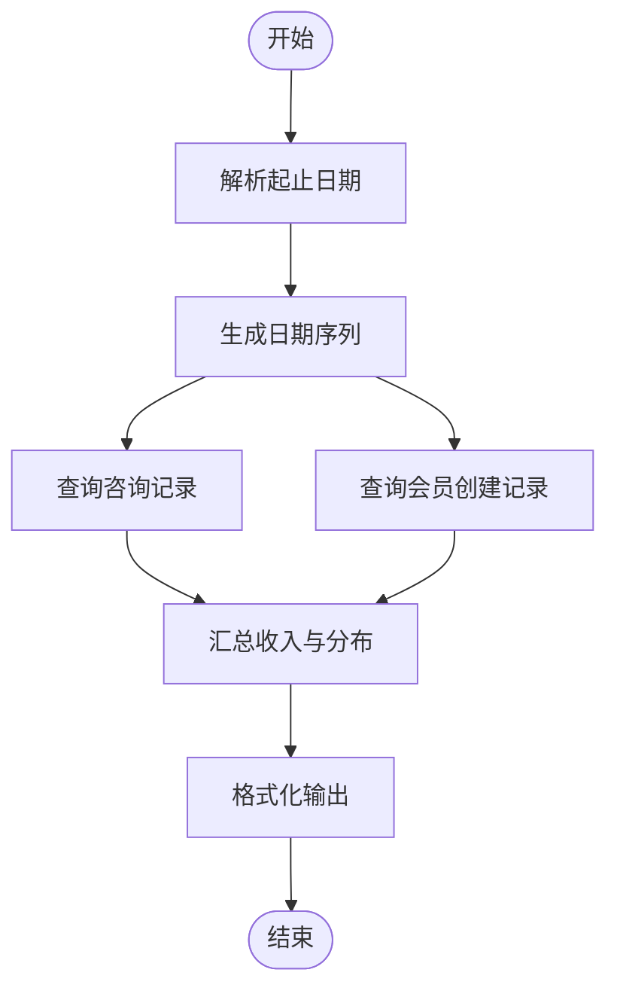
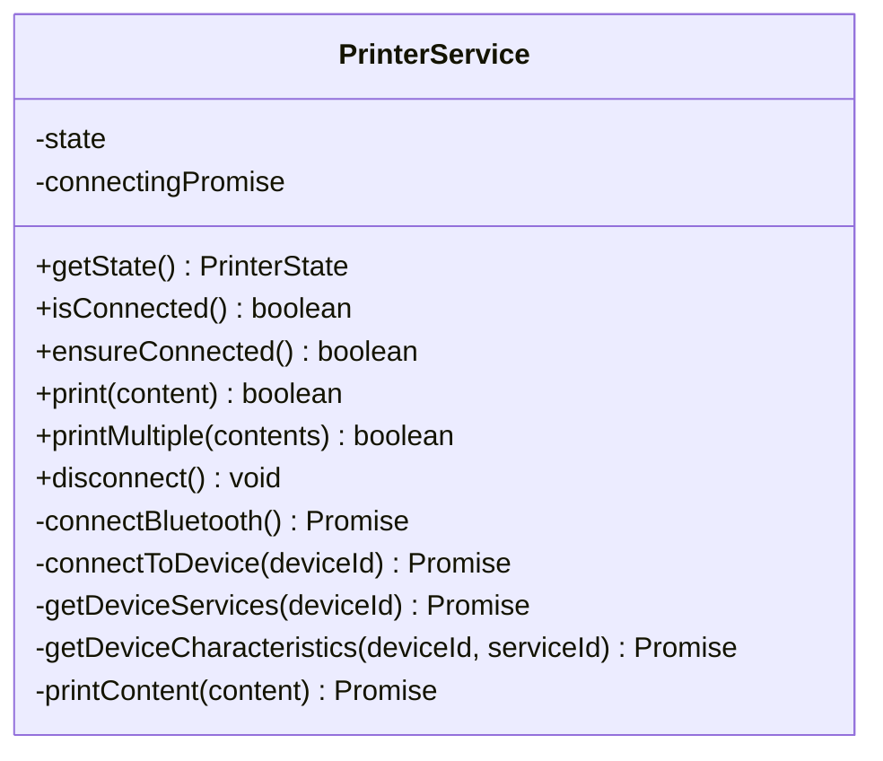
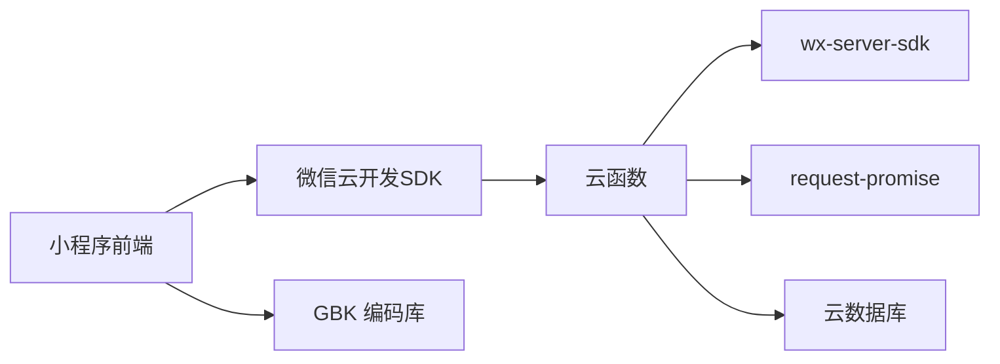

# 第三方集成开发

<cite>
**本文引用的文件**
- [cloudfunctions/getAnalytics/index.js](file://cloudfunctions/getAnalytics/index.js)
- [cloudfunctions/sendWechatMessage/index.js](file://cloudfunctions/sendWechatMessage/index.js)
- [cloudfunctions/login/index.js](file://cloudfunctions/login/index.js)
- [cloudfunctions/getAll/index.js](file://cloudfunctions/getAll/index.js)
- [cloudfunctions/matchCustomer/index.js](file://cloudfunctions/matchCustomer/index.js)
- [miniprogram/utils/cloud-db.ts](file://miniprogram/utils/cloud-db.ts)
- [miniprogram/utils/auth.ts](file://miniprogram/utils/auth.ts)
- [miniprogram/services/printer-service.ts](file://miniprogram/services/printer-service.ts)
- [miniprogram/pages/index/utils/customer-utils.ts](file://miniprogram/pages/index/utils/customer-utils.ts)
- [miniprogram/app.json](file://miniprogram/app.json)
- [miniprogram/config/index.ts](file://miniprogram/config/index.ts)
- [package.json](file://package.json)
- [typings/index.d.ts](file://typings/index.d.ts)
- [typings/types/wx/lib.wx.cloud.d.ts](file://typings/types/wx/lib.wx.cloud.d.ts)
</cite>

## 目录
1. [引言](#引言)
2. [项目结构](#项目结构)
3. [核心组件](#核心组件)
4. [架构总览](#架构总览)
5. [组件详解](#组件详解)
6. [依赖关系分析](#依赖关系分析)
7. [性能与可靠性](#性能与可靠性)
8. [测试与联调](#测试与联调)
9. [故障排查](#故障排查)
10. [结论](#结论)

## 引言
本指南面向需要在现有系统中进行第三方服务集成的开发者，围绕云开发服务、消息推送、数据分析与认证授权等主题，系统讲解架构模式与适配器模式的应用，给出API封装、错误处理与重试策略、安全防护要点，并提供测试与联调流程及端到端集成案例。

## 项目结构
该项目采用“小程序前端 + 云开发后端函数”的分层架构：
- 小程序前端：页面、组件、服务与工具类，负责UI交互、业务编排与云函数调用。
- 云开发后端函数：封装数据库访问、第三方消息通道、业务逻辑聚合。
- 类型定义：统一的数据模型与支付方式枚举，保障前后端契约一致。

图表来源
- [miniprogram/app.json](file://miniprogram/app.json#L1-L35)
- [cloudfunctions/login/index.js](file://cloudfunctions/login/index.js#L1-L180)
- [cloudfunctions/matchCustomer/index.js](file://cloudfunctions/matchCustomer/index.js#L1-L71)
- [cloudfunctions/getAll/index.js](file://cloudfunctions/getAll/index.js#L1-L59)
- [cloudfunctions/sendWechatMessage/index.js](file://cloudfunctions/sendWechatMessage/index.js#L1-L65)
- [cloudfunctions/getAnalytics/index.js](file://cloudfunctions/getAnalytics/index.js#L1-L172)
- [miniprogram/utils/cloud-db.ts](file://miniprogram/utils/cloud-db.ts#L1-L321)

章节来源
- [miniprogram/app.json](file://miniprogram/app.json#L1-L35)
- [package.json](file://package.json#L1-L28)

## 核心组件
- 认证与会话管理：通过云函数完成登录、令牌生成与用户信息刷新，前端以工具类统一封装。
- 数据访问适配器：统一的云数据库适配器，屏蔽云函数差异，提供查询、分页、插入、更新、删除等能力。
- 客户匹配与数据联动：前端调用匹配函数，后端基于规则打分返回最佳匹配。
- 消息推送：对接企业微信机器人Webhook，封装请求与错误处理。
- 数据分析：聚合多集合数据，计算收入趋势、消费分布与统计指标。
- 打印服务：蓝牙打印机连接与内容打印，适配器化封装连接状态与打印流程。

章节来源
- [miniprogram/utils/auth.ts](file://miniprogram/utils/auth.ts#L1-L245)
- [miniprogram/utils/cloud-db.ts](file://miniprogram/utils/cloud-db.ts#L1-L321)
- [cloudfunctions/login/index.js](file://cloudfunctions/login/index.js#L1-L180)
- [cloudfunctions/matchCustomer/index.js](file://cloudfunctions/matchCustomer/index.js#L1-L71)
- [cloudfunctions/sendWechatMessage/index.js](file://cloudfunctions/sendWechatMessage/index.js#L1-L65)
- [cloudfunctions/getAnalytics/index.js](file://cloudfunctions/getAnalytics/index.js#L1-L172)
- [miniprogram/services/printer-service.ts](file://miniprogram/services/printer-service.ts#L1-L298)

## 架构总览
整体采用“前端调用云函数 + 云函数访问数据库”的模式，部分外部能力通过HTTP调用实现（如企业微信机器人）。

图表来源
- [miniprogram/utils/auth.ts](file://miniprogram/utils/auth.ts#L78-L126)
- [cloudfunctions/login/index.js](file://cloudfunctions/login/index.js#L11-L90)
- [typings/types/wx/lib.wx.cloud.d.ts](file://typings/types/wx/lib.wx.cloud.d.ts#L1131-L1155)

## 组件详解

### 认证与授权（适配器模式）
- 设计要点
  - 前端使用单例工具类统一封装登录、静默登录、令牌存储、用户信息刷新与登出。
  - 云函数侧完成微信上下文解析、用户查询/新增、令牌生成与返回。
  - 通过云函数调用抽象底层SDK差异，前端仅感知统一接口。

图表来源
- [miniprogram/utils/auth.ts](file://miniprogram/utils/auth.ts#L4-L220)
- [cloudfunctions/login/index.js](file://cloudfunctions/login/index.js#L11-L179)

章节来源
- [miniprogram/utils/auth.ts](file://miniprogram/utils/auth.ts#L1-L245)
- [cloudfunctions/login/index.js](file://cloudfunctions/login/index.js#L1-L180)

### 数据访问适配器（适配器模式）
- 设计要点
  - 以类封装云数据库操作，提供统一方法：查询、分页、插入、更新、删除、按日期查询等。
  - 对云函数getAll进行封装，避免前端直连数据库。
  - 统一错误处理与返回空值策略，保证调用方健壮性。

图表来源
- [miniprogram/utils/cloud-db.ts](file://miniprogram/utils/cloud-db.ts#L12-L299)

章节来源
- [miniprogram/utils/cloud-db.ts](file://miniprogram/utils/cloud-db.ts#L1-L321)
- [cloudfunctions/getAll/index.js](file://cloudfunctions/getAll/index.js#L1-L59)

### 客户匹配与数据联动
- 设计要点
  - 前端根据输入构建匹配条件，调用云函数进行规则打分匹配。
  - 后端遍历客户集合，按手机号近似匹配、姓名包含、性别后缀等规则评分，返回最佳匹配。
  - 前端接收结果后，自动填充表单字段与车辆信息。

图表来源
- [miniprogram/pages/index/utils/customer-utils.ts](file://miniprogram/pages/index/utils/customer-utils.ts#L2-L49)
- [cloudfunctions/matchCustomer/index.js](file://cloudfunctions/matchCustomer/index.js#L9-L70)

章节来源
- [miniprogram/pages/index/utils/customer-utils.ts](file://miniprogram/pages/index/utils/customer-utils.ts#L1-L121)
- [cloudfunctions/matchCustomer/index.js](file://cloudfunctions/matchCustomer/index.js#L1-L71)

### 消息推送（企业微信机器人）
- 设计要点
  - 通过HTTP请求向企业微信机器人Webhook发送Markdown消息。
  - 统一返回码与错误处理，异常时返回错误信息。
  - 建议在生产环境将密钥配置到安全位置，避免硬编码。

图表来源
- [cloudfunctions/sendWechatMessage/index.js](file://cloudfunctions/sendWechatMessage/index.js#L10-L64)

章节来源
- [cloudfunctions/sendWechatMessage/index.js](file://cloudfunctions/sendWechatMessage/index.js#L1-L65)

### 数据分析（聚合统计）
- 设计要点
  - 聚合咨询记录与会员数据，计算日收入趋势、项目消费排行、平台来源分布、性别与车辆分布等。
  - 使用日期范围生成与过滤，确保统计口径一致。
  - 输出标准化结构，便于前端展示。

图表来源
- [cloudfunctions/getAnalytics/index.js](file://cloudfunctions/getAnalytics/index.js#L36-L171)

章节来源
- [cloudfunctions/getAnalytics/index.js](file://cloudfunctions/getAnalytics/index.js#L1-L172)

### 打印服务（蓝牙热敏）
- 设计要点
  - 封装蓝牙初始化、设备发现、连接、服务与特征查找、分片写入打印。
  - 提供连接状态检查与断开清理，打印内容按字节分块发送，避免超长导致失败。
  - 通过GBK编码适配中文字符。

图表来源
- [miniprogram/services/printer-service.ts](file://miniprogram/services/printer-service.ts#L10-L295)

章节来源
- [miniprogram/services/printer-service.ts](file://miniprogram/services/printer-service.ts#L1-L298)
- [package.json](file://package.json#L25-L27)

## 依赖关系分析
- 前端依赖
  - 微信小程序云开发SDK：用于云函数调用与数据库访问。
  - gbk.js：打印内容编码转换。
- 云函数依赖
  - wx-server-sdk：云开发后端运行时。
  - request-promise：HTTP请求（消息推送）。
- 类型与契约
  - 统一的支付方式枚举与结算结构，确保前后端一致性。

图表来源
- [package.json](file://package.json#L25-L27)
- [cloudfunctions/sendWechatMessage/index.js](file://cloudfunctions/sendWechatMessage/index.js#L1-L2)
- [cloudfunctions/login/index.js](file://cloudfunctions/login/index.js#L1-L5)
- [miniprogram/app.json](file://miniprogram/app.json#L23)

章节来源
- [package.json](file://package.json#L1-L28)
- [typings/index.d.ts](file://typings/index.d.ts#L1-L35)

## 性能与可靠性
- API封装与错误处理
  - 统一返回码与消息结构，便于前端一致化处理。
  - 对数据库查询、云函数调用与HTTP请求进行try/catch包裹，避免崩溃。
- 连接与并发
  - 认证工具类内部维护登录Promise，避免重复登录。
  - 打印服务对连接状态进行检查与去抖，防止重复连接。
- 可靠性建议
  - 为HTTP请求增加超时与重试策略（指数退避），对可重试错误进行幂等处理。
  - 对高频查询使用分页或索引优化，避免一次性拉取大量数据。
  - 在生产环境将敏感配置（如Webhook密钥）放入安全配置中心或环境变量。

## 测试与联调
- 单元测试
  - 对工具类方法（如日期格式化、时间计算、匹配评分）编写单元测试，覆盖边界条件。
  - 对云函数进行Mock数据库返回，验证分支逻辑与错误路径。
- 集成测试
  - 使用云开发控制台或CLI部署函数，构造真实事件参数，验证端到端流程。
  - 对消息推送与打印服务，准备真实设备与网络环境，验证连通性与稳定性。
- Mock与模拟
  - 使用云函数本地调试工具或第三方HTTP Mock服务，模拟外部依赖（如企业微信机器人）。
  - 对数据库操作使用内存或轻量级数据库镜像，减少对主库压力。
- 联调流程
  - 前后端约定接口与返回结构，先从前端发起调用，逐步替换为真实实现。
  - 关注错误码映射与日志采集，定位问题根因。

## 故障排查
- 登录失败
  - 检查云函数是否正确解析微信上下文与OPENID；确认数据库中是否存在该用户。
  - 前端静默登录Promise是否被重复触发。
- 数据查询为空
  - 检查集合名称与查询条件；确认getAll函数是否正确分页拉取。
- 消息推送失败
  - 校验Webhook地址与权限；查看返回码与错误信息；确认网络可达性。
- 打印失败
  - 检查蓝牙适配器初始化、设备发现与连接状态；确认服务与特征UUID正确；关注分片写入的回调与延迟。

章节来源
- [miniprogram/utils/auth.ts](file://miniprogram/utils/auth.ts#L78-L126)
- [cloudfunctions/getAll/index.js](file://cloudfunctions/getAll/index.js#L19-L57)
- [cloudfunctions/sendWechatMessage/index.js](file://cloudfunctions/sendWechatMessage/index.js#L58-L63)
- [miniprogram/services/printer-service.ts](file://miniprogram/services/printer-service.ts#L31-L90)

## 结论
通过适配器模式与统一的API封装，本项目实现了认证、数据访问、消息推送、数据分析与打印服务的模块化集成。建议在后续迭代中进一步完善错误重试、配置治理与可观测性建设，持续提升系统的稳定性与可维护性。