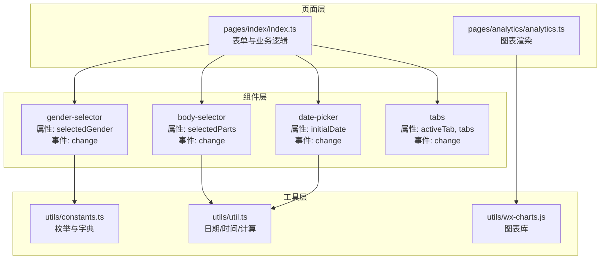
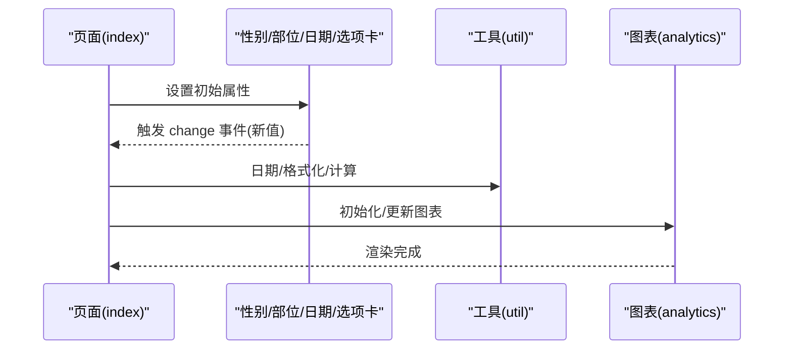
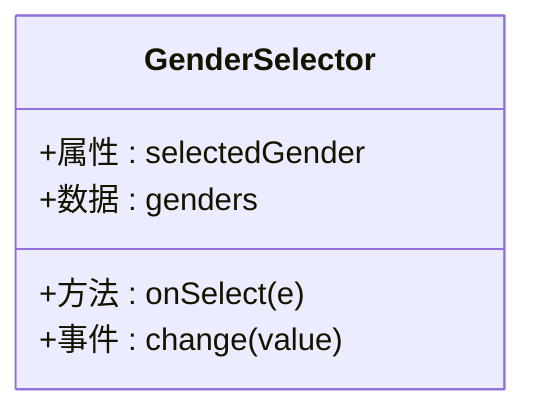
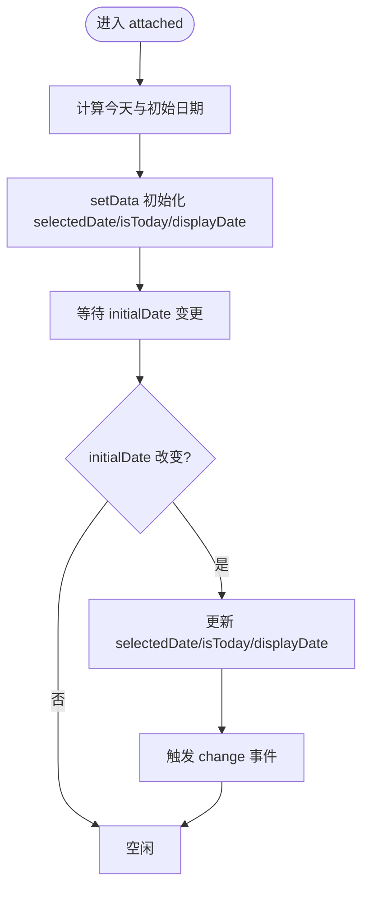
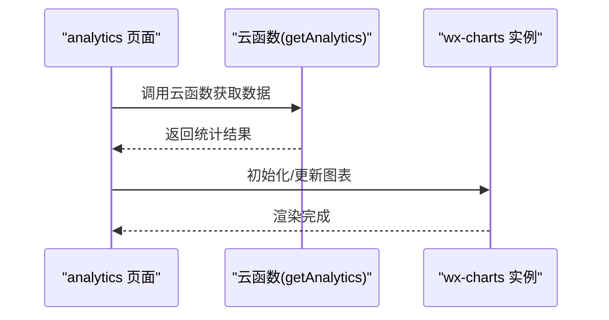
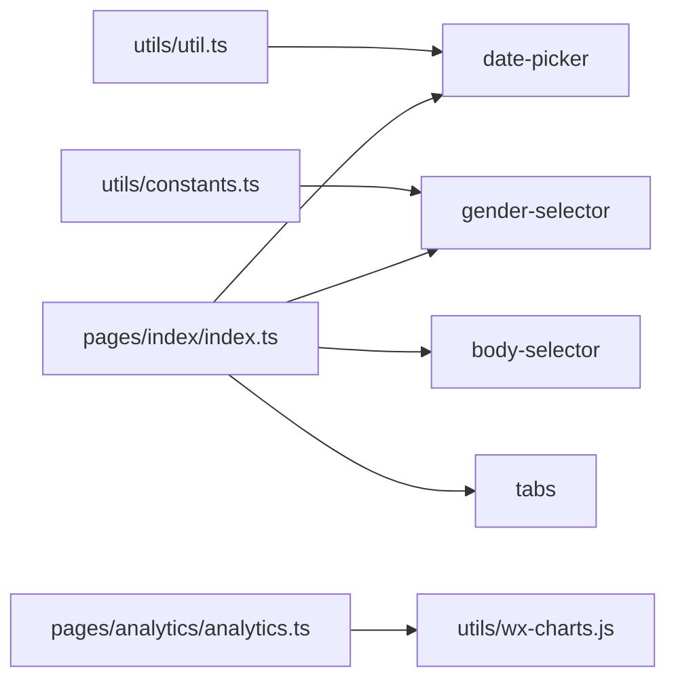

# 自定义组件开发

<cite>
**本文引用的文件**
- [miniprogram/components/body-selector/body-selector.json](file://miniprogram/components/body-selector/body-selector.json)
- [miniprogram/components/body-selector/body-selector.ts](file://miniprogram/components/body-selector/body-selector.ts)
- [miniprogram/components/date-picker/date-picker.json](file://miniprogram/components/date-picker/date-picker.json)
- [miniprogram/components/date-picker/date-picker.ts](file://miniprogram/components/date-picker/date-picker.ts)
- [miniprogram/components/tabs/tabs.json](file://miniprogram/components/tabs/tabs.json)
- [miniprogram/components/tabs/tabs.ts](file://miniprogram/components/tabs/tabs.ts)
- [miniprogram/components/gender-selector/gender-selector.json](file://miniprogram/components/gender-selector/gender-selector.json)
- [miniprogram/components/gender-selector/gender-selector.ts](file://miniprogram/components/gender-selector/gender-selector.ts)
- [miniprogram/utils/constants.ts](file://miniprogram/utils/constants.ts)
- [miniprogram/utils/util.ts](file://miniprogram/utils/util.ts)
- [miniprogram/pages/index/index.ts](file://miniprogram/pages/index/index.ts)
- [miniprogram/pages/analytics/analytics.ts](file://miniprogram/pages/analytics/analytics.ts)
- [miniprogram/utils/wx-charts.js](file://miniprogram/utils/wx-charts.js)
- [miniprogram/app.json](file://miniprogram/app.json)
</cite>

## 目录
1. [简介](#简介)
2. [项目结构](#项目结构)
3. [核心组件](#核心组件)
4. [架构总览](#架构总览)
5. [组件详解](#组件详解)
6. [依赖关系分析](#依赖关系分析)
7. [性能与可维护性](#性能与可维护性)
8. [调试与故障排查](#调试与故障排查)
9. [结论](#结论)
10. [附录：开发模板与规范](#附录开发模板与规范)

## 简介
本指南面向微信小程序开发者，围绕仓库中的自定义组件与页面实践，系统讲解组件设计原则、生命周期管理、数据绑定、事件与样式隔离、组件通信、复用性与性能优化、调试技巧，并提供从简单选择器到复杂图表组件的完整开发案例路径与最佳实践。

## 项目结构
- 组件集中于 miniprogram/components 下，按功能拆分，每个组件包含 JSON 配置、TS 实现、WXML 视图与 LESS 样式文件。
- 页面位于 miniprogram/pages，典型页面如首页与统计页，展示了组件的使用方式与数据流。
- 工具类位于 miniprogram/utils，包含常量、通用工具函数与第三方图表库封装。



**图表来源**
- [miniprogram/components/body-selector/body-selector.ts](file://miniprogram/components/body-selector/body-selector.ts#L1-L27)
- [miniprogram/components/gender-selector/gender-selector.ts](file://miniprogram/components/gender-selector/gender-selector.ts#L1-L22)
- [miniprogram/components/date-picker/date-picker.ts](file://miniprogram/components/date-picker/date-picker.ts#L1-L101)
- [miniprogram/components/tabs/tabs.ts](file://miniprogram/components/tabs/tabs.ts#L1-L20)
- [miniprogram/pages/index/index.ts](file://miniprogram/pages/index/index.ts#L1-L735)
- [miniprogram/pages/analytics/analytics.ts](file://miniprogram/pages/analytics/analytics.ts#L1-L408)
- [miniprogram/utils/constants.ts](file://miniprogram/utils/constants.ts#L1-L49)
- [miniprogram/utils/util.ts](file://miniprogram/utils/util.ts#L1-L150)
- [miniprogram/utils/wx-charts.js](file://miniprogram/utils/wx-charts.js#L1-L800)

**章节来源**
- [miniprogram/app.json](file://miniprogram/app.json#L1-L35)

## 核心组件
- 选择器类组件：性别选择、部位选择、平台/强度等，统一通过 change 事件向外传递值。
- 交互类组件：日期选择器，内置观察者与生命周期，负责日期格式化与边界控制。
- 导航/布局类：选项卡组件，负责切换状态并通过事件向上反馈。
- 图表组件：基于第三方 wx-charts 封装，页面在数据就绪后初始化并更新图表。

**章节来源**
- [miniprogram/components/gender-selector/gender-selector.ts](file://miniprogram/components/gender-selector/gender-selector.ts#L1-L22)
- [miniprogram/components/body-selector/body-selector.ts](file://miniprogram/components/body-selector/body-selector.ts#L1-L27)
- [miniprogram/components/date-picker/date-picker.ts](file://miniprogram/components/date-picker/date-picker.ts#L1-L101)
- [miniprogram/components/tabs/tabs.ts](file://miniprogram/components/tabs/tabs.ts#L1-L20)
- [miniprogram/pages/analytics/analytics.ts](file://miniprogram/pages/analytics/analytics.ts#L1-L408)

## 架构总览
- 组件框架：项目采用 Glass Easel 组件框架，页面通过组件化组织视图与交互。
- 数据流向：页面持有业务状态，子组件通过属性接收数据，通过事件向上传递变更；图表组件在页面完成数据聚合后进行渲染。
- 复用策略：将通用常量与工具函数抽离至 utils，减少重复逻辑。



**图表来源**
- [miniprogram/pages/index/index.ts](file://miniprogram/pages/index/index.ts#L1-L735)
- [miniprogram/components/date-picker/date-picker.ts](file://miniprogram/components/date-picker/date-picker.ts#L1-L101)
- [miniprogram/utils/util.ts](file://miniprogram/utils/util.ts#L1-L150)
- [miniprogram/pages/analytics/analytics.ts](file://miniprogram/pages/analytics/analytics.ts#L1-L408)
- [miniprogram/utils/wx-charts.js](file://miniprogram/utils/wx-charts.js#L1-L800)

## 组件详解

### 性别选择器（gender-selector）
- 设计要点
  - 属性：selectedGender 接收当前选中值。
  - 数据：从常量模块读取候选集，避免硬编码。
  - 事件：触发 change，携带选中值。
- 最佳实践
  - 保持只读数据源，组件内部不直接修改外部状态。
  - 事件命名语义化，便于父组件订阅。



**图表来源**
- [miniprogram/components/gender-selector/gender-selector.ts](file://miniprogram/components/gender-selector/gender-selector.ts#L1-L22)
- [miniprogram/utils/constants.ts](file://miniprogram/utils/constants.ts#L1-L49)

**章节来源**
- [miniprogram/components/gender-selector/gender-selector.json](file://miniprogram/components/gender-selector/gender-selector.json#L1-L4)
- [miniprogram/components/gender-selector/gender-selector.ts](file://miniprogram/components/gender-selector/gender-selector.ts#L1-L22)
- [miniprogram/utils/constants.ts](file://miniprogram/utils/constants.ts#L1-L49)

### 身体部位选择器（body-selector）
- 设计要点
  - 属性：selectedParts 接收已选部位映射。
  - 数据：内置部位列表，点击后通过 change 事件上报单个部位。
- 最佳实践
  - 父组件聚合多选结果，组件内仅负责单击反馈。
  - 使用 dataset 传递上下文，避免过多 props。

```mermaid
classDiagram
class BodySelector {
+属性 : selectedParts
+数据 : parts[]
+方法 : onPartTap(e)
+事件 : change({part})
}
```

**图表来源**
- [miniprogram/components/body-selector/body-selector.ts](file://miniprogram/components/body-selector/body-selector.ts#L1-L27)

**章节来源**
- [miniprogram/components/body-selector/body-selector.json](file://miniprogram/components/body-selector/body-selector.json#L1-L4)
- [miniprogram/components/body-selector/body-selector.ts](file://miniprogram/components/body-selector/body-selector.ts#L1-L27)

### 日期选择器（date-picker）
- 生命周期与观察者
  - attached：根据 initialDate 或当前日期初始化 selectedDate、isToday、displayDate。
  - observers：监听 initialDate 变更，同步更新显示。
- 交互与事件
  - 上一日/今日/下一日/直接选择，均更新 selectedDate 并触发 change。
- 最佳实践
  - 使用 observers 管理“外部属性驱动内部状态”的一致性。
  - 边界日期通过工具函数安全计算，避免越界。



**图表来源**
- [miniprogram/components/date-picker/date-picker.ts](file://miniprogram/components/date-picker/date-picker.ts#L23-L45)

**章节来源**
- [miniprogram/components/date-picker/date-picker.json](file://miniprogram/components/date-picker/date-picker.json#L1-L5)
- [miniprogram/components/date-picker/date-picker.ts](file://miniprogram/components/date-picker/date-picker.ts#L1-L101)
- [miniprogram/utils/util.ts](file://miniprogram/utils/util.ts#L119-L149)

### 选项卡组件（tabs）
- 设计要点
  - 属性：activeTab、tabs 列表。
  - 事件：change，携带当前 tab 值。
- 最佳实践
  - 选项卡组件应尽量无状态或少状态，由父组件管理激活态。

```mermaid
classDiagram
class Tabs {
+属性 : activeTab, tabs
+方法 : onTabChange(e)
+事件 : change({value})
}
```

**图表来源**
- [miniprogram/components/tabs/tabs.ts](file://miniprogram/components/tabs/tabs.ts#L1-L20)

**章节来源**
- [miniprogram/components/tabs/tabs.json](file://miniprogram/components/tabs/tabs.json#L1-L5)
- [miniprogram/components/tabs/tabs.ts](file://miniprogram/components/tabs/tabs.ts#L1-L20)

### 图表组件（analytics 页面 + wx-charts）
- 设计要点
  - 页面在数据加载完成后初始化图表实例，按需更新。
  - 提供折线/柱状/饼图绘制方法，统一尺寸与样式。
- 最佳实践
  - 将图表初始化与更新分离，避免重复创建实例。
  - 使用窗口宽度动态适配，保证不同机型显示一致。



**图表来源**
- [miniprogram/pages/analytics/analytics.ts](file://miniprogram/pages/analytics/analytics.ts#L1-L408)
- [miniprogram/utils/wx-charts.js](file://miniprogram/utils/wx-charts.js#L1-L800)

**章节来源**
- [miniprogram/pages/analytics/analytics.ts](file://miniprogram/pages/analytics/analytics.ts#L1-L408)
- [miniprogram/utils/wx-charts.js](file://miniprogram/utils/wx-charts.js#L1-L800)

## 依赖关系分析
- 组件对工具的依赖
  - 日期选择器依赖日期工具函数进行格式化与边界计算。
  - 性别选择器依赖常量模块提供候选集。
- 页面对组件的依赖
  - 首页页面通过多个选择器收集用户输入，再进行校验与提交。
  - 统计页通过云函数获取数据，再交由图表组件渲染。
- 组件间通信
  - 父子通信：通过属性注入数据，通过 change 事件回传。
  - 兄弟/跨层级：通过页面作为中介，或在页面层合并状态后下发。



**图表来源**
- [miniprogram/utils/util.ts](file://miniprogram/utils/util.ts#L1-L150)
- [miniprogram/utils/constants.ts](file://miniprogram/utils/constants.ts#L1-L49)
- [miniprogram/pages/index/index.ts](file://miniprogram/pages/index/index.ts#L1-L735)
- [miniprogram/pages/analytics/analytics.ts](file://miniprogram/pages/analytics/analytics.ts#L1-L408)
- [miniprogram/utils/wx-charts.js](file://miniprogram/utils/wx-charts.js#L1-L800)

**章节来源**
- [miniprogram/pages/index/index.ts](file://miniprogram/pages/index/index.ts#L1-L735)
- [miniprogram/pages/analytics/analytics.ts](file://miniprogram/pages/analytics/analytics.ts#L1-L408)

## 性能与可维护性
- 性能优化
  - 事件节流/防抖：在高频交互场景（如滚动、输入）中避免频繁 setData。
  - 按需渲染：图表组件仅在数据就绪后初始化，避免空渲染。
  - 观察者粒度：合理拆分 observers，避免一次变更触发过多计算。
- 可维护性
  - 组件职责单一：选择器仅负责选择，不参与业务判断。
  - 命名规范：属性/事件/方法命名清晰，便于团队协作。
  - 类型约束：在 TS 中明确属性类型与事件参数结构，降低耦合。

[本节为通用指导，无需列出具体文件来源]

## 调试与故障排查
- 常见问题
  - 日期越界：确保通过工具函数计算前后日期，避免直接字符串拼接。
  - 事件未触发：检查组件是否正确触发 change，父组件是否绑定对应事件。
  - 图表不显示：确认数据结构与 canvas 尺寸，确保在数据就绪后再初始化。
- 调试建议
  - 使用页面日志输出关键状态变化。
  - 在组件内部打印关键路径参数，定位事件传递链路。
  - 对图表组件增加“空数据保护”，避免异常渲染。

**章节来源**
- [miniprogram/components/date-picker/date-picker.ts](file://miniprogram/components/date-picker/date-picker.ts#L1-L101)
- [miniprogram/pages/analytics/analytics.ts](file://miniprogram/pages/analytics/analytics.ts#L1-L408)

## 结论
本项目在组件层面体现了“低耦合、高内聚”的设计思想：选择器类组件专注交互与事件，页面承担状态管理与业务编排，工具模块提供稳定的基础能力。通过合理的生命周期与观察者机制、清晰的事件契约以及图表组件的按需渲染，整体具备良好的可扩展性与可维护性。

[本节为总结，无需列出具体文件来源]

## 附录：开发模板与规范

### 组件开发模板（步骤化）
- 配置文件
  - 设置 component: true，声明 usingComponents。
- TypeScript
  - 定义 properties（含类型与默认值）、data、lifetimes、observers、methods。
  - 在 methods 中统一通过 triggerEvent 发出 change 等语义化事件。
- 视图与样式
  - 视图中使用 {{}} 绑定 data 与 properties。
  - 使用 less 进行样式隔离与主题化。
- 页面使用
  - 在页面 data 中准备初始状态，在事件回调中更新并触发子组件更新。
- 测试与验证
  - 单元测试：针对事件回调与数据转换。
  - 集成测试：页面级端到端流程，覆盖关键分支。

**章节来源**
- [miniprogram/components/body-selector/body-selector.json](file://miniprogram/components/body-selector/body-selector.json#L1-L4)
- [miniprogram/components/body-selector/body-selector.ts](file://miniprogram/components/body-selector/body-selector.ts#L1-L27)
- [miniprogram/components/date-picker/date-picker.json](file://miniprogram/components/date-picker/date-picker.json#L1-L5)
- [miniprogram/components/date-picker/date-picker.ts](file://miniprogram/components/date-picker/date-picker.ts#L1-L101)
- [miniprogram/components/tabs/tabs.json](file://miniprogram/components/tabs/tabs.json#L1-L5)
- [miniprogram/components/tabs/tabs.ts](file://miniprogram/components/tabs/tabs.ts#L1-L20)
- [miniprogram/components/gender-selector/gender-selector.json](file://miniprogram/components/gender-selector/gender-selector.json#L1-L4)
- [miniprogram/components/gender-selector/gender-selector.ts](file://miniprogram/components/gender-selector/gender-selector.ts#L1-L22)

### API 设计规范
- 属性命名
  - 使用语义化驼峰命名，如 initialDate、activeTab。
  - 明确类型与默认值，便于 TS 推断。
- 事件命名
  - change、confirm、tap 等动词开头，携带必要上下文。
- 数据结构
  - 选择器类组件统一返回 { value } 或 { part }，便于父组件解构赋值。
- 生命周期
  - 优先使用 attached 初始化，observer 监听外部属性变化。

**章节来源**
- [miniprogram/components/date-picker/date-picker.ts](file://miniprogram/components/date-picker/date-picker.ts#L1-L101)
- [miniprogram/components/tabs/tabs.ts](file://miniprogram/components/tabs/tabs.ts#L1-L20)
- [miniprogram/components/body-selector/body-selector.ts](file://miniprogram/components/body-selector/body-selector.ts#L1-L27)
- [miniprogram/components/gender-selector/gender-selector.ts](file://miniprogram/components/gender-selector/gender-selector.ts#L1-L22)

### 组件通信模式
- 父子通信
  - 父传子：properties 注入初始值。
  - 子传父：triggerEvent 回传变更。
- 兄弟/跨层级
  - 通过页面作为中介，集中管理共享状态，再下发给子组件。
- 事件处理最佳实践
  - 在组件内统一收集数据，对外暴露最小化的事件负载。
  - 避免在组件内直接操作全局状态，保持可测试性。

**章节来源**
- [miniprogram/pages/index/index.ts](file://miniprogram/pages/index/index.ts#L1-L735)

### 集成测试方法
- 页面级端到端
  - 模拟用户操作：选择性别、日期、部位、选项卡切换，校验最终数据结构。
- 图表测试
  - 准备固定数据集，验证图表初始化与更新逻辑。
- 云函数联动
  - 使用 mock 云函数返回固定数据，验证页面渲染与错误提示。

**章节来源**
- [miniprogram/pages/analytics/analytics.ts](file://miniprogram/pages/analytics/analytics.ts#L1-L408)