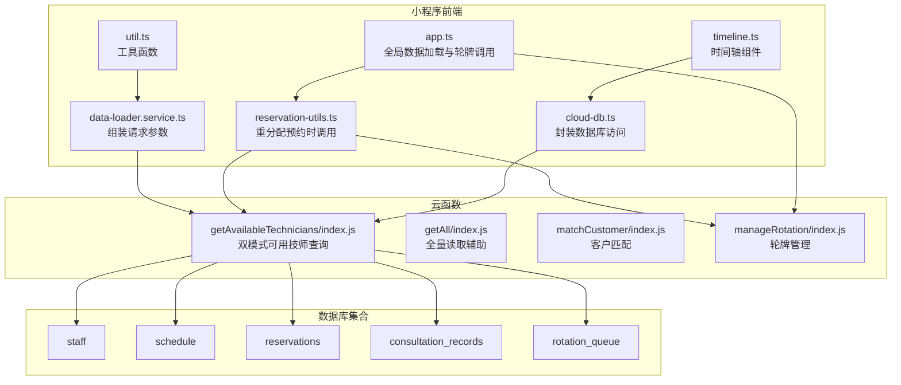
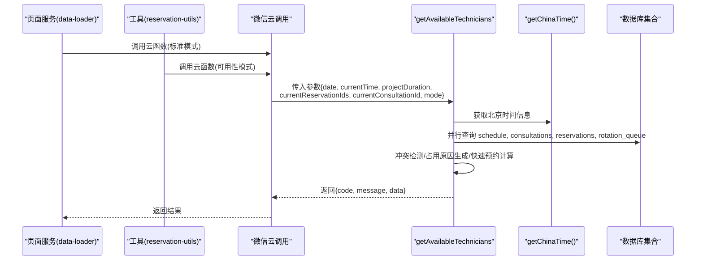
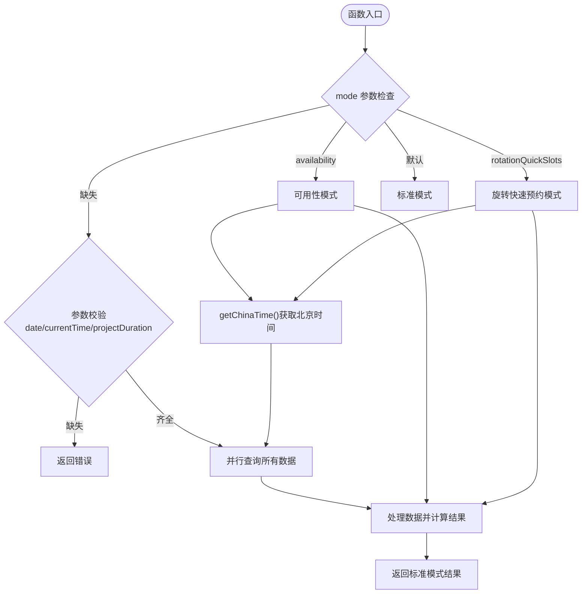
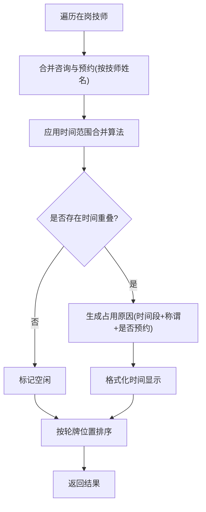
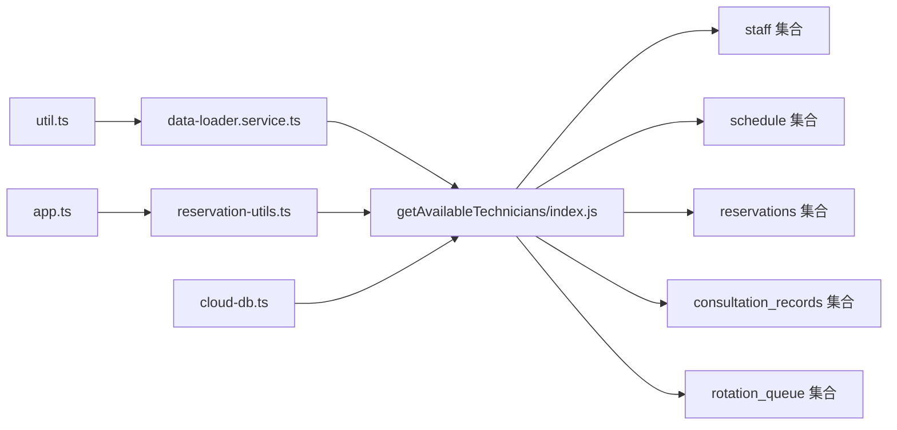

# 可用技师查询

<cite>
**本文档引用的文件**
- [cloudfunctions/getAvailableTechnicians/index.js](file://cloudfunctions/getAvailableTechnicians/index.js)
- [cloudfunctions/getAvailableTechnicians/package.json](file://cloudfunctions/getAvailableTechnicians/package.json)
- [cloudfunctions/getAll/index.js](file://cloudfunctions/getAll/index.js)
- [cloudfunctions/matchCustomer/index.js](file://cloudfunctions/matchCustomer/index.js)
- [cloudfunctions/manageRotation/index.js](file://cloudfunctions/manageRotation/index.js)
- [miniprogram/pages/index/services/data-loader.service.ts](file://miniprogram/pages/index/services/data-loader.service.ts)
- [miniprogram/pages/index/utils/reservation-utils.ts](file://miniprogram/pages/index/utils/reservation-utils.ts)
- [miniprogram/utils/cloud-db.ts](file://miniprogram/utils/cloud-db.ts)
- [miniprogram/utils/util.ts](file://miniprogram/utils/util.ts)
- [miniprogram/app.ts](file://miniprogram/app.ts)
- [miniprogram/components/timeline/timeline.ts](file://miniprogram/components/timeline/timeline.ts)
- [typings/index.d.ts](file://typings/index.d.ts)
- [typings/types/wx/index.d.ts](file://typings/types/wx/index.d.ts)
</cite>

## 更新摘要
**变更内容**
- 完全重写getAvailableTechnicians云函数，新增双模式架构
- 新增rotationQuickSlots模式，支持旋转快速预约能力
- 新增getChinaTime()时间管理函数，统一北京时间处理
- 新增常量映射系统（SHIFT_START_TIME、SHIFT_END_TIME）
- 新增calculateAvailableSlotsText()和buildQuickReservationSlots()函数
- 增强并行查询优化，提升性能表现
- 新增computeStaffAvailabilityStatus()状态计算函数

## 目录
1. [简介](#简介)
2. [项目结构](#项目结构)
3. [核心组件](#核心组件)
4. [架构总览](#架构总览)
5. [详细组件分析](#详细组件分析)
6. [依赖关系分析](#依赖关系分析)
7. [性能考虑](#性能考虑)
8. [故障排查指南](#故障排查指南)
9. [结论](#结论)
10. [附录](#附录)

## 简介
本文件为"可用技师查询"云函数的全面技术文档，围绕完全重构的getAvailableTechnicians云函数展开，详细解释其双模式架构与实现要点，包括：
- **双模式架构**：传统模式与rotationQuickSlots模式的协同工作
- **时间管理**：统一的getChinaTime()函数处理UTC+8时区
- **常量映射系统**：SHIFT_START_TIME和SHIFT_END_TIME的班次时间管理
- **快速预约能力**：calculateAvailableSlotsText()和buildQuickReservationSlots()函数
- **并行查询优化**：Promise.all()提升数据获取性能
- **状态计算**：computeStaffAvailabilityStatus()统一可用性判断
- **查询参数设计**：日期、当前时间、项目时长、上下文过滤的处理
- **API接口规范**：请求格式、响应结构、错误码定义
- **最佳实践与常见问题解决方案**

## 项目结构
该功能涉及前端页面服务、工具类与云函数协同工作，支持双模式查询：
- 前端页面服务负责组装请求参数并调用云函数
- 云函数支持三种模式：标准模式、可用性模式、旋转快速预约模式
- 类型定义文件提供数据结构约束

**图表来源**
- [cloudfunctions/getAvailableTechnicians/index.js](file://cloudfunctions/getAvailableTechnicians/index.js#L26-L164)
- [miniprogram/pages/index/services/data-loader.service.ts](file://miniprogram/pages/index/services/data-loader.service.ts#L33-L42)
- [miniprogram/pages/index/utils/reservation-utils.ts](file://miniprogram/pages/index/utils/reservation-utils.ts#L99-L117)
- [miniprogram/utils/cloud-db.ts](file://miniprogram/utils/cloud-db.ts#L93-L123)
- [miniprogram/utils/util.ts](file://miniprogram/utils/util.ts#L13-L17)
- [miniprogram/app.ts](file://miniprogram/app.ts#L110-L128)
- [cloudfunctions/manageRotation/index.js](file://cloudfunctions/manageRotation/index.js#L14-L36)

**章节来源**
- [cloudfunctions/getAvailableTechnicians/index.js](file://cloudfunctions/getAvailableTechnicians/index.js#L1-L697)
- [miniprogram/pages/index/services/data-loader.service.ts](file://miniprogram/pages/index/services/data-loader.service.ts#L13-L65)

## 核心组件
- **getAvailableTechnicians 云函数**：完全重构的双模式查询入口
  - **标准模式**：传统冲突检测与占用原因生成
  - **可用性模式**：实时状态计算与剩余可服务时间
  - **rotationQuickSlots模式**：旋转快速预约能力
- **时间管理模块**：getChinaTime()统一处理UTC+8时区
- **常量映射系统**：SHIFT_START_TIME和SHIFT_END_TIME班次时间常量
- **快速预约函数**：calculateAvailableSlotsText()和buildQuickReservationSlots()
- **状态计算函数**：computeStaffAvailabilityStatus()统一可用性判断
- **前端调用方**：
  - data-loader.service.ts：标准模式调用
  - reservation-utils.ts：重分配预约时调用
- **数据访问层**：cloud-db.ts封装数据库操作
- **工具函数**：util.ts提供时间解析与格式化

**章节来源**
- [cloudfunctions/getAvailableTechnicians/index.js](file://cloudfunctions/getAvailableTechnicians/index.js#L26-L164)
- [cloudfunctions/getAvailableTechnicians/index.js](file://cloudfunctions/getAvailableTechnicians/index.js#L206-L221)
- [cloudfunctions/getAvailableTechnicians/index.js](file://cloudfunctions/getAvailableTechnicians/index.js#L9-L24)
- [cloudfunctions/getAvailableTechnicians/index.js](file://cloudfunctions/getAvailableTechnicians/index.js#L233-L292)
- [cloudfunctions/getAvailableTechnicians/index.js](file://cloudfunctions/getAvailableTechnicians/index.js#L303-L452)
- [cloudfunctions/getAvailableTechnicians/index.js](file://cloudfunctions/getAvailableTechnicians/index.js#L577-L619)
- [miniprogram/pages/index/services/data-loader.service.ts](file://miniprogram/pages/index/services/data-loader.service.ts#L33-L42)
- [miniprogram/pages/index/utils/reservation-utils.ts](file://miniprogram/pages/index/utils/reservation-utils.ts#L99-L117)
- [miniprogram/utils/cloud-db.ts](file://miniprogram/utils/cloud-db.ts#L93-L123)
- [miniprogram/utils/util.ts](file://miniprogram/utils/util.ts#L13-L17)

## 架构总览
下图展示双模式架构的完整调用链路，包括传统模式、可用性模式和旋转快速预约模式。

**图表来源**
- [cloudfunctions/getAvailableTechnicians/index.js](file://cloudfunctions/getAvailableTechnicians/index.js#L26-L164)
- [cloudfunctions/getAvailableTechnicians/index.js](file://cloudfunctions/getAvailableTechnicians/index.js#L458-L567)
- [cloudfunctions/getAvailableTechnicians/index.js](file://cloudfunctions/getAvailableTechnicians/index.js#L621-L697)
- [cloudfunctions/getAvailableTechnicians/index.js](file://cloudfunctions/getAvailableTechnicians/index.js#L206-L221)

## 详细组件分析

### getAvailableTechnicians 云函数重构
**完全重写**：支持三种查询模式的双模式架构

- **入口与模式路由**
  - `mode='availability'`：可用性模式，返回实时状态
  - `mode='rotationQuickSlots'`：旋转快速预约模式，返回轮牌和快速预约信息
  - 默认：标准模式，传统冲突检测
- **并行查询优化**
  - 使用Promise.all()并行获取所有必需数据
  - 减少数据库查询次数，提升整体性能
- **参数校验增强**
  - 新增mode参数验证
  - 标准模式下强制参数校验

**图表来源**
- [cloudfunctions/getAvailableTechnicians/index.js](file://cloudfunctions/getAvailableTechnicians/index.js#L26-L164)
- [cloudfunctions/getAvailableTechnicians/index.js](file://cloudfunctions/getAvailableTechnicians/index.js#L458-L567)
- [cloudfunctions/getAvailableTechnicians/index.js](file://cloudfunctions/getAvailableTechnicians/index.js#L621-L697)

**章节来源**
- [cloudfunctions/getAvailableTechnicians/index.js](file://cloudfunctions/getAvailableTechnicians/index.js#L26-L164)
- [cloudfunctions/getAvailableTechnicians/index.js](file://cloudfunctions/getAvailableTechnicians/index.js#L458-L567)
- [cloudfunctions/getAvailableTechnicians/index.js](file://cloudfunctions/getAvailableTechnicians/index.js#L621-L697)

### getChinaTime()时间管理函数
**新增功能**：统一的北京时间处理机制

- **时区处理**
  - 使用手动偏移而非服务器本地时区
  - 避免UTC+8二次叠加导致的时间错误
- **返回信息**
  - `todayStr`：当前日期字符串
  - `currentHour`：当前小时
  - `currentMinute`：当前分钟
  - `currentMins`：当前时间（分钟数）
- **应用场景**
  - 标准模式：时间范围转换和提议结束时间计算
  - 可用性模式：实时状态判断
  - 快速预约模式：今日搜索起点计算

**章节来源**
- [cloudfunctions/getAvailableTechnicians/index.js](file://cloudfunctions/getAvailableTechnicians/index.js#L206-L221)

### 常量映射系统
**新增功能**：班次时间常量管理系统

- **SHIFT_START_TIME常量**
  - `morning`: 12:00
  - `evening`: 13:00  
  - `overtime`: 00:00
  - `off`: 空字符串
  - `leave`: 空字符串
- **SHIFT_END_TIME常量**
  - `morning`: 22:00
  - `evening`: 23:00
  - `overtime`: 23:59
  - `off`: 空字符串
  - `leave`: 空字符串
- **应用场景**
  - calculateAvailableSlotsText()：计算可用时段
  - buildQuickReservationSlots()：构建快速预约时段
  - computeStaffAvailabilityStatus()：状态计算

**章节来源**
- [cloudfunctions/getAvailableTechnicians/index.js](file://cloudfunctions/getAvailableTechnicians/index.js#L9-L24)
- [cloudfunctions/getAvailableTechnicians/index.js](file://cloudfunctions/getAvailableTechnicians/index.js#L233-L292)
- [cloudfunctions/getAvailableTechnicians/index.js](file://cloudfunctions/getAvailableTechnicians/index.js#L303-L452)
- [cloudfunctions/getAvailableTechnicians/index.js](file://cloudfunctions/getAvailableTechnicians/index.js#L577-L619)

### calculateAvailableSlotsText()函数
**新增功能**：计算单个技师可用时段文本

- **输入参数**
  - `staffConsultations`：技师咨询单记录
  - `staffReservations`：技师预约记录
  - `shift`：班次类型
  - `isToday`：是否为今天
  - `currentHour`：当前小时
  - `currentMinute`：当前分钟
- **计算逻辑**
  - 获取班次开始和结束时间
  - 处理今日下班时间判断
  - 合并咨询单与预约，按开始时间排序
  - 计算搜索起始时间（向上取整到下一个半小时）
  - 生成可用时段文本
- **输出格式**
  - 无占用：`HH:mm-HH:mm (X分)`
  - 有占用：多个时段组合，如`HH:mm-HH:mm (X分), HH:mm-HH:mm (Y分)`
  - 已满：`已满`

**章节来源**
- [cloudfunctions/getAvailableTechnicians/index.js](file://cloudfunctions/getAvailableTechnicians/index.js#L233-L292)

### buildQuickReservationSlots()函数
**新增功能**：构建快速预约时段

- **输入参数**
  - `rotationItems`：轮牌技师列表
  - `allConsultations`：当日所有咨询单
  - `allReservations`：当日所有活跃预约
  - `isToday`：是否为今天
  - `currentMins`：今日当前分钟数
- **计算逻辑**
  - 按性别分组技师（male/female）
  - 为每位技师构建合并占用时段
  - 计算单人可用时段（>=60分钟）
  - 计算双人重叠可用时段
  - 返回oneMale、oneFemale、twoMale、twoFemale四组数据
- **输出格式**
  - 每个分组返回数组，包含时间文本和技师姓名列表

**章节来源**
- [cloudfunctions/getAvailableTechnicians/index.js](file://cloudfunctions/getAvailableTechnicians/index.js#L303-L452)

### getRotationQuickSlots()函数
**新增功能**：旋转快速预约模式的核心实现

- **并行数据获取**
  - 使用Promise.all()并行查询schedule、consultations、reservations、rotation_queue
  - 减少查询延迟，提升响应速度
- **轮牌列表构建**
  - 过滤在岗技师（非leave/off）
  - 获取员工基本信息
  - 计算今日服务时长、可用时段文本、预约数量
- **快速预约计算**
  - 调用buildQuickReservationSlots()生成四组可用时段
  - 支持单人和双人预约需求
- **响应结构**
  - `rotationItems`：轮牌技师列表及状态信息
  - `quickReservationSlots`：快速预约时段数据

**章节来源**
- [cloudfunctions/getAvailableTechnicians/index.js](file://cloudfunctions/getAvailableTechnicians/index.js#L458-L567)

### computeStaffAvailabilityStatus()函数
**新增功能**：统一的技师可用性状态计算

- **输入参数**
  - `staffConsultations`：技师咨询单记录
  - `staffReservations`：技师预约记录
  - `shift`：班次类型
  - `currentMinutes`：当前时间（分钟数）
- **状态判断逻辑**
  - 未排班：返回off_duty状态
  - 未到上班：返回off_duty状态
  - 已下班：返回off_duty状态
  - 正在服务：返回busy状态，计算剩余可服务分钟
  - 空闲等待：返回available状态，计算距离下次开始的等待时间
- **输出信息**
  - `status`：技师状态
  - `latestAppointment`：最近预约结束时间或提示
  - `availableMinutes`：可用分钟数

**章节来源**
- [cloudfunctions/getAvailableTechnicians/index.js](file://cloudfunctions/getAvailableTechnicians/index.js#L577-L619)

### getTechnicianAvailability()函数
**重构功能**：可用性模式的完整实现

- **并行查询优化**
  - 与getRotationQuickSlots()保持一致的查询策略
  - Promise.all()并行获取所有必需数据
- **状态计算**
  - 调用computeStaffAvailabilityStatus()计算每个技师状态
  - 结合轮牌队列位置进行排序
- **响应结构**
  - 标准可用性模式响应格式
  - 包含状态、剩余时间、最新预约等信息

**章节来源**
- [cloudfunctions/getAvailableTechnicians/index.js](file://cloudfunctions/getAvailableTechnicians/index.js#L621-L697)

### 查询参数设计与处理
- **请求参数**
  - `date`: 查询日期（YYYY-MM-DD）
  - `currentTime`: 当前时间（HH:mm）
  - `projectDuration`: 项目时长（分钟）
  - `currentReservationIds`: 当前正在编辑的预约ID数组（可选）
  - `currentConsultationId`: 当前正在编辑的咨询ID（可选）
  - `mode`: 查询模式（'availability' | 'rotationQuickSlots' | ''）
- **参数处理**
  - 时间统一转换为分钟数进行比较
  - 项目时长 + 10 分钟准备时间作为提议结束时间
  - 过滤当前上下文中的预约/咨询，避免自我冲突
  - mode参数决定查询模式

**章节来源**
- [cloudfunctions/getAvailableTechnicians/index.js](file://cloudfunctions/getAvailableTechnicians/index.js#L27-L42)
- [miniprogram/utils/util.ts](file://miniprogram/utils/util.ts#L13-L17)
- [miniprogram/pages/index/services/data-loader.service.ts](file://miniprogram/pages/index/services/data-loader.service.ts#L33-L42)
- [miniprogram/pages/index/utils/reservation-utils.ts](file://miniprogram/pages/index/utils/reservation-utils.ts#L99-L117)

### 可用性判断算法
- **冲突检测**
  - 标准模式：合并咨询与预约，检测提议时间段与合并后的范围重叠
  - 可用性模式：合并所有技师的预约范围，检测当前时间点是否处于活动范围内
- **占用原因生成**
  - 标准模式：生成详细的占用原因（时间段+客户称谓+是否预约）
  - 可用性模式：根据活动范围计算剩余可服务时间
- **状态与剩余时间**
  - 在班但未到下班：计算剩余可服务分钟或等待分钟
  - 未到上班或已下班：标记off_duty
- **排序**
  - 按轮牌队列位置升序排列

**图表来源**
- [cloudfunctions/getAvailableTechnicians/index.js](file://cloudfunctions/getAvailableTechnicians/index.js#L91-L151)
- [cloudfunctions/getAvailableTechnicians/index.js](file://cloudfunctions/getAvailableTechnicians/index.js#L658-L683)

**章节来源**
- [cloudfunctions/getAvailableTechnicians/index.js](file://cloudfunctions/getAvailableTechnicians/index.js#L91-L151)
- [cloudfunctions/getAvailableTechnicians/index.js](file://cloudfunctions/getAvailableTechnicians/index.js#L658-L683)

### API 接口文档

- **云函数名称**
  - getAvailableTechnicians
- **请求格式**
  - 参数对象字段
    - `date`: string（必填）
    - `currentTime`: string（必填，格式 HH:mm）
    - `projectDuration`: number（必填，单位：分钟）
    - `currentReservationIds`: string[]（可选）
    - `currentConsultationId`: string（可选）
    - `mode`: 'availability' | 'rotationQuickSlots' | ''（可选）
- **响应结构**
  - **标准模式**
    - `code`: number（0 表示成功，-1 表示失败）
    - `message`: string
    - `data`: 数组，元素为技师对象
      - `_id`: string
      - `name`: string
      - `gender`: string
      - `phone`: string
      - `wechatWorkId`: string
      - `isOccupied`: boolean
      - `occupiedReason`: string（冲突原因）
      - `hasNonClockInConflict`: boolean（非钟点工冲突标志）
      - `position`: number（轮牌位置）
  - **可用性模式**
    - `code`: number（0 表示成功，-1 表示失败）
    - `message`: string
    - `data`: 数组，元素为技师对象
      - `_id`: string
      - `name`: string
      - `avatar`: string
      - `gender`: string
      - `phone`: string
      - `wechatWorkId`: string
      - `latestAppointment`: string（最近一次预约/咨询的结束时间或提示）
      - `availableMinutes`: number（剩余可服务分钟或等待分钟）
      - `status`: 'available' | 'busy' | 'off_duty'
      - `position`: number（轮牌位置）
  - **rotationQuickSlots模式**
    - `code`: number（0 表示成功，-1 表示失败）
    - `message`: string
    - `data`: 对象
      - `rotationItems`: 数组，轮牌技师列表
      - `quickReservationSlots`: 对象，快速预约时段
        - `oneMale`: 数组（单男性技师）
        - `oneFemale`: 数组（单女性技师）
        - `twoMale`: 数组（双男性技师）
        - `twoFemale`: 数组（双女性技师）
- **错误码**
  - `-1`：参数缺失或查询异常
  - `0`：成功

**章节来源**
- [cloudfunctions/getAvailableTechnicians/index.js](file://cloudfunctions/getAvailableTechnicians/index.js#L27-L42)
- [cloudfunctions/getAvailableTechnicians/index.js](file://cloudfunctions/getAvailableTechnicians/index.js#L153-L163)
- [cloudfunctions/getAvailableTechnicians/index.js](file://cloudfunctions/getAvailableTechnicians/index.js#L621-L697)
- [cloudfunctions/getAvailableTechnicians/index.js](file://cloudfunctions/getAvailableTechnicians/index.js#L458-L567)

### 与轮牌系统的集成
- **轮牌队列**
  - 通过 manageRotation 云函数获取/初始化轮牌队列
  - 重分配未来预约时，按轮牌顺序与性别要求选择合适技师
- **调用链**
  - reservation-utils.ts 中调用 getAvailableTechnicians 进行可用性校验
  - app.ts 中封装轮牌队列的获取与调整
- **双模式支持**
  - 标准模式：传统冲突检测
  - rotationQuickSlots模式：旋转快速预约能力

**章节来源**
- [cloudfunctions/manageRotation/index.js](file://cloudfunctions/manageRotation/index.js#L14-L36)
- [miniprogram/pages/index/utils/reservation-utils.ts](file://miniprogram/pages/index/utils/reservation-utils.ts#L99-L117)
- [miniprogram/app.ts](file://miniprogram/app.ts#L110-L128)

## 依赖关系分析

**图表来源**
- [cloudfunctions/getAvailableTechnicians/index.js](file://cloudfunctions/getAvailableTechnicians/index.js#L47-L84)
- [miniprogram/pages/index/services/data-loader.service.ts](file://miniprogram/pages/index/services/data-loader.service.ts#L33-L42)
- [miniprogram/pages/index/utils/reservation-utils.ts](file://miniprogram/pages/index/utils/reservation-utils.ts#L99-L117)
- [miniprogram/utils/cloud-db.ts](file://miniprogram/utils/cloud-db.ts#L93-L123)
- [miniprogram/utils/util.ts](file://miniprogram/utils/util.ts#L13-L17)
- [miniprogram/app.ts](file://miniprogram/app.ts#L110-L128)

**章节来源**
- [cloudfunctions/getAvailableTechnicians/index.js](file://cloudfunctions/getAvailableTechnicians/index.js#L47-L84)
- [miniprogram/pages/index/services/data-loader.service.ts](file://miniprogram/pages/index/services/data-loader.service.ts#L33-L42)
- [miniprogram/pages/index/utils/reservation-utils.ts](file://miniprogram/pages/index/utils/reservation-utils.ts#L99-L117)
- [miniprogram/utils/cloud-db.ts](file://miniprogram/utils/cloud-db.ts#L93-L123)
- [miniprogram/utils/util.ts](file://miniprogram/utils/util.ts#L13-L17)
- [miniprogram/app.ts](file://miniprogram/app.ts#L110-L128)

## 性能考虑
- **并行查询优化**
  - 使用Promise.all()并行获取所有必需数据
  - 减少数据库查询次数，提升整体性能
  - 标准模式和可用性模式均采用相同优化策略
- **查询限制与分页**
  - getAll 云函数采用分页拉取（MAX_LIMIT=1000），避免一次性读取过多数据
- **索引建议**
  - 建议在以下字段建立索引以提升查询效率：
    - schedule.date、schedule.shift、schedule.staffId
    - staff.status、staff._id
    - reservations.date、reservations.status、reservations.technicianName
    - consultation_records.date、consultation_records.isVoided、consultation_records.technician
    - rotation_queue.date
- **计算复杂度**
  - 标准模式：对在岗技师数量 N，进行 O(N*(R+C)) 的冲突检测（R 为当天预约数，C 为当天咨询数）
  - 可用性模式：对在岗技师数量 N，进行 O(N*(R+C)) 的状态计算
  - 快速预约模式：对轮牌技师数量 M，进行 O(M*(R+C)) 的时段计算
  - 时间范围合并：对每个技师的预约数 P，进行 O(P log P) 的排序和合并
- **优化建议**
  - 优先使用服务端过滤（where 条件）减少前端过滤
  - 在高频场景下，可考虑缓存当日排班与轮牌队列结果
  - 控制项目时长解析与时间转换的重复计算
  - 利用getChinaTime()统一时间处理，避免重复计算

**章节来源**
- [cloudfunctions/getAll/index.js](file://cloudfunctions/getAll/index.js#L7-L44)
- [cloudfunctions/getAvailableTechnicians/index.js](file://cloudfunctions/getAvailableTechnicians/index.js#L464-L469)
- [cloudfunctions/getAvailableTechnicians/index.js](file://cloudfunctions/getAvailableTechnicians/index.js#L626-L631)

## 故障排查指南
- **常见错误**
  - 缺少必要参数：返回 code=-1，message 包含"缺少必要参数"
  - 查询异常：捕获错误并返回 code=-1，message 包含错误详情
  - 未知模式：mode参数错误时返回标准错误响应
- **排查步骤**
  - 确认前端传参：date、currentTime、projectDuration 是否正确
  - 检查当前上下文过滤：currentReservationIds 与 currentConsultationId 是否正确传递
  - 核对集合数据：确认 schedule、staff、reservations、consultation_records、rotation_queue 是否存在对应日期数据
  - 观察轮牌队列：确保 manageRotation 已初始化当日轮牌队列
  - 验证时间格式：确保 HH:mm 格式的正确性
  - 检查模式参数：确认mode参数值是否正确
- **相关日志与返回**
  - 云函数内部 try/catch 捕获异常并返回标准化错误响应
  - 前端根据返回 code 判断成功与否并提示用户

**章节来源**
- [cloudfunctions/getAvailableTechnicians/index.js](file://cloudfunctions/getAvailableTechnicians/index.js#L37-L42)
- [cloudfunctions/getAvailableTechnicians/index.js](file://cloudfunctions/getAvailableTechnicians/index.js#L158-L163)
- [cloudfunctions/manageRotation/index.js](file://cloudfunctions/manageRotation/index.js#L38-L72)

## 结论
重构后的getAvailableTechnicians云函数通过双模式架构实现了更强大的技师查询能力。新增的rotationQuickSlots模式支持旋转快速预约能力，calculateAvailableSlotsText()和buildQuickReservationSlots()函数提供了灵活的时段计算能力。getChinaTime()统一了时间处理，常量映射系统简化了班次管理。并行查询优化显著提升了性能表现。三种模式（标准模式、可用性模式、旋转快速预约模式）满足了不同的业务场景需求，为前端提供了丰富的数据支持。结合合理的参数设计、服务端过滤与潜在的索引优化，可在保证准确性的同时提升查询性能。前端在重分配预约等场景中通过调用该云函数实现自动化匹配，进一步提升了业务流程的智能化水平。

## 附录

### 数据模型与类型定义
- **咨询单与客群相关类型**
  - ConsultationInfo、GuestInfo、ConsultationRecord 等
- **轮牌与时间轴相关类型**
  - RotationQueue、RotationItem、StaffTimeline、TimelineBlock、AvailableSlot
- **快速预约相关类型**
  - QuickReservation、StaffAvailability
- **微信小程序类型声明**
  - wx 命名空间下的类型定义

**章节来源**
- [typings/index.d.ts](file://typings/index.d.ts#L37-L83)
- [typings/index.d.ts](file://typings/index.d.ts#L308-L354)
- [typings/index.d.ts](file://typings/index.d.ts#L505-L508)
- [typings/types/wx/index.d.ts](file://typings/types/wx/index.d.ts#L33-L77)

### 新增功能特性
- **双模式架构**：支持标准模式、可用性模式、旋转快速预约模式
- **统一时间管理**：getChinaTime()函数统一处理UTC+8时区
- **常量映射系统**：SHIFT_START_TIME和SHIFT_END_TIME班次时间常量
- **快速预约能力**：calculateAvailableSlotsText()和buildQuickReservationSlots()函数
- **并行查询优化**：Promise.all()提升数据获取性能
- **状态计算统一**：computeStaffAvailabilityStatus()函数
- **增强的错误处理**：完善的异常捕获和错误响应机制
- **灵活的查询模式**：根据mode参数动态选择查询策略

**章节来源**
- [cloudfunctions/getAvailableTechnicians/index.js](file://cloudfunctions/getAvailableTechnicians/index.js#L26-L35)
- [cloudfunctions/getAvailableTechnicians/index.js](file://cloudfunctions/getAvailableTechnicians/index.js#L206-L221)
- [cloudfunctions/getAvailableTechnicians/index.js](file://cloudfunctions/getAvailableTechnicians/index.js#L9-L24)
- [cloudfunctions/getAvailableTechnicians/index.js](file://cloudfunctions/getAvailableTechnicians/index.js#L233-L292)
- [cloudfunctions/getAvailableTechnicians/index.js](file://cloudfunctions/getAvailableTechnicians/index.js#L303-L452)
- [cloudfunctions/getAvailableTechnicians/index.js](file://cloudfunctions/getAvailableTechnicians/index.js#L458-L567)
- [cloudfunctions/getAvailableTechnicians/index.js](file://cloudfunctions/getAvailableTechnicians/index.js#L577-L619)
- [cloudfunctions/getAvailableTechnicians/index.js](file://cloudfunctions/getAvailableTechnicians/index.js#L621-L697)