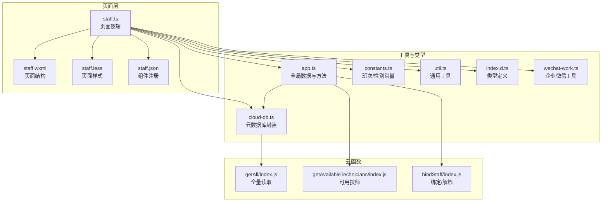
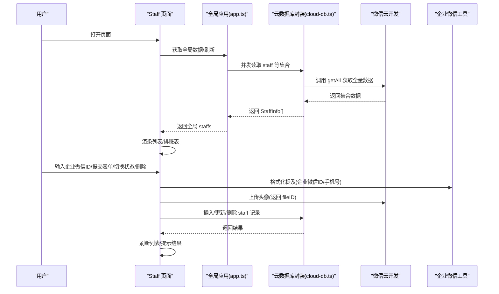
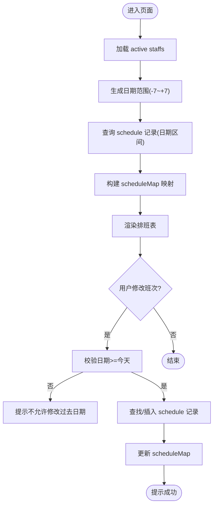
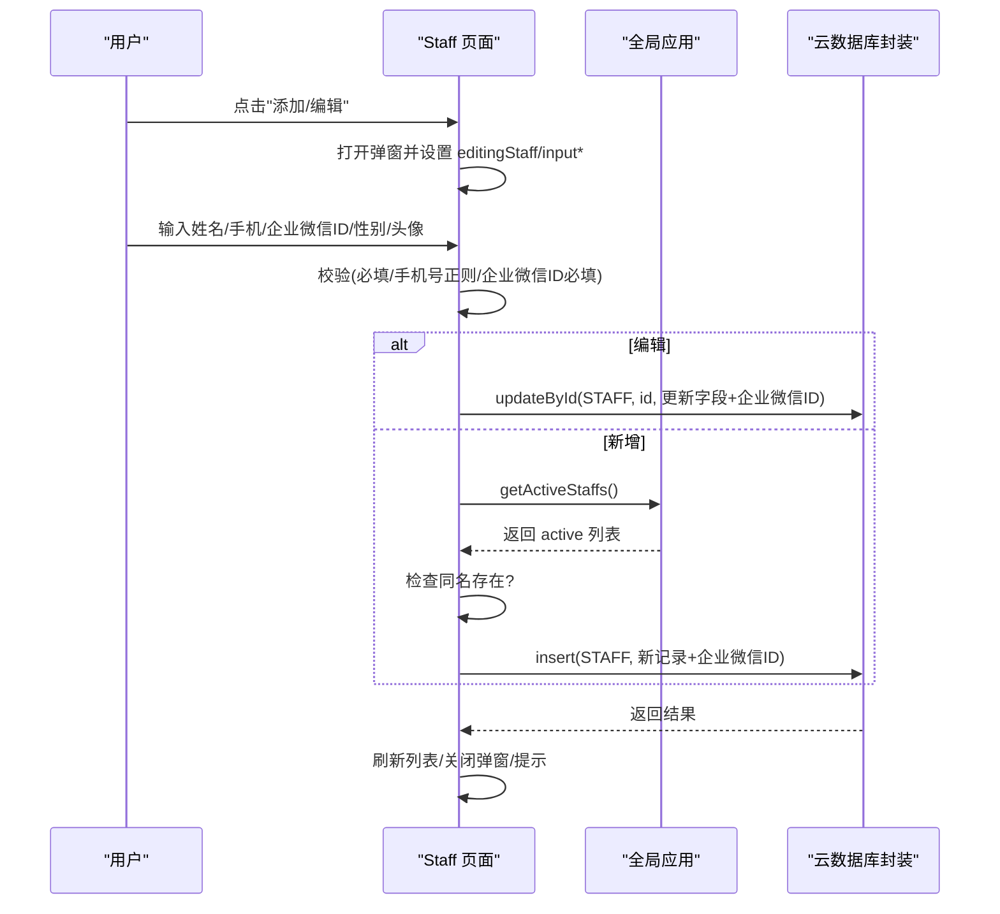
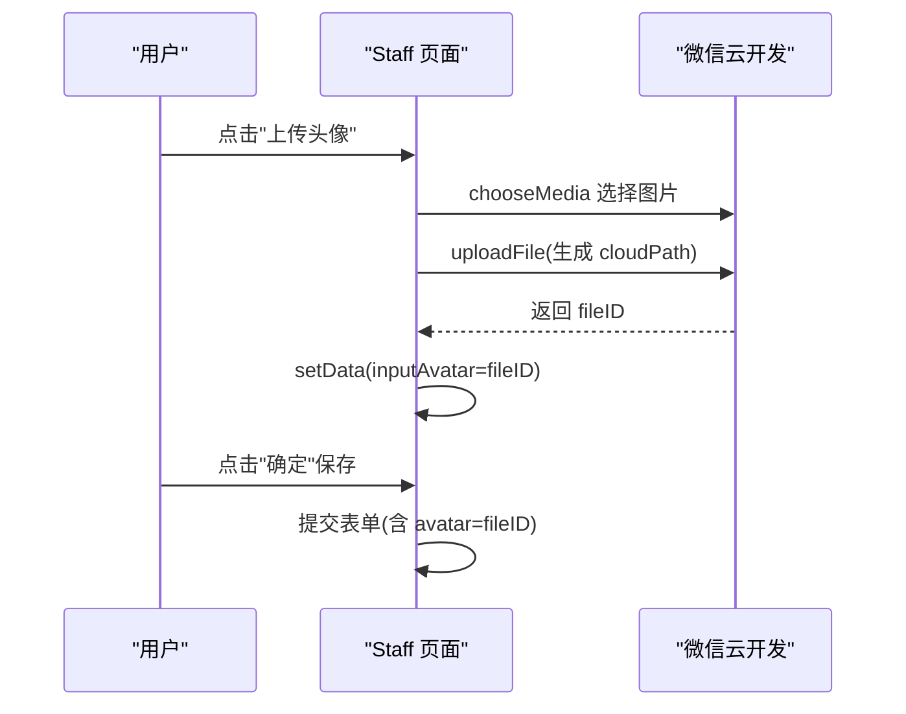
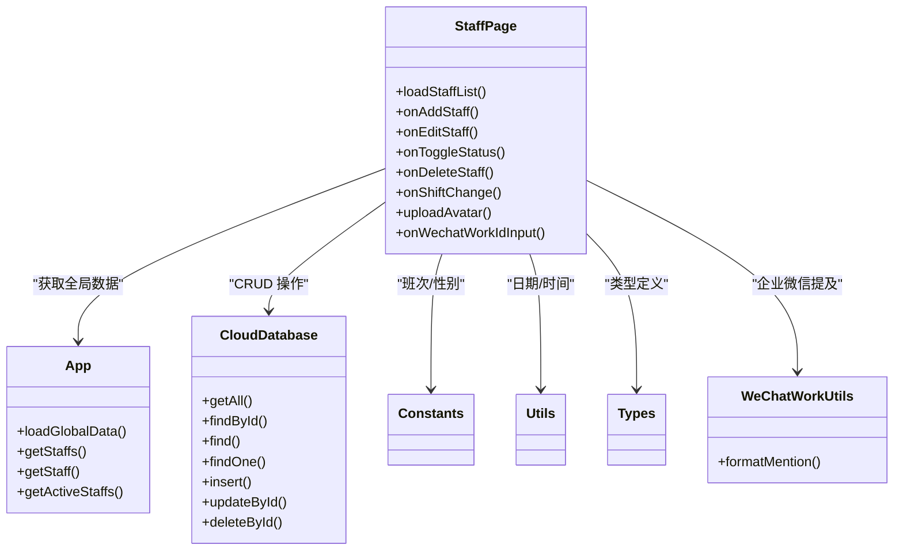

# 技师信息管理

<cite>
**本文引用的文件**
- [staff.ts](file://miniprogram/pages/staff/staff.ts)
- [staff.wxml](file://miniprogram/pages/staff/staff.wxml)
- [staff.json](file://miniprogram/pages/staff/staff.json)
- [staff.less](file://miniprogram/pages/staff/staff.less)
- [cloud-db.ts](file://miniprogram/utils/cloud-db.ts)
- [constants.ts](file://miniprogram/utils/constants.ts)
- [util.ts](file://miniprogram/utils/util.ts)
- [app.ts](file://miniprogram/app.ts)
- [index.d.ts](file://typings/index.d.ts)
- [wechat-work.ts](file://miniprogram/utils/wechat-work.ts)
- [gender-selector.ts](file://miniprogram/components/gender-selector/gender-selector.ts)
- [getAll/index.js](file://cloudfunctions/getAll/index.js)
- [getAvailableTechnicians/index.js](file://cloudfunctions/getAvailableTechnicians/index.js)
- [bindStaff/index.js](file://cloudfunctions/bindStaff/index.js)
</cite>

## 更新摘要
**变更内容**
- 新增企业微信ID字段支持，包括数据模型定义、界面展示和验证逻辑
- 更新员工信息表单，添加企业微信ID输入框
- 增强数据验证，确保企业微信ID必填
- 新增企业微信提及格式化工具函数
- 扩展相关数据结构以支持企业微信集成

## 目录
1. [简介](#简介)
2. [项目结构](#项目结构)
3. [核心组件](#核心组件)
4. [架构总览](#架构总览)
5. [详细组件分析](#详细组件分析)
6. [依赖关系分析](#依赖关系分析)
7. [性能考量](#性能考量)
8. [故障排查指南](#故障排查指南)
9. [结论](#结论)
10. [附录](#附录)

## 简介
本技术文档围绕"技师信息管理"功能展开，聚焦于小程序端 Staff 页面的完整实现，包括：
- 技师列表的数据加载、排序与展示
- 技师信息的增删改查全流程（新增、编辑、状态切换、删除）
- 技师数据模型定义与字段约束
- 头像上传机制（本地选择、云端存储、文件ID管理）
- 企业微信ID集成支持（ID输入、验证、提及格式化）
- 状态管理最佳实践（激活/禁用的业务逻辑与体验设计）
- 错误处理策略与常见问题排查

## 项目结构
Staff 页面位于 miniprogram/pages/staff，采用经典的 WXML + WXSS + TS 的小程序页面组织方式；数据访问通过全局应用实例与云数据库封装类完成；常量与工具函数分布在 utils 下；类型定义集中在 typings 中；部分业务逻辑通过云函数实现。

**图表来源**
- [staff.ts](file://miniprogram/pages/staff/staff.ts#L1-L475)
- [staff.wxml](file://miniprogram/pages/staff/staff.wxml#L1-L148)
- [staff.less](file://miniprogram/pages/staff/staff.less#L1-L479)
- [staff.json](file://miniprogram/pages/staff/staff.json#L1-L5)
- [app.ts](file://miniprogram/app.ts#L1-L191)
- [cloud-db.ts](file://miniprogram/utils/cloud-db.ts#L1-L321)
- [constants.ts](file://miniprogram/utils/constants.ts#L1-L49)
- [util.ts](file://miniprogram/utils/util.ts#L1-L150)
- [index.d.ts](file://typings/index.d.ts#L85-L253)
- [wechat-work.ts](file://miniprogram/utils/wechat-work.ts#L1-L16)
- [getAll/index.js](file://cloudfunctions/getAll/index.js#L1-L59)
- [getAvailableTechnicians/index.js](file://cloudfunctions/getAvailableTechnicians/index.js#L70-L287)
- [bindStaff/index.js](file://cloudfunctions/bindStaff/index.js#L121-L188)

**章节来源**
- [staff.ts](file://miniprogram/pages/staff/staff.ts#L1-L475)
- [staff.wxml](file://miniprogram/pages/staff/staff.wxml#L1-L148)
- [staff.less](file://miniprogram/pages/staff/staff.less#L1-L479)
- [staff.json](file://miniprogram/pages/staff/staff.json#L1-L5)

## 核心组件
- 页面控制器：负责加载数据、处理交互、调用云数据库与全局应用方法、弹窗与表单校验、头像上传与文件ID回写。
- 数据模型：StaffInfo 定义了技师的基本字段与状态枚举，现包含企业微信ID字段。
- 云数据库封装：统一提供查询、插入、更新、删除、分页等能力，并对错误进行兜底。
- 全局应用：集中加载与缓存 staff、room、project 等全局数据，提供按需获取与过滤方法。
- 常量与工具：班次类型、性别选项、日期格式化、时间计算等。
- 企业微信工具：提供提及格式化功能，支持通过企业微信ID或手机号进行提及。

**章节来源**
- [staff.ts](file://miniprogram/pages/staff/staff.ts#L12-L475)
- [index.d.ts](file://typings/index.d.ts#L85-L106)
- [cloud-db.ts](file://miniprogram/utils/cloud-db.ts#L1-L321)
- [app.ts](file://miniprogram/app.ts#L40-L108)
- [constants.ts](file://miniprogram/utils/constants.ts#L24-L49)
- [util.ts](file://miniprogram/utils/util.ts#L19-L24)
- [wechat-work.ts](file://miniprogram/utils/wechat-work.ts#L1-L16)

## 架构总览
页面通过全局应用实例获取/刷新全局数据，再通过云数据库封装类访问集合 staff、schedule 等；头像上传走微信云开发上传接口，返回 fileID 写入记录；状态切换与删除直接调用云数据库更新/删除；排班表按日期范围生成并渲染，支持当天之后的日期修改；新增的企业微信ID支持通过专门的工具函数进行格式化和提及。

**图表来源**
- [staff.ts](file://miniprogram/pages/staff/staff.ts#L30-L311)
- [app.ts](file://miniprogram/app.ts#L40-L66)
- [cloud-db.ts](file://miniprogram/utils/cloud-db.ts#L69-L203)
- [getAll/index.js](file://cloudfunctions/getAll/index.js#L9-L58)
- [util.ts](file://miniprogram/utils/util.ts#L19-L24)
- [wechat-work.ts](file://miniprogram/utils/wechat-work.ts#L1-L16)

## 详细组件分析

### 数据模型与字段约束
- 数据模型：StaffInfo
  - 字段：name、status、gender、avatar、phone、wechatWorkId
  - 状态：active、disabled
  - 性别：male、female
  - 企业微信ID：用于企业微信集成的唯一标识符
- 约束与默认值：
  - 新增记录时自动填充 createdAt、updatedAt
  - 默认状态为 active
  - 头像字段为字符串（微信云存储 fileID）
  - 企业微信ID为企业微信用户的唯一标识，支持空值但保存时必填

**更新** 新增企业微信ID字段，支持企业微信集成和提及功能

**章节来源**
- [index.d.ts](file://typings/index.d.ts#L85-L97)
- [cloud-db.ts](file://miniprogram/utils/cloud-db.ts#L136-L165)

### 技师列表加载、排序与展示
- 加载流程：
  - 页面 onShow 触发加载
  - 通过全局应用方法获取 staffs
  - 对 createdAt 进行降序排序以保证最新在前
- 展示：
  - 列表项包含头像、姓名、性别、状态、操作按钮
  - 禁用状态项有视觉弱化样式
  - 空状态提示"暂无员工"
  - 企业微信ID字段在后台数据中可用，但不在前台列表展示

**更新** 列表展示保持不变，企业微信ID在后台数据中可用

**章节来源**
- [staff.ts](file://miniprogram/pages/staff/staff.ts#L177-L196)
- [app.ts](file://miniprogram/app.ts#L89-L108)
- [staff.wxml](file://miniprogram/pages/staff/staff.wxml#L58-L84)
- [staff.less](file://miniprogram/pages/staff/staff.less#L214-L287)

### 排班表初始化与交互
- 初始化：
  - 生成前后7天日期范围
  - 从全局 active staffs 获取排班数据
  - 查询 schedule 集合，构造 scheduleMap 用于渲染
- 交互：
  - 当日或之后日期允许修改
  - picker 改变后覆盖式保存 schedule 记录
  - 成功后更新 scheduleMap 并提示

**图表来源**
- [staff.ts](file://miniprogram/pages/staff/staff.ts#L37-L95)
- [staff.ts](file://miniprogram/pages/staff/staff.ts#L118-L174)
- [constants.ts](file://miniprogram/utils/constants.ts#L24-L49)
- [util.ts](file://miniprogram/utils/util.ts#L19-L24)

**章节来源**
- [staff.ts](file://miniprogram/pages/staff/staff.ts#L37-L95)
- [staff.ts](file://miniprogram/pages/staff/staff.ts#L118-L174)
- [constants.ts](file://miniprogram/utils/constants.ts#L24-L49)
- [util.ts](file://miniprogram/utils/util.ts#L19-L24)

### 技师信息增删改查（CRUD）
- 新增：
  - 打开弹窗，清空输入
  - 校验姓名与手机号格式
  - 检查同名技师是否存在（仅 active）
  - 新增企业微信ID必填验证
  - 插入记录，默认状态 active
- 编辑：
  - 通过全局应用按 id 获取单条记录
  - 回填表单字段（含头像 fileID、企业微信ID）
- 切换状态：
  - 读取当前状态，取反后更新
  - 成功后刷新列表并提示
- 删除：
  - 弹出确认框
  - 删除后刷新列表并提示

**更新** 新增企业微信ID字段的输入验证和数据回写

**图表来源**
- [staff.ts](file://miniprogram/pages/staff/staff.ts#L199-L311)
- [staff.ts](file://miniprogram/pages/staff/staff.ts#L390-L475)
- [app.ts](file://miniprogram/app.ts#L89-L108)
- [cloud-db.ts](file://miniprogram/utils/cloud-db.ts#L136-L203)

**章节来源**
- [staff.ts](file://miniprogram/pages/staff/staff.ts#L199-L311)
- [staff.ts](file://miniprogram/pages/staff/staff.ts#L390-L475)
- [app.ts](file://miniprogram/app.ts#L89-L108)
- [cloud-db.ts](file://miniprogram/utils/cloud-db.ts#L136-L203)

### 企业微信ID集成与验证
- 字段定义：
  - 在 StaffInfo 类型中新增 wechatWorkId 字段
  - 支持空值，但在保存时必须填写
- 界面展示：
  - 在员工管理表单中添加企业微信ID输入框
  - 标记为必填字段（显示星号）
  - 最大长度限制为64字符
- 数据验证：
  - 保存时检查企业微信ID是否为空
  - 提供相应的错误提示
- 工具函数：
  - formatMention 函数支持通过企业微信ID进行提及
  - 优先使用企业微信ID，其次使用手机号，最后使用姓名

**新增** 企业微信ID集成功能，包括字段定义、界面展示、验证逻辑和工具函数

**章节来源**
- [index.d.ts](file://typings/index.d.ts#L89-L97)
- [staff.ts](file://miniprogram/pages/staff/staff.ts#L23-L29)
- [staff.ts](file://miniprogram/pages/staff/staff.ts#L331-L334)
- [staff.ts](file://miniprogram/pages/staff/staff.ts#L420-L423)
- [staff.wxml](file://miniprogram/pages/staff/staff.wxml#L128-L131)
- [wechat-work.ts](file://miniprogram/utils/wechat-work.ts#L1-L16)

### 头像上传机制
- 选择与预览：
  - 通过 wx.chooseMedia 选择图片
  - 本地预览，支持相册与相机
- 上传与回写：
  - 上传至微信云开发，生成 fileID
  - 将 fileID 写入 inputAvatar，后续保存时写入记录
- 文件ID管理：
  - 保存成功后，列表项使用 fileID 或默认头像占位

**图表来源**
- [staff.ts](file://miniprogram/pages/staff/staff.ts#L336-L375)
- [staff.wxml](file://miniprogram/pages/staff/staff.wxml#L118-L127)

**章节来源**
- [staff.ts](file://miniprogram/pages/staff/staff.ts#L336-L375)
- [staff.wxml](file://miniprogram/pages/staff/staff.wxml#L118-L127)

### 状态管理最佳实践
- 激活/禁用：
  - 仅对 active 与 disabled 两个状态进行切换
  - 禁用状态下列表项视觉弱化，便于识别
- 业务逻辑：
  - 禁用技师不应出现在可用技师列表中
  - 绑定用户时需校验技师状态为 active
  - 企业微信ID不影响状态切换逻辑
- 用户体验：
  - 操作前明确提示
  - 成功后即时反馈
  - 不允许对过去日期进行排班修改

**更新** 状态管理保持不变，企业微信ID不影响状态逻辑

**章节来源**
- [staff.ts](file://miniprogram/pages/staff/staff.ts#L242-L272)
- [staff.wxml](file://miniprogram/pages/staff/staff.wxml#L60-L84)
- [bindStaff/index.js](file://cloudfunctions/bindStaff/index.js#L134-L139)
- [getAvailableTechnicians/index.js](file://cloudfunctions/getAvailableTechnicians/index.js#L70-L111)

### 错误处理策略
- 页面级：
  - 加载失败、操作失败均隐藏 loading 并 toast 提示
  - 弹窗关闭时清空输入，避免脏数据
  - 新增企业微信ID必填验证的错误提示
- 云数据库封装：
  - 查询/插入/更新/删除均捕获异常并返回安全值
  - 文档不存在时返回 null/false
- 云函数：
  - getAll 对集合为空或异常进行兜底
  - 绑定/解绑对状态与重复绑定进行校验
  - 可用技师列表函数支持企业微信ID字段

**更新** 新增企业微信ID验证的错误处理

**章节来源**
- [staff.ts](file://miniprogram/pages/staff/staff.ts#L177-L196)
- [staff.ts](file://miniprogram/pages/staff/staff.ts#L242-L272)
- [staff.ts](file://miniprogram/pages/staff/staff.ts#L274-L311)
- [staff.ts](file://miniprogram/pages/staff/staff.ts#L420-L423)
- [cloud-db.ts](file://miniprogram/utils/cloud-db.ts#L93-L203)
- [getAll/index.js](file://cloudfunctions/getAll/index.js#L19-L58)
- [bindStaff/index.js](file://cloudfunctions/bindStaff/index.js#L121-L188)

## 依赖关系分析
- 页面依赖全局应用以获取/刷新全局数据
- 云数据库封装依赖微信云开发 SDK
- 页面依赖常量与工具函数进行日期与班次处理
- 类型定义集中于 typings，确保编译期安全
- 新增企业微信工具函数支持提及格式化

**更新** 新增企业微信工具函数依赖

**图表来源**
- [staff.ts](file://miniprogram/pages/staff/staff.ts#L12-L475)
- [app.ts](file://miniprogram/app.ts#L40-L108)
- [cloud-db.ts](file://miniprogram/utils/cloud-db.ts#L12-L321)
- [constants.ts](file://miniprogram/utils/constants.ts#L24-L49)
- [util.ts](file://miniprogram/utils/util.ts#L19-L24)
- [index.d.ts](file://typings/index.d.ts#L85-L106)
- [wechat-work.ts](file://miniprogram/utils/wechat-work.ts#L1-L16)

**章节来源**
- [staff.ts](file://miniprogram/pages/staff/staff.ts#L12-L475)
- [app.ts](file://miniprogram/app.ts#L40-L108)
- [cloud-db.ts](file://miniprogram/utils/cloud-db.ts#L12-L321)
- [index.d.ts](file://typings/index.d.ts#L85-L106)

## 性能考量
- 并发加载：全局数据通过 Promise.all 并发读取多个集合，减少首屏等待
- 分页与全量：getAll 采用分页拉取全量数据，避免一次性读取过多导致超时
- 本地缓存：全局应用维护 isDataLoaded 与 staffs 数组，避免重复请求
- 列表渲染：对 createdAt 做降序排序，提升用户感知的新旧顺序
- 排班渲染：仅渲染日期范围内数据，减少 DOM 体积
- 企业微信ID处理：格式化函数使用简单字符串操作，性能影响可忽略

**更新** 新增企业微信ID处理的性能考量

**章节来源**
- [app.ts](file://miniprogram/app.ts#L48-L58)
- [getAll/index.js](file://cloudfunctions/getAll/index.js#L25-L44)
- [staff.ts](file://miniprogram/pages/staff/staff.ts#L177-L196)

## 故障排查指南
- 无法加载技师列表
  - 检查全局数据是否已加载（isDataLoaded）
  - 确认 getAll 云函数可正常返回数据
- 保存失败
  - 检查表单校验（姓名/手机号/企业微信ID）
  - 检查同名冲突（仅 active）
  - 检查企业微信ID必填验证
  - 查看云数据库返回值
- 头像上传失败
  - 检查 wx.chooseMedia 是否成功回调
  - 检查 uploadFile 返回的 fileID
- 状态切换无效
  - 确认当前状态与目标状态映射
  - 检查更新后的列表刷新
- 排班修改报错
  - 确认日期不早于今日
  - 检查 schedule 记录的 upsert 流程
- 企业微信ID相关问题
  - 检查企业微信ID格式是否正确
  - 确认企业微信ID在数据库中的存储
  - 验证 formatMention 函数的格式化结果

**更新** 新增企业微信ID相关的故障排查指导

**章节来源**
- [staff.ts](file://miniprogram/pages/staff/staff.ts#L177-L196)
- [staff.ts](file://miniprogram/pages/staff/staff.ts#L390-L475)
- [staff.ts](file://miniprogram/pages/staff/staff.ts#L336-L375)
- [staff.ts](file://miniprogram/pages/staff/staff.ts#L118-L174)
- [staff.ts](file://miniprogram/pages/staff/staff.ts#L420-L423)
- [cloud-db.ts](file://miniprogram/utils/cloud-db.ts#L136-L203)
- [getAll/index.js](file://cloudfunctions/getAll/index.js#L19-L58)

## 结论
本页面通过全局应用与云数据库封装实现了完整的技师信息管理能力，具备良好的扩展性与健壮性。新增的企业微信ID集成功能进一步增强了系统的现代化管理能力。建议在后续迭代中：
- 增加分页与搜索，优化大数据量下的列表性能
- 在编辑弹窗中加入更细粒度的校验与提示
- 对排班表增加批量导入/导出能力
- 在绑定/解绑流程中增加更明确的状态提示与回滚策略
- 考虑添加企业微信ID的批量导入/导出功能
- 增加企业微信ID的唯一性验证

## 附录
- 相关类型定义与常量
  - 班次类型与名称映射：SHIFT_TYPES、SHIFT_NAMES
  - 性别枚举：GENDERS
  - 日期格式化：formatDate
  - 企业微信ID格式化：formatMention
- 云函数参考
  - getAll：全量读取集合
  - getAvailableTechnicians：可用技师列表（含冲突检测，支持企业微信ID）
  - bindStaff：绑定/解绑技师
- 工具函数参考
  - wechat-work：企业微信提及格式化工具

**更新** 新增企业微信ID相关的类型定义、工具函数和云函数参考

**章节来源**
- [constants.ts](file://miniprogram/utils/constants.ts#L24-L49)
- [util.ts](file://miniprogram/utils/util.ts#L19-L24)
- [getAll/index.js](file://cloudfunctions/getAll/index.js#L9-L58)
- [getAvailableTechnicians/index.js](file://cloudfunctions/getAvailableTechnicians/index.js#L70-L111)
- [bindStaff/index.js](file://cloudfunctions/bindStaff/index.js#L121-L188)
- [wechat-work.ts](file://miniprogram/utils/wechat-work.ts#L1-L16)