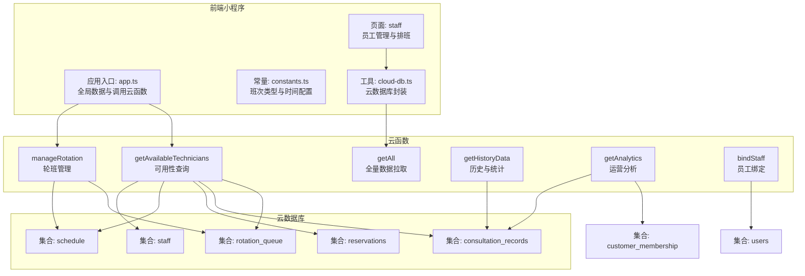
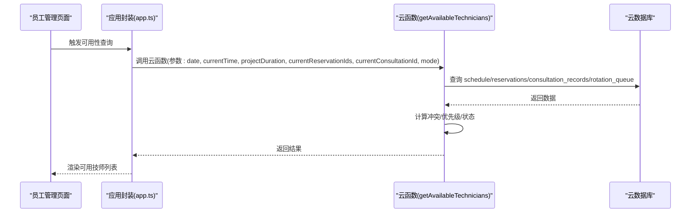
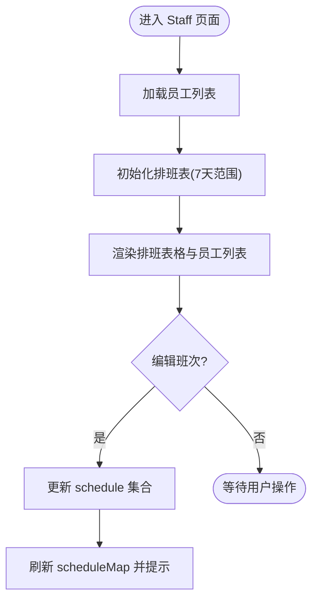
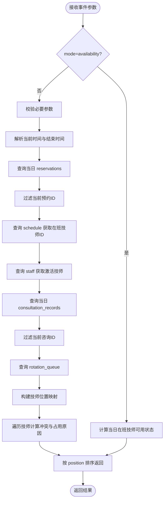
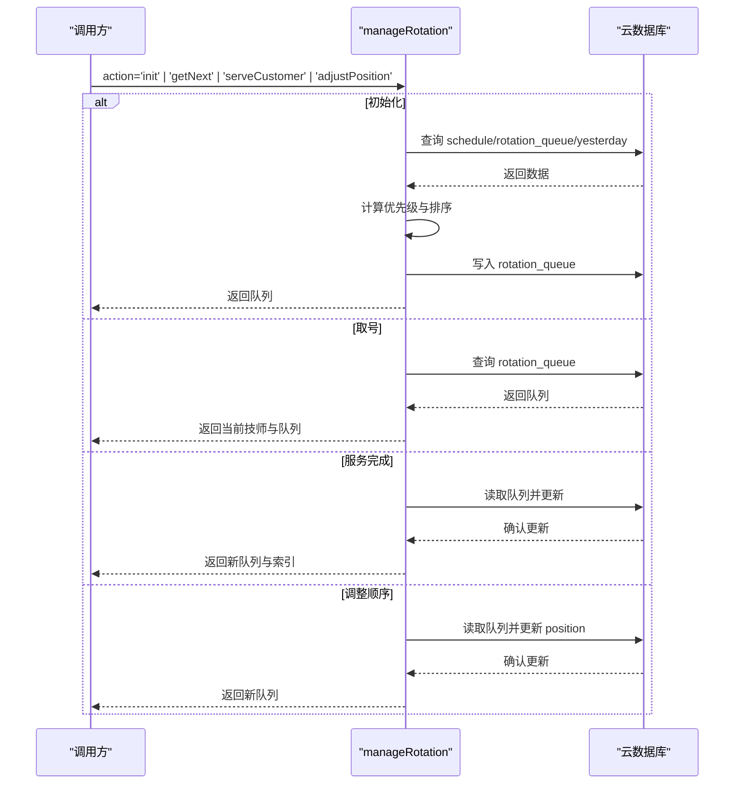
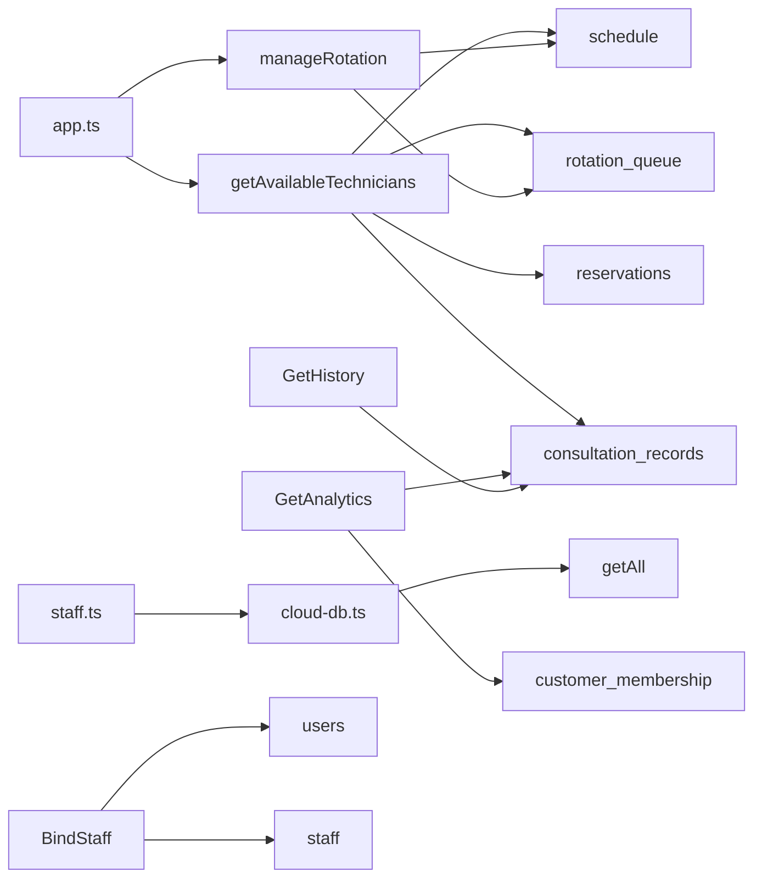
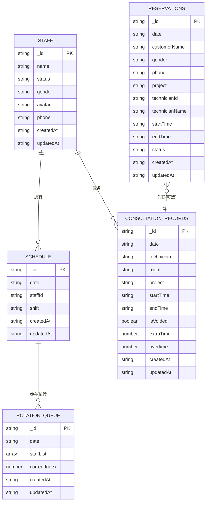

# 技师排班系统

<cite>
**本文档引用的文件**
- [cloudfunctions/getAvailableTechnicians/index.js](file://cloudfunctions/getAvailableTechnicians/index.js)
- [cloudfunctions/manageRotation/index.js](file://cloudfunctions/manageRotation/index.js)
- [miniprogram/pages/staff/staff.ts](file://miniprogram/pages/staff/staff.ts)
- [miniprogram/pages/staff/staff.wxml](file://miniprogram/pages/staff/staff.wxml)
- [miniprogram/pages/staff/staff.less](file://miniprogram/pages/staff/staff.less)
- [miniprogram/utils/constants.ts](file://miniprogram/utils/constants.ts)
- [miniprogram/app.ts](file://miniprogram/app.ts)
- [miniprogram/utils/cloud-db.ts](file://miniprogram/utils/cloud-db.ts)
- [typings/index.d.ts](file://typings/index.d.ts)
- [cloudfunctions/getAnalytics/index.js](file://cloudfunctions/getAnalytics/index.js)
- [cloudfunctions/getHistoryData/index.js](file://cloudfunctions/getHistoryData/index.js)
- [cloudfunctions/bindStaff/index.js](file://cloudfunctions/bindStaff/index.js)
- [cloudfunctions/getAll/index.js](file://cloudfunctions/getAll/index.js)
</cite>

## 目录
1. [简介](#简介)
2. [项目结构](#项目结构)
3. [核心组件](#核心组件)
4. [架构总览](#架构总览)
5. [详细组件分析](#详细组件分析)
6. [依赖关系分析](#依赖关系分析)
7. [性能考虑](#性能考虑)
8. [故障排除指南](#故障排除指南)
9. [结论](#结论)
10. [附录](#附录)

## 简介
本系统围绕“技师排班与轮转”构建，提供技师信息管理、可用性查询、排班轮换等核心能力。后端通过云函数实现数据查询与业务逻辑，前端通过小程序页面承载技师管理、排班编辑与轮转队列交互。系统支持：
- 技师信息维护（新增、编辑、启用/禁用、删除）
- 员工排班表（多日期滚动查看与编辑）
- 可用性查询（基于时间范围、预约/咨询冲突、轮转优先级）
- 轮班管理（初始化队列、取号、服务完成推进、手动调整顺序）

## 项目结构
系统采用“云开发 + 小程序前端”的分层架构：
- 前端（miniprogram）：页面、组件、工具类、类型定义
- 后端（cloudfunctions）：云函数封装业务逻辑与数据访问
- 类型定义（typings）：统一的数据结构与接口约束

图表来源
- [miniprogram/pages/staff/staff.ts](file://miniprogram/pages/staff/staff.ts#L1-L460)
- [miniprogram/app.ts](file://miniprogram/app.ts#L110-L189)
- [miniprogram/utils/constants.ts](file://miniprogram/utils/constants.ts#L24-L49)
- [miniprogram/utils/cloud-db.ts](file://miniprogram/utils/cloud-db.ts#L69-L88)
- [cloudfunctions/getAvailableTechnicians/index.js](file://cloudfunctions/getAvailableTechnicians/index.js#L9-L124)
- [cloudfunctions/manageRotation/index.js](file://cloudfunctions/manageRotation/index.js#L9-L36)
- [cloudfunctions/getAnalytics/index.js](file://cloudfunctions/getAnalytics/index.js#L36-L51)
- [cloudfunctions/getHistoryData/index.js](file://cloudfunctions/getHistoryData/index.js#L88-L113)
- [cloudfunctions/bindStaff/index.js](file://cloudfunctions/bindStaff/index.js#L10-L51)

章节来源
- [miniprogram/pages/staff/staff.ts](file://miniprogram/pages/staff/staff.ts#L1-L460)
- [cloudfunctions/getAvailableTechnicians/index.js](file://cloudfunctions/getAvailableTechnicians/index.js#L9-L124)
- [cloudfunctions/manageRotation/index.js](file://cloudfunctions/manageRotation/index.js#L9-L36)

## 核心组件
- 员工管理与排班页面：提供员工列表、状态切换、头像上传、排班编辑与日期导航
- 可用性查询云函数：按日期、当前时间、项目时长、现有预约/咨询冲突、轮转优先级计算可用技师
- 轮班管理云函数：初始化轮牌、取号、服务完成推进、调整顺序
- 全局应用封装：统一调用云函数、缓存全局数据、提供便捷方法

章节来源
- [miniprogram/pages/staff/staff.ts](file://miniprogram/pages/staff/staff.ts#L176-L458)
- [cloudfunctions/getAvailableTechnicians/index.js](file://cloudfunctions/getAvailableTechnicians/index.js#L9-L124)
- [cloudfunctions/manageRotation/index.js](file://cloudfunctions/manageRotation/index.js#L9-L36)
- [miniprogram/app.ts](file://miniprogram/app.ts#L110-L189)

## 架构总览
系统通过云函数作为业务中枢，前端通过 wx.cloud.callFunction 调用，数据库采用云开发集合存储。核心流程：
- 员工管理：前端读取/写入 staff 集合；排班编辑写入 schedule 集合
- 可用性查询：聚合 schedule/reservations/consultation_records/rotation_queue 计算冲突与优先级
- 轮班管理：基于 schedule 初始化 rotation_queue，按规则推进 currentIndex 并更新 orderCount

图表来源
- [miniprogram/pages/staff/staff.ts](file://miniprogram/pages/staff/staff.ts#L30-L95)
- [cloudfunctions/getAvailableTechnicians/index.js](file://cloudfunctions/getAvailableTechnicians/index.js#L9-L124)

## 详细组件分析

### 员工管理页面（Staff 页面）
职责与特性：
- 展示员工列表，支持启用/禁用、删除、头像上传
- 展示排班表（前后7天），支持按日期与班次类型编辑
- 日期导航与今日高亮，班次标签样式化显示
- 模态框支持新增/编辑员工，含姓名、性别、手机号、状态校验

图表来源
- [miniprogram/pages/staff/staff.ts](file://miniprogram/pages/staff/staff.ts#L30-L174)
- [miniprogram/pages/staff/staff.wxml](file://miniprogram/pages/staff/staff.wxml#L22-L96)
- [miniprogram/pages/staff/staff.less](file://miniprogram/pages/staff/staff.less#L31-L174)

章节来源
- [miniprogram/pages/staff/staff.ts](file://miniprogram/pages/staff/staff.ts#L176-L458)
- [miniprogram/pages/staff/staff.wxml](file://miniprogram/pages/staff/staff.wxml#L1-L244)
- [miniprogram/pages/staff/staff.less](file://miniprogram/pages/staff/staff.less#L1-L518)

### 可用性查询（getAvailableTechnicians 云函数）
功能要点：
- 支持两种模式：普通查询与 availability 模式
- 参数校验：日期、当前时间、项目时长必填
- 冲突检测：基于 reservations 与 consultation_records 的时间段交叉判断
- 轮转优先级：根据 rotation_queue 中 position 排序
- 时间段计算：将 HH:mm 解析为分钟，推导结束时间并比较

图表来源
- [cloudfunctions/getAvailableTechnicians/index.js](file://cloudfunctions/getAvailableTechnicians/index.js#L9-L124)
- [cloudfunctions/getAvailableTechnicians/index.js](file://cloudfunctions/getAvailableTechnicians/index.js#L131-L285)

章节来源
- [cloudfunctions/getAvailableTechnicians/index.js](file://cloudfunctions/getAvailableTechnicians/index.js#L9-L124)
- [cloudfunctions/getAvailableTechnicians/index.js](file://cloudfunctions/getAvailableTechnicians/index.js#L131-L285)

### 轮班管理（manageRotation 云函数）
功能要点：
- 初始化队列：从 schedule 获取在班技师，结合昨日轮转与优先级排序，生成 rotation_queue
- 取号：返回当前队列中的技师与队列快照
- 服务完成：根据 isClockIn 或服务推进，更新 orderCount、lastServedTime 与 currentIndex
- 调整顺序：支持拖拽调整 position 并同步更新

图表来源
- [cloudfunctions/manageRotation/index.js](file://cloudfunctions/manageRotation/index.js#L9-L36)
- [cloudfunctions/manageRotation/index.js](file://cloudfunctions/manageRotation/index.js#L38-L146)
- [cloudfunctions/manageRotation/index.js](file://cloudfunctions/manageRotation/index.js#L148-L183)
- [cloudfunctions/manageRotation/index.js](file://cloudfunctions/manageRotation/index.js#L185-L246)
- [cloudfunctions/manageRotation/index.js](file://cloudfunctions/manageRotation/index.js#L248-L272)
- [cloudfunctions/manageRotation/index.js](file://cloudfunctions/manageRotation/index.js#L274-L315)

章节来源
- [cloudfunctions/manageRotation/index.js](file://cloudfunctions/manageRotation/index.js#L9-L36)
- [cloudfunctions/manageRotation/index.js](file://cloudfunctions/manageRotation/index.js#L38-L146)
- [cloudfunctions/manageRotation/index.js](file://cloudfunctions/manageRotation/index.js#L148-L183)
- [cloudfunctions/manageRotation/index.js](file://cloudfunctions/manageRotation/index.js#L185-L246)
- [cloudfunctions/manageRotation/index.js](file://cloudfunctions/manageRotation/index.js#L248-L272)
- [cloudfunctions/manageRotation/index.js](file://cloudfunctions/manageRotation/index.js#L274-L315)

### 数据模型与类型定义
- 员工：包含姓名、状态、性别、头像、手机号
- 排班：日期、技师ID、班次类型
- 预约：日期、客户姓名、性别、手机号、项目、技师信息、时间段、状态
- 咨询记录：日期、技师、房间、项目、时间段、结算信息、加钟/加班
- 轮转队列：技师列表（含 orderCount、lastServedTime、position）、当前索引

章节来源
- [typings/index.d.ts](file://typings/index.d.ts#L89-L122)
- [typings/index.d.ts](file://typings/index.d.ts#L315-L324)

## 依赖关系分析
- 前端依赖
  - app.ts 统一封装云函数调用与全局数据
  - staff.ts 依赖 constants.ts 的班次类型与时间配置
  - cloud-db.ts 提供 getAll、find、insert、updateById 等通用数据库操作
- 云函数依赖
  - getAvailableTechnicians 依赖 schedule、reservations、consultation_records、rotation_queue
  - manageRotation 依赖 schedule、rotation_queue
  - getAnalytics 依赖 consultation_records、customer_membership
  - getHistoryData 依赖 consultation_records
  - bindStaff 依赖 users、staff

图表来源
- [miniprogram/app.ts](file://miniprogram/app.ts#L110-L189)
- [miniprogram/utils/cloud-db.ts](file://miniprogram/utils/cloud-db.ts#L69-L88)
- [cloudfunctions/getAvailableTechnicians/index.js](file://cloudfunctions/getAvailableTechnicians/index.js#L26-L63)
- [cloudfunctions/manageRotation/index.js](file://cloudfunctions/manageRotation/index.js#L39-L83)
- [cloudfunctions/getAnalytics/index.js](file://cloudfunctions/getAnalytics/index.js#L56-L71)
- [cloudfunctions/getHistoryData/index.js](file://cloudfunctions/getHistoryData/index.js#L34-L86)
- [cloudfunctions/bindStaff/index.js](file://cloudfunctions/bindStaff/index.js#L16-L66)

章节来源
- [miniprogram/app.ts](file://miniprogram/app.ts#L110-L189)
- [miniprogram/utils/cloud-db.ts](file://miniprogram/utils/cloud-db.ts#L69-L88)
- [cloudfunctions/getAvailableTechnicians/index.js](file://cloudfunctions/getAvailableTechnicians/index.js#L26-L63)
- [cloudfunctions/manageRotation/index.js](file://cloudfunctions/manageRotation/index.js#L39-L83)
- [cloudfunctions/getAnalytics/index.js](file://cloudfunctions/getAnalytics/index.js#L56-L71)
- [cloudfunctions/getHistoryData/index.js](file://cloudfunctions/getHistoryData/index.js#L34-L86)
- [cloudfunctions/bindStaff/index.js](file://cloudfunctions/bindStaff/index.js#L16-L66)

## 性能考虑
- 查询分页与批量拉取
  - getAll 以 1000 条为上限循环拉取，避免单次超大数据量
- 时间转换与比较
  - 将 HH:mm 转换为分钟进行区间比较，减少字符串解析开销
- 冲突检测与排序
  - 使用 Map 构建轮转位置映射，O(n) 查找；最终一次排序
- 前端渲染
  - staff 页面使用 scheduleMap 快速定位单元格，减少重复计算
- 建议
  - 对高频查询建立合适索引（如 date、status、staffId）
  - 在 getAvailableTechnicians 中对 reservations/consultation_records 进行条件过滤后再合并
  - 对 manageRotation 的 position 更新批量写入，避免多次往返

[本节为通用建议，无需特定文件引用]

## 故障排除指南
- 可用性查询返回空或错误
  - 检查参数：date、currentTime、projectDuration 是否传入
  - 检查集合数据：schedule/reservations/consultation_records/rotation_queue 是否存在对应日期数据
- 轮班管理报“轮牌不存在”
  - 需先调用初始化队列（action='init'），否则 getNext/serveCustomer 会尝试自动初始化
- 员工状态切换无效
  - 确认当前日期不早于今日（今日之前不可修改排班）
  - 检查网络与权限
- 头像上传失败
  - 检查 wx.cloud.uploadFile 返回与网络状态
- 云函数异常
  - 查看云函数日志与返回的 message 字段，定位具体错误

章节来源
- [cloudfunctions/getAvailableTechnicians/index.js](file://cloudfunctions/getAvailableTechnicians/index.js#L16-L21)
- [cloudfunctions/manageRotation/index.js](file://cloudfunctions/manageRotation/index.js#L153-L170)
- [miniprogram/pages/staff/staff.ts](file://miniprogram/pages/staff/staff.ts#L126-L134)
- [miniprogram/pages/staff/staff.ts](file://miniprogram/pages/staff/staff.ts#L344-L368)

## 结论
本系统通过清晰的前后端分工与云函数封装，实现了技师信息管理、排班编辑与可用性查询，并以轮转队列保障公平与效率。建议在生产环境中进一步完善索引、缓存与异常监控，持续优化查询与渲染性能。

[本节为总结，无需特定文件引用]

## 附录

### 数据模型图

图表来源
- [typings/index.d.ts](file://typings/index.d.ts#L89-L122)
- [typings/index.d.ts](file://typings/index.d.ts#L315-L324)

### 最佳实践
- 参数校验：前端与云函数均需进行参数完整性与格式校验
- 权限控制：对敏感操作（删除、修改排班）进行权限验证
- 日志与监控：记录云函数执行耗时与错误，便于问题定位
- 数据一致性：轮转推进与排班变更需保证原子性与幂等性
- 用户体验：在加载与提交过程中提供明确的反馈与错误提示

[本节为通用建议，无需特定文件引用]