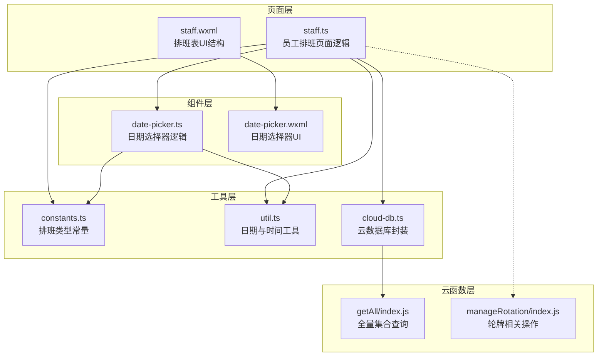
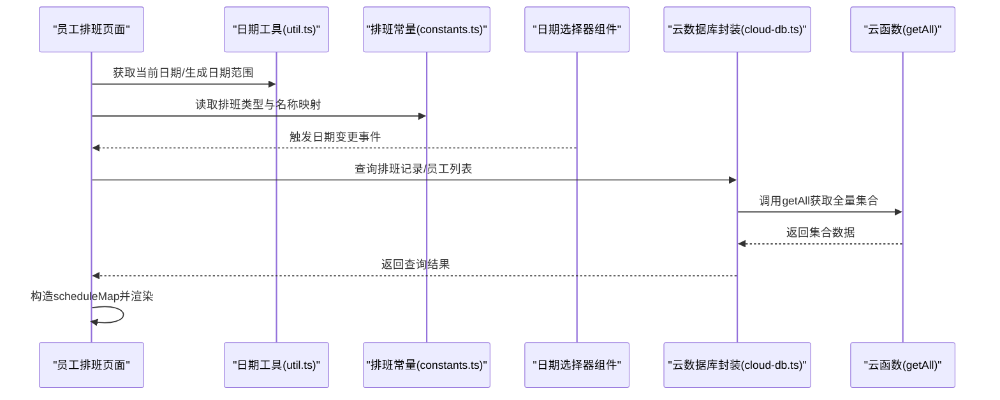
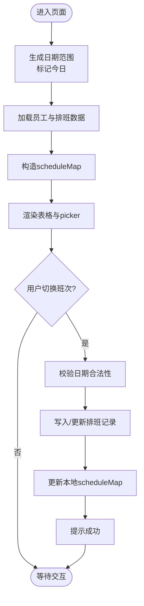
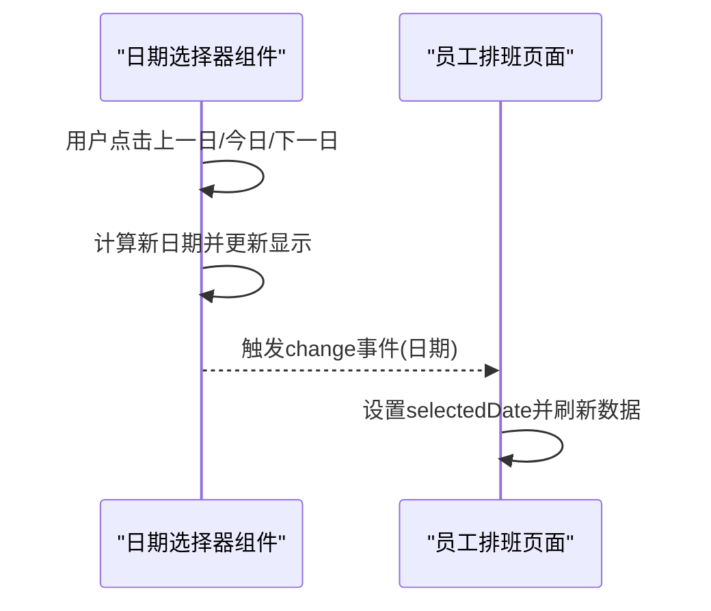
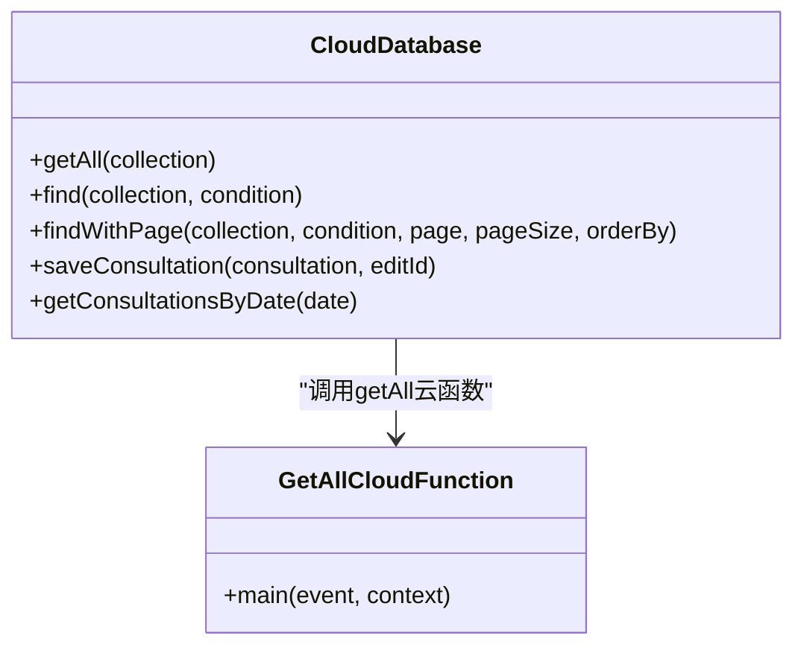
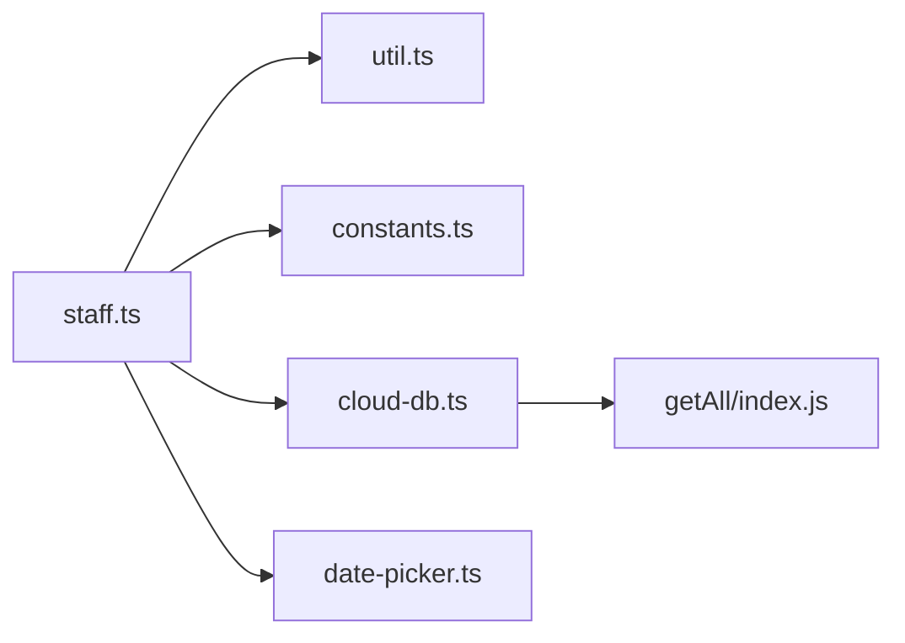

# 排班表展示

<cite>
**本文引用的文件**
- [miniprogram/pages/staff/staff.ts](file://miniprogram/pages/staff/staff.ts)
- [miniprogram/pages/staff/staff.wxml](file://miniprogram/pages/staff/staff.wxml)
- [miniprogram/utils/constants.ts](file://miniprogram/utils/constants.ts)
- [miniprogram/utils/cloud-db.ts](file://miniprogram/utils/cloud-db.ts)
- [miniprogram/utils/util.ts](file://miniprogram/utils/util.ts)
- [miniprogram/components/date-picker/date-picker.ts](file://miniprogram/components/date-picker/date-picker.ts)
- [miniprogram/components/date-picker/date-picker.wxml](file://miniprogram/components/date-picker/date-picker.wxml)
- [cloudfunctions/getAll/index.js](file://cloudfunctions/getAll/index.js)
- [cloudfunctions/manageRotation/index.js](file://cloudfunctions/manageRotation/index.js)
</cite>

## 目录
1. [简介](#简介)
2. [项目结构](#项目结构)
3. [核心组件](#核心组件)
4. [架构总览](#架构总览)
5. [详细组件分析](#详细组件分析)
6. [依赖关系分析](#依赖关系分析)
7. [性能考虑](#性能考虑)
8. [故障排查指南](#故障排查指南)
9. [结论](#结论)
10. [附录](#附录)

## 简介
本技术文档围绕“排班表展示”功能进行系统化说明，涵盖以下方面：
- 排班表初始化：日期范围生成、当前日期标记、周几显示
- 排班数据加载与渲染：从云数据库获取排班记录、构造 scheduleMap 数据结构、界面渲染流程
- 交互设计：日期选择、班次切换、实时更新的用户体验
- 排班类型常量：SHIFT_NAMES 与 SHIFT_TYPES 的配置与使用
- 布局设计：响应式与移动端适配策略
- 性能优化与缓存：分页查询、本地状态管理与按需刷新

## 项目结构
排班表展示功能主要由以下模块协同完成：
- 页面层：员工排班页面负责展示与交互
- 工具层：常量定义、日期工具、云数据库封装
- 组件层：日期选择器组件提供日期导航
- 云函数层：通用查询与轮牌相关操作

图表来源
- [miniprogram/pages/staff/staff.ts](file://miniprogram/pages/staff/staff.ts#L1-L200)
- [miniprogram/pages/staff/staff.wxml](file://miniprogram/pages/staff/staff.wxml#L1-L244)
- [miniprogram/utils/constants.ts](file://miniprogram/utils/constants.ts#L1-L48)
- [miniprogram/utils/util.ts](file://miniprogram/utils/util.ts#L1-L150)
- [miniprogram/utils/cloud-db.ts](file://miniprogram/utils/cloud-db.ts#L1-L321)
- [miniprogram/components/date-picker/date-picker.ts](file://miniprogram/components/date-picker/date-picker.ts#L1-L100)
- [miniprogram/components/date-picker/date-picker.wxml](file://miniprogram/components/date-picker/date-picker.wxml#L1-L16)
- [cloudfunctions/getAll/index.js](file://cloudfunctions/getAll/index.js#L1-L59)
- [cloudfunctions/manageRotation/index.js](file://cloudfunctions/manageRotation/index.js#L1-L327)

章节来源
- [miniprogram/pages/staff/staff.ts](file://miniprogram/pages/staff/staff.ts#L1-L200)
- [miniprogram/pages/staff/staff.wxml](file://miniprogram/pages/staff/staff.wxml#L1-L244)
- [miniprogram/utils/constants.ts](file://miniprogram/utils/constants.ts#L1-L48)
- [miniprogram/utils/util.ts](file://miniprogram/utils/util.ts#L1-L150)
- [miniprogram/utils/cloud-db.ts](file://miniprogram/utils/cloud-db.ts#L1-L321)
- [miniprogram/components/date-picker/date-picker.ts](file://miniprogram/components/date-picker/date-picker.ts#L1-L100)
- [miniprogram/components/date-picker/date-picker.wxml](file://miniprogram/components/date-picker/date-picker.wxml#L1-L16)
- [cloudfunctions/getAll/index.js](file://cloudfunctions/getAll/index.js#L1-L59)
- [cloudfunctions/manageRotation/index.js](file://cloudfunctions/manageRotation/index.js#L1-L327)

## 核心组件
- 员工排班页面（staff.ts）：负责初始化日期范围、加载员工与排班数据、渲染 scheduleMap、处理班次切换与实时更新
- 日期选择器组件（date-picker）：提供“上一日/今日/下一日/日期选择器”等交互，触发日期变更事件
- 常量定义（constants.ts）：定义排班类型枚举与名称映射（SHIFT_TYPES、SHIFT_NAMES、SHIFT_START_TIME、SHIFT_END_TIME、DEFAULT_SHIFT）
- 云数据库封装（cloud-db.ts）：统一调用云数据库能力，支持分页、条件查询、全量集合拉取
- 日期工具（util.ts）：提供格式化、当前日期、相邻日期计算等工具方法

章节来源
- [miniprogram/pages/staff/staff.ts](file://miniprogram/pages/staff/staff.ts#L36-L115)
- [miniprogram/components/date-picker/date-picker.ts](file://miniprogram/components/date-picker/date-picker.ts#L1-L100)
- [miniprogram/utils/constants.ts](file://miniprogram/utils/constants.ts#L24-L48)
- [miniprogram/utils/cloud-db.ts](file://miniprogram/utils/cloud-db.ts#L69-L123)
- [miniprogram/utils/util.ts](file://miniprogram/utils/util.ts#L19-L149)

## 架构总览
排班表展示采用“页面驱动 + 组件协作 + 云数据库封装”的分层架构：
- 页面层发起初始化与交互请求
- 组件层提供日期导航与用户输入
- 工具层提供常量与日期计算
- 云数据库封装统一访问云端数据
- 云函数提供全量查询与轮牌相关操作

图表来源
- [miniprogram/pages/staff/staff.ts](file://miniprogram/pages/staff/staff.ts#L36-L115)
- [miniprogram/utils/util.ts](file://miniprogram/utils/util.ts#L19-L149)
- [miniprogram/utils/constants.ts](file://miniprogram/utils/constants.ts#L24-L48)
- [miniprogram/utils/cloud-db.ts](file://miniprogram/utils/cloud-db.ts#L69-L123)
- [cloudfunctions/getAll/index.js](file://cloudfunctions/getAll/index.js#L1-L59)

## 详细组件分析

### 员工排班页面（staff.ts）
- 初始化逻辑
  - 生成前后7天的日期范围，包含日期、日号、星期与“今天”标记
  - 读取当前日期并设置“今日”样式
- 数据加载与渲染
  - 获取员工列表与排班记录，构造 scheduleMap：以员工ID为键，日期为键，值包含标签、类型与索引
  - 使用 picker 控件展示班次选项，绑定 change 事件实现切换
- 交互与更新
  - 禁止修改“今日之前”的排班
  - 写入或更新排班记录后，同步更新本地 scheduleMap 并提示成功

图表来源
- [miniprogram/pages/staff/staff.ts](file://miniprogram/pages/staff/staff.ts#L36-L174)

章节来源
- [miniprogram/pages/staff/staff.ts](file://miniprogram/pages/staff/staff.ts#L36-L174)

### 日期选择器组件（date-picker）
- 功能要点
  - 支持“上一日/今日/下一日/日期选择器”四种方式
  - 当前选中日期与“今日”联动，触发 change 事件传递新日期
- 与页面协作
  - 页面监听 change 事件，重新加载排班数据并刷新渲染

图表来源
- [miniprogram/components/date-picker/date-picker.ts](file://miniprogram/components/date-picker/date-picker.ts#L47-L98)
- [miniprogram/pages/staff/staff.ts](file://miniprogram/pages/staff/staff.ts#L162-L172)

章节来源
- [miniprogram/components/date-picker/date-picker.ts](file://miniprogram/components/date-picker/date-picker.ts#L1-L100)
- [miniprogram/components/date-picker/date-picker.wxml](file://miniprogram/components/date-picker/date-picker.wxml#L1-L16)
- [miniprogram/pages/staff/staff.ts](file://miniprogram/pages/staff/staff.ts#L162-L172)

### 排班类型常量（constants.ts）
- 定义
  - SHIFT_TYPES：班次枚举（早班、晚班、休息、请假）
  - SHIFT_NAMES：班次名称映射（中文显示）
  - SHIFT_START_TIME / SHIFT_END_TIME：各班次起止时间
  - DEFAULT_SHIFT：默认班次
- 使用
  - 页面通过 SHIFT_NAMES 渲染标签文本
  - 通过 SHIFT_TYPES 作为 picker 的 range，实现班次切换

章节来源
- [miniprogram/utils/constants.ts](file://miniprogram/utils/constants.ts#L24-L48)
- [miniprogram/pages/staff/staff.ts](file://miniprogram/pages/staff/staff.ts#L118-L122)

### 云数据库封装（cloud-db.ts）
- 能力
  - 提供 getAll 封装，调用云函数 getAll 实现全量集合拉取
  - 提供 find/findWithPage 等查询接口，支持条件过滤与分页
- 在排班中的应用
  - 页面通过 find 获取排班记录，构造 scheduleMap
  - getAll 用于一次性拉取大量数据（如全量排班）

图表来源
- [miniprogram/utils/cloud-db.ts](file://miniprogram/utils/cloud-db.ts#L69-L123)
- [cloudfunctions/getAll/index.js](file://cloudfunctions/getAll/index.js#L1-L59)

章节来源
- [miniprogram/utils/cloud-db.ts](file://miniprogram/utils/cloud-db.ts#L69-L123)
- [cloudfunctions/getAll/index.js](file://cloudfunctions/getAll/index.js#L1-L59)

### 布局与交互设计
- 响应式与移动端适配
  - 使用 scroll-view 实现横向滚动，适配窄屏设备
  - picker 与标签样式区分不同班次类型，提升可读性
- 交互体验
  - 日期选择器即时反馈“今日”状态
  - 禁止修改历史日期，避免误操作
  - 成功更新后即时刷新界面，增强反馈

章节来源
- [miniprogram/pages/staff/staff.wxml](file://miniprogram/pages/staff/staff.wxml#L28-L72)
- [miniprogram/components/date-picker/date-picker.ts](file://miniprogram/components/date-picker/date-picker.ts#L47-L98)
- [miniprogram/pages/staff/staff.ts](file://miniprogram/pages/staff/staff.ts#L126-L134)

## 依赖关系分析
- 页面对工具与常量的依赖
  - 日期范围生成依赖 util.ts 的日期工具
  - 班次名称与类型依赖 constants.ts
- 页面对组件的依赖
  - 日期选择器提供事件回调，页面据此刷新数据
- 页面对云数据库的依赖
  - 通过 cloud-db.ts 统一访问，内部调用 getAll 云函数实现全量数据拉取

图表来源
- [miniprogram/pages/staff/staff.ts](file://miniprogram/pages/staff/staff.ts#L1-L200)
- [miniprogram/utils/util.ts](file://miniprogram/utils/util.ts#L1-L150)
- [miniprogram/utils/constants.ts](file://miniprogram/utils/constants.ts#L1-L48)
- [miniprogram/utils/cloud-db.ts](file://miniprogram/utils/cloud-db.ts#L1-L321)
- [miniprogram/components/date-picker/date-picker.ts](file://miniprogram/components/date-picker/date-picker.ts#L1-L100)
- [cloudfunctions/getAll/index.js](file://cloudfunctions/getAll/index.js#L1-L59)

章节来源
- [miniprogram/pages/staff/staff.ts](file://miniprogram/pages/staff/staff.ts#L1-L200)
- [miniprogram/utils/util.ts](file://miniprogram/utils/util.ts#L1-L150)
- [miniprogram/utils/constants.ts](file://miniprogram/utils/constants.ts#L1-L48)
- [miniprogram/utils/cloud-db.ts](file://miniprogram/utils/cloud-db.ts#L1-L321)
- [miniprogram/components/date-picker/date-picker.ts](file://miniprogram/components/date-picker/date-picker.ts#L1-L100)
- [cloudfunctions/getAll/index.js](file://cloudfunctions/getAll/index.js#L1-L59)

## 性能考虑
- 分页与全量拉取
  - 对于大规模集合，优先使用分页查询（findWithPage），减少单次传输与内存占用
  - 全量拉取仅在必要场景使用（如构建全局索引或离线缓存）
- 本地状态与按需刷新
  - scheduleMap 仅在关键路径更新，避免不必要的 setData
  - 日期切换时按需重新加载相关日期的数据
- 云函数优化
  - getAll 采用批量拉取策略，避免多次往返
  - 合理设置查询条件，减少返回数据量

章节来源
- [miniprogram/utils/cloud-db.ts](file://miniprogram/utils/cloud-db.ts#L209-L255)
- [cloudfunctions/getAll/index.js](file://cloudfunctions/getAll/index.js#L25-L44)

## 故障排查指南
- 无法加载排班数据
  - 检查云数据库连接与环境配置
  - 确认 getAll 云函数返回码与数据结构
- 班次切换未生效
  - 确认未修改“今日之前”的日期
  - 检查本地 scheduleMap 是否正确更新
- 日期选择异常
  - 确认日期选择器组件的 change 事件是否正确传递
  - 检查页面 onDateChange 回调逻辑

章节来源
- [miniprogram/utils/cloud-db.ts](file://miniprogram/utils/cloud-db.ts#L69-L123)
- [cloudfunctions/getAll/index.js](file://cloudfunctions/getAll/index.js#L1-L59)
- [miniprogram/pages/staff/staff.ts](file://miniprogram/pages/staff/staff.ts#L126-L174)
- [miniprogram/components/date-picker/date-picker.ts](file://miniprogram/components/date-picker/date-picker.ts#L47-L98)

## 结论
排班表展示功能通过清晰的分层设计与组件化实现，提供了良好的日期导航、班次切换与实时更新体验。借助常量与工具层的抽象，页面逻辑简洁易维护；通过云数据库封装与云函数配合，实现了高效的数据访问与扩展能力。建议在大规模数据场景下进一步采用分页与缓存策略，持续优化性能与稳定性。

## 附录
- 关键流程图与类图已在文中相应章节给出，便于快速定位实现位置与调用关系
- 如需扩展功能（如轮牌队列、可用技师匹配），可参考轮牌云函数的实现模式进行对接