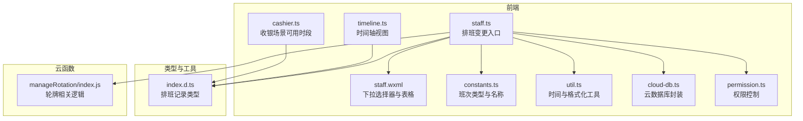
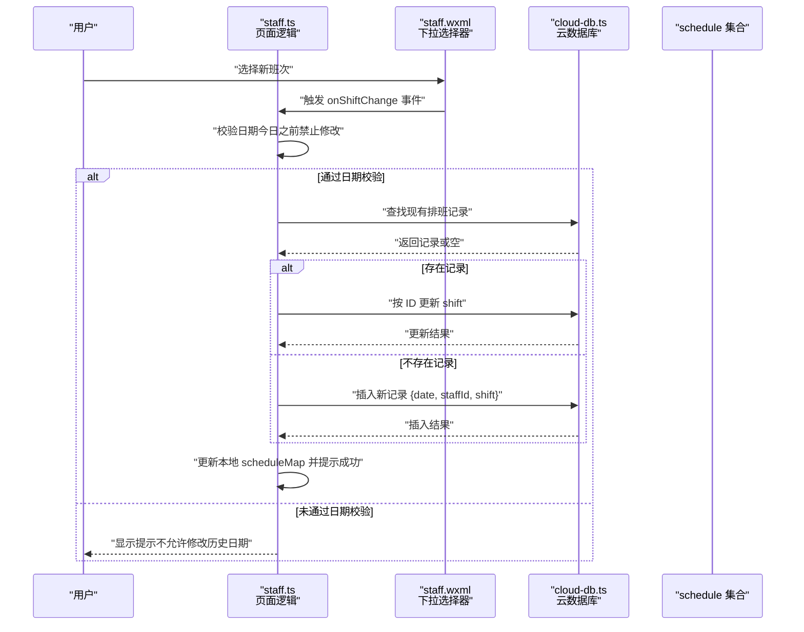
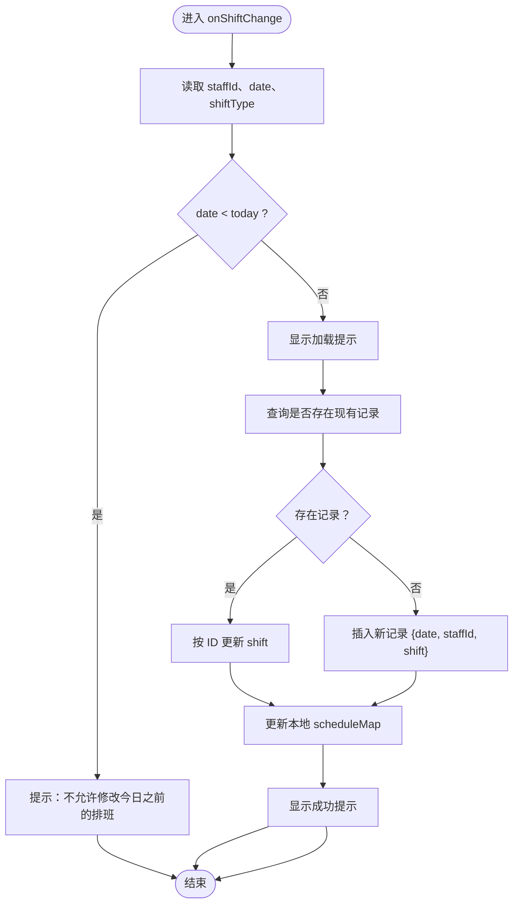
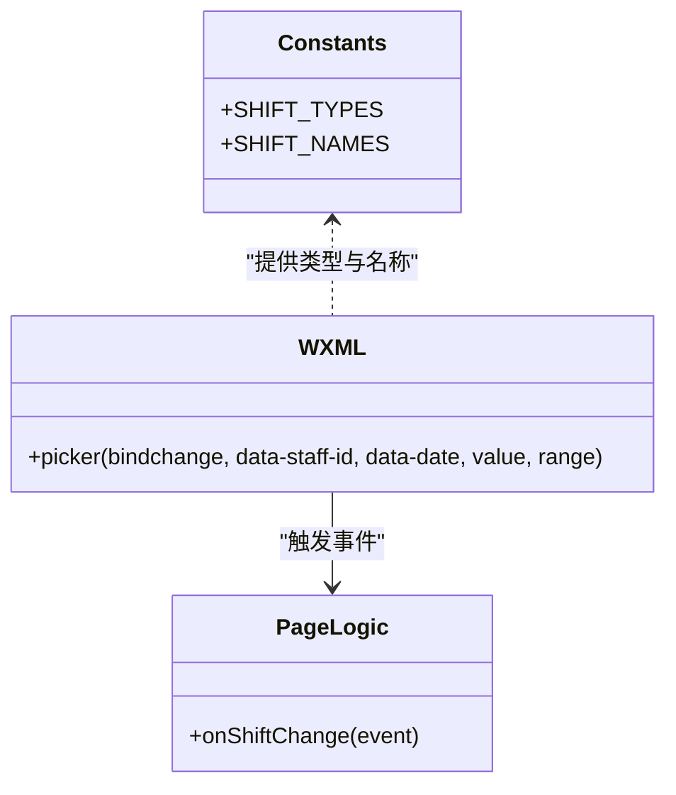
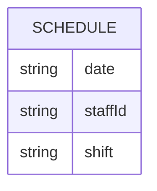
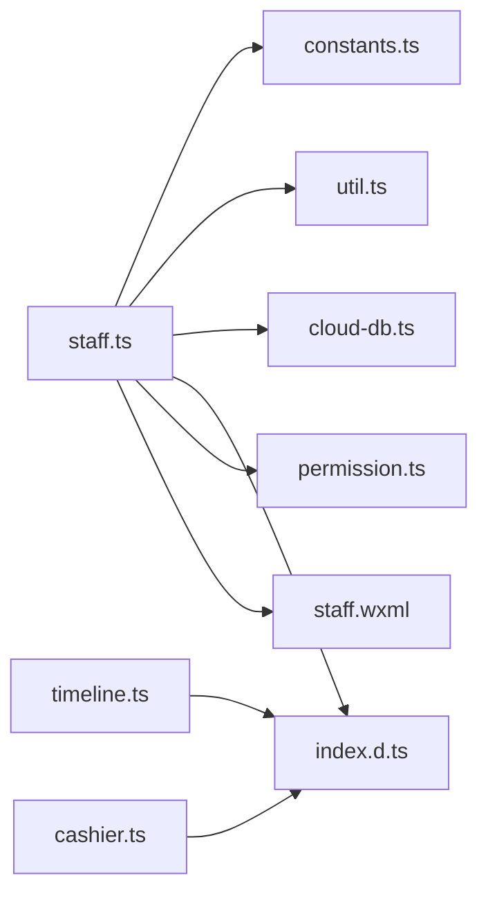

# 班次变更操作

<cite>
**本文引用的文件**
- [staff.ts](file://miniprogram/pages/staff/staff.ts)
- [staff.wxml](file://miniprogram/pages/staff/staff.wxml)
- [constants.ts](file://miniprogram/utils/constants.ts)
- [util.ts](file://miniprogram/utils/util.ts)
- [cloud-db.ts](file://miniprogram/utils/cloud-db.ts)
- [index.d.ts](file://typings/index.d.ts)
- [permission.ts](file://miniprogram/utils/permission.ts)
- [timeline.ts](file://miniprogram/components/timeline/timeline.ts)
- [cashier.ts](file://miniprogram/pages/cashier/cashier.ts)
- [index.js](file://cloudfunctions/manageRotation/index.js)
</cite>

## 目录
1. [简介](#简介)
2. [项目结构](#项目结构)
3. [核心组件](#核心组件)
4. [架构总览](#架构总览)
5. [详细组件分析](#详细组件分析)
6. [依赖关系分析](#依赖关系分析)
7. [性能考量](#性能考量)
8. [故障排查指南](#故障排查指南)
9. [结论](#结论)
10. [附录](#附录)

## 简介
本文件围绕“班次变更操作”功能进行系统化技术说明，重点解析前端 onShiftChange 方法的实现逻辑，涵盖班次类型选择、日期校验、覆盖保存机制与数据库更新流程；阐述业务规则（今日之前日期不可修改、覆盖保存、冲突检测）；说明用户交互设计（下拉选择器、实时预览、成功反馈）；解释排班记录数据结构与约束；给出错误处理策略（网络异常、权限不足、数据冲突）；并补充日志与审计建议。

## 项目结构
该功能涉及前端页面、工具函数、类型定义与云函数协同工作：
- 页面层：员工排班页负责展示与交互
- 工具层：常量与工具函数提供班次类型、时间计算等能力
- 数据层：云数据库封装提供 CRUD 能力
- 类型层：TS 类型定义规范排班记录结构
- 权限层：权限控制保障可访问性
- 云函数层：轮牌相关逻辑（与排班联动）

**图表来源**
- [staff.ts](file://miniprogram/pages/staff/staff.ts#L117-L174)
- [staff.wxml](file://miniprogram/pages/staff/staff.wxml#L60-L68)
- [constants.ts](file://miniprogram/utils/constants.ts#L24-L48)
- [util.ts](file://miniprogram/utils/util.ts#L19-L24)
- [cloud-db.ts](file://miniprogram/utils/cloud-db.ts#L108-L131)
- [index.d.ts](file://typings/index.d.ts#L98-L106)
- [permission.ts](file://miniprogram/utils/permission.ts#L149-L173)
- [timeline.ts](file://miniprogram/components/timeline/timeline.ts#L66-L211)
- [cashier.ts](file://miniprogram/pages/cashier/cashier.ts#L373-L411)
- [index.js](file://cloudfunctions/manageRotation/index.js#L1-L36)

**章节来源**
- [staff.ts](file://miniprogram/pages/staff/staff.ts#L1-L460)
- [staff.wxml](file://miniprogram/pages/staff/staff.wxml#L1-L244)
- [constants.ts](file://miniprogram/utils/constants.ts#L1-L48)
- [util.ts](file://miniprogram/utils/util.ts#L1-L150)
- [cloud-db.ts](file://miniprogram/utils/cloud-db.ts#L1-L321)
- [index.d.ts](file://typings/index.d.ts#L85-L183)
- [permission.ts](file://miniprogram/utils/permission.ts#L1-L194)
- [timeline.ts](file://miniprogram/components/timeline/timeline.ts#L66-L211)
- [cashier.ts](file://miniprogram/pages/cashier/cashier.ts#L373-L411)
- [index.js](file://cloudfunctions/manageRotation/index.js#L1-L327)

## 核心组件
- 前端页面组件
  - 员工排班页：提供日期列与员工行，每个单元格内含班次下拉选择器
  - 下拉选择器：绑定 change 事件，触发 onShiftChange
- 工具与常量
  - 班次类型与名称映射：支持早班、晚班、休息、请假
  - 时间格式化与比较工具：用于日期与时间处理
- 数据访问层
  - 云数据库封装：提供查询、插入、更新、删除等通用能力
- 类型定义
  - 排班记录：包含 date、staffId、shift 字段
- 权限控制
  - 页面与按钮级权限校验，确保具备“管理排班”权限方可操作
- 云函数
  - 轮牌相关逻辑（与排班联动），为排班变更后的轮牌调度提供支撑

**章节来源**
- [staff.ts](file://miniprogram/pages/staff/staff.ts#L117-L174)
- [staff.wxml](file://miniprogram/pages/staff/staff.wxml#L60-L68)
- [constants.ts](file://miniprogram/utils/constants.ts#L24-L48)
- [util.ts](file://miniprogram/utils/util.ts#L19-L24)
- [cloud-db.ts](file://miniprogram/utils/cloud-db.ts#L108-L131)
- [index.d.ts](file://typings/index.d.ts#L98-L106)
- [permission.ts](file://miniprogram/utils/permission.ts#L149-L173)
- [index.js](file://cloudfunctions/manageRotation/index.js#L1-L36)

## 架构总览
班次变更从用户交互到数据持久化的整体流程如下：

**图表来源**
- [staff.ts](file://miniprogram/pages/staff/staff.ts#L117-L174)
- [staff.wxml](file://miniprogram/pages/staff/staff.wxml#L60-L68)
- [cloud-db.ts](file://miniprogram/utils/cloud-db.ts#L108-L131)

**章节来源**
- [staff.ts](file://miniprogram/pages/staff/staff.ts#L117-L174)
- [staff.wxml](file://miniprogram/pages/staff/staff.wxml#L60-L68)
- [cloud-db.ts](file://miniprogram/utils/cloud-db.ts#L108-L131)

## 详细组件分析

### onShiftChange 方法实现逻辑
- 输入参数
  - 事件对象包含当前行的 staffId 与列的 date
  - 事件详情包含下拉框选中的索引，映射到班次类型数组
- 日期校验
  - 若所选日期早于今日，则阻止变更并提示
- 覆盖保存
  - 先查询是否存在同 staffId 且同 date 的记录
  - 若存在则按 ID 更新；否则新增一条记录
- 界面更新与反馈
  - 成功后更新本地 scheduleMap 对应项，即时显示新标签
  - 显示成功提示；失败时隐藏加载并提示失败

**图表来源**
- [staff.ts](file://miniprogram/pages/staff/staff.ts#L117-L174)
- [cloud-db.ts](file://miniprogram/utils/cloud-db.ts#L108-L131)

**章节来源**
- [staff.ts](file://miniprogram/pages/staff/staff.ts#L117-L174)
- [cloud-db.ts](file://miniprogram/utils/cloud-db.ts#L108-L131)

### 班次类型与下拉选择器
- 班次类型
  - 支持：早班、晚班、休息、请假
  - 名称映射用于 UI 展示
- 选择器
  - 每个日期单元格内嵌 picker，绑定 change 事件
  - 通过 data-* 属性传递 staffId 与 date
  - value 绑定当前记录的索引，range 绑定名称数组

**图表来源**
- [constants.ts](file://miniprogram/utils/constants.ts#L24-L48)
- [staff.wxml](file://miniprogram/pages/staff/staff.wxml#L60-L68)
- [staff.ts](file://miniprogram/pages/staff/staff.ts#L117-L174)

**章节来源**
- [constants.ts](file://miniprogram/utils/constants.ts#L24-L48)
- [staff.wxml](file://miniprogram/pages/staff/staff.wxml#L60-L68)
- [staff.ts](file://miniprogram/pages/staff/staff.ts#L117-L174)

### 排班记录数据结构与约束
- 数据结构
  - date: string（YYYY-MM-DD）
  - staffId: string
  - shift: ShiftType（早班/晚班/休息/请假）
- 约束
  - 同一 staffId + date 的组合在同一集合中唯一（由覆盖保存策略保证）
  - 业务上禁止修改今日之前的记录
  - UI 上通过禁用或提示限制不可操作

**图表来源**
- [index.d.ts](file://typings/index.d.ts#L98-L106)

**章节来源**
- [index.d.ts](file://typings/index.d.ts#L98-L106)

### 用户交互设计
- 下拉选择器：直观切换班次，即时生效
- 实时预览：更新本地 scheduleMap，UI 立即反映
- 成功反馈：成功后显示成功提示，失败显示失败提示
- 日期范围：仅允许选择今日及之后日期（通过校验与禁用策略实现）

**章节来源**
- [staff.ts](file://miniprogram/pages/staff/staff.ts#L117-L174)
- [staff.wxml](file://miniprogram/pages/staff/staff.wxml#L60-L68)

### 业务规则与冲突检测
- 今日之前日期禁止修改
  - 在前端进行日期比较，早于今日直接拦截
- 覆盖保存机制
  - 查询是否存在同 staffId + date 的记录
  - 存在则更新，不存在则插入
- 冲突检测
  - 当前实现基于“同一 staffId + date”的唯一性，未见显式并发冲突处理
  - 如需更强一致性，可在数据库层面建立复合索引并在云函数侧做幂等写入

**章节来源**
- [staff.ts](file://miniprogram/pages/staff/staff.ts#L117-L174)
- [cloud-db.ts](file://miniprogram/utils/cloud-db.ts#L108-L131)

### 错误处理策略
- 网络异常
  - 云数据库封装对异常进行捕获并返回空或布尔值
  - 页面层在 try/catch 中统一提示
- 权限不足
  - 页面与按钮权限校验，无权限时提示并回退
- 数据冲突
  - 前端通过覆盖保存避免重复插入
  - 可结合数据库唯一索引与云函数幂等写法进一步强化

**章节来源**
- [cloud-db.ts](file://miniprogram/utils/cloud-db.ts#L108-L131)
- [permission.ts](file://miniprogram/utils/permission.ts#L149-L173)

### 日志与审计建议
- 建议在数据库侧为 schedule 集合增加审计字段（如操作人、操作时间、变更前/后值）
- 建议在云函数侧记录关键操作（如 onShiftChange 触发、更新/插入行为）
- 建议在前端埋点记录用户操作（如选择班次、成功/失败提示）

## 依赖关系分析
- 页面依赖
  - constants.ts 提供班次类型与名称
  - util.ts 提供日期格式化与时间工具
  - cloud-db.ts 提供数据库 CRUD 封装
  - index.d.ts 提供排班记录类型定义
  - permission.ts 提供权限校验
- 组件与视图
  - staff.wxml 定义下拉选择器与表格布局
  - timeline.ts 与 cashier.ts 展示时间轴与可用时段，辅助理解班次边界

**图表来源**
- [staff.ts](file://miniprogram/pages/staff/staff.ts#L1-L460)
- [constants.ts](file://miniprogram/utils/constants.ts#L24-L48)
- [util.ts](file://miniprogram/utils/util.ts#L19-L24)
- [cloud-db.ts](file://miniprogram/utils/cloud-db.ts#L108-L131)
- [index.d.ts](file://typings/index.d.ts#L98-L106)
- [permission.ts](file://miniprogram/utils/permission.ts#L149-L173)
- [staff.wxml](file://miniprogram/pages/staff/staff.wxml#L60-L68)
- [timeline.ts](file://miniprogram/components/timeline/timeline.ts#L66-L211)
- [cashier.ts](file://miniprogram/pages/cashier/cashier.ts#L373-L411)

**章节来源**
- [staff.ts](file://miniprogram/pages/staff/staff.ts#L1-L460)
- [staff.wxml](file://miniprogram/pages/staff/staff.wxml#L1-L244)
- [constants.ts](file://miniprogram/utils/constants.ts#L1-L48)
- [util.ts](file://miniprogram/utils/util.ts#L1-L150)
- [cloud-db.ts](file://miniprogram/utils/cloud-db.ts#L1-L321)
- [index.d.ts](file://typings/index.d.ts#L85-L183)
- [permission.ts](file://miniprogram/utils/permission.ts#L1-L194)
- [timeline.ts](file://miniprogram/components/timeline/timeline.ts#L66-L211)
- [cashier.ts](file://miniprogram/pages/cashier/cashier.ts#L373-L411)

## 性能考量
- 前端
  - 本地 scheduleMap 更新避免频繁网络请求
  - 一次性加载近期日期范围内的排班，减少查询压力
- 数据库
  - 建议在 schedule 集合上建立复合索引（staffId + date），提升查询与去重效率
- 云函数
  - 轮牌相关逻辑已做初始化与优先级计算，排班变更后可触发轮牌重建或调整

[本节为通用建议，无需特定文件引用]

## 故障排查指南
- 无法修改历史日期
  - 检查日期比较逻辑与 today 变量来源
  - 确认页面未对历史日期启用选择器
- 更新失败
  - 检查云数据库封装的返回值与异常捕获
  - 确认网络状态与权限
- 权限问题
  - 检查页面与按钮权限映射
  - 确认当前角色具备“管理排班”权限

**章节来源**
- [staff.ts](file://miniprogram/pages/staff/staff.ts#L117-L174)
- [cloud-db.ts](file://miniprogram/utils/cloud-db.ts#L108-L131)
- [permission.ts](file://miniprogram/utils/permission.ts#L149-L173)

## 结论
本功能以简洁的覆盖保存策略实现了班次变更，前端通过下拉选择器与本地状态更新提供良好体验。建议在数据库层面完善唯一性约束与审计字段，并在云函数侧增强幂等与冲突处理能力，以进一步提升一致性与可观测性。

## 附录
- 相关接口与类型
  - 排班记录类型定义
  - 班次类型与名称映射
  - 云数据库封装方法

**章节来源**
- [index.d.ts](file://typings/index.d.ts#L98-L106)
- [constants.ts](file://miniprogram/utils/constants.ts#L24-L48)
- [cloud-db.ts](file://miniprogram/utils/cloud-db.ts#L108-L131)