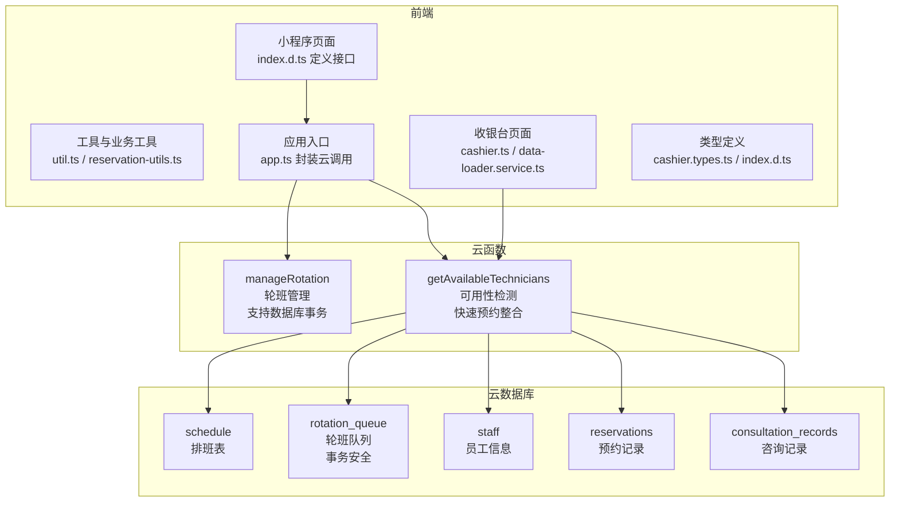
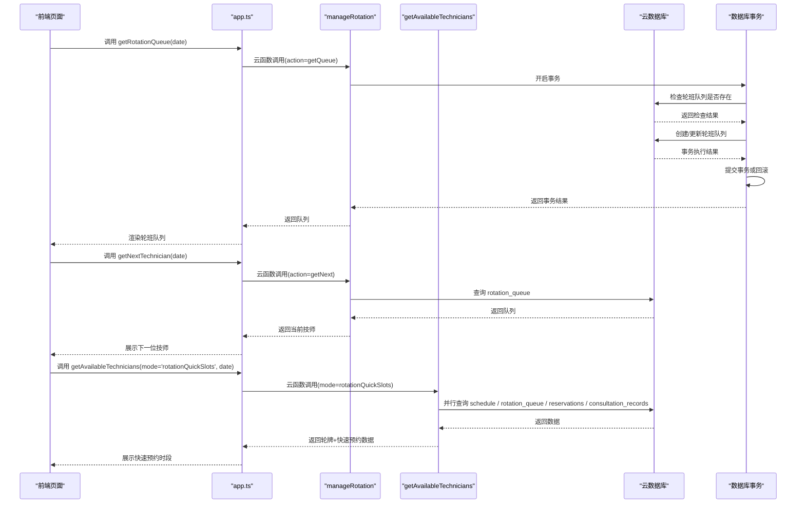
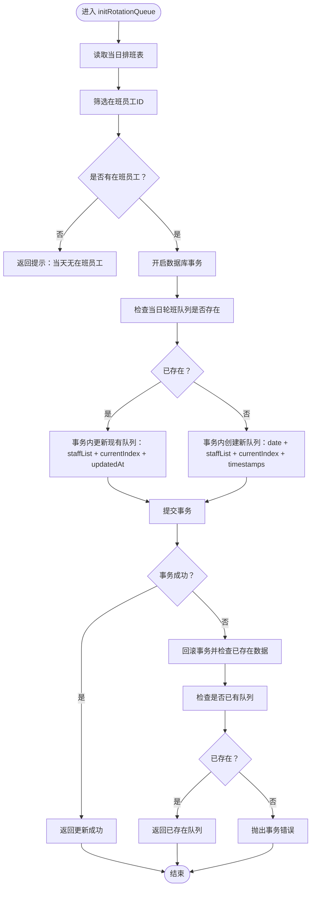
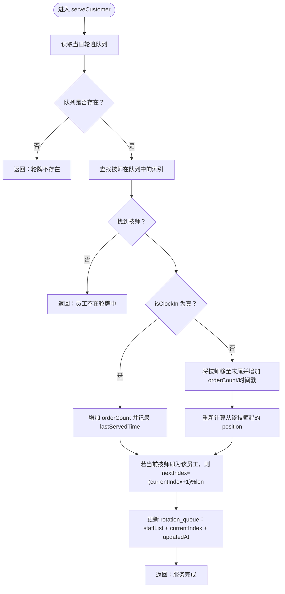
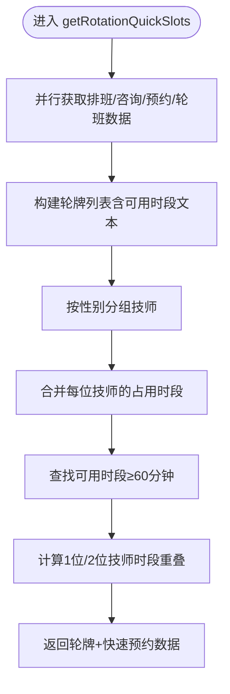
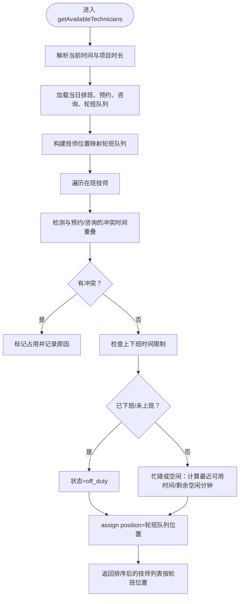
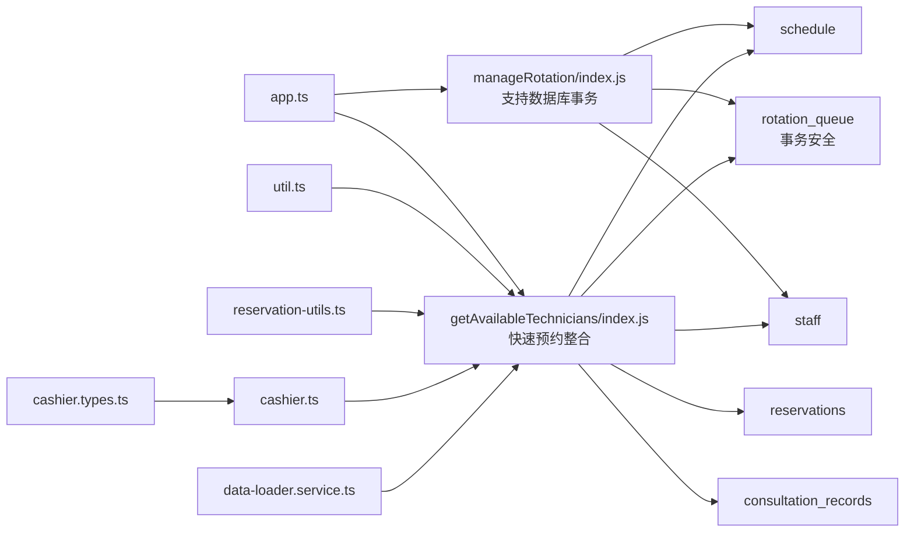

# 轮班管理

<cite>
**本文引用的文件列表**
- [manageRotation/index.js](file://cloudfunctions/manageRotation/index.js)
- [manageRotation/package.json](file://cloudfunctions/manageRotation/package.json)
- [getAvailableTechnicians/index.js](file://cloudfunctions/getAvailableTechnicians/index.js)
- [manageRotation/shared-utils.js](file://cloudfunctions/manageRotation/shared-utils.js)
- [getAvailableTechnicians/shared-utils.js](file://cloudfunctions/getAvailableTechnicians/shared-utils.js)
- [util.ts](file://miniprogram/utils/util.ts)
- [reservation-utils.ts](file://miniprogram/pages/index/utils/reservation-utils.ts)
- [app.ts](file://miniprogram/app.ts)
- [index.d.ts](file://typings/index.d.ts)
- [cashier.ts](file://miniprogram/pages/cashier/cashier.ts)
- [data-loader.service.ts](file://miniprogram/pages/cashier/services/data-loader.service.ts)
- [cashier.types.ts](file://miniprogram/pages/cashier/cashier.types.ts)
- [cashier.wxml](file://miniprogram/pages/cashier/cashier.wxml)
</cite>

## 更新摘要
**变更内容**
- 新增数据库事务支持：在智能队列初始化中使用事务防止并发访问冲突，确保数据一致性
- 改进智能队列初始化逻辑：通过事务检查和创建/更新轮班队列，避免重复数据创建
- 增强快速预约功能集成：通过`getRotationQuickSlots`模式提供轮牌+快速预约数据的整合
- 优化并发控制：通过事务回滚处理并发冲突，提高系统稳定性
- 改进数据一致性：确保轮班队列的原子性操作，避免竞态条件

## 目录
1. [简介](#简介)
2. [项目结构](#项目结构)
3. [核心组件](#核心组件)
4. [架构总览](#架构总览)
5. [详细组件分析](#详细组件分析)
6. [依赖关系分析](#依赖关系分析)
7. [性能考量](#性能考量)
8. [故障排查指南](#故障排查指南)
9. [结论](#结论)
10. [附录](#附录)

## 简介
本技术文档围绕"轮班管理"云函数展开，重点解析 manageRotation 云函数的轮班算法与调度逻辑，涵盖以下方面：
- 轮班规则配置：班次类型、工作时长、休息间隔等参数化配置
- 智能队列初始化：基于现有轮班队列状态的动态创建与更新机制，现已支持数据库事务
- 自动排班生成：基于排班表与历史轮班队列的优先级计算与初始化
- 冲突自动调整机制：基于可用性检测的时间重叠、连续工作与强制休息规则
- 核心逻辑：技师工作量均衡、休息时间保证、特殊需求处理
- 调度算法：贪心策略与位置调整的组合应用
- 监控与报告：通过轮班队列状态与可用性接口进行可视化与统计
- 异常处理与手动干预：错误返回码、边界条件与人工干预入口
- **新增功能**：数据库事务支持，防止并发访问冲突；快速预约系统集成，支持多技师可用性计算和性别要求考虑

## 项目结构
该模块位于云开发云函数目录下，前端通过小程序云调用访问云函数，后端依赖云数据库集合进行数据读写。

**图表来源**
- [manageRotation/index.js:1-356](file://cloudfunctions/manageRotation/index.js#L1-L356)
- [getAvailableTechnicians/index.js:1-632](file://cloudfunctions/getAvailableTechnicians/index.js#L1-L632)
- [util.ts:1-140](file://miniprogram/utils/util.ts#L1-L140)
- [reservation-utils.ts:1-173](file://miniprogram/pages/index/utils/reservation-utils.ts#L1-L173)
- [app.ts:1-191](file://miniprogram/app.ts#L1-L191)
- [index.d.ts:318-327](file://typings/index.d.ts#L318-L327)
- [cashier.ts:1-543](file://miniprogram/pages/cashier/cashier.ts#L1-L543)
- [data-loader.service.ts:1-194](file://miniprogram/pages/cashier/services/data-loader.service.ts#L1-L194)

## 核心组件
- manageRotation 云函数：负责轮班队列的智能初始化、获取下一个技师、服务完成后的队列更新、队列位置调整等操作。**新增**：支持数据库事务，确保数据一致性。
- getAvailableTechnicians 云函数：根据日期、当前时间、项目时长等参数，结合轮班队列与预约/咨询记录，判断技师是否可用，并返回状态与可空闲时长。**新增**：通过`getRotationQuickSlots`模式提供轮牌+快速预约数据整合。
- **新增**：数据库事务支持：使用`startTransaction()`、`commit()`、`rollback()`确保并发安全。
- 前端工具与页面：封装云调用、解析项目时长、计算加班单位、时间重叠判断等，用于预约匹配与界面展示。

**章节来源**
- [manageRotation/index.js:9-38](file://cloudfunctions/manageRotation/index.js#L9-L38)
- [getAvailableTechnicians/index.js:9-27](file://cloudfunctions/getAvailableTechnicians/index.js#L9-L27)
- [util.ts:1-140](file://miniprogram/utils/util.ts#L1-L140)
- [reservation-utils.ts:1-173](file://miniprogram/pages/index/utils/reservation-utils.ts#L1-L173)
- [app.ts:110-191](file://miniprogram/app.ts#L110-L191)
- [cashier.ts:115-122](file://miniprogram/pages/cashier/cashier.ts#L115-L122)

## 架构总览
轮班管理采用"云函数 + 数据库事务 + 数据库"的轻量架构：
- manageRotation 负责维护每日轮班队列，依据排班表与历史队列计算优先级，支持智能初始化与更新，支持点钟与服务完成后的队列推进。**新增**：通过数据库事务确保队列创建/更新的原子性。
- getAvailableTechnicians 负责实时可用性检测，综合考虑轮班队列中的相对位置、预约/咨询时间冲突、上下班时间限制等，输出技师可用状态。**新增**：通过`getRotationQuickSlots`模式提供轮牌+快速预约数据整合。
- **新增**：数据库事务机制：在智能队列初始化中使用事务防止并发冲突，确保数据一致性。
- 前端通过 app.ts 的封装方法调用云函数，实现预约匹配、轮班查看与手动干预。

**图表来源**
- [manageRotation/index.js:121-180](file://cloudfunctions/manageRotation/index.js#L121-L180)
- [getAvailableTechnicians/index.js:393-502](file://cloudfunctions/getAvailableTechnicians/index.js#L393-L502)
- [app.ts:110-191](file://miniprogram/app.ts#L110-L191)

## 详细组件分析

### manageRotation 云函数
- 功能概览
  - 智能初始化轮班队列：检查当日轮班队列是否存在，存在则更新现有队列，不存在则创建新队列，避免重复数据。**新增**：通过数据库事务确保原子性。
  - 获取下一个技师：若队列不存在则先智能初始化，返回当前队列指针指向的技师。
  - 服务完成：支持"点钟入"与"服务完成"两种场景，更新技师服务次数与位置，推进队列指针。
  - 获取轮班队列：若不存在则智能初始化并返回。
  - 调整位置：支持手动调整队列中技师的相对顺序，保持 position 连续性。
  - 时间转换：提供将 HH:mm 字符串转换为分钟数的辅助函数。

- 关键流程图（智能初始化队列 - 新增事务支持）

**图表来源**
- [manageRotation/index.js:121-180](file://cloudfunctions/manageRotation/index.js#L121-L180)

- 关键流程图（服务完成与队列推进）

**图表来源**
- [manageRotation/index.js:219-280](file://cloudfunctions/manageRotation/index.js#L219-L280)

**章节来源**
- [manageRotation/index.js:40-356](file://cloudfunctions/manageRotation/index.js#L40-L356)

### getAvailableTechnicians 云函数
- 功能概览
  - **新增**：快速预约时段计算模式（mode='rotationQuickSlots'）：支持1位/2位技师的可用时段重叠分析，考虑性别要求。
  - 可用性检测模式：基于日期、当前时间、项目时长等参数，结合轮班队列与预约/咨询记录，判断技师是否可用。
  - **新增**：轮牌+快速预约时段整合：一次性获取轮牌列表和快速预约时段，提高前端性能。

- 关键流程图（快速预约时段计算）

**图表来源**
- [getAvailableTechnicians/index.js:393-502](file://cloudfunctions/getAvailableTechnicians/index.js#L393-L502)

- 关键流程图（可用性检测与冲突判断）

**图表来源**
- [getAvailableTechnicians/index.js:18-156](file://cloudfunctions/getAvailableTechnicians/index.js#L18-L156)
- [getAvailableTechnicians/index.js:556-632](file://cloudfunctions/getAvailableTechnicians/index.js#L556-L632)

**章节来源**
- [getAvailableTechnicians/index.js:1-632](file://cloudfunctions/getAvailableTechnicians/index.js#L1-L632)

### 数据库事务支持
**更新** 新增数据库事务支持，防止并发访问冲突，确保数据一致性

- 事务支持核心逻辑
  - **事务开启**：在智能队列初始化前使用`startTransaction()`开启数据库事务
  - **双重检查**：在事务内部再次检查轮班队列是否存在，避免竞态条件
  - **原子操作**：通过事务确保创建或更新操作的原子性
  - **错误处理**：事务失败时自动回滚，并检查是否已有队列存在
  - **并发控制**：防止多个请求同时创建相同日期的轮班队列

- 关键实现细节
  - 使用`await db.startTransaction()`创建事务实例
  - 在事务内部执行`where`查询检查队列存在性
  - 使用`await transaction.commit()`提交事务或`await transaction.rollback()`回滚
  - 事务失败时检查`existingQueue.data.length > 0`返回已存在数据
  - 统一的`updatedAt`时间戳更新机制

- 优势
  - **防止竞态条件**：确保同一时间只有一个请求能创建/更新轮班队列
  - **数据一致性**：避免部分更新导致的数据不一致
  - **提高可靠性**：通过回滚机制处理并发冲突
  - **增强稳定性**：减少重复数据和并发访问问题

**章节来源**
- [manageRotation/index.js:121-180](file://cloudfunctions/manageRotation/index.js#L121-L180)

### 快速预约功能集成
**更新** 增强快速预约功能集成，通过`getRotationQuickSlots`模式提供轮牌+快速预约数据整合

- 快速预约核心逻辑
  - **多技师可用性计算**：支持1位和2位技师的可用时段重叠分析
  - **性别要求考虑**：按性别分组技师，支持男性/女性专用时段
  - **时段重叠算法**：计算两位技师同时可用的时段，确保服务质量和客户体验
  - **前端集成**：通过一次性云函数调用获取轮牌和快速预约数据

- 关键实现细节
  - 使用 `buildQuickReservationSlots` 函数处理多技师时段计算
  - 支持 `oneMale`、`oneFemale`、`twoMale`、`twoFemale` 四种性别/人数组合
  - 通过 `mergeTimeRanges` 合并技师的占用时段，避免重复计算
  - 使用 `findAllAvailableSlots` 计算可用时段，确保至少60分钟的有效服务时间

- 优势
  - **提高效率**：一次性获取轮牌和快速预约数据，减少前端请求次数
  - **增强体验**：支持性别要求和多技师协作，满足不同客户需求
  - **简化操作**：提供一键复制预约时段功能，提高预约效率

**章节来源**
- [getAvailableTechnicians/index.js:238-502](file://cloudfunctions/getAvailableTechnicians/index.js#L238-L502)
- [cashier.ts:218-250](file://miniprogram/pages/cashier/cashier.ts#L218-L250)
- [data-loader.service.ts:134-194](file://miniprogram/pages/cashier/services/data-loader.service.ts#L134-L194)

### 智能队列初始化机制
**更新** 改进智能队列初始化逻辑，通过数据库事务确保数据一致性

- 智能初始化核心逻辑
  - **存在性检查**：在创建新队列前，先检查目标日期的轮班队列是否存在
  - **条件分支**：根据检查结果决定是更新现有队列还是创建新队列
  - **数据一致性**：避免重复创建相同日期的轮班队列，确保数据唯一性
  - **事务保障**：通过数据库事务确保操作的原子性和并发安全性

- 关键实现细节
  - 使用 `existingQueue.data.length > 0` 判断队列存在性
  - 存在时使用 `update` 方法更新现有文档
  - 不存在时使用 `add` 方法创建新文档
  - 统一的 `updatedAt` 时间戳更新机制
  - **新增**：事务回滚处理并发冲突

- 优势
  - **避免重复数据**：防止同一天多次创建相同的轮班队列
  - **提高性能**：减少不必要的数据库操作
  - **增强稳定性**：确保轮班队列数据的一致性和完整性
  - **并发安全**：通过事务防止竞态条件

**章节来源**
- [manageRotation/index.js:121-180](file://cloudfunctions/manageRotation/index.js#L121-L180)

### 轮班规则与配置
- 班次类型与时间
  - 支持 morning/evening/overtime 三种班次，分别对应不同的上下班起止时间。
  - 上下班时间由常量映射提供，用于判断"已下班/未上班"与"最近可用时间"。

- 工作时长与准备时间
  - 项目时长通过项目名称中的"Xmin"解析；另有固定准备时间（分钟），用于计算项目结束时间与可用空隙。

- 休息间隔与强制休息
  - 当前实现未显式配置强制休息时长；通过"轮班队列位置"与"orderCount"间接体现休息与轮转，避免同一人连续服务。

- 特殊需求处理
  - 前端预约匹配会根据性别要求选择合适技师，并结合可用性检测与轮班队列位置进行综合评估。
  - **新增**：快速预约功能支持多技师协作，满足复杂服务需求。

**章节来源**
- [getAvailableTechnicians/shared-utils.js:11-24](file://cloudfunctions/getAvailableTechnicians/shared-utils.js#L11-L24)
- [util.ts:1-140](file://miniprogram/utils/util.ts#L1-L140)
- [reservation-utils.ts:67-145](file://miniprogram/pages/index/utils/reservation-utils.ts#L67-L145)

### 调度算法与策略
- 智能初始化阶段：贪心优先级策略 + 存在性检查 + 事务保障
  - **优先级规则**：班次类型（早班优先）、昨日是否在班（未在班则加分）、昨日队列排名对今日权重的影响（基于 orderCount）。
  - **智能检查**：在排序前检查现有队列，避免重复创建。
  - **事务保障**：通过数据库事务确保队列创建/更新的原子性。
  - **排序后分配**：按序分配 position，形成初始轮班队列。

- 服务阶段：队列推进与位置调整
  - 点钟入：仅增加服务次数与时间戳，不改变相对位置。
  - 服务完成：将技师移至队列末尾，重新计算其后所有技师的 position，确保轮转公平。
  - 手动调整：允许管理员调整技师在队列中的相对位置，满足临时需求。

- 可用性检测：冲突检测与空闲窗口
  - 时间重叠检测：基于开始/结束时间的区间重叠判断。
  - 空闲窗口：计算"最近可用时间"与"剩余空闲分钟"，用于展示与后续安排。
  - **新增**：快速预约时段计算：支持1位/2位技师的可用时段重叠分析。

**章节来源**
- [manageRotation/index.js:76-121](file://cloudfunctions/manageRotation/index.js#L76-L121)
- [manageRotation/index.js:219-280](file://cloudfunctions/manageRotation/index.js#L219-L280)
- [getAvailableTechnicians/index.js:83-149](file://cloudfunctions/getAvailableTechnicians/index.js#L83-L149)
- [getAvailableTechnicians/index.js:238-502](file://cloudfunctions/getAvailableTechnicians/index.js#L238-L502)

### 监控与报告
- 轮班队列状态
  - 通过 getQueue 与 getNext 获取当前队列与下一位技师，便于前台展示与统计。
- 可用性报告
  - getAvailableTechnicians 返回技师状态、最近可用时间、剩余空闲分钟等，可用于生成可用性报表。
- **新增**：快速预约时段报告
  - getRotationQuickSlots 返回轮牌列表和快速预约时段，支持1位/2位技师的可用性分析。
- **新增**：事务监控
  - 通过事务提交/回滚状态监控并发访问情况，确保数据一致性。
- 前端集成
  - app.ts 提供统一的云函数调用封装，便于在页面中直接调用并渲染结果。

**章节来源**
- [manageRotation/index.js:282-306](file://cloudfunctions/manageRotation/index.js#L282-L306)
- [getAvailableTechnicians/index.js:156-156](file://cloudfunctions/getAvailableTechnicians/index.js#L156-L156)
- [getAvailableTechnicians/index.js:393-502](file://cloudfunctions/getAvailableTechnicians/index.js#L393-L502)
- [app.ts:110-191](file://miniprogram/app.ts#L110-L191)

### 异常处理与手动干预
- 错误返回码
  - 通用错误：未知操作、操作失败等，返回 code=-1 与错误消息。
  - 业务错误：轮牌不存在、员工不在轮牌中、索引无效等，返回相应提示。
  - **新增**：事务错误：并发冲突导致的事务失败，自动回滚并检查已存在数据。
- 边界条件
  - 队列为空、无在班员工、日期跨天等情况均有明确分支处理。
  - **新增**：事务回滚边界：检查是否存在已创建的队列。
- 手动干预
  - adjustPosition 允许管理员调整队列顺序，以应对突发情况或特殊需求。

**章节来源**
- [manageRotation/index.js:26-38](file://cloudfunctions/manageRotation/index.js#L26-L38)
- [manageRotation/index.js:219-240](file://cloudfunctions/manageRotation/index.js#L219-L240)
- [manageRotation/index.js:308-349](file://cloudfunctions/manageRotation/index.js#L308-L349)

## 依赖关系分析
- 云函数依赖
  - manageRotation 依赖云数据库的 schedule、rotation_queue、staff 集合。**新增**：支持数据库事务。
  - getAvailableTechnicians 依赖 schedule、rotation_queue、staff、reservations、consultation_records 集合。**新增**：通过`getRotationQuickSlots`模式提供轮牌+快速预约数据整合。
- 前端依赖
  - app.ts 封装云函数调用，提供 getRotationQueue、getNextTechnician、serveCustomer、adjustRotationPosition 等方法。
  - util.ts 提供时间解析、项目时长解析、加班单位计算等工具。
  - reservation-utils.ts 使用 getAvailableTechnicians 与轮班队列进行预约匹配与性别要求处理。
  - **新增**：cashier.ts 和 data-loader.service.ts 通过 getRotationQuickSlots 获取快速预约数据。

**图表来源**
- [manageRotation/index.js:40-180](file://cloudfunctions/manageRotation/index.js#L40-L180)
- [getAvailableTechnicians/index.js:18-502](file://cloudfunctions/getAvailableTechnicians/index.js#L18-L502)
- [app.ts:110-191](file://miniprogram/app.ts#L110-L191)
- [util.ts:1-140](file://miniprogram/utils/util.ts#L1-L140)
- [reservation-utils.ts:1-173](file://miniprogram/pages/index/utils/reservation-utils.ts#L1-L173)
- [cashier.ts:134-166](file://miniprogram/pages/cashier/cashier.ts#L134-L166)
- [data-loader.service.ts:134-194](file://miniprogram/pages/cashier/services/data-loader.service.ts#L134-L194)

**章节来源**
- [manageRotation/index.js:40-180](file://cloudfunctions/manageRotation/index.js#L40-L180)
- [getAvailableTechnicians/index.js:18-502](file://cloudfunctions/getAvailableTechnicians/index.js#L18-L502)
- [app.ts:110-191](file://miniprogram/app.ts#L110-L191)

## 性能考量
- 数据访问
  - 初始化与查询均使用单集合过滤查询，建议在 schedule、rotation_queue、staff 等关键字段建立索引以提升查询效率。
  - **新增优化**：智能队列初始化减少了重复的数据库写操作，提高了整体性能。
  - **新增优化**：快速预约功能通过并行数据加载和一次性云函数调用，显著提升前端响应速度。
  - **新增优化**：数据库事务确保操作的原子性，避免部分更新导致的性能问题。
- 时间复杂度
  - 智能初始化：O(n log n)，主要消耗在排序；n 为在班员工数量。**新增**：事务操作增加常数时间开销。
  - 服务完成：O(n)，涉及数组重排与 position 重算。
  - 可用性检测：O(n*(m+k))，n 为在班技师数，m 为当日预约数，k 为当日咨询数。
  - **新增复杂度**：快速预约时段计算：O(g*s*d)，g 为性别组数（2），s 为每组技师数，d 为平均占用时段数。
  - **新增复杂度**：事务操作：O(1)，事务开启、提交、回滚的常数时间开销。
- 建议优化
  - 对于大规模技师与高并发场景，可引入缓存层（如轮班队列缓存）与分页查询。
  - 在 getAvailableTechnicians 中对时间重叠判断可考虑预排序或二分查找优化。
  - **新增建议**：快速预约功能已通过并行数据加载和一次性调用优化，建议在前端实现数据缓存以进一步提升性能。
  - **新增建议**：事务操作已优化，建议监控事务成功率，必要时调整事务超时设置。

## 故障排查指南
- 常见问题
  - "轮牌不存在"：确认是否已执行智能初始化；若未初始化，调用 getQueue 会触发自动初始化。
  - "员工不在轮牌中"：检查 serveCustomer 的 staffId 是否正确，或是否已被移出队列。
  - "索引无效"：调整位置时 fromIndex/toIndex 越界，需确保在合法范围内。
  - **新增问题**："快速预约数据为空"：检查轮班队列是否存在，确认 getRotationQuickSlots 调用参数正确。
  - **新增问题**："性别要求无法满足"：检查对应性别技师数量，确认快速预约时段计算逻辑。
  - **新增问题**："事务失败"：检查数据库连接状态，确认事务超时设置，查看事务回滚原因。
- 日志与返回码
  - 云函数统一返回 code 与 message，前端可根据 code 判断错误类型并提示用户。
  - **新增**：事务错误包含具体的并发冲突信息，便于调试和监控。
- 建议排查步骤
  - 检查 schedule 与 staff 状态，确保在班员工有效。
  - 检查 rotation_queue 是否存在且结构正确。
  - 使用 getAvailableTechnicians 验证冲突检测逻辑与上下班时间限制。
  - **新增步骤**：验证数据库事务状态，检查事务提交/回滚日志。
  - **新增步骤**：验证快速预约功能，检查 getRotationQuickSlots 返回数据格式。
  - **新增步骤**：确认前端数据加载服务，检查 data-loader.service.ts 的调用链路。

**章节来源**
- [manageRotation/index.js:219-240](file://cloudfunctions/manageRotation/index.js#L219-L240)
- [manageRotation/index.js:308-349](file://cloudfunctions/manageRotation/index.js#L308-L349)
- [getAvailableTechnicians/index.js:156-156](file://cloudfunctions/getAvailableTechnicians/index.js#L156-L156)
- [data-loader.service.ts:134-194](file://miniprogram/pages/cashier/services/data-loader.service.ts#L134-L194)

## 结论
manageRotation 云函数通过"智能优先级 + 贪心排序 + 数据库事务 + 队列推进"的策略实现了高效而实用的轮班管理能力，结合 getAvailableTechnicians 的可用性检测，能够较好地满足日常排班与冲突规避的需求。**最新改进**的数据库事务支持显著提升了系统的并发安全性和数据一致性，通过`startTransaction()`、`commit()`、`rollback()`确保智能队列初始化的原子性操作，有效防止了竞态条件和重复数据创建。**新增的快速预约功能集成**进一步增强了系统的实用性，支持多技师可用性计算和性别要求考虑，通过 getRotationQuickSlots 模式提供了一键预约的便捷体验。对于更复杂的规则（如强制休息、连续工作限制等），可在现有基础上扩展优先级规则与约束条件，同时配合前端的可视化与手动干预能力，进一步提升系统的灵活性与可运维性。

## 附录
- 云函数清单
  - manageRotation：智能轮班队列初始化、获取、服务完成、位置调整，**新增**：数据库事务支持
  - getAvailableTechnicians：技师可用性检测、快速预约时段计算、轮牌+快速预约整合
- 前端接口定义
  - 旋转队列项与可用性项的数据结构定义，便于前后端契约一致
  - **新增**：快速预约时段数据结构，支持1位/2位技师的性别分组
  - **新增**：数据库事务监控指标，用于跟踪并发访问和数据一致性

**章节来源**
- [manageRotation/package.json:1-10](file://cloudfunctions/manageRotation/package.json#L1-L10)
- [index.d.ts:318-327](file://typings/index.d.ts#L318-L327)
- [cashier.types.ts:504-508](file://miniprogram/pages/cashier/cashier.types.ts#L504-L508)