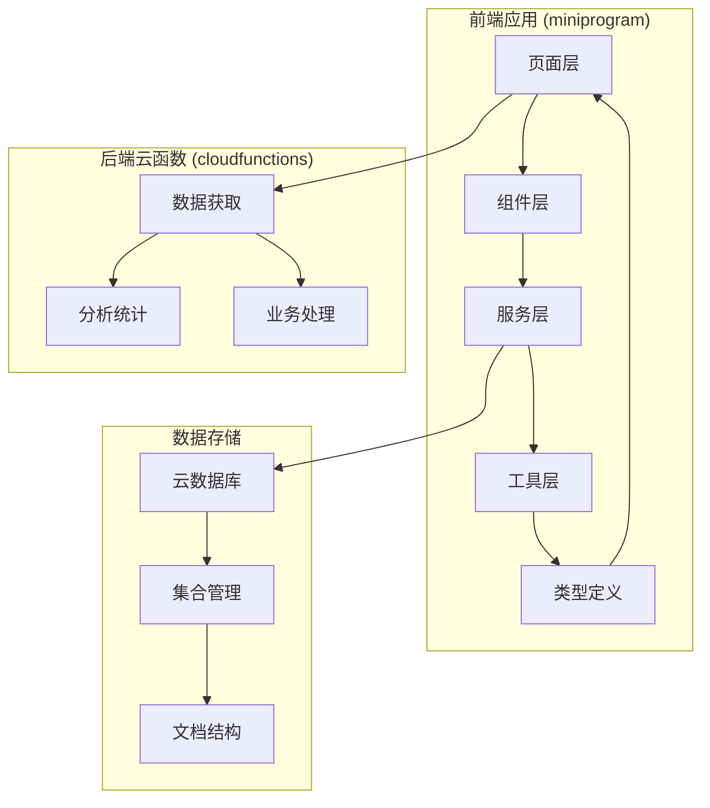
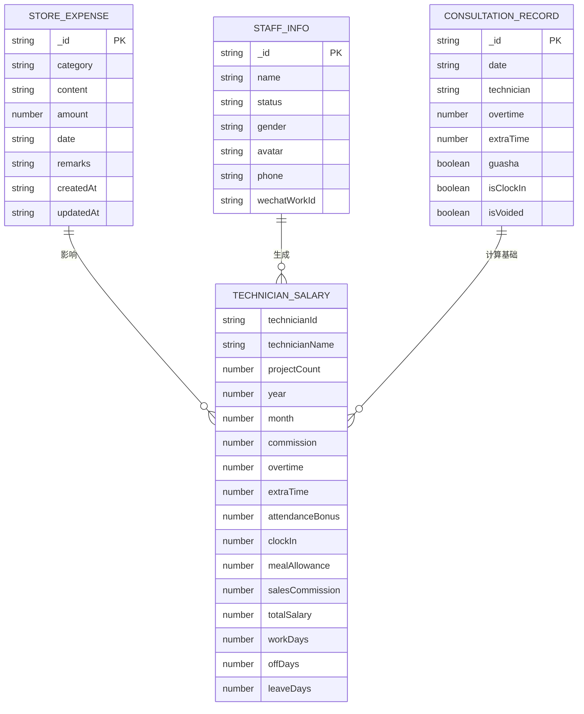
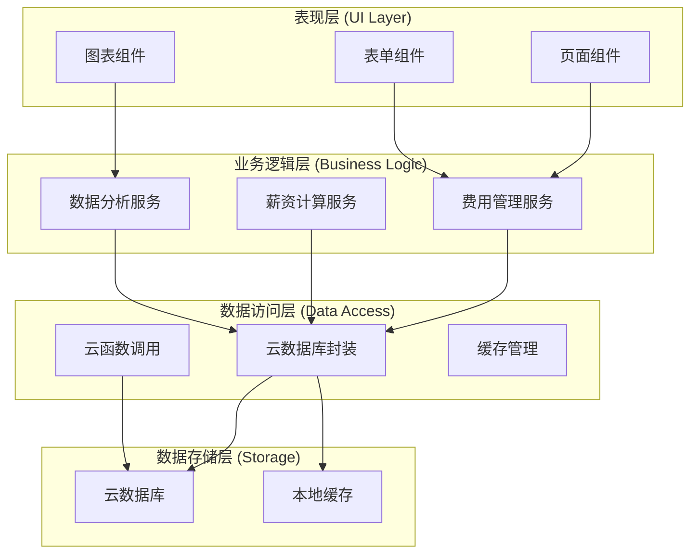
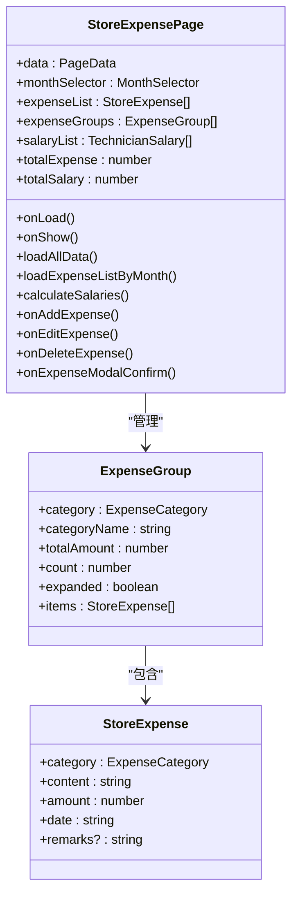
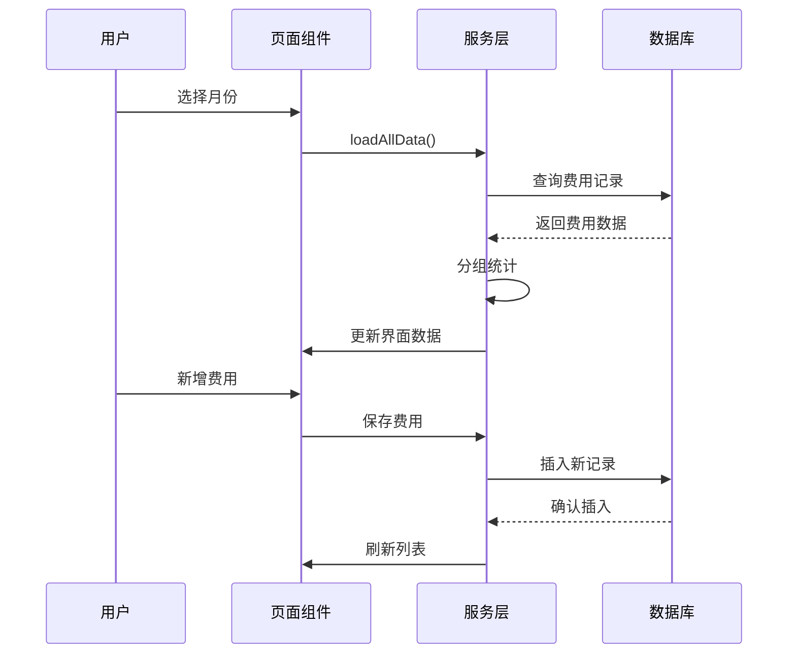
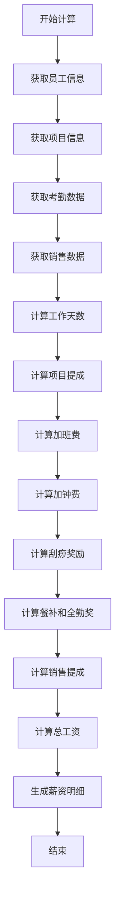
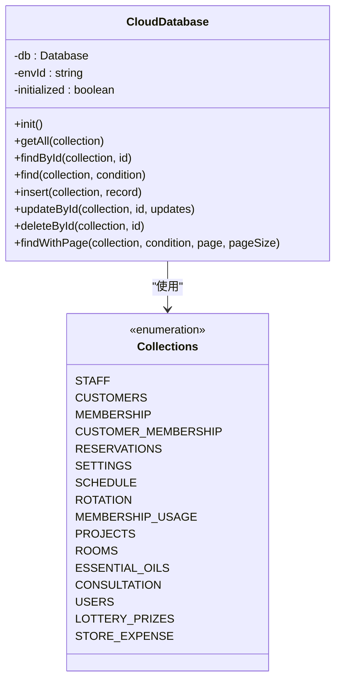
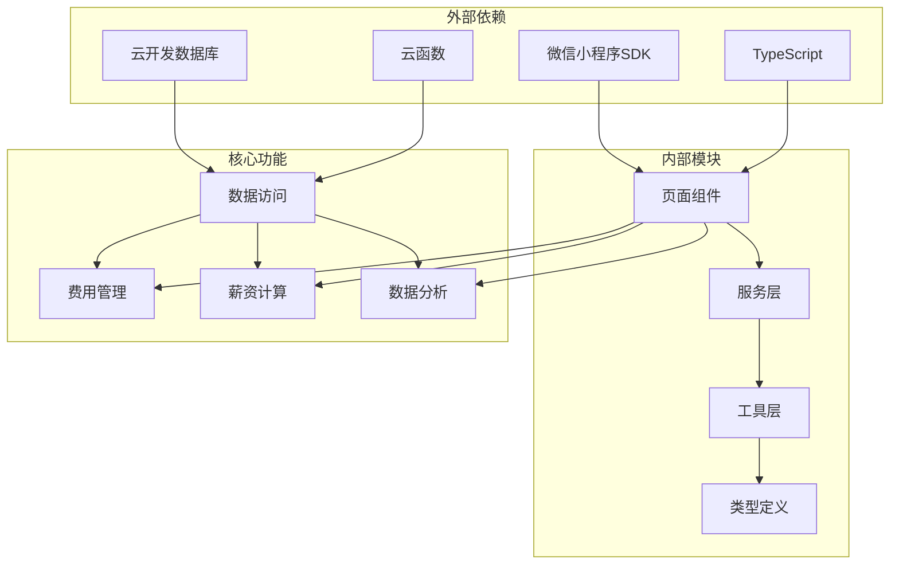

# 门店费用管理系统

<cite>
**本文档引用的文件**
- [store-expense.ts](file://miniprogram/pages/store-expense/store-expense.ts)
- [store-expense.wxml](file://miniprogram/pages/store-expense/store-expense.wxml)
- [store-expense.less](file://miniprogram/pages/store-expense/store-expense.less)
- [cloud-db.ts](file://miniprogram/utils/cloud-db.ts)
- [util.ts](file://miniprogram/utils/util.ts)
- [app.ts](file://miniprogram/app.ts)
- [index.d.ts](file://typings/index.d.ts)
- [getAll/index.js](file://cloudfunctions/getAll/index.js)
- [getAnalytics/index.js](file://cloudfunctions/getAnalytics/index.js)
- [package.json](file://package.json)
</cite>

## 更新摘要
**变更内容**
- 修复了销售佣金分配系统中的数学错误
- 更新了会员记录关联多个销售人员时的佣金分配算法
- 改正了佣金按比例分配的计算逻辑

## 目录
1. [简介](#简介)
2. [项目结构](#项目结构)
3. [核心组件](#核心组件)
4. [架构概览](#架构概览)
5. [详细组件分析](#详细组件分析)
6. [依赖关系分析](#依赖关系分析)
7. [性能考虑](#性能考虑)
8. [故障排除指南](#故障排除指南)
9. [结论](#结论)

## 简介

门店费用管理系统是一个基于微信小程序开发的企业级管理应用，专门用于管理门店的财务收支和员工薪资计算。该系统提供了完整的费用录入、分类统计、薪资计算和数据分析功能，帮助门店管理者实时掌握财务状况和员工绩效。

系统采用前后端分离架构，前端使用TypeScript和WXML构建用户界面，后端通过云函数处理业务逻辑，数据存储在微信云开发数据库中。主要功能包括：

- **费用管理**：支持多种费用类型的录入、编辑、删除和分类统计
- **薪资计算**：自动计算员工工资，包括基本工资、加班费、提成等
- **数据分析**：提供可视化报表和趋势分析
- **多维度筛选**：按时间、类别、人员等多维度查看数据

## 项目结构

该项目采用模块化组织结构，主要分为以下几个部分：



**图表来源**
- [store-expense.ts:1-50](file://miniprogram/pages/store-expense/store-expense.ts#L1-L50)
- [cloud-db.ts:1-50](file://miniprogram/utils/cloud-db.ts#L1-L50)
- [getAll/index.js:1-20](file://cloudfunctions/getAll/index.js#L1-L20)

**章节来源**
- [store-expense.ts:1-50](file://miniprogram/pages/store-expense/store-expense.ts#L1-L50)
- [cloud-db.ts:1-50](file://miniprogram/utils/cloud-db.ts#L1-L50)
- [package.json:1-28](file://package.json#L1-L28)

## 核心组件

### 主要功能模块

系统的核心功能由以下主要模块构成：

1. **费用管理模块**：负责门店各项费用的录入、管理和统计
2. **薪资计算模块**：自动计算员工工资和各种补贴
3. **数据分析模块**：提供多维度的数据分析和可视化
4. **数据访问模块**：封装云数据库操作，提供统一的数据访问接口

### 数据模型

系统使用强类型的数据模型来确保数据的一致性和完整性：



**图表来源**
- [index.d.ts:467-502](file://typings/index.d.ts#L467-L502)
- [index.d.ts:91-99](file://typings/index.d.ts#L91-L99)
- [index.d.ts:74-85](file://typings/index.d.ts#L74-L85)

**章节来源**
- [index.d.ts:467-502](file://typings/index.d.ts#L467-L502)
- [index.d.ts:91-99](file://typings/index.d.ts#L91-L99)
- [index.d.ts:74-85](file://typings/index.d.ts#L74-L85)

## 架构概览

系统采用分层架构设计，确保各层职责清晰、耦合度低：



**图表来源**
- [store-expense.ts:97-153](file://miniprogram/pages/store-expense/store-expense.ts#L97-L153)
- [cloud-db.ts:69-88](file://miniprogram/utils/cloud-db.ts#L69-L88)
- [app.ts:40-66](file://miniprogram/app.ts#L40-L66)

## 详细组件分析

### 费用管理组件

费用管理组件是系统的核心功能之一，提供了完整的费用生命周期管理：

#### 组件架构



**图表来源**
- [store-expense.ts:30-55](file://miniprogram/pages/store-expense/store-expense.ts#L30-L55)
- [store-expense.ts:21-28](file://miniprogram/pages/store-expense/store-expense.ts#L21-L28)
- [index.d.ts:469-475](file://typings/index.d.ts#L469-L475)

#### 费用分类体系

系统支持以下费用分类：

| 分类代码 | 中文名称 | 用途描述 |
|---------|---------|----------|
| utilities | 水电费 | 门店水电气费用 |
| supplies | 物料采购 | 日常用品和消耗品 |
| rent | 房租 | 门店租赁费用 |
| salary | 工资 | 员工薪酬支出 |
| maintenance | 维修费 | 设备维护和修理 |
| other | 其他 | 其他未分类费用 |

#### 数据流程



**图表来源**
- [store-expense.ts:97-153](file://miniprogram/pages/store-expense/store-expense.ts#L97-L153)
- [cloud-db.ts:136-165](file://miniprogram/utils/cloud-db.ts#L136-L165)

**章节来源**
- [store-expense.ts:7-14](file://miniprogram/pages/store-expense/store-expense.ts#L7-L14)
- [store-expense.ts:110-153](file://miniprogram/pages/store-expense/store-expense.ts#L110-L153)

### 薪资计算组件

薪资计算组件实现了复杂的工资计算逻辑，考虑了多种因素：

#### 计算规则



**图表来源**
- [store-expense.ts:305-491](file://miniprogram/pages/store-expense/store-expense.ts#L305-L491)

#### 薪资构成

| 项目 | 计算方式 | 说明 |
|------|----------|------|
| 基本提成 | 项目单价 × 项目数量 | 基于项目完成数量的提成 |
| 加班费 | 加班小时数 × 7.5元 | 每30分钟为一个单位 |
| 加钟费 | 加钟次数 × 25元 | 每次加钟奖励 |
| 刮痧奖励 | 刮痧次数 × 10元 | 每次刮痧额外奖励 |
| 点钟奖励 | 点钟次数 × 5元 | 每次点钟额外奖励 |
| 餐补 | 固定600元/月 | 按出勤情况调整 |
| 全勤奖 | 固定200元/月 | 出勤天数满足条件 |
| 销售提成 | 销售额 × 4% | 基于销售业绩的提成 |

**更新** 修复了销售佣金分配系统中的数学错误

**章节来源**
- [store-expense.ts:16-17](file://miniprogram/pages/store-expense/store-expense.ts#L16-L17)
- [store-expense.ts:418-461](file://miniprogram/pages/store-expense/store-expense.ts#L418-L461)

### 销售佣金分配算法

**更新** 销售佣金分配系统已修复数学错误

销售佣金分配算法是薪资计算中的关键部分，负责将会员销售记录中的佣金合理分配给相关销售人员。之前的实现存在数学错误，导致当会员记录关联多个销售人员时，佣金分配不正确。

#### 修复前的问题

在修复之前，当会员记录关联多个销售人员时，系统会将全额销售额分配给每个员工，这会导致：

- 重复计算：同一笔销售额被多次计入不同员工的佣金
- 金额膨胀：总佣金金额超过实际销售额
- 薪资不准确：员工实际收入与销售业绩不符

#### 修复后的算法

修复后的算法正确实现了按比例分配：

```mermaid
flowchart TD
A[获取会员记录] --> B[检查销售人员数量]
B --> C{销售人员数量 > 0?}
C --> |否| D[跳过此记录]
C --> |是| E[计算销售人员数量]
E --> F[计算每名员工应得佣金]
F --> G[salesPerStaff = (m.paidAmount || 0) / salesCount]
G --> H[分配佣金给每个销售人员]
H --> I[累加到对应员工的销售提成]
```

**图表来源**
- [store-expense.ts:363-378](file://miniprogram/pages/store-expense/store-expense.ts#L363-L378)

#### 算法实现细节

修复后的佣金分配逻辑位于 `calculateSalaries` 方法中：

```typescript
const salesByStaff: Record<string, number> = {};
memberships.forEach(m => {
    if (m.salesStaff && m.salesStaff.length > 0) {
        const salesCount = m.salesStaff.length;
        const salesPerStaff = (m.paidAmount || 0) / salesCount; // 修复后的正确算法
        m.salesStaff.forEach(ss => {
            const staffId = staffNameToId[ss];
            if (staffId) {
                if (!salesByStaff[staffId]) {
                    salesByStaff[staffId] = 0;
                }
                salesByStaff[staffId] += salesPerStaff;
            }
        });
    }
});
```

**章节来源**
- [store-expense.ts:363-378](file://miniprogram/pages/store-expense/store-expense.ts#L363-L378)

### 数据访问层

数据访问层提供了统一的数据库操作接口：

#### 数据库封装



**图表来源**
- [cloud-db.ts:12-47](file://miniprogram/utils/cloud-db.ts#L12-L47)
- [cloud-db.ts:303-320](file://miniprogram/utils/cloud-db.ts#L303-L320)

#### 云函数集成

系统通过云函数处理复杂的数据查询和聚合操作：

**章节来源**
- [cloud-db.ts:69-88](file://miniprogram/utils/cloud-db.ts#L69-L88)
- [getAll/index.js:9-58](file://cloudfunctions/getAll/index.js#L9-L58)

## 依赖关系分析

系统采用模块化设计，各组件之间的依赖关系清晰明确：



**图表来源**
- [package.json:25-27](file://package.json#L25-L27)
- [store-expense.ts:1-5](file://miniprogram/pages/store-expense/store-expense.ts#L1-L5)

### 第三方库依赖

系统的主要依赖包括：

| 依赖包 | 版本 | 用途 |
|--------|------|------|
| gbk.js | ^0.3.0 | 字符编码处理 |
| eslint相关 | ^7.0.0 | 代码质量检查 |
| typescript | ^5.9.3 | 类型安全 |
| prettier | ^3.8.1 | 代码格式化 |

**章节来源**
- [package.json:14-27](file://package.json#L14-L27)

## 性能考虑

系统在设计时充分考虑了性能优化：

### 数据加载优化

1. **批量数据获取**：使用云函数一次性获取大量数据，减少网络请求次数
2. **分页查询**：对大数据集采用分页查询，避免内存溢出
3. **缓存策略**：全局数据采用缓存机制，减少重复加载

### 计算优化

1. **异步处理**：复杂的薪资计算采用异步方式，避免阻塞UI线程
2. **并行查询**：使用Promise.all并行获取多个数据源
3. **数据预处理**：在客户端进行数据预处理，减少服务器压力

### 内存管理

1. **及时释放**：页面卸载时及时清理事件监听器和定时器
2. **数据压缩**：对传输的数据进行必要的压缩处理
3. **懒加载**：非关键数据采用懒加载方式

## 故障排除指南

### 常见问题及解决方案

#### 数据加载失败

**问题描述**：页面无法加载费用数据

**可能原因**：
- 网络连接异常
- 云数据库权限不足
- 数据格式不正确

**解决步骤**：
1. 检查网络连接状态
2. 验证云开发环境配置
3. 查看控制台错误日志
4. 重新登录系统

#### 薪资计算异常

**问题描述**：薪资计算结果不准确

**排查方法**：
1. 检查考勤数据完整性
2. 验证项目提成设置
3. 确认加班时间记录
4. 核对销售数据准确性

**更新** 检查销售佣金分配是否正确

**更新后的排查步骤**：
1. 检查会员销售记录中的销售人员数量
2. 验证每名销售人员应得佣金的计算
3. 确认总销售佣金与实际销售额一致
4. 核对多名销售人员的佣金分配比例

#### 表单验证错误

**问题描述**：费用录入表单无法提交

**常见错误**：
- 费用内容为空
- 金额输入无效
- 日期选择缺失

**解决方法**：
1. 检查必填字段是否完整
2. 验证金额格式是否正确
3. 确认日期范围合理
4. 查看具体的错误提示信息

**章节来源**
- [store-expense.ts:260-303](file://miniprogram/pages/store-expense/store-expense.ts#L260-L303)
- [store-expense.ts:202-220](file://miniprogram/pages/store-expense/store-expense.ts#L202-L220)

## 结论

门店费用管理系统是一个功能完整、架构清晰的企业级应用。系统通过模块化设计实现了费用管理、薪资计算、数据分析等核心功能，为门店管理者提供了全面的财务管理解决方案。

### 主要优势

1. **功能完整**：涵盖了门店财务管理的所有关键环节
2. **用户体验好**：界面简洁直观，操作流程顺畅
3. **数据准确**：通过严格的验证和计算逻辑确保数据准确性
4. **扩展性强**：模块化设计便于功能扩展和维护

### 技术特点

1. **前后端分离**：采用现代化的开发模式，职责分离明确
2. **类型安全**：使用TypeScript确保代码质量和开发效率
3. **云端部署**：基于微信云开发，无需服务器维护
4. **数据持久化**：采用云数据库保证数据安全和可靠性

### 最新改进

**更新** 系统已修复销售佣金分配系统中的数学错误，确保当会员记录关联多个销售人员时，佣金能够正确按比例分配，避免了重复计算和金额膨胀的问题。

该系统为门店管理提供了强有力的技术支撑，有助于提高管理效率和决策水平。