# 推送处理器

<cite>
**本文档引用的文件**
- [push.handler.ts](file://miniprogram/pages/cashier/handlers/push.handler.ts)
- [wechat-work.ts](file://miniprogram/utils/wechat-work.ts)
- [sendWechatMessage/index.js](file://cloudfunctions/sendWechatMessage/index.js)
- [cashier.types.ts](file://miniprogram/pages/cashier/cashier.types.ts)
- [index.d.ts](file://typings/index.d.ts)
- [permission.ts](file://miniprogram/utils/permission.ts)
- [app.ts](file://miniprogram/app.ts)
- [cloud-db.ts](file://miniprogram/utils/cloud-db.ts)
- [printer-service.ts](file://miniprogram/services/printer-service.ts)
- [auth.ts](file://miniprogram/utils/auth.ts)
- [manageRotation/index.js](file://cloudfunctions/manageRotation/index.js)
- [getAll/index.js](file://cloudfunctions/getAll/index.js)
- [getCustomerHistory/index.js](file://cloudfunctions/getCustomerHistory/index.js)
- [getHistoryData/index.js](file://cloudfunctions/getHistoryData/index.js)
- [customers.ts](file://miniprogram/pages/customers/customers.ts)
</cite>

## 更新摘要
**变更内容**
- 修复客户备注生成逻辑：修正了客户访问序列计算，确保返回 `records.length+1` 而不是 `records.length`
- 新增客户历史跟踪功能，自动构建包含访问频率、上次来访天数、之前治疗区域和偏好技师等上下文信息的通知内容
- 增强到店通知的智能化程度，提供更丰富的客户背景信息
- 新增buildCustomerHistoryRemark()私有方法，负责历史记录查询和格式化
- 优化历史数据查询逻辑，支持多维度客户行为分析

## 目录
1. [简介](#简介)
2. [项目结构](#项目结构)
3. [核心组件](#核心组件)
4. [架构概览](#架构概览)
5. [详细组件分析](#详细组件分析)
6. [企业微信集成功能](#企业微信集成功能)
7. [客户历史跟踪功能](#客户历史跟踪功能)
8. [依赖关系分析](#依赖关系分析)
9. [性能考虑](#性能考虑)
10. [故障排除指南](#故障排除指南)
11. [结论](#结论)

## 简介

推送处理器是ConsultationPrinter小程序中的一个核心功能模块，负责处理各种业务场景下的消息推送和通知功能。该系统主要包含以下功能：

- 预约变更通知推送
- 轮牌信息推送
- 到店通知推送
- 微信企业微信群机器人消息发送
- 权限控制和用户认证
- **新增**：企业微信ID支持和提及格式化
- **新增**：客户历史跟踪功能，提供智能化的客户背景信息

系统采用前后端分离架构，前端使用微信小程序框架，后端使用云开发函数，通过企业微信Webhook接口实现消息推送。**最新更新**集成了企业微信ID支持和客户历史跟踪功能，使用formatMention()工具函数进行智能提及格式化，并通过buildCustomerHistoryRemark()方法自动构建详细的客户背景信息，显著增强了通知系统的智能化水平。

## 项目结构

推送处理器位于小程序的收银台页面中，采用模块化设计，主要文件结构如下：

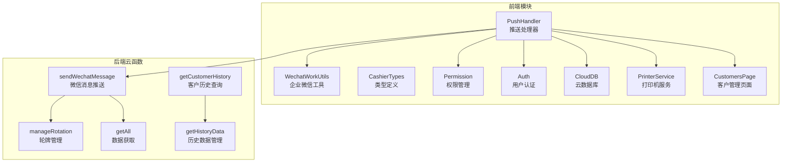

**图表来源**
- [push.handler.ts:1-410](file://miniprogram/pages/cashier/handlers/push.handler.ts#L1-L410)
- [wechat-work.ts:1-16](file://miniprogram/utils/wechat-work.ts#L1-L16)
- [sendWechatMessage/index.js:1-65](file://cloudfunctions/sendWechatMessage/index.js#L1-L65)
- [getCustomerHistory/index.js:1-100](file://cloudfunctions/getCustomerHistory/index.js#L1-L100)
- [getHistoryData/index.js:1-200](file://cloudfunctions/getHistoryData/index.js#L1-L200)

**章节来源**
- [push.handler.ts:1-410](file://miniprogram/pages/cashier/handlers/push.handler.ts#L1-L410)
- [cashier.types.ts:1-102](file://miniprogram/pages/cashier/cashier.types.ts#L1-L102)

## 核心组件

推送处理器由多个核心组件构成，每个组件负责特定的功能领域：

### 主要功能模块

1. **预约推送模块** - 处理预约创建和取消的通知推送
2. **轮牌推送模块** - 处理员工轮班顺序的推送通知
3. **到店通知模块** - **新增**：处理客户到店时的提醒通知，包含智能历史信息
4. **变更通知模块** - 处理预约信息变更的详细通知
5. **权限控制模块** - 管理用户推送权限的验证
6. **企业微信集成功能** - **新增**：支持企业微信ID的智能提及格式化
7. **客户历史跟踪模块** - **新增**：自动查询和格式化客户历史信息

### 数据流架构

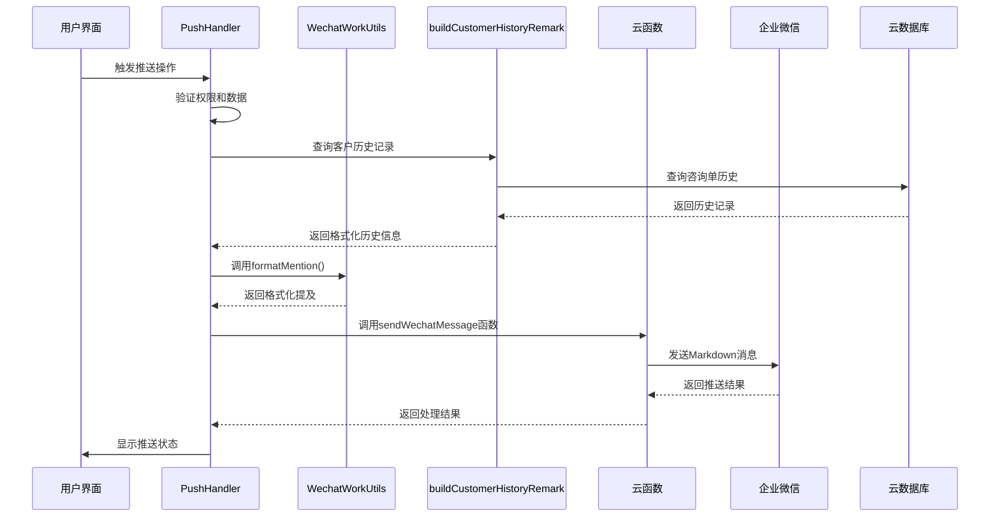

**图表来源**
- [push.handler.ts:184-236](file://miniprogram/pages/cashier/handlers/push.handler.ts#L184-L236)
- [wechat-work.ts:1-16](file://miniprogram/utils/wechat-work.ts#L1-L16)
- [getCustomerHistory/index.js:9-99](file://cloudfunctions/getCustomerHistory/index.js#L9-L99)

**章节来源**
- [push.handler.ts:7-410](file://miniprogram/pages/cashier/handlers/push.handler.ts#L7-L410)

## 架构概览

推送处理器采用分层架构设计，确保功能模块的清晰分离和可维护性：

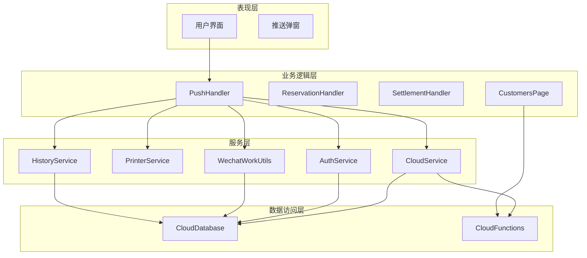

**图表来源**
- [push.handler.ts:1-410](file://miniprogram/pages/cashier/handlers/push.handler.ts#L1-L410)
- [cashier.types.ts:84-102](file://miniprogram/pages/cashier/cashier.types.ts#L84-L102)
- [customers.ts:240-290](file://miniprogram/pages/customers/customers.ts#L240-L290)

### 核心设计原则

1. **单一职责原则** - 每个处理器只负责特定的业务功能
2. **开放封闭原则** - 对扩展开放，对修改封闭
3. **依赖倒置原则** - 高层模块不依赖低层模块
4. **接口隔离原则** - 客户端不应该依赖它不需要的接口
5. **关注点分离** - 企业微信集成与业务逻辑分离
6. **智能化原则** - **新增**：通过历史数据分析提供智能通知内容

## 详细组件分析

### PushHandler 类分析

PushHandler 是推送处理器的核心类，负责协调所有推送相关的操作：

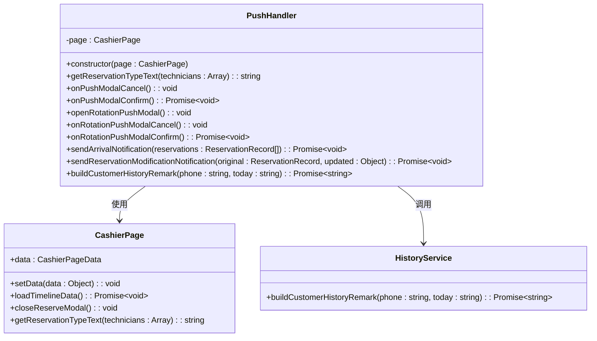

**图表来源**
- [push.handler.ts:21-410](file://miniprogram/pages/cashier/handlers/push.handler.ts#L21-L410)
- [cashier.types.ts:84-102](file://miniprogram/pages/cashier/cashier.types.ts#L84-L102)

#### 关键方法分析

**预约类型文本获取**
- 功能：根据技师状态判断预约类型（点钟/排钟）
- 实现：检查技师数组中是否存在打卡状态的技师
- 复杂度：O(n)，其中 n 为技师数量

**推送确认流程**
- 功能：处理用户确认推送的操作
- 流程：验证数据 → 构建消息内容 → 调用云函数 → 处理返回结果
- 错误处理：包含完整的异常捕获和用户反馈
- **更新**：现在使用formatMention()进行技师提及格式化

**到店通知增强功能**
- 功能：**新增**：处理客户到店通知，自动添加历史信息
- 流程：获取客户信息 → 查询历史记录 → 格式化历史信息 → 构建完整消息
- 特性：支持访问频率统计、上次来访天数、治疗区域分析、偏好技师识别

**章节来源**
- [push.handler.ts:14-410](file://miniprogram/pages/cashier/handlers/push.handler.ts#L14-L410)

### 权限控制系统

推送处理器严格遵循权限控制机制，确保只有具备相应权限的用户才能执行推送操作：

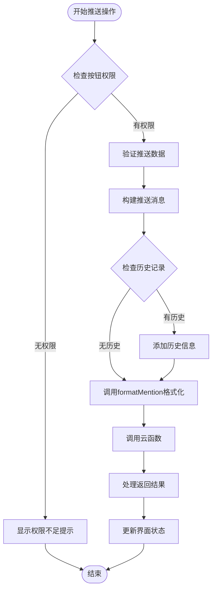

**图表来源**
- [push.handler.ts:125-132](file://miniprogram/pages/cashier/handlers/push.handler.ts#L125-L132)
- [permission.ts:156-161](file://miniprogram/utils/permission.ts#L156-L161)

**章节来源**
- [permission.ts:1-194](file://miniprogram/utils/permission.ts#L1-L194)

### 云函数集成

推送处理器通过云函数实现与企业微信的集成：

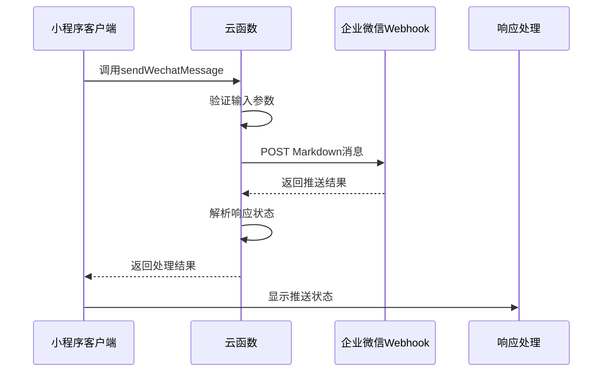

**图表来源**
- [sendWechatMessage/index.js:10-64](file://cloudfunctions/sendWechatMessage/index.js#L10-L64)

**章节来源**
- [sendWechatMessage/index.js:1-65](file://cloudfunctions/sendWechatMessage/index.js#L1-L65)

## 企业微信集成功能

### formatMention() 工具函数

**新增功能**：formatMention()工具函数是本次更新的核心，专门用于企业微信ID的智能提及格式化。

```mermaid
flowchart TD
Start([调用formatMention]) --> CheckStaff{检查员工信息}
CheckStaff --> |无员工信息| ReturnEmpty[返回空字符串]
CheckStaff --> |有员工信息| CheckWechatWorkId{检查企业微信ID}
CheckWechatWorkId --> |有企业微信ID| ReturnWechatMention[返回<@wechatWorkId>格式]
CheckWechatWorkId --> |无企业微信ID| CheckPhone{检查手机号}
CheckPhone --> |有手机号| ReturnPhoneMention[返回姓名<@phone>格式]
CheckPhone --> |无手机号| ReturnName[仅返回姓名]
```

**图表来源**
- [wechat-work.ts:1-16](file://miniprogram/utils/wechat-work.ts#L1-L16)

#### 格式化规则

1. **优先级1**：企业微信ID格式（推荐）
   - 格式：`<@企业微信ID>`
   - 用途：最精确的用户识别，支持企业微信用户

2. **优先级2**：手机号格式
   - 格式：`姓名<@手机号>`
   - 用途：当企业微信ID不可用时的备用方案

3. **优先级3**：纯姓名格式
   - 格式：`姓名`
   - 用途：当其他信息都不可用时的基础格式

**章节来源**
- [wechat-work.ts:1-16](file://miniprogram/utils/wechat-work.ts#L1-L16)

### 技师信息结构更新

**更新**：StaffInfo类型现在包含企业微信ID支持：

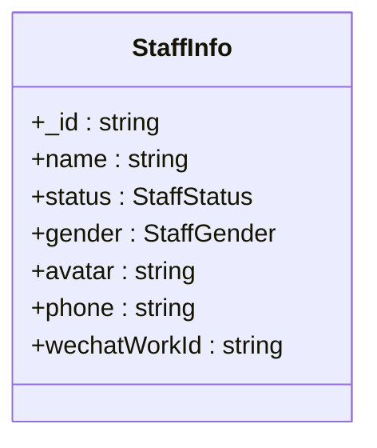

**图表来源**
- [index.d.ts:92-99](file://typings/index.d.ts#L92-L99)

#### 技师信息字段说明

- `_id`：员工唯一标识符
- `name`：员工姓名
- `status`：员工状态（active/disabled）
- `gender`：员工性别
- `avatar`：员工头像URL
- `phone`：员工手机号码
- `wechatWorkId`：**新增**：企业微信用户ID

**章节来源**
- [index.d.ts:92-99](file://typings/index.d.ts#L92-L99)

### 多场景提及格式化应用

**更新**：formatMention()在多个推送场景中得到应用：

1. **预约推送**：在预约创建/取消通知中提及相关技师
2. **到店通知**：在客户到店通知中提及技师
3. **变更通知**：在预约变更通知中提及技师
4. **轮牌推送**：在轮牌通知中提及参与员工

**章节来源**
- [push.handler.ts:61-66](file://miniprogram/pages/cashier/handlers/push.handler.ts#L61-L66)
- [push.handler.ts:225-227](file://miniprogram/pages/cashier/handlers/push.handler.ts#L225-L227)
- [push.handler.ts](file://miniprogram/pages/cashier/handlers/push.handler.ts#L321)

## 客户历史跟踪功能

### buildCustomerHistoryRemark() 私有方法

**新增功能**：buildCustomerHistoryRemark()是客户历史跟踪功能的核心，负责自动查询和格式化客户历史信息。

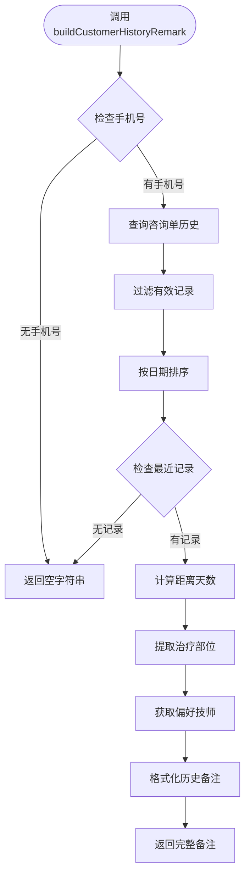

**图表来源**
- [push.handler.ts:242-272](file://miniprogram/pages/cashier/handlers/push.handler.ts#L242-L272)

#### 历史信息维度

1. **访问频率统计**
   - 计算客户总消费次数
   - 统计当前消费为第几次到店

2. **时间间隔分析**
   - 计算距离上次到店的天数
   - 分析客户的到店频率模式

3. **治疗区域偏好**
   - 提取上次需要加强的部位
   - 分析客户的身体部位偏好

4. **技师偏好识别**
   - 记录上次服务的技师
   - 为后续服务安排提供参考

#### 历史数据查询逻辑

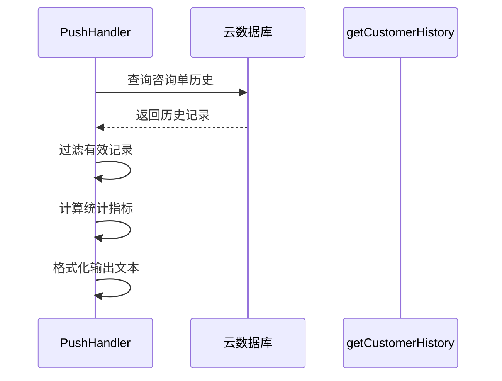

**图表来源**
- [push.handler.ts:242-272](file://miniprogram/pages/cashier/handlers/push.handler.ts#L242-L272)
- [getCustomerHistory/index.js:22-47](file://cloudfunctions/getCustomerHistory/index.js#L22-L47)

**章节来源**
- [push.handler.ts:242-272](file://miniprogram/pages/cashier/handlers/push.handler.ts#L242-L272)
- [getCustomerHistory/index.js:1-100](file://cloudfunctions/getCustomerHistory/index.js#L1-L100)

### 客户访问序列计算修复

**更新**：客户备注生成逻辑已修复，确保准确反映客户的访问序列

在 `buildCustomerHistoryRemark()` 方法中，客户访问次数的计算逻辑已从 `records.length` 修正为 `records.length+1`：

```typescript
// 修复前：return `\n备注：老客，第${records.length}次消费，上次到店：${diffDays}天前，上次需加强部位：${partsText}，上次服务技师：${lastRecord.technician || '无'}`;
// 修复后：
return `\n备注：老客，第${records.length+1}次消费，上次到店：${diffDays}天前，上次需加强部位：${partsText}，上次服务技师：${lastRecord.technician || '无'}`;
```

**修复说明**：
- **问题**：原始逻辑使用 `records.length` 仅统计了历史记录数量，未包含当前这次消费
- **解决方案**：使用 `records.length+1` 正确计算客户的累计访问次数
- **影响范围**：所有使用 `buildCustomerHistoryRemark()` 方法的到店通知和客户历史展示

**章节来源**
- [push.handler.ts:267-269](file://miniprogram/pages/cashier/handlers/push.handler.ts#L267-L269)

### 历史数据查询云函数

**新增**：getCustomerHistory云函数专门负责客户历史数据的查询和聚合：

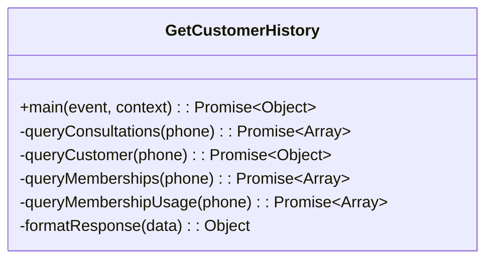

**图表来源**
- [getCustomerHistory/index.js:9-99](file://cloudfunctions/getCustomerHistory/index.js#L9-L99)

#### 查询功能特性

1. **多表联合查询**
   - 咨询单历史记录
   - 客户基本信息
   - 会员卡关联信息
   - 会员使用记录

2. **数据聚合处理**
   - 计算总消费次数
   - 统计总消费金额
   - 过滤作废记录

3. **响应格式标准化**
   - 统一的数据结构
   - 完整的错误处理
   - 标准化的返回格式

**章节来源**
- [getCustomerHistory/index.js:1-100](file://cloudfunctions/getCustomerHistory/index.js#L1-L100)

### 历史数据在客户管理中的应用

**新增**：客户管理页面也集成了历史数据查询功能：

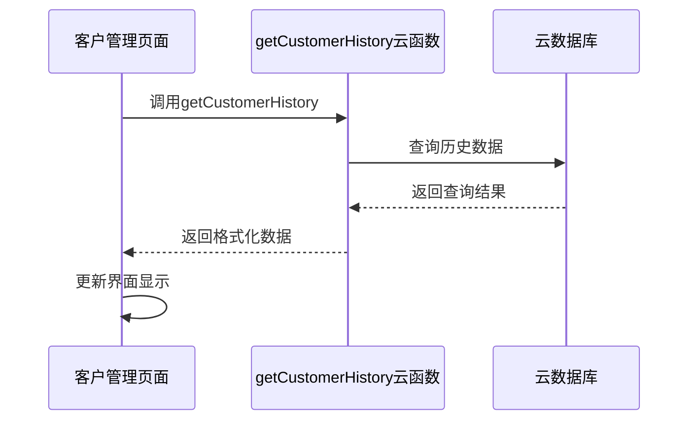

**图表来源**
- [customers.ts:244-279](file://miniprogram/pages/customers/customers.ts#L244-L279)

#### 客户详情展示

1. **历史消费记录**
   - 按时间倒序排列
   - 显示项目和服务信息
   - 标识作废记录

2. **会员卡信息**
   - 当前有效的会员卡
   - 剩余次数和余额
   - 销售员工信息

3. **统计数据**
   - 总消费次数
   - 总消费金额
   - 会员卡使用情况

**章节来源**
- [customers.ts:240-290](file://miniprogram/pages/customers/customers.ts#L240-L290)

## 依赖关系分析

推送处理器的依赖关系体现了清晰的分层架构：

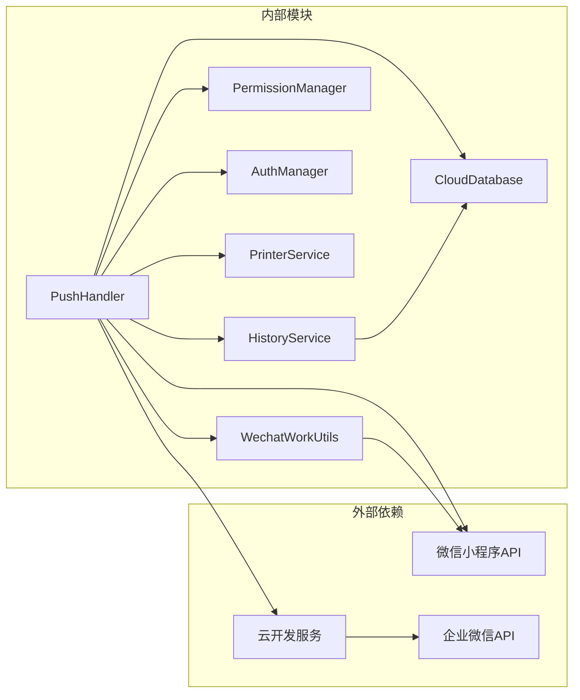

**图表来源**
- [push.handler.ts:1-410](file://miniprogram/pages/cashier/handlers/push.handler.ts#L1-L410)
- [auth.ts:1-245](file://miniprogram/utils/auth.ts#L1-L245)

### 关键依赖关系

1. **权限依赖**：PushHandler 依赖 PermissionManager 进行权限验证
2. **认证依赖**：通过 AuthManager 管理用户身份认证
3. **数据依赖**：使用 CloudDatabase 进行数据查询和操作
4. **云函数依赖**：通过 wx.cloud.callFunction 调用后端服务
5. **第三方依赖**：依赖企业微信Webhook进行消息推送
6. **工具函数依赖**：**新增**：依赖WechatWorkUtils进行提及格式化
7. **历史数据依赖**：**新增**：依赖getCustomerHistory云函数进行历史查询

**章节来源**
- [app.ts:1-191](file://miniprogram/app.ts#L1-L191)
- [cloud-db.ts:1-321](file://miniprogram/utils/cloud-db.ts#L1-L321)

## 性能考虑

推送处理器在设计时充分考虑了性能优化：

### 异步处理优化
- 所有网络请求都采用异步方式处理
- 使用 Promise 和 async/await 确保非阻塞操作
- 合理的超时处理和错误恢复机制

### 内存管理
- 及时清理事件监听器和定时器
- 合理的缓存策略避免重复数据获取
- 及时释放大对象占用的内存

### 网络优化
- 批量数据处理减少网络往返次数
- 合理的数据分页和缓存策略
- 错误重试机制提升成功率

### **新增**：企业微信提及格式化优化
- **formatMention()函数**：采用短路求值，优先检查企业微信ID
- **批量格式化**：在多个推送场景中复用同一格式化逻辑
- **空值处理**：智能处理缺失的企业微信ID和手机号信息

### **新增**：历史数据查询优化
- **buildCustomerHistoryRemark()方法**：采用懒加载策略，仅在需要时查询历史
- **数据过滤**：先过滤无效记录再进行统计计算
- **错误容错**：历史查询失败不影响主推送流程
- **查询限制**：限制历史记录查询数量，避免性能问题

## 故障排除指南

### 常见问题及解决方案

**推送失败问题**
- 检查企业微信Webhook配置是否正确
- 验证网络连接状态
- 确认用户权限是否足够
- 查看云函数日志获取详细错误信息

**权限验证失败**
- 确认用户角色和权限配置
- 检查本地存储的用户信息
- 验证权限映射表配置

**数据获取异常**
- 检查云数据库连接状态
- 验证集合名称和字段权限
- 确认数据格式和约束条件

**企业微信提及格式化问题**
- **企业微信ID为空**：检查员工信息录入是否完整
- **提及格式不正确**：验证formatMention()函数逻辑
- **推送消息中出现乱码**：确认企业微信ID编码格式

**客户历史跟踪问题**
- **历史记录查询失败**：检查手机号格式和数据库连接
- **历史信息显示异常**：验证历史数据结构和格式化逻辑
- **访问序列计算错误**：检查 `records.length+1` 计算逻辑
- **性能问题**：检查历史记录查询限制和缓存策略

**章节来源**
- [push.handler.ts:115-121](file://miniprogram/pages/cashier/handlers/push.handler.ts#L115-L121)
- [sendWechatMessage/index.js:58-64](file://cloudfunctions/sendWechatMessage/index.js#L58-L64)

### 调试技巧

1. **启用详细日志**：在开发模式下查看完整的错误堆栈
2. **网络监控**：使用开发者工具监控网络请求和响应
3. **权限测试**：模拟不同角色用户测试权限控制
4. **边界测试**：测试空数据、异常数据等边界情况
5. **企业微信ID测试**：分别测试有/无企业微信ID的场景
6. **历史数据测试**：分别测试有/无历史记录的客户场景
7. **访问序列测试**：验证 `records.length+1` 计算的准确性

## 结论

推送处理器作为ConsultationPrinter小程序的核心功能模块，展现了良好的软件工程实践：

### 设计优势
- **模块化设计**：清晰的功能分离和职责划分
- **权限控制**：完善的用户权限管理和安全控制
- **异步处理**：高效的异步操作和错误处理机制
- **可扩展性**：灵活的架构设计支持功能扩展
- **企业微信集成**：**新增**：完整的企业微信ID支持和提及格式化
- **智能化功能**：**新增**：基于历史数据的智能通知内容生成

### 技术亮点
- **前后端分离**：清晰的前后端职责分工
- **云原生架构**：充分利用云开发服务的优势
- **类型安全**：完整的TypeScript类型定义
- **用户体验**：友好的用户界面和反馈机制
- **智能提及格式化**：**新增**：基于企业微信ID的智能通知格式化
- **历史数据分析**：**新增**：自动分析客户行为模式，提供个性化服务建议
- **访问序列准确性**：**新增**：修复客户访问次数计算，确保历史信息准确可靠

### 改进建议
1. **监控告警**：增加推送成功率和错误率监控
2. **重试机制**：实现智能重试和退避算法
3. **日志审计**：建立完整的操作日志和审计功能
4. **性能优化**：进一步优化大数据量场景下的处理效率
5. **企业微信ID管理**：**新增**：提供企业微信ID批量导入和同步功能
6. **历史数据挖掘**：**新增**：深入分析客户消费模式，提供营销建议
7. **智能推荐系统**：**新增**：基于历史数据为客户推荐合适的技师和项目
8. **数据一致性保证**：**新增**：确保历史数据查询和访问序列计算的一致性

推送处理器为整个ConsultationPrinter系统提供了可靠的通信基础设施，为业务发展奠定了坚实的技术基础。**最新的企业微信集成功能、客户历史跟踪功能以及访问序列计算修复**显著提升了通知系统的智能化水平，为企业内部沟通和客户服务提供了更加精准和高效的服务体验。这些功能不仅改善了员工的工作效率，也为客户提供了更加个性化的服务体验，是ConsultationPrinter系统的重要技术突破。