# 收银台数据加载服务

<cite>
**本文档引用的文件**
- [data-loader.service.ts](file://miniprogram/pages/cashier/services/data-loader.service.ts)
- [cashier.types.ts](file://miniprogram/pages/cashier/cashier.types.ts)
- [cashier.ts](file://miniprogram/pages/cashier/cashier.ts)
- [cashier.new.ts](file://miniprogram/pages/cashier/cashier.new.ts)
- [cloud-db.ts](file://miniprogram/utils/cloud-db.ts)
- [loading-service.ts](file://miniprogram/utils/loading-service.ts)
- [util.ts](file://miniprogram/utils/util.ts)
- [constants.ts](file://miniprogram/utils/constants.ts)
- [getAvailableTechnicians/index.js](file://cloudfunctions/getAvailableTechnicians/index.js)
- [manageRotation/index.js](file://cloudfunctions/manageRotation/index.js)
- [reservation.handler.ts](file://miniprogram/pages/cashier/handlers/reservation.handler.ts)
- [settlement.handler.ts](file://miniprogram/pages/cashier/handlers/settlement.handler.ts)
- [push.handler.ts](file://miniprogram/pages/cashier/handlers/push.handler.ts)
- [app.ts](file://miniprogram/app.ts)
- [auth.ts](file://miniprogram/utils/auth.ts)
- [permission.ts](file://miniprogram/utils/permission.ts)
- [customer-match.ts](file://miniprogram/pages/cashier/utils/customer-match.ts)
- [index.d.ts](file://typings/index.d.ts)
- [cloud-function.d.ts](file://typings/cloud-function.d.ts)
</cite>

## 更新摘要
**变更内容**
- 更新了单次云函数调用优化的实现细节
- 增强了 `prepareRotationList()` 方法处理新的双模式云函数响应格式
- 新增了快速预约槽位数据结构说明
- 更新了云函数模式参数和响应格式

## 目录
1. [简介](#简介)
2. [项目结构](#项目结构)
3. [核心组件](#核心组件)
4. [架构概览](#架构概览)
5. [详细组件分析](#详细组件分析)
6. [依赖关系分析](#依赖关系分析)
7. [性能考虑](#性能考虑)
8. [故障排除指南](#故障排除指南)
9. [结论](#结论)

## 简介

收银台数据加载服务是微信小程序"ConsultationPrinter"中的核心数据管理模块，负责为收银台页面提供完整的工作日数据加载、技师可用性计算、轮牌队列管理和实时数据同步功能。该服务通过并行数据获取、智能缓存策略和统一的加载状态管理，确保收银台界面能够快速响应用户操作并提供准确的业务数据。

**更新** 服务现已实现单次云函数调用优化，通过 `mode: 'rotationQuickSlots'` 参数实现轮牌列表和快速预约槽位的统一计算，显著减少了API调用开销。

该服务采用模块化设计，将数据加载逻辑与UI逻辑分离，通过服务层抽象出复杂的数据获取和处理流程，为上层的预约管理、结算处理和推送通知等功能提供可靠的数据支持。

## 项目结构

收银台数据加载服务位于小程序的pages/cashier目录结构中，采用分层架构设计：

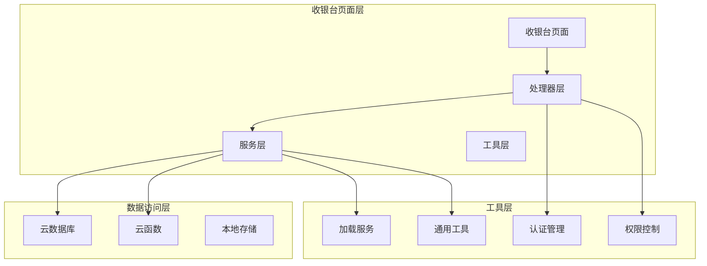

**图表来源**
- [cashier.ts](file://miniprogram/pages/cashier/cashier.ts#L1-L408)
- [data-loader.service.ts](file://miniprogram/pages/cashier/services/data-loader.service.ts#L1-L194)

**章节来源**
- [cashier.ts](file://miniprogram/pages/cashier/cashier.ts#L1-L408)
- [cashier.types.ts](file://miniprogram/pages/cashier/cashier.types.ts#L1-L122)

## 核心组件

### 数据加载服务 (CashierDataLoaderService)

数据加载服务是收银台的核心组件，负责协调所有数据获取和处理操作。该服务提供了以下主要功能：

- **初始数据加载**：并行获取房间、员工、预约和轮牌等基础数据，**优化**：通过单次云函数调用获取轮牌列表和快速预约槽位
- **时间轴数据刷新**：动态更新时间轴上的预约和结算状态
- **技师可用性计算**：基于当前时间和项目时长计算技师可用时间段
- **轮牌队列管理**：维护和更新技师轮牌顺序

### 类型定义系统

系统采用严格的类型定义确保代码的类型安全性和可维护性：

- **CashierPageData**：定义收银台页面的完整状态结构，**新增**：包含 `quickReservationSlots` 字段
- **StaffAvailability**：技师可用性数据模型
- **RotationItem**：轮牌项数据模型
- **PaymentMethodItem**：支付方式数据模型
- **QuickReservation**：快速预约槽位数据模型，包含时间字符串和技师姓名数组

### 处理器架构

系统采用处理器模式分离关注点：

- **ReservationHandler**：预约相关操作处理
- **SettlementHandler**：结算相关操作处理  
- **PushHandler**：推送通知处理
- **CustomerMatch**：顾客匹配工具

**章节来源**
- [data-loader.service.ts](file://miniprogram/pages/cashier/services/data-loader.service.ts#L18-L194)
- [cashier.types.ts](file://miniprogram/pages/cashier/cashier.types.ts#L53-L122)
- [index.d.ts](file://typings/index.d.ts#L505-L508)

## 架构概览

收银台数据加载服务采用分层架构，各层职责明确，耦合度低：

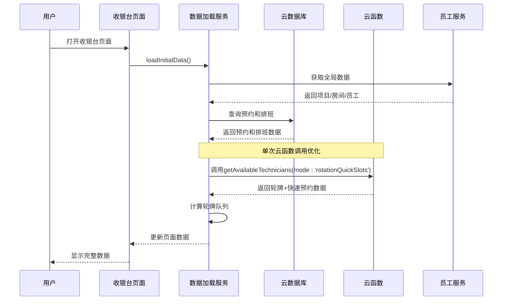

**图表来源**
- [cashier.ts](file://miniprogram/pages/cashier/cashier.ts#L106-L133)
- [data-loader.service.ts](file://miniprogram/pages/cashier/services/data-loader.service.ts#L30-L85)

### 数据流架构

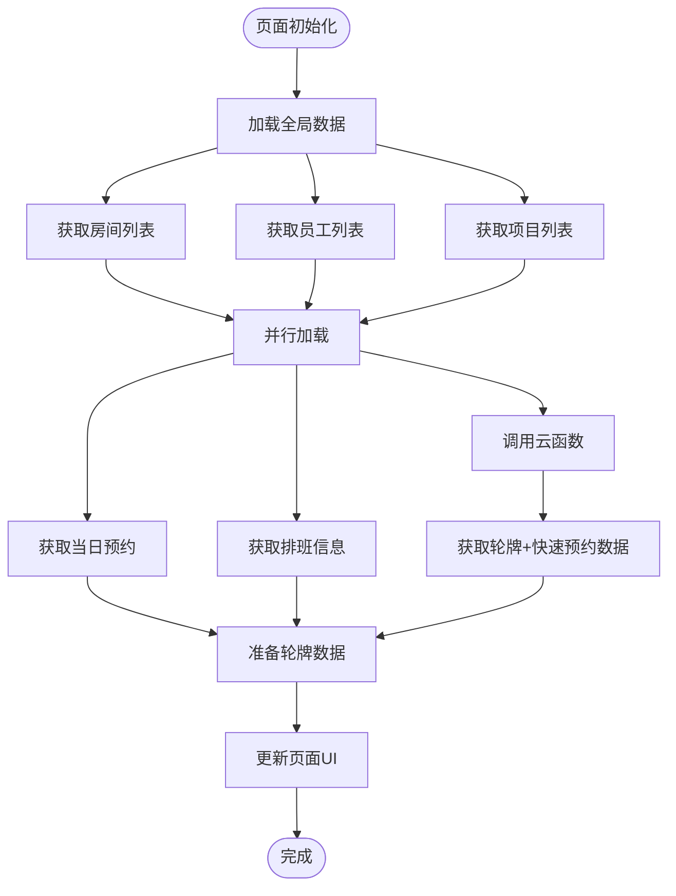

**图表来源**
- [data-loader.service.ts](file://miniprogram/pages/cashier/services/data-loader.service.ts#L36-L50)
- [app.ts](file://miniprogram/app.ts#L40-L66)

## 详细组件分析

### 数据加载服务实现

数据加载服务通过精心设计的算法确保数据的准确性和实时性：

#### 初始数据加载流程

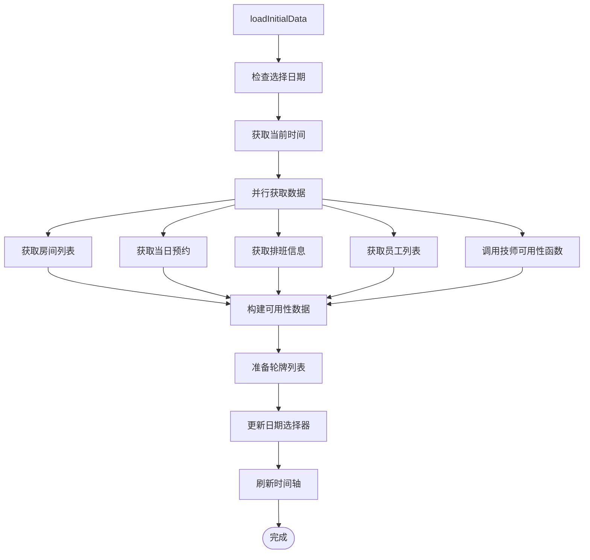

**图表来源**
- [data-loader.service.ts](file://miniprogram/pages/cashier/services/data-loader.service.ts#L30-L85)

#### 轮牌队列计算算法

轮牌队列计算是数据加载服务的核心算法之一，负责根据技师的当前状态和工作安排计算可用时间段：

```mermaid
flowchart TD
CalculateAvailableTime[calculateAvailableTime] --> GetOccupiedSlots[获取占用时间段]
GetOccupiedSlots --> SortSlots[按开始时间排序]
SortSlots --> FindStartTime[确定开始计算时间]
FindStartTime --> LoopSlots[遍历时间段]
LoopSlots --> CheckSlot[检查时间段]
CheckSlot --> Gap>=60[间隔≥60分钟?]
Gap>=60 --> |是| AddSlot[添加可用时间段]
Gap>=60 --> |否| NextSlot[下一个时间段]
AddSlot --> NextSlot
NextSlot --> LoopSlots
LoopSlots --> |完成| ReturnSlots[返回可用时间段]
ReturnSlots --> Complete([完成])
```

**图表来源**
- [data-loader.service.ts](file://miniprogram/pages/cashier/services/data-loader.service.ts#L171-L214)

#### 技师可用性预加载机制

系统实现了智能的技师可用性预加载机制，为预约弹窗提供实时的可用性信息：

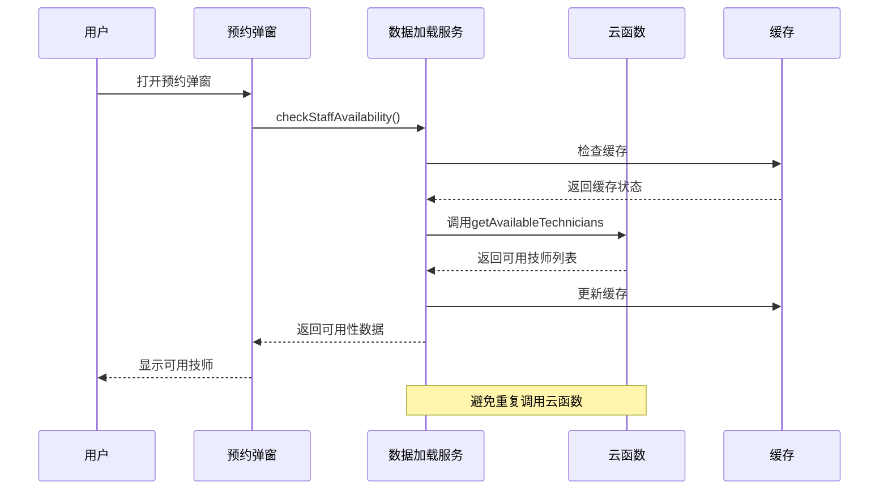

**图表来源**
- [reservation.handler.ts](file://miniprogram/pages/cashier/handlers/reservation.handler.ts#L130-L195)

**更新** 单次云函数调用优化实现

**章节来源**
- [data-loader.service.ts](file://miniprogram/pages/cashier/services/data-loader.service.ts#L106-L194)
- [reservation.handler.ts](file://miniprogram/pages/cashier/handlers/reservation.handler.ts#L130-L195)

### 数据模型设计

系统采用标准化的数据模型确保数据的一致性和完整性：

#### 核心数据模型

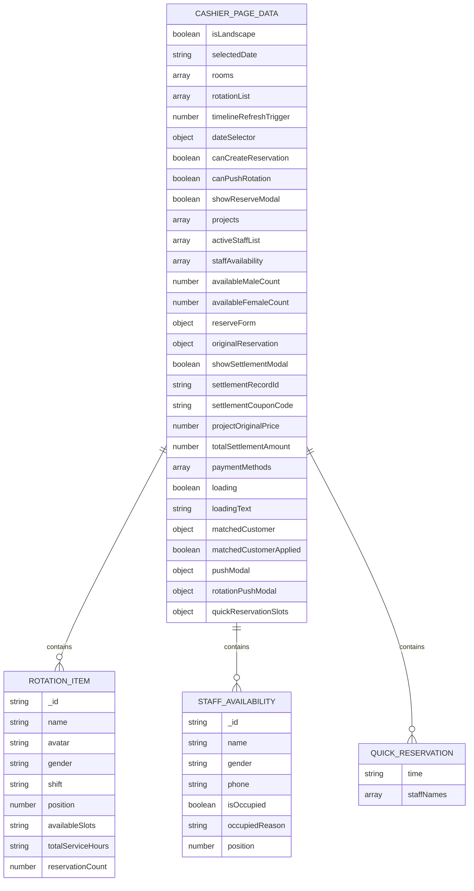

**图表来源**
- [cashier.types.ts](file://miniprogram/pages/cashier/cashier.types.ts#L63-L122)
- [index.d.ts](file://typings/index.d.ts#L505-L508)

**章节来源**
- [cashier.types.ts](file://miniprogram/pages/cashier/cashier.types.ts#L1-L122)
- [index.d.ts](file://typings/index.d.ts#L505-L508)

### 错误处理和状态管理

系统实现了完善的错误处理和状态管理机制：

#### 加载状态管理

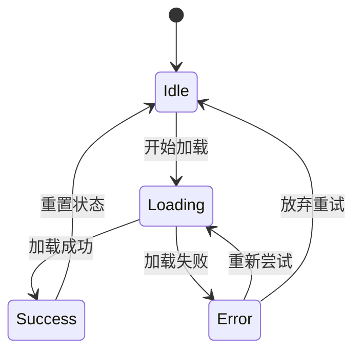

**图表来源**
- [loading-service.ts](file://miniprogram/utils/loading-service.ts#L34-L142)

#### 锁机制设计

系统使用锁机制防止重复操作和竞态条件：

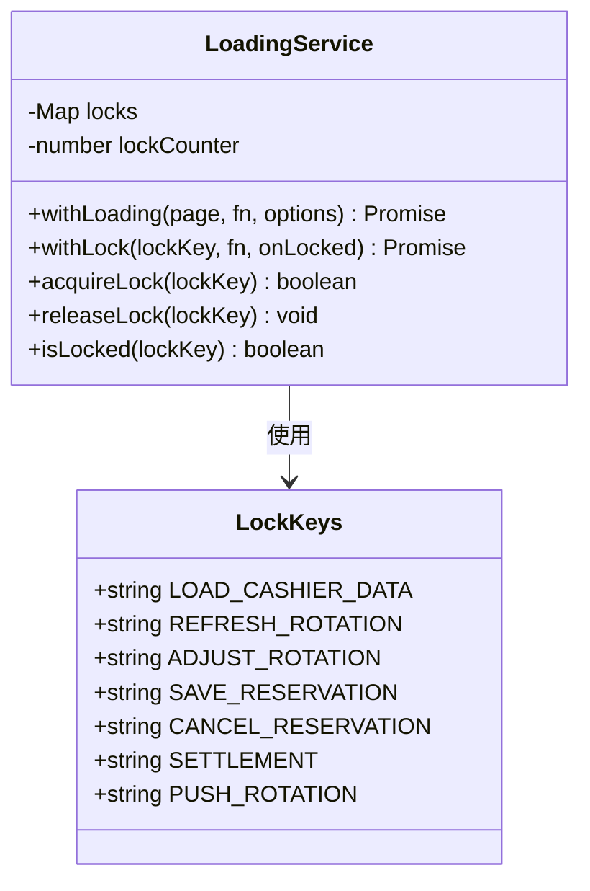

**图表来源**
- [loading-service.ts](file://miniprogram/utils/loading-service.ts#L34-L282)

**章节来源**
- [loading-service.ts](file://miniprogram/utils/loading-service.ts#L1-L282)

## 依赖关系分析

收银台数据加载服务的依赖关系清晰明确，各组件间耦合度低：

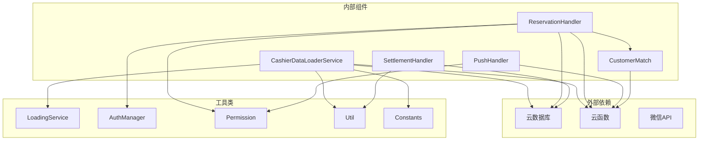

**图表来源**
- [data-loader.service.ts](file://miniprogram/pages/cashier/services/data-loader.service.ts#L1-L194)
- [reservation.handler.ts](file://miniprogram/pages/cashier/handlers/reservation.handler.ts#L1-L800)

### 数据访问模式

系统采用多种数据访问模式确保数据的高效获取：

#### 并行数据获取模式

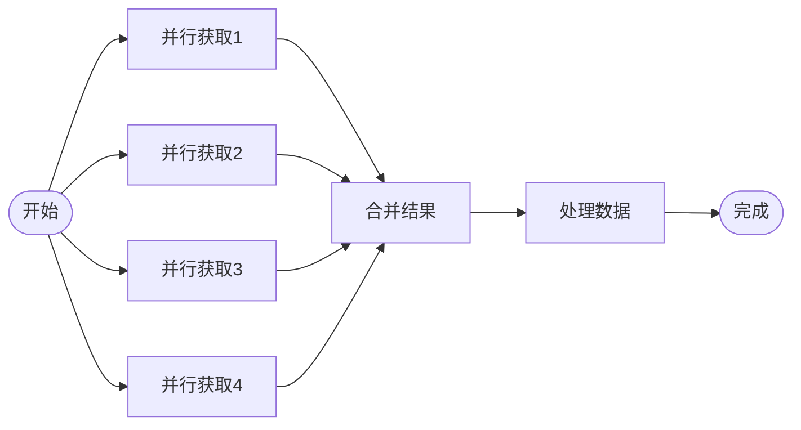

**图表来源**
- [data-loader.service.ts](file://miniprogram/pages/cashier/services/data-loader.service.ts#L36-L50)

#### 缓存策略

系统实现了多层次的缓存策略：

- **全局数据缓存**：项目、房间、员工等静态数据
- **会话级缓存**：当前页面的动态数据
- **云函数缓存**：重复的技师可用性查询结果

**更新** 单次云函数调用优化

**章节来源**
- [data-loader.service.ts](file://miniprogram/pages/cashier/services/data-loader.service.ts#L30-L85)
- [app.ts](file://miniprogram/app.ts#L40-L66)

## 性能考虑

收银台数据加载服务在设计时充分考虑了性能优化：

### 并行处理优化

系统通过并行数据获取显著提升了加载速度：

- **并行数据库查询**：同时获取多个集合的数据
- **异步云函数调用**：避免阻塞主线程
- **智能缓存策略**：减少重复数据获取
- **单次云函数调用优化**：通过 `mode: 'rotationQuickSlots'` 参数实现轮牌和快速预约槽位的统一计算

### 内存管理

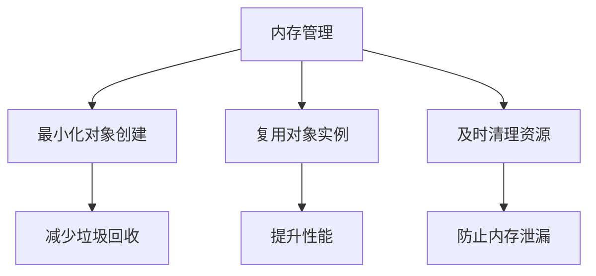

### 网络优化

- **批量数据获取**：减少网络请求次数
- **数据压缩传输**：减小数据传输量
- **断线重试机制**：提高数据获取成功率

**更新** 单次云函数调用显著减少了API调用开销

## 故障排除指南

### 常见问题及解决方案

#### 数据加载失败

**问题症状**：页面长时间显示加载状态，数据无法获取

**可能原因**：
- 网络连接异常
- 云数据库查询超时
- 权限验证失败
- **新增**：云函数模式参数错误

**解决步骤**：
1. 检查网络连接状态
2. 验证用户权限
3. 查看云函数执行日志
4. **新增**：验证 `mode: 'rotationQuickSlots'` 参数设置
5. 重试数据加载操作

#### 技师可用性计算错误

**问题症状**：技师可用时间段显示不正确

**可能原因**：
- 时间段重叠计算错误
- 排班信息不完整
- 当前预约状态异常
- **新增**：快速预约槽位数据格式不匹配

**解决步骤**：
1. 检查技师排班数据
2. 验证预约冲突检测逻辑
3. 确认时间格式一致性
4. **新增**：验证 `QuickReservation` 数据结构
5. 重新计算可用时间段

#### 轮牌队列更新失败

**问题症状**：技师轮牌顺序不正确或更新无效

**可能原因**：
- 轮牌队列数据结构异常
- 位置调整算法错误
- 云函数执行失败
- **新增**：双模式云函数响应格式处理错误

**解决步骤**：
1. 验证轮牌队列数据完整性
2. 检查位置调整逻辑
3. 查看云函数执行结果
4. **新增**：验证 `rotationItems` 和 `quickReservationSlots` 格式
5. 重新加载轮牌数据

**章节来源**
- [loading-service.ts](file://miniprogram/utils/loading-service.ts#L117-L141)
- [data-loader.service.ts](file://miniprogram/pages/cashier/services/data-loader.service.ts#L171-L214)

## 结论

收银台数据加载服务通过模块化设计、并行处理优化和智能缓存策略，为微信小程序提供了高效、可靠的收银台数据管理能力。该服务不仅满足了当前的功能需求，还具备良好的扩展性和维护性。

**更新** 通过实现单次云函数调用优化，服务现在能够通过 `mode: 'rotationQuickSlots'` 参数实现轮牌列表和快速预约槽位的统一计算，显著减少了API调用开销，提升了整体性能。

### 主要优势

1. **高性能**：通过并行数据获取和智能缓存显著提升响应速度，**新增**：单次云函数调用优化进一步降低API开销
2. **类型安全**：严格的类型定义确保代码质量和开发效率，**新增**：完整的 `QuickReservation` 类型支持
3. **可维护性**：清晰的模块划分和职责分离便于代码维护
4. **用户体验**：流畅的加载体验和实时数据更新

### 技术亮点

- **并发数据处理**：多路并行数据获取优化
- **智能缓存机制**：多层次缓存策略提升性能
- **完善的错误处理**：健壮的异常处理和恢复机制
- **模块化架构**：清晰的职责分离和依赖管理
- ****新增**：单次云函数调用优化，通过双模式响应格式提升性能

该服务为后续的功能扩展奠定了坚实的基础，能够支持更复杂的业务场景和更高的并发需求。